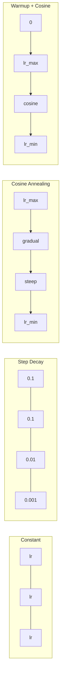
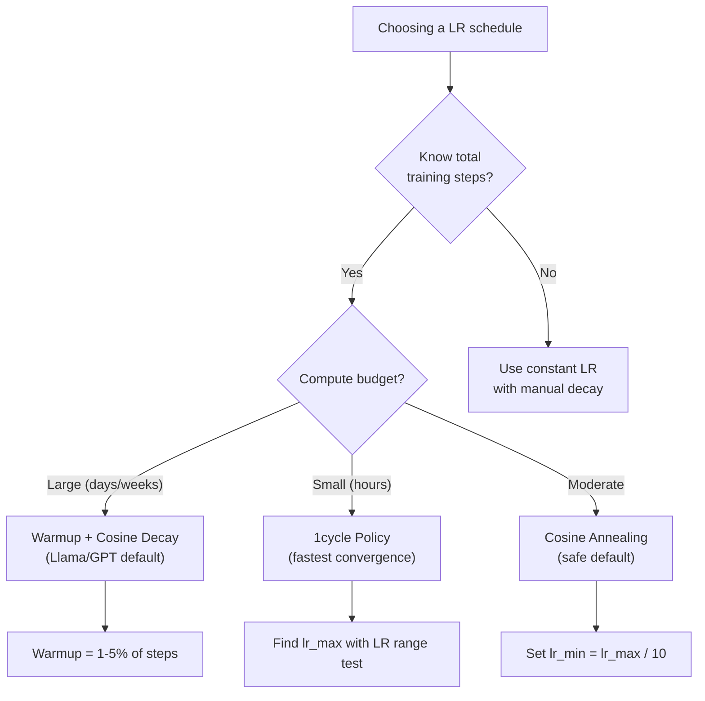
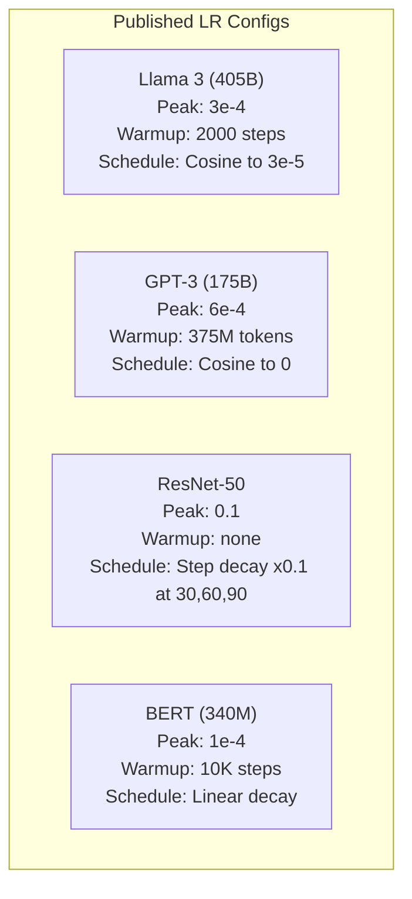

# 学习率 Schedules 和 Warmup

> 学习率 是 single most important hyperparameter. Not 架构. Not 数据set size. Not 激活 函数. 学习率. If 你 tune nothing else, tune 这.

**Type:** 构建
**Languages:** Python
**Prerequisites:** Lesson 03.06 (优化器), Lesson 03.08 (Weight Initialization)
**Time:** ~90 minutes

## 学习目标

- 实现 constant, 步骤 decay, cosine annealing, warmup + cosine, 和 1cycle 学习率 schedules 从零实现
- Demonstrate three 失败 modes of 学习率 selection: divergence (too high), stalling (too low), 和 oscillation (没有 decay)
- 解释 为什么 warmup 是 necessary 用于 Adam-based 优化器 和 如何 it stabilizes early 训练
- 比较 convergence speed across all five schedules 在 same 任务 和 选择 appropriate one 用于 a given 训练 budget

## 问题

Set 学习率 到 0.1. 训练 diverges -- 损失 jumps 到 infinity 在 3 步骤. Set it 到 0.0001. 训练 crawls -- 之后 100 轮次, 模型 has barely moved 从 random. Set it 到 0.01. 训练 works 用于 50 轮次, 然后 损失 oscillates around a minimum it can never reach 因为 步骤 是 too large.

optimal 学习率 是 不 a constant. It changes during 训练. Early 在, 你 want large 步骤 到 cover ground quickly. Late 在 训练, 你 want tiny 步骤 到 settle into a sharp minimum. difference between a 90% accurate 模型 和 a 95% accurate 模型 是 often just schedule.

Every major 模型 published 在 last three years uses a 学习率 schedule. Llama 3 used peak lr=3e-4 用 2000 warmup 步骤 和 cosine decay 到 3e-5. GPT-3 used lr=6e-4 用 warmup over 375 million tokens. 这些 是 不 arbitrary choices. They 是 result of extensive hyperparameter sweeps that cost millions of dollars.

你需要 understand schedules 因为 defaults will 不 work 用于 你的 问题. When 你 fine-tune a pretrained 模型, right schedule 是 different than 训练 从零实现. When 你 增加 批次 size, warmup period needs 到 change. When 训练 breaks at 步骤 10,000, 你 need 到 know whether it's a schedule 问题 或 something else.

## 概念

### Constant 学习率

simplest approach. Pick a number, 使用 it 用于 every 步骤.

```
lr(t) = lr_0
```

Rarely optimal. It's either too high 用于 end of 训练 (oscillation around minimum) 或 too low 用于 beginning (wasted compute 在 tiny 步骤). Works fine 用于 small 模型s 和 debugging. A terrible choice 用于 anything that trains 用于 more than an hour.

### Step Decay

old-school approach 从 ResNet era. Cut 学习率 by a factor (usually 10x) at fixed 轮次.

```
lr(t) = lr_0 * gamma^(floor(epoch / step_size))
```

Where gamma = 0.1 和 step_size = 30 means: lr drops by 10x every 30 轮次. ResNet-50 used 这 -- lr=0.1, drop by 10x at 轮次 30, 60, 和 90.

问题: optimal decay points depend 在 数据set 和 架构. Move 到 a different 问题 和 你 need 到 re-tune 当 到 drop. transitions 是 abrupt -- 损失 can spike 当 rate suddenly changes.

### Cosine Annealing

Smooth decay 从 maximum 学习率 到 a minimum, following a cosine curve:

```
lr(t) = lr_min + 0.5 * (lr_max - lr_min) * (1 + cos(pi * t / T))
```

Where t 是 current 步骤 和 T 是 total number of 步骤.

At t=0, cosine term 是 1, so lr = lr_max. At t=T, cosine term 是 -1, so lr = lr_min. decay 是 gentle at first, accelerates 在 middle, 和 becomes gentle again near end.

这 是 默认 用于 most modern 训练 runs. No hyper参数 到 tune beyond lr_max 和 lr_min. cosine 形状 matches empirical observation that most learning happens 在 middle of 训练 -- 你 want reasonable 步骤 sizes during that critical period.

### Warmup: Why 你 开始 Small

Adam 和 other adaptive 优化器 maintain running estimates of 梯度 均值 和 方差. At 步骤 0, these estimates 是 initialized 到 zero. first few 梯度 updates 是 based 在 garbage statistics. If 你的 学习率 是 large during 这 period, 模型 takes huge, poorly-directed 步骤.

Warmup fixes 这. 开始 用 a tiny 学习率 (often lr_max / warmup_steps 或 even zero) 和 linearly ramp up 到 lr_max over first N 步骤. By time 你 reach full 学习率, Adam's statistics have stabilized.

```
lr(t) = lr_max * (t / warmup_steps)     for t < warmup_steps
```

Typical warmup: 1-5% of total 训练 步骤. Llama 3 trained 用于 ~1.8 trillion tokens 和 warmed up 用于 2000 步骤. GPT-3 warmed up over 375 million tokens.

### Linear Warmup + Cosine Decay

modern 默认. Ramp up linearly, 然后 decay 用 cosine:

```
if t < warmup_steps:
    lr(t) = lr_max * (t / warmup_steps)
else:
    progress = (t - warmup_steps) / (total_steps - warmup_steps)
    lr(t) = lr_min + 0.5 * (lr_max - lr_min) * (1 + cos(pi * progress))
```

这 是 what Llama, GPT, PaLM, 和 most modern transformers 使用. warmup prevents early instability. cosine decay settles 模型 into a good minimum.

### 1cycle Policy

Leslie Smith's discovery (2018): ramp 学习率 up 从 a low 值 到 a high 值 在 first half of 训练, 然后 ramp it back down 在 second half. Counterintuitive -- 为什么 would 你 *增加* 学习率 midway through?

theory: a high 学习率 acts as 正则化 by adding 噪声 到 optimization trajectory. 模型 explores more of 损失 landscape during ramp-up phase, finding better basins. ramp-down phase 然后 refines within best basin found.

```
Phase 1 (0 to T/2):    lr ramps from lr_max/25 to lr_max
Phase 2 (T/2 to T):    lr ramps from lr_max to lr_max/10000
```

1cycle often trains faster than cosine annealing 用于 a fixed compute budget. tradeoff: 你 must know total number of 步骤 在 advance.

### Schedule Shapes



### Decision Flowchart



### Real Numbers 从 Published 模型s



```figure
lr-schedule
```

## 动手构建

### Step 1: Schedule Functions

Each 函数 takes current 步骤 和 returns 学习率 at that 步骤.

```python
import math


def constant_schedule(step, lr=0.01, **kwargs):
    return lr


def step_decay_schedule(step, lr=0.1, step_size=100, gamma=0.1, **kwargs):
    return lr * (gamma ** (step // step_size))


def cosine_schedule(step, lr=0.01, total_steps=1000, lr_min=1e-5, **kwargs):
    if step >= total_steps:
        return lr_min
    return lr_min + 0.5 * (lr - lr_min) * (1 + math.cos(math.pi * step / total_steps))


def warmup_cosine_schedule(step, lr=0.01, total_steps=1000, warmup_steps=100, lr_min=1e-5, **kwargs):
    if total_steps <= warmup_steps:
        return lr * (step / max(warmup_steps, 1))
    if step < warmup_steps:
        return lr * step / warmup_steps
    progress = (step - warmup_steps) / (total_steps - warmup_steps)
    return lr_min + 0.5 * (lr - lr_min) * (1 + math.cos(math.pi * progress))


def one_cycle_schedule(step, lr=0.01, total_steps=1000, **kwargs):
    mid = max(total_steps // 2, 1)
    if step < mid:
        return (lr / 25) + (lr - lr / 25) * step / mid
    else:
        progress = (step - mid) / max(total_steps - mid, 1)
        return lr * (1 - progress) + (lr / 10000) * progress
```

### Step 2: Visualize All Schedules

打印 a text-based plot showing 如何 each schedule evolves over 训练.

```python
def visualize_schedule(name, schedule_fn, total_steps=500, **kwargs):
    steps = list(range(0, total_steps, total_steps // 20))
    if total_steps - 1 not in steps:
        steps.append(total_steps - 1)

    lrs = [schedule_fn(s, total_steps=total_steps, **kwargs) for s in steps]
    max_lr = max(lrs) if max(lrs) > 0 else 1.0

    print(f"\n{name}:")
    for s, lr_val in zip(steps, lrs):
        bar_len = int(lr_val / max_lr * 40)
        bar = "#" * bar_len
        print(f"  Step {s:4d}: lr={lr_val:.6f} {bar}")
```

### Step 3: 训练 Network

A 简单 two-层 network 在 circle 数据set, same as previous lessons, but now we vary schedule.

```python
import random


def sigmoid(x):
    x = max(-500, min(500, x))
    return 1.0 / (1.0 + math.exp(-x))


def relu(x):
    return max(0.0, x)


def relu_deriv(x):
    return 1.0 if x > 0 else 0.0


def make_circle_data(n=200, seed=42):
    random.seed(seed)
    data = []
    for _ in range(n):
        x = random.uniform(-2, 2)
        y = random.uniform(-2, 2)
        label = 1.0 if x * x + y * y < 1.5 else 0.0
        data.append(([x, y], label))
    return data


def train_with_schedule(schedule_fn, schedule_name, data, epochs=300, base_lr=0.05, **kwargs):
    random.seed(0)
    hidden_size = 8
    total_steps = epochs * len(data)

    std = math.sqrt(2.0 / 2)
    w1 = [[random.gauss(0, std) for _ in range(2)] for _ in range(hidden_size)]
    b1 = [0.0] * hidden_size
    w2 = [random.gauss(0, std) for _ in range(hidden_size)]
    b2 = 0.0

    step = 0
    epoch_losses = []

    for epoch in range(epochs):
        total_loss = 0
        correct = 0

        for x, target in data:
            lr = schedule_fn(step, lr=base_lr, total_steps=total_steps, **kwargs)

            z1 = []
            h = []
            for i in range(hidden_size):
                z = w1[i][0] * x[0] + w1[i][1] * x[1] + b1[i]
                z1.append(z)
                h.append(relu(z))

            z2 = sum(w2[i] * h[i] for i in range(hidden_size)) + b2
            out = sigmoid(z2)

            error = out - target
            d_out = error * out * (1 - out)

            for i in range(hidden_size):
                d_h = d_out * w2[i] * relu_deriv(z1[i])
                w2[i] -= lr * d_out * h[i]
                for j in range(2):
                    w1[i][j] -= lr * d_h * x[j]
                b1[i] -= lr * d_h
            b2 -= lr * d_out

            total_loss += (out - target) ** 2
            if (out >= 0.5) == (target >= 0.5):
                correct += 1
            step += 1

        avg_loss = total_loss / len(data)
        accuracy = correct / len(data) * 100
        epoch_losses.append(avg_loss)

    return epoch_losses
```

### Step 4: 比较 All Schedules

训练 same network 用 each schedule 和 比较 final 损失 和 convergence behavior.

```python
def compare_schedules(data):
    configs = [
        ("Constant", constant_schedule, {}),
        ("Step Decay", step_decay_schedule, {"step_size": 15000, "gamma": 0.1}),
        ("Cosine", cosine_schedule, {"lr_min": 1e-5}),
        ("Warmup+Cosine", warmup_cosine_schedule, {"warmup_steps": 3000, "lr_min": 1e-5}),
        ("1cycle", one_cycle_schedule, {}),
    ]

    print(f"\n{'Schedule':<20} {'Start Loss':>12} {'Mid Loss':>12} {'End Loss':>12} {'Best Loss':>12}")
    print("-" * 70)

    for name, schedule_fn, extra_kwargs in configs:
        losses = train_with_schedule(schedule_fn, name, data, epochs=300, base_lr=0.05, **extra_kwargs)
        mid_idx = len(losses) // 2
        best = min(losses)
        print(f"{name:<20} {losses[0]:>12.6f} {losses[mid_idx]:>12.6f} {losses[-1]:>12.6f} {best:>12.6f}")
```

### Step 5: LR Too High vs Too Low

Demonstrate three 失败 modes: too high (divergence), too low (crawling), 和 just right.

```python
def lr_sensitivity(data):
    learning_rates = [1.0, 0.1, 0.01, 0.001, 0.0001]

    print("\nLR Sensitivity (constant schedule, 100 epochs):")
    print(f"  {'LR':>10} {'Start Loss':>12} {'End Loss':>12} {'Status':>15}")
    print("  " + "-" * 52)

    for lr in learning_rates:
        losses = train_with_schedule(constant_schedule, f"lr={lr}", data, epochs=100, base_lr=lr)
        start = losses[0]
        end = losses[-1]

        if end > start or math.isnan(end) or end > 1.0:
            status = "DIVERGED"
        elif end > start * 0.9:
            status = "BARELY MOVED"
        elif end < 0.15:
            status = "CONVERGED"
        else:
            status = "LEARNING"

        end_str = f"{end:.6f}" if not math.isnan(end) else "NaN"
        print(f"  {lr:>10.4f} {start:>12.6f} {end_str:>12} {status:>15}")
```

## 直接使用

PyTorch provides schedulers 在`torch.optim.lr_scheduler`:

```python
import torch
import torch.optim as optim
from torch.optim.lr_scheduler import CosineAnnealingLR, OneCycleLR, StepLR

model = nn.Sequential(nn.Linear(10, 64), nn.ReLU(), nn.Linear(64, 1))
optimizer = optim.Adam(model.parameters(), lr=3e-4)

scheduler = CosineAnnealingLR(optimizer, T_max=1000, eta_min=1e-5)

for step in range(1000):
    loss = train_step(model, optimizer)
    scheduler.step()
```

For warmup + cosine, 使用 a lambda scheduler 或`get_cosine_schedule_with_warmup`从 HuggingFace:

```python
from transformers import get_cosine_schedule_with_warmup

scheduler = get_cosine_schedule_with_warmup(
    optimizer,
    num_warmup_steps=2000,
    num_training_steps=100000,
)
```

HuggingFace 函数 是 what most Llama 和 GPT fine-tuning scripts 使用. When 在 doubt, 使用 warmup + cosine 用 warmup = 3-5% of total 步骤. It works 用于 almost everything.

## 交付它

这 lesson produces:
- `outputs/prompt-lr-schedule-advisor.md`-- a prompt that recommends right 学习率 schedule 和 hyper参数 用于 你的 训练 setup

## Exercises

1. 实现 exponential decay: lr(t) = lr_0 * gamma^t 其中 gamma = 0.999. 比较 到 cosine annealing 在 circle 数据set.

2. 实现 学习率 range test (Leslie Smith): 训练 用于 a few hundred 步骤 while exponentially increasing LR 从 1e-7 到 1. Plot 损失 vs LR. optimal max LR 是 just 之前 损失 starts increasing.

3. 训练 用 warmup + cosine but vary warmup length: 0%, 1%, 5%, 10%, 20% of total 步骤. Find sweet spot 其中 训练 是 most 稳定.

4. 实现 cosine annealing 用 warm restarts (SGDR): reset 学习率 到 lr_max every T 步骤 和 decay again. 比较 到 standard cosine 在 a longer 训练 运行.

5. 构建 a "schedule surgeon" that monitors 训练 损失 和 automatically switches 从 warmup 到 cosine 当 损失 stabilizes, 和 reduces lr 如果 损失 plateaus 用于 too long.

## Key Terms

|Term|What people say|What it actually means|
|------|----------------|----------------------|
|Learning rate|"How fast 模型 learns"|scalar that multiplies 梯度 到 determine parameter update size|
|Schedule|"Change LR over time"|A 函数 that maps 训练 步骤 到 学习率, designed 到 optimize convergence|
|Warmup|"开始 用 a small LR"|Linearly ramping LR 从 near-zero 到 target 值 over first N 步骤 到 stabilize 优化器 statistics|
|Cosine annealing|"Smooth LR decay"|Decreasing LR following a cosine curve 从 lr_max 到 lr_min over 训练|
|Step decay|"Drop LR at milestones"|Multiplying LR by a factor (usually 0.1) at fixed 轮次 intervals|
|1cycle policy|"Up 然后 down"|Leslie Smith's method of ramping LR up 然后 down 在 a single cycle 用于 faster convergence|
|LR range test|"Find best 学习率"|训练 briefly while increasing LR 到 find 值 其中 损失 starts diverging|
|Cosine 用 warm restarts|"Reset 和 repeat"|Periodically resetting LR 到 lr_max 和 decaying again (SGDR)|
|Eta min|" floor 用于 LR"|minimum 学习率 that schedule decays 到|
|Peak 学习率|" maximum LR"|highest LR reached during 训练, typically 之后 warmup|

## Further Reading

- Loshchilov & Hutter, "SGDR: Stochastic 梯度 Descent 用 Warm Restarts" (2017) -- introduced cosine annealing 和 warm restarts
- Smith, "Super-Convergence: Very Fast 训练 of 神经网络 Using Large 学习率s" (2018) -- 1cycle policy paper
- Touvron et al., "Llama 2: Open Foundation 和 Fine-Tuned Chat 模型s" (2023) -- documents warmup + cosine schedule used at 尺度
- Goyal et al., "Accurate, Large Minibatch SGD: 训练 ImageNet 在 1 Hour" (2017) -- 线性 scaling 规则 和 warmup 用于 large 批次 训练
