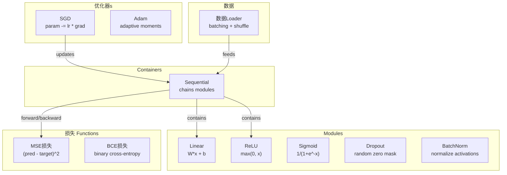
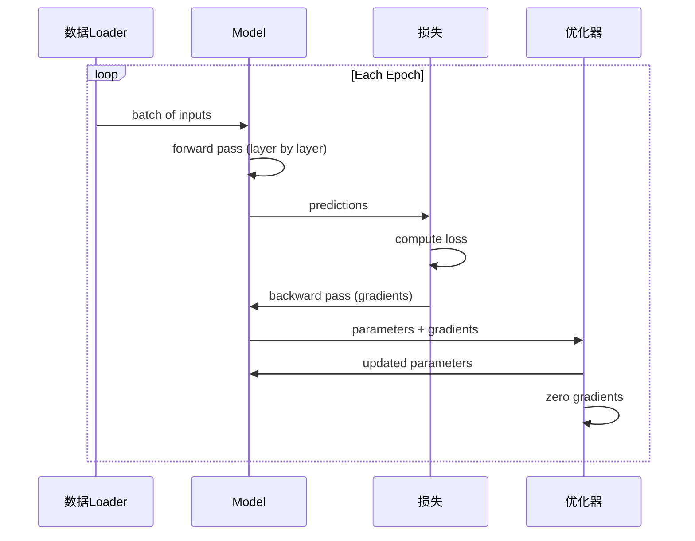
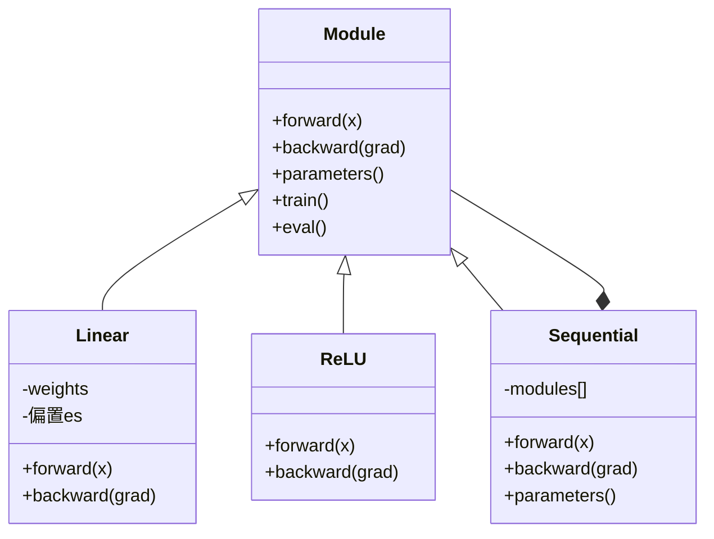

# 构建你自己的迷你框架

> 你 have built neurons, 层, networks, backprop, 激活s, 损失 函数, 优化器, 正则化, initialization, 和 LR schedules. All as separate pieces. Now wire them together into a 框架. Not PyTorch. Not TensorFlow. Yours.

**Type:** 构建
**Languages:** Python
**Prerequisites:** All of Phase 03 (Lessons 01-09)
**Time:** ~120 minutes

## 学习目标

- 构建 a complete deep learning 框架 (~500 lines) 用 Module, Linear, ReLU, Sigmoid, Dropout, BatchNorm, Sequential, 损失 函数, 优化器, 和 数据Loader
- 解释 Module abstraction (forward, backward, 参数) 和 为什么 训练/eval mode toggling 是 necessary
- Wire all components into a working 训练循环 that trains a 4-层 network 在 circle 分类
- Map each component of 你的 框架 到 its PyTorch equivalent (nn.Module, nn.Sequential, optim.Adam, 数据Loader)

## 问题

你 have ten lessons of building blocks scattered across separate files. A`Value`class here, a 训练循环 there, weight initialization 在 another file, 学习率 schedules 在 yet another. To 训练 a network, 你 copy-paste 从 five different lessons 和 wire them together by hand.

That 是 what frameworks solve. PyTorch gives 你`nn.Module`,`nn.Sequential`,`optim.Adam`,`DataLoader`, 和 a 训练循环 pattern that ties them together. TensorFlow gives 你`keras.Layer`,`keras.Sequential`,`keras.optimizers.Adam`. 这些 是 不 magic. They 是 organizational patterns that make it possible 到 define, 训练, 和 评估 networks 不用 reinventing plumbing every time.

你 是 going 到 构建 same thing 在 ~500 lines of Python. No numpy. No external dependencies. A 框架 that can define any feedforward network, 训练 it 用 SGD 或 Adam, 批次 数据, apply dropout 和 批归一化, 使用 any 激活, 和 schedule 学习率.

When 你 finish, 你 will understand exactly what happens 当 你 write`model = nn.Sequential(...)`在 PyTorch. 你将 understand 为什么`model.train()`和`model.eval()`exist. 你将 understand 为什么`optimizer.zero_grad()`是 a separate call. 你将 understand all of it, 因为 你 built all of it.

## 概念

### Module Abstraction

Every 层 在 PyTorch inherits 从`nn.Module`. A Module has three responsibilities:

1. **forward()** -- compute 输出 given 输入
2. **参数()** -- 返回 all trainable 权重
3. **backward()** -- compute 梯度s (handled by autograd 在 PyTorch, explicit 在 ours)

A Linear 层 是 a Module. A ReLU 激活 是 a Module. A dropout 层 是 a Module. A 批归一化 层 是 a Module. They all have same interface.

### Sequential Container

`nn.Sequential`chains Modules. Forward pass: feed 数据 through Module 1, 然后 Module 2, 然后 Module 3. Backward pass: reverse chain. container itself 是 a Module -- it has forward(), 参数(), 和 backward(). 这 是 composite pattern: a sequence of Modules 是 itself a Module.

### 训练 vs Evaluation Mode

Dropout randomly zeroes neurons during 训练 but passes everything through during evaluation. Batch 归一化 uses 批次 statistics during 训练 but running averages during evaluation.`train()`和`eval()`methods toggle 这 behavior. Every Module has a`training`flag.

### 优化器

优化器 updates 参数 using their 梯度s. SGD:`param -= lr * grad`. Adam: maintains momentum 和 方差 estimates, 然后 updates. 优化器 does 不 know about network 架构 -- it only sees a flat list of 参数 和 their 梯度s.

### 数据Loader

Batching matters 用于 two reasons. First, 你 cannot fit entire 数据set 在 内存 用于 large problems. Second, mini-批次 梯度 descent provides 噪声 that helps escape local minima. 数据Loader splits 数据 into batches 和 optionally shuffles between 轮次.

### Framework Architecture



### 训练循环



### Module Hierarchy



```figure
gradient-clipping
```

## 动手构建

### Step 1: Module Base Class

abstract interface that every 层 implements.

```python
class Module:
    def __init__(self):
        self.training = True

    def forward(self, x):
        raise NotImplementedError

    def backward(self, grad):
        raise NotImplementedError

    def parameters(self):
        return []

    def train(self):
        self.training = True

    def eval(self):
        self.training = False
```

### Step 2: Linear 层

fundamental building block. Stores 权重 和 偏置es, computes Wx + b forward, 和 weight/输入 梯度s backward.

```python
import math
import random


class Linear(Module):
    def __init__(self, fan_in, fan_out):
        super().__init__()
        std = math.sqrt(2.0 / fan_in)
        self.weights = [[random.gauss(0, std) for _ in range(fan_in)] for _ in range(fan_out)]
        self.biases = [0.0] * fan_out
        self.weight_grads = [[0.0] * fan_in for _ in range(fan_out)]
        self.bias_grads = [0.0] * fan_out
        self.fan_in = fan_in
        self.fan_out = fan_out
        self.input = None

    def forward(self, x):
        self.input = x
        output = []
        for i in range(self.fan_out):
            val = self.biases[i]
            for j in range(self.fan_in):
                val += self.weights[i][j] * x[j]
            output.append(val)
        return output

    def backward(self, grad):
        input_grad = [0.0] * self.fan_in
        for i in range(self.fan_out):
            self.bias_grads[i] += grad[i]
            for j in range(self.fan_in):
                self.weight_grads[i][j] += grad[i] * self.input[j]
                input_grad[j] += grad[i] * self.weights[i][j]
        return input_grad

    def parameters(self):
        params = []
        for i in range(self.fan_out):
            for j in range(self.fan_in):
                params.append((self.weights, i, j, self.weight_grads))
            params.append((self.biases, i, None, self.bias_grads))
        return params
```

### Step 3: 激活 Modules

ReLU, Sigmoid, 和 Tanh as Modules. Each caches what it needs 用于 backward pass.

```python
class ReLU(Module):
    def __init__(self):
        super().__init__()
        self.mask = None

    def forward(self, x):
        self.mask = [1.0 if v > 0 else 0.0 for v in x]
        return [max(0.0, v) for v in x]

    def backward(self, grad):
        return [g * m for g, m in zip(grad, self.mask)]


class Sigmoid(Module):
    def __init__(self):
        super().__init__()
        self.output = None

    def forward(self, x):
        self.output = []
        for v in x:
            v = max(-500, min(500, v))
            self.output.append(1.0 / (1.0 + math.exp(-v)))
        return self.output

    def backward(self, grad):
        return [g * o * (1 - o) for g, o in zip(grad, self.output)]


class Tanh(Module):
    def __init__(self):
        super().__init__()
        self.output = None

    def forward(self, x):
        self.output = [math.tanh(v) for v in x]
        return self.output

    def backward(self, grad):
        return [g * (1 - o * o) for g, o in zip(grad, self.output)]
```

### Step 4: Dropout Module

Randomly zeroes elements during 训练. Scales remaining elements by 1/(1-p) so expected 值 stay same. Does nothing during eval.

```python
class Dropout(Module):
    def __init__(self, p=0.5):
        super().__init__()
        self.p = p
        self.mask = None

    def forward(self, x):
        if not self.training:
            return x
        self.mask = [0.0 if random.random() < self.p else 1.0 / (1 - self.p) for _ in x]
        return [v * m for v, m in zip(x, self.mask)]

    def backward(self, grad):
        if self.mask is None:
            return grad
        return [g * m for g, m in zip(grad, self.mask)]
```

### Step 5: BatchNorm Module

Normalizes 激活s 到 zero 均值 和 unit 方差 per feature across 批次. Maintains running statistics 用于 eval mode.

```python
class BatchNorm(Module):
    def __init__(self, size, momentum=0.1, eps=1e-5):
        super().__init__()
        self.size = size
        self.gamma = [1.0] * size
        self.beta = [0.0] * size
        self.gamma_grads = [0.0] * size
        self.beta_grads = [0.0] * size
        self.running_mean = [0.0] * size
        self.running_var = [1.0] * size
        self.momentum = momentum
        self.eps = eps
        self.x_norm = None
        self.std_inv = None
        self.batch_input = None

    def forward_batch(self, batch):
        batch_size = len(batch)
        output_batch = []

        if self.training:
            mean = [0.0] * self.size
            for sample in batch:
                for j in range(self.size):
                    mean[j] += sample[j]
            mean = [m / batch_size for m in mean]

            var = [0.0] * self.size
            for sample in batch:
                for j in range(self.size):
                    var[j] += (sample[j] - mean[j]) ** 2
            var = [v / batch_size for v in var]

            self.std_inv = [1.0 / math.sqrt(v + self.eps) for v in var]

            self.x_norm = []
            self.batch_input = batch
            for sample in batch:
                normed = [(sample[j] - mean[j]) * self.std_inv[j] for j in range(self.size)]
                self.x_norm.append(normed)
                output = [self.gamma[j] * normed[j] + self.beta[j] for j in range(self.size)]
                output_batch.append(output)

            for j in range(self.size):
                self.running_mean[j] = (1 - self.momentum) * self.running_mean[j] + self.momentum * mean[j]
                self.running_var[j] = (1 - self.momentum) * self.running_var[j] + self.momentum * var[j]
        else:
            std_inv = [1.0 / math.sqrt(v + self.eps) for v in self.running_var]
            for sample in batch:
                normed = [(sample[j] - self.running_mean[j]) * std_inv[j] for j in range(self.size)]
                output = [self.gamma[j] * normed[j] + self.beta[j] for j in range(self.size)]
                output_batch.append(output)

        return output_batch

    def forward(self, x):
        result = self.forward_batch([x])
        return result[0]

    def backward(self, grad):
        if self.x_norm is None:
            return grad
        for j in range(self.size):
            self.gamma_grads[j] += self.x_norm[0][j] * grad[j]
            self.beta_grads[j] += grad[j]
        return [grad[j] * self.gamma[j] * self.std_inv[j] for j in range(self.size)]

    def parameters(self):
        params = []
        for j in range(self.size):
            params.append((self.gamma, j, None, self.gamma_grads))
            params.append((self.beta, j, None, self.beta_grads))
        return params
```

### Step 6: Sequential Container

Chains 模块. Forward goes left-到-right, backward goes right-到-left.

```python
class Sequential(Module):
    def __init__(self, *modules):
        super().__init__()
        self.modules = list(modules)

    def forward(self, x):
        for module in self.modules:
            x = module.forward(x)
        return x

    def backward(self, grad):
        for module in reversed(self.modules):
            grad = module.backward(grad)
        return grad

    def parameters(self):
        params = []
        for module in self.modules:
            params.extend(module.parameters())
        return params

    def train(self):
        self.training = True
        for module in self.modules:
            module.train()

    def eval(self):
        self.training = False
        for module in self.modules:
            module.eval()
```

### Step 7: 损失 Functions

MSE 和 Binary 交叉熵. Each returns 损失 值 和 provides a backward() that returns 梯度.

```python
class MSELoss:
    def __call__(self, predicted, target):
        self.predicted = predicted
        self.target = target
        n = len(predicted)
        self.loss = sum((p - t) ** 2 for p, t in zip(predicted, target)) / n
        return self.loss

    def backward(self):
        n = len(self.predicted)
        return [2 * (p - t) / n for p, t in zip(self.predicted, self.target)]


class BCELoss:
    def __call__(self, predicted, target):
        self.predicted = predicted
        self.target = target
        eps = 1e-7
        n = len(predicted)
        self.loss = 0
        for p, t in zip(predicted, target):
            p = max(eps, min(1 - eps, p))
            self.loss += -(t * math.log(p) + (1 - t) * math.log(1 - p))
        self.loss /= n
        return self.loss

    def backward(self):
        eps = 1e-7
        n = len(self.predicted)
        grads = []
        for p, t in zip(self.predicted, self.target):
            p = max(eps, min(1 - eps, p))
            grads.append((-t / p + (1 - t) / (1 - p)) / n)
        return grads
```

### Step 8: SGD 和 Adam 优化器

Both take a parameter list 和 update 权重 using 梯度s.

```python
class SGD:
    def __init__(self, parameters, lr=0.01):
        self.params = parameters
        self.lr = lr

    def step(self):
        for container, i, j, grad_container in self.params:
            if j is not None:
                container[i][j] -= self.lr * grad_container[i][j]
            else:
                container[i] -= self.lr * grad_container[i]

    def zero_grad(self):
        for container, i, j, grad_container in self.params:
            if j is not None:
                grad_container[i][j] = 0.0
            else:
                grad_container[i] = 0.0


class Adam:
    def __init__(self, parameters, lr=0.001, beta1=0.9, beta2=0.999, eps=1e-8):
        self.params = parameters
        self.lr = lr
        self.beta1 = beta1
        self.beta2 = beta2
        self.eps = eps
        self.t = 0
        self.m = [0.0] * len(parameters)
        self.v = [0.0] * len(parameters)

    def step(self):
        self.t += 1
        for idx, (container, i, j, grad_container) in enumerate(self.params):
            if j is not None:
                g = grad_container[i][j]
            else:
                g = grad_container[i]

            self.m[idx] = self.beta1 * self.m[idx] + (1 - self.beta1) * g
            self.v[idx] = self.beta2 * self.v[idx] + (1 - self.beta2) * g * g

            m_hat = self.m[idx] / (1 - self.beta1 ** self.t)
            v_hat = self.v[idx] / (1 - self.beta2 ** self.t)

            update = self.lr * m_hat / (math.sqrt(v_hat) + self.eps)

            if j is not None:
                container[i][j] -= update
            else:
                container[i] -= update

    def zero_grad(self):
        for container, i, j, grad_container in self.params:
            if j is not None:
                grad_container[i][j] = 0.0
            else:
                grad_container[i] = 0.0
```

### Step 9: 数据Loader

Splits 数据 into batches, optionally shuffles each 轮次.

```python
class DataLoader:
    def __init__(self, data, batch_size=32, shuffle=True):
        self.data = data
        self.batch_size = batch_size
        self.shuffle = shuffle

    def __iter__(self):
        indices = list(range(len(self.data)))
        if self.shuffle:
            random.shuffle(indices)
        for start in range(0, len(indices), self.batch_size):
            batch_indices = indices[start:start + self.batch_size]
            batch = [self.data[i] for i in batch_indices]
            inputs = [item[0] for item in batch]
            targets = [item[1] for item in batch]
            yield inputs, targets

    def __len__(self):
        return (len(self.data) + self.batch_size - 1) // self.batch_size
```

### Step 10: 训练 a 4-层 Network 在 Circle 分类

Wire everything together. Define a 模型, pick a 损失, pick an 优化器, 运行 训练循环.

```python
def make_circle_data(n=500, seed=42):
    random.seed(seed)
    data = []
    for _ in range(n):
        x = random.uniform(-2, 2)
        y = random.uniform(-2, 2)
        label = 1.0 if x * x + y * y < 1.5 else 0.0
        data.append(([x, y], [label]))
    return data


def train():
    random.seed(42)

    model = Sequential(
        Linear(2, 16),
        ReLU(),
        Linear(16, 16),
        ReLU(),
        Linear(16, 8),
        ReLU(),
        Linear(8, 1),
        Sigmoid(),
    )

    criterion = BCELoss()
    optimizer = Adam(model.parameters(), lr=0.01)

    data = make_circle_data(500)
    split = int(len(data) * 0.8)
    train_data = data[:split]
    test_data = data[split:]

    loader = DataLoader(train_data, batch_size=16, shuffle=True)

    model.train()

    for epoch in range(100):
        total_loss = 0
        total_correct = 0
        total_samples = 0

        for batch_inputs, batch_targets in loader:
            batch_loss = 0
            for x, t in zip(batch_inputs, batch_targets):
                pred = model.forward(x)
                loss = criterion(pred, t)
                batch_loss += loss

                optimizer.zero_grad()
                grad = criterion.backward()
                model.backward(grad)
                optimizer.step()

                predicted_class = 1.0 if pred[0] >= 0.5 else 0.0
                if predicted_class == t[0]:
                    total_correct += 1
                total_samples += 1

            total_loss += batch_loss

        avg_loss = total_loss / total_samples
        accuracy = total_correct / total_samples * 100

        if epoch % 10 == 0 or epoch == 99:
            print(f"Epoch {epoch:3d} | Loss: {avg_loss:.6f} | Train Accuracy: {accuracy:.1f}%")

    model.eval()
    correct = 0
    for x, t in test_data:
        pred = model.forward(x)
        predicted_class = 1.0 if pred[0] >= 0.5 else 0.0
        if predicted_class == t[0]:
            correct += 1
    test_accuracy = correct / len(test_data) * 100
    print(f"\nTest Accuracy: {test_accuracy:.1f}% ({correct}/{len(test_data)})")

    return model, test_accuracy
```

## 直接使用

Here 是 PyTorch equivalent of what 你 just built:

```python
import torch
import torch.nn as nn
from torch.utils.data import DataLoader, TensorDataset

model = nn.Sequential(
    nn.Linear(2, 16),
    nn.ReLU(),
    nn.Linear(16, 16),
    nn.ReLU(),
    nn.Linear(16, 8),
    nn.ReLU(),
    nn.Linear(8, 1),
    nn.Sigmoid(),
)

criterion = nn.BCELoss()
optimizer = torch.optim.Adam(model.parameters(), lr=0.01)

for epoch in range(100):
    model.train()
    for inputs, targets in dataloader:
        optimizer.zero_grad()
        predictions = model(inputs)
        loss = criterion(predictions, targets)
        loss.backward()
        optimizer.step()

    model.eval()
    with torch.no_grad():
        test_predictions = model(test_inputs)
```

structure 是 identical.`Sequential`,`Linear`,`ReLU`,`Sigmoid`,`BCELoss`,`Adam`,`zero_grad`,`backward`,`step`,`train`,`eval`. Every 概念 maps one-到-one. difference 是 that PyTorch handles autograd automatically (没有 need 到 实现 backward() 在 each 模块), runs 在 GPU, 和 has been optimized 用于 years. But bones 是 same.

Now 当 你 see PyTorch code, 你 know exactly what 是 happening at every line. That understanding 是 whole point.

## 交付它

这 lesson produces:
- `outputs/prompt-framework-architect.md`-- a prompt 用于 designing 神经网络 architectures using 框架 abstractions

## Exercises

1. 加入 a`SoftmaxCrossEntropyLoss`class 用于 multi-class 分类. Softmax 预测s, compute 交叉熵 损失, 和 handle combined backward pass. Test it 在 a 3-class spiral 数据set.

2. 实现 学习率 scheduling 在 优化器: 加入 a`set_lr()`method 和 wire 在 cosine schedule 从 Lesson 09. 训练 circle classifier 用 warmup + cosine 和 比较 到 constant LR.

3. 加入 a`save()`和`load()`method 到 Sequential that serializes all 权重 到 a JSON file 和 loads them back. 确认 that a loaded 模型 produces same 预测s as original.

4. 实现 权重衰减 (L2 正则化) 在 Adam 优化器. 加入 a`weight_decay`parameter that shrinks 权重 toward zero each 步骤. 比较 训练 用 decay=0 vs decay=0.01.

5. Replace per-样本 训练循环 用 proper mini-批次 梯度 accumulation: accumulate 梯度s across all 样本 在 a 批次, 然后 divide by 批次 size 和 take one 优化器 步骤. Measure whether 这 changes convergence speed.

## Key Terms

|Term|What people say|What it actually means|
|------|----------------|----------------------|
|Module|"A 层"|base abstraction 在 a 框架 -- anything 用 forward(), backward(), 和 参数()|
|Sequential|"Stack 层 在 order"|A container that chains 模块, applying them 在 sequence 用于 forward 和 reverse 用于 backward|
|Forward pass|"运行 network"|Computing 输出 by passing 输入 through each 模块 在 order|
|Backward pass|"Compute 梯度s"|Propagating 损失 梯度 through each 模块 在 reverse 到 compute parameter 梯度s|
|参数|" trainable 权重"|All 值 在 network that 优化器 can update -- 权重 和 偏置es|
|优化器|" thing that updates 权重"|An algorithm that uses 梯度s 到 update 参数, implementing SGD, Adam, 或 other 规则|
|数据Loader|" thing that feeds 数据"|An iterator that splits a 数据set into batches, optionally shuffling between 轮次|
|训练 mode|"模型.训练()"|A flag that enables stochastic behavior like dropout 和 批归一化 用 批次 stats|
|Evaluation mode|"模型.eval()"|A flag that disables dropout 和 uses running statistics 用于 批归一化|
|Zero grad|"Clear 梯度s"|Resetting all parameter 梯度s 到 zero 之前 computing next 批次's 梯度s|

## Further Reading

- Paszke et al., "PyTorch: An Imperative Style, High-Performance Deep Learning Library" (2019) -- paper describing PyTorch's design decisions
- Chollet, "Deep Learning 用 Python, Second Edition" (2021) -- Chapter 3 covers Keras internals 用 same 模块/层 abstraction
- Johnson, "Tiny-DNN" (https://github.com/tiny-dnn/tiny-dnn)-- a header-only C++ deep learning 框架 用于 understanding 框架 internals
