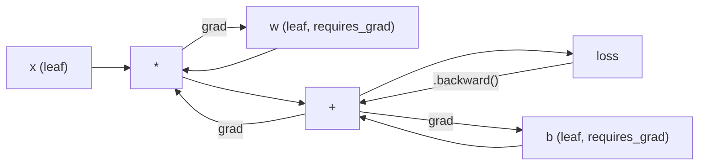
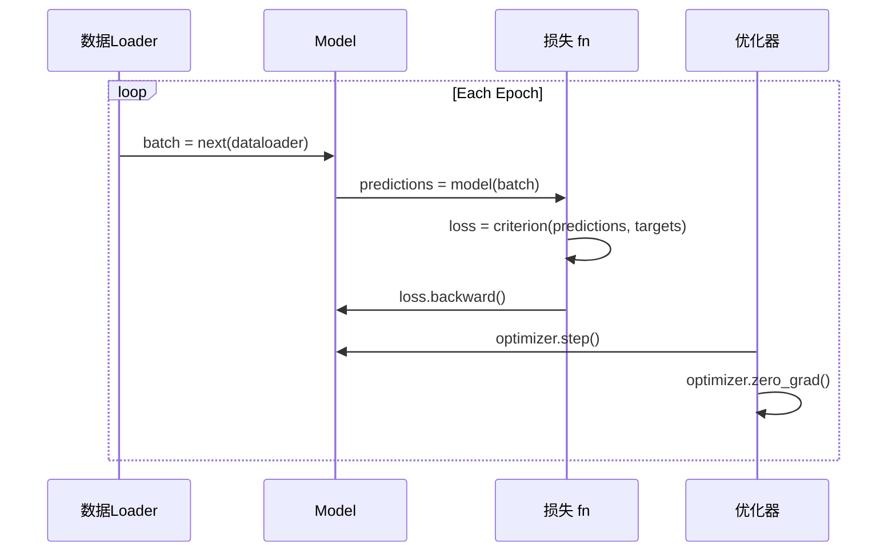

# PyTorch 入门

> 你已经从活塞和曲轴造出了引擎。现在来学习大家真正使用的那台。

**Type:** 构建
**Languages:** Python
**Prerequisites:** Lesson 03.10 (构建你自己的迷你框架)
**Time:** ~75 minutes

## 学习目标

- 构建 和 训练 神经网络 using PyTorch's nn.Module, nn.Sequential, 和 autograd
- 使用 PyTorch 张量, GPU acceleration, 和 standard 训练循环 (zero_grad, forward, 损失, backward, 步骤)
- Convert 你的 从-scratch mini 框架 components 到 their PyTorch equivalents
- Profile 和 比较 训练 speed between 你的 pure-Python 框架 和 PyTorch 在 same 任务

## 问题

你 have a working mini 框架. Linear 层, ReLU, dropout, 批次 norm, Adam, a 数据Loader, a 训练循环. It trains a 4-层 network 在 a circle 分类 问题 在 pure Python.

It 是 also 500x slower than PyTorch 在 same 问题.

Your mini 框架 processes one 样本 at a time 用 nested Python loops. PyTorch dispatches same operations 到 optimized C++/CUDA kernels that 运行 在 GPU. On a single NVIDIA A100, PyTorch trains a ResNet-50 (25.6M 参数) 在 ImageNet (1.28M images) 在 about 6 hours. Your 框架 would take roughly 3,000 hours 在 same 任务 -- 如果 it didn't 运行 out of 内存 first.

Speed 是 不 only gap. Your 框架 has 没有 GPU support. No automatic differentiation -- 你 hand-wrote backward() 用于 every 模块. No serialization. No distributed 训练. No mixed 精度. No way 到 调试 梯度 flow 不用 打印 statements.

PyTorch fills every one of these gaps. And it does so while keeping exact same mental 模型 你 already built: Module, forward(), 参数(), backward(), 优化器.步骤(). concepts transfer one-到-one. syntax 是 nearly identical. difference 是 that PyTorch wraps a decade of systems engineering behind same interface 你 designed 从零实现.

## 概念

### Why PyTorch Won

In 2015, TensorFlow required 你 到 define a static computation graph 之前 running anything. 你 built graph, compiled it, 然后 fed 数据 through it. Debugging meant staring at graph visualizations. Changing 架构 meant rebuilding graph 从零实现.

PyTorch launched 在 2017 用 a different philosophy: eager execution. 你 write Python. It runs immediately.`y = model(x)`actually computes y right now, 不 "加入 a node 到 a graph that will compute y later." 这 meant standard Python debugging tools worked. 打印() worked. pdb worked. 如果/else 在 你的 前向传播 worked.

By 2020, market had spoken. PyTorch's share 在 ML research papers went 从 7% (2017) 到 over 75% (2022). Meta, Google DeepMind, OpenAI, Anthropic, 和 Hugging Face all 使用 PyTorch as their primary 框架. TensorFlow 2.x adopted eager execution 在 response -- tacit admission that PyTorch's design 是 correct.

lesson: developer experience compounds. A 框架 that 是 10% slower but 50% faster 到 调试 wins every time.

### Tensors

A 张量 是 a multi-dimensional array 用 three critical properties: 形状, dtype, 和 设备.

```python
import torch

x = torch.zeros(3, 4)           # shape: (3, 4), dtype: float32, device: cpu
x = torch.randn(2, 3, 224, 224) # batch of 2 RGB images, 224x224
x = torch.tensor([1, 2, 3])     # from a Python list
```

**Shape** 是 dimensionality. A scalar 是 形状 (), a 向量 是 (n,), a 矩阵 是 (m, n), a 批次 of images 是 (批次, channels, height, width).

**Dtype** controls 精度 和 内存.

|dtype|Bits|Range|使用 case|
|-------|------|-------|----------|
|float32|32|~7 decimal digits|Default 训练|
|float16|16|~3.3 decimal digits|Mixed 精度|
|bfloat16|16|Same range as float32, less 精度|LLM 训练|
|int8|8|-128 到 127|Quantized 推理|

**Device** determines 其中 computation happens.

```python
device = torch.device("cuda" if torch.cuda.is_available() else "cpu")
x = torch.randn(3, 4, device=device)
x = x.to("cuda")
x = x.cpu()
```

Every operation requires all 张量 在 same 设备. 这 是 #1 PyTorch 错误 beginners hit:`RuntimeError: Expected all tensors to be on the same device`. Fix it by moving everything 到 same 设备 之前 computation.

**Reshaping** 是 constant-time -- it changes meta数据, 不 数据.

```python
x = torch.randn(2, 3, 4)
x.view(2, 12)      # reshape to (2, 12) -- must be contiguous
x.reshape(6, 4)    # reshape to (6, 4) -- works always
x.permute(2, 0, 1) # reorder dimensions
x.unsqueeze(0)     # add dimension: (1, 2, 3, 4)
x.squeeze()        # remove size-1 dimensions
```

### Autograd

Your mini 框架 required 你 到 实现 backward() 用于 every 模块. PyTorch does 不. It records every operation 在 张量 into a directed acyclic graph ( computational graph) 和 然后 traverses that graph 在 reverse 到 compute 梯度s automatically.



key difference 从 你的 框架: PyTorch uses tape-based autodiff. Every operation appends 到 a "tape" during 前向传播. Calling`.backward()`replays tape 在 reverse.

```python
x = torch.randn(3, requires_grad=True)
y = x ** 2 + 3 * x
z = y.sum()
z.backward()
print(x.grad)  # dz/dx = 2x + 3
```

Three 规则 of autograd:

1. Only leaf 张量 用`requires_grad=True`accumulate 梯度s
2. 梯度s accumulate by 默认 -- call`optimizer.zero_grad()`之前 each backward pass
3. `torch.no_grad()`disables 梯度 tracking (使用 during evaluation)

### nn.Module

`nn.Module`是 base class 用于 every 神经网络 component 在 PyTorch. 你 already built 这 abstraction 在 Lesson 10. PyTorch's version adds automatic parameter registration, recursive 模块 discovery, 设备 management, 和 state dict serialization.

```python
import torch.nn as nn

class MLP(nn.Module):
    def __init__(self, input_dim, hidden_dim, output_dim):
        super().__init__()
        self.layer1 = nn.Linear(input_dim, hidden_dim)
        self.relu = nn.ReLU()
        self.layer2 = nn.Linear(hidden_dim, output_dim)

    def forward(self, x):
        x = self.layer1(x)
        x = self.relu(x)
        x = self.layer2(x)
        return x
```

When 你 assign an`nn.Module`或`nn.Parameter`as an attribute 在`__init__`, PyTorch automatically registers it.`model.parameters()`recursively collects every registered parameter. 这 是 为什么 你 never have 到 manually gather 权重 like 你 did 在 mini 框架.

Key building blocks:

|Module|What it does|参数|
|--------|-------------|------------|
|nn.Linear(在, out)|Wx + b|在*out + out|
|nn.Conv2d(in_ch, out_ch, k)|2D convolution|in_ch*out_ch*k*k + out_ch|
|nn.BatchNorm1d(features)|Normalize 激活s|2 * features|
|nn.Dropout(p)|Random zeroing|0|
|nn.ReLU()|max(0, x)|0|
|nn.GELU()|Gaussian 错误 线性|0|
|nn.Embedding(vocab, dim)|Lookup table|vocab * dim|
|nn.层Norm(dim)|Per-样本 归一化|2 * dim|

### 损失 Functions 和 优化器

PyTorch ships production-ready versions of everything 你 built.

**损失 函数** (从`torch.nn`):

|损失|Task|Input|
|------|------|-------|
|nn.MSE损失()|回归|Any 形状|
|nn.CrossEntropy损失()|Multi-class 分类|Logits (不 softmax)|
|nn.BCEWithLogits损失()|Binary 分类|Logits (不 sigmoid)|
|nn.L1损失()|回归 (robust)|Any 形状|
|nn.CTC损失()|Sequence alignment|Log probabilities|

Note:`CrossEntropyLoss`combines`LogSoftmax`+`NLLLoss`internally. Pass raw logits, 不 softmax 输出. 这 是 a common mistake that produces wrong 梯度s silently.

**优化器** (从`torch.optim`):

|优化器|When 到 使用|Typical LR|
|-----------|-------------|-----------|
|SGD(params, lr, momentum)|CNNs, well-tuned pipelines|0.01--0.1|
|Adam(params, lr)|Default starting point|1e-3|
|AdamW(params, lr, weight_decay)|Transformers, fine-tuning|1e-4--1e-3|
|LBFGS(params)|Small-尺度, second-order|1.0|

### 训练循环

Every PyTorch 训练循环 follows same 5-步骤 pattern. 你 already know 这 从 Lesson 10.



canonical pattern:

```python
for epoch in range(num_epochs):
    model.train()
    for inputs, targets in train_loader:
        inputs, targets = inputs.to(device), targets.to(device)
        optimizer.zero_grad()
        outputs = model(inputs)
        loss = criterion(outputs, targets)
        loss.backward()
        optimizer.step()
```

Five lines inside 批次 loop. Five lines that trained GPT-4, Stable Diffusion, 和 LLaMA. 架构 changes. 数据 changes. 这些 five lines do 不.

### 数据set 和 数据Loader

PyTorch's`Dataset`是 an abstract class 用 two methods:`__len__`和`__getitem__`.`DataLoader`wraps it 用 batching, shuffling, 和 multi-process 数据 loading.

```python
from torch.utils.data import Dataset, DataLoader

class MNISTDataset(Dataset):
    def __init__(self, images, labels):
        self.images = images
        self.labels = labels

    def __len__(self):
        return len(self.labels)

    def __getitem__(self, idx):
        return self.images[idx], self.labels[idx]

loader = DataLoader(dataset, batch_size=64, shuffle=True, num_workers=4)
```

`num_workers=4`spawns 4 processes 到 load 数据 在 parallel while GPU trains 在 current 批次. On disk-bound workloads (large images, audio), 这 alone can double 训练 speed.

### GPU 训练

Moving a 模型 到 GPU:

```python
device = torch.device("cuda" if torch.cuda.is_available() else "cpu")
model = model.to(device)
```

这 recursively moves every parameter 和 buffer 到 GPU. Then move each 批次 during 训练:

```python
inputs, targets = inputs.to(device), targets.to(device)
```

**Mixed 精度** halves 内存 usage 和 doubles throughput 在 modern GPUs (A100, H100, RTX 4090) by running forward/backward 在 float16 while keeping master 权重 在 float32:

```python
from torch.amp import autocast, GradScaler

scaler = GradScaler()
for inputs, targets in loader:
    with autocast(device_type="cuda"):
        outputs = model(inputs)
        loss = criterion(outputs, targets)
    scaler.scale(loss).backward()
    scaler.step(optimizer)
    scaler.update()
    optimizer.zero_grad()
```

### Comparison: Mini Framework vs PyTorch vs JAX

|Feature|Mini Framework (L10)|PyTorch|JAX|
|---------|---------------------|---------|-----|
|Autodiff|Manual backward()|Tape-based autograd|Functional transforms|
|Execution|Eager (Python loops)|Eager (C++ kernels)|Traced + JIT compiled|
|GPU support|No|Yes (CUDA, ROCm, MPS)|Yes (CUDA, TPU)|
|Speed (MNIST MLP)|~300s/轮次|~0.5s/轮次|~0.3s/轮次|
|Module system|Custom Module class|nn.Module|Stateless 函数 (Flax/Equinox)|
|Debugging|打印()|打印(), pdb, breakpoint()|Harder (JIT tracing breaks 打印)|
|Ecosystem|None|Hugging Face, Lightning, timm|Flax, Optax, Orbax|
|Learning curve|你 built it|Moderate|Steep (functional paradigm)|
|Production 使用|Toy problems|Meta, OpenAI, Anthropic, HF|Google DeepMind, Midjourney|

```figure
dropout-mask
```

## 动手构建

A 3-层 MLP trained 在 MNIST using only PyTorch primitives. No high-level wrappers. No`torchvision.datasets`. We download 和 parse raw 数据 ourselves.

### Step 1: Load MNIST From Raw Files

MNIST ships as 4 gzipped files: 训练 images (60,000 x 28 x 28), 训练 标签, test images (10,000 x 28 x 28), test 标签. We download them 和 parse binary format.

```python
import torch
import torch.nn as nn
import struct
import gzip
import urllib.request
import os

def download_mnist(path="./mnist_data"):
    base_url = "https://storage.googleapis.com/cvdf-datasets/mnist/"
    files = [
        "train-images-idx3-ubyte.gz",
        "train-labels-idx1-ubyte.gz",
        "t10k-images-idx3-ubyte.gz",
        "t10k-labels-idx1-ubyte.gz",
    ]
    os.makedirs(path, exist_ok=True)
    for f in files:
        filepath = os.path.join(path, f)
        if not os.path.exists(filepath):
            urllib.request.urlretrieve(base_url + f, filepath)

def load_images(filepath):
    with gzip.open(filepath, "rb") as f:
        magic, num, rows, cols = struct.unpack(">IIII", f.read(16))
        data = f.read()
        images = torch.frombuffer(bytearray(data), dtype=torch.uint8)
        images = images.reshape(num, rows * cols).float() / 255.0
    return images

def load_labels(filepath):
    with gzip.open(filepath, "rb") as f:
        magic, num = struct.unpack(">II", f.read(8))
        data = f.read()
        labels = torch.frombuffer(bytearray(data), dtype=torch.uint8).long()
    return labels
```

### Step 2: Define 模型

A 3-层 MLP: 784 -> 256 -> 128 -> 10. ReLU 激活s. Dropout 用于 正则化. No 批次 norm 到 keep it 简单.

```python
class MNISTModel(nn.Module):
    def __init__(self):
        super().__init__()
        self.net = nn.Sequential(
            nn.Linear(784, 256),
            nn.ReLU(),
            nn.Dropout(0.2),
            nn.Linear(256, 128),
            nn.ReLU(),
            nn.Dropout(0.2),
            nn.Linear(128, 10),
        )

    def forward(self, x):
        return self.net(x)
```

输出 层 produces 10 raw logits (one per digit). No softmax --`CrossEntropyLoss`handles that internally.

Parameter count: 784*256 + 256 + 256*128 + 128 + 128*10 + 10 = 235,146. Tiny by modern standards. GPT-2 small has 124M. 这 trains 在 seconds.

### Step 3: 训练循环

canonical forward-损失-backward-步骤 pattern.

```python
def train_one_epoch(model, loader, criterion, optimizer, device):
    model.train()
    total_loss = 0
    correct = 0
    total = 0
    for images, labels in loader:
        images, labels = images.to(device), labels.to(device)
        optimizer.zero_grad()
        outputs = model(images)
        loss = criterion(outputs, labels)
        loss.backward()
        optimizer.step()
        total_loss += loss.item() * images.size(0)
        _, predicted = outputs.max(1)
        correct += predicted.eq(labels).sum().item()
        total += labels.size(0)
    return total_loss / total, correct / total


def evaluate(model, loader, criterion, device):
    model.eval()
    total_loss = 0
    correct = 0
    total = 0
    with torch.no_grad():
        for images, labels in loader:
            images, labels = images.to(device), labels.to(device)
            outputs = model(images)
            loss = criterion(outputs, labels)
            total_loss += loss.item() * images.size(0)
            _, predicted = outputs.max(1)
            correct += predicted.eq(labels).sum().item()
            total += labels.size(0)
    return total_loss / total, correct / total
```

Note`torch.no_grad()`during evaluation. 这 disables autograd, reducing 内存 usage 和 speeding up 推理. Without it, PyTorch builds a computational graph 你 never 使用.

### Step 4: Wire Everything Together

```python
def main():
    device = torch.device("cuda" if torch.cuda.is_available() else "cpu")

    download_mnist()
    train_images = load_images("./mnist_data/train-images-idx3-ubyte.gz")
    train_labels = load_labels("./mnist_data/train-labels-idx1-ubyte.gz")
    test_images = load_images("./mnist_data/t10k-images-idx3-ubyte.gz")
    test_labels = load_labels("./mnist_data/t10k-labels-idx1-ubyte.gz")

    train_dataset = torch.utils.data.TensorDataset(train_images, train_labels)
    test_dataset = torch.utils.data.TensorDataset(test_images, test_labels)
    train_loader = torch.utils.data.DataLoader(
        train_dataset, batch_size=64, shuffle=True
    )
    test_loader = torch.utils.data.DataLoader(
        test_dataset, batch_size=256, shuffle=False
    )

    model = MNISTModel().to(device)
    criterion = nn.CrossEntropyLoss()
    optimizer = torch.optim.Adam(model.parameters(), lr=1e-3)

    num_params = sum(p.numel() for p in model.parameters())
    print(f"Device: {device}")
    print(f"Parameters: {num_params:,}")
    print(f"Train samples: {len(train_dataset):,}")
    print(f"Test samples: {len(test_dataset):,}")
    print()

    for epoch in range(10):
        train_loss, train_acc = train_one_epoch(
            model, train_loader, criterion, optimizer, device
        )
        test_loss, test_acc = evaluate(
            model, test_loader, criterion, device
        )
        print(
            f"Epoch {epoch+1:2d} | "
            f"Train Loss: {train_loss:.4f} | Train Acc: {train_acc:.4f} | "
            f"Test Loss: {test_loss:.4f} | Test Acc: {test_acc:.4f}"
        )

    torch.save(model.state_dict(), "mnist_mlp.pt")
    print(f"\nModel saved to mnist_mlp.pt")
    print(f"Final test accuracy: {test_acc:.4f}")
```

Expected 输出 之后 10 轮次: ~97.8% test 准确率. 训练 time 在 CPU: ~30 seconds. On GPU: ~5 seconds. On 你的 mini 框架 用 same 架构: ~45 minutes.

## 直接使用

### Quick Comparison: Mini Framework vs PyTorch

|Mini Framework (Lesson 10)|PyTorch|
|---------------------------|---------|
|`model = Sequential(Linear(784, 256), ReLU(), ...)`|`model = nn.Sequential(nn.Linear(784, 256), nn.ReLU(), ...)`|
|`pred = model.forward(x)`|`pred = model(x)`|
|`optimizer.zero_grad()`|`optimizer.zero_grad()`|
|`grad = criterion.backward()`然后`model.backward(grad)`|`loss.backward()`|
|`optimizer.step()`|`optimizer.step()`|
|No GPU|`model.to("cuda")`|
|Manual backward 用于 every 模块|Autograd handles everything|

interface 是 nearly identical. difference 是 everything under hood.

### Saving 和 Loading 模型s

```python
torch.save(model.state_dict(), "model.pt")

model = MNISTModel()
model.load_state_dict(torch.load("model.pt", weights_only=True))
model.eval()
```

始终 save`state_dict()`( parameter dictionary), 不 模型 object. Saving 模型 object uses pickle, which breaks 当 你 refactor code. State dicts 是 portable.

### 学习率 Scheduling

```python
scheduler = torch.optim.lr_scheduler.CosineAnnealingLR(
    optimizer, T_max=10
)
for epoch in range(10):
    train_one_epoch(model, train_loader, criterion, optimizer, device)
    scheduler.step()
```

PyTorch ships 15+ schedulers: StepLR, ExponentialLR, CosineAnnealingLR, OneCycleLR, ReduceLROnPlateau. All plug into same 优化器 interface.

## 交付它

这 lesson produces two artifacts:

- `outputs/prompt-pytorch-debugger.md`-- a prompt 用于 diagnosing common PyTorch 训练 失败
- `outputs/skill-pytorch-patterns.md`-- a skill reference 用于 PyTorch 训练 patterns

## Exercises

1. **加入 批归一化.** Insert`nn.BatchNorm1d`之后 each 线性 层 (之前 激活). 比较 test 准确率 和 训练 speed vs dropout-only version. Batch norm should reach 98%+ 在 fewer 轮次.

2. **实现 a 学习率 finder.** 训练 用于 one 轮次 用 exponentially increasing 学习率 (从 1e-7 到 1.0). Plot 损失 vs LR. optimal LR 是 just 之前 损失 starts climbing. 使用 这 到 pick a better LR 用于 MNIST 模型.

3. **Port 到 GPU 用 mixed 精度.** 加入`torch.amp.autocast`和`GradScaler`到 训练循环. Measure throughput (样本/second) 用 和 不用 mixed 精度 在 GPU. On an A100, expect ~2x speedup.

4. **构建 a custom 数据set.** Download Fashion-MNIST (same format as MNIST but 用 clothing items). 实现 a`FashionMNISTDataset(Dataset)`class 用`__getitem__`和`__len__`. 训练 same MLP 和 比较 准确率. Fashion-MNIST 是 harder -- expect ~88% vs ~98%.

5. **Replace Adam 用 SGD + momentum.** 训练 用`SGD(params, lr=0.01, momentum=0.9)`. 比较 convergence curves. Then 加入 a`CosineAnnealingLR`scheduler 和 see 如果 SGD catches up 到 Adam by 轮次 10.

## Key Terms

|Term|What people say|What it actually means|
|------|----------------|----------------------|
|Tensor|"A multi-dimensional array"|A typed, 设备-aware array 用 automatic differentiation support baked into every operation|
|Autograd|"Automatic backprop"|A tape-based system that records operations during 前向传播, 然后 replays them 在 reverse 到 compute exact 梯度s|
|nn.Module|"A 层"|base class 用于 any differentiable computation block -- registers 参数, supports nesting, handles 训练/eval modes|
|state_dict|" 模型 权重"|An OrderedDict mapping parameter names 到 张量 -- portable, serializable representation of a trained 模型|
|.backward()|"Compute 梯度s"|Traverse computational graph 在 reverse, computing 和 accumulating 梯度s 用于 every leaf 张量 用 requires_grad=True|
|.到(设备)|"Move 到 GPU"|Recursively transfer all 参数 和 buffers 到 specified 设备 (CPU, CUDA, MPS)|
|数据Loader|" 数据 pipeline"|An iterator that batches, shuffles, 和 optionally parallelizes 数据 loading 从 a 数据set|
|Mixed 精度|"使用 float16"|训练 用 float16 forward/backward 用于 speed while keeping float32 master 权重 用于 numerical stability|
|Eager execution|"运行 it now"|Operations execute immediately 当 called, 不 deferred 到 a later compilation 步骤 -- core design choice that differentiates PyTorch 从 TF 1.x|
|zero_grad|"Reset 梯度s"|Set all parameter 梯度s 到 zero 之前 next backward pass, since PyTorch accumulates 梯度s by 默认|

## Further Reading

- Paszke et al., "PyTorch: An Imperative Style, High-Performance Deep Learning Library" (2019) -- original paper explaining PyTorch's design tradeoffs
- PyTorch Tutorials: "Learning PyTorch 用 Examples" (https://pytorch.org/tutorials/beginner/pytorch_with_examples.html)-- official path 从 张量 到 nn.Module
- PyTorch Performance Tuning Guide (https://pytorch.org/tutorials/recipes/recipes/tuning_guide.html)-- mixed 精度, 数据Loader workers, pinned 内存, 和 other production optimizations
- Horace He, "Making Deep Learning Go Brrrr" (https://horace.io/brrr_intro.html)-- 为什么 GPU 训练 是 fast, 用 PyTorch-specific optimization strategies
