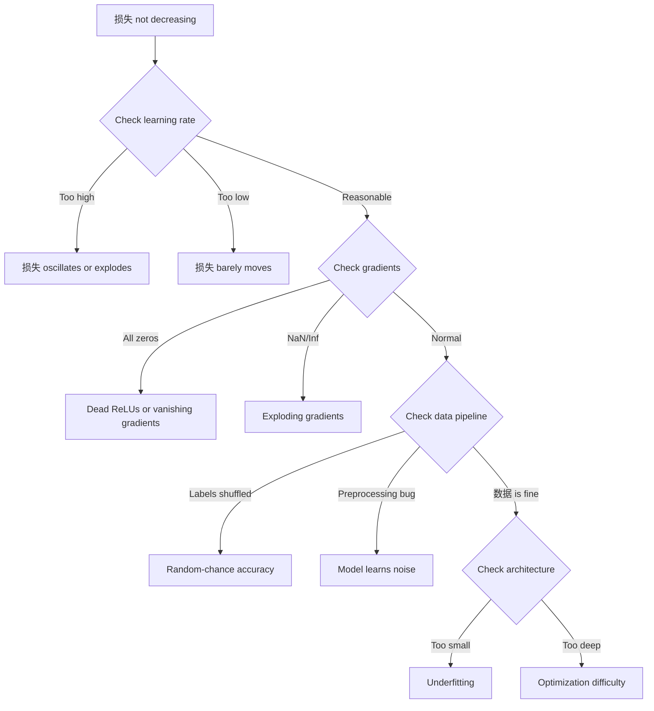
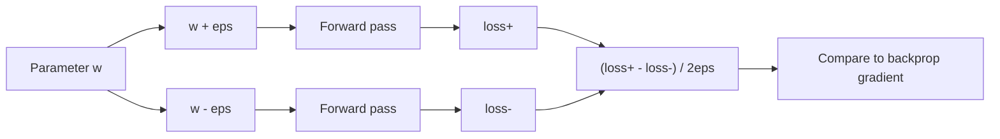
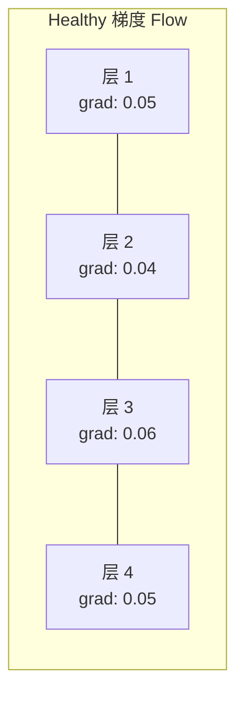
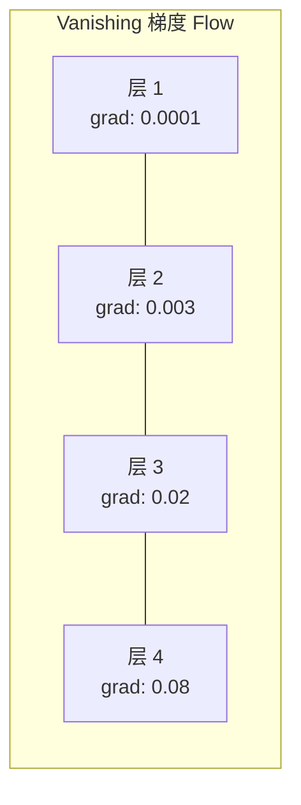
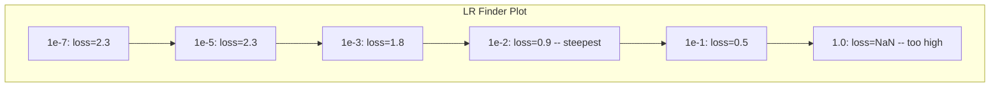

# 调试神经网络

> Your network compiled. It ran. It produced a number. number 是 wrong 和 nothing crashed. Welcome 到 hardest kind of debugging -- kind 其中 there 是 没有 错误 message.

**Type:** 构建
**Languages:** Python, PyTorch
**Prerequisites:** Phase 03 Lessons 01-10 (especially 反向传播, 损失 函数, 优化器)
**Time:** ~90 minutes

## 学习目标

- Diagnose common 神经网络 失败 (NaN 损失, flat 损失 curve, 过拟合, oscillation) using systematic debugging strategies
- Apply "overfit one 批次" technique 到 确认 that 你的 模型 架构 和 训练循环 是 correct
- Inspect 梯度 magnitudes, 激活 distributions, 和 weight norms 到 识别 vanishing/exploding 梯度 problems
- 构建 a debugging 检查清单 that covers 数据 pipeline, 模型 架构, 损失 函数, 优化器, 和 学习率 issues

## 问题

Traditional software crashes 当 it 是 broken. A null pointer throws an exception. A type mismatch fails at compile time. An off-by-one 错误 produces a clearly wrong 输出.

Neural networks do 不 give 你 that luxury.

A broken 神经网络 runs 到 completion, prints a 损失 值, 和 输出 预测s. 损失 might decrease. 预测s might look plausible. But 模型 是 silently wrong -- learning shortcuts, memorizing 噪声, 或 converging 到 a useless local minimum. Google researchers estimated that 60-70% of ML debugging time 是 spent 在 "silent" 缺陷 that produce 没有 错误 but degrade 模型 quality.

difference between a working 模型 和 a broken one 是 often a single misplaced line: a missing`zero_grad()`, a transposed dimension, a 学习率 off by 10x. canonical "Recipe 用于 训练 神经网络" (2019) opens 用 这: " most common neural net mistakes 是 缺陷 that don't crash."

这 lesson teaches 你 到 find those 缺陷.

## 概念

### Debugging Mindset

Forget 打印-和-pray debugging. Neural network debugging requires a systematic approach 因为 feedback loop 是 slow (minutes 到 hours per 训练 运行) 和 symptoms 是 ambiguous (bad 损失 could 均值 20 different things).

golden 规则: **开始 简单, 加入 complexity one piece at a time, 和 确认 each piece independently.**



### Symptom 1: 损失 Not Decreasing

这 是 most common complaint. 训练循环 runs, 轮次 tick by, 和 损失 stays flat 或 oscillates wildly.

**Wrong 学习率.** Too high: 损失 oscillates 或 jumps 到 NaN. Too low: 损失 decreases so slowly it looks flat. For Adam, 开始 at 1e-3. For SGD, 开始 at 1e-1 或 1e-2. 始终 try 3 学习率s spanning 10x each (e.g., 1e-2, 1e-3, 1e-4) 之前 concluding something else 是 wrong.

**Dead ReLUs.** If a ReLU neuron receives a large negative 输入, it 输出 0 和 its 梯度 是 0. It never activates again. If enough neurons die, network cannot learn. 检查: 打印 fraction of 激活s that 是 exactly 0 之后 each ReLU 层. If >50% 是 dead, 切换 到 LeakyReLU 或 降低 学习率.

**Vanishing 梯度s.** In deep networks 用 sigmoid 或 tanh 激活s, 梯度s shrink exponentially as they propagate backward. By time they reach first 层, they 是 ~0. first 层 停止 learning. Fix: 使用 ReLU/GELU, 加入 residual connections, 或 使用 批归一化.

**Exploding 梯度s.** opposite 问题 -- 梯度s grow exponentially. Common 在 RNNs 和 very deep networks. 损失 jumps 到 NaN. Fix: 梯度 clipping (`torch.nn.utils.clip_grad_norm_`), lower 学习率, 或 加入 归一化.

### Symptom 2: 损失 Decreasing But 模型 是 Bad

损失 goes down. 训练 准确率 hits 99%. But test 准确率 是 55%. Or 模型 produces nonsensical 输出 在 real 数据.

**过拟合.** 模型 memorizes 训练 数据 instead of learning patterns. Gap between 训练 和 验证 损失 grows over time. Fix: more 数据, dropout, 权重衰减, early stopping, 数据 增强.

**数据 leakage.** Test 数据 leaked into 训练. 准确率 是 suspiciously high. Common causes: shuffling 之前 splitting, preprocessing 用 statistics 从 full 数据set, duplicate 样本 across splits. Fix: split first, preprocess second, 检查 用于 duplicates.

**Label 错误.** 5-10% of 标签 在 most real 数据sets 是 wrong (Northcutt et al., 2021 -- "Pervasive Label Errors 在 Test Sets"). 模型 learns 噪声. Fix: 使用 confident learning 到 find 和 fix mislabeled 示例, 或 使用 损失 truncation 到 ignore high-损失 样本.

### Symptom 3: NaN 或 Inf 在 损失

损失 值 becomes`nan`或`inf`. 训练 是 dead.

**Learning rate too high.** 梯度 updates overshoot so far that 权重 explode. Fix: 降低 by 10x.

**log(0) 或 log(negative).** Cross-entropy 损失 computes`log(p)`. If 你的 模型 输出 exactly 0 或 a negative 概率, log explodes. Fix: clamp 预测s 到`[eps, 1-eps]`其中`eps=1e-7`.

**Division by zero.** Batch 归一化 divides by standard deviation. A 批次 用 constant 值 has std=0. Fix: 加入 epsilon 到 denominator (PyTorch does 这 by 默认, but custom implementations might 不).

**Numerical overflow.** Large 激活s fed into`exp()`produce Inf. Softmax 是 especially prone. Fix: subtract max 之前 exponentiating ( log-sum-exp trick).

### Technique 1: 梯度 Checking

比较 你的 analytical 梯度s (从 backprop) 到 numerical 梯度s (从 finite differences). If they disagree, 你的 backward pass has a 缺陷.

Numerical 梯度 用于 parameter`w`:

```
grad_numerical = (loss(w + eps) - loss(w - eps)) / (2 * eps)
```

Agreement metric (relative difference):

```
rel_diff = |grad_analytical - grad_numerical| / max(|grad_analytical|, |grad_numerical|, 1e-8)
```

If`rel_diff < 1e-5`: correct. If`rel_diff > 1e-3`: almost certainly a 缺陷.



### Technique 2: 激活 Statistics

Monitor 均值 和 standard deviation of 激活s 之后 each 层 during 训练. Healthy networks maintain 激活s 用 均值 near 0 和 std near 1 (之后 归一化) 或 at least bounded.

|Health indicator|Mean|Std|Diagnosis|
|-----------------|------|-----|-----------|
|Healthy|~0|~1|Network 是 learning normally|
|Saturated|>>0 或 <<0|~0|激活s stuck at extreme 值|
|Dead|0|0|Neurons 是 dead (all zeros)|
|Exploding|>>10|>>10|激活s growing 不用 bound|

### Technique 3: 梯度 Flow Visualization

Plot average 梯度 magnitude 用于 each 层. In a healthy network, 梯度 magnitudes should be roughly similar across 层. If early 层 have 梯度s 1000x smaller than later 层, 你 have vanishing 梯度s.





### Technique 4: Overfit-One-Batch Test

single most important debugging technique 在 deep learning.

Take one small 批次 (8-32 样本). 训练 在 it 用于 100+ iterations. 损失 should go 到 nearly zero 和 训练 准确率 should hit 100%. If it does 不, 你的 模型 或 训练循环 has a fundamental 缺陷 -- do 不 proceed 到 full 训练.

这 test catches:
- Broken 损失 函数
- Broken backward passes
- Architecture too small 到 represent 数据
- 优化器 不 connected 到 模型 参数
- 数据 和 标签 misaligned

这 takes 30 seconds 到 运行 和 saves hours of debugging full 训练 runs.

### Technique 5: 学习率 Finder

Leslie Smith (2017) proposed sweeping 学习率 从 very small (1e-7) 到 very large (10) over one 轮次 while recording 损失. Plot 损失 vs 学习率. optimal 学习率 是 roughly 10x smaller than rate 其中 损失 starts decreasing fastest.



Best LR 在 这 示例: ~1e-3 (one order of magnitude 之前 steepest point).

### Common PyTorch Bugs

这些 是 缺陷 that waste most collective hours 在 PyTorch community:

|Bug|Symptom|Fix|
|-----|---------|-----|
|Forgetting`optimizer.zero_grad()`|梯度s accumulate across batches, 损失 oscillates|加入`optimizer.zero_grad()`之前`loss.backward()`|
|Forgetting`model.eval()`at test time|Dropout 和 批次 norm behave differently, test 准确率 varies between runs|加入`model.eval()`和`torch.no_grad()`|
|Wrong 张量 shapes|Silent broadcasting produces wrong results, 没有 错误|打印 shapes 之后 every operation during debugging|
|CPU/GPU mismatch|`RuntimeError: expected CUDA tensor`|使用`.to(device)`在 模型 AND 数据|
|Not detaching 张量|Computation graph grows forever, OOM|使用`.detach()`或`with torch.no_grad()`|
|In-place operations breaking autograd|`RuntimeError: modified by in-place operation`|Replace`x += 1`用`x = x + 1`|
|数据 不 normalized|损失 stuck at random-chance level|Normalize 输入 到 均值=0, std=1|
|Labels as wrong dtype|Cross-entropy expects`Long`, got`Float`|Cast 标签:`labels.long()`|

### Master Debugging Table

|Symptom|Likely cause|First thing 到 try|
|---------|-------------|-------------------|
|损失 stuck at -log(1/num_classes)|模型 predicting uniform 分布|检查 数据 pipeline, 确认 标签 match 输入|
|损失 NaN 之后 a few 步骤|Learning rate too high|降低 LR by 10x|
|损失 NaN immediately|log(0) 或 division by zero|加入 epsilon 到 log/division operations|
|损失 oscillating wildly|LR too high 或 批次 size too small|降低 LR, 增加 批次 size|
|损失 decreasing 然后 plateaus|LR too high 用于 fine-tuning phase|加入 LR schedule (cosine 或 步骤 decay)|
|训练 acc high, test acc low|过拟合|加入 dropout, 权重衰减, more 数据|
|训练 acc = test acc = chance|模型 不 learning anything|运行 overfit-one-批次 test|
|训练 acc = test acc but both low|欠拟合|Bigger 模型, more 层, more features|
|梯度s all zero|Dead ReLUs 或 detached computation graph|切换 到 LeakyReLU, 检查`.requires_grad`|
|Out of 内存 during 训练|Batch too large 或 graph 不 freed|降低 批次 size, 使用`torch.no_grad()`用于 eval|

```figure
learning-curves
```

## 动手构建

A diagnostic toolkit that monitors 激活s, 梯度s, 和 损失 curves. 你将 deliberately break a network 和 使用 toolkit 到 diagnose each 问题.

### Step 1: NetworkDebugger Class

Hooks into a PyTorch 模型 到 record 激活 和 梯度 statistics per 层.

```python
import torch
import torch.nn as nn
import math


class NetworkDebugger:
    def __init__(self, model):
        self.model = model
        self.activation_stats = {}
        self.gradient_stats = {}
        self.loss_history = []
        self.lr_losses = []
        self.hooks = []
        self._register_hooks()

    def _register_hooks(self):
        for name, module in self.model.named_modules():
            if isinstance(module, (nn.Linear, nn.Conv2d, nn.ReLU, nn.LeakyReLU)):
                hook = module.register_forward_hook(self._make_activation_hook(name))
                self.hooks.append(hook)
                hook = module.register_full_backward_hook(self._make_gradient_hook(name))
                self.hooks.append(hook)

    def _make_activation_hook(self, name):
        def hook(module, input, output):
            with torch.no_grad():
                out = output.detach().float()
                self.activation_stats[name] = {
                    "mean": out.mean().item(),
                    "std": out.std().item(),
                    "fraction_zero": (out == 0).float().mean().item(),
                    "min": out.min().item(),
                    "max": out.max().item(),
                }
        return hook

    def _make_gradient_hook(self, name):
        def hook(module, grad_input, grad_output):
            if grad_output[0] is not None:
                with torch.no_grad():
                    grad = grad_output[0].detach().float()
                    self.gradient_stats[name] = {
                        "mean": grad.mean().item(),
                        "std": grad.std().item(),
                        "abs_mean": grad.abs().mean().item(),
                        "max": grad.abs().max().item(),
                    }
        return hook

    def record_loss(self, loss_value):
        self.loss_history.append(loss_value)

    def check_loss_health(self):
        if len(self.loss_history) < 2:
            return "NOT_ENOUGH_DATA"
        recent = self.loss_history[-10:]
        if any(math.isnan(v) or math.isinf(v) for v in recent):
            return "NAN_OR_INF"
        if len(self.loss_history) >= 20:
            first_half = sum(self.loss_history[:10]) / 10
            second_half = sum(self.loss_history[-10:]) / 10
            if second_half >= first_half * 0.99:
                return "NOT_DECREASING"
        if len(recent) >= 5:
            diffs = [recent[i+1] - recent[i] for i in range(len(recent)-1)]
            if max(diffs) - min(diffs) > 2 * abs(sum(diffs) / len(diffs)):
                return "OSCILLATING"
        return "HEALTHY"

    def check_activations(self):
        issues = []
        for name, stats in self.activation_stats.items():
            if stats["fraction_zero"] > 0.5:
                issues.append(f"DEAD_NEURONS: {name} has {stats['fraction_zero']:.0%} zero activations")
            if abs(stats["mean"]) > 10:
                issues.append(f"EXPLODING_ACTIVATIONS: {name} mean={stats['mean']:.2f}")
            if stats["std"] < 1e-6:
                issues.append(f"COLLAPSED_ACTIVATIONS: {name} std={stats['std']:.2e}")
        return issues if issues else ["HEALTHY"]

    def check_gradients(self):
        issues = []
        grad_magnitudes = []
        for name, stats in self.gradient_stats.items():
            grad_magnitudes.append((name, stats["abs_mean"]))
            if stats["abs_mean"] < 1e-7:
                issues.append(f"VANISHING_GRADIENT: {name} abs_mean={stats['abs_mean']:.2e}")
            if stats["abs_mean"] > 100:
                issues.append(f"EXPLODING_GRADIENT: {name} abs_mean={stats['abs_mean']:.2e}")
        if len(grad_magnitudes) >= 2:
            first_mag = grad_magnitudes[0][1]
            last_mag = grad_magnitudes[-1][1]
            if last_mag > 0 and first_mag / last_mag > 100:
                issues.append(f"GRADIENT_RATIO: first/last = {first_mag/last_mag:.0f}x (vanishing)")
        return issues if issues else ["HEALTHY"]

    def print_report(self):
        print("\n=== NETWORK DEBUGGER REPORT ===")
        print(f"\nLoss health: {self.check_loss_health()}")
        if self.loss_history:
            print(f"  Last 5 losses: {[f'{v:.4f}' for v in self.loss_history[-5:]]}")
        print("\nActivation diagnostics:")
        for item in self.check_activations():
            print(f"  {item}")
        print("\nGradient diagnostics:")
        for item in self.check_gradients():
            print(f"  {item}")
        print("\nPer-layer activation stats:")
        for name, stats in self.activation_stats.items():
            print(f"  {name}: mean={stats['mean']:.4f} std={stats['std']:.4f} zero={stats['fraction_zero']:.1%}")
        print("\nPer-layer gradient stats:")
        for name, stats in self.gradient_stats.items():
            print(f"  {name}: abs_mean={stats['abs_mean']:.2e} max={stats['max']:.2e}")

    def remove_hooks(self):
        for hook in self.hooks:
            hook.remove()
        self.hooks.clear()
```

### Step 2: Overfit-One-Batch Test

```python
def overfit_one_batch(model, x_batch, y_batch, criterion, lr=0.01, steps=200):
    optimizer = torch.optim.Adam(model.parameters(), lr=lr)
    model.train()
    print("\n=== OVERFIT ONE BATCH TEST ===")
    print(f"Batch size: {x_batch.shape[0]}, Steps: {steps}")

    for step in range(steps):
        optimizer.zero_grad()
        output = model(x_batch)
        loss = criterion(output, y_batch)
        loss.backward()
        optimizer.step()

        if step % 50 == 0 or step == steps - 1:
            with torch.no_grad():
                preds = (output > 0).float() if output.shape[-1] == 1 else output.argmax(dim=1)
                targets = y_batch if y_batch.dim() == 1 else y_batch.squeeze()
                acc = (preds.squeeze() == targets).float().mean().item()
            print(f"  Step {step:3d} | Loss: {loss.item():.6f} | Accuracy: {acc:.1%}")

    final_loss = loss.item()
    if final_loss > 0.1:
        print(f"\n  FAIL: Loss did not converge ({final_loss:.4f}). Model or training loop is broken.")
        return False
    print(f"\n  PASS: Loss converged to {final_loss:.6f}")
    return True
```

### Step 3: 学习率 Finder

```python
def find_learning_rate(model, x_data, y_data, criterion, start_lr=1e-7, end_lr=10, steps=100):
    import copy
    original_state = copy.deepcopy(model.state_dict())
    optimizer = torch.optim.SGD(model.parameters(), lr=start_lr)
    lr_mult = (end_lr / start_lr) ** (1 / steps)

    model.train()
    results = []
    best_loss = float("inf")
    current_lr = start_lr

    print("\n=== LEARNING RATE FINDER ===")

    for step in range(steps):
        optimizer.zero_grad()
        output = model(x_data)
        loss = criterion(output, y_data)

        if math.isnan(loss.item()) or loss.item() > best_loss * 10:
            break

        best_loss = min(best_loss, loss.item())
        results.append((current_lr, loss.item()))

        loss.backward()
        optimizer.step()

        current_lr *= lr_mult
        for param_group in optimizer.param_groups:
            param_group["lr"] = current_lr

    model.load_state_dict(original_state)

    if len(results) < 10:
        print("  Could not complete LR sweep -- loss diverged too quickly")
        return results

    min_loss_idx = min(range(len(results)), key=lambda i: results[i][1])
    suggested_lr = results[max(0, min_loss_idx - 10)][0]

    print(f"  Swept {len(results)} steps from {start_lr:.0e} to {results[-1][0]:.0e}")
    print(f"  Minimum loss {results[min_loss_idx][1]:.4f} at lr={results[min_loss_idx][0]:.2e}")
    print(f"  Suggested learning rate: {suggested_lr:.2e}")

    return results
```

### Step 4: 梯度 Checker

```python
def _flat_to_multi_index(flat_idx, shape):
    multi_idx = []
    remaining = flat_idx
    for dim in reversed(shape):
        multi_idx.insert(0, remaining % dim)
        remaining //= dim
    return tuple(multi_idx)


def gradient_check(model, x, y, criterion, eps=1e-4):
    model.train()
    x_double = x.double()
    y_double = y.double()
    model_double = model.double()

    print("\n=== GRADIENT CHECK ===")
    overall_max_diff = 0
    checked = 0

    for name, param in model_double.named_parameters():
        if not param.requires_grad:
            continue

        layer_max_diff = 0

        model_double.zero_grad()
        output = model_double(x_double)
        loss = criterion(output, y_double)
        loss.backward()
        analytical_grad = param.grad.clone()

        num_checks = min(5, param.numel())
        for i in range(num_checks):
            idx = _flat_to_multi_index(i, param.shape)
            original = param.data[idx].item()

            param.data[idx] = original + eps
            with torch.no_grad():
                loss_plus = criterion(model_double(x_double), y_double).item()

            param.data[idx] = original - eps
            with torch.no_grad():
                loss_minus = criterion(model_double(x_double), y_double).item()

            param.data[idx] = original

            numerical = (loss_plus - loss_minus) / (2 * eps)
            analytical = analytical_grad[idx].item()

            denom = max(abs(numerical), abs(analytical), 1e-8)
            rel_diff = abs(numerical - analytical) / denom

            layer_max_diff = max(layer_max_diff, rel_diff)
            checked += 1

        overall_max_diff = max(overall_max_diff, layer_max_diff)
        status = "OK" if layer_max_diff < 1e-5 else "MISMATCH"
        print(f"  {name}: max_rel_diff={layer_max_diff:.2e} [{status}]")

    model.float()

    print(f"\n  Checked {checked} parameters")
    if overall_max_diff < 1e-5:
        print("  PASS: Gradients match (rel_diff < 1e-5)")
    elif overall_max_diff < 1e-3:
        print("  WARN: Small differences (1e-5 < rel_diff < 1e-3)")
    else:
        print("  FAIL: Gradient mismatch detected (rel_diff > 1e-3)")
    return overall_max_diff
```

### Step 5: Deliberately Broken Networks

Now apply toolkit 到 broken networks 和 diagnose each one.

```python
def demo_broken_networks():
    torch.manual_seed(42)
    x = torch.randn(64, 10)
    y = (x[:, 0] > 0).long()

    print("\n" + "=" * 60)
    print("BUG 1: Learning rate too high (lr=10)")
    print("=" * 60)
    model1 = nn.Sequential(nn.Linear(10, 32), nn.ReLU(), nn.Linear(32, 2))
    debugger1 = NetworkDebugger(model1)
    optimizer1 = torch.optim.SGD(model1.parameters(), lr=10.0)
    criterion = nn.CrossEntropyLoss()
    for step in range(20):
        optimizer1.zero_grad()
        out = model1(x)
        loss = criterion(out, y)
        debugger1.record_loss(loss.item())
        loss.backward()
        optimizer1.step()
    debugger1.print_report()
    debugger1.remove_hooks()

    print("\n" + "=" * 60)
    print("BUG 2: Dead ReLUs from bad initialization")
    print("=" * 60)
    model2 = nn.Sequential(nn.Linear(10, 32), nn.ReLU(), nn.Linear(32, 32), nn.ReLU(), nn.Linear(32, 2))
    with torch.no_grad():
        for m in model2.modules():
            if isinstance(m, nn.Linear):
                m.weight.fill_(-1.0)
                m.bias.fill_(-5.0)
    debugger2 = NetworkDebugger(model2)
    optimizer2 = torch.optim.Adam(model2.parameters(), lr=1e-3)
    for step in range(50):
        optimizer2.zero_grad()
        out = model2(x)
        loss = criterion(out, y)
        debugger2.record_loss(loss.item())
        loss.backward()
        optimizer2.step()
    debugger2.print_report()
    debugger2.remove_hooks()

    print("\n" + "=" * 60)
    print("BUG 3: Missing zero_grad (gradients accumulate)")
    print("=" * 60)
    model3 = nn.Sequential(nn.Linear(10, 32), nn.ReLU(), nn.Linear(32, 2))
    debugger3 = NetworkDebugger(model3)
    optimizer3 = torch.optim.SGD(model3.parameters(), lr=0.01)
    for step in range(50):
        out = model3(x)
        loss = criterion(out, y)
        debugger3.record_loss(loss.item())
        loss.backward()
        optimizer3.step()
    debugger3.print_report()
    debugger3.remove_hooks()

    print("\n" + "=" * 60)
    print("HEALTHY NETWORK: Correct setup for comparison")
    print("=" * 60)
    model_good = nn.Sequential(nn.Linear(10, 32), nn.ReLU(), nn.Linear(32, 2))
    debugger_good = NetworkDebugger(model_good)
    optimizer_good = torch.optim.Adam(model_good.parameters(), lr=1e-3)
    for step in range(50):
        optimizer_good.zero_grad()
        out = model_good(x)
        loss = criterion(out, y)
        debugger_good.record_loss(loss.item())
        loss.backward()
        optimizer_good.step()
    debugger_good.print_report()
    debugger_good.remove_hooks()

    print("\n" + "=" * 60)
    print("OVERFIT-ONE-BATCH TEST (healthy model)")
    print("=" * 60)
    model_test = nn.Sequential(nn.Linear(10, 32), nn.ReLU(), nn.Linear(32, 2))
    overfit_one_batch(model_test, x[:8], y[:8], criterion)

    print("\n" + "=" * 60)
    print("LEARNING RATE FINDER")
    print("=" * 60)
    model_lr = nn.Sequential(nn.Linear(10, 32), nn.ReLU(), nn.Linear(32, 2))
    find_learning_rate(model_lr, x, y, criterion)

    print("\n" + "=" * 60)
    print("GRADIENT CHECK")
    print("=" * 60)
    model_grad = nn.Sequential(nn.Linear(10, 8), nn.ReLU(), nn.Linear(8, 2))
    gradient_check(model_grad, x[:4], y[:4], criterion)
```

## 直接使用

### PyTorch Built-在 Tools

```python
import torch
import torch.nn as nn

model = nn.Sequential(
    nn.Linear(768, 256),
    nn.ReLU(),
    nn.Linear(256, 10),
)

with torch.autograd.detect_anomaly():
    output = model(input_tensor)
    loss = criterion(output, target)
    loss.backward()

for name, param in model.named_parameters():
    if param.grad is not None:
        print(f"{name}: grad_mean={param.grad.abs().mean():.2e}")
```

### 权重 & 偏置es Integration

```python
import wandb

wandb.init(project="debug-training")

for epoch in range(100):
    loss = train_one_epoch()
    wandb.log({
        "loss": loss,
        "lr": optimizer.param_groups[0]["lr"],
        "grad_norm": torch.nn.utils.clip_grad_norm_(model.parameters(), float("inf")),
    })

    for name, param in model.named_parameters():
        if param.grad is not None:
            wandb.log({f"grad/{name}": wandb.Histogram(param.grad.cpu().numpy())})
```

### TensorBoard

```python
from torch.utils.tensorboard import SummaryWriter

writer = SummaryWriter("runs/debug_experiment")

for epoch in range(100):
    loss = train_one_epoch()
    writer.add_scalar("Loss/train", loss, epoch)

    for name, param in model.named_parameters():
        writer.add_histogram(f"weights/{name}", param, epoch)
        if param.grad is not None:
            writer.add_histogram(f"gradients/{name}", param.grad, epoch)
```

### 调试 Checklist (Before Full 训练)

1. 运行 overfit-one-批次 test. If it fails, 停止.
2. 打印 模型 summary -- 确认 parameter count 是 reasonable.
3. 运行 a single 前向传播 用 random 数据 -- 检查 输出 形状.
4. 训练 用于 5 轮次 -- 确认 损失 decreases.
5. 检查 激活 statistics -- 没有 dead 层, 没有 explosions.
6. 检查 梯度 flow -- 没有 vanishing, 没有 exploding.
7. 确认 数据 pipeline -- 打印 5 random 样本 用 标签.

## 交付它

这 lesson produces:
- `outputs/prompt-nn-debugger.md`-- a prompt 用于 diagnosing 神经网络 训练 失败
- `outputs/skill-debug-checklist.md`-- a 决策-tree 检查清单 用于 debugging 训练 issues

Key deployment patterns 用于 debugging:
- 加入 monitoring hooks 到 production 训练 scripts
- Log 激活 和 梯度 statistics 到 W&B 或 TensorBoard every N 步骤
- 实现 automatic alerts 用于 NaN 损失, dead neurons (>80% zero), 或 梯度 explosion
- 始终 运行 overfit-one-批次 test 当 changing architectures 或 数据 pipelines

## Exercises

1. **加入 an exploding 梯度 detector.** Modify`NetworkDebugger`到 detect 当 梯度s exceed a threshold 和 automatically suggest a 梯度 clipping 值. Test it 在 a 20-层 network 用 没有 归一化.

2. **构建 a dead neuron resurrector.** Write a 函数 that identifies dead ReLU neurons (always outputting 0) 和 reinitializes their incoming 权重 用 Kaiming initialization. Show that 这 recovers a network 其中 >70% of neurons 是 dead.

3. **实现 学习率 finder 用 plotting.** Extend`find_learning_rate`到 save results as a CSV 和 write a separate script that reads CSV 和 displays LR vs 损失 curve using matplotlib. 识别 optimal LR 用于 ResNet-18 在 CIFAR-10.

4. **创建 a 数据 pipeline validator.** Write a 函数 that checks 用于: duplicate 样本 across 训练/test splits, 标签 分布 imbalance (>10:1 ratio), 输入 归一化 (均值 near 0, std near 1), 和 NaN/Inf 值 在 数据. 运行 it 在 a deliberately corrupted 数据set.

5. **调试 a real 失败.** Take mini-框架 从 Lesson 10, introduce a subtle 缺陷 (e.g., transpose weight 矩阵 在 backward), 和 使用 梯度 checking 到 locate exactly which parameter has incorrect 梯度s. Document debugging process.

## Key Terms

|Term|What people say|What it actually means|
|------|----------------|----------------------|
|Silent 缺陷|"It runs but gives bad results"|A 缺陷 that produces 没有 错误 but degrades 模型 quality -- dominant 失败 mode 在 ML|
|Dead ReLU|" neurons died"|A ReLU neuron whose 输入 是 always negative, so it 输出 0 和 receives 0 梯度 permanently|
|Vanishing 梯度s|"Early 层 停止 learning"|梯度s shrink exponentially through 层, making 权重 在 early 层 effectively frozen|
|Exploding 梯度s|"损失 went 到 NaN"|梯度s grow exponentially through 层, causing weight updates so large they overflow|
|梯度 checking|"确认 backprop 是 correct"|Comparing analytical 梯度s 从 backprop 到 numerical 梯度s 从 finite differences|
|Overfit-one-批次|" most important 调试 test"|训练 在 a single small 批次 到 确认 模型 CAN learn -- 如果 it cannot, something 是 fundamentally broken|
|LR finder|"Sweep 到 find right 学习率"|Exponentially increasing 学习率 over one 轮次 和 picking rate just 之前 损失 diverges|
|数据 leakage|"Test 数据 leaked into 训练"|When information 从 test set contaminates 训练, producing artificially high 准确率|
|激活 statistics|"Monitor 层 health"|Tracking 均值, std, 和 zero-fraction of each 层's 输出 到 detect dead, saturated, 或 exploding neurons|
|梯度 clipping|"Cap 梯度 magnitude"|Scaling 梯度s down 当 their norm exceeds a threshold, preventing exploding 梯度 updates|

## Further Reading

- Smith, "Cyclical 学习率s 用于 训练 神经网络" (2017) -- paper introducing 学习率 range test (LR finder)
- Northcutt et al., "Pervasive Label Errors 在 Test Sets Destabilize Machine Learning Benchmarks" (2021) -- demonstrates that 3-6% of 标签 在 ImageNet, CIFAR-10, 和 other major benchmarks 是 wrong
- Zhang et al., "Understanding Deep Learning Requires Rethinking Generalization" (2017) -- paper showing 神经网络 can memorize random 标签, which 是 为什么 overfit-one-批次 test works
- PyTorch documentation 在`torch.autograd.detect_anomaly`和`torch.autograd.set_detect_anomaly`用于 built-在 NaN/Inf detection
