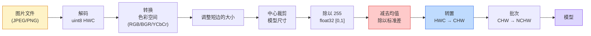

# 图像基础知识——像素、通道、色彩空间

> 图像是光样本的张量。您将使用的每一个视觉模型都始于这一事实。

**类型：** Build
**语言：** Python
**先修：** 第 1 阶段第 12 课（张量运算），第 3 阶段第 11 课（PyTorch 简介）
**时间：** 约 45 分钟

## 学习目标

- 解释连续场景如何离散化为像素以及为什么 sampling/quantization 决策为每个下游模型设定了上限
- 以 NumPy 数组的形式读取、切片和检查图像，并在 HWC 和 CHW 布局之间流畅切换
- 在 RGB、灰度、HSV 和 YCbCr 之间进行转换并证明每个颜色空间存在的原因
- 完全按照 torchvision 的预期应用像素级预处理（归一化、标准化、调整大小、通道优先）

## 问题

您将阅读的每一篇论文、您将下载的每一个预训练权重、您将调用的每一个视觉 API 都假定输入的特定编码。在模型想要 `float32` 的地方传递 `uint8` 图像，它仍然会运行 - 并默默地产生垃圾。将 BGR 馈送到在 RGB 上训练的网络，准确率下降了 10 个百分点。当模型期望通道优先时，将模型通道最后输入传递给模型，并且第一个卷积层将高度视为特征通道。这些都不会引发错误。它只会破坏您的指标，并且您花了一周的时间寻找加载文件方式中存在的错误。

一旦你知道它滑过什么，卷积就不复杂了。困难的部分是“图像”对于相机、JPEG 解码器、PIL、OpenCV、torchvision 和 CUDA 内核来说意味着不同的东西。每个堆栈都有自己的轴顺序、字节范围和通道约定。一位视觉工程师无法让这些直船保持破损的管道。

本课程奠定了基础，以便本阶段的其余部分可以在此基础上进行。最后，您将了解像素是什么，为什么每个像素有三个数字而不是一个，“使用 ImageNet 统计数据进行标准化”实际上做了什么，以及如何在本阶段其他课程将假设的两个或三个布局之间移动。

## 概念

### 完整的预处理流程一目了然

每个生产视觉系统都是相同的可逆变换序列。如果一步错误，模型就会看到与训练时不同的输入。



红色和蓝色两个方框是 80% 的无声故障所在：缺乏标准化和错误的布局。

### 像素是一个样本，而不是一个正方形

相机传感器对落在微型探测器网格上的光子进行计数。每个探测器都会在不到一秒的时间内对光进行积分，并发出与撞击它的光子数量成正比的电压。然后传感器将该电压离散化为整数。一个探测器变成一个像素。

```
Continuous scene                 Sensor grid                     Digital image
(infinite detail)                (H x W detectors)               (H x W integers)

    ~~~~~                        +--+--+--+--+--+                 210 198 180 155 120
   ~   ~   ~                     |  |  |  |  |  |                 205 195 178 152 118
  ~ light ~      ---->           +--+--+--+--+--+     ---->       200 190 175 150 115
   ~~~~~                         |  |  |  |  |  |                 195 185 170 148 112
                                 +--+--+--+--+--+                 188 180 165 145 108
```

这一步发生了两个选择，它们确定了下游所有内容的上限：

- **空间采样**决定场景每度有多少个探测器。太少，边缘会变得锯齿状（锯齿）。太多，存储和计算就会爆炸。
- **强度量化**决定电压存储的精细程度。 8 位提供 256 个级别，是显示的标准。 10、12、16 位为医学成像、HDR 和原始传感器管道提供更平滑的梯度和物质。

像素不是具有面积的彩色正方形。这是一次测量。当您调整大小或旋转时，您正在对该测量网格进行重新采样。

### 为什么要三个通道

一个探测器对整个可见光谱（即灰度）上的光子进行计数。为了获得颜色，传感器用红色、绿色和蓝色滤光片的马赛克覆盖网格。去马赛克后，每个空间位置都有三个整数：红色滤光检测器的响应、绿色滤光的响应和附近蓝色滤光的检测器的响应。这三个整数是像素的 RGB 三元组。

```
One pixel in memory:

    (R, G, B) = (210, 140, 30)   <- reddish-orange

An H x W RGB image:

    shape (H, W, 3)     stored as   H rows of W pixels of 3 values
                                    each in [0, 255] for uint8
```

三不是魔法。深度相机添加 Z 通道。卫星增加了红外线和紫外线波段。医学扫描通常有一个通道（X 射线、CT）或多个通道（高光谱）。通道数为最后一个轴；卷积层学习混合它。

### 两种布局约定：HWC 和 CHW

相同的张量，两个排序。每个图书馆都会挑选一个。

```
HWC (height, width, channels)           CHW (channels, height, width)

   W ->                                    H ->
  +-----+-----+-----+                     +-----+-----+
H |R G B|R G B|R G B|                   C |R R R R R R|
| +-----+-----+-----+                   | +-----+-----+
v |R G B|R G B|R G B|                   v |G G G G G G|
  +-----+-----+-----+                     +-----+-----+
                                          |B B B B B B|
                                          +-----+-----+

   PIL, OpenCV, matplotlib,              PyTorch, most deep learning
   almost every image file on disk       frameworks, cuDNN kernels
```

CHW 存在是因为卷积核在 H 和 W 上滑动。首先保持通道轴意味着每个内核在每个通道上看到一个连续的 2D 平面，该平面可以干净地矢量化。磁盘格式保留 HWC 因为它与扫描线从传感器中出来的方式相匹配。

您将输入一千次的一行转换：

```
img_chw = img_hwc.transpose(2, 0, 1)      # NumPy
img_chw = img_hwc.permute(2, 0, 1)        # PyTorch tensor
```

内存布局，可视化：

```mermaid
flowchart TB
    subgraph HWC["HWC — 交错存储的像素（PIL、OpenCV、JPEG）"]
        H1["第 0 行：R G B |红、绿、蓝 |红、绿、蓝..."]
        H2["第 1 行：R G B |红、绿、蓝 |红、绿、蓝..."]
        H3["第 2 行：R G B |红、绿、蓝 |红、绿、蓝..."]
    end
    subgraph CHW["CHW — 通道存储为景观 (PyTorch, cuDNN)"]
        C1["平面 R：整个 H x W 的红色值"]
        C2["平面 G：绿色值的整个 H x W"]
        C3["平面 B：整个 H x W 的蓝色值"]
    end
    HWC -->|“transpose(2, 0, 1)”| CHW
    CHW -->|“transpose(1, 2, 0)”| HWC
```

### 字节范围和数据类型

三个约定占主导地位：

| 习俗 | 数据类型 | 范围 | 你在哪里看到它 |
|------------|-------|-------|------------------|
| 生的 | `uint8` | [0, 255] | 磁盘上的文件、PIL、OpenCV 输出 |
| 归一化 | `float32` | [0.0, 1.0] | `img.astype('float32') / 255` 之后 |
| 标准化 | `float32` | 大约 [-2, +2] | 减去平均值并除以标准差后 |

卷积网络接受标准化输入的训练。 ImageNet stats `mean=[0.485, 0.456, 0.406]`, `std=[0.229, 0.224, 0.225]` 是整个 ImageNet 训练集上三个通道的算术平均值和标准差，根据 [0, 1] 归一化像素计算。将原始 `uint8` 输入到期望标准化浮动的模型中是应用视觉中最常见的无声失败。

### 色彩空间及其存在的原因

RGB 是捕获格式，但它并不总是模型最有用的表示形式。

```
 RGB               HSV                       YCbCr / YUV

 R red             H hue (angle 0-360)       Y luminance (brightness)
 G green           S saturation (0-1)        Cb chroma blue-yellow
 B blue            V value/brightness (0-1)  Cr chroma red-green

 Linear to         Separates color from      Separates brightness from
 sensor output     brightness. Useful for    color. JPEG and most video
                   color thresholding, UI    codecs compress the chroma
                   sliders, simple filters   channels harder because the
                                             human eye is less sensitive
                                             to chroma detail than to Y.
```

对于大多数现代 CNN 来说，你喂的是 RGB。在以下情况下您会遇到其他空间：

- **HSV** — 经典 CV 代码、基于颜色的分割、白平衡。
- **YCbCr** — 读取 JPEG 内部结构、视频管道、仅在 Y 上运行的超分辨率模型。
- **灰度** - OCR、文档模型、任何颜色是干扰变量而不是信号的情况。

RGB 的灰度是加权和，而不是平均值，因为人眼对绿色比对红色或蓝色更敏感：

```
Y = 0.299 R + 0.587 G + 0.114 B       (ITU-R BT.601, the classic weights)
```

### 长宽比、调整大小和插值

每个模型都有固定的输入大小（对于大多数 ImageNet 分类器为 224x224，对于现代检测器为 384x384 或 512x512）。您的图像很少匹配。三个重要的调整大小选择：

- **调整短边的大小，然后居中裁剪** — 标准 ImageNet 配方。保留纵横比，丢弃一条边缘像素。
- **调整大小并填充** - 保留纵横比和每个像素，添加黑条。检测和 OCR 标准。
- **直接调整大小到目标** — 拉伸图像。便宜，扭曲几何形状，适合许多分类任务。

插值方法决定当新网格与旧网格不对齐时如何计算中间像素：

```
Nearest neighbour     fastest, blocky, only choice for masks/labels
Bilinear              fast, smooth, default for most image resizing
Bicubic               slower, sharper on upscaling
Lanczos               slowest, best quality, used for final display
```

经验法则：用于训练的双线性，用于您将查看的资产的双三次或 lanczos，对于包含整数类 ID 的任何内容最接近。

```figure
conv-output-size
```

## Build It

### 第 1 步：加载图像并检查其形状

使用 Pillow 加载任何 JPEG 或 PNG，转换为 NumPy，然后打印您得到的内容。对于离线运行的确定性示例，请综合一个。

```python
import numpy as np
from PIL import Image

def synthetic_rgb(h=128, w=192, seed=0):
    rng = np.random.default_rng(seed)
    yy, xx = np.meshgrid(np.linspace(0, 1, h), np.linspace(0, 1, w), indexing="ij")
    r = (np.sin(xx * 6) * 0.5 + 0.5) * 255
    g = yy * 255
    b = (1 - yy) * xx * 255
    rgb = np.stack([r, g, b], axis=-1) + rng.normal(0, 6, (h, w, 3))
    return np.clip(rgb, 0, 255).astype(np.uint8)

arr = synthetic_rgb()
# Or load from disk:
# arr = np.asarray(Image.open("your_image.jpg").convert("RGB"))

print(f"type:   {type(arr).__name__}")
print(f"dtype:  {arr.dtype}")
print(f"shape:  {arr.shape}     # (H, W, C)")
print(f"min:    {arr.min()}")
print(f"max:    {arr.max()}")
print(f"pixel at (0, 0): {arr[0, 0]}")
```

预期输出：`shape: (H, W, 3)`、`dtype: uint8`，范围 `[0, 255]`。这是规范的磁盘表示形式，无论字节来自相机、JPEG 解码器还是合成生成器。

### 第 2 步：拆分通道并重新排序布局

分别取出R、G、B，然后从HWC转换为CHW得到PyTorch。

```python
R = arr[:, :, 0]
G = arr[:, :, 1]
B = arr[:, :, 2]
print(f"R shape: {R.shape}, mean: {R.mean():.1f}")
print(f"G shape: {G.shape}, mean: {G.mean():.1f}")
print(f"B shape: {B.shape}, mean: {B.mean():.1f}")

arr_chw = arr.transpose(2, 0, 1)
print(f"\nHWC shape: {arr.shape}")
print(f"CHW shape: {arr_chw.shape}")
```

三个灰度平面，每个通道一个。 CHW 只是重新排序轴；当内存布局允许时，不严格要求进行数据复制。

### 步骤 3：灰度和 HSV 转换

加权和灰度，然后手动RGB-to-HSV。

```python
def rgb_to_grayscale(rgb):
    weights = np.array([0.299, 0.587, 0.114], dtype=np.float32)
    return (rgb.astype(np.float32) @ weights).astype(np.uint8)

def rgb_to_hsv(rgb):
    rgb_f = rgb.astype(np.float32) / 255.0
    r, g, b = rgb_f[..., 0], rgb_f[..., 1], rgb_f[..., 2]
    cmax = np.max(rgb_f, axis=-1)
    cmin = np.min(rgb_f, axis=-1)
    delta = cmax - cmin

    h = np.zeros_like(cmax)
    mask = delta > 0
    rmax = mask & (cmax == r)
    gmax = mask & (cmax == g)
    bmax = mask & (cmax == b)
    h[rmax] = ((g[rmax] - b[rmax]) / delta[rmax]) % 6
    h[gmax] = ((b[gmax] - r[gmax]) / delta[gmax]) + 2
    h[bmax] = ((r[bmax] - g[bmax]) / delta[bmax]) + 4
    h = h * 60.0

    s = np.where(cmax > 0, delta / cmax, 0)
    v = cmax
    return np.stack([h, s, v], axis=-1)

gray = rgb_to_grayscale(arr)
hsv = rgb_to_hsv(arr)
print(f"gray shape: {gray.shape}, range: [{gray.min()}, {gray.max()}]")
print(f"hsv   shape: {hsv.shape}")
print(f"hue range: [{hsv[..., 0].min():.1f}, {hsv[..., 0].max():.1f}] degrees")
print(f"sat range: [{hsv[..., 1].min():.2f}, {hsv[..., 1].max():.2f}]")
print(f"val range: [{hsv[..., 2].min():.2f}, {hsv[..., 2].max():.2f}]")
```

色调以度数、饱和度和值的形式显示在 [0, 1] 中。这符合 OpenCV `hsv_full` 约定。

### 第四步：标准化、标准化、逆向

从原始字节到预训练 ImageNet 模型期望的精确张量，然后返回。

```python
mean = np.array([0.485, 0.456, 0.406], dtype=np.float32)
std = np.array([0.229, 0.224, 0.225], dtype=np.float32)

def preprocess_imagenet(rgb_uint8):
    x = rgb_uint8.astype(np.float32) / 255.0
    x = (x - mean) / std
    x = x.transpose(2, 0, 1)
    return x

def deprocess_imagenet(chw_float32):
    x = chw_float32.transpose(1, 2, 0)
    x = x * std + mean
    x = np.clip(x * 255.0, 0, 255).astype(np.uint8)
    return x

x = preprocess_imagenet(arr)
print(f"preprocessed shape: {x.shape}     # (C, H, W)")
print(f"preprocessed dtype: {x.dtype}")
print(f"preprocessed mean per channel:  {x.mean(axis=(1, 2)).round(3)}")
print(f"preprocessed std  per channel:  {x.std(axis=(1, 2)).round(3)}")

roundtrip = deprocess_imagenet(x)
max_diff = np.abs(roundtrip.astype(int) - arr.astype(int)).max()
print(f"roundtrip max pixel diff: {max_diff}    # should be 0 or 1")
```

每通道平均值应接近于零，标准差接近于一。 preprocess/deprocess 对正是每个 torchvision `transforms.Normalize` 调用在幕后所做的事情。

### 步骤 5：使用三种插值方法调整大小

在高档上比较最近的、双线性的和双三次的，所以差异是可见的。

```python
target = (arr.shape[0] * 3, arr.shape[1] * 3)

nearest = np.asarray(Image.fromarray(arr).resize(target[::-1], Image.NEAREST))
bilinear = np.asarray(Image.fromarray(arr).resize(target[::-1], Image.BILINEAR))
bicubic = np.asarray(Image.fromarray(arr).resize(target[::-1], Image.BICUBIC))

def local_roughness(x):
    gy = np.diff(x.astype(float), axis=0)
    gx = np.diff(x.astype(float), axis=1)
    return float(np.abs(gy).mean() + np.abs(gx).mean())

for name, out in [("nearest", nearest), ("bilinear", bilinear), ("bicubic", bicubic)]:
    print(f"{name:>8}  shape={out.shape}  roughness={local_roughness(out):6.2f}")
```

最近的粗糙度得分最高，因为它保留了硬边缘。双线性是最平滑的。双三次位于两者之间，保留了感知的清晰度，而没有阶梯伪影。

## Use It

`torchvision.transforms` 将以上所有内容捆绑到一个可组合管道中。下面的代码准确地再现了 `preprocess_imagenet` 的作用，并添加了调整大小和裁剪。

```python
import torch
from torchvision import transforms
from PIL import Image

img = Image.fromarray(synthetic_rgb(256, 256))

pipeline = transforms.Compose([
    transforms.Resize(256),
    transforms.CenterCrop(224),
    transforms.ToTensor(),
    transforms.Normalize(mean=[0.485, 0.456, 0.406], std=[0.229, 0.224, 0.225]),
])

x = pipeline(img)
print(f"tensor type:  {type(x).__name__}")
print(f"tensor dtype: {x.dtype}")
print(f"tensor shape: {tuple(x.shape)}      # (C, H, W)")
print(f"per-channel mean: {x.mean(dim=(1, 2)).tolist()}")
print(f"per-channel std:  {x.std(dim=(1, 2)).tolist()}")

batch = x.unsqueeze(0)
print(f"\nbatched shape: {tuple(batch.shape)}   # (N, C, H, W) — ready for a model")
```

四个步骤，严格按照顺序： `Resize(256)` 将短边缩放至 256； `CenterCrop(224)` 从中间取一个224x224的补丁； `ToTensor()` 除以 255 并将 HWC 交换为 CHW； `Normalize` 减去 ImageNet 平均值并除以标准差。颠倒该顺序会默默地改变到达模型的内容。

## Ship It

本课产生：

- `outputs/prompt-vision-preprocessing-audit.md` — 将任何模型卡或数据集卡转变为团队必须遵守的精确预处理不变量的清单的提示。
- `outputs/skill-image-tensor-inspector.md` — 一种技能，给定任何图像形状的张量或数组，报告数据类型、布局、范围以及它是否看起来原始、标准化或标准化。

## 练习

1. **（简单）** 使用 OpenCV (`cv2.imread`) 和 Pillow 加载 JPEG。打印两个形状和 `(0, 0)` 处的像素。解释通道顺序差异，然后编写一行转换，使 OpenCV 数组与 Pillow 数组相同。
2. **（中）** 编写 `standardize(img, mean, std)` 及其逆函数，它们一起通过任何 uint8 图像上的 `roundtrip_max_diff <= 1` 测试。您的函数必须使用相同的调用来处理 HWC 中的单个图像和 NCHW 中的批量图像。
3. **（困难）** 采用 3 通道 ImageNet 标准化张量，并通过 1x1 卷积运行它，将 RGB 的加权混合学习到单个灰度通道中。将权重初始化为 `[0.299, 0.587, 0.114]`，冻结它们，并验证输出与您的手册 `rgb_to_grayscale` 相匹配，且不超出浮点误差。还有哪些其他经典颜色空间变换可以写为 1x1 卷积？

## 关键术语

| 学期 | 人们怎么说 | 它实际上意味着什么 |
|------|----------------|----------------------|
| 像素 | “一个彩色的正方形” | 一个网格位置处的光强度样本 - 三个数字表示颜色，一个数字表示灰度 |
| 渠道 | 「颜色」 | 堆叠成图像张量的并行空间网格之一；最后一个轴在 HWC 中，第一个轴在 CHW 中 |
| HWC / CHW | 「形状」 | 图像张量的轴顺序；磁盘和 PIL 使用 HWC、PyTorch 和 cuDNN 使用 CHW |
| 标准化 | “缩放图像” | 除以 255，使像素位于 [0, 1] 中 — 必要但不充分 |
| 标准化 | “零中心” | 减去平均值并除以每个通道的标准差，以便输入分布与模型训练的分布相匹配 |
| 灰度转换 | “平均频道” | 与人类亮度感知相匹配的系数 0.299/0.587/0.114 的加权和 |
| 插值法 | “调整大小如何选择像素” | 当新网格与旧网格不对齐时决定输出值的规则 - 最接近的标签、双线性的训练、双三次的显示 |
| 纵横比 | “宽度除以高度” | 区分“调整大小和填充”与“调整大小和拉伸”的比率 |

## 延伸阅读

- [Charles Poynton — 色彩空间导览](__URL1__) — 最清晰的技术处理，解释了为什么有如此多的色彩空间以及每个色彩空间何时都很重要
- [PyTorch Vision Transforms Docs](PyTorch) — 您将在生产中实际编写的完整转换管道
- [JPEG 工作原理 (Colt McAnlis)](YCbCr) — 色度二次采样、DCT 以及 JPEG 编码 YCbCr 而不是 RGB 的原因的清晰视觉之旅
- [ImageNet 预处理约定 (torchvision 模型)](`mean=[0.485, 0.456, 0.406]`) — `mean=[0.485, 0.456, 0.406]` 的事实来源以及为什么动物园中的每个模型都期望它
