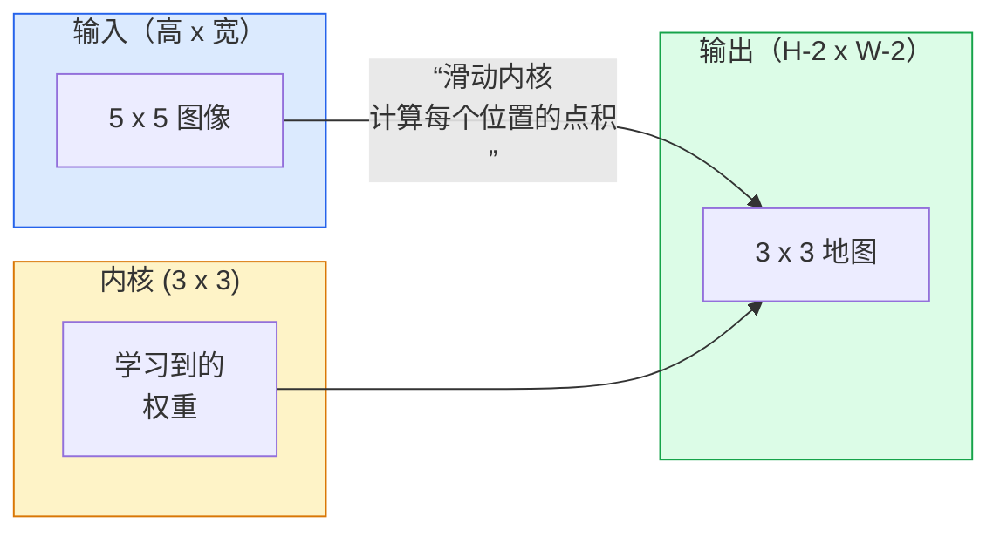
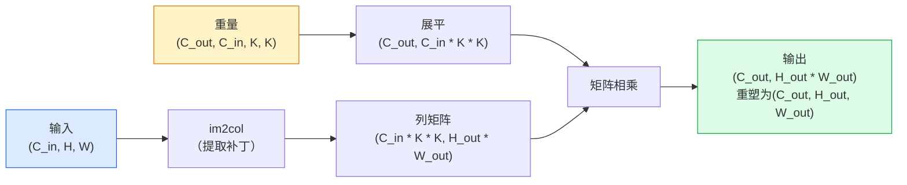

# 从头开始的卷积

> 卷积是在图像上滑动的一个微小的密集层，在每个位置共享相同的权重。

**类型：** Build
**语言：** Python
**先修：** 第 3 阶段（深度学习核心），第 4 阶段第 01 课（图像基础知识）
**时间：** 约 75 分钟

## 学习目标

- 仅使用 NumPy 从头开始​​实现 2D 卷积，包括嵌套循环版本和矢量化 `im2col` 版本
- 计算输入大小、内核大小、填充和步幅的任意组合的输出空间大小，并证明 `(H - K + 2P) / S + 1` 公式的合理性
- 手工设计内核（边缘、模糊、锐化、Sobel）并解释为什么每个内核都会产生它所执行的激活模式
- 将卷积堆叠到特征提取器中，并将堆叠深度与感受野的大小连接起来

## 问题

224x224 RGB 图像上的全连接层每个神经元需要 224 * 224 * 3 = 150,528 个输入权重。在您学到任何有用的东西之前，具有 1,000 个单元的单个隐藏层已经有 1.5 亿个参数。更糟糕的是，该层不知道左上角的狗和右下角的狗是相同的模式。它将每个像素位置视为独立的，这对于图像来说是完全错误的：将猫平移三个像素不应该迫使网络重新学习这个概念。

图像模型需要的两个属性是**平移等方差**（当输入变化时输出也会变化）和**参数共享**（相同的特征检测器在各处运行）。密集的层不会给你带来任何好处。卷积免费为您提供这两者。

卷积并不是为深度学习而发明的。 JPEG 压缩、Photoshop 中的高斯模糊、工业视觉中的边缘检测以及所有推出的音频滤波器均采用相同的操作。从 2012 年到 2020 年，CNNs 主导 ImageNet 的原因是，对于附近值相关且相同模式可以出现在任何地方的数据来说，卷积是正确的先验。

## 概念

### 一粒，滑动

2D 卷积采用一个称为内核（或滤波器）的小权重矩阵，将其在输入上滑动，并在每个位置计算逐元素乘积的总和。该总和成为一个输出像素。



5x5 输入上的具体 3x3 示例（无填充，步长 1）：

```
Input X (5 x 5):                Kernel W (3 x 3):

  1  2  0  1  2                   1  0 -1
  0  1  3  1  0                   2  0 -2
  2  1  0  2  1                   1  0 -1
  1  0  2  1  3
  2  1  1  0  1

The kernel slides across every valid 3 x 3 window. Output Y is 3 x 3:

 Y[0,0] = sum( W * X[0:3, 0:3] )
 Y[0,1] = sum( W * X[0:3, 1:4] )
 Y[0,2] = sum( W * X[0:3, 2:5] )
 Y[1,0] = sum( W * X[1:4, 0:3] )
 ... and so on
```

这个公式——**共享权重、局部性、滑动窗口**——就是整个想法。其他一切都是簿记。

### 输出尺寸公式

给定输入空间大小 `H`、内核大小 `K`、填充 `P`、步幅 `S`：

```
H_out = floor( (H - K + 2P) / S ) + 1
```

记住这一点。对于每个架构，您将计算它数十次。

| 设想 | H | K | 磷 | S | H_输出 |
|----------|---|---|---|---|-------|
| 有效转换，无填充 | 32 | 3 | 0 | 1 | 30 |
| 相同的转化次数（保留大小） | 32 | 3 | 1 | 1 | 32 |
| 采样减少 2 | 32 | 3 | 1 | 2 | 16 |
| 泳池 2x2 | 32 | 2 | 0 | 2 | 16 |
| 感受野大 | 32 | 7 | 3 | 2 | 16 |

“相同的填充”意味着选择 P，以便当 S == 1 时 H_out == H。对于奇数 K，即 P = (K - 1) / 2。这就是 3x3 内核占主导地位的原因 - 它们是仍然具有中心的最小奇数内核。

### 填充

如果没有填充，每次卷积都会缩小特征图。堆叠 20 个图像后，224x224 的图像就会变成 184x184，这会浪费边界上的计算，并使需要匹配形状的剩余连接变得复杂。

```
Zero padding (P = 1) on a 5 x 5 input:

  0  0  0  0  0  0  0
  0  1  2  0  1  2  0
  0  0  1  3  1  0  0
  0  2  1  0  2  1  0       Now the kernel can centre on pixel
  0  1  0  2  1  3  0       (0, 0) and still have three rows and
  0  2  1  1  0  1  0       three columns of values to multiply.
  0  0  0  0  0  0  0
```

您在实践中遇到的模式：`zero`（最常见）、`reflect`（镜像边缘，避免生成模型中的硬边界）、`replicate`（复制边缘）、`circular`（环绕，用于环形问题）。

### 跨步

Stride 是幻灯片的步长。 `stride=1` 是默认值。 `stride=2` 将空间维度减半，是在 CNN 内部下采样的经典方法，无需单独的池化层 - 每个现代架构（ResNet、ConvNeXt、MobileNet）都使用跨步卷积来代替最大池。

```
Stride 1 on a 5 x 5 input, 3 x 3 kernel:

  starts: (0,0) (0,1) (0,2)        -> output row 0
          (1,0) (1,1) (1,2)        -> output row 1
          (2,0) (2,1) (2,2)        -> output row 2

  Output: 3 x 3

Stride 2 on the same input:

  starts: (0,0) (0,2)              -> output row 0
          (2,0) (2,2)              -> output row 1

  Output: 2 x 2
```

### 多个输入通道

真实图像具有三个通道。 RGB 输入上的 3x3 卷积实际上是一个 3x3x3 体积：每个输入通道一个 3x3 切片。在每个空间位置，您对所有三个切片进行乘法和求和，并添加偏差。

```
Input:   (C_in,  H,  W)        3 x 5 x 5
Kernel:  (C_in,  K,  K)        3 x 3 x 3 (one kernel)
Output:  (1,     H', W')       2D map

For a layer that produces C_out output channels, you stack C_out kernels:

Weight:  (C_out, C_in, K, K)   e.g. 64 x 3 x 3 x 3
Output:  (C_out, H', W')       64 x 3 x 3

Parameter count: C_out * C_in * K * K + C_out   (the + C_out is biases)
```

最后一行是您在规划模型时将计算的行。 3 通道输入上的 64 通道 3x3 转换具有 `64 * 3 * 3 * 3 + 64 = 1,792` 参数。便宜的。

### im2col 技巧

嵌套循环很容易阅读，但速度很慢。 GPU 需要大矩阵乘法。技巧：将输入的每个感受野窗口展平为大矩阵的一列，将内核展平为一行，整个卷积变成一个单独的矩阵乘。



每个生产转换实现都是这个的一些变体加上缓存平铺技巧（直接转换，Winograd，用于大型内核的 FFT 转换）。理解了im2col，你就理解了核心。

### 感受野

单个 3x3 转换查看 9 个输入像素。堆叠两个 3x3 卷积，第二层中的神经元查看 5x5 输入像素。三个 3x3 转换得到 7x7。一般来说：

```
RF after L stacked K x K convs (stride 1) = 1 + L * (K - 1)

With strides:   RF grows multiplicatively with stride along each layer.
```

“3x3 all way down”起作用的全部原因（VGG、ResNet、ConvNeXt）是两个 3x3 卷积与一个 5x5 卷积看到相同的输入区域，但参数较少，并且中间有额外的非线性。

```figure
convolution-kernel
```

## Build It

### 第 1 步：填充数组

从最小的基元开始：在 H x W 数组周围用零填充的函数。

```python
import numpy as np

def pad2d(x, p):
    if p == 0:
        return x
    h, w = x.shape[-2:]
    out = np.zeros(x.shape[:-2] + (h + 2 * p, w + 2 * p), dtype=x.dtype)
    out[..., p:p + h, p:p + w] = x
    return out

x = np.arange(9).reshape(3, 3)
print(x)
print()
print(pad2d(x, 1))
```

尾轴技巧 `x.shape[:-2]` 意味着相同的函数无需修改即可在 `(H, W)`、`(C, H, W)` 或 `(N, C, H, W)` 上运行。

### 步骤 2：带有嵌套循环的 2D 卷积

参考实现——缓慢，但明确。这就是 `torch.nn.functional.conv2d` 原则上所做的。

```python
def conv2d_naive(x, w, b=None, stride=1, padding=0):
    c_in, h, w_in = x.shape
    c_out, c_in_w, kh, kw = w.shape
    assert c_in == c_in_w

    x_pad = pad2d(x, padding)
    h_out = (h + 2 * padding - kh) // stride + 1
    w_out = (w_in + 2 * padding - kw) // stride + 1

    out = np.zeros((c_out, h_out, w_out), dtype=np.float32)
    for oc in range(c_out):
        for i in range(h_out):
            for j in range(w_out):
                hs = i * stride
                ws = j * stride
                patch = x_pad[:, hs:hs + kh, ws:ws + kw]
                out[oc, i, j] = np.sum(patch * w[oc])
        if b is not None:
            out[oc] += b[oc]
    return out
```

四个嵌套循环（输出通道、行、列，加上 C_in、kh、kw 上的隐式和）。这是您将检查每个更快的实施的基本事实。

### 第 3 步：使用手工设计的内核进行验证

构建垂直 Sobel 内核，将其应用于合成步骤图像，然后观察垂直边缘亮起。

```python
def synthetic_step_image():
    img = np.zeros((1, 16, 16), dtype=np.float32)
    img[:, :, 8:] = 1.0
    return img

sobel_x = np.array([
    [[-1, 0, 1],
     [-2, 0, 2],
     [-1, 0, 1]]
], dtype=np.float32)[None]

x = synthetic_step_image()
y = conv2d_naive(x, sobel_x, padding=1)
print(y[0].round(1))
```

预计第 7 列会出现较大的正值（从左到右亮度增加），而其他地方会出现零。那张印刷品是你的理智检查，确保数学是正确的。

### 第 4 步：im2col

将输入中的每个内核大小的窗口转换为矩阵的列。对于 `C_in=3, K=3`，每列有 27 个数字。

```python
def im2col(x, kh, kw, stride=1, padding=0):
    c_in, h, w = x.shape
    x_pad = pad2d(x, padding)
    h_out = (h + 2 * padding - kh) // stride + 1
    w_out = (w + 2 * padding - kw) // stride + 1

    cols = np.zeros((c_in * kh * kw, h_out * w_out), dtype=x.dtype)
    col = 0
    for i in range(h_out):
        for j in range(w_out):
            hs = i * stride
            ws = j * stride
            patch = x_pad[:, hs:hs + kh, ws:ws + kw]
            cols[:, col] = patch.reshape(-1)
            col += 1
    return cols, h_out, w_out
```

它仍然是一个 Python 循环，但现在的重担将是单个向量化 matmul。

### 第 5 步：通过 im2col + matmul 进行快速转换

将四重循环替换为一次矩阵乘法。

```python
def conv2d_im2col(x, w, b=None, stride=1, padding=0):
    c_out, c_in, kh, kw = w.shape
    cols, h_out, w_out = im2col(x, kh, kw, stride, padding)
    w_flat = w.reshape(c_out, -1)
    out = w_flat @ cols
    if b is not None:
        out += b[:, None]
    return out.reshape(c_out, h_out, w_out)
```

正确性检查：运行两个实现并进行比较。

```python
rng = np.random.default_rng(0)
x = rng.normal(0, 1, (3, 16, 16)).astype(np.float32)
w = rng.normal(0, 1, (8, 3, 3, 3)).astype(np.float32)
b = rng.normal(0, 1, (8,)).astype(np.float32)

y_naive = conv2d_naive(x, w, b, padding=1)
y_im2col = conv2d_im2col(x, w, b, padding=1)

print(f"max abs diff: {np.max(np.abs(y_naive - y_im2col)):.2e}")
```

`max abs diff` 应该在 `1e-5` 左右——区别是浮点累加顺序，而不是错误。

### 第 6 步：手工设计的内核库

五个过滤器显示单个卷积层在任何训练之前可以表达的内容。

```python
KERNELS = {
    "identity": np.array([[0, 0, 0], [0, 1, 0], [0, 0, 0]], dtype=np.float32),
    "blur_3x3": np.ones((3, 3), dtype=np.float32) / 9.0,
    "sharpen": np.array([[0, -1, 0], [-1, 5, -1], [0, -1, 0]], dtype=np.float32),
    "sobel_x": np.array([[-1, 0, 1], [-2, 0, 2], [-1, 0, 1]], dtype=np.float32),
    "sobel_y": np.array([[-1, -2, -1], [0, 0, 0], [1, 2, 1]], dtype=np.float32),
}

def apply_kernel(img2d, kernel):
    x = img2d[None].astype(np.float32)
    w = kernel[None, None]
    return conv2d_im2col(x, w, padding=1)[0]
```

应用于任何灰度图像时，模糊会软化，锐化边缘会变得清晰，Sobel-x 会照亮垂直边缘，Sobel-y 会照亮水平边缘。这些正是 AlexNet 和 VGG 中*第一个*训练的卷积层最终学习的模式 - 因为无论以后执行什么任务，一个好的图像模型都需要边缘和斑点检测器。

## Use It

PyTorch 的 `nn.Conv2d` 使用 autograd、CUDA 内核和 cuDNN 优化包装相同的操作。形状语义是相同的。

```python
import torch
import torch.nn as nn

conv = nn.Conv2d(in_channels=3, out_channels=64, kernel_size=3, stride=1, padding=1)
print(conv)
print(f"weight shape: {tuple(conv.weight.shape)}   # (C_out, C_in, K, K)")
print(f"bias shape:   {tuple(conv.bias.shape)}")
print(f"param count:  {sum(p.numel() for p in conv.parameters())}")

x = torch.randn(8, 3, 224, 224)
y = conv(x)
print(f"\ninput  shape: {tuple(x.shape)}")
print(f"output shape: {tuple(y.shape)}")
```

将 `padding=1` 替换为 `padding=0`，输出降至 222x222。将 `stride=1` 替换为 `stride=2`，它会下降到 112x112。您在上面记住的公式相同。

## Ship It

本课产生：

- `outputs/prompt-cnn-architect.md` — 提示，给定输入大小、参数预算和目标感受野，在每一步设计具有正确 K/S/P 的 `Conv2d` 层堆栈。
- `outputs/skill-conv-shape-calculator.md` — 一种逐层遍历网络规范并返回每个块的输出形状、感受野和参数计数的技能。

## 练习

1. **（简单）** 给定 128x128 灰度输入和一堆 `[Conv3x3(s=1,p=1), Conv3x3(s=2,p=1), Conv3x3(s=1,p=1), Conv3x3(s=2,p=1)]`，手动计算输出空间大小和每层的感受野。使用 PyTorch `nn.Sequential` 虚拟转换进行验证。
2. **（中）** 扩展 `conv2d_naive` 和 `conv2d_im2col` 以接受 `groups` 参数。表明 `groups=C_in=C_out` 再现了深度卷积，并且其参数计数是 `C * K * K` 而不是 `C * C * K * K`。
3. **（难）** 手动实现 `conv2d_im2col` 的向后传递：给定输出的梯度，计算 `x` 和 `w` 的梯度。在相同的输入和权重上对照 `torch.autograd.grad` 进行验证。技巧：im2col 的梯度是 `col2im`，并且它必须累积重叠窗口。

## 关键术语

| 学期 | 人们怎么说 | 它实际上意味着什么 |
|------|----------------|----------------------|
| 卷积 | “滑动过滤器” | 一个可学习的点积，应用于具有共享权重的每个空间位置；数学上是互相关，但每个人都称之为卷积 |
| 内核/过滤器 | 《特征探测器》 | 形状为 (C_in, K, K) 的小权重张量，其与输入窗口的点积产生一个输出像素 |
| 跨步 | “你跳多远” | 连续内核放置之间的步长；步长 2 将每个空间维度减半 |
| 填充 | “边缘上有零” | 在输入周围添加额外的值，以便内核可以以边界像素为中心； `same` 填充使输出大小等于输入大小 |
| 感受野 | “神经元能看到多少” | 给定输出激活所依赖的原始输入补丁，随着深度和步长而增长 |
| im2col | “GEMM 技巧” | 将每个接收窗口重新排列成列，使卷积成为一个大矩阵乘法——每个快速卷积核的核心 |
| 深度转换 | “每个通道一个内核” | 具有 `groups == C_in` 的转换，仅根据其匹配的输入通道计算每个输出通道； MobileNet 和 ConvNeXt 的骨干 |
| 翻译等方差 | “移入、移出” | 将输入移动 k 个像素会使输出移动 k 个像素的属性；免费提供共享权重 |

## 延伸阅读

- [深度学习卷积算法指南 (Dumoulin & Visin, 2016)](padding/stride/dilation) — 每门课程都会悄悄复制的 padding/stride/dilation 的权威图
- [CS231n：用于视觉识别的卷积神经网络](__URL1__) — 规范的讲义，包括原始的 im2col 解释
- [The Annotated ConvNet (fast.ai)](__URL1__) — 从手动卷积到经过训练的数字分类器的笔记本
- [CNNs (Dang Ha The Hien) 的感受野算术](CNN) — 感受野计算的纸质交互式解释器
