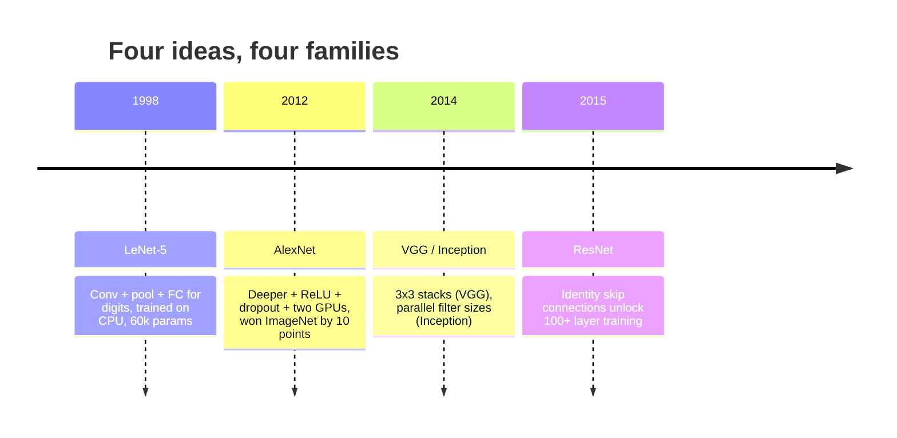
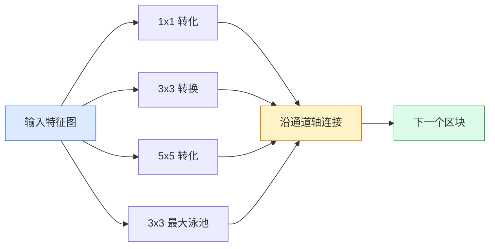
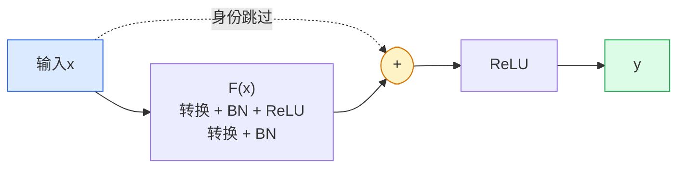

# CNNs — LeNet 到 ResNet

> 过去三十年的每一个主要 CNN 都是相同的转换-非线性-下采样配方，但附加了一个新想法。按顺序学习想法。

**类型：** Learn + Build
**语言：** Python
**先修：** 第 3 阶段第 11 课 (PyTorch)、第 4 阶段第 01 课（图像基础知识）、第 4 阶段第 02 课（从头开始的卷积）
**时间：** 约 75 分钟

## 学习目标

- 追踪架构谱系 LeNet-5 -> AlexNet -> VGG -> Inception -> ResNet 并陈述每个家族贡献的单一新想法
- 在 PyTorch 中实现 LeNet-5、VGG 风格的块和 ResNet BasicBlock，每个块不到 40 行
- 解释为什么残差连接将 1,000 层网络从不可训练变成最先进的网络
- 在查看源代码之前，请阅读现代主干网（ResNet-18、ResNet-50）并预测其输出形状、感受野和参数计数

## 问题

2011 年，最好的 ImageNet 分类器的前 5 名准确率约为 74%。 2012 年 AlexNet 的得分为 85%。 2015年ResNet得分为96%。没有新数据。没有新一代 GPU。收益来自架构思想。视觉工程师必须知道哪个想法来自哪篇论文，因为 2026 年发布的每一个生产主干都是这些相同部分的重组，而且因为想法不断转移：分组的卷积从 CNNs 到 Transformer，残余连接从 ResNet 到每个现有的 LLM，批量归一化存在于扩散模型中。

按顺序研究这些网络还可以让您避免犯一个常见错误：当 LeNet 大小的网络可以解决问题时，却选择最大的可用模型。 MNIST 不需要 ResNet。了解每个家庭的缩放曲线可以告诉你坐在哪里。

## 概念

### 改变愿景的四个想法



在经典视觉中，没有什么比这四次跳跃更重要的了。

### LeNet-5 (1998)

Yann LeCun 的数字识别器。 60,000 个参数。两个卷积池块、两个全连接层、tanh 激活。它定义了每个 CNN 继承的模板：

```
input (1, 32, 32)
  conv 5x5 -> (6, 28, 28)
  avg pool 2x2 -> (6, 14, 14)
  conv 5x5 -> (16, 10, 10)
  avg pool 2x2 -> (16, 5, 5)
  flatten -> 400
  dense -> 120
  dense -> 84
  dense -> 10
```

现代世界称之为 CNN 的一切——交替卷积和下采样馈送到小型分类器头——都是具有更多层、更大通道和更好激活的 LeNet。

### 亚历克斯网络 (2012)

三个改变共同破坏了 ImageNet：

1. **ReLU** 而不是 tanh。梯度停止消失。训练速度提高了六倍。
2. **完全连接头中的漏失**。正则化成为一个层，而不是一个技巧。
3. **深度和宽度**。五个卷积层、三个密集层、60M 个参数，在两个 GPU 上进行训练，模型分布在它们之间。

论文的图 2 仍然显示 GPU 分割为两个并行流。这种并行性是一种硬件解决方法，而不是一种架构见解——但上述三个想法仍然存在于您使用的每个模型中。

### VGG (2014)

VGG问：如果只使用3x3卷积并且深入的话会发生什么？

```
stack:   conv 3x3 -> conv 3x3 -> pool 2x2
repeat:  16 or 19 conv layers
```

两个 3x3 卷积与一个 5x5 卷积具有相同的 5x5 输入区域，但参数较少（2*9*C^2 = 18C^2 与 25*C^2），并且中间有一个额外的 ReLU。 VGG 将这一观察转化为一个完整的架构。简单性——一种块类型，重复——使其成为后来一切的参考点。

成本：138M 个参数，训练速度慢，推理成本高。

### 成立（2014年，同年）

谷歌对“我应该使用多大的内核大小？”的回答是：所有的，并行的。



每个分支都有专门的特征——1x1 用于通道混合，3x3 用于局部纹理，5x5 用于较大图案，池化用于平移不变特征——并且连接让下一层选择有用的分支。 Inception v1 在每个分支内使用 1x1 卷积作为瓶颈，以保持参数计数正常。

### 退化问题

到 2015 年，VGG-19 起作用了，而 VGG-32 不起作用了。深度本应有所帮助，但超过 20 层后，训练和测试损失都变得更糟。那还不算过分。这是优化器无法找到有用的权重，因为梯度在每一层中都会乘法缩小。

```
Plain deep network:
  y = f_L( f_{L-1}( ... f_1(x) ... ) )

Gradient wrt early layer:
  dL/dW_1 = dL/dy * df_L/df_{L-1} * ... * df_2/df_1 * df_1/dW_1

Each multiplicative term has magnitude roughly (weight magnitude) * (activation gain).
Stack 100 of them with gains < 1 and the gradient is effectively zero.
```

VGG 在 19 层上工作，因为批量归一化（同时发布）使激活保持良好的规模。但即使批量归一化也无法挽救超过 30 层的深度。

### 残差网络 (2015)

他、张、任、孙提出了一项解决一切问题的改变：

```
standard block:   y = F(x)
residual block:   y = F(x) + x
```

`+ x` 意味着该层始终可以通过将 `F(x)` 驱动为零来选择不执行任何操作。 1000 层 ResNet 现在至多和 1 层网络一样糟糕，因为每个额外的块都有一个微不足道的逃生舱口。有了这个保证，优化器愿意让每个块“稍微”有用——并且稍微有用，堆叠 100 次，就是最先进的。



该块的两种变体随处可见：

- **BasicBlock**（ResNet-18、ResNet-34）：两个 3x3 卷积，跳过两者。
- **瓶颈**（ResNet-50、-101、-152）：向下 1x1，中间 3x3，向上 1x1，跳过三重奏。当通道数较多时更便宜。

当跳过必须跨越下采样 (stride=2) 时，恒等路径将替换为 1x1 stride=2 转换以匹配形状。

### 为什么残差的重要性超出了我们的想象

这个想法实际上并不是关于图像分类。它是将深度网络从“交叉手指并希望梯度生存”转变为可靠的、可扩展的工程工具。您将读到的有关下一阶段的每个 Transformer 在每个块中都具有完全相同的跳过连接。没有 ResNet，就没有 GPT。

```figure
pooling
```

## Build It

### 步骤1：LeNet-5

一个最小的、忠实的 LeNet。 Tanh 激活，平均池化。对现代性的唯一让步是我们使用 `nn.CrossEntropyLoss` 下游而不是原始的高斯连接。

```python
import torch
import torch.nn as nn
import torch.nn.functional as F

class LeNet5(nn.Module):
    def __init__(self, num_classes=10):
        super().__init__()
        self.conv1 = nn.Conv2d(1, 6, kernel_size=5)
        self.conv2 = nn.Conv2d(6, 16, kernel_size=5)
        self.pool = nn.AvgPool2d(2)
        self.fc1 = nn.Linear(16 * 5 * 5, 120)
        self.fc2 = nn.Linear(120, 84)
        self.fc3 = nn.Linear(84, num_classes)

    def forward(self, x):
        x = self.pool(torch.tanh(self.conv1(x)))
        x = self.pool(torch.tanh(self.conv2(x)))
        x = torch.flatten(x, 1)
        x = torch.tanh(self.fc1(x))
        x = torch.tanh(self.fc2(x))
        return self.fc3(x)

net = LeNet5()
x = torch.randn(1, 1, 32, 32)
print(f"output: {net(x).shape}")
print(f"params: {sum(p.numel() for p in net.parameters()):,}")
```

预期输出：`output: torch.Size([1, 10])`、`params: 61,706`。这就是开启现代视觉的整个数字分类器。

### 第2步：VGG块

一个可重复使用的块：两个 3x3 卷积、ReLU、批量归一化、最大池。

```python
class VGGBlock(nn.Module):
    def __init__(self, in_c, out_c):
        super().__init__()
        self.conv1 = nn.Conv2d(in_c, out_c, kernel_size=3, padding=1)
        self.bn1 = nn.BatchNorm2d(out_c)
        self.conv2 = nn.Conv2d(out_c, out_c, kernel_size=3, padding=1)
        self.bn2 = nn.BatchNorm2d(out_c)
        self.pool = nn.MaxPool2d(2)

    def forward(self, x):
        x = F.relu(self.bn1(self.conv1(x)))
        x = F.relu(self.bn2(self.conv2(x)))
        return self.pool(x)

class MiniVGG(nn.Module):
    def __init__(self, num_classes=10):
        super().__init__()
        self.stack = nn.Sequential(
            VGGBlock(3, 32),
            VGGBlock(32, 64),
            VGGBlock(64, 128),
        )
        self.head = nn.Sequential(
            nn.AdaptiveAvgPool2d(1),
            nn.Flatten(),
            nn.Linear(128, num_classes),
        )

    def forward(self, x):
        return self.head(self.stack(x))

net = MiniVGG()
x = torch.randn(1, 3, 32, 32)
print(f"output: {net(x).shape}")
print(f"params: {sum(p.numel() for p in net.parameters()):,}")
```

CIFAR 大小的输入上的三个 VGG 块、一个自适应池、一个线性层。 约 290k 参数。对于 CIFAR-10 来说足够了。

### 第 3 步：ResNet 基本块

ResNet-18 和 ResNet-34 的核心构建块。

```python
class BasicBlock(nn.Module):
    def __init__(self, in_c, out_c, stride=1):
        super().__init__()
        self.conv1 = nn.Conv2d(in_c, out_c, kernel_size=3, stride=stride, padding=1, bias=False)
        self.bn1 = nn.BatchNorm2d(out_c)
        self.conv2 = nn.Conv2d(out_c, out_c, kernel_size=3, stride=1, padding=1, bias=False)
        self.bn2 = nn.BatchNorm2d(out_c)
        if stride != 1 or in_c != out_c:
            self.shortcut = nn.Sequential(
                nn.Conv2d(in_c, out_c, kernel_size=1, stride=stride, bias=False),
                nn.BatchNorm2d(out_c),
            )
        else:
            self.shortcut = nn.Identity()

    def forward(self, x):
        out = F.relu(self.bn1(self.conv1(x)))
        out = self.bn2(self.conv2(out))
        out = out + self.shortcut(x)
        return F.relu(out)
```

卷积层上的 `bias=False` 是一种批标准化约定 - BN 的 beta 参数已经处理了偏差，因此携带卷积偏差也是一种浪费。当步长或通道数发生变化时，`shortcut` 仅需要真正的转换；否则它是一个无操作身份。

### 第 4 步：一个小型 ResNet

堆叠四组 BasicBlock，以获得适用于 CIFAR 大小输入的工作 ResNet。

```python
class TinyResNet(nn.Module):
    def __init__(self, num_classes=10):
        super().__init__()
        self.stem = nn.Sequential(
            nn.Conv2d(3, 32, kernel_size=3, stride=1, padding=1, bias=False),
            nn.BatchNorm2d(32),
            nn.ReLU(inplace=True),
        )
        self.layer1 = self._make_group(32, 32, num_blocks=2, stride=1)
        self.layer2 = self._make_group(32, 64, num_blocks=2, stride=2)
        self.layer3 = self._make_group(64, 128, num_blocks=2, stride=2)
        self.layer4 = self._make_group(128, 256, num_blocks=2, stride=2)
        self.head = nn.Sequential(
            nn.AdaptiveAvgPool2d(1),
            nn.Flatten(),
            nn.Linear(256, num_classes),
        )

    def _make_group(self, in_c, out_c, num_blocks, stride):
        blocks = [BasicBlock(in_c, out_c, stride=stride)]
        for _ in range(num_blocks - 1):
            blocks.append(BasicBlock(out_c, out_c, stride=1))
        return nn.Sequential(*blocks)

    def forward(self, x):
        x = self.stem(x)
        x = self.layer1(x)
        x = self.layer2(x)
        x = self.layer3(x)
        x = self.layer4(x)
        return self.head(x)

net = TinyResNet()
x = torch.randn(1, 3, 32, 32)
print(f"output: {net(x).shape}")
print(f"params: {sum(p.numel() for p in net.parameters()):,}")
```

四组，每组两个块。第 2、3、4 组开始时的步幅 2。通道数在每次下采样时加倍。大约 2.8M 个参数。这是可以完全扩展到 ResNet-152 的标准方案。

### 第 5 步：比较参数与特征的效率

通过所有三个网络运行相同的输入并比较参数计数。

```python
def summary(name, net, x):
    y = net(x)
    params = sum(p.numel() for p in net.parameters())
    print(f"{name:12s}  input {tuple(x.shape)} -> output {tuple(y.shape)}  params {params:>10,}")

x = torch.randn(1, 3, 32, 32)
summary("LeNet5",     LeNet5(),       torch.randn(1, 1, 32, 32))
summary("MiniVGG",    MiniVGG(),      x)
summary("TinyResNet", TinyResNet(),   x)
```

三个模型，三个时代，参数数量提高了三个数量级。对于 CIFAR-10 准确率，经过几个 epoch 的训练后，您大致需要：LeNet 60%、MiniVGG 89%、TinyResNet 93%。

## Use It

`torchvision.models` 为您提供上述所有内容的预训练版本。各个系列的调用签名都是相同的，这正是主干抽象的要点。

```python
from torchvision.models import resnet18, ResNet18_Weights, vgg16, VGG16_Weights

r18 = resnet18(weights=ResNet18_Weights.IMAGENET1K_V1)
r18.eval()

print(f"ResNet-18 params: {sum(p.numel() for p in r18.parameters()):,}")
print(r18.layer1[0])
print()

v16 = vgg16(weights=VGG16_Weights.IMAGENET1K_V1)
v16.eval()
print(f"VGG-16   params: {sum(p.numel() for p in v16.parameters()):,}")
```

ResNet-18 有 1170 万个参数。 VGG-16有138M。类似的 ImageNet top-1 准确率（69.8% vs 71.6%）。剩余连接为您带来 12 倍的参数效率胜利。这就是为什么 ResNet 变体从 2016 年一直主导到 ViT 于 2021 年出现，并且仍然在计算受限的现实世界部署中占据主导地位。

对于迁移学习，方法始终相同：加载预训练、冻结骨干网、更换分类器头。

```python
for p in r18.parameters():
    p.requires_grad = False
r18.fc = nn.Linear(r18.fc.in_features, 10)
```

三行。您现在拥有一个 10 类 CIFAR 分类器，它继承了 ImageNet 付费的表示形式。

## Ship It

本课产生：

- `outputs/prompt-backbone-selector.md` — 根据任务、数据集大小和计算预算选择正确的 CNN 系列 (LeNet/VGG/ResNet/MobileNet/ConvNeXt) 的提示。
- `outputs/skill-residual-block-reviewer.md` — 读取 PyTorch 模块并标记跳过连接错误的技能（缺少步幅变化的快捷方式、快捷方式激活顺序、相对于加法的 BN 放置）。

## 练习

1. **（简单）** 逐层手工统计`TinyResNet`的参数。与 `sum(p.numel() for p in net.parameters())` 进行比较。大部分参数预算去哪里了——卷积、BN 还是分类器头？
2. **（中）** 实现瓶颈块（1x1 -> 3x3 -> 1x1，带跳过）并Use It为 CIFAR 构建 ResNet-50 风格的网络。将参数与 `TinyResNet` 进行比较。
3. **（困难）** 从 `BasicBlock` 中删除跳跃连接，在 CIFAR-10 上训练一个 34 块“普通”网络和一个 34 块 ResNet，各训练 10 个周期。绘制两者的训练损失与历元的关系图。重现 He 等人。图 1 结果显示，普通深层网络比其较浅的孪生网络收敛到更高的损失。

## 关键术语

| 学期 | 人们怎么说 | 它实际上意味着什么 |
|------|----------------|----------------------|
| 骨干 | “模型” | 产生输入到任务头的特征图的卷积块堆栈 |
| 剩余连接 | “跳过连接” | `y = F(x) + x`；让优化器通过将 F 设置为零来学习恒等式，这使得任意深度都可训练 |
| 基本块 | “两个带有跳过的 3x3 转换” | ResNet-18/34 构建块：conv-BN-ReLU-conv-BN-add-ReLU |
| 瓶颈 | “1x1 向下、3x3、1x1 向上” | ResNet-50/101/152 块；高通道数时价格便宜，因为 3x3 运行宽度较小 |
| 降解问题 | “越深越糟糕” | 经过约 20 个普通卷积层，训练和测试误差都会增加；通过剩余连接解决，而不是通过更多数据 |
| 干 | 「第一层」 | 将3通道输入转换为基本特征宽度的初始转换；通常 ImageNet 为 7x7 步幅 2，CIFAR 为 3x3 步幅 1 |
| 头 | “分类器” | 最终骨干块之后的层：自适应池、展平、linear(s) |
| 迁移学习 | “预训练权重” | 加载在 ImageNet 上训练的骨干网并仅对任务的头部进行微调 |

## 延伸阅读

- [用于图像识别的深度残差学习（He et al., 2015）](__URL1__) — ResNet 论文；每个数字都值得研究
- [极深卷积网络（Simonyan & Zisserman，2014）](__URL1__) — VGG 论文；仍然是“为什么 3x3”的最佳参考
- [ImageNet 深度 CNN 分类（Krizhevsky 等人，2012）](ImageNet) — AlexNet；结束手工特征时代的纸张
- [深入卷积（Szegedy 等人，2014）](Transformer) — Inception v1；并行过滤器的想法仍然出现在愿景 Transformer 中
