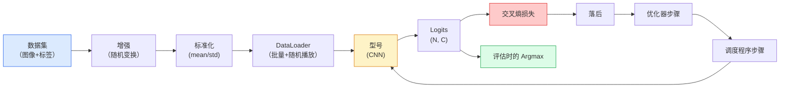

# 图像分类

> 分类器是从像素到类的概率分布的函数。其他一切都是管道。

**类型：** Build
**语言：** Python
**先修：** 第 2 阶段第 09 课（模型评估）、第 3 阶段第 10 课（迷你框架）、第 4 阶段第 03 课 (CNNs)
**时间：** 约 75 分钟

## 学习目标

- 在 CIFAR-10 上构建端到端图像分类管道：数据集、增强、模型、训练循环、评估
- 解释每个组件（数据加载器、损失、优化器、调度器、增强）的作用，并预测破坏其中任何一个组件在损失曲线中的表现
- 从头开始实现混合、剪切和标签平滑，并在每个值得添加时进行论证
- 读取混淆矩阵和每类 precision/recall 表来诊断超出总体准确性的数据集和模型故障

## 问题

每一个视觉任务都会在某种程度上简化为图像分类。检测对区域进行分类。分割对像素进行分类。检索按与类质心的相似性进行排名。正确分类——数据集循环、增强策略、损失、评估——是转移到该阶段中所有其他任务的技能。

大多数分类错误不在模型中。它们生活在管道中：一个破碎的标准化，一个未经洗牌的训练集，扭曲标签的增强，一个被训练数据污染的验证分割，一个在第 30 轮之后悄然发散的学习率。在正确的设置下，在 CIFAR-10 上达到 93% 的 CNN 通常在一个损坏的情况下得分 70-75%，并且损失曲线看起来一直是合理的。

本课程手动连接整个管道，以便检查每个部件。您不会使用 `torchvision.datasets` 中任何可能隐藏错误的内容。

## 概念

### 分类管道



该循环中的每一行都是错误可以生存的地方。交叉熵采用原始 logits，而不是 softmax 输出，因此损失之前的任何 `model(x).softmax()` 都会悄悄计算错误的梯度。增强仅适用于输入，不适用于标签——混合除外，它混合了两者。 `optimizer.zero_grad()` 每一步必须发生一次；跳过它会累积梯度，看起来学习率非常不稳定。这些错误中的每一个都会使学习曲线变平，而不会引发错误。

### 交叉熵、logits 和 softmax

分类器为每个图像生成 `C` 数字，称为 logits。应用 softmax 将它们转换为概率分布：

```
softmax(z)_i = exp(z_i) / sum_j exp(z_j)
```

交叉熵衡量正确类别的负对数概率：

```
CE(z, y) = -log( softmax(z)_y )
        = -z_y + log( sum_j exp(z_j) )
```

右边的形式是数值稳定的形式（log-sum-exp）。 PyTorch 的 `nn.CrossEntropyLoss` 在一个操作中融合了 softmax + NLL 并直接获取原始 logits。首先自己应用softmax几乎总是一个错误——你计算log(softmax(softmax(z)))，一个毫无意义的量。

### 为什么增强有效

CNN 对平移具有归纳偏差（来自权重共享），但对裁剪、翻转、颜色抖动或遮挡没有内置不变性。教它这些不变性的唯一方法是向它展示运用它们的像素。训练期间的每个随机变换都是一种说法：“这两个图像具有相同的标签；学习忽略差异的特征。”

```
Original crop:  "dog facing left"
Flip:           "dog facing right"       <- same label, different pixels
Rotate(+15):    "dog, slight tilt"
Colour jitter:  "dog in warmer light"
RandomErasing:  "dog with patch missing"
```

规则：增强必须保留标签。数字上的剪切和旋转可以将“6”翻转为“9”；对于该数据集，您使用较小的旋转范围并选择尊重数字特定不变性的增强。

### 混音和剪辑

普通的增强会变换像素，但保持标签为热值。 **Mixup** 和 **cutmix** 通过对两者进行插值来打破这一点。

```
Mixup:
  lambda ~ Beta(a, a)
  x = lambda * x_i + (1 - lambda) * x_j
  y = lambda * y_i + (1 - lambda) * y_j

Cutmix:
  paste a random rectangle of x_j into x_i
  y = area-weighted mix of y_i and y_j
```

为什么有帮助：模型不再记忆尖峰的单一热点目标，而是学习在类之间进行插值。训练损失增加，测试准确性增加。对于任何分类器来说，它都是最便宜的鲁棒性升级。

### 标签平滑

混合的表弟。不要针对 `[0, 0, 1, 0, 0]` 进行训练，而是针对 `[eps/C, eps/C, 1-eps, eps/C, eps/C]` 进行训练，以获得较小的 `eps`（如 0.1）。阻止模型产生任意尖锐的 logits，并几乎无需成本即可改进校准。自 PyTorch 1.10 起内置于 `nn.CrossEntropyLoss(label_smoothing=0.1)` 中。

### 超越准确性的评估

总体准确性掩盖了不平衡。 90-10 二元分类器始终预测多数类分数为 90%。真正告诉您正在发生的事情的工具：

- **每类准确度** — 每类一个数字；立即显示表现不佳的类别。
- **混淆矩阵** — C x C 网格，第 i 行 col j = 预测为 j 类的真实类 i 的计数；对角线是正确的，非对角线是模型所在的位置。
- **Top-1 / Top-5** — 正确的类别是否位于前 1 个或前 5 个预测中；前 5 名对于 ImageNet 很重要，因为像“诺维奇梗犬”和“诺福克梗犬”这样的类别确实是不明确的。
- **校准 (ECE)** — 0.8 置信度预测是否在 80% 的时间内正确？现代网络系统性地过度自信；通过温度缩放或标签平滑来修复。

```figure
receptive-field
```

## Build It

### 第 1 步：确定性综合数据集

CIFAR-10 存在于磁盘上。为了使本课程可重复且快速，我们构建了一个类似于 CIFAR 的合成数据集 — 32x32 RGB 图像，具有模型必须学习的特定于类的结构。完全相同的管道在真实的 CIFAR-10 上运行不变。

```python
import numpy as np
import torch
from torch.utils.data import Dataset


def synthetic_cifar(num_per_class=1000, num_classes=10, seed=0):
    rng = np.random.default_rng(seed)
    X = []
    Y = []
    for c in range(num_classes):
        centre = rng.uniform(0, 1, (3,))
        freq = 2 + c
        for _ in range(num_per_class):
            yy, xx = np.meshgrid(np.linspace(0, 1, 32), np.linspace(0, 1, 32), indexing="ij")
            r = np.sin(xx * freq) * 0.5 + centre[0]
            g = np.cos(yy * freq) * 0.5 + centre[1]
            b = (xx + yy) * 0.5 * centre[2]
            img = np.stack([r, g, b], axis=-1)
            img += rng.normal(0, 0.08, img.shape)
            img = np.clip(img, 0, 1)
            X.append(img.astype(np.float32))
            Y.append(c)
    X = np.stack(X)
    Y = np.array(Y)
    idx = rng.permutation(len(X))
    return X[idx], Y[idx]


class ArrayDataset(Dataset):
    def __init__(self, X, Y, transform=None):
        self.X = X
        self.Y = Y
        self.transform = transform

    def __len__(self):
        return len(self.X)

    def __getitem__(self, i):
        img = self.X[i]
        if self.transform is not None:
            img = self.transform(img)
        img = torch.from_numpy(img).permute(2, 0, 1)
        return img, int(self.Y[i])
```

每个类都有自己的调色板和频率模式，加上高斯噪声，迫使模型学习信号而不是记住像素。十个类别，每个类别一千张图像，排列整齐。

### 第 2 步：标准化和增强

每个视觉管道都具有这两种转换。

```python
def standardize(mean, std):
    mean = np.array(mean, dtype=np.float32)
    std = np.array(std, dtype=np.float32)
    def _fn(img):
        return (img - mean) / std
    return _fn


def random_hflip(p=0.5):
    def _fn(img):
        if np.random.random() < p:
            return img[:, ::-1, :].copy()
        return img
    return _fn


def random_crop(pad=4):
    def _fn(img):
        h, w = img.shape[:2]
        padded = np.pad(img, ((pad, pad), (pad, pad), (0, 0)), mode="reflect")
        y = np.random.randint(0, 2 * pad)
        x = np.random.randint(0, 2 * pad)
        return padded[y:y + h, x:x + w, :]
    return _fn


def compose(*fns):
    def _fn(img):
        for fn in fns:
            img = fn(img)
        return img
    return _fn
```

在裁剪之前进行反射填充，而不是零填充，因为黑色边框是模型会学会以无用的方式忽略的信号。

### 第三步：混合

在训练步骤中混合两个图像和两个标签。作为批量转换实现，因此它位于前向传递旁边，而不是在数据集中。

```python
def mixup_batch(x, y, num_classes, alpha=0.2):
    if alpha <= 0:
        return x, torch.nn.functional.one_hot(y, num_classes).float()
    lam = float(np.random.beta(alpha, alpha))
    idx = torch.randperm(x.size(0), device=x.device)
    x_mixed = lam * x + (1 - lam) * x[idx]
    y_onehot = torch.nn.functional.one_hot(y, num_classes).float()
    y_mixed = lam * y_onehot + (1 - lam) * y_onehot[idx]
    return x_mixed, y_mixed


def soft_cross_entropy(logits, soft_targets):
    log_probs = torch.log_softmax(logits, dim=-1)
    return -(soft_targets * log_probs).sum(dim=-1).mean()
```

`soft_cross_entropy` 是针对软标签分布的交叉熵。当目标恰好是独热时，它会减少到通常的独热情况。

### 第 4 步：训练循环

完整的配方：一次传递数据，每批梯度一次，调度程序每轮步进一次。

```python
import torch
import torch.nn as nn
from torch.utils.data import DataLoader
from torch.optim import SGD
from torch.optim.lr_scheduler import CosineAnnealingLR

def train_one_epoch(model, loader, optimizer, device, num_classes, use_mixup=True):
    model.train()
    total, correct, loss_sum = 0, 0, 0.0
    for x, y in loader:
        x, y = x.to(device), y.to(device)
        if use_mixup:
            x_m, y_soft = mixup_batch(x, y, num_classes)
            logits = model(x_m)
            loss = soft_cross_entropy(logits, y_soft)
        else:
            logits = model(x)
            loss = nn.functional.cross_entropy(logits, y, label_smoothing=0.1)
        optimizer.zero_grad()
        loss.backward()
        optimizer.step()
        loss_sum += loss.item() * x.size(0)
        total += x.size(0)
        # Training accuracy vs the un-mixed labels `y` is only an approximation
        # when mixup is on (the model saw soft targets, not y). Treat it as a
        # rough progress signal; rely on val accuracy for real performance.
        with torch.no_grad():
            pred = logits.argmax(dim=-1)
            correct += (pred == y).sum().item()
    return loss_sum / total, correct / total


@torch.no_grad()
def evaluate(model, loader, device, num_classes):
    model.eval()
    total, correct = 0, 0
    loss_sum = 0.0
    cm = torch.zeros(num_classes, num_classes, dtype=torch.long)
    for x, y in loader:
        x, y = x.to(device), y.to(device)
        logits = model(x)
        loss = nn.functional.cross_entropy(logits, y)
        pred = logits.argmax(dim=-1)
        for t, p in zip(y.cpu(), pred.cpu()):
            cm[t, p] += 1
        loss_sum += loss.item() * x.size(0)
        total += x.size(0)
        correct += (pred == y).sum().item()
    return loss_sum / total, correct / total, cm
```

每次编写训练循环时都会检查五个不变量：

1. 训练前 `model.train()`，评估前 `model.eval()` — 翻转 dropout 和 batchnorm 行为。
2. `.zero_grad()` 在 `.backward()` 之前。
3. `.item()` 在累积指标时，因此没有任何东西可以使计算图保持活动状态。
4. 评估期间`@torch.no_grad()` — 节省内存和时间，防止细微的事故。
5. Argmax 与原始 logits 相对，而不是 softmax — 结果相同，但少了一个操作。

### 第 5 步：将其放在一起

使用上一课中的 `TinyResNet`，训练几个 epoch，然后进行评估。

```python
from main import synthetic_cifar, ArrayDataset
from main import standardize, random_hflip, random_crop, compose
from main import mixup_batch, soft_cross_entropy
from main import train_one_epoch, evaluate
# TinyResNet comes from the previous lesson (03-cnns-lenet-to-resnet).
# Adjust the import path to wherever you stored the previous lesson's code.
from cnns_lenet_to_resnet import TinyResNet  # example placeholder

X, Y = synthetic_cifar(num_per_class=500)
split = int(0.9 * len(X))
X_train, Y_train = X[:split], Y[:split]
X_val, Y_val = X[split:], Y[split:]

mean = [0.5, 0.5, 0.5]
std = [0.25, 0.25, 0.25]
train_tf = compose(random_hflip(), random_crop(pad=4), standardize(mean, std))
eval_tf = standardize(mean, std)

train_ds = ArrayDataset(X_train, Y_train, transform=train_tf)
val_ds = ArrayDataset(X_val, Y_val, transform=eval_tf)

train_loader = DataLoader(train_ds, batch_size=128, shuffle=True, num_workers=0)
val_loader = DataLoader(val_ds, batch_size=256, shuffle=False, num_workers=0)

device = "cuda" if torch.cuda.is_available() else "cpu"
model = TinyResNet(num_classes=10).to(device)
optimizer = SGD(model.parameters(), lr=0.1, momentum=0.9, weight_decay=5e-4, nesterov=True)
scheduler = CosineAnnealingLR(optimizer, T_max=10)

for epoch in range(10):
    tr_loss, tr_acc = train_one_epoch(model, train_loader, optimizer, device, 10, use_mixup=True)
    va_loss, va_acc, _ = evaluate(model, val_loader, device, 10)
    scheduler.step()
    print(f"epoch {epoch:2d}  lr {scheduler.get_last_lr()[0]:.4f}  "
          f"train {tr_loss:.3f}/{tr_acc:.3f}  val {va_loss:.3f}/{va_acc:.3f}")
```

在合成数据集上，这在五个时期内达到了近乎完美的验证准确性，这就是要点：管道是正确的，模型可以学习可学习的内容。将数据集替换为真实的 CIFAR-10 和相同的循环训练到约 90%，无需更改。

### 第 6 步：读取混淆矩阵

仅凭准确性并不能告诉您模型的失败之处。混淆矩阵确实如此。

```python
def print_confusion(cm, labels=None):
    c = cm.shape[0]
    labels = labels or [str(i) for i in range(c)]
    print(f"{'':>6}" + "".join(f"{l:>5}" for l in labels))
    for i in range(c):
        row = cm[i].tolist()
        print(f"{labels[i]:>6}" + "".join(f"{v:>5}" for v in row))
    print()
    tp = cm.diag().float()
    fp = cm.sum(dim=0).float() - tp
    fn = cm.sum(dim=1).float() - tp
    prec = tp / (tp + fp).clamp_min(1)
    rec = tp / (tp + fn).clamp_min(1)
    f1 = 2 * prec * rec / (prec + rec).clamp_min(1e-9)
    for i in range(c):
        print(f"{labels[i]:>6}  prec {prec[i]:.3f}  rec {rec[i]:.3f}  f1 {f1[i]:.3f}")

_, _, cm = evaluate(model, val_loader, device, 10)
print_confusion(cm)
```

行是真实的类，列是预测。第 3 类和第 5 类之间的非对角计数集群意味着该模型会混淆这两者，并为您提供有针对性的数据收集或特定于类的增强的起点。

## Use It

`torchvision` 将上面的所有内容包装成惯用的组件。对于真正的 CIFAR-10，完整的管道是四行加上一个训练循环。

```python
from torchvision.datasets import CIFAR10
from torchvision.transforms import Compose, RandomCrop, RandomHorizontalFlip, ToTensor, Normalize

mean = (0.4914, 0.4822, 0.4465)
std = (0.2470, 0.2435, 0.2616)
train_tf = Compose([
    RandomCrop(32, padding=4, padding_mode="reflect"),
    RandomHorizontalFlip(),
    ToTensor(),
    Normalize(mean, std),
])
eval_tf = Compose([ToTensor(), Normalize(mean, std)])

train_ds = CIFAR10(root="./data", train=True,  download=True, transform=train_tf)
val_ds   = CIFAR10(root="./data", train=False, download=True, transform=eval_tf)
```

需要注意力两件事：mean/std 是 **数据集特定的** — 在 CIFAR-10 训练集上计算，而不是 ImageNet — 并且反射板是社区默认的裁剪策略。在这里复制粘贴 ImageNet 统计数据会导致约 1% 的准确度泄漏，直到有人对模型进行分析之前没有人发现这一泄漏。

## Ship It

本课产生：

- `outputs/prompt-classifier-pipeline-auditor.md` — 审核上述五个不变量的训练脚本并显示第一个违规的提示。
- `outputs/skill-classification-diagnostics.md` — 一种技能，在给定混淆矩阵和类名列表的情况下，总结每个类的故障并提出最有影响力的修复方案。

## 练习

1. **（简单）** 在合成数据集上训练具有或不具有混合的相同模型五个时期。绘制两者的训练和 val 损失。解释为什么混合后的训练损失较高，但验证精度相似或更好。
2. **（中）** 实现 Cutout — 将每个训练图像中的随机 8x8 正方形归零 — 并运行消融与无增强、hflip+crop、hflip+crop+cutout、hflip+crop+mixup。报告每个值的准确性。
3. **（困难）** 构建 CIFAR-100 管道（100 个类，相同的输入大小）并重现 ResNet-34 训练运行，使其达到已发布精度的 1% 以内。附加特征：扫描三个学习率和两个权重衰减，记录到本地 CSV，生成最终的混淆矩阵顶部混淆表。

## 关键术语

| 学期 | 人们怎么说 | 它实际上意味着什么 |
|------|----------------|----------------------|
| 洛吉特 | “原始输出” | 每个图像的 C 个数字的 pre-softmax 向量；交叉熵需要这些值，而不是 softmaxed 值 |
| 交叉熵 | “损失” | 正确类别的负对数概率；将 log-softmax 和 NLL 结合在一个稳定的操作中 |
| 数据加载器 | “配料机” | 通过洗牌、批处理和（可选）多工作人员加载来包装数据集；一半的训练错误被归咎于 |
| 增强 | “随机变换” | 训练时保留标签的任何像素级变换；教授 CNN 本身不具有的不变性 |
| 混音/剪辑 | “混合两个图像” | 混合输入和标签，以便分类器学习平滑插值而不是硬边界 |
| 标签平滑 | “更软的目标” | 将 one-hot 替换为 (1-eps, eps/(C-1), ...)；改进了校准并略微提高了准确性 |
| Top-k 准确度 | “前五名” | 正确的类别属于 k 个最高概率的预测；用于具有真正不明确类别的数据集 |
| 混淆矩阵 | “错误存在的地方” | C x C 表，其中条目 (i, j) 对预测为 j 的真实类别 i 的图像进行计数；对角线是正确的，非对角线告诉你要修复什么 |

## 延伸阅读

- [CS231n：训练神经网络](__URL1__) — 仍然是单页训练流程中最清晰的导览
- [Bag of Tricks for Image Classification (He et al., 2019)](ImageNet) — 每个小技巧加起来可以使 ImageNet 上的 ResNet 准确率提高 3-4%
- [mixup: Beyond Empirical Risk Minimization (Zhang et al., 2017)](__URL1__) — 原始 mixup 论文；三页理论加上令人信服的实验
- [为什么温度缩放很重要（Guo et al., 2017）](__URL1__) — 这篇论文证明了现代网络的校准错误，并用一个标量参数修复了它
