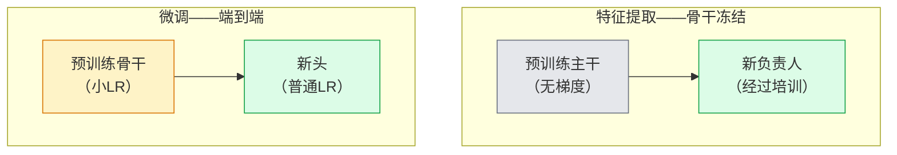

# 迁移学习和微调

> 其他人花了 100 万个 GPU 小时来教导网络边缘、纹理和物体部分是什么样子的。您应该在训练自己的特征之前借用这些特征。

**类型：** Build
**语言：** Python
**先修：** 第 4 阶段第 03 课 (CNNs)，第 4 阶段第 04 课（图像分类）
**时间：** 约 75 分钟

## 学习目标

- 区分特征提取和微调，并根据数据集大小、域距离和计算预算选择正确的特征提取
- 加载预训练的主干，替换其分类器头部，并仅将头部训练到 20 行以下的工作基线
- 通过有区别的学习率逐步解冻层，因此早期的通用特征比后期的特定任务特征获得的更新要小
- 诊断三种常见故障：未冻结块上的 LR 过高导致特征漂移、微小数据集上的 BN 统计数据崩溃以及灾难性遗忘

## 问题

在 ImageNet 上训练 ResNet-50 需要大约 2,000 个 GPU 小时。很少有团队对他们交付的每项任务都有这样的预算。几乎每个团队实际上交付的是一个预训练的骨干网，其新的头部接受了数百或数千个特定任务图像的训练。

这不是捷径。任何 ImageNet 训练的 CNN 的第一个转换块都会学习边缘和类 Gabor 滤波器。接下来的几个块学习纹理和简单的图案。中间的块学习物体的部分。最后的块学习的组合开始看起来像 1,000 个 ImageNet 类别。该层次结构的前 90% 几乎不变地转移到医学成像、工业检查、卫星数据和所有其他视觉任务 - 因为大自然的边缘和纹理词汇量有限。最后10%是你实际训练的。

正确进行迁移会遇到三个错误：用过高的学习率破坏预训练的特征，通过冻结太多信息而使模型缺乏信息，以及让 BatchNorm 的运行统计数据漂移到网络其余部分从未从中学习的微小数据集。本课有目的地引导他们每个人。

## 概念

### 特征提取与微调

两种方案，根据您对预训练特征的信任程度和您拥有的数据量来选择。



经验法则：

| 数据集大小 | 域距离 | 食谱 |
|--------------|-----------------|--------|
| < 1k 图片 | 接近ImageNet | 冻结骨干，仅训练头部 |
| 1k-10k | 关闭 | 冻结前 2-3 个阶段，微调其余部分 |
| 10k-100k | 任何 | 使用判别式 LR 进行端到端微调 |
| 10万+ | 远的 | 微调一切；如果域足够远，请考虑从头开始训练 |

“接近ImageNet”大致是指具有类似物体内容的自然RGB照片。医学 CT 扫描、高空卫星图像和显微镜属于远域 - 这些特征仍然有帮助，但您需要让更多层适应。

### 为什么冷冻有作用

CNN 学习到的 ImageNet 特征并不专门针对 1,000 个类别。它们专门用于自然图像的统计：特定方向的边缘、纹理、对比图案、形状基元。这些统计数据在人类可以命名的几乎所有视觉领域都是稳定的。这就是为什么在 ImageNet 上训练并仅使用新的线性头（没有对主干进行微调）在 CIFAR-10 上评​​估零样本的模型就达到了 80% 以上的准确度。头部正在学习哪些已经学过的特征来衡量该任务。

### 区分学习率

当你解冻时，早期层的训练速度应该比后期层慢。早期层对您想要保留的通用特征进行编码；后期层编码需要经常移动的特定于任务的结构。

```
Typical recipe:

  stage 0 (stem + first group): lr = base_lr / 100    (mostly fixed)
  stage 1:                       lr = base_lr / 10
  stage 2:                       lr = base_lr / 3
  stage 3 (last backbone group): lr = base_lr
  head:                          lr = base_lr  (or slightly higher)
```

在PyTorch 中，这只是传递给优化器的参数组列表。一种模型，五种学习率，零额外代码。

### BatchNorm 问题

BN 层保存在ImageNet 上计算的`running_mean` 和`running_var` 缓冲区。如果您的任务具有不同的像素分布（不同的照明、不同的传感器、不同的色彩空间），那么这些缓冲区就是错误的。三个选项（按优先顺序排列）：

1. **在训练模式下使用 BN 进行微调。** 让 BN 更新其运行统计数据以及其他所有内容。当任务数据集为中等大小（>= 5k 示例）时的默认选择。
2. **在评估模式下冻结 BN。** 保留 ImageNet 统计数据并仅训练权重。当您的数据集足够小以至于 BN 的移动平均值会产生噪音时，请进行更正。
3. **用 GroupNorm 替换 BN。** 完全消除移动平均问题。用于检测和分割主干，其中每个 GPU 的批量大小很小。

默默地犯这个错误会使准确性降低 5-15%。

### 头部设计

分类器头由 1-3 个线性层和一个可选的 dropout 组成。每个 torchvision 主干网都附带一个您可以替换的默认头：

```
backbone.fc = nn.Linear(backbone.fc.in_features, num_classes)          # ResNet
backbone.classifier[1] = nn.Linear(..., num_classes)                    # EfficientNet, MobileNet
backbone.heads.head = nn.Linear(..., num_classes)                       # torchvision ViT
```

对于小型数据集，单个线性层通常就足够了。当任务分布远离骨干网的训练分布时，添加隐藏层（线性 -> ReLU -> Dropout -> 线性）会有所帮助。

### 逐层 LR 衰减

现代微调中使用的判别 LR 的更平滑版本（BEiT、DINOv2、ViT-B 微调）。不要将层分组为阶段，而是为每一层指定比其上面一层稍小的 LR：

```
lr_layer_k = base_lr * decay^(L - k)
```

当 decay = 0.75 和 L = 12 个Transformer块时，第一个块在 `0.75^11 ≈ 0.04x` 头部的 LR 处进行训练。Transformer微调比 CNNs 更重要，在 CNNs 中，阶段分组 LR 通常就足够了。

### 评估什么

迁移学习运行需要两个在临时运行中无法跟踪的数字：

- **仅限预训练的准确性** — 脊柱冻结时头部的准确性。这是你的楼层。
- **微调精度** - 端到端训练后的相同模型。这是你的天花板。

如果微调小于仅预训练，则存在学习率或 BN 错误。始终打印两者。

## Build It

### 第 1 步：加载预训练的主干并检查它

```python
import torch
import torch.nn as nn
from torchvision.models import resnet18, ResNet18_Weights

backbone = resnet18(weights=ResNet18_Weights.IMAGENET1K_V1)
print(backbone)
print()
print("classifier head:", backbone.fc)
print("feature dim:", backbone.fc.in_features)
```

`ResNet18` 有四个阶段 (`layer1..layer4`) 加上一个茎和一个 `fc` 头。每个torchvision分类主干都有一个类似的结构。

### 第 2 步：特征提取——冻结所有内容，更换头部

```python
def make_feature_extractor(num_classes=10):
    model = resnet18(weights=ResNet18_Weights.IMAGENET1K_V1)
    for p in model.parameters():
        p.requires_grad = False
    model.fc = nn.Linear(model.fc.in_features, num_classes)
    return model

model = make_feature_extractor(num_classes=10)
trainable = sum(p.numel() for p in model.parameters() if p.requires_grad)
frozen = sum(p.numel() for p in model.parameters() if not p.requires_grad)
print(f"trainable: {trainable:>10,}")
print(f"frozen:    {frozen:>10,}")
```

只有`model.fc`是可训练的。主干是一个冻结特征提取器。

### 第三步：有区别的微调

一个实用程序，用于构建具有特定于阶段的学习率的参数组。

```python
def discriminative_param_groups(model, base_lr=1e-3, decay=0.3):
    stages = [
        ["conv1", "bn1"],
        ["layer1"],
        ["layer2"],
        ["layer3"],
        ["layer4"],
        ["fc"],
    ]
    groups = []
    for i, names in enumerate(stages):
        lr = base_lr * (decay ** (len(stages) - 1 - i))
        params = [p for n, p in model.named_parameters()
                  if any(n.startswith(k) for k in names)]
        if params:
            groups.append({"params": params, "lr": lr, "name": "_".join(names)})
    return groups

model = resnet18(weights=ResNet18_Weights.IMAGENET1K_V1)
model.fc = nn.Linear(model.fc.in_features, 10)
for p in model.parameters():
    p.requires_grad = True

groups = discriminative_param_groups(model)
for g in groups:
    print(f"{g['name']:>10s}  lr={g['lr']:.2e}  params={sum(p.numel() for p in g['params']):>8,}")
```

`decay=0.3` 表示每个阶段的训练速度是下一阶段的 30%。 `fc` 获取`base_lr`，`layer4` 获取`0.3 * base_lr`，`conv1` 获取`0.3^5 * base_lr ≈ 0.00243 * base_lr`。听起来极端；从经验上看它是有效的。

### 步骤 4：BatchNorm 处理

帮助冻结 BN 跑步统计数据而不冻结其权重。

```python
def freeze_bn_stats(model):
    for m in model.modules():
        if isinstance(m, (nn.BatchNorm1d, nn.BatchNorm2d, nn.BatchNorm3d)):
            m.eval()
            for p in m.parameters():
                p.requires_grad = False
    return model
```

在每个纪元开始时设置 `model.train()` 后调用它。 `model.train()` 将一切切换至训练模式；这仅适用于 BN 层。

### Step 5: A minimal end-to-end fine-tuning loop

```python
from torch.optim import SGD
from torch.utils.data import DataLoader
from torch.optim.lr_scheduler import CosineAnnealingLR
import torch.nn.functional as F

def fine_tune(model, train_loader, val_loader, device, epochs=5, base_lr=1e-3, freeze_bn=False):
    model = model.to(device)
    groups = discriminative_param_groups(model, base_lr=base_lr)
    optimizer = SGD(groups, momentum=0.9, weight_decay=1e-4, nesterov=True)
    scheduler = CosineAnnealingLR(optimizer, T_max=epochs)

    for epoch in range(epochs):
        model.train()
        if freeze_bn:
            freeze_bn_stats(model)
        tr_loss, tr_correct, tr_total = 0.0, 0, 0
        for x, y in train_loader:
            x, y = x.to(device), y.to(device)
            logits = model(x)
            loss = F.cross_entropy(logits, y, label_smoothing=0.1)
            optimizer.zero_grad()
            loss.backward()
            optimizer.step()
            tr_loss += loss.item() * x.size(0)
            tr_total += x.size(0)
            tr_correct += (logits.argmax(-1) == y).sum().item()
        scheduler.step()

        model.eval()
        va_total, va_correct = 0, 0
        with torch.no_grad():
            for x, y in val_loader:
                x, y = x.to(device), y.to(device)
                pred = model(x).argmax(-1)
                va_total += x.size(0)
                va_correct += (pred == y).sum().item()
        print(f"epoch {epoch}  train {tr_loss/tr_total:.3f}/{tr_correct/tr_total:.3f}  "
              f"val {va_correct/va_total:.3f}")
    return model
```

在 CIFAR-10 上使用上述配方的五个周期将 `ResNet18-IMAGENET1K_V1` 从约 70% 的零样本线性探针精度提高到约 93% 的微调精度。仅头部就会稳定在 86% 左右，而不会触及脊椎。

### 第 6 步：渐进解冻

从结束到开始每个时期解冻一个阶段的时间表。以一些额外的纪元为代价来缓解特征漂移。

```python
def progressive_unfreeze_schedule(model):
    stages = ["layer4", "layer3", "layer2", "layer1"]
    yielded = set()

    def start():
        for p in model.parameters():
            p.requires_grad = False
        for p in model.fc.parameters():
            p.requires_grad = True

    def unfreeze(epoch):
        if epoch < len(stages):
            name = stages[epoch]
            yielded.add(name)
            for n, p in model.named_parameters():
                if n.startswith(name):
                    p.requires_grad = True
            return name
        return None

    return start, unfreeze
```

在第一个纪元之前调用`start()`一次。在每个纪元开始时调用`unfreeze(epoch)`。每当可训练参数集发生变化时，就重建优化器，否则冻结的参数仍然保留着使其混乱的缓存时刻。

## Use It

对于大多数实际任务，`torchvision.models` + 三行就足够了。当您遇到库默认值无法解决的问题时，上述较重的机制就很重要。

```python
from torchvision.models import resnet50, ResNet50_Weights

model = resnet50(weights=ResNet50_Weights.IMAGENET1K_V2)
model.fc = nn.Linear(model.fc.in_features, num_classes)
optimizer = torch.optim.AdamW(model.parameters(), lr=1e-4, weight_decay=1e-4)
```

另外两个生产级默认值：

- `timm` 通过一致的 API (`timm.create_model("resnet50", pretrained=True, num_classes=10)`) 提供了约 800 个预训练的视觉主干。对于 torchvision 动物园之外的任何微调，它都是标准。
- 对于Transformer，`transformers.AutoModelForImageClassification.from_pretrained(name, num_labels=N)` 为您提供 ViT / BEiT / DeiT，其加载语义与文本模型相同。

## Ship It

本课产生：

- `outputs/prompt-fine-tune-planner.md` — 根据数据集大小、域距离和计算预算选择特征提取、渐进式和端到端微调的提示。
- `outputs/skill-freeze-inspector.md` - 一项技能，给定 PyTorch 模型，报告哪些参数是可训练的，哪些 BatchNorm 层处于评估模式，以及优化器是否实际上正在输入可训练参数。

## 练习

1. **（简单）** 将 `ResNet18` 训练为线性探针（主干冻结）并作为同一合成 CIFAR 数据集上的完整微调。并列报告两个精度。解释哪个差距告诉您特征迁移良好，哪个差距告诉您特征迁移不佳。
2. **（中）** 故意引入一个错误：在主干阶段而不是头部设置`base_lr = 1e-1`。显示训练损失爆炸，然后通过应用 `discriminative_param_groups` 助手来恢复。记录每个阶段开始发散的 LR。
3. **(Hard)** Take a medical imaging dataset (e.g. CheXpert-small, PatchCamelyon, or HAM10000) and compare three regimes: (a) ImageNet-pretrained frozen backbone + linear head; (b) ImageNet-pretrained fine-tune end-to-end; (c) scratch training. Report accuracy and compute cost for each. At what dataset size does scratch training become competitive?

## 关键术语

| 学期 | What people say | 它实际上意味着什么 |
|------|----------------|----------------------|
| 特征提取 | “冻结并训练头” | 骨干参数冻结，只有新的分类器头接收梯度 |
| 微调 | “端到端重新训练” | 所有参数均可训练，通常 LR 比原始训练小得多 |
| Discriminative LR | “早期层的较小 LR” | 优化器参数组，其中早期 LR 是后期 LR 的一小部分 |
| 逐层 LR 衰减 | “平滑 LR 渐变” | 每层LR乘以衰减^(L - k)；常见于Transformer微调 |
| 灾难性遗忘 | “模型丢失ImageNet” | 过高的 LR 会在学习新任务信号之前覆盖预训练的特征 |
| BN统计漂移 | “运行平均值是错误的” | BatchNorm running_mean/var 在与当前任务不同的分布上计算，默默地损害了准确性 |
| 线性探头 | “冰冻脊椎+线性头” | 预训练特征的评估 - 冻结表示之上的最佳线性分类器的准确性 |
| 灾难性的崩溃 | “一切都预示着一堂课” | 当使用足够高的 LR 进行微调以在头部梯度稳定之前破坏特征时会发生 |

## 延伸阅读

- [深度神经网络中的特征可转移性如何？ (Yosinski et al., 2014)](https://arxiv.org/abs/1411.1792) — 量化跨层特征可转移性的论文
- [通用语言模型微调 (ULMFiT, Howard & Ruder, 2018)](https://arxiv.org/abs/1801.06146) — 原始的判别式 LR/渐进解冻配方；想法直接转化为愿景
- [timm 文档](https://huggingface.co/docs/timm) — 现代视觉主干的参考以及它们接受训练的精确微调默认值
- [线性探头评估的简单框架（Kornblith 等人，2019）](https://arxiv.org/abs/1805.08974) — 为什么线性探头精度很重要以及如何正确报告它
