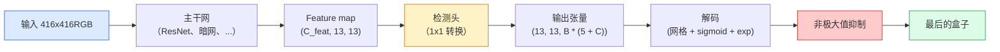

# 物体检测 — YOLO 从头开始

> 检测是分类加回归，在特征图中的每个位置运行，然后用非极大值抑制进行清理。

**类型：** Build
**语言：** Python
**先修：** 第 4 阶段第 03 课 (CNNs)、第 4 阶段第 04 课（图像分类）、第 4 阶段第 05 课（迁移学习）
**时间：** 约 75 分钟

## 学习目标

- 解释将检测转变为密集预测问题的网格和锚点设计，并说明输出张量中每个数字的含义
- 计算框之间的交并并从头开始实现非极大值抑制
- 在预训练的主干之上构建一个最小的 YOLO 式头部，包括分类、对象性和框回归损失
- 读取检测指标行（精度@0.5、召回率、mAP@0.5、mAP@0.5:0.95）并选择下一步要转动的旋钮

## 问题

分类显示“这张图片是一只狗”。检测显示“在像素 (112, 40, 280, 210) 处有一只狗，在 (400, 180, 560, 310) 处有一只猫，帧中没有其他东西。”这一结构性变化——预测可变数量的标签框，而不是每个图像一个标签——是每个自主系统、每个监控产品、每个文档布局解析器和每个工厂视觉线所依赖的。

检测也是视觉中所有工程权衡同时显现的地方。您希望框是准确的（回归头），您希望每个框都有正确的类（分类头），您希望模型知道何时没有任何可检测的内容（对象分数），并且您希望每个真实对象都有一个预测（非极大值抑制）。错过其中任何一个，管道要么错过对象，报告幻觉框，要么在略有不同的位置预测同一对象十五次。

YOLO (You Only Look Once, Redmon et al. 2016) was the design that made all of this run in real time by doing it with a single forward pass of a conv net, and the same structural decisions are still the backbone of modern detectors (YOLOv8, YOLOv9, YOLO-NAS, RT-DETR). Learn the core and every variant becomes a rearrangement of the same parts.

## 概念

### 检测作为密集预测

A classifier outputs C numbers per image. A YOLO-style detector outputs `(S x S x (5 + C))` numbers per image, where S is the spatial grid size.



每个`S * S` 网格单元都预测`B` 框。对于每个盒子：

- 4 个数字描述几何形状：`tx, ty, tw, th`。
- 1 个数字是对象性分数：“此单元格中是否有对象？”
- C numbers are class probabilities.

Total per cell: `B * (5 + C)`. For VOC with `S=13, B=2, C=20`, that is 50 numbers per cell.

### 为什么要使用网格和锚点

简单回归将以绝对坐标的形式预测每个对象的`(x, y, w, h)`。这对于卷积网络来说很难，因为平移图像不应该将所有预测平移相同的量——每个对象都是空间锚定的。网格通过将每个真实框分配给其中心所在的网格单元来回答这个问题；只有那个细胞负责那个物体。

锚点解决了第二个问题。 3x3 卷积无法轻松地将 500 像素宽的框从 16 像素感受野特征单元中回归出来。相反，我们预先定义每个单元的`B`先验框形状（锚点）并预测每个锚点的小增量。该模型学会选择正确的锚点并推动它，而不是从无到有回归。

```
Anchor box priors (example for 416x416 input):

  small:   (30,  60)
  medium:  (75,  170)
  large:   (200, 380)

At each grid cell, every anchor emits (tx, ty, tw, th, obj, c_1, ..., c_C).
```

现代检测器通常使用每个分辨率具有不同锚点集的 FPN——浅层高分辨率地图上的小锚点，深层低分辨率地图上的大锚点。相同的想法，更多的尺度。

### 解码预测

原始`tx, ty, tw, th`不是盒子坐标；它们是在绘图之前要转换的回归目标：

```
centre x  = (sigmoid(tx) + cell_x) * stride
centre y  = (sigmoid(ty) + cell_y) * stride
width     = anchor_w * exp(tw)
height    = anchor_h * exp(th)
```

`sigmoid` 将中心偏移保持在单元内。 `exp` 让宽度从锚点自由缩放，而无需符号翻转。 `stride` 将网格坐标缩放回像素。自 v2 以来，此解码步骤在每个 YOLO 版本中都是相同的。

### IOU

两个框之间检测的通用相似性度量：

```
IoU(A, B) = area(A intersect B) / area(A union B)
```

IoU = 1 means identical; IoU = 0 means no overlap. IoU between the prediction and the ground-truth box is what decides whether a prediction counts as a true positive (typically IoU >= 0.5). IoU between two predictions is what NMS uses to deduplicate.

### 非极大值抑制

在相邻锚点上训练的卷积网络通常会预测同一对象的重叠框。 NMS 保留最高置信度的预测，并删除 IoU 高于阈值的任何其他预测。

```
NMS(boxes, scores, iou_threshold):
    sort boxes by score descending
    keep = []
    while boxes not empty:
        pick the top-scoring box, add to keep
        remove every box with IoU > iou_threshold to the picked box
    return keep
```

目标检测的典型阈值：0.45。最近的检测器用`soft-NMS`、`DIoU-NMS`取代标准NMS，或者直接学习抑制（RT-DETR），但结构目的是相同的。

### 损失

YOLO损失是三个损失加上权重：

```
L = lambda_coord * L_box(pred, target, where obj=1)
  + lambda_obj   * L_obj(pred, 1,     where obj=1)
  + lambda_noobj * L_obj(pred, 0,     where obj=0)
  + lambda_cls   * L_cls(pred, target, where obj=1)
```

只有包含对象的单元才会影响框回归和分类损失。没有对象的细胞只会导致对象性损失（教导模型保持沉默）。 `lambda_noobj` 通常很小（约 0.5），因为绝大多数单元格是空的，否则将主导总损失。

现代变体将 MSE 框损失替换为 CIoU / DIoU（直接优化 IoU），使用焦点损失来解决类别不平衡，并平衡客观性与质量焦点损失。三元结构不变。

### 检测指标

准确性不会转移到检测上。四个数字可以：

- **精度@IoU=0.5** — 在被视为阳性的预测中，有多少实际上是正确的。
- **Recall@IoU=0.5** — of the real objects, how many did we find.
- **AP@0.5** — IoU 阈值 0.5 时的精确召回曲线面积；每班一个号码。
- **mAP@0.5:0.95** — AP 超过 IoU 阈值 0.5、0.55、...、0.95 的平均值。 COCO 指标；最严格、信息最丰富的。

报告所有四个。在 mAP@0.5 上较强但在 mAP@0.5:0.95 上较弱的检测器定位粗略但不紧密；修复更好的盒子回归损失。精度高、召回率低的检测器过于保守；降低置信度阈值或增加客观性权重。

## Build It

### 第一步：借条

是整节课的主力。适用于 `(x1, y1, x2, y2)` 格式的两个盒子数组。

```python
import numpy as np

def box_iou(boxes_a, boxes_b):
    ax1, ay1, ax2, ay2 = boxes_a[:, 0], boxes_a[:, 1], boxes_a[:, 2], boxes_a[:, 3]
    bx1, by1, bx2, by2 = boxes_b[:, 0], boxes_b[:, 1], boxes_b[:, 2], boxes_b[:, 3]

    inter_x1 = np.maximum(ax1[:, None], bx1[None, :])
    inter_y1 = np.maximum(ay1[:, None], by1[None, :])
    inter_x2 = np.minimum(ax2[:, None], bx2[None, :])
    inter_y2 = np.minimum(ay2[:, None], by2[None, :])

    inter_w = np.clip(inter_x2 - inter_x1, 0, None)
    inter_h = np.clip(inter_y2 - inter_y1, 0, None)
    inter = inter_w * inter_h

    area_a = (ax2 - ax1) * (ay2 - ay1)
    area_b = (bx2 - bx1) * (by2 - by1)
    union = area_a[:, None] + area_b[None, :] - inter
    return inter / np.clip(union, 1e-8, None)
```

返回成对 IoU 的 `(N_a, N_b)` 矩阵。通过将其中一个数组设为 `(1, 4)` 形状，将其用于单个真实框。

### 步骤2：非极大值抑制

```python
def nms(boxes, scores, iou_threshold=0.45):
    order = np.argsort(-scores)
    keep = []
    while len(order) > 0:
        i = order[0]
        keep.append(i)
        if len(order) == 1:
            break
        rest = order[1:]
        ious = box_iou(boxes[[i]], boxes[rest])[0]
        order = rest[ious <= iou_threshold]
    return np.array(keep, dtype=np.int64)
```

确定性，`O(N log N)` 来自排序，并匹配`torchvision.ops.nms` 在相同输入上的行为。

### 步骤3：Box编码和解码

在像素坐标和网络实际回归的 `(tx, ty, tw, th)` 目标之间进行转换。

```python
def encode(box_xyxy, cell_x, cell_y, stride, anchor_wh):
    x1, y1, x2, y2 = box_xyxy
    cx = 0.5 * (x1 + x2)
    cy = 0.5 * (y1 + y2)
    w = x2 - x1
    h = y2 - y1
    tx = cx / stride - cell_x
    ty = cy / stride - cell_y
    tw = np.log(w / anchor_wh[0] + 1e-8)
    th = np.log(h / anchor_wh[1] + 1e-8)
    return np.array([tx, ty, tw, th])


def decode(tx_ty_tw_th, cell_x, cell_y, stride, anchor_wh):
    tx, ty, tw, th = tx_ty_tw_th
    cx = (sigmoid(tx) + cell_x) * stride
    cy = (sigmoid(ty) + cell_y) * stride
    w = anchor_wh[0] * np.exp(tw)
    h = anchor_wh[1] * np.exp(th)
    return np.array([cx - w / 2, cy - h / 2, cx + w / 2, cy + h / 2])


def sigmoid(x):
    return 1.0 / (1.0 + np.exp(-x))
```

测试：对一个框进行编码然后解码——您应该得到非常接近原始数据的结果（当 `tx` 不在后 sigmoid 范围内时，sigmoid 逆不能完全可逆）。

### 第 4 步：最小YOLO 头

特征图上的一个 1x1 卷积，重塑为`(B, S, S, num_anchors, 5 + C)`。

```python
import torch
import torch.nn as nn

class YOLOHead(nn.Module):
    def __init__(self, in_c, num_anchors, num_classes):
        super().__init__()
        self.num_anchors = num_anchors
        self.num_classes = num_classes
        self.conv = nn.Conv2d(in_c, num_anchors * (5 + num_classes), kernel_size=1)

    def forward(self, x):
        n, _, h, w = x.shape
        y = self.conv(x)
        y = y.view(n, self.num_anchors, 5 + self.num_classes, h, w)
        y = y.permute(0, 3, 4, 1, 2).contiguous()
        return y
```

Output shape: `(N, H, W, num_anchors, 5 + C)`. The last dimension holds `[tx, ty, tw, th, obj, cls_0, ..., cls_{C-1}]`.

### 第 5 步：地面实况分配

对于每个真实框，确定哪个 `(cell, anchor)` 负责。

```python
def assign_targets(boxes_xyxy, classes, anchors, stride, grid_size, num_classes):
    num_anchors = len(anchors)
    target = np.zeros((grid_size, grid_size, num_anchors, 5 + num_classes), dtype=np.float32)
    has_obj = np.zeros((grid_size, grid_size, num_anchors), dtype=bool)

    for box, cls in zip(boxes_xyxy, classes):
        x1, y1, x2, y2 = box
        cx, cy = 0.5 * (x1 + x2), 0.5 * (y1 + y2)
        gx, gy = int(cx / stride), int(cy / stride)
        bw, bh = x2 - x1, y2 - y1

        ious = np.array([
            (min(bw, aw) * min(bh, ah)) / (bw * bh + aw * ah - min(bw, aw) * min(bh, ah))
            for aw, ah in anchors
        ])
        best = int(np.argmax(ious))
        aw, ah = anchors[best]

        target[gy, gx, best, 0] = cx / stride - gx
        target[gy, gx, best, 1] = cy / stride - gy
        target[gy, gx, best, 2] = np.log(bw / aw + 1e-8)
        target[gy, gx, best, 3] = np.log(bh / ah + 1e-8)
        target[gy, gx, best, 4] = 1.0
        target[gy, gx, best, 5 + cls] = 1.0
        has_obj[gy, gx, best] = True
    return target, has_obj
```

锚点选择是“与真实情况的最佳形状 IoU”——一个与 YOLOv2/v3 分配相匹配的廉价代理。 v5 及更高版本使用更复杂的策略（任务对齐匹配、动态 k）来完善相同的想法。

### 第六步：三种损失

```python
def yolo_loss(pred, target, has_obj, lambda_coord=5.0, lambda_obj=1.0, lambda_noobj=0.5, lambda_cls=1.0):
    has_obj_t = torch.from_numpy(has_obj).bool()
    target_t = torch.from_numpy(target).float()

    # box-regression loss: only on cells with objects
    box_pred = pred[..., :4][has_obj_t]
    box_true = target_t[..., :4][has_obj_t]
    loss_box = torch.nn.functional.mse_loss(box_pred, box_true, reduction="sum")

    # objectness loss
    obj_pred = pred[..., 4]
    obj_true = target_t[..., 4]
    loss_obj_pos = torch.nn.functional.binary_cross_entropy_with_logits(
        obj_pred[has_obj_t], obj_true[has_obj_t], reduction="sum")
    loss_obj_neg = torch.nn.functional.binary_cross_entropy_with_logits(
        obj_pred[~has_obj_t], obj_true[~has_obj_t], reduction="sum")

    # classification loss on cells with objects
    cls_pred = pred[..., 5:][has_obj_t]
    cls_true = target_t[..., 5:][has_obj_t]
    loss_cls = torch.nn.functional.binary_cross_entropy_with_logits(
        cls_pred, cls_true, reduction="sum")

    total = (lambda_coord * loss_box
             + lambda_obj * loss_obj_pos
             + lambda_noobj * loss_obj_neg
             + lambda_cls * loss_cls)
    return total, {"box": loss_box.item(), "obj_pos": loss_obj_pos.item(),
                   "obj_neg": loss_obj_neg.item(), "cls": loss_cls.item()}
```

每个 YOLO 教程都硬编码或扫描的五个超参数。比率很重要：`lambda_coord=5, lambda_noobj=0.5` 反映了原始YOLOv1 论文，并且仍然是合理的默认值。

### 第 7 步：推理管道

解码原始头输出，应用 sigmoid/exp、对象阈值和 NMS。

```python
def postprocess(pred_tensor, anchors, stride, img_size, conf_threshold=0.25, iou_threshold=0.45):
    pred = pred_tensor.detach().cpu().numpy()
    grid_h, grid_w = pred.shape[1], pred.shape[2]
    num_anchors = len(anchors)

    boxes, scores, classes = [], [], []
    for gy in range(grid_h):
        for gx in range(grid_w):
            for a in range(num_anchors):
                tx, ty, tw, th, obj, *cls = pred[0, gy, gx, a]
                score = sigmoid(obj) * sigmoid(np.array(cls)).max()
                if score < conf_threshold:
                    continue
                cls_idx = int(np.argmax(cls))
                cx = (sigmoid(tx) + gx) * stride
                cy = (sigmoid(ty) + gy) * stride
                w = anchors[a][0] * np.exp(tw)
                h = anchors[a][1] * np.exp(th)
                boxes.append([cx - w / 2, cy - h / 2, cx + w / 2, cy + h / 2])
                scores.append(float(score))
                classes.append(cls_idx)

    if not boxes:
        return np.zeros((0, 4)), np.zeros((0,)), np.zeros((0,), dtype=int)
    boxes = np.array(boxes)
    scores = np.array(scores)
    classes = np.array(classes)
    keep = nms(boxes, scores, iou_threshold)
    return boxes[keep], scores[keep], classes[keep]
```

这就是完整的评估路径：head -> 解码 -> 阈值 -> NMS。

## Use It

`torchvision.models.detection` 生产的探测器具有相同的概念结构。加载预训练模型需要三行。

```python
import torch
from torchvision.models.detection import fasterrcnn_resnet50_fpn_v2

model = fasterrcnn_resnet50_fpn_v2(weights="DEFAULT")
model.eval()
with torch.no_grad():
    predictions = model([torch.randn(3, 400, 600)])
print(predictions[0].keys())
print(f"boxes:  {predictions[0]['boxes'].shape}")
print(f"scores: {predictions[0]['scores'].shape}")
print(f"labels: {predictions[0]['labels'].shape}")
```

对于实时推理管道，`ultralytics` (YOLOv8/v9) 是标准：`from ultralytics import YOLO; model = YOLO('yolov8n.pt'); model(img)`。该模型在内部处理解码和 NMS，并返回与您上面构建的相同的 `boxes / scores / labels` 三元组。

## Ship It

本课产生：

- `outputs/prompt-detection-metric-reader.md` — a prompt that turns a `precision, recall, AP, mAP@0.5:0.95` row into a one-line diagnosis and the single most useful next experiment.
- `outputs/skill-anchor-designer.md` - 一项技能，给定真实框数据集，在 `(w, h)` 上运行 k-means，并返回每个 FPN 级别的锚集以及选择正确数量的锚点所需的覆盖统计数据。

## 练习

1. **（简单）** 实现 `box_iou` 并针对 1,000 个随机框对上的 `torchvision.ops.box_iou` 运行它。验证最大绝对差值低于`1e-6`。
2. **（中）** 将 `yolo_loss` 移植到使用 `CIoU` 盒丢失而不是 MSE 的版本。在 100 张图像的合成数据集上显示，在相同的 epoch 数下，CIoU 比 MSE 收敛到更好的最终 mAP@0.5:0.95。
3. **（难）** 实现多尺度推理：通过模型以三种分辨率提供相同的图像，合并框预测，并在最后运行单个 NMS。测量保留集上的 mAP 提升与单尺度推理的比较。

## 关键术语

| 学期 | 人们怎么说 | 它实际上意味着什么 |
|------|----------------|----------------------|
| 锚 | “先有盒子” | 每个网格单元处的预定义框形状，网络从中预测增量而不是绝对坐标 |
| IoU | “重叠” | 两个盒子的交集；检测中的通用相似性度量 |
| 网络管理系统 | “重复数据删除” | 贪婪算法，保留最高分预测并删除高于阈值的重叠预测 |
| 客观性 | "Is there something here" | 每个锚点、每个单元标量预测对象是否位于该单元的中心 |
| 网格步幅 | “下采样因子” | 每个网格单元的像素；带有 13 网格头的 416 像素输入的步幅为 32 |
| 地图 | “平均精度” | 精确率-召回率曲线下面积的平均值，对类别和（对于 COCO）IoU 阈值进行平均 |
| AP@0.5 | "PASCAL VOC AP" | IoU阈值0.5的平均精度；度量的宽松版本 |
| 地图@0.5:0.95 | 《可可美联社》 | 平均超过 IoU 阈值 0.5..0.95，步长 0.05；严格版本和当前社区标准 |

## 延伸阅读

- [YOLOv1: You Only Look Once (Redmon et al., 2016)](https://arxiv.org/abs/1506.02640) — 创始论文；每一个YOLO都是这个结构的改进
- [YOLOv3 (Redmon & Farhadi, 2018)](https://arxiv.org/abs/1804.02767) — 介绍多尺度 FPN 式头的论文；还是最清晰的图
- [Ultralytics YOLOv8 文档](https://docs.ultralytics.com) — 当前的生产参考；涵盖数据集格式、增强、训练方法
- [物体检测图解指南 (Jonathan Hui)](https://jonathan-hui.medium.com/object-detection-series-24d03a12f904) — 完整探测器动物园的最佳简明英语之旅；了解 DETR、RetinaNet、FCOS 和 YOLO 之间的关系是无价的
