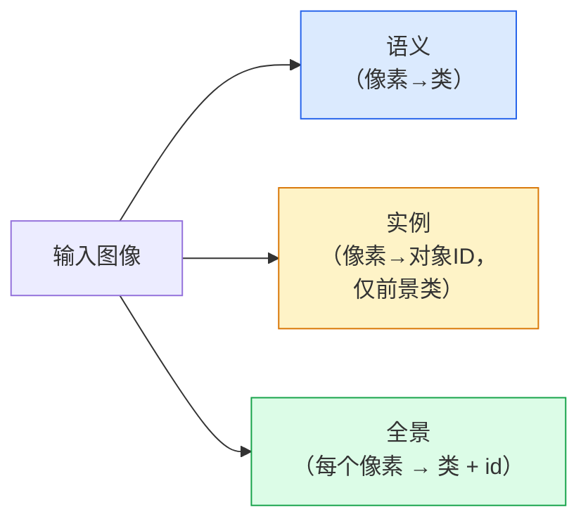
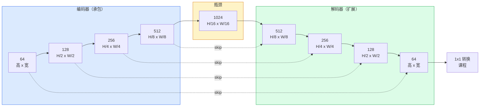

# 语义分割 — U-Net

> 分割是对每个像素进行分类。 U-Net 通过将下采样编码器与上采样解码器配对并在它们之间进行跳过连接来使其工作。

**类型：** Build
**语言：** Python
**先修：** 第 4 阶段第 03 课 (CNNs)，第 4 阶段第 04 课（图像分类）
**时间：** 约 75 分钟

## 学习目标

- 区分语义、实例和全景分割，并为给定问题选择正确的任务
- 使用编码器块、瓶颈、具有转置卷积的解码器和跳过连接在 PyTorch 中从头开始构建 U-Net
- 实现像素级交叉熵、Dice 损失以及医疗和工业分割当前默认的组合损失
- 读取每个类别的 IoU 和 Dice 指标，并诊断不良分数是否来自小对象召回、边界准确性或类别不平衡

## 问题

分类为每张图像输出一个标签。检测每张图像输出几个框。分割为每个像素输出一个标签。对于大小为`H x W`的输入，输出是形状为`H x W`（语义）或`H x W x N_instances`（实例）的张量。也就是说，每张图像有数百万个预测，而不是一个。

分割的结构是它为几乎所有密集预测视觉产品提供支持的原因：医学成像（肿瘤掩模）、自动驾驶（道路、车道、障碍物）、卫星（建筑足迹、作物边界）、文档解析（布局区域）、机器人（可抓取区域）。这些任务都不能通过在物体周围放置一个盒子来解决。他们需要精确的轮廓。

架构问题说起来很简单，但解决起来并不简单：您需要网络同时查看图像的全局上下文（这是什么样的场景）和局部像素细节（到底哪个像素是道路还是人行道）。标准 CNN 会在空间上进行压缩以获取上下文，但这会丢弃细节。 U-Net 是兼具两者的设计。

## 概念

### Semantic vs instance vs panoptic



- **Semantic** says "this pixel is road, that pixel is car." Two cars next to each other collapse into a single blob.
- **实例**说“这个像素是#3汽车，那个像素是#5汽车。”忽略背景事物（“事物”=天空、道路、草地）。
- **Panoptic** 统一了两者：每个像素都有一个类标签，每个实例都有一个唯一的 ID，东西和事物都被分段。

本课涵盖语义。下一课 (Mask R-CNN) 将介绍实例。

### U-Net 形状



编码器将空间分辨率减半四倍并将通道加倍。解码器反转：将空间分辨率加倍四倍并将通道减半。跳跃连接在每个分辨率下将匹配的编码器特征与解码器特征连接起来。最终的 1x1 转换以全分辨率映射 `64 -> num_classes`。

为什么需要跳过连接：当解码器尝试输出像素级预测时，它只看到了很小的特征图。如果没有跳跃，它就无法准确定位边缘，因为该信息在编码器中被压缩了。跳过连接将编码器在下行过程中计算的高分辨率特征图交给它。

### 转置与双线性上采样

解码器必须扩展空间维度。两种选择：

- **转置卷积** (`nn.ConvTranspose2d`) — 可学习的上采样。历史U-Net默认值。如果步幅和内核大小不均匀划分，可能会产生棋盘伪影。
- **双线性上采样 + 3x3 转换** — 平滑上采样，然后进行转换。更少的工件，更少的参数，现在是现代默认值。

两者都出现在野外。对于第一个U-Net，双线性更安全。

### 像素网格上的交叉熵

对于 C 类的语义分割，模型输出为`(N, C, H, W)`。目标是带有整数类 ID 的`(N, H, W)`。交叉熵与分类情况相同，只是应用于每个空间位置：

```
Loss = mean over (n, h, w) of -log( softmax(logits[n, :, h, w])[target[n, h, w]] )
```

PyTorch 中的`F.cross_entropy` 本机处理此形状。无需重塑。

### 骰子损失以及为什么需要它

交叉熵平等地对待每个像素。当一类在框架中占主导地位时（医学成像：99% 背景，1% 肿瘤），这是错误的。该网络可以通过预测各处背景获得 99% 的准确率，但仍然毫无用处。

Dice loss 通过直接优化预测掩模和真实掩模之间的重叠来解决这个问题：

```
Dice(p, y) = 2 * sum(p * y) / (sum(p) + sum(y) + epsilon)
Dice_loss = 1 - Dice
```

其中`p` 是类的sigmoid/softmax 概率图，`y` 是二进制真实掩码。只有当重叠完美时，损耗才为零。因为它是基于比率的，所以类别不平衡是无关紧要的。

在实践中，使用**组合损失**：

```
L = L_cross_entropy + lambda * L_dice       (lambda ~ 1)
```

交叉熵在训练早期提供稳定的梯度； Dice 将训练的尾部重点放在实际匹配掩模形状上。这种组合是医学成像的默认组合，在任何类别不平衡的数据集上都难以击败。

### 评估指标

- **像素准确度** — 正确预测的像素百分比。便宜的。与分类准确性相同的原因导致不平衡数据被破坏。
- **每个类的 IoU** — 每个类掩码的并集交集； classes 的平均值 = mIoU。
- **骰子（像素上的 F1）** — 类似于 IoU； `Dice = 2 * IoU / (1 + IoU)`。医学影像偏爱Dice，驾驶社区偏爱IoU；它们是单调相关的。
- **边界 F1** — 测量预测边界与真实边界的接近程度，即使是很小的变化也会受到惩罚。对于半导体检测等高精度任务非常重要。

报告每个班级的 IoU，而不仅仅是 mIoU。平均 IoU 隐藏了 15% 的类别，而其他 9 个类别的隐藏率为 85%。

### Input resolution trade-off

U-Net 的编码器将分辨率减半四倍，因此输入必须能被 16 整除。医学图像通常为 512x512 或 1024x1024。自动驾驶作物的尺寸为 2048x1024。 U-Net 的内存成本与 `H * W * C_max` 成比例，并且在具有 1024 个瓶颈通道的 1024x1024 下，前向传递已使用 GB 的 VRAM。

两种标准解决方法：
1. 平铺输入 — 处理具有重叠和缝合的 256x256 平铺。
2. 用扩张卷积取代瓶颈，保持更高的空间分辨率，但扩大感受野（DeepLab 系列）。

对于第一个模型，具有 64 通道基础 U-Net 的 256x256 输入可以在 8 GB VRAM 上轻松训练。

## Build It

### 第 1 步：编码器块

两个具有批归一化和 ReLU 的 3x3 卷积。第一个转换改变通道数；第二个保留它。

```python
import torch
import torch.nn as nn
import torch.nn.functional as F

class DoubleConv(nn.Module):
    def __init__(self, in_c, out_c):
        super().__init__()
        self.net = nn.Sequential(
            nn.Conv2d(in_c, out_c, kernel_size=3, padding=1, bias=False),
            nn.BatchNorm2d(out_c),
            nn.ReLU(inplace=True),
            nn.Conv2d(out_c, out_c, kernel_size=3, padding=1, bias=False),
            nn.BatchNorm2d(out_c),
            nn.ReLU(inplace=True),
        )

    def forward(self, x):
        return self.net(x)
```

该块在整个过程中被重复使用。 `bias=False` 因为 BN 的 beta 处理了偏差。

### 第 2 步：向下和向上块

```python
class Down(nn.Module):
    def __init__(self, in_c, out_c):
        super().__init__()
        self.net = nn.Sequential(
            nn.MaxPool2d(2),
            DoubleConv(in_c, out_c),
        )

    def forward(self, x):
        return self.net(x)


class Up(nn.Module):
    def __init__(self, in_c, out_c):
        super().__init__()
        self.up = nn.Upsample(scale_factor=2, mode="bilinear", align_corners=False)
        self.conv = DoubleConv(in_c, out_c)

    def forward(self, x, skip):
        x = self.up(x)
        if x.shape[-2:] != skip.shape[-2:]:
            x = F.interpolate(x, size=skip.shape[-2:], mode="bilinear", align_corners=False)
        x = torch.cat([skip, x], dim=1)
        return self.conv(x)
```

仅空间形状检查 (`shape[-2:]`) 处理维度不能被 16 整除的输入；安全的 `F.interpolate` 在连接之前对齐张量。比较完整形状也会触发通道计数差异，这应该是一个很大的错误，而不是无声的插值。

### 第 3 步：U-Net

```python
class UNet(nn.Module):
    def __init__(self, in_channels=3, num_classes=2, base=64):
        super().__init__()
        self.inc = DoubleConv(in_channels, base)
        self.d1 = Down(base, base * 2)
        self.d2 = Down(base * 2, base * 4)
        self.d3 = Down(base * 4, base * 8)
        self.d4 = Down(base * 8, base * 16)
        self.u1 = Up(base * 16 + base * 8, base * 8)
        self.u2 = Up(base * 8 + base * 4, base * 4)
        self.u3 = Up(base * 4 + base * 2, base * 2)
        self.u4 = Up(base * 2 + base, base)
        self.outc = nn.Conv2d(base, num_classes, kernel_size=1)

    def forward(self, x):
        x1 = self.inc(x)
        x2 = self.d1(x1)
        x3 = self.d2(x2)
        x4 = self.d3(x3)
        x5 = self.d4(x4)
        x = self.u1(x5, x4)
        x = self.u2(x, x3)
        x = self.u3(x, x2)
        x = self.u4(x, x1)
        return self.outc(x)

net = UNet(in_channels=3, num_classes=2, base=32)
x = torch.randn(1, 3, 256, 256)
print(f"output: {net(x).shape}")
print(f"params: {sum(p.numel() for p in net.parameters()):,}")
```

输出形状 `(1, 2, 256, 256)` — 与输入 `num_classes` 通道相同的空间大小。 `base=32` 大约有 770 万个参数。

### 第四步：损失

```python
def dice_loss(logits, targets, num_classes, eps=1e-6):
    probs = F.softmax(logits, dim=1)
    targets_one_hot = F.one_hot(targets, num_classes).permute(0, 3, 1, 2).float()
    dims = (0, 2, 3)
    intersection = (probs * targets_one_hot).sum(dim=dims)
    denom = probs.sum(dim=dims) + targets_one_hot.sum(dim=dims)
    dice = (2 * intersection + eps) / (denom + eps)
    return 1 - dice.mean()


def combined_loss(logits, targets, num_classes, lam=1.0):
    ce = F.cross_entropy(logits, targets)
    dc = dice_loss(logits, targets, num_classes)
    return ce + lam * dc, {"ce": ce.item(), "dice": dc.item()}
```

每个类别计算骰子，然后求平均值（宏骰子）。 `eps` 防止批次中缺少的类被零除。

### 第 5 步：IoU 指标

```python
@torch.no_grad()
def iou_per_class(logits, targets, num_classes):
    preds = logits.argmax(dim=1)
    ious = torch.zeros(num_classes)
    for c in range(num_classes):
        pred_c = (preds == c)
        true_c = (targets == c)
        inter = (pred_c & true_c).sum().float()
        union = (pred_c | true_c).sum().float()
        ious[c] = (inter / union) if union > 0 else torch.tensor(float("nan"))
    return ious
```

返回长度为 C 的向量。 `nan` 标记批次中不存在的类 — 在计算 mIoU 时不要对这些类进行平均。

### 第 6 步：用于端到端验证的综合数据集

在彩色背景上生成形状，因此网络必须学习形状，而不是像素颜色。

```python
import numpy as np
from torch.utils.data import Dataset, DataLoader

def synthetic_segmentation(num_samples=200, size=64, seed=0):
    rng = np.random.default_rng(seed)
    images = np.zeros((num_samples, size, size, 3), dtype=np.float32)
    masks = np.zeros((num_samples, size, size), dtype=np.int64)
    for i in range(num_samples):
        bg = rng.uniform(0, 1, (3,))
        images[i] = bg
        masks[i] = 0
        num_shapes = rng.integers(1, 4)
        for _ in range(num_shapes):
            cls = int(rng.integers(1, 3))
            color = rng.uniform(0, 1, (3,))
            cx, cy = rng.integers(10, size - 10, size=2)
            r = int(rng.integers(4, 12))
            yy, xx = np.meshgrid(np.arange(size), np.arange(size), indexing="ij")
            if cls == 1:
                mask = (xx - cx) ** 2 + (yy - cy) ** 2 < r ** 2
            else:
                mask = (np.abs(xx - cx) < r) & (np.abs(yy - cy) < r)
            images[i][mask] = color
            masks[i][mask] = cls
        images[i] += rng.normal(0, 0.02, images[i].shape)
        images[i] = np.clip(images[i], 0, 1)
    return images, masks


class SegDataset(Dataset):
    def __init__(self, images, masks):
        self.images = images
        self.masks = masks

    def __len__(self):
        return len(self.images)

    def __getitem__(self, i):
        img = torch.from_numpy(self.images[i]).permute(2, 0, 1).float()
        mask = torch.from_numpy(self.masks[i]).long()
        return img, mask
```

三类：背景 (0)、圆形 (1)、正方形 (2)。网络必须学会区分形状。

### 第 7 步：训练循环

```python
def train_one_epoch(model, loader, optimizer, device, num_classes):
    model.train()
    loss_sum, total = 0.0, 0
    iou_sum = torch.zeros(num_classes)
    for x, y in loader:
        x, y = x.to(device), y.to(device)
        logits = model(x)
        loss, _ = combined_loss(logits, y, num_classes)
        optimizer.zero_grad()
        loss.backward()
        optimizer.step()
        loss_sum += loss.item() * x.size(0)
        total += x.size(0)
        iou_sum += iou_per_class(logits, y, num_classes).nan_to_num(0)
    return loss_sum / total, iou_sum / len(loader)
```

在合成数据集上运行 10-30 个 epoch，观察形状类别的 mIoU 攀升至 0.9 以上。请注意，`nan_to_num(0)` 将批次中缺少的类视为零；为了获得准确的每类 IoU，请根据存在情况进行掩码，并在评估时跨批次使用 `torch.nanmean`，而不是在此处求平均值。

## Use It

对于生产，`segmentation_models_pytorch`（“smp”）使用任何torchvision或timm骨干包装每个标准分段架构。三行：

```python
import segmentation_models_pytorch as smp

model = smp.Unet(
    encoder_name="resnet34",
    encoder_weights="imagenet",
    in_channels=3,
    classes=3,
)
```

在实际工作中还值得了解：
- **DeepLabV3+** 用扩张的卷积替换基于最大池的下采样，因此瓶颈保持分辨率；卫星和驾驶数据的更快边界。
- **SegFormer** 将转换编码器替换为分层转换器；目前在许多基准测试中都是 SOTA。
- **Mask2Former** / **OneFormer** 在单一架构中统一语义、实例和全景分割。

所有这三个都是 `smp` 或 `transformers` 中具有相同数据加载器的直接替代品。

## Ship It

本课产生：

- `outputs/prompt-segmentation-task-picker.md` — 在语义、实例和全景分割之间进行选择的提示，并为给定任务命名架构。
- `outputs/skill-segmentation-mask-inspector.md` — 一种报告类别分布、预测掩模统计数据以及预测不足或边界模糊的类别的技能。

## 练习

1. **（简单）** 为二进制分割任务（前景与背景）实现`bce_dice_loss`。在合成的二类数据集上验证，当前景占像素的 5% 时，组合损失的收敛速度比单独的 BCE 更快。
2. **(Medium)** Replace the `nn.Upsample + conv` up-block with a `nn.ConvTranspose2d` up-block. Train both on the synthetic dataset and compare mIoU. Observe where checkerboard artifacts appear in the transposed-conv version.
3. **（难）** 采用真实的分割数据集（Oxford-IIIT Pets、Cityscapes mini split 或医学子集）并将 U-Net 训练到 `smp.Unet` 参考的 2 个 IoU 点以内。报告每个类别的 IoU 并确定哪些类别通过将 Dice 添加到损失中获益最多。

## 关键术语

| 学期 | 人们怎么说 | 它实际上意味着什么 |
|------|----------------|----------------------|
| 语义分割 | “标记每个像素” | 按像素分类为 C 类；同一类的实例合并 |
| 实例分割 | “给每个物体贴上标签” | 分隔同一类的不同实例；仅前台 |
| 全景分割 | “语义+实例” | 每个像素都有一个类别；每个事物实例也有一个唯一的 id |
| 跳过连接 | “U-Net桥” | 将编码器特征串联成匹配分辨率的解码器特征；保留高频细节 |
| 转置转化 | “反卷积” | 可学习的上采样；可以产生棋盘工件 |
| 骰子损失 | “重叠损失” | 1 - 2 | A∩B | / ( | 一个 | + | 乙 | ）；直接优化掩模重叠并且对类别不平衡具有鲁棒性 |
| 米卢 | “并集的平均交集” | 跨类平均 IoU；分段的社区标准指标 |
| 边界F1 | “边界精度” | 仅在边界像素上计算 F1 分数；对于精度要求较高的任务很重要 |

## 延伸阅读

- [U-Net：用于生物医学图像分割的卷积网络（Ronneberger 等人，2015）](https://arxiv.org/abs/1505.04597) — 原始论文；大家复制的图在第 2 页
- [Fully Convolutional Networks (Long et al., 2015)](https://arxiv.org/abs/1411.4038) — 这篇论文首次将分割变成了端到端的转换问题
- [segmentation_models_pytorch](https://github.com/qubvel/segmentation_models.pytorch) — 生产分割的参考；每个标准架构加上每个标准损耗
- [从训练 SOTA 分割（kaggle.com 竞赛）中学到的经验教训](https://www.kaggle.com/code/iafoss/carvana-unet-pytorch) — 演练为什么 TTA、伪标签和类别权重对真实数据很重要
