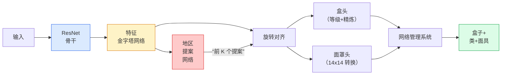

# 实例分割 — Mask R-CNN

> 将一个微小的掩模分支添加到 Faster R-CNN 检测器中，您就拥有了实例分割。最难的部分是 RoIAlign，它比看起来更难。

**类型：** Build + Learn
**语言：** Python
**先修：** 第 4 阶段第 06 课 (YOLO)、第 4 阶段第 07 课 (U-Net)
**时间：** 约 75 分钟

## 学习目标

- 端到端追踪 Mask R-CNN 架构：backbone、FPN、RPN、RoIAlign、box head、mask head
- 从头开始实现 RoIAlign 并解释为什么不再使用 RoIPool
- 使用 torchvision `maskrcnn_resnet50_fpn_v2` 预训练模型作为生产质量实例掩码并正确读取其输出格式
- 通过更换盒子和掩模头并保持主干冻结，在小型自定义数据集上微调Mask R-CNN

## 问题

语义分割为每个类别提供一个掩码。实例分割为每个对象提供一个掩码，即使两个对象共享一个类也是如此。计算个体、跨帧跟踪和测量事物（墙上每块砖的边界框、显微镜图像中的每个细胞）都需要实例分割。

Mask R-CNN（He et al., 2017）通过将实例分割重新定义为检测加掩码来解决这个问题。该设计非常干净，以至于在接下来的五年中，几乎每一篇实例分割论文都是 Mask R-CNN 变体，并且 torchvision 实现仍然是中小型数据集的生产默认设置。

困难的工程问题是采样：如何从其角与像素边界不对齐的建议框中裁剪出固定大小的特征区域？如果犯了这个错误，到处都会损失十分之一的地图点。 RoIAlign 就是答案。

## 概念

### 架构



需要理解的五个部分：

1. **骨干** — ResNet-50 或ResNet-101 在ImageNet 上进行训练。以步幅 4、8、16、32 生成特征图层次结构。
2. **FPN (Feature Pyramid Network)** — top-down + lateral connections that give every level C channels of semantic-rich features. Detection queries the FPN level matching the object size.
3. **RPN（区域提议网络）** - 一个小卷积头，在每个锚点位置预测“这里有一个物体吗？”以及“如何完善盒子？”。每张图像生成约 1000 个提案。
4. **RoIAlign** — samples a fixed-size (e.g. 7x7) feature patch from any box on any FPN level. Bilinear sampling, no quantisation.
5. **Heads** - 两层盒子头，用于细化盒子并选择一个类，加上一个小转换头，为每个提案输出一个 `28x28` 二进制掩码。

### 为什么选择 RoIAlign，而不是 RoIPool

最初的 Fast R-CNN 使用 RoIPool，它将提案框分割成网格，获取每个单元格中的最大特征，并将所有坐标四舍五入为整数。这种舍入使特征图与输入像素坐标错位，最多达一个完整的特征图像素——在 224x224 图像上很小，当特征图步长为 32 时，这是灾难性的。

```
RoIPool:
  box (34.7, 51.3, 98.2, 142.9)
  round -> (34, 51, 98, 142)
  split grid -> round each cell boundary
  misalignment accumulates at every step

RoIAlign:
  box (34.7, 51.3, 98.2, 142.9)
  sample at exact float coordinates using bilinear interpolation
  no rounding anywhere
```

RoIAlign 在 COCO 上免费将面膜 AP 提升 3-4 点。现在每个关心定位的检测器都Use It——YOLOv7 seg、RT-DETR、Mask2Former 等。

### 一段中的 RPN

At every position of a feature map, place K anchor boxes of different sizes and shapes. Predict an objectness score for each anchor and a regression offset to turn the anchor into a better-fitting box. Keep the top 约 1,000 boxes by score, apply NMS at IoU 0.7, and hand the survivors to the heads. The RPN is trained with its own mini-loss — the same structure as the YOLO loss from Lesson 6, just with two classes (object / no object).

### 面具头

对于每个提案（在 RoIAlign 之后），掩模头是一个微小的 FCN：四个 3x3 卷积、一个 2x 反卷积、一个最终的 1x1 卷积，以 `28x28` 分辨率产生 `num_classes` 输出通道。只保留预测类别对应的通道；其他的则被忽略。这将掩模预测与分类分离。

将 28x28 掩码上采样到提案的原始像素大小，以生成最终的二进制掩码。

### 损失

Mask R-CNN 有四个损失加在一起：

```
L = L_rpn_cls + L_rpn_box + L_box_cls + L_box_reg + L_mask
```

- `L_rpn_cls`、`L_rpn_box` — RPN 提案的客观性 + 框回归。
- `L_box_cls` — 头部分类器上 (C+1) 类（包括背景）的交叉熵。
- `L_box_reg` — 头部框细化上的 L1 平滑。
- `L_mask` — 28x28 掩模输出上的每像素二进制交叉熵。

每个损失都有自己的默认权重； torchvision 实现将它们公开为构造函数参数。

### 输出格式

`torchvision.models.detection.maskrcnn_resnet50_fpn_v2` 返回一个字典列表，每个图像一个：

```
{
    "boxes":  (N, 4) in (x1, y1, x2, y2) pixel coordinates,
    "labels": (N,) class IDs, 0 = background so indices are 1-based,
    "scores": (N,) confidence scores,
    "masks":  (N, 1, H, W) float masks in [0, 1] — threshold at 0.5 for binary,
}
```

遮罩已经是全图像分辨率。 28x28 头输出已在内部进行上采样。

## Build It

### 第 1 步：从头开始 RoIAlign

这是 Mask R-CNN 的一个组成部分，作为代码比作为散文更容易理解。

```python
import torch
import torch.nn.functional as F

def roi_align_single(feature, box, output_size=7, spatial_scale=1 / 16.0):
    """
    feature: (C, H, W) single-image feature map
    box: (x1, y1, x2, y2) in original image pixel coordinates
    output_size: side of the output grid (7 for box head, 14 for mask head)
    spatial_scale: reciprocal of the feature map stride
    """
    C, H, W = feature.shape
    x1, y1, x2, y2 = [c * spatial_scale - 0.5 for c in box]
    bin_w = (x2 - x1) / output_size
    bin_h = (y2 - y1) / output_size

    grid_y = torch.linspace(y1 + bin_h / 2, y2 - bin_h / 2, output_size)
    grid_x = torch.linspace(x1 + bin_w / 2, x2 - bin_w / 2, output_size)
    yy, xx = torch.meshgrid(grid_y, grid_x, indexing="ij")

    gx = 2 * (xx + 0.5) / W - 1
    gy = 2 * (yy + 0.5) / H - 1
    grid = torch.stack([gx, gy], dim=-1).unsqueeze(0)
    sampled = F.grid_sample(feature.unsqueeze(0), grid, mode="bilinear",
                            align_corners=False)
    return sampled.squeeze(0)
```

每个数字都位于双线性采样位置。没有舍入，没有量化，没有梯度下降。

### 第 2 步：与 torchvision 的 RoIAlign 进行比较

```python
from torchvision.ops import roi_align

feature = torch.randn(1, 16, 50, 50)
boxes = torch.tensor([[0, 10, 20, 100, 90]], dtype=torch.float32)  # (batch_idx, x1, y1, x2, y2)

ours = roi_align_single(feature[0], boxes[0, 1:].tolist(), output_size=7, spatial_scale=1/4)
theirs = roi_align(feature, boxes, output_size=(7, 7), spatial_scale=1/4, sampling_ratio=1, aligned=True)[0]

print(f"shape ours:   {tuple(ours.shape)}")
print(f"shape theirs: {tuple(theirs.shape)}")
print(f"max|diff|:    {(ours - theirs).abs().max().item():.3e}")
```

对于`sampling_ratio=1` 和`aligned=True`，两者在`1e-5` 内匹配。

### 第3步：加载预训练的Mask R-CNN

```python
import torch
from torchvision.models.detection import maskrcnn_resnet50_fpn_v2, MaskRCNN_ResNet50_FPN_V2_Weights

model = maskrcnn_resnet50_fpn_v2(weights=MaskRCNN_ResNet50_FPN_V2_Weights.DEFAULT)
model.eval()
print(f"params: {sum(p.numel() for p in model.parameters()):,}")
print(f"classes (including background): {len(model.roi_heads.box_predictor.cls_score.out_features * [0])}")
```

46M 参数，91 个类（COCO）。第一类（id 0）是背景；模型实际检测到的所有内容都从 id 1 开始。

### 第 4 步：运行推理

```python
with torch.no_grad():
    x = torch.randn(3, 400, 600)
    predictions = model([x])
p = predictions[0]
print(f"boxes:  {tuple(p['boxes'].shape)}")
print(f"labels: {tuple(p['labels'].shape)}")
print(f"scores: {tuple(p['scores'].shape)}")
print(f"masks:  {tuple(p['masks'].shape)}")
```

掩模张量的形状为`(N, 1, H, W)`。阈值为 0.5，以获得每个对象的二进制掩码：

```python
binary_masks = (p['masks'] > 0.5).squeeze(1)  # (N, H, W) boolean
```

### 第 5 步：交换自定义类别计数的头部

常见的微调配方：复用backbone、FPN、RPN；更换两个分类器头。

```python
from torchvision.models.detection.faster_rcnn import FastRCNNPredictor
from torchvision.models.detection.mask_rcnn import MaskRCNNPredictor

def build_custom_maskrcnn(num_classes):
    model = maskrcnn_resnet50_fpn_v2(weights=MaskRCNN_ResNet50_FPN_V2_Weights.DEFAULT)
    in_features = model.roi_heads.box_predictor.cls_score.in_features
    model.roi_heads.box_predictor = FastRCNNPredictor(in_features, num_classes)
    in_features_mask = model.roi_heads.mask_predictor.conv5_mask.in_channels
    hidden_layer = 256
    model.roi_heads.mask_predictor = MaskRCNNPredictor(in_features_mask, hidden_layer, num_classes)
    return model

custom = build_custom_maskrcnn(num_classes=5)
print(f"custom cls_score.out_features: {custom.roi_heads.box_predictor.cls_score.out_features}")
```

`num_classes` 必须包含背景类，因此具有 4 个对象类的数据集使用 `num_classes=5`。

### 第 6 步：冻结不需要训练的内容

在小型数据集上，冻结主干网和 FPN。只有 RPN 对象性 + 回归和两个头学习。

```python
def freeze_backbone_and_fpn(model):
    # torchvision Mask R-CNN packs the FPN inside `model.backbone` (as
    # `model.backbone.fpn`), so iterating `model.backbone.parameters()` covers
    # both the ResNet feature layers and the FPN lateral/output convs.
    for p in model.backbone.parameters():
        p.requires_grad = False
    return model

custom = freeze_backbone_and_fpn(custom)
trainable = sum(p.numel() for p in custom.parameters() if p.requires_grad)
print(f"trainable after freeze: {trainable:,}")
```

在 500 个图像数据集上，这就是收敛和过拟合之间的区别。

## Use It

torchvision 中 Mask R-CNN 的完整训练循环有 40 行，并且在任务之间不会发生有意义的变化 - 交换数据集并继续。

```python
def train_step(model, images, targets, optimizer):
    model.train()
    loss_dict = model(images, targets)
    losses = sum(loss for loss in loss_dict.values())
    optimizer.zero_grad()
    losses.backward()
    optimizer.step()
    return {k: v.item() for k, v in loss_dict.items()}
```

`targets` 列表必须包含带有`boxes`、`labels` 和`masks` 的每个图像字典（作为`(num_instances, H, W)` 二进制张量）。该模型在训练期间返回四个损失的字典，在评估期间返回一个预测列表，以 `model.training` 为键。

`pycocotools` 评估器为框和掩模生成 mAP@IoU=0.5:0.95；您需要这两个数字才能知道盒头或掩模头是否是瓶颈。

## Ship It

本课产生：

- `outputs/prompt-instance-vs-semantic-router.md` - 一个提示，询问三个问题并选择实例、语义、全景以及开始的确切模型。
- `outputs/skill-mask-rcnn-head-swapper.md` — 一项技能，可生成 10 行代码，用于在任何 torchvision 检测模型上交换头部（给定新的 `num_classes`）。

## 练习

1. **（简单）** 在 100 个随机盒子上对照 `torchvision.ops.roi_align` 验证您的 RoIAlign。报告最大绝对差值。还运行 RoIPool（2017 年之前的行为）并显示它在边界附近的框上偏离约 1-2 个特征图像素。
2. **（中）** 在 50 个图像的自定义数据集（任意两个类：气球、鱼、坑洼、徽标）上微调 `maskrcnn_resnet50_fpn_v2`。冻结骨干网，训练 20 个 epoch，报告 mask AP@0.5。
3. **（困难）** 将 Mask R-CNN 的蒙版头替换为预测尺寸为 56x56 而不是 28x28 的蒙版头。前后测量mAP@IoU=0.75。解释为什么增益（或缺乏增益）与预期的边界精度/内存权衡相匹配。

## 关键术语

| 学期 | 人们怎么说 | 它实际上意味着什么 |
|------|----------------|----------------------|
| Mask R-CNN | “检测+口罩” | 更快的 R-CNN + 一个小 FCN 头，可以预测每个类别每个提案的 28x28 掩码 |
| FPN | “特征金字塔” | 自上而下+横向连接，为每一步提供丰富语义特征的 C 级通道 |
| RPN | “区域提议者” | 一个小型转换头，每张图像生成约 1000 个 object/no-object 提案 |
| RoIAlign | “无圆角作物” | 从任何浮动坐标框中双线性采样固定大小的特征网格 |
| 网池 | “2017年前作物” | 与 RoIAlign 用途相同，但四舍五入框坐标；过时的 |
| 面膜AP | “实例映射” | 使用mask IoU而不是box IoU计算平均精度； COCO 实例分割指标 |
| 二元掩模头 | “每班面具” | 为每个提案的每个类预测一个二进制掩码；仅保留预测类别的频道 |
| 背景类 | “0级” | 包罗万象的“无对象”类；真实类别的索引从 1 开始 |

## 延伸阅读

- [Mask R-CNN (He et al., 2017)](https://arxiv.org/abs/1703.06870) — 论文；关于 RoIAlign 的第 3 节是重要读物
- [FPN：特征金字塔网络（Lin 等人，2017）](https://arxiv.org/abs/1612.03144) — FPN 论文；每个现代探测器都Use It
- [torchvision Mask R-CNN 教程](https://pytorch.org/tutorials/intermediate/torchvision_tutorial.html) — 微调循环的参考
- [Detectron2 模型动物园](https://github.com/facebookresearch/detectron2/blob/main/MODEL_ZOO.md) — 几乎每个检测和分割变体都具有经过训练的权重的生产实现
