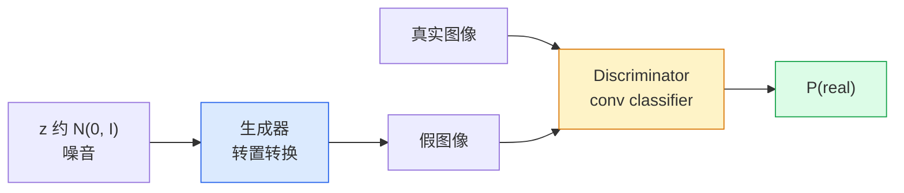
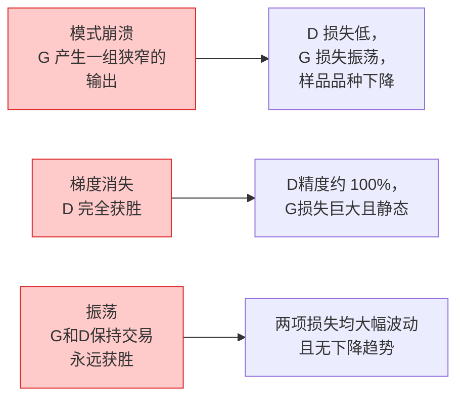

# 图像生成 — GANs

> GAN 是固定游戏中的两个神经网络。一位画画，一位批评。他们一起变得更好，直到图画愚弄了评论家。

**类型：** Build
**语言：** Python
**先修：** 第 4 阶段第 03 课 (CNNs)、第 3 阶段第 06 课（优化器）、第 3 阶段第 07 课（正则化）
**时间：** 约 75 分钟

## 学习目标

- 解释生成器和判别器之间的极小极大博弈，以及为什么平衡对应于 p_model = p_data
- 在 PyTorch 中实现 DCGAN 并让它在 60 行以内生成连贯的 32x32 合成图像
- 使用三个标准技巧稳定 GAN 训练：非饱和损失、谱范数、TTUR（双时间尺度更新规则）
- 阅读区分健康收敛与模式崩溃、振荡和判别器完全获胜的训练曲线

## 问题

分类教导网络将图像映射到标签。生成反转了问题：对看起来来自同一分布的新图像进行采样。没有可以比较的“正确”输出；您只想模仿一个分布。

标准损失函数（MSE，交叉熵）无法衡量“这个样本是否来自真实分布”。最小化每像素误差会产生模糊的平均值，而不是真实的样本。突破在于学习损失：训练第二个网络，其任务是辨别真假，并利用其判断来推动生成器。

GANs（Goodfellow 等人，2014）定义了该框架。到 2018 年，StyleGAN 已生成与照片无法区分的 1024x1024 面孔。此后，扩散模型在质量和可控性方面占据了王位，但使扩散变得实用的每一个技巧——标准化选择、潜在空间、特征损失——都是在 GANs 上首次被理解的。

## 概念

### 两个网络



**生成器** G 采用噪声向量 `z` 并输出图像。 **鉴别器** D 获取图像并输出单个标量：图像是真实的概率。

### 游戏

G希望D错。 D 希望自己是对的。正式：

```
min_G max_D  E_x[log D(x)] + E_z[log(1 - D(G(z)))]
```

从右到左阅读：D 最大化真实 (`log D(real)`) 和假 (`log (1 - D(fake))`) 图像的准确性。 G 正在最小化 D 对假货的准确度——它希望 `D(G(z))` 较高。

Goodfellow 证明了这个极小极大具有全局均衡，其中 `p_G = p_data`，D 处处输出 0.5，并且生成分布和真实分布之间的 Jensen-Shannon 散度为零。困难的部分是到达那里。

### Non-saturating loss

上面的形式在数值上不稳定。在训练早期，`D(G(z))` 对于每个假数据都接近于零，因此 `log(1 - D(G(z)))` 相对于 G 的梯度消失。解决方法：翻转 G 的损失。

```
L_D = -E_x[log D(x)] - E_z[log(1 - D(G(z)))]
L_G = -E_z[log D(G(z))]                          # non-saturating
```

现在，当`D(G(z))`接近零时，G的损失很大，并且它的梯度信息丰富。每个现代GAN 都使用这种变体进行训练。

### DCGAN架构规则

Radford, Metz, Chintala (2015) 将多年失败的实验提炼成五个规则，使 GAN 训练稳定：

1. Replace pooling with strided convs (both nets).
2. 除了 G 的输出和 D 的输入之外，在生成器和判别器中都使用批量归一化。
3. 删除更深架构上的全连接层。
4. G 在除输出之外的所有层上使用 ReLU（tanh 表示 [-1, 1] 中的输出）。
5. D 在所有层上使用 LeakyReLU (negative_slope=0.2)。

每个现代基于卷积的GAN（StyleGAN，BigGAN，GigaGAN）仍然从这些规则开始，并一次替换一个部分。

### 失效模式及其特征



- **模式崩溃**：G 找到一张欺骗 D 的图像并仅生成该图像。修复：添加小批量判别、谱范数或标签调节。
- **判别器获胜**：D 变得太强太快，G 的梯度消失。修复：较小的 D、较低的 D 学习率，或对真实标签应用标签平滑。
- **振荡**：两个网络交易获胜，但从未接近平衡。修复：TTUR（D 的学习速度比 G 快 2-4 倍），或者切换到 Wasserstein 损失。

### 评估

GANs 没有基本事实，所以你怎么知道它们正在工作？

- **样本检查** - 只需查看每个 epoch 结束时的 64 个样本。没有商量的余地。
- **FID（Fréchet Inception Distance）** — 真实集和生成集的 Inception-v3 特征分布之间的距离。越低越好。社区标准。
- **初始分数** — 更旧、更脆弱；更喜欢 FID。
- **Precision/Recall 用于生成模型** — 分别测量质量（精度）和覆盖范围（召回率）。比单独的 FID 提供更多信息。

对于小型合成数据运行，样本检查就足够了。

## Build It

### 第 1 步：生成器

一个小型 DCGAN 生成器，采用 64 维噪声并生成 32x32 图像。

```python
import torch
import torch.nn as nn

class Generator(nn.Module):
    def __init__(self, z_dim=64, img_channels=3, feat=64):
        super().__init__()
        self.net = nn.Sequential(
            nn.ConvTranspose2d(z_dim, feat * 4, kernel_size=4, stride=1, padding=0, bias=False),
            nn.BatchNorm2d(feat * 4),
            nn.ReLU(inplace=True),
            nn.ConvTranspose2d(feat * 4, feat * 2, kernel_size=4, stride=2, padding=1, bias=False),
            nn.BatchNorm2d(feat * 2),
            nn.ReLU(inplace=True),
            nn.ConvTranspose2d(feat * 2, feat, kernel_size=4, stride=2, padding=1, bias=False),
            nn.BatchNorm2d(feat),
            nn.ReLU(inplace=True),
            nn.ConvTranspose2d(feat, img_channels, kernel_size=4, stride=2, padding=1, bias=False),
            nn.Tanh(),
        )

    def forward(self, z):
        return self.net(z.view(z.size(0), -1, 1, 1))
```

四个转置卷积，每个都有`kernel_size=4, stride=2, padding=1`，因此它们干净地使空间大小加倍。通过 tanh 输出 [-1, 1] 中的激活值。

### 第 2 步：鉴别器

发电机的镜子。 LeakyReLU，跨步卷积，以标量 logit 结束。

```python
class Discriminator(nn.Module):
    def __init__(self, img_channels=3, feat=64):
        super().__init__()
        self.net = nn.Sequential(
            nn.Conv2d(img_channels, feat, kernel_size=4, stride=2, padding=1),
            nn.LeakyReLU(0.2, inplace=True),
            nn.Conv2d(feat, feat * 2, kernel_size=4, stride=2, padding=1, bias=False),
            nn.BatchNorm2d(feat * 2),
            nn.LeakyReLU(0.2, inplace=True),
            nn.Conv2d(feat * 2, feat * 4, kernel_size=4, stride=2, padding=1, bias=False),
            nn.BatchNorm2d(feat * 4),
            nn.LeakyReLU(0.2, inplace=True),
            nn.Conv2d(feat * 4, 1, kernel_size=4, stride=1, padding=0),
        )

    def forward(self, x):
        return self.net(x).view(-1)
```

最后一个转换将`4x4`特征图减少为`1x1`。输出是每个图像的单个标量；仅在损失计算期间应用 sigmoid。

### 第三步：训练步骤

替代：每批更新 D 一次，然后更新 G 一次。

```python
import torch.nn.functional as F

def train_step(G, D, real, z, opt_g, opt_d, device):
    real = real.to(device)
    bs = real.size(0)

    # D step
    opt_d.zero_grad()
    d_real = D(real)
    d_fake = D(G(z).detach())
    loss_d = (F.binary_cross_entropy_with_logits(d_real, torch.ones_like(d_real))
              + F.binary_cross_entropy_with_logits(d_fake, torch.zeros_like(d_fake)))
    loss_d.backward()
    opt_d.step()

    # G step
    opt_g.zero_grad()
    d_fake = D(G(z))
    loss_g = F.binary_cross_entropy_with_logits(d_fake, torch.ones_like(d_fake))
    loss_g.backward()
    opt_g.step()

    return loss_d.item(), loss_g.item()
```

D 步骤中的 `G(z).detach()` 至关重要：我们不希望梯度在更新期间流入 G。忘记这一点是典型的初学者错误。

### 第 4 步：合成形状的完整训练循环

```python
from torch.utils.data import DataLoader, TensorDataset
import numpy as np

def synthetic_images(num=2000, size=32, seed=0):
    rng = np.random.default_rng(seed)
    imgs = np.zeros((num, 3, size, size), dtype=np.float32) - 1.0
    for i in range(num):
        r = rng.uniform(6, 12)
        cx, cy = rng.uniform(r, size - r, size=2)
        yy, xx = np.meshgrid(np.arange(size), np.arange(size), indexing="ij")
        mask = (xx - cx) ** 2 + (yy - cy) ** 2 < r ** 2
        color = rng.uniform(-0.5, 1.0, size=3)
        for c in range(3):
            imgs[i, c][mask] = color[c]
    return torch.from_numpy(imgs)

device = "cuda" if torch.cuda.is_available() else "cpu"
data = synthetic_images()
loader = DataLoader(TensorDataset(data), batch_size=64, shuffle=True)

G = Generator(z_dim=64, img_channels=3, feat=32).to(device)
D = Discriminator(img_channels=3, feat=32).to(device)
opt_g = torch.optim.Adam(G.parameters(), lr=2e-4, betas=(0.5, 0.999))
opt_d = torch.optim.Adam(D.parameters(), lr=2e-4, betas=(0.5, 0.999))

for epoch in range(10):
    for (batch,) in loader:
        z = torch.randn(batch.size(0), 64, device=device)
        ld, lg = train_step(G, D, batch, z, opt_g, opt_d, device)
    print(f"epoch {epoch}  D {ld:.3f}  G {lg:.3f}")
```

`Adam(lr=2e-4, betas=(0.5, 0.999))` 是 DCGAN 默认值 - 低 beta1 可以防止动量项过度稳定对抗性游戏。

### 第五步：抽样

```python
@torch.no_grad()
def sample(G, n=16, z_dim=64, device="cpu"):
    G.eval()
    z = torch.randn(n, z_dim, device=device)
    imgs = G(z)
    imgs = (imgs + 1) / 2
    return imgs.clamp(0, 1)
```

采样前始终切换到评估模式。对于 DCGAN 这很重要，因为使用批次规范运行统计数据而不是批次的统计数据。

### 第 6 步：光谱归一化

保证网络的鉴别器中 BN 的直接替代品是 1-Lipschitz。修复了大多数“D 获胜太难”失败。

```python
from torch.nn.utils import spectral_norm

def build_sn_discriminator(img_channels=3, feat=64):
    return nn.Sequential(
        spectral_norm(nn.Conv2d(img_channels, feat, 4, 2, 1)),
        nn.LeakyReLU(0.2, inplace=True),
        spectral_norm(nn.Conv2d(feat, feat * 2, 4, 2, 1)),
        nn.LeakyReLU(0.2, inplace=True),
        spectral_norm(nn.Conv2d(feat * 2, feat * 4, 4, 2, 1)),
        nn.LeakyReLU(0.2, inplace=True),
        spectral_norm(nn.Conv2d(feat * 4, 1, 4, 1, 0)),
    )
```

将 `Discriminator` 替换为 `build_sn_discriminator()`，您通常不需要 TTUR 技巧。频谱范数是您可以应用的最简单的单一鲁棒性升级。

## Use It

对于严肃的生成，请使用预训练的权重或切换到扩散。两个标准库：

- `torch_fidelity` 计算生成器上的 FID / IS，无需编写自定义评估代码。
- `pytorch-gan-zoo`（旧版）和`StudioGAN` 发布了 DCGAN、WGAN-GP、SN-GAN、StyleGAN 和 BigGAN 的测试实现。

到 2026 年，GANs 仍然是以下方面的最佳选择：实时图像生成（延迟 <10 毫秒）、风格转换、精确控制的图像到图像转换（Pix2Pix、CycleGAN）。扩散在照片真实感和文本条件方面获胜。

## Ship It

This lesson produces:

- `outputs/prompt-gan-training-triage.md` — 读取训练曲线描述并选择故障模式（模式崩溃、D-wins、振荡）以及单个建议修复的提示。
- `outputs/skill-dcgan-scaffold.md` — 一种从`z_dim`、目标`image_size` 和`num_channels` 编写DCGAN 脚手架的技能，包括训练循环和样本保存程序。

## 练习

1. **(Easy)** Train the DCGAN above on the synthetic circle dataset and save a grid of 16 samples at the end of each epoch. By which epoch do the generated circles become clearly circular?
2. **（中）** 用谱范数替换鉴别器的批量范数。并排训练两个版本。哪一个收敛得更快？哪一个在三颗种子中的方差较低？
3. **（难）** 实现一个条件 DCGAN：将类标签输入 G 和 D（将 one-hot 与 G 中的噪声连接，在 D 中连接一个类嵌入通道）。对第 7 课中的合成“圆形与方形”数据集进行训练，并表明类调节通过使用特定标签进行采样来发挥作用。

## 关键术语

| 学期 | 人们怎么说 | 它实际上意味着什么 |
|------|----------------|----------------------|
| 发电机（G） | 《抽奖网》 | 将噪声映射到图像；训练来愚弄鉴别器 |
| 鉴别器 (D) | “批评家” | 二元分类器；训练以区分真实图像和生成图像 |
| 极小极大 | “游戏” | 对抗性损失的 min 超过 G，max 超过 D；平衡是 p_G = p_data |
| 非饱和损耗 | “数字理智的版本” | G 的损失是 -log(D(G(z))) 而不是 log(1 - D(G(z))) 以避免训练早期梯度消失 |
| 模式崩溃 | “发电机制造一件事” | G 只产生数据分布的一小部分；使用 SN、小批量区分或较大批量进行修复 |
| TTUR | “两种学习率” | D 的学习速度比 G 快，通常是 G 的 2-4 倍；稳定训练 |
| 谱范数 | “1-Lipschitz 层” | 限制每层 Lipschitz 常数的权重归一化；阻止 D 变得任意陡峭 |
| 火焰离子化检测器 | “弗雷谢起始距离” | 真实集和生成集的 Inception-v3 特征分布之间的距离；标准评价指标 |

## 延伸阅读

- [生成对抗网络 (Goodfellow et al., 2014)](https://arxiv.org/abs/1406.2661) — 这篇论文开始了这一切
- [DCGAN (Radford, Metz, Chintala, 2015)](https://arxiv.org/abs/1511.06434) — 使 GAN 可训练的架构规则
- [GANs 的光谱归一化 (Miyato et al., 2018)](https://arxiv.org/abs/1802.05957) — 最有用的稳定技巧
- [风格GAN3（Karras 等人，2021）](https://arxiv.org/abs/2106.12423) — SOTA GAN；读起来就像一张收录了过去十年所有技巧的精选专辑
