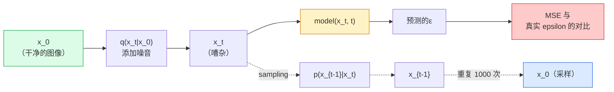

# 图像生成——扩散模型

> 扩散模型学习去噪。训练它从嘈杂的图像中去除一点点噪声，向后重复一千次，你就拥有了一个图像生成器。

**类型：** Build
**语言：** Python
**先修：** 第 4 阶段第 07 课 (U-Net)、第 1 阶段第 06 课（概率）、第 3 阶段第 06 课（优化器）
**时间：** 约 75 分钟

## 学习目标

- 推导前向噪声过程 `x_0 -> x_1 -> ... -> x_T` 并解释为什么闭式 `q(x_t | x_0)` 对于任何 t 都成立
- 实现 DDPM 式的训练目标，对每一步添加的噪声进行回归，以及从纯噪声返回到图像的采样器
- 构建一个时间条件U-Net（小到足以在 CPU 上训练）来预测任何时间步长的噪声
- 解释 DDPM 和 DDIM 采样之间的区别，以及每种采样何时适用（第 23 课深入介绍流量匹配和整流流量）

## 问题

GANs 生成一次性：噪声输入、图像输出、一次前向传递。它们速度很快，但很难训练。扩散模型迭代生成：从纯噪声开始，小步降噪，图像出现。它们行动缓慢且易于训练。在过去五年中，后一种属性占据主导地位：任何小团队都可以训练扩散模型并获得合理的样本； GAN 训练是你在多年失败的跑步中学到的一门手艺。

除了训练稳定性之外，扩散的迭代结构还解锁了现代图像生成的所有特征：文本调节、修复、图像编辑、超分辨率、可控风格。采样循环的每一步都是注入新约束的地方。这个钩子就是为什么 Stable Diffusion、Imagen、DALL-E 3、Midjourney 以及您将使用的每个可控图像模型都是基于扩散的。

本课程构建最小的 DDPM：前向噪声、后向噪声、训练循环。下一课 (Stable Diffusion) 将其连接到具有 VAE、文本编码器和无分类器指导的生产系统中。

## 概念

### 前向过程

拍摄图像`x_0`。添加少量高斯噪声即可得到`x_1`。再添加一点点即可得到`x_2`。继续执行 T 步骤，直到 `x_T` 与纯高斯噪声几乎无法区分。

```
q(x_t | x_{t-1}) = N(x_t; sqrt(1 - beta_t) * x_{t-1},  beta_t * I)
```

`beta_t` 是一个小方差表，通常在 T=1000 个步长内从 0.0001 到 0.02 呈线性。每一步都会稍微缩小信号并注入新的噪声。

### 封闭式跳跃

一次一步添加噪声是马尔可夫链，但数学是折叠的：您可以一步直接从`x_0` 采样`x_t`。

```
Define alpha_t = 1 - beta_t
Define alpha_bar_t = prod_{s=1..t} alpha_s

Then:
  q(x_t | x_0) = N(x_t; sqrt(alpha_bar_t) * x_0,  (1 - alpha_bar_t) * I)

Equivalently:
  x_t = sqrt(alpha_bar_t) * x_0 + sqrt(1 - alpha_bar_t) * epsilon
  where epsilon ~ N(0, I)
```

这个单一方程就是扩散实用的全部原因。在训练过程中，您随机选择一个`t`，直接从`x_0`中采样`x_t`，然后一步训练——无需模拟完整的马尔可夫链。

### 逆过程

前向过程是固定的。相反的过程`p(x_{t-1} | x_t)`就是神经网络学习的内容。扩散模型不直接预测`x_{t-1}`；他们预测在步骤 t 添加的噪声`epsilon`，并且数学从中导出`x_{t-1}`。



### 训练损失

对于每个训练步骤：

1. 对真实图像进行采样`x_0`。
2. 从 [1, T] 中统一采样时间步 `t`。
3. 噪声样本`epsilon 约  N(0, I)`。
4. 计算`x_t = sqrt(alpha_bar_t) * x_0 + sqrt(1 - alpha_bar_t) * epsilon`。
5. 通过网络预测`epsilon_theta(x_t, t)`。
6. 最小化`|| epsilon - epsilon_theta(x_t, t) ||^2`。

就是这样。神经网络学习预测任何时间步长的噪声。损失是MSE。没有对抗性博弈，没有崩溃，没有振荡。

### The sampler (DDPM)

生成：从`x_T 约  N(0, I)`开始，一次向后走一步。

```
for t = T, T-1, ..., 1:
    eps = model(x_t, t)
    x_{t-1} = (1 / sqrt(alpha_t)) * (x_t - (beta_t / sqrt(1 - alpha_bar_t)) * eps) + sqrt(beta_t) * z
    where z ~ N(0, I) if t > 1, else 0
return x_0
```

关键是，尽管反向条件一般在封闭形式中是未知的，但对于这个特定的高斯前向过程来说，它是已知的。丑陋的系数是贝叶斯规则给你的。

### 为什么1000步

选择前向噪声计划，以便每个步骤添加足够的噪声，使反向步骤接近高斯分布。步骤太少，反向步骤与高斯相差甚远，网络无法很好地建模。太多的步骤和采样会随着增益的减小而变得昂贵。 T=1000 线性计划是 DDPM 默认值。

### DDIM：采样速度提高 20 倍

训练也是一样的。抽样变化。 DDIM（Song et al., 2020）定义了一种确定性反向过程，无需重新训练即可跳过时间步。使用 DDIM 以 50 步进行采样可提供接近 1000 步的 DDPM 质量。每个生产系统都使用 DDIM 或更快的变体（DPM-Solver，Euler 祖先）。

### 时间调节

网络`epsilon_theta(x_t, t)`需要知道它在哪个时间步去噪。现代扩散模型通过正弦时间嵌入（与Transformer中的位置编码相同的想法）注入`t`，这些嵌入被添加到每个U-Net级别的特征映射中。

```
t_embedding = sinusoidal(t)
feature_map += MLP(t_embedding)
```

如果没有时间调节，网络必须从图像本身猜测噪声水平，这种方法可以工作，但样本效率要低得多。

## Build It

### 第 1 步：噪声表

```python
import torch

def linear_beta_schedule(T=1000, beta_start=1e-4, beta_end=2e-2):
    return torch.linspace(beta_start, beta_end, T)


def precompute_schedule(betas):
    alphas = 1.0 - betas
    alphas_cumprod = torch.cumprod(alphas, dim=0)
    return {
        "betas": betas,
        "alphas": alphas,
        "alphas_cumprod": alphas_cumprod,
        "sqrt_alphas_cumprod": torch.sqrt(alphas_cumprod),
        "sqrt_one_minus_alphas_cumprod": torch.sqrt(1.0 - alphas_cumprod),
        "sqrt_recip_alphas": torch.sqrt(1.0 / alphas),
    }

schedule = precompute_schedule(linear_beta_schedule(T=1000))
```

Precompute once, gather by index during training and sampling.

### 步骤 2：前向扩散 (q_sample)

```python
def q_sample(x0, t, noise, schedule):
    sqrt_a = schedule["sqrt_alphas_cumprod"][t].view(-1, 1, 1, 1)
    sqrt_one_minus_a = schedule["sqrt_one_minus_alphas_cumprod"][t].view(-1, 1, 1, 1)
    return sqrt_a * x0 + sqrt_one_minus_a * noise
```

一行闭合形式。 `t` 是一批时间步，该批中的每个图像一个。

### 第 3 步：一个微小的时间条件U-Net

```python
import torch.nn as nn
import torch.nn.functional as F
import math

def timestep_embedding(t, dim=64):
    half = dim // 2
    freqs = torch.exp(-math.log(10000) * torch.arange(half, device=t.device) / half)
    args = t[:, None].float() * freqs[None]
    emb = torch.cat([args.sin(), args.cos()], dim=-1)
    return emb


class TinyUNet(nn.Module):
    def __init__(self, img_channels=3, base=32, t_dim=64):
        super().__init__()
        self.t_mlp = nn.Sequential(
            nn.Linear(t_dim, base * 4),
            nn.SiLU(),
            nn.Linear(base * 4, base * 4),
        )
        self.t_dim = t_dim
        self.enc1 = nn.Conv2d(img_channels, base, 3, padding=1)
        self.enc2 = nn.Conv2d(base, base * 2, 4, stride=2, padding=1)
        self.mid = nn.Conv2d(base * 2, base * 2, 3, padding=1)
        self.dec1 = nn.ConvTranspose2d(base * 2, base, 4, stride=2, padding=1)
        self.dec2 = nn.Conv2d(base * 2, img_channels, 3, padding=1)
        self.time_proj = nn.Linear(base * 4, base * 2)

    def forward(self, x, t):
        t_emb = timestep_embedding(t, self.t_dim)
        t_emb = self.t_mlp(t_emb)
        t_proj = self.time_proj(t_emb)[:, :, None, None]

        h1 = F.silu(self.enc1(x))
        h2 = F.silu(self.enc2(h1)) + t_proj
        h3 = F.silu(self.mid(h2))
        d1 = F.silu(self.dec1(h3))
        d2 = torch.cat([d1, h1], dim=1)
        return self.dec2(d2)
```

两级U-Net，在瓶颈处注入时间调节。放大真实图像的深度和宽度。

### 第 4 步：训练循环

```python
def train_step(model, x0, schedule, optimizer, device, T=1000):
    model.train()
    x0 = x0.to(device)
    bs = x0.size(0)
    t = torch.randint(0, T, (bs,), device=device)
    noise = torch.randn_like(x0)
    x_t = q_sample(x0, t, noise, schedule)
    pred = model(x_t, t)
    loss = F.mse_loss(pred, noise)
    optimizer.zero_grad()
    loss.backward()
    optimizer.step()
    return loss.item()
```

这就是整个训练循环。没有 GAN 游戏，没有专门的损失，一次 MSE 跟注。

### 第 5 步：采样器 (DDPM)

```python
@torch.no_grad()
def sample(model, schedule, shape, T=1000, device="cpu"):
    model.eval()
    x = torch.randn(shape, device=device)
    betas = schedule["betas"].to(device)
    sqrt_one_minus_a = schedule["sqrt_one_minus_alphas_cumprod"].to(device)
    sqrt_recip_alphas = schedule["sqrt_recip_alphas"].to(device)

    for t in reversed(range(T)):
        t_batch = torch.full((shape[0],), t, dtype=torch.long, device=device)
        eps = model(x, t_batch)
        coef = betas[t] / sqrt_one_minus_a[t]
        mean = sqrt_recip_alphas[t] * (x - coef * eps)
        if t > 0:
            x = mean + torch.sqrt(betas[t]) * torch.randn_like(x)
        else:
            x = mean
    return x
```

1000 次前向传递可产生一批样品。在实际代码中，您可以将其替换为 DDIM 50 步采样器。

### 第 6 步：DDIM 采样器（确定性，快约 20 倍）

```python
@torch.no_grad()
def sample_ddim(model, schedule, shape, steps=50, T=1000, device="cpu", eta=0.0):
    model.eval()
    x = torch.randn(shape, device=device)
    alphas_cumprod = schedule["alphas_cumprod"].to(device)

    ts = torch.linspace(T - 1, 0, steps + 1).long()
    for i in range(steps):
        t = ts[i]
        t_prev = ts[i + 1]
        t_batch = torch.full((shape[0],), t, dtype=torch.long, device=device)
        eps = model(x, t_batch)
        a_t = alphas_cumprod[t]
        a_prev = alphas_cumprod[t_prev] if t_prev >= 0 else torch.tensor(1.0, device=device)
        x0_pred = (x - torch.sqrt(1 - a_t) * eps) / torch.sqrt(a_t)
        sigma = eta * torch.sqrt((1 - a_prev) / (1 - a_t) * (1 - a_t / a_prev))
        dir_xt = torch.sqrt(1 - a_prev - sigma ** 2) * eps
        noise = sigma * torch.randn_like(x) if eta > 0 else 0
        x = torch.sqrt(a_prev) * x0_pred + dir_xt + noise
    return x
```

`eta=0` 是完全确定性的（相同的噪声输入总是产生相同的输出）。 `eta=1` 恢复 DDPM。

## Use It

对于生产工作，请使用`diffusers`：

```python
from diffusers import DDPMScheduler, UNet2DModel

unet = UNet2DModel(sample_size=32, in_channels=3, out_channels=3, layers_per_block=2)
scheduler = DDPMScheduler(num_train_timesteps=1000)
```

该库提供现成的调度程序（DDPM、DDIM、DPM-Solver、Euler、Heun）、可配置的 U-Nets、文本到图像和图像到图像的管道以及 LoRA 微调助手。

对于研究来说，`k-diffusion` (Katherine Crowson) 拥有最忠实的参考实现和最好的采样变体。

## Ship It

本课产生：

- `outputs/prompt-diffusion-sampler-picker.md` — 根据质量目标、延迟预算和调节类型选择 DDPM / DDIM / DPM-Solver / Euler 的提示。
- `outputs/skill-noise-schedule-designer.md` — 一种在给定 T 和目标损坏级别的情况下生成线性、余弦或 S 形 beta 计划的技能，以及随时间变化的信噪比诊断图。

## 练习

1. **（简单）** 可视化前向过程：拍摄一张图像并在`t in [0, 100, 250, 500, 750, 1000]`处绘制`x_t`。验证 `x_1000` 看起来像纯高斯噪声。
2. **（中）** 在合成圆数据集上训练 TinyUNet 20 个周期并采样 16 个圆。比较 DDPM（1000 步）和 DDIM（50 步）采样——它们是否从相同的噪声种子中生成相似的图像？
3. **(Hard)** Implement a cosine noise schedule (Nichol & Dhariwal, 2021): `alpha_bar_t = cos^2((t/T + s) / (1 + s) * pi / 2)`. Train the same model with linear and cosine schedules and show that cosine gives better samples at low step counts.

## 关键术语

| 学期 | 人们怎么说 | What it actually means |
|------|----------------|----------------------|
| 转发过程 | “随着时间的推移增加噪音” | 修复了马尔可夫链在 T 个步骤上将图像损坏为高斯噪声的问题 |
| 逆向过程 | "Denoise step by step" | 从噪声回到图像的学习分布 |
| 厄普西隆预测 | “预测噪音” | 训练目标：`epsilon_theta(x_t, t)`预测步骤t添加的噪声 |
| 测试版时间表 | “噪音量” | T 个小方差的序列，定义每步进入的噪声量 |
| alpha_bar_t | “累积保留系数” | (1 - beta_s) 截至时间 t 的乘积； t 越大意味着剩余信号越少 |
| DDPM 采样器 | “祖先的，随机的” | 从其条件高斯对每个 x_{t-1} 进行采样； 1000 步 |
| DDIM 采样器 | “确定性、快速” | 将采样重写为确定性 ODE； 20-100 步，质量相似 |
| 时间调节 | “告诉模型哪个 t” | 将 t 正弦嵌入注入U-Net，以便它知道噪声级别 |

## 延伸阅读

- [去噪扩散概率模型 (Ho et al., 2020)](https://arxiv.org/abs/2006.11239) — 这篇论文使扩散变得实用并在 FID 上击败了 GANs
- [改进的 DDPM (Nichol & Dhariwal, 2021)](https://arxiv.org/abs/2102.09672) — 余弦时间表和 v 参数化
- [DDIM（Song，Meng，Ermon，2020）]（https://arxiv.org/abs/2010.02502） - 使实时推理成为可能的确定性采样器
- [阐明扩散的设计空间（Karras 等人，2022）](https://arxiv.org/abs/2206.00364) — 每个扩散设计选择的统一视图；当前最佳参考
