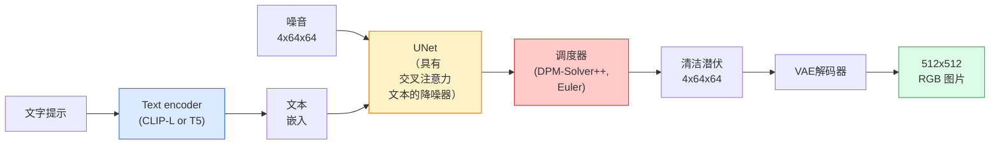

# Stable Diffusion — 架构与微调

> Stable Diffusion 是一个 DDPM，它在预训练的 VAE 的潜在空间中运行，通过交叉注意力以文本为条件，使用快速确定性 ODE 求解器进行采样，并由无分类器指导进行引导。

**类型：** Learn + Use
**语言：** Python
**先修：** 第 4 阶段第 10 课（扩散）、第 7 阶段第 02 课（自我注意）
**时间：** 约 75 分钟

## 学习目标

- 追踪 Stable Diffusion 管道的五个部分：VAE、文本编码器、U-Net、调度程序、安全检查器 — 以及它们各自的实际作用
- 解释潜在扩散以及为什么在 4x64x64 潜在空间（而不是 3x512x512 图像）中进行训练可将计算量减少 48 倍而不会造成质量损失
- 使用 `diffusers` 生成图像、运行图像到图像、修复和 ControlNet 引导生成
- 在小型自定义数据集上使用 LoRA 微调 Stable Diffusion 并在推理时加载 LoRA 适配器

## 问题

直接在 512x512 RGB 图像上训练 DDPM 的成本很高。每个训练步骤都通过 U-Net 进行反向传播，该 U-Net 会看到 3x512x512 = 786,432 个输入值，并且采样需要通过相同的 U-Net 进行 50 多次前向传递。在Stable Diffusion 1.5（2022 年发布）的质量水平下，像素空间扩散需要大约 256 个 GPU 月的训练，并且在消费级 GPU 上每张图像需要 10-30 秒。

使开放权重文本到图像变得实用的技巧是**潜在扩散**（Rombach 等人，CVPR 2022）。训练一个 VAE，将 3x512x512 图像映射到 4x64x64 潜在张量并返回，然后在该潜在空间中进行扩散。计算量下降`(3*512*512)/(4*64*64) = 48x`。在同一 GPU 上，采样时间从几十秒缩短到不到两秒。

几乎所有现代图像生成模型（SDXL、SD3、FLUX、HunyuanDiT、Wan-Video）都是潜在扩散模型，在自动编码器、降噪器（U-Net 或 DiT）和文本调节上有所不同。学习Stable Diffusion，你就学会了模板。

## 概念

### 管道



- **VAE** — 冻结自动编码器。编码器将图像转换为潜在图像（用于 img2img 和训练）。解码器将潜在图像转回图像。
- **文本编码器** — CLIP 文本编码器 (SD 1.x/2.x)、CLIP-L + CLIP-G (SDXL) 或 T5-XXL (SD3/FLUX)。生成一系列标记嵌入。
- **U-Net** — 降噪器。具有交叉关注层，涉及每个分辨率级别的从潜在特征到文本嵌入。
- **调度程序** — 采样算法（DDIM、Euler、DPM-Solver++）。选择西格玛，将预测噪声混合回潜在噪声中。
- **安全检查器** — 输出图像上的可选 NSFW/非法内容过滤器。

### Classifier-free guidance (CFG)

纯文本调节会针对每个提示 `c` 学习 `epsilon_theta(x_t, t, c)`。 CFG 训练相同的网络，`c` 下降了 10% 的时间（用空嵌入代替），给出了一个可以预测条件噪声和无条件噪声的单一模型。推理：

```
eps = eps_uncond + w * (eps_cond - eps_uncond)
```

`w` 是指导尺度。 `w=0` 是无条件的，`w=1` 是普通条件的，`w>1` 将输出推向“更多地根据提示进行调节”，但以多样性为代价。 SD 默认为 `w=7.5`。

CFG 是文本转图像能够达到生产质量的原因。没有它，提示偏置输出较弱；有了它，提示就占主导地位。

### 潜在空间几何

VAE 的 4 通道潜在图像不仅仅是压缩图像。它是一个流形，其中算术大致对应于语义编辑（即时工程+插值都在这里），并且扩散U-Net已被训练以花费其整个建模预算。解码随机的 4x64x64 潜在图像不会产生看起来随机的图像 - 它会产生垃圾，因为只有特定的潜在子流形才能解码为有效图像。

两个后果：

1. **Img2img** = 将图像编码为潜在图像，添加部分噪声，运行降噪器，解码。图像结构得以保留是因为编码几乎是可逆的；内容根据提示而变化。
2. **修复** = 与 img2img 相同，但降噪器仅更新遮罩区域；未掩蔽的区域保持在编码的潜在区域。

### The U-Net architecture

SD U-Net 是第 10 课中 TinyUNet 的大版本，增加了三项内容：

- **Transformer blocks** at every spatial resolution, containing self-attention + cross-attention to the text embedding.
- **通过正弦编码上的 MLP 进行时间嵌入**。
- **以匹配的分辨率跳过编码器和解码器之间的连接**。

SD 1.5 中的总参数：约 860M。 SDXL：约 2.6B。通量：约 12B。参数的跳跃主要发生在注意力层。

### LoRA微调

Stable Diffusion的全面微调需要20+ GB的VRAM并更新860M参数。 LoRA（低等级适应）保持基本模型冻结并将小型等级分解矩阵注入注意层。 SD 的 LoRA 适配器通常为 10-50 MB，在单个消费级 GPU 上训练 10-60 分钟，并在推理时作为直接修改加载。

```
Original: W_q : (d_in, d_out)   frozen
LoRA:     W_q + alpha * (A @ B)   where A : (d_in, r), B : (r, d_out)

r is typically 4-32.
```

LoRA 几乎是每个社区微调的分发方式。 CivitAI 和 Hugging Face 拥有数百万个此类数据。

### 您将看到的调度程序

- **DDIM** — 确定性，约 50 个步骤，简单。
- **欧拉祖先** — 随机，30-50 步，稍微更有创意的样本。
- **DPM-Solver++ 2M Karras** — 确定性，20-30 个步骤，生产默认值。
- **LCM / TCD / Turbo** — 一致性模型和蒸馏变体； 1-4 个步骤，但会牺牲一些质量。

交换调度程序是 `diffusers` 中的一行更改，有时无需任何重新训练即可修复示例问题。

## Build It

本课程使用`diffusers` 端到端，而不是从头开始重建Stable Diffusion。您需要重建的部分（VAE、文本编码器、U-Net、调度程序）是它们自己课程的主题；这里的目标是熟练使用生产 API。

### 第 1 步：文本转图像

```python
import torch
from diffusers import StableDiffusionPipeline

pipe = StableDiffusionPipeline.from_pretrained(
    "runwayml/stable-diffusion-v1-5",
    torch_dtype=torch.float16,
).to("cuda")

image = pipe(
    prompt="a dog riding a skateboard in tokyo, studio ghibli style",
    guidance_scale=7.5,
    num_inference_steps=25,
    generator=torch.Generator("cuda").manual_seed(42),
).images[0]
image.save("dog.png")
```

`float16` 将 VRAM 减半，没有明显的质量损失。 `num_inference_steps=25` 与默认 DPM-Solver++ 与 `num_inference_steps=50` 与 DDIM 匹配。

### 第 2 步：交换调度程序

```python
from diffusers import DPMSolverMultistepScheduler, EulerAncestralDiscreteScheduler

pipe.scheduler = DPMSolverMultistepScheduler.from_config(pipe.scheduler.config)
pipe.scheduler = EulerAncestralDiscreteScheduler.from_config(pipe.scheduler.config)
```

调度程序状态与U-Net权重分离。您可以在 DDPM 上进行训练并使用任何调度程序进行采样。

### 第 3 步：图像到图像

```python
from diffusers import StableDiffusionImg2ImgPipeline
from PIL import Image

img2img = StableDiffusionImg2ImgPipeline.from_pretrained(
    "runwayml/stable-diffusion-v1-5",
    torch_dtype=torch.float16,
).to("cuda")

init_image = Image.open("dog.png").convert("RGB").resize((512, 512))
out = img2img(
    prompt="a dog riding a skateboard, oil painting",
    image=init_image,
    strength=0.6,
    guidance_scale=7.5,
).images[0]
```

`strength` 是去噪之前添加多少噪声（0.0 = 不变，1.0 = 完全再生）。 0.5-0.7是风格转移的标准范围。

### 第四步：修复

```python
from diffusers import StableDiffusionInpaintPipeline

inpaint = StableDiffusionInpaintPipeline.from_pretrained(
    "runwayml/stable-diffusion-inpainting",
    torch_dtype=torch.float16,
).to("cuda")

image = Image.open("dog.png").convert("RGB").resize((512, 512))
mask = Image.open("dog_mask.png").convert("L").resize((512, 512))

out = inpaint(
    prompt="a cat",
    image=image,
    mask_image=mask,
    guidance_scale=7.5,
).images[0]
```

White pixels in the mask are the area to regenerate. Black pixels are preserved.

### 第5步：LoRA加载

```python
pipe.load_lora_weights("sayakpaul/sd-lora-ghibli")
pipe.fuse_lora(lora_scale=0.8)

image = pipe(prompt="a village square in ghibli style").images[0]
```

`lora_scale`控制力量； 0.0 = 无效果，1.0 = 完全效果。 `fuse_lora` 将适配器烘烤到适当的配重中以提高速度，但防止交换。在加载不同的适配器之前调用`pipe.unfuse_lora()`。

### 第6步：LoRA训练（草图）

真正的LoRA 训练存在于`peft` 或`diffusers.training` 中。概要：

```python
# Pseudocode
for step, batch in enumerate(dataloader):
    images, prompts = batch
    latents = vae.encode(images).latent_dist.sample() * 0.18215

    t = torch.randint(0, num_train_timesteps, (batch_size,))
    noise = torch.randn_like(latents)
    noisy_latents = scheduler.add_noise(latents, noise, t)

    text_emb = text_encoder(tokenizer(prompts))

    pred_noise = unet(noisy_latents, t, text_emb)  # LoRA weights injected here

    loss = F.mse_loss(pred_noise, noise)
    loss.backward()
    optimizer.step()
```

只有LoRA矩阵接收梯度；基本 U-Net、VAE 和文本编码器被冻结。批量大小为 1 且梯度检查点适合 8 GB 的 VRAM。

## Use It

在生产中，您实际做出的决定：

- **型号系列**：SD 1.5 用于开源社区微调，SDXL 用于更高的保真度，SD3 / FLUX 用于最先进的技术和严格的许可要求。
- **调度器**：DPM-Solver++ 2M Karras 用于 20-30 个步骤，当延迟低于 1 秒时，LCM-LoRA。
- **精度**：当 VRAM 紧张时，4080/4090 上`float16`，A100 及更新版本上`bfloat16`，`int8`（通过`bitsandbytes` 或`compel`）。
- **调节**：纯文本作品；为了获得更强的控制，请在基础管道的顶部添加 ControlNet（canny、深度、姿势）。

对于批量生成，`AUTO1111` / `ComfyUI` 是社区工具；对于生产 API，使用 TensorRT 编译的 `diffusers` + `accelerate` 或 `optimum-nvidia`。

## Ship It

本课产生：

- `outputs/prompt-sd-pipeline-planner.md` — 在给定延迟预算、保真度目标和许可约束的情况下选择 SD 1.5 / SDXL / SD3 / FLUX 以及调度程序和精度的提示。
- `outputs/skill-lora-training-setup.md` — 一项为自定义数据集编写完整 LoRA 训练配置的技能，包括标题、排名、批量大小和学习率。

## 练习

1. **（简单）** 在`[1, 3, 5, 7.5, 10, 15]` 中生成与`guidance_scale` 相同的提示。描述图像如何变化。文物出现的指导价值是多少？
2. **（中）** 拍摄任何真实照片，通过`StableDiffusionImg2ImgPipeline`、`strength`、`[0.2, 0.4, 0.6, 0.8, 1.0]` 运行它。哪种力量可以在改变风格的同时保留构图？为什么1.0完全忽略输入？
3. **（难）** 在单个主题（宠物、徽标、角色）的 10-20 张图像上训练LoRA，并生成包含该主题的新颖场景。报告 LoRA 等级和训练步骤，这些步骤可以产生最佳的身份保留，而不会过拟合输入图像。

## 关键术语

| 学期 | 人们怎么说 | 它实际上意味着什么 |
|------|----------------|----------------------|
| 潜在扩散 | “潜伏中扩散” | 在 VAE 潜在空间 (4x64x64) 而不是像素空间 (3x512x512) 中运行整个 DDPM； 48 倍计算节省 |
| VAE比例因子 | "0.18215" | 将 VAE 的原始潜在变量重新调整为大致单位方差的常量；在每个 SD 管道中进行硬编码 |
| 无分类器指导 | “CFG” | 混合有条件和无条件噪声预测；最具影响力的推理旋钮 |
| 调度程序 | "Sampler" | 将噪声+模型预测转化为去噪潜在轨迹的算法 |
| LoRA | “低级适配器” | 小型等级分解矩阵，可在不触及基本权重的情况下微调注意力层 |
| 交叉注意力 | “文本-图像注意力” | 从潜在标记到文本标记的注意力；在每个U-Net级别注入提示信息 |
| 控制网 | 《结构调理》 | 一个单独训练的适配器，通过额外的输入（精明、深度、姿势、分割）来控制 SD |
| DPM-求解器++ | “默认调度程序” | 二阶确定性 ODE 求解器； 2026 年以低步数 (20-30) 获得最佳质量 |

## 延伸阅读

- [具有潜在扩散的高分辨率图像合成（Rombach 等人，2022）](https://arxiv.org/abs/2112.10752) — Stable Diffusion 论文；包括证明设计合理性的每一个消融
- [无分类器扩散指南 (Ho & Salimans, 2022)](https://arxiv.org/abs/2207.12598) — CFG 论文
- [LoRA：大型语言模型的低阶适应（Hu et al., 2021）](https://arxiv.org/abs/2106.09685) - LoRA 是 NLP 优先；它几乎没有任何变化地转移到 SD
- [扩散器文档](https://huggingface.co/docs/diffusers) — 每个 SD / SDXL / SD3 / FLUX 管道的参考
