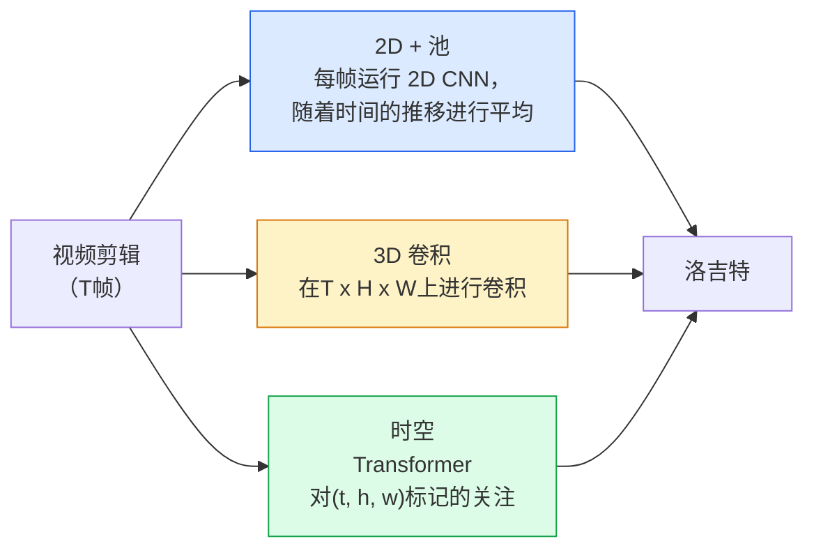

# 视频理解——时间建模

> 视频是一系列图像加上连接它们的物理原理。每个视频模型要么将时间视为额外的轴（3D 卷积）、要参与的序列（Transformer），要么将时间视为提取一次和池化的特征（2D+池化）。

**类型：** Learn + Build
**语言：** Python
**先修：** 第 4 阶段第 03 课 (CNNs)，第 4 阶段第 04 课（图像分类）
**时间：** 约 45 分钟

## 学习目标

- 区分三种主要视频建模方法（2D+池、3D 卷积、时空Transformer）并预测它们的成本和准确性权衡
- 在PyTorch中实现帧采样、时间池化和2D+池化基线分类器
- 解释为什么 I3D 的“膨胀”3D 内核可以很好地从 ImageNet 权重转移，以及因式分解 (2+1)D 卷积有何不同
- 阅读标准动作识别数据集和指标：Kinetics-400/600、UCF101、Something-Something V2；剪辑和视频级别的 top-1 准确度

## 问题

30 fps 的 30 秒视频包含 900 个图像。简单地说，视频分类是运行 900 次的图像分类，然后进行某种聚合。当动作几乎在每一帧（运动、烹饪、锻炼视频）中都可见时，这种方法有效；而当动作由运动本身定义时，这种方法就会严重失败：“从左向右推动某物”在每一帧中看起来就像两个静止的物体。

每个视频架构的核心问题是：时间结构何时建模以及如何建模？答案驱动其他一切——计算成本、预训练策略、是否可以重用ImageNet权重、模型训练的数据集。

本课程故意比静态图像课程短。核心图像机制已经就位，视频理解主要涉及时间故事：采样、建模和聚合。

## 概念

### 三大建筑家族



### 2D+台球

Take a 2D CNN (ResNet, EfficientNet, ViT). Run it independently on every sampled frame. Average (or max-pool, or attention-pool) the per-frame embeddings. Feed the pooled vector to a classifier.

优点：
- ImageNet预训练直接传输。
- 实施起来最简单。
- 便宜：T 帧 * 单图像推理成本。

缺点：
- 无法模拟运动。 Action = 外观的聚合。
- 时间池是顺序不变的； “开门”和“关门”看起来是一样的。

何时使用：外观密集型任务、小型视频数据集上的迁移学习、初始基线。

### 3D convolutions

将 2D (H, W) 内核替换为 3D (T, H, W) 内核。该网络在空间和时间上进行卷积。早期系列：C3D、I3D、SlowFast。

I3D 技巧：采用预训练的 2D ImageNet 模型，通过沿新时间轴复制每个 2D 内核来“膨胀”每个 2D 内核。 3x3 2D 转换变为 3x3x3 3D 转换。这为 3D 模型提供了强大的预训练权重，而不是从头开始训练。

优点：
- 直接模拟运动。
- I3D 通货膨胀提供免费的迁移学习。

缺点：
- T/8 比 2D 对应物有更多的 FLOP（对于 3 个堆叠 3 次的时间内核）。
- 时间核很小；长距离运动需要金字塔或双流方法。

何时使用：以运动为信号的动作识别（Something-Something V2、具有运动密集类的动力学）。

### 时空转换器

将视频标记为时空补丁网格并参与所有这些补丁。 TimeSformer、ViViT、视频 Swin、视频MAE。

重要的注意力模式：
- **Joint** — one big attention over (t, h, w). Quadratic in `T*H*W`; expensive.
- **分开**——每个块有两个注意力：一个是时间上的，一个是空间上的。线性缩放。
- **因式分解**——时间注意力与空间注意力在区块之间交替。

优点：
- SOTA accuracy on every major benchmark.
- 通过补丁膨胀从图像转换器 (ViT) 传输。
- 通过稀疏注意力支持长上下文视频。

缺点：
- 计算量大。
- 需要仔细选择注意力模式或运行时气球。

何时使用：大型数据集、高保真视频理解、多模式视频+文本任务。

### 帧采样

A 10-second clip at 30 fps is 300 frames; feeding all 300 to any model is wasteful. Standard strategies:

- **均匀采样** — 在剪辑中均匀地选取 T 帧。默认为 2D+池。
- **密集采样** — 随机连续 T 帧窗口。对于 3D 卷积很常见，因为运动需要相邻帧。
- **多剪辑** — 从同一视频中采样多个 T 帧窗口，对每个窗口进行分类，在测试时进行平均预测。

T 通常为 8、16、32 或 64。 T 越高 = 计算量越大，时间信号越多。

### Evaluation

两个层次：
- **剪辑级别精度** — 模型看到一个 T 型框架剪辑，报告 top-k。
- **视频级准确度** — 每个视频多个剪辑的平均剪辑级预测；更高更稳定。

始终报告两者。剪辑得分为 78%、视频得分为 82% 的模型严重依赖于测试时间平均；得分为 80% / 81% 的每个剪辑更加稳健。

### 您将遇到的数据集

- **Kinetics-400 / 600 / 700** — 通用动作数据集。 400k 剪辑； YouTube 网址（许多现已失效）。
- **Something-Something V2** — 运动定义的动作（“从左向右移动 X”）。 2D+pool无法解决。
- **UCF-101**、**HMDB-51** — 较旧、较小，仍有报道。
- **AVA** — 行动在空间和时间上的*本地化*；比分类更难。

## Build It

### 第 1 步：帧采样器

适用于帧列表（或视频张量）的均匀且密集的采样器。

```python
import numpy as np

def sample_uniform(num_frames_total, T):
    if num_frames_total <= T:
        return list(range(num_frames_total)) + [num_frames_total - 1] * (T - num_frames_total)
    step = num_frames_total / T
    return [int(i * step) for i in range(T)]


def sample_dense(num_frames_total, T, rng=None):
    rng = rng or np.random.default_rng()
    if num_frames_total <= T:
        return list(range(num_frames_total)) + [num_frames_total - 1] * (T - num_frames_total)
    start = int(rng.integers(0, num_frames_total - T + 1))
    return list(range(start, start + T))
```

两者都返回用于切片视频张量的 `T` 索引。

### 第 2 步：2D+池基线

在每一帧上运行 2D ResNet-18，平均池特征，分类。

```python
import torch
import torch.nn as nn
from torchvision.models import resnet18, ResNet18_Weights

class FramePool(nn.Module):
    def __init__(self, num_classes=400, pretrained=True):
        super().__init__()
        weights = ResNet18_Weights.IMAGENET1K_V1 if pretrained else None
        backbone = resnet18(weights=weights)
        self.features = nn.Sequential(*(list(backbone.children())[:-1]))  # global avg pool kept
        self.head = nn.Linear(512, num_classes)

    def forward(self, x):
        # x: (N, T, 3, H, W)
        N, T = x.shape[:2]
        x = x.view(N * T, *x.shape[2:])
        feats = self.features(x).view(N, T, -1)
        pooled = feats.mean(dim=1)
        return self.head(pooled)

model = FramePool(num_classes=10)
x = torch.randn(2, 8, 3, 224, 224)
print(f"output: {model(x).shape}")
print(f"params: {sum(p.numel() for p in model.parameters()):,}")
```

一千一百万个参数，ImageNet 预训练，每帧运行、平均、分类。对于外观繁重的任务，此基线通常与正确的 3D 模型相差 5-10 个点——有时更好，因为它重复使用了更强大的 ImageNet 主干。

### 第 3 步：I3D 风格的膨胀 3D 转换

通过沿着新的时间轴重复权重，将单个 2D 转换为 3D 转换。

```python
def inflate_2d_to_3d(conv2d, time_kernel=3):
    out_c, in_c, kh, kw = conv2d.weight.shape
    weight_3d = conv2d.weight.data.unsqueeze(2)  # (out, in, 1, kh, kw)
    weight_3d = weight_3d.repeat(1, 1, time_kernel, 1, 1) / time_kernel
    conv3d = nn.Conv3d(in_c, out_c, kernel_size=(time_kernel, kh, kw),
                        padding=(time_kernel // 2, conv2d.padding[0], conv2d.padding[1]),
                        stride=(1, conv2d.stride[0], conv2d.stride[1]),
                        bias=False)
    conv3d.weight.data = weight_3d
    return conv3d

conv2d = nn.Conv2d(3, 64, kernel_size=3, padding=1, bias=False)
conv3d = inflate_2d_to_3d(conv2d, time_kernel=3)
print(f"2D weight shape:  {tuple(conv2d.weight.shape)}")
print(f"3D weight shape:  {tuple(conv3d.weight.shape)}")
x = torch.randn(1, 3, 8, 56, 56)
print(f"3D output shape:  {tuple(conv3d(x).shape)}")
```

除以 `time_kernel` 可以使激活幅度大致保持恒定——这对于在第一次传递时不破坏批量规范统计非常重要。

### 步骤 4：因式分解 (2+1)D 转换

将 3D 转换拆分为 2D（空间）和 1D（时间）转换。相同的感受野、更少的参数、在某些基准测试上更高的准确性。

```python
class Conv2Plus1D(nn.Module):
    def __init__(self, in_c, out_c, kernel_size=3):
        super().__init__()
        mid_c = (in_c * out_c * kernel_size * kernel_size * kernel_size) \
                // (in_c * kernel_size * kernel_size + out_c * kernel_size)
        self.spatial = nn.Conv3d(in_c, mid_c, kernel_size=(1, kernel_size, kernel_size),
                                 padding=(0, kernel_size // 2, kernel_size // 2), bias=False)
        self.bn = nn.BatchNorm3d(mid_c)
        self.act = nn.ReLU(inplace=True)
        self.temporal = nn.Conv3d(mid_c, out_c, kernel_size=(kernel_size, 1, 1),
                                  padding=(kernel_size // 2, 0, 0), bias=False)

    def forward(self, x):
        return self.temporal(self.act(self.bn(self.spatial(x))))

c = Conv2Plus1D(3, 64)
x = torch.randn(1, 3, 8, 56, 56)
print(f"(2+1)D output: {tuple(c(x).shape)}")
```

完整的 R(2+1)D 网络与 ResNet-18 相同，其中每个 3x3 转换被 `Conv2Plus1D` 替换。

## Use It

两个库涵盖制作视频作品：

- `torchvision.models.video` — R(2+1)D、MViT、带有预训练动力学权重的 Swin3D。与图像模型相同的 API。
- `pytorchvideo` (元) — 模型动物园、动力学/SSv2/AVA 数据加载器、标准转换。

For Vision-Language video models (video captioning, video QA), use `transformers` (`VideoMAE`, `VideoLLaMA`, `InternVideo`).

## Ship It

本课产生：

- `outputs/prompt-video-architecture-picker.md` — 根据外观与运动、数据集大小和计算预算选择 2D+pool / I3D / (2+1)D / Transformer 的提示。
- `outputs/skill-frame-sampler-auditor.md` — 一项检查视频管道采样器并标记常见错误的技能：差一索引、`num_frames < T` 时采样不均匀、缺乏保留纵横比的裁剪等。

## 练习

1. **（简单）** 计算 T=8 的 FramePool 与 T=8 的 I3D 样式 3D ResNet 的 FLOP（大约）。证明为什么 2D+pool 便宜 3-5 倍。
2. **（中）** 生成合成视频数据集：沿随机方向移动的随机球，按运动方向标记（“从左到右”、“从右到左”、“对角线向上”）。在其上训练 FramePool。证明它达到了近乎偶然的精度，证明仅靠外观不足以完成运动任务。
3. **（难）** 通过用 `Conv2Plus1D` 替换 ResNet-18 中的每个 Conv2d 来构建 R(2+1)D-18。从ImageNet-预训练的ResNet-18 中增加第一个卷积的权重。使用练习 2 中的运动数据集进行训练并击败 FramePool。

## 关键术语

| 学期 | 人们怎么说 | 它实际上意味着什么 |
|------|----------------|----------------------|
| 2D+台球 | “每帧分类器” | 在每个采样帧上运行 2D CNN，跨时间平均池特征，分类 |
| 3D卷积 | “时空内核” | 卷积 (T, H, W) 的内核；可以本地模拟运动 |
| 通货膨胀 | “将 2D 权重提升到 3D” | 通过沿新时间轴重复 2D 卷积的权重来初始化 3D 卷积权重，然后除以 kernel_T 以保留激活比例 |
| (2+1)D | “因式分解转化” | 将3D分割成2D空间+1D时间；参数较少，之间存在额外的非线性 |
| 注意力分散 | “先是时间，后是空间” | Transformer 块每层有两个注意力：一个在同一帧的令牌上，一个在同一位置的令牌上 |
| 夹子 | “T型窗” | T 帧的采样子序列；视频模型消耗的单位 |
| 剪辑与视频准确性 | “两个评估设置” | Clip = 每个视频一个样本，video = 多个采样剪辑的平均值 |
| 动力学 | “视频的ImageNet” | 400-700 action classes, 300k+ YouTube clips, the standard video pretraining corpus |

## 延伸阅读

- [I3D：Quo Vadis，动作识别（Carreira & Zisserman，2017）](https://arxiv.org/abs/1705.07750) - 介绍通货膨胀和动力学数据集
- [R(2+1)D: A Closer Look at Spatiotemporal Convolutions (Tran et al., 2018)](https://arxiv.org/abs/1711.11248) — factorised conv, still a strong baseline
- [TimeSformer：时空注意力就是你所需要的吗？ (Bertasius et al., 2021)](https://arxiv.org/abs/2102.05095) — 第一个强大的视频转换器
- [VideoMAE (Tong et al., 2022)](https://arxiv.org/abs/2203.12602) — 视频的屏蔽自动编码器预训练；当前占主导地位的预训练配方
