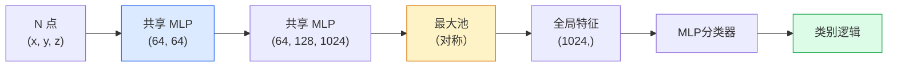

# 3D 视觉 — 点云和 NeRFs

> 3D 视觉有两种形式。点云是传感器的原始输出。 NeRFs 是学习到的体积场。两者都回答“太空中的什么地方”。

**类型：** Learn + Build
**语言：** Python
**先修：** 第 4 阶段第 03 课 (CNNs)，第 1 阶段第 12 课（张量运算）
**时间：** 约 45 分钟

## 学习目标

- 区分显式（点云、网格、体素）和隐式（有符号距离场、NeRF）3D 表示以及每种表示的使用时间
- 了解 PointNet 的对称函数技巧，该技巧使神经网络在无序点集上保持排列不变
- 追踪NeRF前向传递：光线投射、体积渲染、位置编码、MLP密度+色头
- 使用 `nerfstudio` 或 `instant-ngp` 从一小组姿势图像中进行预训练 3D 重建

## 问题

相机产生 2D 图像。 LIDAR 生成一组没有排序的 3D 点。运动结构管道可生成稀疏的 3D 关键点云。 NeRF 从一些摆好姿势的图像中重建了整个 3D 场景。所有这些都是“愿景”，但没有一个看起来像 CNN 想要的密集张量。

3D 视觉很重要，因为几乎所有高价值的机器人任务都以 3D 方式运行：抓取、避障、导航、AR 遮挡、3D 内容捕获。只了解 2D 图像的视觉工程师被排除在增长最快的领域之外（AR/VR 内容、机器人、自动驾驶堆栈、基于 NeRF 的房地产或建筑 3D 重建）。

这两种表述由于不同的原因而占据主导地位。点云是传感器免费为您提供的。当您要求神经网络学习场景时，您会得到 NeRFs 及其后继者（3D 高斯泼溅、神经 SDF）。

## 概念

### 点云

点云是 R^3 中 N 个点的无序集合，每个点可选地具有特征（颜色、强度、法线）。

```
cloud = [
  (x1, y1, z1, r1, g1, b1),
  (x2, y2, z2, r2, g2, b2),
  ...
  (xN, yN, zN, rN, gN, bN),
]
```

没有网格，没有连接。有两个特性使得神经网络很难做到这一点：

- **Permutation invariance** — the output must not depend on point order.
- **变量 N** — 单个模型必须处理不同大小的云。

PointNet（Qi 等人，2017）用一个想法解决了这两个问题：将共享 MLP 应用于每个点，然后使用对称函数（最大池）进行聚合。结果是一个不依赖于顺序的固定大小向量。

```
f(P) = max_{p in P} MLP(p)
```

这就是PointNet的整个核心。更深层次的变体（PointNet++、Point Transformer）添加了分层采样和局部聚合，但对称函数技巧保持不变。

### The PointNet architecture



“共享MLP”是指相同的MLP独立地在每个点上运行。为了提高效率，在点维度上实现为 1x1 转换。

### 神经辐射场 (NeRFs)

NeRFs（Mildenhall et al., 2020）提出了“我们可以从 N 张照片重建 3D 场景吗？”的问题。并用神经网络来回答，这就是场景。网络将`(x, y, z, viewing_direction)`映射到`(density, colour)`。渲染新视图是该网络上的光线投射循环。

```
NeRF MLP:  (x, y, z, theta, phi) -> (sigma, r, g, b)

To render a pixel (u, v) of a new view:
  1. Cast a ray from the camera through pixel (u, v)
  2. Sample points along the ray at distances t_1, t_2, ..., t_N
  3. Query the MLP at each point
  4. Composite the colours weighted by (1 - exp(-sigma * dt))
  5. The sum is the rendered pixel colour
```

损失将渲染像素与训练照片中的真实像素进行比较。反向传播通过渲染步骤更新 MLP。没有 3D 地面实况，没有显式几何——场景存储在 MLP 权重中。

### NeRF 中的位置编码

`(x, y, z)` 上的普通 MLP 无法表示高频细节，因为 MLP 在频谱上偏向低频。 NeRF 通过在 MLP 之前将每个坐标编码为傅里叶特征向量来修复此问题：

```
gamma(p) = (sin(2^0 pi p), cos(2^0 pi p), sin(2^1 pi p), cos(2^1 pi p), ...)
```

高达 L=10 个频率级别。这与Transformer用于位置的技巧相同，并且在扩散时间调节中再次出现（第 10 课）。没有它，NeRFs 看起来很模糊。

### 体积渲染

```
C(r) = sum_i T_i * (1 - exp(-sigma_i * delta_i)) * c_i

T_i  = exp(- sum_{j<i} sigma_j * delta_j)
delta_i = t_{i+1} - t_i
```

`T_i` 是透射率——有多少光存活到 i 点。 `(1 - exp(-sigma_i * delta_i))` 是 i 点的不透明度。 `c_i` 是颜色。最终像素是沿光线的加权和。

### 什么取代了NeRFs

纯 NeRF 的训练速度很慢（数小时），渲染速度也很慢（每张图像需要几秒）。谱系自：

- **Instant-NGP** (2022) — 哈希网格编码取代了 MLP 的位置输入；几秒钟内即可火车。
- **Mip-NeRF 360** — 处理无限场景和抗锯齿。
- **3D Gaussian Splatting** (2023) — 用数百万个 3D 高斯代替体积场；在几分钟内训练，实时渲染。当前生产默认值。

2026 年几乎每一个真正的NeRF 产品实际上都是 3D 高斯泼溅。心智模型仍然是NeRF。

### 数据集和基准

- **ShapeNet** — 将 3D CAD 模型分类和分割为点云。
- **ScanNet** — 真实的室内扫描进行分割。
- **KITTI** — 用于自动驾驶的室外激光雷达点云。
- **NeRF 合成** / **混合 MVS** — 用于视图合成的姿势图像数据集。
- **Mip-NeRF 360** dataset — unbounded real scenes.

## Build It

### 步骤1：PointNet分类器

```python
import torch
import torch.nn as nn

class PointNet(nn.Module):
    def __init__(self, num_classes=10):
        super().__init__()
        self.mlp1 = nn.Sequential(
            nn.Conv1d(3, 64, 1),    nn.BatchNorm1d(64),   nn.ReLU(inplace=True),
            nn.Conv1d(64, 64, 1),   nn.BatchNorm1d(64),   nn.ReLU(inplace=True),
        )
        self.mlp2 = nn.Sequential(
            nn.Conv1d(64, 128, 1),  nn.BatchNorm1d(128),  nn.ReLU(inplace=True),
            nn.Conv1d(128, 1024, 1), nn.BatchNorm1d(1024), nn.ReLU(inplace=True),
        )
        self.head = nn.Sequential(
            nn.Linear(1024, 512),   nn.BatchNorm1d(512),  nn.ReLU(inplace=True),
            nn.Dropout(0.3),
            nn.Linear(512, 256),    nn.BatchNorm1d(256),  nn.ReLU(inplace=True),
            nn.Dropout(0.3),
            nn.Linear(256, num_classes),
        )

    def forward(self, x):
        # x: (N, 3, num_points) — transposed for Conv1d
        x = self.mlp1(x)
        x = self.mlp2(x)
        x = torch.max(x, dim=-1)[0]       # (N, 1024)
        return self.head(x)

pts = torch.randn(4, 3, 1024)
net = PointNet(num_classes=10)
print(f"output: {net(pts).shape}")
print(f"params: {sum(p.numel() for p in net.parameters()):,}")
```

大约1.6M参数。每个云运行 1,024 个点。

### 步骤 2：位置编码

```python
def positional_encoding(x, L=10):
    """
    x: (..., D) -> (..., D * 2 * L)
    """
    freqs = 2.0 ** torch.arange(L, dtype=x.dtype, device=x.device)
    args = x.unsqueeze(-1) * freqs * 3.141592653589793
    sinc = torch.cat([args.sin(), args.cos()], dim=-1)
    return sinc.reshape(*x.shape[:-1], -1)

x = torch.randn(5, 3)
y = positional_encoding(x, L=10)
print(f"input:  {x.shape}")
print(f"encoded: {y.shape}     # (5, 60)")
```

乘以 `2^l * pi` 会得到逐渐升高的频率。

### 第 3 步：微小NeRF MLP

```python
class TinyNeRF(nn.Module):
    def __init__(self, L_pos=10, L_dir=4, hidden=128):
        super().__init__()
        self.L_pos = L_pos
        self.L_dir = L_dir
        pos_dim = 3 * 2 * L_pos
        dir_dim = 3 * 2 * L_dir
        self.trunk = nn.Sequential(
            nn.Linear(pos_dim, hidden), nn.ReLU(inplace=True),
            nn.Linear(hidden, hidden),  nn.ReLU(inplace=True),
            nn.Linear(hidden, hidden),  nn.ReLU(inplace=True),
            nn.Linear(hidden, hidden),  nn.ReLU(inplace=True),
        )
        self.sigma = nn.Linear(hidden, 1)
        self.color = nn.Sequential(
            nn.Linear(hidden + dir_dim, hidden // 2), nn.ReLU(inplace=True),
            nn.Linear(hidden // 2, 3), nn.Sigmoid(),
        )

    def forward(self, x, d):
        x_enc = positional_encoding(x, self.L_pos)
        d_enc = positional_encoding(d, self.L_dir)
        h = self.trunk(x_enc)
        sigma = torch.relu(self.sigma(h)).squeeze(-1)
        rgb = self.color(torch.cat([h, d_enc], dim=-1))
        return sigma, rgb

nerf = TinyNeRF()
x = torch.randn(128, 3)
d = torch.randn(128, 3)
s, c = nerf(x, d)
print(f"sigma: {s.shape}   rgb: {c.shape}")
```

与原始NeRF（具有 2 个深度为 8 的 MLP 主干）相比，很小。足以展示架构。

### 第 4 步：沿射线进行体积渲染

```python
def volumetric_render(sigma, rgb, t_vals):
    """
    sigma: (..., N_samples)
    rgb:   (..., N_samples, 3)
    t_vals: (N_samples,) distances along the ray
    """
    delta = torch.cat([t_vals[1:] - t_vals[:-1], torch.full_like(t_vals[:1], 1e10)])
    alpha = 1.0 - torch.exp(-sigma * delta)
    trans = torch.cumprod(torch.cat([torch.ones_like(alpha[..., :1]), 1.0 - alpha + 1e-10], dim=-1), dim=-1)[..., :-1]
    weights = alpha * trans
    rendered = (weights.unsqueeze(-1) * rgb).sum(dim=-2)
    depth = (weights * t_vals).sum(dim=-1)
    return rendered, depth, weights


N = 64
t_vals = torch.linspace(2.0, 6.0, N)
sigma = torch.rand(N) * 0.5
rgb = torch.rand(N, 3)
rendered, depth, weights = volumetric_render(sigma, rgb, t_vals)
print(f"rendered colour: {rendered.tolist()}")
print(f"depth:           {depth.item():.2f}")
```

一条光线，64 个样本，合成为单个 RGB 像素和深度。

## Use It

对于实际工作：

- `nerfstudio` (Tancik 等人) — NeRF / Instant-NGP / Gaussian Splatting 的当前参考库。命令行加网络查看器。
- `pytorch3d` (元) — 可微渲染、点云实用程序、网格操作。
- `open3d` — 点云处理、注册、可视化。

对于部署而言，3D 高斯喷射已在很大程度上取代了纯 NeRFs，因为它的渲染速度快了 100 倍。重建质量具有可比性。

## Ship It

本课产生：

- `outputs/prompt-3d-task-router.md` — 根据任务和输入数据路由到正确的 3D 表示（点云、网格、体素、NeRF、高斯图）的提示。
- `outputs/skill-point-cloud-loader.md` — 一种为 .ply / .pcd / .xyz 文件编写 PyTorch `Dataset` 的技能，具有正确的标准化、居中和点采样。

## 练习

1. **（简单）** 证明 PointNet 是排列不变的：将同一个云运行两次，一次对点进行打乱。验证输出在浮点噪声范围内是否相同。
2. **（中）** 实现最小光线生成函数，根据给定的相机内在特征和姿态，为 H x W 图像的每个像素生成光线原点和方向。
3. **（难）** 在彩色立方体渲染视图的合成数据集（通过可微渲染或简单的光线追踪器生成）上训练 TinyNeRF。报告第 1、10 和 100 个时期的渲染损失。模型在哪个时期产生可识别的视图？

## 关键术语

| 学期 | 人们怎么说 | 它实际上意味着什么 |
|------|----------------|----------------------|
| 点云 | “来自激光雷达的 3D 点” | 无序集合 (x, y, z) + 每个点的可选特征 |
| 点网 | “第一个点云神经网络” | 每点共享 MLP + 对称（最大）池；通过构造排列不变 |
| NeRF | “MLP就是现场” | 网络映射（x，y，z，dir）到（密度，颜色）；通过光线投射渲染 |
| 位置编码 | 《傅里叶特征》 | Encode each coordinate into sin/cos at multiple frequencies to overcome MLP low-frequency bias |
| 体积渲染 | 《射线整合》 | 使用透射率和 Alpha 将样本沿光线合成为单个像素 |
| 即时NGP | “哈希网格NeRF” | 用多分辨率哈希网格替换NeRF的坐标MLP；快 100-1000 倍 |
| 3D 高斯溅射 | 《百万高斯》 | Scene = 3D 高斯集合；实时渲染，几分钟内训练 |
| 自卫队 | “有符号距离场” | 返回到最近表面的有符号距离的函数；另一种隐式表示 |

## 延伸阅读

- [PointNet (Qi et al., 2017)](https://arxiv.org/abs/1612.00593) — 排列不变分类器
- [NeRF (Mildenhall et al., 2020)](https://arxiv.org/abs/2003.08934) — 这篇论文将照片的 3D 重建变成了一个神经网络问题
- [Instant-NGP (Müller et al., 2022)](https://arxiv.org/abs/2201.05989) — hash grids, 1000x speedup
- [3D Gaussian Splatting (Kerbl et al., 2023)](https://arxiv.org/abs/2308.04079) — 在生产中取代 NeRFs 的架构
