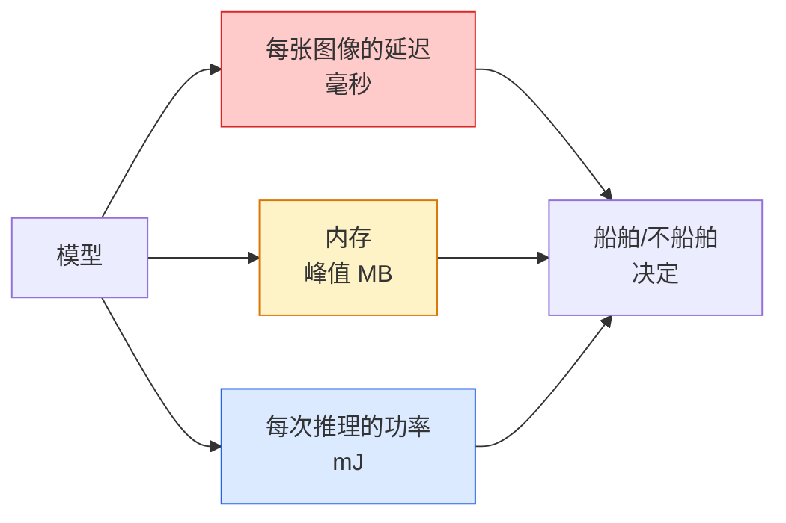

# 实时视觉——边缘部署

> 边缘推理是让 90 精度模型在具有 2 GB RAM 的设备上以 30 fps 运行的学科。每一个百分点的准确度都是以毫秒级的延迟为代价的。

**类型：** Learn + Build
**语言：** Python
**先修：** 第 4 阶段第 04 课（图像分类），第 10 阶段第 11 课（量化）
**时间：** 约 75 分钟

## 学习目标

- 测量任何 PyTorch 模型的推理延迟、峰值内存和吞吐量，并读取 FLOP/参数/延迟权衡
- 使用 PyTorch 的训练后量化将视觉模型量化为 INT8，并验证精度损失 < 1%
- 导出到 ONNX 并使用 ONNX Runtime 或 TensorRT 进行编译；列出三种最常见的导出失败及其修复方法
- 解释何时选择 MobileNetV3、EfficientNet-Lite、ConvNeXt-Tiny 或 MobileViT 作为边缘约束

## 问题

训练时视觉模型是一个浮点怪物。 100M 参数，每次前向传递 10 GFLOP，2 GB VRAM。这些都不适合手机、汽车信息娱乐单元、工业相机或无人机。交付视觉系统意味着将相同的预测纳入比原来小 100 倍的预算中。

三个旋钮完成大部分工作：模型选择（具有相同配方的较小架构）、量化（INT8 而不是 FP32）和推理运行时（ONNX Runtime、TensorRT、Core ML、TFLite）。正确Use It们是在工作站上运行的演示与搭载 30 美元相机模块的产品之间的区别。

本课程首先设置测量规则（您无法优化无法测量的内容），然后使用三个旋钮。我们的目标不是学习每个边缘运行时，而是了解存在哪些杠杆以及如何验证每个杠杆是否符合您的想法。

## 概念

### 三项预算



- **延迟**：p50、p95、p99。仅对 p50 进行平均会隐藏对实时系统很重要的尾部行为。
- **Peak memory**: the maximum the device ever sees, not the steady-state average. Matters because OOMs are fatal on embedded targets.
- **功率/能量**：电池供电设备上每次推理的毫焦耳数。通常用CPU/GPU利用率*时间来代表。

（模型、延迟、内存、准确性）表是边缘决策的依据。每个细胞都是在目标设备上测量的，而不是在工作站上。

### 测量学科

每个边缘轮廓应遵循的三个规则：

1. **测量前用假人向前传球 5-10 次来热身**模型。冷缓存和 JIT 编译产生不具有代表性的第一个数字。
2. **在定时块之前和之后使用 `torch.cuda.synchronize()` 同步** GPU 工作负载。如果没有这个，您将测量内核调度，而不是内核执行。
3. **将输入尺寸固定为生产分辨率。 224x224 上的延迟不是 512x512 上的延迟。

### FLOPs 作为代理

FLOP（每次推理的浮点运算）是一种廉价的、独立于设备的延迟代理。对于架构比较很有用，作为绝对挂钟会产生误导。 FLOPs 增加 10% 的模型在实践中可以快 2 倍，因为它使用硬件友好的操作（深度卷积编译良好，大型 7x7 卷积则不然）。

规则：使用 FLOP 进行架构搜索，使用设备上的延迟进行部署决策。

### 一段量化

将 FP32 权重和激活替换为 INT8。在具有 INT8 内核的硬件（每个现代移动 SoC、每个带有 Tensor Core 的 NVIDIA GPU）上，模型大小下降 4 倍，内存带宽下降 4 倍，计算量下降 2-4 倍。训练后静态量化时，视觉任务的准确度损失通常为 0.1-1 个百分点。

类型：

- **动态** — 将权重量化为 INT8，激活以 FP 计算。简单，加速小。
- **静态（训练后）** — 在小型校准集上量化权重 + 校准激活范围。比动态快得多。
- **量化感知训练 (QAT)** — 在训练期间模拟量化，以便模型围绕它进行学习。最好的准确性，需要标记数据。

对于视觉，训练后静态量化只需 5% 的努力即可获得 95% 的收益。仅当 PTQ 造成的准确性损失不可接受时才使用 QAT。

### 修剪和蒸馏

- **修剪** — 删除不重要的权重（基于幅度）或通道（结构化）。适用于过度参数化模型；在已经很紧凑的架构上不太有用。
- **蒸馏**——训练一个小学生模仿大老师的逻辑。通常可以恢复因缩小模型而损失的大部分精度。生产边缘模型的标准。

### 推理运行时间

- **PyTorch eager** — 速度慢，不适合部署。仅用于开发。
- **TorchScript** — 遗产。被 `torch.compile` 和 ONNX 导出取代。
- **ONNX 运行时** — 中性运行时。 CPU、CUDA、CoreML、TensorRT、OpenVINO 都有 ONNX 提供商。从这里开始。
- **TensorRT** — NVIDIA 的编译器。 NVIDIA GPU（工作站和 Jetson）上的最佳延迟。与 ONNX 运行时集成或独立运行。
- **Core ML** — Apple 的 iOS/macOS 运行时。需要`.mlmodel` 或`.mlpackage`。
- **TFLite** — Google 的 Android/ARM 运行时。需要`.tflite`。
- **OpenVINO** — Intel 的 CPU/VPU 运行时。需要`.xml` + `.bin`。

实践中：导出PyTorch -> ONNX -> 选择目标的运行时。 ONNX 是通用语言。

### 边缘架构选择器

| 预算 | 模型 | Why |
|--------|-------|-----|
| < 3M 参数 | MobileNetV3-小型 | 到处编译，良好的基线 |
| 3-10M | EfficientNet-Lite-B0 | Best accuracy per param on TFLite |
| 10-20M | ConvNeXt-Tiny | 每个参数的最佳精度，CPU 友好 |
| 20-30M | 移动ViT-S 或高效ViT | Transformer 具有 ImageNet 精度 |
| 30-80M | Swin-V2-Tiny | 如果堆栈支持窗口注意力 |

将所有这些量化为 INT8，除非您有特定原因不这样做。

```figure
cnn-param-count
```

## Build It

### 第 1 步：正确测量延迟

```python
import time
import torch

def measure_latency(model, input_shape, device="cpu", warmup=10, iters=50):
    model = model.to(device).eval()
    x = torch.randn(input_shape, device=device)
    with torch.no_grad():
        for _ in range(warmup):
            model(x)
        if device == "cuda":
            torch.cuda.synchronize()
        times = []
        for _ in range(iters):
            if device == "cuda":
                torch.cuda.synchronize()
            t0 = time.perf_counter()
            model(x)
            if device == "cuda":
                torch.cuda.synchronize()
            times.append((time.perf_counter() - t0) * 1000)
    times.sort()
    return {
        "p50_ms": times[len(times) // 2],
        "p95_ms": times[int(len(times) * 0.95)],
        "p99_ms": times[int(len(times) * 0.99)],
        "mean_ms": sum(times) / len(times),
    }
```

热身，同步，使用`time.perf_counter()`。报告百分位数，而不仅仅是平均值。

### 第 2 步：参数和 FLOP 计数

```python
def parameter_count(model):
    return sum(p.numel() for p in model.parameters())

def flops_estimate(model, input_shape):
    """
    Rough FLOP count for a conv/linear-only model. For production use `fvcore` or `ptflops`.
    """
    total = 0
    def conv_hook(m, inp, out):
        nonlocal total
        c_out, c_in, kh, kw = m.weight.shape
        h, w = out.shape[-2:]
        total += 2 * c_in * c_out * kh * kw * h * w
    def linear_hook(m, inp, out):
        nonlocal total
        total += 2 * m.in_features * m.out_features
    hooks = []
    for m in model.modules():
        if isinstance(m, torch.nn.Conv2d):
            hooks.append(m.register_forward_hook(conv_hook))
        elif isinstance(m, torch.nn.Linear):
            hooks.append(m.register_forward_hook(linear_hook))
    model.eval()
    with torch.no_grad():
        model(torch.randn(input_shape))
    for h in hooks:
        h.remove()
    return total
```

对于实际项目，请使用`fvcore.nn.FlopCountAnalysis`或`ptflops`；他们正确处理每个模块类型。

### 步骤 3：训练后静态量化

```python
def quantise_ptq(model, calibration_loader, backend="x86"):
    import torch.ao.quantization as tq
    model = model.eval().cpu()
    model.qconfig = tq.get_default_qconfig(backend)
    tq.prepare(model, inplace=True)
    with torch.no_grad():
        for x, _ in calibration_loader:
            model(x)
    tq.convert(model, inplace=True)
    return model
```

三个步骤：配置、准备（插入观察者）、用真实数据校准、转换（融合+量化）。需要融合模型（`Conv -> BN -> ReLU` -> `ConvBnReLU`），`torch.ao.quantization.fuse_modules` 处理。

### 第 4 步：导出到 ONNX

```python
def export_onnx(model, sample_input, path="model.onnx"):
    model = model.eval()
    torch.onnx.export(
        model,
        sample_input,
        path,
        input_names=["input"],
        output_names=["output"],
        dynamic_axes={"input": {0: "batch"}, "output": {0: "batch"}},
        opset_version=17,
    )
    return path
```

`opset_version=17` 是 2026 年的安全默认值。`dynamic_axes` 可让您以任意批量大小运行 ONNX 模型。

### 第 5 步：对制度进行基准测试和比较

```python
import torch.nn as nn
from torchvision.models import mobilenet_v3_small

def compare_regimes():
    model = mobilenet_v3_small(weights=None, num_classes=10)
    params = parameter_count(model)
    flops = flops_estimate(model, (1, 3, 224, 224))
    lat_fp32 = measure_latency(model, (1, 3, 224, 224), device="cpu")
    print(f"FP32 MobileNetV3-Small: {params:,} params  {flops/1e9:.2f} GFLOPs  "
          f"p50={lat_fp32['p50_ms']:.2f}ms  p95={lat_fp32['p95_ms']:.2f}ms")
```

对`resnet50`、`efficientnet_v2_s` 和`convnext_tiny` 运行相同的函数，您就可以获得部署决策所需的比较表。

## Use It

生产堆栈集中在以下三个路径之一：

- **Web / 无服务器**：PyTorch -> ONNX -> ONNX 运行时（CPU 或 CUDA 提供商）。最简单，对大多数人来说足够好。
- **NVIDIA 边缘（Jetson、GPU 服务器）**：PyTorch -> ONNX -> TensorRT。最佳的延迟，最大的工程努力。
- **移动**：PyTorch -> ONNX -> Core ML (iOS) 或 TFLite (Android)。导出前进行量化。

对于测量，`torch-tb-profiler`、`nvprof` / `nsys` 和 macOS 上的 Instruments 提供了逐层细分。 `benchmark_app` (OpenVINO) 和 `trtexec` (TensorRT) 提供独立的 CLI 编号。

## Ship It

本课产生：

- `outputs/prompt-edge-deployment-planner.md` — 在给定目标设备和延迟 SLA 的情况下选择主干、量化策略和运行时的提示。
- `outputs/skill-latency-profiler.md` — 一种编写完整的延迟基准脚本的技能，包括预热、同步、百分位数和内存跟踪。

## 练习

1. **（简单）** 在 CPU 上以 224x224 测量 `resnet18`、`mobilenet_v3_small`、`efficientnet_v2_s` 和 `convnext_tiny` 的 p50 延迟。报告该表并确定哪种架构具有最佳的每毫秒精度。
2. **（中）** 将训练后静态量化应用于`mobilenet_v3_small`。报告 CIFAR-10 或类似子集上的 FP32 与 INT8 延迟和准确性损失。
3. **（困难）** 将 `convnext_tiny` 导出到 ONNX，通过 `onnxruntime` 和 `CPUExecutionProvider` 运行它，并将延迟与 PyTorch eager 基线进行比较。确定 ONNX 运行时速度更快的第一层并解释原因。

## 关键术语

| 学期 | 人们怎么说 | 它实际上意味着什么 |
|------|----------------|----------------------|
| 延迟 | “多快啊” | 从输入到输出的时间； p50/p95/p99 百分位数，不是平均值 |
| 失败次数 | 「型号尺寸」 | 每次前向传递的浮点运算；计算成本的粗略代理 |
| INT8量化 | “8 位” | 将 FP32 weights/activations 替换为 8 位整数；体积缩小约 4 倍，速度提高 2-4 倍 |
| PTQ | “训练后量化” | 量化经过训练的模型，无需重新训练；简单，通常就足够了 |
| 质检总局 | “量化意识训练” | Simulate quantisation during training; best accuracy, requires labelled data |
| 奥恩克斯 | “中性格式” | 每个主流推理运行时都支持的模型交换格式 |
| 张量RT | “NVIDIA 编译器” | 将 ONNX 编译为 NVIDIA GPU 的优化引擎 |
| 蒸馏 | “老师->学生” | 训练一个小模型来模仿大模型的 logits；恢复大部分损失的准确性 |

## 延伸阅读

- [EfficientNet (Tan & Le, 2019)](https://arxiv.org/abs/1905.11946) — 高效架构的复合扩展
- [MobileNetV3 (Howard et al., 2019)](https://arxiv.org/abs/1905.02244) — 具有 h-swish 和 squeeze-excite 的移动优先架构
- [TensorRT 优化实用指南 (NVIDIA)](https://developer.nvidia.com/blog/accelerating-model-inference-with-tensorrt-tips-and-best-practices-for-pytorch-users/) — 如何实际获取论文中的吞吐量数字
- [ONNX 运行时文档](https://onnxruntime.ai/docs/) — 量化、图形优化、提供商选择
