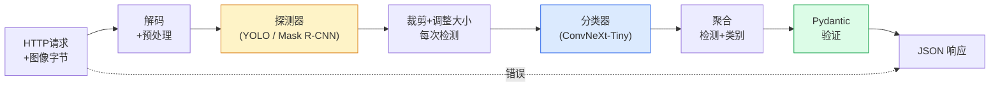

# 构建完整的愿景管道 — Capstone

> 生产视觉系统是用数据契约缝合的模型和规则链。这些作品已经处于这个阶段；顶点将它们首尾相连。

**类型：** Build
**语言：** Python
**先修：** 第 4 阶段课程 01-15
**时间：** 约 120 分钟

## 学习目标

- 设计一个生产视觉管道，用于检测对象、对其进行分类并发出结构化 JSON — 处理每个故障路径
- 将检测器（Mask R-CNN 或 YOLO）、分类器 (ConvNeXt-Tiny) 和数据契约 (Pydantic) 插入一项服务中
- 对端到端管道进行基准测试并确定第一个瓶颈（通常是预处理，然后是检测器）
- 提供一个最小的 FastAPI 服务，该服务接受图像上传、运行管道并返回带有分类的检测结果

## 问题

个人视觉模型很有用；视觉产品是它们的链条。零售货架审核由检测器、产品分类器和价格 OCR 管道组成。自动驾驶是2D检测器+3D检测器+分段器+跟踪器+规划器。医疗预筛选是一个分段器加上一个区域分类器加上一个临床医生用户界面。

连接这些链是将机器学习原型与产品分开的部分。模型之间的每个接口都是错误的新场所。每个坐标变换、每个归一化、每个掩模大小调整都是无声故障的候选者。管道的强度取决于其最薄弱的接口。

该顶点设置了最小可行的管道：检测+分类+结构化输出+服务层。第 4 阶段中的其他所有内容都插入此骨架中：将 Mask R-CNN 交换为 YOLOv8，添加 OCR 头，添加分段分支，添加跟踪器。架构稳定；这些部件是可插拔的。

## 概念

### 管道



七个阶段。这两个模型阶段都很昂贵；其他五个阶段是虫子居住的地方。

### Data contracts with Pydantic

每个模型边界都成为一个类型对象。这将无声的失败变成了响亮的失败。

```
Detection(
    box: tuple[float, float, float, float],   # (x1, y1, x2, y2), absolute pixels
    score: float,                              # [0, 1]
    class_id: int,                             # from detector's label map
    mask: Optional[list[list[int]]],           # RLE-encoded if present
)

PipelineResult(
    image_id: str,
    detections: list[Detection],
    classifications: list[Classification],
    inference_ms: float,
)
```

当检测器返回 `(cx, cy, w, h)` 中的框而不是 `(x1, y1, x2, y2)` 时，Pydantic 的验证在边界处失败，您会立即发现问题，而不是调试默默返回空区域的下游裁剪。

### 延迟的去向

几乎所有愿景管道都遵循三个真理：

1. **预处理通常是最大的单个块。** 解码 JPEG、转换颜色空间、调整大小 - 这些都是 CPU 限制的并且很容易忘记。
2. **检测器主导 GPU 时间。** 70-90% 的 GPU 时间用于检测前向传递。
3. **后处理（NMS、RLE encode/decode）在 GPU 上很便宜，在 CPU 上很昂贵。** 始终根据实际目标进行分析。

了解分布可以将优化转化为优先级列表。

### 失效模式

- **空检测** — 返回空列表，不会崩溃。日志。
- **越界框** — 在裁剪之前限制图像尺寸。
- **微小作物** — 跳过小于分类器最小输入的框的分类。
- **上传损坏** — 带有特定错误代码的 400 响应，而不是 500。
- **模型加载失败** — 在服务启动时失败，而不是在第一次请求时失败。

生产管道可以处理所有这些问题，而无需编写隐藏故障的通用`try/except`。每次失败都会得到一个命名代码和响应。

### 配料

生产服务为多个客户提供服务。跨请求批量检测和分类可成倍提高吞吐量。权衡：等待批次填充带来的额外延迟。典型设置：收集长达 20 毫秒的请求、批量处理、处理、分发响应。 `torchserve` 和 `triton` 本机执行此操作；具有可预测负载的小型服务推出自己的微批处理程序。

## Build It

### 第 1 步：数据合约

```python
from pydantic import BaseModel, Field
from typing import List, Optional, Tuple

class Detection(BaseModel):
    box: Tuple[float, float, float, float]
    score: float = Field(ge=0, le=1)
    class_id: int = Field(ge=0)
    mask_rle: Optional[str] = None


class Classification(BaseModel):
    detection_index: int
    class_id: int
    class_name: str
    score: float = Field(ge=0, le=1)


class PipelineResult(BaseModel):
    image_id: str
    detections: List[Detection]
    classifications: List[Classification]
    inference_ms: float
```

在任何重要的管道上，五秒钟的代码可以节省一个小时的调试时间。

### 第 2 步：最小 Pipeline 类

```python
import time
import numpy as np
import torch
from PIL import Image

class VisionPipeline:
    def __init__(self, detector, classifier, class_names,
                 device="cpu", min_crop=32):
        self.detector = detector.to(device).eval()
        self.classifier = classifier.to(device).eval()
        self.class_names = class_names
        self.device = device
        self.min_crop = min_crop

    def preprocess(self, image):
        """
        image: PIL.Image or np.ndarray (H, W, 3) uint8
        returns: CHW float tensor on device
        """
        if isinstance(image, Image.Image):
            image = np.asarray(image.convert("RGB"))
        tensor = torch.from_numpy(image).permute(2, 0, 1).float() / 255.0
        return tensor.to(self.device)

    @torch.no_grad()
    def detect(self, image_tensor):
        return self.detector([image_tensor])[0]

    @torch.no_grad()
    def classify(self, crops):
        if len(crops) == 0:
            return []
        batch = torch.stack(crops).to(self.device)
        logits = self.classifier(batch)
        probs = logits.softmax(-1)
        scores, cls = probs.max(-1)
        return list(zip(cls.tolist(), scores.tolist()))

    def run(self, image, image_id="anonymous"):
        t0 = time.perf_counter()
        tensor = self.preprocess(image)
        det = self.detect(tensor)

        crops = []
        detections = []
        valid_indices = []
        for i, (box, score, cls) in enumerate(zip(det["boxes"], det["scores"], det["labels"])):
            x1, y1, x2, y2 = [max(0, int(b)) for b in box.tolist()]
            x2 = min(x2, tensor.shape[-1])
            y2 = min(y2, tensor.shape[-2])
            detections.append(Detection(
                box=(x1, y1, x2, y2),
                score=float(score),
                class_id=int(cls),
            ))
            if (x2 - x1) < self.min_crop or (y2 - y1) < self.min_crop:
                continue
            crop = tensor[:, y1:y2, x1:x2]
            crop = torch.nn.functional.interpolate(
                crop.unsqueeze(0),
                size=(224, 224),
                mode="bilinear",
                align_corners=False,
            )[0]
            crops.append(crop)
            valid_indices.append(i)

        class_preds = self.classify(crops)

        classifications = []
        for valid_idx, (cls_id, cls_score) in zip(valid_indices, class_preds):
            classifications.append(Classification(
                detection_index=valid_idx,
                class_id=int(cls_id),
                class_name=self.class_names[cls_id],
                score=float(cls_score),
            ))

        return PipelineResult(
            image_id=image_id,
            detections=detections,
            classifications=classifications,
            inference_ms=(time.perf_counter() - t0) * 1000,
        )
```

每个界面都是有类型的。每个故障路径都有特定的处理决策。

### 第 3 步：连接检测器和分类器

```python
from torchvision.models.detection import maskrcnn_resnet50_fpn_v2
from torchvision.models import convnext_tiny

# Use ImageNet-pretrained weights for a realistic pipeline without training
detector = maskrcnn_resnet50_fpn_v2(weights="DEFAULT")
classifier = convnext_tiny(weights="DEFAULT")
class_names = [f"imagenet_class_{i}" for i in range(1000)]

pipe = VisionPipeline(detector, classifier, class_names)

# Smoke test with a synthetic image
test_image = (np.random.rand(400, 600, 3) * 255).astype(np.uint8)
result = pipe.run(test_image, image_id="demo")
print(result.model_dump_json(indent=2)[:500])
```

### 第四步：FastAPI服务

```python
from fastapi import FastAPI, UploadFile, HTTPException
from io import BytesIO

app = FastAPI()
pipe = None  # initialised on startup

@app.on_event("startup")
def load():
    global pipe
    detector = maskrcnn_resnet50_fpn_v2(weights="DEFAULT").eval()
    classifier = convnext_tiny(weights="DEFAULT").eval()
    pipe = VisionPipeline(detector, classifier, class_names=[f"c{i}" for i in range(1000)])

@app.post("/detect")
async def detect_endpoint(file: UploadFile):
    if file.content_type not in {"image/jpeg", "image/png", "image/webp"}:
        raise HTTPException(status_code=400, detail="unsupported image type")
    data = await file.read()
    try:
        img = Image.open(BytesIO(data)).convert("RGB")
    except Exception:
        raise HTTPException(status_code=400, detail="cannot decode image")
    result = pipe.run(img, image_id=file.filename or "upload")
    return result.model_dump()
```

Run with `uvicorn main:app --host 0.0.0.0 --port 8000`. Test with `curl -F 'file=@dog.jpg' http://localhost:8000/detect`.

### 第 5 步：对管道进行基准测试

```python
import time

def benchmark(pipe, num_runs=20, image_size=(400, 600)):
    img = (np.random.rand(*image_size, 3) * 255).astype(np.uint8)
    pipe.run(img)  # warm up

    stages = {"preprocess": [], "detect": [], "classify": [], "total": []}
    for _ in range(num_runs):
        t0 = time.perf_counter()
        tensor = pipe.preprocess(img)
        t1 = time.perf_counter()
        det = pipe.detect(tensor)
        t2 = time.perf_counter()
        crops = []
        for box in det["boxes"]:
            x1, y1, x2, y2 = [max(0, int(b)) for b in box.tolist()]
            x2 = min(x2, tensor.shape[-1])
            y2 = min(y2, tensor.shape[-2])
            if (x2 - x1) >= pipe.min_crop and (y2 - y1) >= pipe.min_crop:
                crop = tensor[:, y1:y2, x1:x2]
                crop = torch.nn.functional.interpolate(
                    crop.unsqueeze(0), size=(224, 224), mode="bilinear", align_corners=False
                )[0]
                crops.append(crop)
        pipe.classify(crops)
        t3 = time.perf_counter()
        stages["preprocess"].append((t1 - t0) * 1000)
        stages["detect"].append((t2 - t1) * 1000)
        stages["classify"].append((t3 - t2) * 1000)
        stages["total"].append((t3 - t0) * 1000)

    for stage, times in stages.items():
        times.sort()
        print(f"{stage:12s}  p50={times[len(times)//2]:7.1f} ms  p95={times[int(len(times)*0.95)]:7.1f} ms")
```

Typical output on CPU: preprocess 约 3 ms, detect 300-500 ms, classify 20-40 ms, total 350-550 ms. On GPU, detect is 20-40 ms and the preprocess + classify start to matter more in relative terms.

## Use It

生产模板收敛于相同的结构，此外：

- **模型版本控制** — 始终在响应中记录模型名称和权重哈希。
- **每个请求跟踪 ID** — 记录每个请求的每个阶段计时，以便您可以将缓慢响应与阶段相关联。
- **后备路径** — 如果分类器超时，则返回没有分类的检测结果，而不是使整个请求失败。
- **安全过滤器** — NSFW / PII 过滤器在分类后、响应离开服务之前运行。
- **批量端点** — `/detect_batch` 接受图像 URL 列表以进行批量处理。

对于生产服务，`torchserve`、`Triton Inference Server` 和 `BentoML` 可以开箱即用地处理批处理、版本控制、指标和运行状况检查。直接运行 `FastAPI` 对于原型和小型产品来说是很好的。

## Ship It

本课产生：

- `outputs/prompt-vision-service-shape-reviewer.md` — 检查视觉服务代码是否存在 contract/response 形状违规并命名第一个严重错误的提示。
- `outputs/skill-pipeline-budget-planner.md` - 一种技能，在给定目标延迟和吞吐量的情况下，为每个管道阶段分配时间预算，并标记哪个阶段将首先错过其预算。

## 练习

1. **（简单）** 对来自任何开放数据集的 10 个图像运行管道。报告每个阶段的平均时间和每个图像的检测计数分布。
2. **（中）** 将掩码输出字段添加到`Detection`并将其编码为RLE。验证 JSON 是否保持在 1MB 以下，即使对于 10 个对象的图像也是如此。
3. **（困难）** 在分类器前面添加一个微批处理程序：收集最多 10 毫秒的农作物，在一次 GPU 调用中对它们进行分类，按请求返回结果。测量每秒 5 个并发请求的吞吐量增益以及增加的延迟。

## 关键术语

| 学期 | 人们怎么说 | What it actually means |
|------|----------------|----------------------|
| 管道 | 「系统」 | 预处理、推理和后处理步骤的有序链，每对之间都有一个类型化接口 |
| 数据合约 | “架构” | 每个阶段输入和输出都符合的 Pydantic / 数据类定义；捕获边界处的集成错误 |
| 预处理 | 《模特之前》 | 解码、颜色转换、调整大小、标准化；通常是最大的 CPU 时间消耗 |
| 后处理 | 《模特之后》 | NMS、掩模调整大小、阈值、RLE 编码； GPU 便宜，CPU 昂贵 |
| 微量配料机 | “收集然后转发” | 等待多个请求的固定窗口的聚合器，运行单个批量前向传递 |
| 迹线ID | “请求 ID” | 在每个阶段记录每个请求标识符，以便可以端到端地跟踪缓慢的请求 |
| 故障代码 | “命名错误” | 每个故障类别的特定错误代码而不是通用的 500；启用客户端重试逻辑 |
| 健康检查 | “准备就绪探针” | 报告服务是否可以应答的廉价端点；负载均衡器依赖于此 |

## 延伸阅读

- [全栈深度学习 — 部署模型](https://fullstackdeeplearning.com/course/2022/lecture-5-deployment/) — 生产 ML 部署的规范概述
- [BentoML 文档](https://docs.bentoml.com) — 具有批处理、版本控制和指标的服务框架
- [torchserve 文档](https://pytorch.org/serve/) — PyTorch 的官方服务库
- [NVIDIA Triton 推理服务器](https://developer.nvidia.com/triton-inference-server) — 具有批处理和多模型支持的高吞吐量服务
