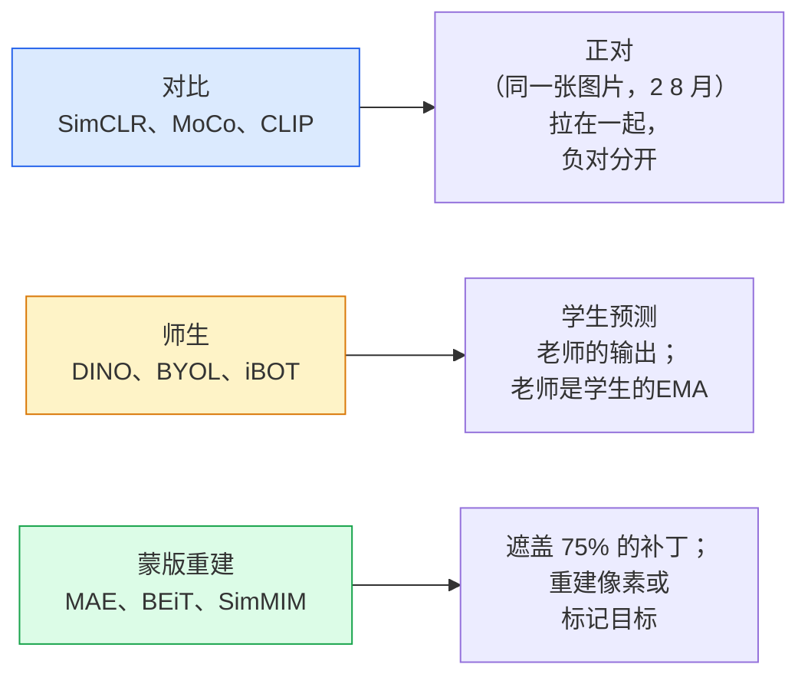

# 自监督视觉 — SimCLR、DINO、MAE

> 标签是监督视觉的瓶颈。自监督预训练消除了它们：从 100M 未标记图像中学习视觉特征，对 10k 标记图像进行微调。

**类型：** Learn + Build
**语言：** Python
**先修：** 第 4 阶段第 04 课（图像分类），第 4 阶段第 14 课 (ViT)
**时间：** 约 75 分钟

## 学习目标

- 追踪三个主要的自监督家族——对比（SimCLR）、师生（DINO）、掩模重建（MAE）——并说明每个家族的优化内容
- 从头开始实现 InfoNCE 损失并解释为什么一批 512 有效但一批 32 失败
- 解释为什么 MAE 的 75% 屏蔽率不是任意的，以及它与 BERT 的 15% 文本屏蔽率有何不同
- 使用 DINOv2 或 MAE ImageNet 检查点进行线性探测和零样本检索

## 问题

有监督的 ImageNet 有 130 万张标记图像，注释成本估计为 1000 万美元。医疗和工业数据集较小，标记成本甚至更高。每个视觉团队都会问：我们能否对廉价的未标记数据（YouTube 帧、网络爬行、网络摄像头片段、卫星扫描）进行预训练，然后在小型标记集上进行微调？

自我监督学习就是答案。在 LAION 或 JFT 上训练的现代自监督 ViT 经过微调后，可以达到或超过监督的 ImageNet 准确度。与监督预训练相比，它还可以更好地转移到下游任务（检测、分割、深度）。 DINOv2（Meta，2023）和MAE（Meta，2022）是可转移视觉特征的当前生产默认值。

概念上的转变是，借口任务（模型被训练要做的事情）不一定是下游任务。重要的是它迫使模型学习有用的特征。预测灰度图像的颜色、旋转图像并要求模型对旋转进行分类、遮盖补丁并重建它们——所有这些都有效。三种可扩展的方法是对比学习、师生蒸馏和掩模重建。

## 概念

### 三个家庭



### 对比学习(SimCLR)

拍摄一张图像，应用两次随机增强，获得两个视图。通过同一个编码器和投影头馈送两者。最小化“这两个嵌入应该接近”和“这个嵌入应该远离批次中所有其他图像的嵌入”的损失。

```
Loss for positive pair (z_i, z_j) among 2N views per batch:

   L_ij = -log( exp(sim(z_i, z_j) / tau) / sum_k in batch \ {i} exp(sim(z_i, z_k) / tau) )

sim = cosine similarity
tau = temperature (0.1 standard)
```

这就是 InfoNCE 损失。每个正片都需要很多负片，因此批量大小很重要 — SimCLR 需要 512-8192。 MoCo 引入了过去批次的动量队列，以将负计数与批次大小分离。

### 师生 (DINO)

具有相同架构的两个网络：学生和教师。老师是学生权重的指数移动平均值（EMA）。两者都看到图像的增强视图。学生的输出经过训练以匹配老师的输出——没有明确的否定。

```
loss = CE( student_output(view_1),  teacher_output(view_2) )
     + CE( student_output(view_2),  teacher_output(view_1) )

teacher_weights = m * teacher_weights + (1 - m) * student_weights   (m ≈ 0.996)
```

为什么它不会崩溃以“预测常数”：教师的输出是中心化的（减去每个维度的平均值）并锐化的（除以小温度）。居中可防止某一维度占主导地位；锐化可防止输出崩溃至均匀。

DINO is what DINOv2 scales up, on 142M curated images. The resulting features are the current SOTA for zero-shot visual retrieval and dense prediction.

### 蒙版重建（MAE）

屏蔽 ViT 输入的 75% 的补丁。仅将可见的 25% 通过编码器。小型解码器接收编码器的输出以及掩码位置处的掩码标记，并被训练以重建掩码补丁的像素。

```
Encoder:  visible 25% of patches -> features
Decoder:  features + mask tokens at masked positions -> reconstructed pixels
Loss:     MSE between reconstructed and original pixels on masked patches only
```

使MAE发挥作用的关键设计选择：

- **75% 面罩比率** — 高。强制编码器学习语义特征；重建 25% 几乎是微不足道的（相邻像素的相关性如此之高，CNN 可以解决这个问题）。
- **不对称encoder/decoder** — 大ViT编码器只能看到可见的补丁；一个小型解码器（8 层，512 维）处理重建。预训练速度比朴素 BEiT 快 3 倍。
- **像素空间重建目标** — 比 BEiT 的标记化目标更简单，并且在 ViT 上效果更好。

预训练后，丢弃解码器。编码器是特征提取器。

### 为什么是 75% 而不是 15%

BERT masks 15% of tokens. MAE masks 75%. The difference is information density.

- 自然语言的每个标记具有很高的熵。预测 15% 的标记仍然很困难，因为每个屏蔽位置都有许多看似合理的完成。
- Image patches have low entropy — an unmasked neighbourhood often determines the masked patch's pixels almost exactly. To make prediction require semantic understanding, you have to mask aggressively.

75% 已经足够高了，简单的空间外推法无法解决该任务；编码器必须代表图像内容。

### 线性探针评估

经过自监督预训练后，标准评估是**线性探针**：冻结编码器，在 ImageNet 标签上训练单个线性分类器。报告 top-1 准确度。

- SimCLR ResNet-50: 约 71% (2020)
- DINO ViT-S/16：约 77% (2021)
- MAE ViT-L/16：约 76% (2022)
- DINOv2 ViT-g/14：约 86% (2023)

线性探针是特征质量的纯粹衡量标准；微调通常会增加 2-5 分，但也会混合头部再训练的效果。

## Build It

### 第 1 步：双视图增强管道

```python
import torch
import torchvision.transforms as T

two_view_train = lambda: T.Compose([
    T.RandomResizedCrop(96, scale=(0.2, 1.0)),
    T.RandomHorizontalFlip(),
    T.ColorJitter(0.4, 0.4, 0.4, 0.1),
    T.RandomGrayscale(p=0.2),
    T.ToTensor(),
])


class TwoViewDataset(torch.utils.data.Dataset):
    def __init__(self, base):
        self.base = base
        self.aug = two_view_train()

    def __len__(self):
        return len(self.base)

    def __getitem__(self, i):
        img, _ = self.base[i]
        v1 = self.aug(img)
        v2 = self.aug(img)
        return v1, v2
```

每个 __getitem__ 返回同一图像的两个增强视图；不需要标签。

### 第 2 步：InfoNCE 损失

```python
import torch.nn.functional as F

def info_nce(z1, z2, tau=0.1):
    """
    z1, z2: (N, D) L2-normalised embeddings of paired views
    """
    N, D = z1.shape
    z = torch.cat([z1, z2], dim=0)  # (2N, D)
    sim = z @ z.T / tau              # (2N, 2N)

    mask = torch.eye(2 * N, dtype=torch.bool, device=z.device)
    sim = sim.masked_fill(mask, float("-inf"))

    targets = torch.cat([torch.arange(N, 2 * N), torch.arange(0, N)]).to(z.device)
    return F.cross_entropy(sim, targets)
```

在调用之前对嵌入进行 L2 标准化。 `tau=0.1` 是 SimCLR 默认值；越低，损失就越严重，并且需要更多的负数。

### 第 3 步：健全性检查 InfoNCE

```python
z1 = F.normalize(torch.randn(16, 32), dim=-1)
z2 = z1.clone()
loss_same = info_nce(z1, z2, tau=0.1).item()
z2_random = F.normalize(torch.randn(16, 32), dim=-1)
loss_random = info_nce(z1, z2_random, tau=0.1).item()
print(f"InfoNCE with identical pairs:  {loss_same:.3f}")
print(f"InfoNCE with random pairs:     {loss_random:.3f}")
```

相同的配对应具有较低的损耗（对于大批量和低温，损耗接近 0）。对于 16 对批次，随机对应给出 log(2N-1) = 约 log(31) = 约 3.4。

### 第 4 步：MAE 式掩蔽

```python
def random_mask_indices(num_patches, mask_ratio=0.75, seed=0):
    g = torch.Generator().manual_seed(seed)
    n_keep = int(num_patches * (1 - mask_ratio))
    perm = torch.randperm(num_patches, generator=g)
    visible = perm[:n_keep]
    masked = perm[n_keep:]
    return visible.sort().values, masked.sort().values


num_patches = 196
visible, masked = random_mask_indices(num_patches, mask_ratio=0.75)
print(f"visible: {len(visible)} / {num_patches}")
print(f"masked:  {len(masked)} / {num_patches}")
```

对于给定的种子来说简单、快速且具有确定性。真正的 MAE 实现对此进行批处理并保留每个样本的掩码。

## Use It

DINOv2是2026年的生产标准：

```python
import torch
from transformers import AutoImageProcessor, AutoModel

processor = AutoImageProcessor.from_pretrained("facebook/dinov2-base")
model = AutoModel.from_pretrained("facebook/dinov2-base")
model.eval()

# Per-image embeddings for zero-shot retrieval
with torch.no_grad():
    inputs = processor(images=[pil_image], return_tensors="pt")
    outputs = model(**inputs)
    embedding = outputs.last_hidden_state[:, 0]  # CLS token
```

由此产生的 768 维嵌入是现代图像检索、密集对应和零样本传输管道的支柱。对下游任务进行微调很少需要线性头。

对于图像文本嵌入，SigLIP 或 OpenCLIP 是等效的；对于 MAE 式的微调，`timm` 存储库提供每个 MAE 检查点。

## Ship It

本课产生：

- `outputs/prompt-ssl-pretraining-picker.md` — 在给定数据集大小、计算和下游任务的情况下选择 SimCLR / MAE / DINOv2 的提示。
- `outputs/skill-linear-probe-runner.md` — 一种为任何冻结编码器+标记数据集编写线性探针评估的技能。

## 练习

1. **（简单）** 验证当您降低对齐嵌入的温度时 InfoNCE 损耗会下降，而当您降低随机嵌入的温度时 InfoNCE 损耗会上升。绘制 `tau in [0.05, 0.1, 0.2, 0.5]` 与损失的关系图。
2. **（中）** 实现 DINO 风格的中心缓冲区。证明如果没有中心化，学生会在几个时期内崩溃到一个常数向量。
3. **（困难）** 使用第 10 课中的 TinyUNet 作为骨干在 CIFAR-100 上训练 MAE。报告 10、50 和 200 epoch 时的线性探针精度。表明 MAE 预训练的线性探针在相同的 1,000 个图像子集上击败了从头开始的监督线性探针。

## 关键术语

| 学期 | 人们怎么说 | 它实际上意味着什么 |
|------|----------------|----------------------|
| 自我监督 | “无标签” | 从未标记的数据生成有用表示的借口任务 |
| 借口任务 | "The fake task" | SSL 期间使用的目标（重建补丁、匹配视图）；预训练后丢弃 |
| 线性探头 | "Frozen encoder + linear head" | 标准 SSL 评估：仅在冻结特征之上训练线性分类器 |
| 信息NCE | “对比损失” | 余弦相似度上的softmax；正对是目标类，所有其他都是负类 |
| EMA老师 | 《移动平均线老师》 | 教师的权重是学生权重的指数移动平均值；由 BYOL、MoCo、DINO 使用 |
| 掩模比 | “隐藏补丁的百分比” | MAE 期间屏蔽的补丁部分； 75% 用于视觉，15% 用于文本 |
| 代表性崩溃 | “持续输出” | SSL 故障，编码器为所有输入输出恒定向量；通过居中、锐化或负片来防止 |
| DINOv2 | “生产 SSL 主干网” | Meta的2023年自监督ViT； 2026 年最强的通用图像特征 |

## 延伸阅读

- [SimCLR (Chen et al., 2020)](https://arxiv.org/abs/2002.05709) — 对比学习参考
- [DINO (Caron et al., 2021)](https://arxiv.org/abs/2104.14294) — 教师与学生之间的动力、集中、锐化
- [MAE (He et al., 2022)](https://arxiv.org/abs/2111.06377) - ViT 的屏蔽自动编码器预训练
- [DINOv2 (Oquab et al., 2023)](https://arxiv.org/abs/2304.07193) — 将自监督 ViT 扩展到生产特征
