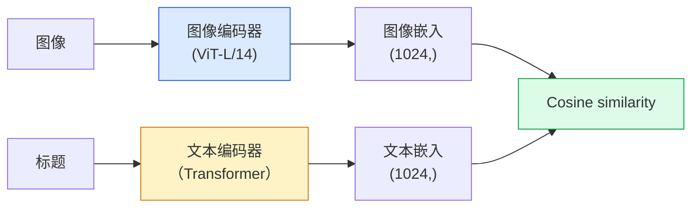

# 开放词汇愿景 — CLIP

> 一起训练图像编码器和文本编码器，以便匹配的（图像、标题）对落在共享空间中的同一点。这就是整个技巧。

**类型：** Build + Use
**语言：** Python
**先修：** 第 4 阶段第 14 课 (ViT)、第 4 阶段第 17 课（自我监督）
**时间：** 约 45 分钟

## 学习目标

- 解释CLIP的两塔架构和对比训练目标
- 使用预训练的 CLIP（或 SigLIP）进行零样本分类，无需任何特定于任务的训练
- 从头开始实现零样本分类：对类提示进行编码，计算余弦相似度，采用 argmax
- 区分 CLIP、SigLIP、OpenCLIP 和 LLaVA/LLaMA-vision 模型 — 每个模型在 2026 年的用途

## 问题

传统分类器是封闭词汇表的：1000 类 ImageNet 模型只能预测 1000 个标签。每个新类别都需要标记数据和重新训练的头脑。

CLIP（Radford 等人，OpenAI 2021）表明，对从网络上抓取的 4 亿（图像、标题）对进行训练会生成一个模型，该模型可以在推理时分类为任何类别集，并纯粹用自然语言进行描述。你可以通过写一个句子来给它一个新的类。

这种能力——零镜头传输——就是为什么每个现代视觉系统都以CLIP系列检查点开始。检测（Grounding DINO、OWL-ViT）、分割（CLIPSeg、SAM）、检索、内容审核、VLM 和文本到图像生成都建立在 CLIP 式联合嵌入的基础上。

## 概念

### 两座塔



两个编码器都以相同嵌入尺寸的线性投影结束（CLIP-B/32 为 512，CLIP-L/14 为 1024）。 L2 归一化并计算余弦相似度。

### 目标

给定一批 N（图像、标题）对，构建 NxN 相似度矩阵。训练两个编码器，使对角线（匹配对）具有高相似性，非对角线（不匹配）具有低相似性。

```
sim_matrix = image_embeddings @ text_embeddings.T / tau

loss_i2t = cross_entropy(sim_matrix,       targets=arange(N))
loss_t2i = cross_entropy(sim_matrix.T,     targets=arange(N))
loss = (loss_i2t + loss_t2i) / 2
```

对称是因为图像到文本和文本到图像检索都应该有效。 `tau`（温度）通常作为标量参数学习，初始化为 0.07。

### SigLIP：更好的损失

SigLIP（Zhai 等人，2023）用每对 sigmoid 替换了 softmax：

```
loss = mean over pairs of log(1 + exp(-y_ij * sim_ij))
y_ij = +1 if matching, -1 otherwise
```

每对损失消除了 CLIP 所需的批量级归一化。 SigLIP 在小批量下训练得更好，并且在相同数据下匹配或超过CLIP。

### 零样本分类

给定一个经过训练的CLIP：

1. 对于每个班级，撰写一个提示：“{class} 的照片”。
2. 使用文本编码器对所有课堂提示进行编码 -> `T` 形状 (C, d)。
3. 对测试图像进​​行编码 -> `I` 形状 (1, d)。
4. Similarity = `I @ T.T` shape (1, C).
5. Argmax -> 预测类别。

及时解决工程问题。 OpenAI 为ImageNet 发布了 80 个提示模板（“{} 的照片”、“{} 的模糊照片”、“{} 的草图”，...）。对每个类的所有模板的嵌入进行平均，以获得额外 1-3% 的 top-1 准确度。

### 2026年使用CLIP式模型的地方

- **零样本分类**——直接使用。
- **图像检索** — 对所有图像进行一次编码，在推理时嵌入查询。
- **文本条件检测** — 接地DINO，OWL-ViT 将 CLIP 文本塔包裹在检测器周围。
- **文本条件分割** — CLIPSeg； SAM 通过CLIP 使用文本提示输入。
- **VLM** — LLaVA、Qwen-VL、InternVL 将 CLIP 系列视觉编码器连接到 LLM。
- **文本到图像生成** — Stable Diffusion、CLIP 文本嵌入的 DALL-E 3 条件。

一旦有了共享的嵌入空间，每个视觉+语言任务就变成了距离计算。

## Build It

### 第 1 步：微型两塔模型

真正的CLIP是ViT +Transformer。在本课程中，塔是预提取特征上的小型 MLP，因此训练信号在 CPU 上可见。

```python
import torch
import torch.nn as nn
import torch.nn.functional as F


class TwoTower(nn.Module):
    def __init__(self, img_in=128, txt_in=64, emb=64):
        super().__init__()
        self.image_proj = nn.Sequential(nn.Linear(img_in, 128), nn.ReLU(), nn.Linear(128, emb))
        self.text_proj = nn.Sequential(nn.Linear(txt_in, 128), nn.ReLU(), nn.Linear(128, emb))
        self.logit_scale = nn.Parameter(torch.ones([]) * 2.6592)  # ln(1/0.07)

    def forward(self, img_feats, txt_feats):
        i = F.normalize(self.image_proj(img_feats), dim=-1)
        t = F.normalize(self.text_proj(txt_feats), dim=-1)
        return i, t, self.logit_scale.exp()
```

两个投影、共享暗淡输出、学习温度。与真实CLIP API 的形状相同。

### 步骤2：对比损失

```python
def clip_loss(image_emb, text_emb, logit_scale):
    N = image_emb.size(0)
    sim = logit_scale * image_emb @ text_emb.T
    targets = torch.arange(N, device=sim.device)
    l_i = F.cross_entropy(sim, targets)
    l_t = F.cross_entropy(sim.T, targets)
    return (l_i + l_t) / 2
```

对称。更高logit_scale = 更敏锐softmax = 更自信，但存在不稳定风险。

### 步骤 3：零样本分类器

```python
@torch.no_grad()
def zero_shot_classify(model, image_feats, class_text_feats, class_names):
    """
    image_feats:      (N, img_in)
    class_text_feats: (C, txt_in)   one averaged embedding per class
    """
    i = F.normalize(model.image_proj(image_feats), dim=-1)
    t = F.normalize(model.text_proj(class_text_feats), dim=-1)
    sim = i @ t.T
    pred = sim.argmax(dim=-1)
    return [class_names[p] for p in pred.tolist()]
```

每一步一行。这是与生产 CLIP 检查点一起使用的精确零样本程序。

### 第 4 步：健全性检查

```python
torch.manual_seed(0)
model = TwoTower()

img = torch.randn(8, 128)
txt = torch.randn(8, 64)
i, t, scale = model(img, txt)
loss = clip_loss(i, t, scale)
print(f"batch size: {i.size(0)}   loss: {loss.item():.3f}")
```

对于随机初始化的模型，损失应该接近`log(N) = log(8) = 2.08`——尚未学习结构时的对称交叉熵目标。

## Use It

OpenCLIP是2026年的社区默认：

```python
import open_clip
import torch
from PIL import Image

model, _, preprocess = open_clip.create_model_and_transforms("ViT-B-32", pretrained="laion2b_s34b_b79k")
tokenizer = open_clip.get_tokenizer("ViT-B-32")

image = preprocess(Image.open("dog.jpg")).unsqueeze(0)
text = tokenizer(["a photo of a dog", "a photo of a cat", "a photo of a car"])

with torch.no_grad():
    image_features = model.encode_image(image)
    text_features = model.encode_text(text)
    image_features = image_features / image_features.norm(dim=-1, keepdim=True)
    text_features = text_features / text_features.norm(dim=-1, keepdim=True)
    probs = (100.0 * image_features @ text_features.T).softmax(dim=-1)

print(probs)
```

SigLIP 较新，在小规模下训练得更好，并且是新工作的首选：`google/siglip-base-patch16-224`。 Hugging Face 两者都包含。

## Ship It

本课产生：

- `outputs/prompt-zero-shot-class-picker.md` — a prompt that designs class templates for zero-shot CLIP given a list of classes and a domain.
- `outputs/skill-image-text-retriever.md` - 一种使用任何CLIP检查点构建图像嵌入索引的技能，支持按文本查询和按图像查询。

## 练习

1. **（简单）** 使用预训练的 OpenCLIP ViT-B/32 并使用 80 个模板提示集在 CIFAR-10 上进行零样本分类。报告 top-1 准确率；应该在85-90%左右。
2. **（中）** 在同一 CIFAR-10 任务中比较单模板（“{} 的照片”）与 80 个模板的平均嵌入。量化差距并解释为什么模板有帮助。
3. **（难）** 构建零样本图像检索索引：使用CLIP嵌入1000张图像，构建FAISS索引，使用自然语言描述进行查询。针对您手写的 20 个保留查询报告检索召回@5。

## 关键术语

| 学期 | 人们怎么说 | 它实际上意味着什么 |
|------|----------------|----------------------|
| 两塔式 | “双编码器” | 单独的图像和文本编码器以共享暗淡投影头结束 |
| 零射击 | “没有针对特定任务的培训” | 在推理时分类为仅由文本描述的类别；没有触及任何标签 |
| 温度/logit_scale | “头” | 在 softmax 之前缩放相似矩阵的学习标量 |
| 提示模板 | “一张 {} 的照片” | 类名的自然语言包装；对许多模板进行平均可以提高零样本精度 |
| CLIP | “图像+文字模型” | 2021年OpenAI模型； 2026年该领域的词汇 |
| 西格利普 | “乙状结肠CLIP” | 将 softmax 替换为每对 sigmoid；小批量训练效果更好 |
| 打开CLIP | “开放复制” | LAION 上经过社区训练的 CLIP 变体；开源管道的生产默认值 |
| 视觉语言管理 | "Vision-language model" | CLIP 系列编码器加上法学硕士，经过培训可以回答有关图像的问题 |

## 延伸阅读

- [CLIP：从自然语言监督中学习可迁移的视觉模型（Radford 等人，2021）](https://arxiv.org/abs/2103.00020)
- [SigLIP：语言图像预训练的 Sigmoid 损失（Zhai 等人，2023）](https://arxiv.org/abs/2303.15343)
- [OpenCLIP](https://github.com/mlfoundations/open_clip) — 社区代码库
- [DINOv2 vs CLIP vs MAE：特征比较](https://huggingface.co/blog/dinov2) — 具有并排用例的 HF 指南
