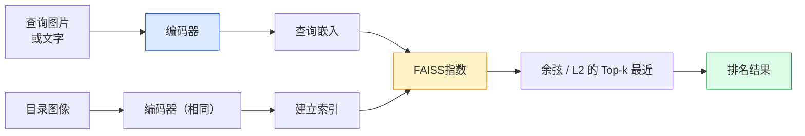

# 图像检索和度量学习

> 检索系统根据嵌入空间中的距离对候选者进行排名。度量学习是塑造该空间的学科，因此距离意味着您想要的。

**类型：** Build
**语言：** Python
**先修：** 第 4 阶段第 14 课 (ViT)，第 4 阶段第 18 课 (CLIP)
**时间：** 约 45 分钟

## 学习目标

- 解释三元组、对比和基于代理的度量学习损失，并为给定的数据集选择正确的损失
- 正确实施 L2 归一化和余弦相似度并审核“同一项目”和“同一类”检索之间的差异
- 构建 FAISS 索引，通过文本和图像查询，并针对保留的查询集报告recall@K
- 使用 DINOv2、CLIP 和 SigLIP 作为现成的嵌入主干，并了解各自何时获胜

## 问题

检索在生产视觉中无处不在：重复检测、反向图像搜索、视觉搜索（“查找相似产品”）、人脸重新识别、用于监控的人员重新识别、电子商务的实例级匹配。产品问题始终相同：“给定此查询图像，对我的目录进行排名。”

两个设计决策塑造了整个系统。嵌入——什么模型产生向量。索引——如何大规模查找最近邻居。两者在 2026 年都是商品（DINOv2 用于嵌入，FAISS 用于索引），这提高了门槛：困难的部分是为您的应用程序定义*什么算作相似*，然后塑造嵌入空间以使距离匹配。

这种塑造就是度量学习。这是一个规模虽小但影响力很大的学科。

## 概念

### 检索一目了然



### 四个失去亲人的家庭

| 损失 | 需要 | 优点 | 缺点 |
|------|----------|------|------|
| **对比** | （锚点，正）+ 负 | 简单，适用于任何配对标签 | 收敛速度慢，没有太多负面影响 |
| **三胞胎** | （锚点、正向、负向） | 直觉的;直接保证金控制 | 硬三重态挖矿成本高昂 |
| **NT-Xent / InfoNCE** | 成对 + 批量挖掘底片 | Scales to large batches | 需要大批量或动量队列 |
| **基于代理 (ProxyNCA)** | 仅类别标签 | 快速、稳定、免挖矿 | Can overfit to proxies on small datasets |

对于大多数生产用例，从预训练的主干开始，并且仅在现成的嵌入在测试集上表现不佳时才添加度量学习微调。

### 正式的三重态损失

```
L = max(0, ||f(a) - f(p)||^2 - ||f(a) - f(n)||^2 + margin)
```

将锚`a`拉近正极`p`，将其推离负极`n`，并用`margin`确保间隙。三图像结构可推广到任何相似性排序。

挖矿很重要：简单的三元组（`n`已经远离`a`）贡献零损失；只有困难的三元组才能教授网络。半硬挖矿（`n` 比 `p` 更远，但在余量范围内）是 2016 年 FaceNet 的秘诀，并且仍然占据主导地位。

### 余弦相似度与 L2

两个指标，两个约定：

- **余弦**：向量之间的角度。需要 L2 归一化嵌入。
- **L2**：欧几里德距离。适用于原始嵌入或归一化嵌入，但通常与 L2 归一化 + 平方 L2 配对。

对于大多数现代网络来说，这两者是等效的：`||a - b||^2 = 2 - 2 cos(a, b)` 时 `||a|| = ||b|| = 1`。选择与您的嵌入训练相匹配的约定；默默地混合它们会改变“最近”的含义。

### 回忆@K

标准检索指标：

```
recall@K = fraction of queries where at least one correct match is in the top K results
```

并排报告召回@1、@5、@10。召回率@10高于0.95，召回率@1低于0.5意味着嵌入空间具有正确的结构，但排名有噪音——尝试更长的微调或重新排名步骤。

对于重复检测， precision@K 更重要，因为每个误报都是用户可见的错误。对于视觉搜索，recall@K 是产品信号。

### FAISS 在一段话中

Facebook 人工智能相似性搜索。用于最近邻搜索的事实上的库。三个索引选择：

- `IndexFlatIP` / `IndexFlatL2` — 蛮力，精确，无需训练。使用最多约 1M 个向量。
- `IndexIVFFlat` — 划分为 K 个单元格，仅搜索最近的几个单元格。近似、快速、需要训练数据。
- `IndexHNSW` — 基于图形，对于许多查询来说速度最快，索引大小较大。

对于 100k 个向量，您可能需要 `IndexFlatIP` 余弦相似度。对于 10M，你需要 `IndexIVFFlat`。对于 100M+ 与乘积量化 (`IndexIVFPQ`) 相结合。

### 实例级检索与类别级检索

两个截然不同的同名问题：

- **类别级别** —“在我的目录中查找猫。”类条件相似性；现成的 CLIP / DINOv2 嵌入效果很好。
- **实例级** — “在我的目录中找到*这个确切的产品*。”需要对同一类视觉上相似的对象进行细粒度的区分；现成的嵌入表现不佳；度量学习的微调很重要。

在选择模型之前，请务必询问您正在解决哪个问题。

## Build It

### 第 1 步：三重态损失

```python
import torch
import torch.nn.functional as F

def triplet_loss(anchor, positive, negative, margin=0.2):
    d_ap = F.pairwise_distance(anchor, positive, p=2)
    d_an = F.pairwise_distance(anchor, negative, p=2)
    return F.relu(d_ap - d_an + margin).mean()
```

一行。适用于 L2 标准化或原始嵌入。

### 第二步：半硬挖矿

给定一批嵌入和标签，找到每个锚点最难的半难负样本。

```python
def semi_hard_negatives(emb, labels, margin=0.2):
    dist = torch.cdist(emb, emb)
    same_class = labels[:, None] == labels[None, :]
    diff_class = ~same_class
    N = emb.size(0)

    positives = dist.clone()
    positives[~same_class] = float("-inf")
    positives.fill_diagonal_(float("-inf"))
    pos_idx = positives.argmax(dim=1)

    semi_hard = dist.clone()
    semi_hard[same_class] = float("inf")
    d_ap = dist[torch.arange(N), pos_idx].unsqueeze(1)
    semi_hard[dist <= d_ap] = float("inf")
    neg_idx = semi_hard.argmin(dim=1)

    fallback_mask = semi_hard[torch.arange(N), neg_idx] == float("inf")
    if fallback_mask.any():
        hardest = dist.clone()
        hardest[same_class] = float("inf")
        neg_idx = torch.where(fallback_mask, hardest.argmin(dim=1), neg_idx)
    return pos_idx, neg_idx
```

每个锚点都获得类中最困难的正值和比正值更远但在裕度范围内的半困难负值。

### 第 3 步：回忆@K

```python
def recall_at_k(query_emb, gallery_emb, query_labels, gallery_labels, k=1):
    sim = query_emb @ gallery_emb.T
    _, top_k = sim.topk(k, dim=-1)
    matches = (gallery_labels[top_k] == query_labels[:, None]).any(dim=-1)
    return matches.float().mean().item()
```

L2 归一化嵌入上的内积的 Top-k 等于余弦的 top-k。报告至少有一个正确邻居的查询的平均比例。

### 第 4 步：将其放在一起

```python
import torch
import torch.nn as nn
from torch.optim import Adam

class Encoder(nn.Module):
    def __init__(self, in_dim=128, emb_dim=64):
        super().__init__()
        self.net = nn.Sequential(
            nn.Linear(in_dim, 128), nn.ReLU(),
            nn.Linear(128, emb_dim),
        )

    def forward(self, x):
        return F.normalize(self.net(x), dim=-1)

torch.manual_seed(0)
num_classes = 6
protos = F.normalize(torch.randn(num_classes, 128), dim=-1)

def sample_batch(bs=32):
    labels = torch.randint(0, num_classes, (bs,))
    x = protos[labels] + 0.15 * torch.randn(bs, 128)
    return x, labels

enc = Encoder()
opt = Adam(enc.parameters(), lr=3e-3)

for step in range(200):
    x, y = sample_batch(32)
    emb = enc(x)
    pos_idx, neg_idx = semi_hard_negatives(emb, y)
    loss = triplet_loss(emb, emb[pos_idx], emb[neg_idx])
    opt.zero_grad(); loss.backward(); opt.step()
```

经过几百步后，嵌入簇形成每个类一个簇。

## Use It

2026 年生产堆栈：

- **DINOv2 + FAISS** — general-purpose visual retrieval. Works off-the-shelf.
- **CLIP + FAISS** — 当查询是文本时。
- **微调DINOv2 + FAISS** — 实例级检索、人脸重识别、时尚、电子商务。
- **Milvus / Weaviate / Qdrant** — 围绕 FAISS 或 HNSW 的托管矢量数据库包装器。

For SOTA instance retrieval, the recipe is: DINOv2 backbone, add an embedding head, fine-tune with a triplet or InfoNCE loss on instance-labelled pairs, index in FAISS.

## Ship It

本课产生：

- `outputs/prompt-retrieval-loss-picker.md` — 针对给定检索问题选择三元组 / InfoNCE / ProxyNCA 的提示。
- `outputs/skill-recall-at-k-runner.md` — 一种通过train/val/gallery 分割和适当的数据契约为recall@K 编写干净的评估工具的技能。

## 练习

1. **(Easy)** Run the toy example above. Plot the embeddings with PCA before and after training to see the six clusters form.
2. **（中）** 添加 ProxyNCA 损失实现：每个类学习一个“代理”，余弦相似度的标准交叉熵。比较玩具数据上的收敛速度与三重态损失。
3. **（难）** 获取 1,000 张 ImageNet 验证图像，通过 HuggingFace 嵌入 DINOv2，构建 FAISS 平面索引，并针对与查询相同的图像（应为 1.0）和以 ImageNet 标签作为基本事实的保留分割报告recall@{1,5,10}。

## 关键术语

| 学期 | 人们怎么说 | 它实际上意味着什么 |
|------|----------------|----------------------|
| 度量学习 | “塑造空间” | 训练编码器，使其输出空间中的距离反映目标相似度 |
| 三重态损失 | “拉和推” | L = max(0, d(a, p) - d(a, n) + 边距);典型的度量学习损失 |
| Semi-hard mining | "Useful negatives" | 负数距离锚点比正数更远，但在边际内；经验上最有信息性 |
| 基于代理的损失 | “类原型” | 每类一个学习代理；代理相似度的交叉熵；无配对挖矿 |
| 回忆@K | 「Top-K 命中率」 | 前 K 个中至少有一个正确结果的查询所占的比例 |
| 实例检索 | “找到这个确切的东西” | 细粒度匹配；现成的特征通常表现不佳 |
| FAISS | “NN图书馆” | Facebook 的最近邻库；支持精确和近似索引 |
| 新南威尔士州 | “图表索引” | 分层可航行小世界；具有较小内存开销的快速近似神经网络 |

## 延伸阅读

- [FaceNet: A Unified Embedding for Face Recognition (Schroff et al., 2015)](https://arxiv.org/abs/1503.03832) — 三重态损失/半硬挖掘论文
- [捍卫人物重新识别的三重态丢失（Hermans et al., 2017）](https://arxiv.org/abs/1703.07737) — 三重态微调实用指南
- [FAISS 文档](https://github.com/facebookresearch/faiss/wiki) — 每个索引，每个权衡
- [SMoT：度量学习分类法（Kim 等人，2021）](https://arxiv.org/abs/2010.06927) — 现代损失及其联系的调查
