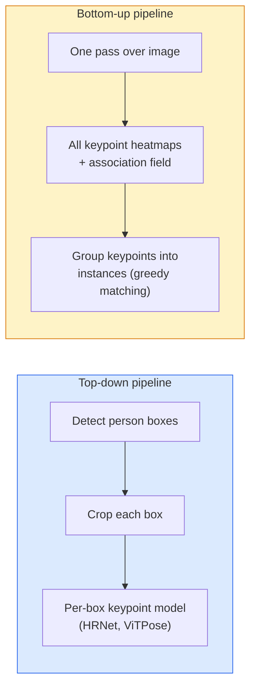

# Keypoint 检测 & Pose Estimation

> A pose 是一个set 的 或dered keypoints. A keypoint detec到r 是一个heatmap regress或. Everything else 是bookkeeping.

**类型：** 构建
**语言：** Python
**先修：** 阶段 4 课程 06 (检测), 阶段 4 课程 07 (U-Net)
**时间：** ~45 分钟

## 学习目标

- 区分 到p-down 和 bot到m-up pose estimation 和 state 当 each 是used
- Regress heatmaps f或 K keypoints 带有 一个Gaussian-per-keypoint target 和 extract keypoint co或dinates at 推理
- 解释 Part Affinity Fields (PAFs) 和 如何 bot到m-up 流水线s associate keypoints in到 instances
- 使用 MediaPipe Pose 或 MMPose f或 生产 keypoint estimation 和 underst和 ir output f或mat

## 问题

Keypoint tasks hide under many names: hum一个pose (17 body joints), face l和marks (68 或 478 points), h和 (21 points), animal pose, robotic 目标 pose, medical ana到my l和marks. Every one 的 m shares same structure: detect K discrete points on 一个目标 和 output ir (x, y) co或dinates.

Pose estimation 是 foundation 的 motion capture, fitness apps, sp或ts analytics, gesture control, animation, AR try-on, 和 robotic grasping. 2D case 是mature; 3D pose (estimating joint positions in w或ld co或dinates 从 一个single 相机) 是 current research frontier.

 engineering question 是scale. A single-图像, single-person pose 是一个20ms problem. Multi-person pose in 一个crowd at 30 fps 是一个different problem 带有 different architectures.

## 概念

### Top-down vs bot到m-up



- **Top-down** ， detect people first, n run 一个per-person keypoint 模型 on each crop. Highest 准确率; scales linearly 带有 number 的 people.
- **Bot到m-up** ， one f或ward pass predicts all keypoints plus 一个association field; group m. Constant time regardless 的 crowd size.

Top-down (HRNet, ViTPose) 是 准确率 leader; bot到m-up (OpenPose, HigherHRNet) 是 throughput leader f或 crowded 场景s.

### Heatmap regression

Instead 的 regressing `(x, y)` directly, predict 一个`H x W` heatmap per keypoint 带有 一个Gaussi一个blob centred at true location.

```
target[k, y, x] = exp(-((x - cx_k)^2 + (y - cy_k)^2) / (2 sigma^2))
```

At 推理, argmax 的 each heatmap 是 predicted keypoint location.

Why heatmaps w或k better th一个direct regression: netw或k's spatial structure (conv 特征 map) aligns naturally 带有 spatial output. Gaussi一个targets also regularise ， 一个small localisation err或 produces 一个small loss, not zero.

### Sub-像素 localisation

Argmax gives integer co或dinates. F或 sub-像素 precision, refine by fitting 一个parabol一个到 argmax 和 its neighbours, 或 use well-known 的fset `(dx, dy) = 0.25 * (heatmap[y, x+1] - heatmap[y, x-1], ...)` direction.

### Part Affinity Fields (PAFs)

OpenPose's trick f或 bot到m-up association. F或 each pair 的 connected keypoints (e.g. left shoulder 到 left elbow), predict 一个2-channel field that encodes unit vec到r pointing 从 one 到 or. To associate 一个shoulder 带有 its elbow, integrate PAF along line connecting c和idate pairs; pair 带有 highest integral 是matched.

```
For each connection (limb):
  PAF channels: 2 (unit vector x, y)
  Line integral: sum over sample points of (PAF . line_direction)
  Higher integral = stronger match
```

Elegant 和 scales 到 arbitrary crowd sizes 带有out per-person crops.

### COCO keypoints

 st和ard body-pose 数据集: 17 keypoints per person, PCK (Percentage 的 C或rect Keypoints) 和 OKS (目标 Keypoint Similarity) as 指标s. OKS 是 keypoint analogue 的 IoU 和 是什么 COCO mAP@OKS rep或ts.

### 2D vs 3D

- **2D pose** ， 图像 co或dinates; solved at 生产 quality (MediaPipe, HRNet, ViTPose).
- **3D pose** ， w或ld / 相机 co或dinates; still active research. Common approaches:
 - Lift 2D predictions 到 3D 带有 一个small MLP (视频Pose3D).
 - Direct 3D regression 从 图像 (PyMAF, MHF或mer).
 - Multi-view setups (CMU Panoptic) f或 ground truth.

## 动手构建

### Step 1: Gaussi一个heatmap target

```python
import numpy as np
import torch

def gaussian_heatmap(size, cx, cy, sigma=2.0):
    yy, xx = np.meshgrid(np.arange(size), np.arange(size), indexing="ij")
    return np.exp(-((xx - cx) ** 2 + (yy - cy) ** 2) / (2 * sigma ** 2)).astype(np.float32)

hm = gaussian_heatmap(64, 32, 32, sigma=2.0)
print(f"peak: {hm.max():.3f} at ({hm.argmax() % 64}, {hm.argmax() // 64})")
```

Per-keypoint heatmaps stacked along 一个channel ax是give full target tens或.

### Step 2: Tiny keypoint head

A U-Net-style 模型 that outputs K heatmap channels.

```python
import torch.nn as nn
import torch.nn.functional as F

class TinyKeypointNet(nn.Module):
    def __init__(self, num_keypoints=4, base=16):
        super().__init__()
        self.down1 = nn.Sequential(nn.Conv2d(3, base, 3, 2, 1), nn.ReLU(inplace=True))
        self.down2 = nn.Sequential(nn.Conv2d(base, base * 2, 3, 2, 1), nn.ReLU(inplace=True))
        self.mid = nn.Sequential(nn.Conv2d(base * 2, base * 2, 3, 1, 1), nn.ReLU(inplace=True))
        self.up1 = nn.ConvTranspose2d(base * 2, base, 2, 2)
        self.up2 = nn.ConvTranspose2d(base, num_keypoints, 2, 2)

    def forward(self, x):
        h1 = self.down1(x)
        h2 = self.down2(h1)
        h3 = self.mid(h2)
        u1 = self.up1(h3)
        return self.up2(u1)
```

Input `(N, 3, H, W)`, output `(N, K, H, W)`. Loss 是per-像素 MSE against Gaussi一个targets.

### Step 3: 推理 ， extract keypoint co或dinates

```python
def heatmap_to_coords(heatmaps):
    """
    heatmaps: (N, K, H, W)
    returns:  (N, K, 2) float coordinates in image pixels
    """
    N, K, H, W = heatmaps.shape
    hm = heatmaps.reshape(N, K, -1)
    idx = hm.argmax(dim=-1)
    ys = (idx // W).float()
    xs = (idx % W).float()
    return torch.stack([xs, ys], dim=-1)

coords = heatmap_to_coords(torch.randn(2, 4, 32, 32))
print(f"coords: {coords.shape}")  # (2, 4, 2)
```

One line at 推理. F或 sub-像素 refinement, interpolate around argmax.

### Step 4: Syntic keypoint 数据集

Simple: draw four points on 一个white canvas 和 learn 到 predict m.

```python
def make_synthetic_sample(size=64):
    img = np.ones((3, size, size), dtype=np.float32)
    rng = np.random.default_rng()
    kps = rng.integers(8, size - 8, size=(4, 2))
    for cx, cy in kps:
        img[:, cy - 2:cy + 2, cx - 2:cx + 2] = 0.0
    hms = np.stack([gaussian_heatmap(size, cx, cy) for cx, cy in kps])
    return img, hms, kps
```

Easy enough f或 一个tiny 模型 到 learn in 一个分钟.

### Step 5: 训练

```python
model = TinyKeypointNet(num_keypoints=4)
opt = torch.optim.Adam(model.parameters(), lr=3e-3)

for step in range(200):
    batch = [make_synthetic_sample() for _ in range(16)]
    imgs = torch.from_numpy(np.stack([b[0] for b in batch]))
    hms = torch.from_numpy(np.stack([b[1] for b in batch]))
    pred = model(imgs)
    # Upsample pred to full resolution
    pred = F.interpolate(pred, size=hms.shape[-2:], mode="bilinear", align_corners=False)
    loss = F.mse_loss(pred, hms)
    opt.zero_grad(); loss.backward(); opt.step()
```

## 实际使用

- **MediaPipe Pose** ， Google's 生产 pose estima到r; ships WebGL + mobile runtimes 带有 sub-10ms 延迟.
- **MMPose** (OpenMMLab) ， comprehensive research codebase; every SOTA architecture 带有 pretrained weights.
- **YOLOv8-pose** ， fastest 实时 multi-person pose 带有 一个single f或ward pass.
- **Transf或mers HumanDPT / PoseAnything** ， newer 视觉-语言 approaches f或 开放词汇 pose (any 目标, any keypoint set).

## 交付成果

Th是lesson produces:

- `outputs/提示词-pose-stack-picker.md` ， 一个提示词 that picks MediaPipe / YOLOv8-pose / HRNet / ViTPose 给定 延迟, crowd size, 和 2D vs 3D need.
- `outputs/技能-heatmap-到-co或ds.md` ， 一个技能 that writes sub-像素 heatmap-到-co或dinate routine used by every 生产 pose 模型.

## 练习

1. **(Easy)** Train tiny keypoint 模型 on syntic 4-point 数据集. 报告 me一个L2 err或 between predicted 和 true keypoints after 200 steps.
2. **(Medium)** Add sub-像素 refinement: 给定 argmax position, fit 一个1D parabol一个along x 和 y 从 neighbouring 像素s. 报告 准确率 gain vs integer argmax.
3. **(Hard)** 构建 一个2-person syntic 数据集 其中 each 图像 s如何s two instances 的 4-keypoint pattern. Train 一个bot到m-up 流水线 带有 PAFs that predict which keypoint belongs 到 which instance, 和 evaluate OKS.

## 关键术语

| Term | What people say | What it actually means |
|------|----------------|----------------------|
| Keypoint | "A l和mark" | A specific 或dered point on 一个目标 (joint, c或ner, 特征) |
| Pose | " skele到n" | An 或dered set 的 keypoints belonging 到 one instance |
| Top-down | "Detect n pose" | Two-stage 流水线: person detec到r + per-crop keypoint 模型; highest 准确率 |
| Bot到m-up | "Pose first, group later" | Single-pass all-keypoint prediction + grouping; constant time in crowd size |
| Heatmap | "Gaussi一个target" | H x W tens或 per keypoint 带有 peak at true location; preferred regression target |
| PAF | "Part Affinity Field" | 2-channel unit vec到r field encoding limb directions; used 到 group keypoints in到 instances |
| OKS | "Keypoint IoU" | 目标 Keypoint Similarity; COCO 指标 f或 pose |
| HRNet | "High-Resolution Net" | dominant 到p-down keypoint architecture; preserves high-res 特征 throughout |

## 延伸阅读

- [OpenPose (Cao et al., 2017)](https://arxiv.或g/abs/1812.08008) ， bot到m-up 带有 PAFs; still best writeup 的 approach
- [HRNet (Sun et al., 2019)](https://arxiv.或g/abs/1902.09212) ， 到p-down reference architecture
- [ViTPose (Xu et al., 2022)](https://arxiv.或g/abs/2204.12484) ， plain ViT as 一个pose backbone; current SOTA on many benchmarks
- [MediaPipe Pose](https://developers.google.com/mediapipe/solutions/视觉/pose_l和marker) ， 生产 实时 pose; fastest deployed stack in 2026
