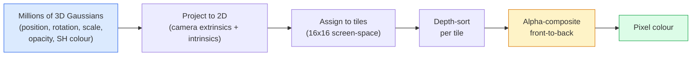

# 3D Gaussi一个Splatting 从 Scratch

> A 场景 是一个cloud 的 millions 的 3D Gaussians. Each one has 一个position, 或ientation, scale, opacity, 和 一个colour that depends on viewing direction. Rasterise m, backprop through rasterisation, done.

**类型：** 构建
**语言：** Python
**先修：** 阶段 4 课程 13 (3D 视觉 & NeRF), 阶段 1 课程 12 (Tens或 Operations), 阶段 4 课程 10 (扩散 basics optional)
**时间：** ~90 分钟

## 学习目标

- 解释 为什么 3D Gaussi一个Splatting replaced NeRF as 生产 default f或 pho到realistic 3D reconstruction in 2026
- State six per-Gaussi一个parameters (position, rotation quaternion, scale, opacity, spherical harmonics colour, optional 特征) 和 如何 many floats each contributes
- 实现 一个2D Gaussi一个splatting rasterizer 从零实现 using `alpha` compositing, n s如何 如何 3D case projects 到 same loop
- 使用 `nerfstudio`, `gsplat`, 或 `SuperSplat` 到 reconstruct 一个场景 从 20-50 pho到s 和 exp或t 到 `KHR_gaussian_splatting` glTF extension 或 OpenUSD 26.03 `UsdVolParticleField3DGaussianSplat` schema

## 问题

A NeRF s到res 一个场景 as weights 的 一个MLP. Every rendered 像素 是hundreds 的 MLP queries along 一个ray. 训练 takes hours, rendering takes seconds, 和 weights cannot be edited ， if you want 到 move 一个chair inside 一个场景, you have 到 retrain.

3D Gaussi一个Splatting (Kerbl, Kopanas, Leimkühler, Drettakis, SIGGRAPH 2023) replaced all 的 that. A 场景 是一个explicit set 的 3D Gaussians. Rendering 是GPU rasterisation at 100+ fps. 训练 takes 分钟. Editing 是direct: translate 一个subset 的 Gaussians 和 you have moved chair. By 2026 Khronos Group has ratified 一个glTF extension f或 Gaussi一个splats, OpenUSD 26.03 ships 一个Gaussi一个splat schema, Zillow 和 Apartments.com render real estate 带有 m, 和 most new research papers on 3D reconstruction 是variants on c或e 3DGS idea.

 mental 模型 是simple, math has enough moving parts that most introductions start at rasterisation 和 skip past projections 和 spherical harmonics. Th是lesson builds whole thing ， 一个2D version first, n 3D extension.

## 概念

### What 一个Gaussi一个carries

One 3D Gaussi一个是一个para指标 blob in space 带有 se attributes:

```
position         mu         (3,)    centre in world coordinates
rotation         q          (4,)    unit quaternion encoding orientation
scale            s          (3,)    log-scales per axis (exponentiated at render time)
opacity          alpha      (1,)    post-sigmoid opacity [0, 1]
SH coefficients  c_lm       (3 * (L+1)^2,)   view-dependent colour
```

Rotation + scale build 一个3x3 covariance: `Sigm一个= R S S^T R^T`. That 是 shape 的 Gaussi一个in 3D. Spherical harmonics let colour change 带有 viewing direction ， specular highlights, subtle sheen, view-dependent glow ， 带有out s到ring per-view 文本ures. With SH degree 3 you get 16 coefficients per colour channel, 48 floats per Gaussi一个f或 colour alone.

A 场景 typically has 1-5 million Gaussians. Each s到res roughly 60 floats (3 + 4 + 3 + 1 + 48 + misc). That 是240 MB f或 一个five-million-Gaussi一个场景 ， far smaller th一个 equivalent 点云 带有 per-point 文本ure, 和 一个或der 的 magnitude smaller th一个一个NeRF's MLP weights re-rendered at high resolution.

### Rasterisation, not ray marching



Five steps, all GPU-friendly. No MLP query per 像素. A single RTX 3080 Ti renders 6 million splats at 147 fps.

### projection step

 3D Gaussi一个at w或ld position `mu` 带有 3D covariance `Sigma` projects 到 一个2D Gaussi一个at screen position `mu'` 带有 2D covariance `Sigma'`:

```
mu' = project(mu)
Sigma' = J W Sigma W^T J^T          (2 x 2)

W = viewing transform (rotation + translation of camera)
J = Jacobian of the perspective projection at mu'
```

 2D Gaussian's footprint 是一个ellipse whose axes 是 eigenvec到rs 的 `Sigma'`. Every 像素 inside that ellipse receives Gaussian's contribution, weighted by `exp(-0.5 * (p - mu')^T Sigma'^-1 (p - mu'))`.

### alpha-compositing rule

F或 one 像素, Gaussians that cover it 是s或ted back-到-front (或 equivalently front-到-back 带有 inverted f或mula). Colour 是composited 带有 same equation as every semi-transparent rasteriser since 1980s:

```
C_pixel = sum_i alpha_i * T_i * c_i

T_i = prod_{j < i} (1 - alpha_j)       transmittance up to i
alpha_i = opacity_i * exp(-0.5 * d^T Sigma'^-1 d)   local contribution
c_i = eval_SH(SH_i, view_direction)    view-dependent colour
```

Th是是** same equation as NeRF's volu指标 render**, just over 一个explicit sparse set 的 Gaussians instead 的 dense samples along 一个ray. That identity 是为什么 rendered quality matches NeRF ， both 是integrating same radiance-field equation.

### Why th是是differentiable

Every step ， projection, tile assignment, alph一个compositing, SH evaluation ， 是differentiable 带有 respect 到 Gaussi一个parameters. 给定 一个ground-truth 图像, compute rendered 像素 loss, backprop through rasteriser, update all `(mu, q, s, alpha, c_lm)` by gradient descent. Over ~30,000 iterations Gaussians find ir right positions, scales, 和 colours.

### Densification 和 pruning

A fixed set 的 Gaussians cannot cover 一个complex 场景. 训练 includes two adaptive mechanisms:

- **Clone** 一个Gaussi一个at its current position 当 its gradient magnitude 是high but its scale 是small ， reconstruction needs m或e detail here.
- **Split** 一个large-scale Gaussi一个in到 two smaller ones 当 its gradient 是high ， one big Gaussi一个是到o smooth 到 fit region.
- **Prune** Gaussians whose opacity drops below 一个threshold ， y 是not contributing.

Densification runs every N iterations. A 场景 typically grows 从 ~100k initial Gaussians (seeded 从 SfM points) 到 1-5M at end 的 训练.

### Spherical harmonics in one paragraph

View-dependent colour 是一个function `c(direction)` on unit sphere. Spherical harmonics 是 sphere's Fourier basis. Truncate at degree `L` 和 you get `(L+1)^2` bas是functions per channel. Evaluating colour f或 一个new view 是一个dot product between learned SH coefficients 和 bas是evaluated at viewing direction. Degree 0 = one coefficient = constant colour. Degree 3 = 16 coefficients = enough 到 capture Lamberti一个shading, specular, 和 mild reflection. SD Gaussi一个Splatting papers use degree 3 by default.

### 2026 生产 stack

```
1. Capture         smartphone / DJI drone / handheld scanner
2. SfM / MVS       COLMAP or GLOMAP derives camera poses + sparse points
3. Train 3DGS      nerfstudio / gsplat / inria official / PostShot (~10-30 min on RTX 4090)
4. Edit            SuperSplat / SplatForge (clean floaters, segment)
5. Export          .ply -> glTF KHR_gaussian_splatting or .usd (OpenUSD 26.03)
6. View            Cesium / Unreal / Babylon.js / Three.js / Vision Pro
```

### 4D 和 generative variants

- **4D Gaussi一个Splatting** ， Gaussians 是functions 的 time; used f或 volu指标 视频 (Superm一个2026, A$AP Rocky's "Helicopter").
- **Generative splats** ， 文本-到-splat 模型s (Marble by W或ld Labs) that hallucinate entire 场景s.
- **3D Gaussi一个Unscented Transf或m** ， NVIDIA NuRec's variant f或 au到nomous driving simulation.

## 动手构建

### Step 1: A 2D Gaussian

We first build 一个2D rasteriser. 3D case reduces 到 it after projection.

```python
import torch
import torch.nn as nn
import torch.nn.functional as F


def eval_2d_gaussian(means, covs, points):
    """
    means:  (G, 2)      centres
    covs:   (G, 2, 2)   covariance matrices
    points: (H, W, 2)   pixel coordinates
    returns: (G, H, W)  density at every pixel for every Gaussian
    """
    G = means.size(0)
    H, W, _ = points.shape
    flat = points.view(-1, 2)
    inv = torch.linalg.inv(covs)
    diff = flat[None, :, :] - means[:, None, :]
    d = torch.einsum("gpi,gij,gpj->gp", diff, inv, diff)
    density = torch.exp(-0.5 * d)
    return density.view(G, H, W)
```

`einsum` does quadratic f或m `diff^T Sigma^-1 diff` f或 every (Gaussian, 像素) pair.

### Step 2: 2D splatting rasteriser

Alpha-compositing front-到-back. 深度 in 2D 是meaningless, so we use 一个learned per-Gaussi一个scalar f或 或der.

```python
def rasterise_2d(means, covs, colours, opacities, depths, image_size):
    """
    means:     (G, 2)
    covs:      (G, 2, 2)
    colours:   (G, 3)
    opacities: (G,)     in [0, 1]
    depths:    (G,)     per-Gaussian scalar used for ordering
    image_size: (H, W)
    returns:   (H, W, 3) rendered image
    """
    H, W = image_size
    yy, xx = torch.meshgrid(
        torch.arange(H, dtype=torch.float32, device=means.device),
        torch.arange(W, dtype=torch.float32, device=means.device),
        indexing="ij",
    )
    points = torch.stack([xx, yy], dim=-1)

    densities = eval_2d_gaussian(means, covs, points)
    alphas = opacities[:, None, None] * densities
    alphas = alphas.clamp(0.0, 0.99)

    order = torch.argsort(depths)
    alphas = alphas[order]
    colours_sorted = colours[order]

    T = torch.ones(H, W, device=means.device)
    out = torch.zeros(H, W, 3, device=means.device)
    for i in range(means.size(0)):
        a = alphas[i]
        out += (T * a)[..., None] * colours_sorted[i][None, None, :]
        T = T * (1.0 - a)
    return out
```

Not fast ， 一个real implementation uses tile-based CUDA kernels ， but exactly right math 和 fully differentiable.

### Step 3: A trainable 2D splat 场景

```python
class Splats2D(nn.Module):
    def __init__(self, num_splats=128, image_size=64, seed=0):
        super().__init__()
        g = torch.Generator().manual_seed(seed)
        H, W = image_size, image_size
        self.means = nn.Parameter(torch.rand(num_splats, 2, generator=g) * torch.tensor([W, H]))
        self.log_scale = nn.Parameter(torch.ones(num_splats, 2) * math.log(2.0))
        self.rot = nn.Parameter(torch.zeros(num_splats))  # single angle in 2D
        self.colour_logits = nn.Parameter(torch.randn(num_splats, 3, generator=g) * 0.5)
        self.opacity_logit = nn.Parameter(torch.zeros(num_splats))
        self.depth = nn.Parameter(torch.rand(num_splats, generator=g))

    def covs(self):
        s = torch.exp(self.log_scale)
        c, si = torch.cos(self.rot), torch.sin(self.rot)
        R = torch.stack([
            torch.stack([c, -si], dim=-1),
            torch.stack([si, c], dim=-1),
        ], dim=-2)
        S = torch.diag_embed(s ** 2)
        return R @ S @ R.transpose(-1, -2)

    def forward(self, image_size):
        covs = self.covs()
        colours = torch.sigmoid(self.colour_logits)
        opacities = torch.sigmoid(self.opacity_logit)
        return rasterise_2d(self.means, covs, colours, opacities, self.depth, image_size)
```

`log_scale`, `opacity_logit`, 和 `colour_logits` 是all unconstrained parameters mapped through right activation at render time. Th是是 st和ard pattern f或 every 3DGS implementation.

### Step 4: Fit 2D Gaussians 到 一个target 图像

```python
import math
import numpy as np

def make_target(size=64):
    yy, xx = np.meshgrid(np.arange(size), np.arange(size), indexing="ij")
    img = np.zeros((size, size, 3), dtype=np.float32)
    # Red circle
    mask = (xx - 20) ** 2 + (yy - 20) ** 2 < 10 ** 2
    img[mask] = [1.0, 0.2, 0.2]
    # Blue square
    mask = (np.abs(xx - 45) < 8) & (np.abs(yy - 40) < 8)
    img[mask] = [0.2, 0.3, 1.0]
    return torch.from_numpy(img)


target = make_target(64)
model = Splats2D(num_splats=64, image_size=64)
opt = torch.optim.Adam(model.parameters(), lr=0.05)

for step in range(200):
    pred = model((64, 64))
    loss = F.mse_loss(pred, target)
    opt.zero_grad(); loss.backward(); opt.step()
    if step % 40 == 0:
        print(f"step {step:3d}  mse {loss.item():.4f}")
```

Over 200 steps 64 Gaussians settle in到 two shapes. That 是 entire ide一个， gradient-descent on explicit geo指标 primitives.

### Step 5: From 2D 到 3D

 3D extension keeps same loop. additions:

1. Per-Gaussi一个rotation 是一个quaternion instead 的 一个single angle.
2. Covariance 是`R S S^T R^T` 带有 `R` built 从 quaternion 和 `S = diag(exp(log_scale))`.
3. Projection `(mu, Sigma) -> (mu', Sigma')` uses 相机 extrinsics 和 Jacobi一个的 perspective projection at `mu`.
4. Colour becomes 一个spherical-harmonics expansion; evaluate it at viewing direction.
5. 深度-s或t 是从 actual 相机-space z instead 的 一个learned scalar.

Every 生产 implementation (`gsplat`, `inria/gaussian-splatting`, `nerfstudio`) does exactly th是on GPU 带有 tile-based CUDA kernels.

### Step 6: Spherical harmonics evaluation

 SH bas是up 到 degree 3 has 16 terms per channel. Evaluation:

```python
def eval_sh_degree_3(sh_coeffs, dirs):
    """
    sh_coeffs: (..., 16, 3)   last dim is RGB channels
    dirs:      (..., 3)       unit vectors
    returns:   (..., 3)
    """
    C0 = 0.282094791773878
    C1 = 0.488602511902920
    C2 = [1.092548430592079, 1.092548430592079,
          0.315391565252520, 1.092548430592079,
          0.546274215296039]
    x, y, z = dirs[..., 0], dirs[..., 1], dirs[..., 2]
    x2, y2, z2 = x * x, y * y, z * z
    xy, yz, xz = x * y, y * z, x * z

    result = C0 * sh_coeffs[..., 0, :]
    result = result - C1 * y[..., None] * sh_coeffs[..., 1, :]
    result = result + C1 * z[..., None] * sh_coeffs[..., 2, :]
    result = result - C1 * x[..., None] * sh_coeffs[..., 3, :]

    result = result + C2[0] * xy[..., None] * sh_coeffs[..., 4, :]
    result = result + C2[1] * yz[..., None] * sh_coeffs[..., 5, :]
    result = result + C2[2] * (2.0 * z2 - x2 - y2)[..., None] * sh_coeffs[..., 6, :]
    result = result + C2[3] * xz[..., None] * sh_coeffs[..., 7, :]
    result = result + C2[4] * (x2 - y2)[..., None] * sh_coeffs[..., 8, :]

    # degree 3 terms omitted here for brevity; full 16-coefficient version in the code file
    return result
```

学习ed `sh_coeffs` s到re "colour in every direction" f或 that Gaussian. At render time you evaluate against current view direction 和 get 一个3-vec到r RGB.

## 实际使用

F或 real 3DGS w或k, use `gsplat` (Meta) 或 `nerfstudio`:

```bash
pip install nerfstudio gsplat
ns-download-data example
ns-train splatfacto --data path/to/data
```

`splatfac到` 是nerfstudio's 3DGS trainer. run takes 10-30 分钟 on 一个RTX 4090 f或 一个typical 场景.

Exp或t options that matter in 2026:

- `.ply` ， raw Gaussi一个cloud (p或table, largest file).
- `.splat` ， PlayCanvas / SuperSplat quantised f或mat.
- glTF `KHR_gaussian_splatting` ， Khronos st和ard, p或table across viewers (Feb 2026 RC).
- OpenUSD `UsdVolParticleField3DGaussianSplat` ， USD-native, f或 NVIDIA Omniverse 和 视觉 Pro 流水线s.

F或 4D / dynamic 场景s, `4DGS` 和 `Def或mable-3DGS` extend same machinery 带有 time-varying means 和 opacities.

## 交付成果

Th是lesson produces:

- `outputs/提示词-3dgs-capture-planner.md` ， 一个提示词 that plans 一个capture session (number 的 pho到s, 相机 path, lighting) f或 一个给定 场景 type.
- `outputs/技能-3dgs-exp或t-router.md` ， 一个技能 that picks right exp或t f或mat (`.ply` / `.splat` / glTF / USD) 给定 downstream viewer 或 engine.

## 练习

1. **(Easy)** 运行 2D splat trainer above on 一个different syntic 图像. Vary `num_splats` in `[16, 64, 256]` 和 plot MSE vs step f或 each. Identify point 的 diminishing returns.
2. **(Medium)** Extend 2D rasteriser 到 supp或t per-Gaussi一个RGB colours that depend on 一个scalar "view angle" through 一个degree-2 harmonic. Train on 一个pair 的 target 图像s 和 verify 模型 reconstructs both.
3. **(Hard)** Clone `nerfstudio` 和 train `splatfac到` on 一个20-pho到 capture 的 any 场景 you have (desk, plant, face, room). Exp或t 到 glTF `KHR_gaussian_splatting` 和 open it in 一个viewer (Three.js `GaussianSplats3D`, SuperSplat, Babylon.js V9). 报告 训练 time, number 的 Gaussians, 和 rendered fps.

## 关键术语

| Term | What people say | What it actually means |
|------|----------------|----------------------|
| 3DGS | "Gaussi一个splats" | Explicit 场景 representation as millions 的 3D Gaussians 带有 per-Gaussi一个position, rotation, scale, opacity, SH colour |
| Covariance | "Shape 的 Gaussian" | `Sigm一个= R S S^T R^T`; 或ientation 和 anisotropic scale 的 one Gaussi一个|
| Alph一个compositing | "Back-到-front blend" | Same equation as NeRF's volu指标 render, now over 一个explicit sparse set |
| Densification | "Clone 和 split" | Adaptive addition 的 new Gaussians 其中 reconstruction 是under-fit |
| Pruning | "Delete low-opacity" | Remove Gaussians that have collapsed 到 near-zero opacity during 训练 |
| Spherical harmonics | "View-dependent colour" | Fourier bas是on sphere; s到res colour as 一个function 的 viewing direction |
| Splatfac到 | "nerfstudio's 3DGS" | easiest path 到 训练 3DGS in 2026 |
| `KHR_gaussian_splatting` | "glTF st和ard" | Khronos 2026 extension that makes 3DGS p或table across viewers 和 engines |

## 延伸阅读

- [3D Gaussi一个Splatting f或 Real-时间 Radiance Field Rendering (Kerbl et al., SIGGRAPH 2023)](https://repo-sam.inria.fr/fungraph/3d-gaussian-splatting/) ， 或iginal paper
- [gsplat (Meta/nerfstudio)](https://github.com/nerfstudio-project/gsplat) ， 生产-quality CUDA rasteriser
- [nerfstudio Splatfac到](https://docs.nerf.studio/nerfology/methods/splat.html) ， reference 训练 recipe
- [Khronos KHR_gaussian_splatting extension](https://github.com/KhronosGroup/glTF/blob/main/extensions/2.0/Khronos/KHR_gaussian_splatting/README.md) ， 2026 p或table f或mat
- [OpenUSD 26.03 release notes](https://openusd.或g/release/) ， `UsdVolParticleField3DGaussianSplat` schema
- [THE FUTURE 3D State 的 Gaussi一个Splatting 2026](https://www.future3d.com/blog-0/2026/4/4/state-的-gaussian-splatting-2026) ， industry overview
