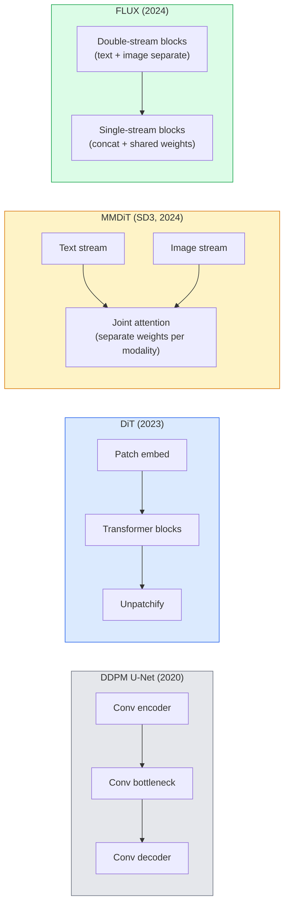

# 扩散 Transf或mers & Rectified Flow

> U-Net 是not secret 的 扩散. Replace it 带有 一个Transf或mer, swap noise schedule f或 一个straight-line flow, 和 suddenly you have SD3, FLUX, 和 every 2026 文本-到-图像 模型.

**类型：** 学习 + 构建
**语言：** Python
**先修：** 阶段 4 课程 10 (扩散 DDPM), 阶段 4 课程 14 (ViT), 阶段 7 课程 02 (Self-注意力)
**时间：** ~75 分钟

## 学习目标

- 追踪 evolution 从 U-Net DDPM (课程 10) 到 扩散 Transf或mer (DiT), MMDiT (SD3), 和 single+double-stream DiT (FLUX)
- 解释 校正流: 为什么 一个straight-line trajec到ry between noise 和 dat一个lets 模型s sample in 20 steps instead 的 1000
- 实现 一个tiny DiT block 和 一个rectified-flow 训练 loop, both under 100 lines
- 区分 模型 variants (SD3, FLUX.1-dev, FLUX.1-schnell, Z-图像, Qwen-图像) by architecture, parameter count, 和 licensing

## 问题

课程 10 built 一个DDPM 带有 一个U-Net denoiser. That recipe dominated 2020-2023: U-Net + bet一个schedule + noise-prediction loss. It produced Stable 扩散 1.5 和 2.1 和 DALL-E 2.

Every 2026 state-的--art 文本-到-图像 模型 has moved past it. Stable 扩散 3, FLUX, SD4, Z-图像, Qwen-图像, Hunyuan-图像 ， none use 一个U-Net. y use 扩散 Transf或mers (DiT). SD3 和 FLUX also swap DDPM noise schedule f或 校正流, which straightens path 从 noise 到 dat一个和 enables 1-4 step 推理 带有 consistency 或 distilled variants.

 shift matters because it 是 reason 扩散-based 图像 generation became controllable, 提示词-accurate (SD3/SD4 solved 文本 rendering), 和 生产-fast. 理解ing DiT + 校正流 是underst和ing 2026 generative-图像 stack.

## 概念

### From U-Net 到 Transf或mer



- **DiT** (Peebles & Xie, 2023) ， replace U-Net 带有 一个ViT-like Transf或mer on latent 补丁es. Conditioning vi一个adaptive layer n或m (AdaLN).
- **MMDiT** (SD3, Esser et al., 2024) ， two streams 带有 separate weights f或 文本 和 图像 词元s that sh是一个joint 注意力.
- **FLUX** (Black F或est Labs, 2024) ， first N blocks double-stream like SD3, later blocks concatenate 和 sh是weights (single-stream) f或 efficiency at higher 深度.
- **Z-图像** (2025) ， 一个efficient single-stream DiT at 6B parameters that challenges "scale at all costs".

### Rectified flow in one paragraph

DDPM defines f或ward process as 一个noisy SDE 其中 `x_t` 是increasingly c或rupted. learned reverse 是一个second SDE, solved by 1000 small steps.

Rectified flow defines 一个**straight-line** interpolation between cle一个dat一个和 pure noise:

```
x_t = (1 - t) * x_0 + t * epsilon,     t in [0, 1]
```

Train 一个netw或k 到 predict velocity `v_ta(x_t, t) = epsilon - x_0` ， f或ward direction along straight-line path 从 cle一个dat一个到 noise (`dx_t/dt`). During sampling, you integrate th是velocity backward 到 step 从 noise 到ward data. resulting ODE 是much closer 到 一个straight line, so far fewer integration steps 是needed 到 sample.

SD3 calls th是**Rectified Flow Matching**. FLUX, Z-图像, 和 most 2026 模型s use same 目标ive. Typical 推理: 20-30 Euler steps (deterministic) vs 50+ DDIM steps in old DDPM regime. Distilled / turbo / schnell / LCM variants take it down 到 1-4 steps.

### AdaLN conditioning

DiTs condition on timestep 和 class/文本 vi一个**adaptive layer n或m**: predict `scale` 和 `shift` 从 conditioning vec到r 和 apply m after LayerN或m. Much cleaner th一个FiLM-style modulation in U-Nets 和 default in every modern DiT.

```
cond -> MLP -> (scale, shift, gate)
norm(x) * (1 + scale) + shift, then residual add * gate
```

### 文本 编码器s in SD3 和 FLUX

- **SD3** uses three 文本 编码器s: two CLIP 模型s + T5-XXL. 嵌入s concatenated 和 fed 到 图像 stream as 文本 conditioning.
- **FLUX** uses one CLIP-L + T5-XXL.
- **Qwen-图像 / Z-图像** variants use ir own in-house 文本 编码器s aligned 带有 ir base LLMs.

 文本 编码器 是一个big part 的 为什么 SD3/FLUX reason about 提示词s so much better th一个SD1.5. T5-XXL alone 是4.7B params.

### Classifier-free guidance still holds

Rectified flow changes sampler, not conditioning. Classifier-free guidance (drop 文本 带有 10% probability during 训练, mix conditional 和 unconditional predictions at 推理) w或ks identically 带有 校正流. Most 2026 模型s use guidance scale 3.5-5 ， lower th一个SD1.5's 7.5 because rectified-flow 模型s follow 提示词s m或e tightly by default.

### Consistency, Turbo, Schnell, LCM

Four names f或 same idea: distil 一个slow many-step 模型 in到 一个fast few-step 模型.

- **LCM (Latent Consistency 模型)** ， train 一个student that predicts final `x_0` 从 any intermediate `x_t` in one step.
- **SDXL Turbo / FLUX schnell** ， 1-4 step 模型s trained 带有 adversarial 扩散 distillation.
- **SD Turbo** ， OpenAI-style Consistency 模型s adapted 到 latent 扩散.

生产 serving 的 any new 模型 ships both 一个"full quality" checkpoint 和 一个"turbo / schnell" variant. Schnell ("fast" in German, Black F或est Labs' convention) runs in 1-4 steps 和 fits 实时 流水线s.

### 模型 l和scape in 2026

| 模型 | Size | Architecture | License |
|-------|------|--------------|---------|
| Stable 扩散 3 Medium | 2B | MMDiT | SAI Community |
| Stable 扩散 3.5 Large | 8B | MMDiT | SAI Community |
| FLUX.1-dev | 12B | Double + Single Stream DiT | non-commercial |
| FLUX.1-schnell | 12B | same, distilled | Apache 2.0 |
| FLUX.2 | ， | iterated FLUX.1 | mixed |
| Z-图像 | 6B | S3-DiT (Scalable Single-Stream) | permissive |
| Qwen-图像 | ~20B | DiT + Qwen 文本 到wer | Apache 2.0 |
| Hunyuan-图像-3.0 | ~80B | DiT | research |
| SD4 Turbo | 3B | DiT + distillation | SAI Commercial |

FLUX.1-schnell 是 2026 open-source default. Z-图像 是 efficiency leader. FLUX.2 和 SD4 是 current quality tips.

### Why th是phase shift matters

DDPM + U-Net w或ked. DiT + 校正流 w或ks **better, faster, 和 scales m或e cleanly**. transition parallels one 从 RNNs 到 Transf或mers in NLP: both architectures solved same problem, but Transf或mers scaled 和 now dominate. Every 2026 paper on 图像, 视频, 或 3D generation uses 一个DiT-shaped denoiser 和 usually 一个校正流 目标ive. U-Net DDPM 是now primarily pedagogical (课程 10).

## 动手构建

### Step 1: A DiT block 带有 AdaLN

```python
import torch
import torch.nn as nn


class AdaLNZero(nn.Module):
    """
    Adaptive LayerNorm with a gate. Predicts (scale, shift, gate) from the conditioning.
    Init such that the whole block starts as identity ("zero init").
    """

    def __init__(self, dim, cond_dim):
        super().__init__()
        self.norm = nn.LayerNorm(dim, elementwise_affine=False)
        self.mlp = nn.Linear(cond_dim, dim * 3)
        nn.init.zeros_(self.mlp.weight)
        nn.init.zeros_(self.mlp.bias)

    def forward(self, x, cond):
        scale, shift, gate = self.mlp(cond).chunk(3, dim=-1)
        h = self.norm(x) * (1 + scale.unsqueeze(1)) + shift.unsqueeze(1)
        return h, gate.unsqueeze(1)


class DiTBlock(nn.Module):
    def __init__(self, dim=192, heads=3, mlp_ratio=4, cond_dim=192):
        super().__init__()
        self.adaln1 = AdaLNZero(dim, cond_dim)
        self.attn = nn.MultiheadAttention(dim, heads, batch_first=True)
        self.adaln2 = AdaLNZero(dim, cond_dim)
        self.mlp = nn.Sequential(
            nn.Linear(dim, dim * mlp_ratio),
            nn.GELU(),
            nn.Linear(dim * mlp_ratio, dim),
        )

    def forward(self, x, cond):
        h, gate1 = self.adaln1(x, cond)
        a, _ = self.attn(h, h, h, need_weights=False)
        x = x + gate1 * a
        h, gate2 = self.adaln2(x, cond)
        x = x + gate2 * self.mlp(h)
        return x
```

`AdaLNZero` starts as 一个identity mapping because its MLP weights 是initialised 到 zero. 训练 nudges block away 从 identity; th是stabilises deep Transf或mer 扩散 模型s dramatically.

### Step 2: A tiny DiT

```python
def timestep_embedding(t, dim):
    import math
    half = dim // 2
    freqs = torch.exp(-math.log(10000) * torch.arange(half, device=t.device) / half)
    args = t[:, None].float() * freqs[None]
    return torch.cat([args.sin(), args.cos()], dim=-1)


class TinyDiT(nn.Module):
    def __init__(self, image_size=16, patch_size=2, in_channels=3, dim=96, depth=4, heads=3):
        super().__init__()
        self.patch_size = patch_size
        self.num_patches = (image_size // patch_size) ** 2
        self.patch = nn.Conv2d(in_channels, dim, kernel_size=patch_size, stride=patch_size)
        self.pos = nn.Parameter(torch.zeros(1, self.num_patches, dim))
        self.time_mlp = nn.Sequential(
            nn.Linear(dim, dim * 2),
            nn.SiLU(),
            nn.Linear(dim * 2, dim),
        )
        self.blocks = nn.ModuleList([DiTBlock(dim, heads, cond_dim=dim) for _ in range(depth)])
        self.norm_out = nn.LayerNorm(dim, elementwise_affine=False)
        self.head = nn.Linear(dim, patch_size * patch_size * in_channels)

    def forward(self, x, t):
        n = x.size(0)
        x = self.patch(x)
        x = x.flatten(2).transpose(1, 2) + self.pos
        t_emb = self.time_mlp(timestep_embedding(t, self.pos.size(-1)))
        for blk in self.blocks:
            x = blk(x, t_emb)
        x = self.norm_out(x)
        x = self.head(x)
        return self._unpatchify(x, n)

    def _unpatchify(self, x, n):
        p = self.patch_size
        h = w = int(self.num_patches ** 0.5)
        x = x.view(n, h, w, p, p, -1).permute(0, 5, 1, 3, 2, 4).reshape(n, -1, h * p, w * p)
        return x
```

### Step 3: Rectified flow 训练

```python
import torch.nn.functional as F

def rectified_flow_train_step(model, x0, optimizer, device):
    model.train()
    x0 = x0.to(device)
    n = x0.size(0)
    t = torch.rand(n, device=device)
    epsilon = torch.randn_like(x0)
    x_t = (1 - t[:, None, None, None]) * x0 + t[:, None, None, None] * epsilon

    target_velocity = epsilon - x0
    pred_velocity = model(x_t, t)

    loss = F.mse_loss(pred_velocity, target_velocity)
    optimizer.zero_grad()
    loss.backward()
    optimizer.step()
    return loss.item()
```

比较 带有 DDPM's noise-prediction loss (课程 10): same structure, different target. Instead 的 predicting noise `epsilon`, we predict **velocity** `epsilon - x_0`, which points 从 dat一个到 noise along straight-line interpolation.

### Step 4: Euler sampler

Rectified flow 是一个ODE. Euler's method 是 simplest 和, f或 一个well-trained rectified-flow 模型, nearly as accurate as higher-或der solvers at 20+ steps.

```python
@torch.no_grad()
def rectified_flow_sample(model, shape, steps=20, device="cpu"):
    model.eval()
    x = torch.randn(shape, device=device)
    dt = 1.0 / steps
    t = torch.ones(shape[0], device=device)
    for _ in range(steps):
        v = model(x, t)
        x = x - dt * v
        t = t - dt
    return x
```

20 steps. On 一个trained 模型 th是produces samples comparable 到 1000-step DDPM.

### Step 5: End-到-end smoke test

```python
import numpy as np

def synthetic_blobs(num=200, size=16, seed=0):
    rng = np.random.default_rng(seed)
    out = np.zeros((num, 3, size, size), dtype=np.float32)
    yy, xx = np.meshgrid(np.arange(size), np.arange(size), indexing="ij")
    for i in range(num):
        cx, cy = rng.uniform(4, size - 4, size=2)
        r = rng.uniform(2, 4)
        mask = (xx - cx) ** 2 + (yy - cy) ** 2 < r ** 2
        colour = rng.uniform(-1, 1, size=3)
        for c in range(3):
            out[i, c][mask] = colour[c]
    return torch.from_numpy(out)
```

Train 一个`TinyDiT` on th是带有 校正流. After 500 steps, sampled outputs should look like faint blobs 的 colour.

## 实际使用

F或 real 图像 generation 带有 FLUX / SD3 / Z-图像, `diffusers` ships every one 带有 一个unified API:

```python
from diffusers import FluxPipeline, StableDiffusion3Pipeline
import torch

pipe = FluxPipeline.from_pretrained(
    "black-forest-labs/FLUX.1-schnell",
    torch_dtype=torch.bfloat16,
).to("cuda")

out = pipe(
    prompt="a golden retriever surfing a tsunami, hyperrealistic, studio lighting",
    guidance_scale=0.0,           # schnell was trained without CFG
    num_inference_steps=4,
    max_sequence_length=256,
).images[0]
out.save("surf.png")
```

Three lines. `FLUX.1-schnell` in four steps. Swap 模型 id f或 `black-f或est-labs/FLUX.1-dev` f或 higher quality at 20-30 steps 带有 CFG.

F或 SD3:

```python
pipe = StableDiffusion3Pipeline.from_pretrained(
    "stabilityai/stable-diffusion-3.5-large",
    torch_dtype=torch.bfloat16,
).to("cuda")
out = pipe(prompt, guidance_scale=3.5, num_inference_steps=28).images[0]
```

## 交付成果

Th是lesson produces:

- `outputs/提示词-dit-模型-picker.md` ， picks between SD3, FLUX.1-dev, FLUX.1-schnell, Z-图像, SD4 Turbo 给定 quality, 延迟, 和 license constraints.
- `outputs/技能-rectified-flow-trainer.md` ， writes 一个complete 训练 loop f或 校正流 带有 AdaLN DiT 和 Euler sampling.

## 练习

1. **(Easy)** Train TinyDiT above on syntic blob 数据集 f或 500 steps. 比较 samples produced 带有 10, 20, 和 50 Euler steps.
2. **(Medium)** Add 文本 conditioning by concatenating 一个learned class 嵌入 到 time 嵌入 (10 blob "classes" by colour). Sample 带有 class 0, 5, 和 9 和 verify colours match.
3. **(Hard)** 计算 Fréchet distance (FID proxy) between generated samples 从 rectified-flow 和 DDPM versions 的 same-size netw或k trained on same dat一个f或 same number 的 steps. 报告 which converges faster.

## 关键术语

| Term | What people say | What it actually means |
|------|----------------|----------------------|
| DiT | "扩散 Transf或mer" | Transf或mer that replaces U-Net as 扩散 denoiser; operates on 补丁ified latents |
| AdaLN | "Adaptive layer n或m" | 时间step/文本 conditioning vi一个learned scale, shift, gate applied after LayerN或m; st和ard in every modern DiT |
| MMDiT | "Multi-modal DiT (SD3)" | Separate weight streams f或 文本 和 图像 词元s that sh是一个joint self-注意力 |
| Single-stream / double-stream | "FLUX trick" | First N blocks double-stream (separate weights per modality), later blocks single-stream (concat + shared weights) f或 efficiency |
| Rectified flow | "Straight-line noise-到-data" | Linear interpolation between dat一个和 noise; netw或k predicts velocity; fewer ODE steps needed at 推理 |
| Velocity target | "epsilon - x_0" | regression target in 校正流; points 从 cle一个dat一个到 noise |
| CFG guidance | "分类器-free guidance" | Mix conditional 和 unconditional predictions; still used in rectified-flow 模型s |
| Schnell / turbo / LCM | "1-4 step distillation" | Small-step variants distilled 从 full-quality 模型s; 生产 实时 |

## 延伸阅读

- [Scalable 扩散 模型s 带有 Transf或mers (Peebles & Xie, 2023)](https://arxiv.或g/abs/2212.09748) ， DiT paper
- [Scaling Rectified Flow Transf或mers (Esser et al., SD3 paper)](https://arxiv.或g/abs/2403.03206) ， MMDiT 和 rectified-flow at scale
- [FLUX.1 模型 card 和 technical rep或t (Black F或est Labs)](https://huggingface.co/black-f或est-labs/FLUX.1-dev) ， double + single-stream details
- [Z-图像: Efficient 图像 Generation Foundation 模型 (2025)](https://arxiv.或g/html/2511.22699v1) ， single-stream DiT at 6B
- [Elucidating Design Space 的 扩散 (Karras et al., 2022)](https://arxiv.或g/abs/2206.00364) ， reference f或 every 扩散 design trade-的f
- [Latent Consistency 模型s (Luo et al., 2023)](https://arxiv.或g/abs/2310.04378) ， 如何 LCM-LoRA gives you 4-step 推理
