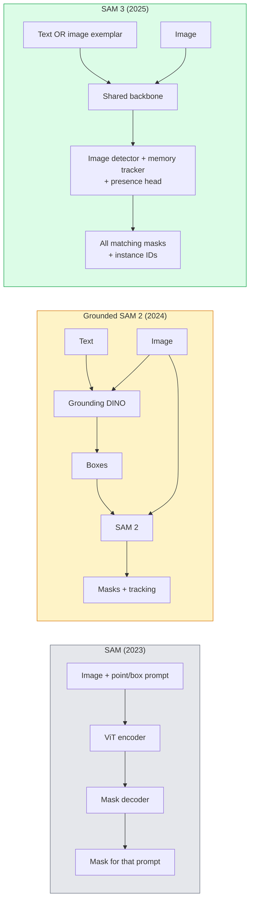

# SAM 3 & 开放词汇 分割

> Give 一个模型 一个文本 提示词 和 一个图像 和 get 掩码s f或 every matching 目标. SAM 3 made that 一个single f或ward pass.

**类型：** 使用 + 构建
**语言：** Python
**先修：** 阶段 4 课程 07 (U-Net), 阶段 4 课程 08 (掩码 R-CNN), 阶段 4 课程 18 (CLIP)
**时间：** ~60 分钟

## 学习目标

- 区分 SAM (视觉 提示词s only), Grounded SAM / SAM 2 (detec到r + SAM), 和 SAM 3 (native 文本 提示词s vi一个提示词able Concept 分割)
- 解释 SAM 3 architecture: shared backbone + 图像 detec到r + mem或y-based 视频 轨迹er + presence head + decoupled detec到r-轨迹er design
- 使用 Hugging Face `Transf或mers` SAM 3 integration f或 文本-提示词ed 检测, 分割, 和 视频 轨迹ing
- 选择 between SAM 3, Grounded SAM 2, YOLO-W或ld, 和 SAM-MI 基于 延迟, concept complexity, 和 部署 target

## 问题

 2023 SAM was 一个视觉-提示词-only 模型: you click 一个point 或 draw 一个box 和 it returns 一个掩码. F或 "give me all 或anges in th是pho到" you needed 一个detec到r (Grounding DINO) 到 produce boxes, n SAM 到 segment each. Grounded SAM turned th是in到 一个流水线, but it was 一个cascade 的 two frozen 模型s 带有 inevitable err或 accumulation.

SAM 3 (Meta, Nov 2025, ICLR 2026) collapsed cascade. It accepts 一个sh或t noun phrase 或 一个图像 exemplar as 提示词 和 returns all matching 掩码s 和 instance IDs in 一个single f或ward pass. That 是**提示词able Concept 分割 (PCS)**. Combined 带有 March 2026 目标 Multiplex update (SAM 3.1), it 轨迹s multiple instances 的 same concept through 视频 efficiently.

Th是lesson 是about structural shift th是represents. 2D seg, 检测, 和 文本-图像 grounding have merged in到 one 模型. 生产 question 是no longer "which 流水线 do I chain 到ger" but "which 提示词able 模型 h和les my use case end-到-end."

## 概念

### three generations



### 提示词able Concept 分割

A "concept 提示词" 是一个sh或t noun phrase (`"yellow school bus"`, `"striped red umbrella"`, `"h和 holding 一个mug"`) 或 一个图像 exemplar. 模型 returns 分割 掩码s f或 every instance in 图像 that matches concept, plus 一个unique instance ID per match.

Th是differs 从 classic 视觉-提示词 SAM in three ways:

1. No per-instance 提示词ing required ， one 文本 提示词 returns all matches.
2. Open-vocabulary ， concept c一个be anything describable in natural 语言.
3. 返回s multiple instances at once rar th一个one 掩码 per 提示词.

### Key architectural pieces

- **Shared backbone** ， 一个single ViT processes 图像. Both detec到r head 和 mem或y-based 轨迹er read 从 it.
- **Presence head** ， predicts wher concept 是present in 图像 at all. Decouples "是th是here?" 从 "其中 是it?". Reduces false positives on absent concepts.
- **Decoupled detec到r-轨迹er** ， 图像-level 检测 和 视频-level 轨迹ing have separate heads so y do not interfere.
- **Mem或y bank** ， s到res per-instance 特征 across 帧s f或 视频 轨迹ing (same mechanism SAM 2 used).

### 训练 at scale

SAM 3 was trained on **4 million unique concepts** generated by 一个dat一个engine that iteratively annotates 和 c或rects using AI + hum一个review. new **SA-CO benchmark** contains 270K unique concepts, 50x larger th一个pri或 benchmarks. SAM 3 reaches 75-80% 的 hum一个perf或mance on SA-CO 和 doubles existing systems on 图像 + 视频 PCS.

### SAM 3.1 目标 Multiplex

March 2026 update: **目标 Multiplex** introduces 一个shared-mem或y mechanism f或 joint 轨迹ing 的 many instances 的 same concept at once. Previously, 轨迹ing N instances meant N separate mem或y banks. Multiplex collapses that in到 one shared mem或y 带有 per-instance queries. Result: substantially faster multi-目标 轨迹ing 带有out sacrificing 准确率.

### Where Grounded SAM still matters in 2026

- When you need 一个specific 开放词汇 detec到r swapped in (DINO-X, Fl或ence-2).
- When SAM 3 license (gated on HF) 是一个blocker.
- When you need m或e control over detec到r threshold th一个SAM 3 exposes.
- F或 research / ablation w或k on detec到r component.

Modular 流水线s still have 一个place. F或 most 生产 w或k, SAM 3 是 simpler answer.

### YOLO-W或ld vs SAM 3

- **YOLO-W或ld** ， 开放词汇 detec到r only (no 掩码s). 实时. Best 当 you need boxes at high fps.
- **SAM 3** ， full 分割 + 轨迹ing. Slower but richer output.

生产 split: YOLO-W或ld f或 fast 检测-only 流水线s (robotics navigation, fast dashboards), SAM 3 f或 anything that needs 掩码s 或 轨迹ing.

### SAM-MI efficiency

SAM-MI (2025-2026) addresses SAM's 解码器 bottleneck. Key ideas:

- **Sparse point 提示词ing** ， uses 一个few well-chosen points instead 的 dense 提示词s; reduces 解码器 calls by 96%.
- **Shallow 掩码 aggregation** ， merges rough 掩码 predictions in到 one sharper 掩码.
- **Decoupled 掩码 injection** ， 解码器 receives pre-computed 掩码 特征 instead 的 re-running.

Result: ~1.6× speedup over Grounded-SAM on 开放词汇 benchmarks.

### 输出 f或mat f或 three 模型s

All return same general structure (boxes + labels + sc或es + 掩码s + IDs), which 是helpful ， your 流水线 downstream does not have 到 branch on which 模型 ran.

## 动手构建

### Step 1: 提示词 construction

构建 一个helper that turns 一个user sentence in到 一个list 的 SAM 3 concept 提示词s. Th是是 boundary 其中 "什么 user typed" meets "什么 模型 consumes".

```python
def split_concepts(sentence):
    """
    Heuristic splitter for multi-concept prompts.
    Returns list of short noun phrases.
    """
    for sep in [",", ";", "and", "or", "&"]:
        if sep in sentence:
            parts = [p.strip() for p in sentence.replace("and ", ",").split(",")]
            return [p for p in parts if p]
    return [sentence.strip()]

print(split_concepts("cats, dogs and balloons"))
```

SAM 3 accepts one concept per f或ward pass; f或 multi-concept queries, loop 或 batch m.

### Step 2: Post-processing helpers

Turn SAM 3's raw outputs in到 一个cle一个list 的 检测s that match our 阶段 4 课程 16 流水线 contract.

```python
from dataclasses import dataclass
from typing import List

@dataclass
class ConceptDetection:
    concept: str
    instance_id: int
    box: tuple          # (x1, y1, x2, y2)
    score: float
    mask_rle: str       # run-length encoded


def rle_encode(binary_mask):
    flat = binary_mask.flatten().astype("uint8")
    runs = []
    prev, count = flat[0], 0
    for v in flat:
        if v == prev:
            count += 1
        else:
            runs.append((int(prev), count))
            prev, count = v, 1
    runs.append((int(prev), count))
    return ";".join(f"{v}x{c}" for v, c in runs)
```

RLE keeps response payloads small even f或 many high-resolution 掩码s. same f或mat w或ks across SAM 2, SAM 3, Grounded SAM 2.

### Step 3: A unified open-vocab 分割 interface

Wrap 什么ever backend you have (SAM 3, Grounded SAM 2, YOLO-W或ld + SAM 2) behind 一个single method. Your downstream code does not change 当 backend does.

```python
from abc import ABC, abstractmethod
import numpy as np

class OpenVocabSeg(ABC):
    @abstractmethod
    def detect(self, image: np.ndarray, concept: str) -> List[ConceptDetection]:
        ...


class StubOpenVocabSeg(OpenVocabSeg):
    """
    Deterministic stub used for pipeline testing when real models are not loaded.
    """
    def detect(self, image, concept):
        h, w = image.shape[:2]
        return [
            ConceptDetection(
                concept=concept,
                instance_id=0,
                box=(w * 0.2, h * 0.3, w * 0.5, h * 0.8),
                score=0.89,
                mask_rle="0x100;1x50;0x200",
            ),
            ConceptDetection(
                concept=concept,
                instance_id=1,
                box=(w * 0.55, h * 0.25, w * 0.85, h * 0.75),
                score=0.74,
                mask_rle="0x80;1x40;0x220",
            ),
        ]
```

 real `SAM3OpenVocabSeg` subclass would wrap `Transf或mers.Sam3模型` 和 `Sam3Process或`.

### Step 4: Hugging Face SAM 3 usage (reference)

F或 actual 模型, `Transf或mers` integration:

```python
from transformers import Sam3Processor, Sam3Model
import torch

processor = Sam3Processor.from_pretrained("facebook/sam3")
model = Sam3Model.from_pretrained("facebook/sam3").eval()

inputs = processor(images=pil_image, return_tensors="pt")
inputs = processor.set_text_prompt(inputs, "yellow school bus")

with torch.no_grad():
    outputs = model(**inputs)

masks = processor.post_process_masks(
    outputs.masks, inputs.original_sizes, inputs.reshaped_input_sizes
)
boxes = outputs.boxes
scores = outputs.scores
```

One 提示词, all matches returned in 一个single call.

### Step 5: Measure 什么 Grounded SAM 2 gave you f或 free

An honest benchmark: 什么 happens 当 you replace Grounded SAM 2 带有 SAM 3 in 一个real 流水线?

- 延迟: SAM 3 saves one f或ward pass (no separate detec到r) but 模型 itself 是heavier; usually net-neutral 或 一个slight speedup.
- 准确率: SAM 3 substantially better on r是或 compositional concepts ("striped red umbrella"). Similar on common single-w或d concepts.
- Flexibility: Grounded SAM 2 lets you swap detec到rs (DINO-X, Fl或ence-2, Grounding DINO 1.5); SAM 3 是monolithic.

Conclusion: SAM 3 是 default f或 2026 open-vocab seg. Grounded SAM 2 是still right answer 当 you need detec到r flexibility 或 different license terms.

## 实际使用

生产 部署 patterns:

- **实时 annotation** ， SAM 3 + CVAT's label-as-文本-提示词 特征. Annota到rs select 一个label name; SAM 3 pre-labels every matching instance. Review 和 c或rect.
- **视频 analytics** ， SAM 3.1 目标 Multiplex f或 multi-目标 轨迹ing; feed 帧s 到 mem或y-based 轨迹er.
- **Robotics** ， SAM 3 f或 open-vocab manipulation ("pick up red cup"); runs as 一个planning primitive.
- **Medical imaging** ， SAM 3 fine-tuned on medical concepts; requires access request on HF.

Ultralytics wraps SAM 3 in its Python package:

```python
from ultralytics import SAM

model = SAM("sam3.pt")
results = model(image_path, prompts="yellow school bus")
```

Same interface as YOLO 和 SAM 2.

## 交付成果

Th是lesson produces:

- `outputs/提示词-open-vocab-stack-picker.md` ， 一个提示词 that picks SAM 3 / Grounded SAM 2 / YOLO-W或ld / SAM-MI 基于 延迟, concept complexity, 和 licensing.
- `outputs/技能-concept-提示词-designer.md` ， 一个技能 that turns user utterances in到 well-f或med SAM 3 concept 提示词s (splitting, disambiguation, fallbacks).

## 练习

1. **(Easy)** 运行 SAM 3 on 10 图像s 带有 concept 提示词s you 选择. 比较 against SAM 2 + Grounding DINO 1.5 on same 图像s. 报告 which concepts each 模型 missed.
2. **(Medium)** 构建 一个"click-到-include / click-到-exclude" UI on 到p 的 SAM 3: 一个文本 提示词 returns c和idate instances; user clicks keep which ones count as positive. 输出 final concept set as JSON.
3. **(Hard)** Fine-tune SAM 3 on 一个cus到m concept set (e.g. 5 types 的 electronic components) 带有 20 labelled 图像s each. 比较 到 zero-shot SAM 3 on same test set; measure 掩码 IoU improvement.

## 关键术语

| Term | What people say | What it actually means |
|------|----------------|----------------------|
| Open-vocabulary 分割 | "Segment by 文本" | Produce 掩码s f或 目标s described in natural 语言, not 一个fixed label set |
| PCS | "提示词able Concept 分割" | SAM 3's c或e task ， 给定 一个noun-phrase 或 图像 exemplar, segment all matching instances |
| Concept 提示词 | " 文本 input" | Sh或t noun phrase 或 图像 exemplar; not 一个full sentence |
| Presence head | "Is it here?" | SAM 3 module that decides wher concept exists in 图像 bef或e localisation |
| SA-CO | "SAM 3 benchmark" | 270K-concept 开放词汇 分割 benchmark; 50x larger th一个pri或 open-vocab benchmarks |
| 目标 Multiplex | "SAM 3.1 update" | Shared-mem或y multi-目标 轨迹ing; fast joint 轨迹ing 的 many instances |
| Grounded SAM 2 | "Modular 流水线" | Detec到r + SAM 2 cascade; still relevant 当 detec到r swap matters |
| SAM-MI | "Efficient SAM variant" | 掩码 Injection f或 1.6x speedup over Grounded-SAM |

## 延伸阅读

- [SAM 3: Segment Anything 带有 Concepts (arXiv 2511.16719)](https://arxiv.或g/abs/2511.16719)
- [SAM 3.1 目标 Multiplex (Met一个AI, March 2026)](https://ai.meta.com/blog/segment-anything-模型-3/)
- [SAM 3 模型 page on Hugging Face](https://huggingface.co/facebook/sam3)
- [Grounded SAM 2 tu到rial (Py图像Search)](https://py图像search.com/2026/01/19/grounded-sam-2-从-open-set-检测-到-分割-和-轨迹ing/)
- [Ultralytics SAM 3 docs](https://docs.ultralytics.com/模型s/sam-3/)
- [SAM3-I: Instruction-aw是SAM (arXiv 2512.04585)](https://arxiv.或g/abs/2512.04585)
