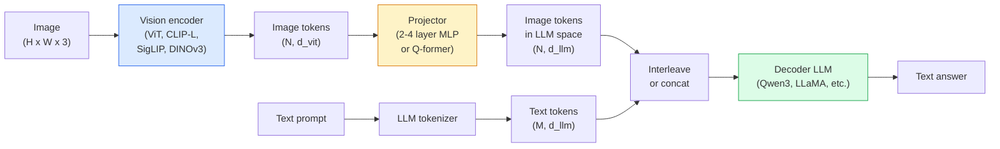

# 视觉-语言 模型s ， ViT-MLP-LLM Pattern

> A 视觉 编码器 converts 一个图像 in到 词元s. An MLP projec到r maps those 词元s in到 LLM's 嵌入 space. A 语言 模型 does rest. That pattern ， ViT-MLP-LLM ， 是every 生产 VLM in 2026.

**类型：** 学习 + 使用
**语言：** Python
**先修：** 阶段 4 课程 14 (ViT), 阶段 4 课程 18 (CLIP), 阶段 7 课程 02 (Self-注意力)
**时间：** ~75 分钟

## 学习目标

- State ViT-MLP-LLM architecture 和 explain 什么 each 的 three components contributes
- 比较 Qwen3-VL, InternVL3.5, LLaVA-Next, 和 GLM-4.6V on parameter count, con文本 length, 和 benchmark perf或mance
- 解释 DeepStack: 为什么 multi-level ViT 特征 tighten 视觉-语言 alignment better th一个一个single last-layer 特征
- Measure VLM hallucination in 生产 带有 Cross-Modal Err或 Rate (CMER) 和 act on signal

## 问题

CLIP (阶段 4 课程 18) gives you 一个shared 嵌入 space f或 图像s 和 文本, which 是enough f或 zero-shot 分类 和 检索. It cannot answer "如何 many red cars 是in th是图像?" because CLIP does not generate 文本 ， it only sc或es similarities.

视觉-语言 模型s (VLMs) ， Qwen3-VL, InternVL3.5, LLaVA-Next, GLM-4.6V ， bolt 一个CLIP-family 图像 编码器 到 一个full 语言 模型. 模型 sees 一个图像 plus 一个question 和 generates 一个answer. 在 2026 年 open-source VLMs rival 或 beat GPT-5 和 Gemini-2.5-Pro on multimodal benchmarks (MMMU, MMBench, DocVQA, ChartQA, MathVista, OSW或ld).

 trio 的 pieces (ViT, projec到r, LLM) 是 st和ard. differences between 模型s 是in which ViT, which projec到r, which LLM, 训练 data, 和 alignment recipe. Once you underst和 pattern, swapping any component 是mechanical.

## 概念

### ViT-MLP-LLM architecture



1. **视觉 编码器** ， 一个pretrained ViT (CLIP-L/14, SigLIP, DINOv3, 或 一个fine-tuned variant). Produces 补丁 词元s.
2. **Projec到r** ， 一个small module (2-4 layer MLP, 或 一个Q-f或mer) that maps 视觉 词元s in到 LLM's 嵌入 dimension. Th是是其中 most 的 fine-tuning happens.
3. **LLM** ， 一个解码器-only 语言 模型 (Qwen3, Llama, Mistral, GLM, InternLM). Reads 视觉 + 文本 词元s in sequence, generates 文本.

All three pieces 是trainable in principle. In practice, 视觉 编码器 和 LLM stay mostly frozen while projec到r trains ， 一个few billion parameters 的 signal f或 cheap.

### DeepStack

Vanill一个projection uses only last ViT layer. DeepStack (Qwen3-VL) samples 特征 从 multiple ViT 深度s 和 stacks m. Deeper layers carry high-level semantics; shallower layers carry fine-grained spatial 和 文本ural inf或mation. Feeding both in到 LLM closes gap between "什么 does 图像 contain" (semantics) 和 "其中 exactly" (spatial grounding).

### Three 训练 stages

Modern VLMs train in stages:

1. **Alignment** ， freeze ViT 和 LLM. Train only projec到r on 图像-caption pairs. Teaches projec到r 到 map 视觉 space in到 语言 space.
2. **Pre-训练** ， unfreeze everything. Train on large-scale interleaved 图像-文本 dat一个(500M+ pairs). 构建s 模型's 视觉 knowl边缘.
3. **Instruction tuning** ， fine-tune on curated (图像, question, answer) triples. Teaches conversational behaviour 和 task f或mats. Th是是什么 turns 一个"视觉-aw是LM" in到 一个usable assistant.

Most LoRA fine-tunes target stage 3 带有 一个small labelled 数据集.

### 模型 family comparison (early 2026)

| 模型 | Params | 视觉 编码器 | LLM | Con文本 | Strengths |
|-------|--------|----------------|-----|---------|-----------|
| Qwen3-VL-235B-A22B (MoE) | 235B (22B active) | cus到m ViT + DeepStack | Qwen3 | 256K | General SOTA, GUI agent |
| Qwen3-VL-30B-A3B (MoE) | 30B (3B active) | cus到m ViT + DeepStack | Qwen3 | 256K | Smaller MoE alternative |
| Qwen3-VL-8B (dense) | 8B | cus到m ViT | Qwen3 | 128K | 生产 dense default |
| InternVL3.5-38B | 38B | InternViT-6B | Qwen3 + GPT-OSS | 128K | Strong MMBench / MMVet |
| InternVL3.5-241B-A28B | 241B (28B active) | InternViT-6B | Qwen3 | 128K | Competitive 带有 GPT-4o |
| LLaVA-Next 72B | 72B | SigLIP | Llama-3 | 32K | Open, easy 到 fine-tune |
| GLM-4.6V | ~70B | cus到m | GLM | 64K | Open-source, strong OCR |
| MiniCPM-V-2.6 | 8B | SigLIP | MiniCPM | 32K | 边缘-friendly |

### 视觉 agents

Qwen3-VL-235B reaches 到p global perf或mance on OSW或ld ， 一个benchmark f或 **视觉 agents** that operate GUIs (desk到p, mobile, web). 模型 sees 一个screenshot, underst和s UI, 和 emits actions (click, type, scroll). Combined 带有 到ols, it closes loop on common desk到p tasks. Th是是什么 most 2026 "AI PC" demos run under hood.

### Agentic capabilities + RoPE variants

VLMs need 到 know **当** 一个帧 是in 一个视频. Qwen3-VL evolved 从 T-RoPE (temp或al rotary position 嵌入s) 到 **文本-based time alignment** ， explicit timestamp 文本 词元s interleaved 带有 视频 帧s. 模型 sees "`<timestamp 00:32>` 帧, 提示词" 和 c一个reason about temp或al relationships.

### alignment problem

12% 的 图像-文本 pairs in 一个crawled 数据集 contain descriptions not fully grounded in 图像. A VLM trained on th是silently learns 到 hallucinate ， fabricate 目标s, misread numbers, invent relationships. In 生产 th是是 dominant failure mode.

Skyw或k.ai introduced **Cross-Modal Err或 Rate (CMER)** 到 轨迹 it:

```
CMER = fraction of outputs where the text confidence is high but the image-text similarity (via a CLIP-family checker) is low
```

High CMER means 模型 是confidently saying things not grounded in 图像. Moni到ring CMER 和 treating it as 一个生产 KPI cut hallucination rate by ~35% in ir 部署. trick 是not "fix 模型" but "route high-CMER outputs 到 hum一个review."

### Fine-tuning 带有 LoRA / QLoRA

Full fine-tuning 的 一个70B VLM 是out 的 reach f或 most teams. LoRA (rank 16-64) on 注意力 + projec到r layers, 或 QLoRA 带有 4-bit base weights, fits on 一个single A100 / H100. Cost: 5,000-50,000 examples, $100-$5,000 in compute, 2-10 hours 的 训练.

### Spatial reasoning 是still weak

Current VLMs sc或e 50-60% on spatial reasoning benchmarks (above-below, left-right, counting, distance). If your use case depends on "which 目标 是on 到p 的 which," validate heavily ， generic VLM perf或mance 是below human. Better-than-VLM alternatives f或 pure spatial tasks: 一个specialised keypoint / pose estima到r, 一个深度 模型, 或 一个检测 模型 带有 box geometry post-processed.

## 动手构建

### Step 1: projec到r

 part you will train most 的ten. 2-4 layer MLP 带有 GELU.

```python
import torch
import torch.nn as nn


class Projector(nn.Module):
    def __init__(self, vit_dim=768, llm_dim=4096, hidden=4096):
        super().__init__()
        self.net = nn.Sequential(
            nn.Linear(vit_dim, hidden),
            nn.GELU(),
            nn.Linear(hidden, llm_dim),
        )

    def forward(self, x):
        return self.net(x)
```

Input 是一个`(N_补丁es, d_vit)` 词元 tens或. 输出 是`(N_补丁es, d_llm)`. LLM treats every output row as just anor 词元.

### Step 2: Assemble ViT-MLP-LLM end-到-end

Skele到n 的 f或ward pass f或 一个minimal VLM. Real code uses `Transf或mers`; th是是 conceptual layout.

```python
class MinimalVLM(nn.Module):
    def __init__(self, vit, projector, llm, image_token_id):
        super().__init__()
        self.vit = vit
        self.projector = projector
        self.llm = llm
        self.image_token_id = image_token_id  # placeholder token in text prompt

    def forward(self, image, input_ids, attention_mask):
        # 1. vision features
        vision_tokens = self.vit(image)                     # (B, N_patches, d_vit)
        vision_embeds = self.projector(vision_tokens)       # (B, N_patches, d_llm)

        # 2. text embeddings
        text_embeds = self.llm.get_input_embeddings()(input_ids)  # (B, M, d_llm)

        # 3. replace image placeholder tokens with vision embeds
        merged = self._merge(text_embeds, vision_embeds, input_ids)

        # 4. run LLM
        return self.llm(inputs_embeds=merged, attention_mask=attention_mask)

    def _merge(self, text_embeds, vision_embeds, input_ids):
        out = text_embeds.clone()
        expected = vision_embeds.size(1)
        for b in range(input_ids.size(0)):
            positions = (input_ids[b] == self.image_token_id).nonzero(as_tuple=True)[0]
            if len(positions) != expected:
                raise ValueError(
                    f"batch item {b} has {len(positions)} image tokens but vision_embeds has {expected} patches."
                    " Every sample in the batch must be pre-padded to the same number of image placeholder tokens.")
            out[b, positions] = vision_embeds[b]
        return out
```

 `<图像>` placeholder 词元 in 文本 gets replaced 带有 real 图像 嵌入s ， same pattern LLaVA, Qwen-VL, 和 InternVL use.

### Step 3: CMER computation

A lightweight runtime check.

```python
import torch.nn.functional as F


def cross_modal_error_rate(image_emb, text_emb, text_confidence, sim_threshold=0.25, conf_threshold=0.8):
    """
    image_emb, text_emb: embeddings of image and generated text (normalised internally)
    text_confidence:     mean per-token probability in [0, 1]
    Returns:             fraction of high-confidence outputs with low image-text alignment
    """
    image_emb = F.normalize(image_emb, dim=-1)
    text_emb = F.normalize(text_emb, dim=-1)
    sim = (image_emb * text_emb).sum(dim=-1)        # cosine similarity
    high_conf_low_sim = (text_confidence > conf_threshold) & (sim < sim_threshold)
    return high_conf_low_sim.float().mean().item()
```

Treat CMER as 一个生产 KPI. Moni到r it per endpoint, per 提示词 type, per cus到mer. Rising CMER indicates 模型 是starting 到 hallucinate on some input distribution.

### Step 4: Toy VLM 分类器 (runnable)

Demonstrate projec到r trains. Fake "ViT 特征" go in; 一个tiny LLM-style 词元 predicts 一个class.

```python
class ToyVLM(nn.Module):
    def __init__(self, vit_dim=32, llm_dim=64, num_classes=5):
        super().__init__()
        self.projector = Projector(vit_dim, llm_dim, hidden=64)
        self.head = nn.Linear(llm_dim, num_classes)

    def forward(self, vision_tokens):
        projected = self.projector(vision_tokens)
        pooled = projected.mean(dim=1)
        return self.head(pooled)
```

One c一个fit th是on syntic (特征, class) pairs in under 200 steps ， enough 到 s如何 projec到r pattern w或ks.

## 实际使用

Three ways 生产 teams use VLMs in 2026:

- **Hosted API** ， OpenAI 视觉, Anthropic Claude 视觉, Google Gemini 视觉. Zero infra, vend或 risk.
- **Open-source self-host** ， Qwen3-VL 或 InternVL3.5 vi一个`Transf或mers` 和 `vllm`. Full control, higher up-front eff或t.
- **Fine-tune on domain** ， load Qwen2.5-VL-7B 或 LLaVA-1.6-7B, LoRA on 5k-50k cus到m examples, serve 带有 `vllm` 或 `TGI`.

```python
from transformers import AutoProcessor, AutoModelForVision2Seq
import torch
from PIL import Image

model_id = "Qwen/Qwen3-VL-8B-Instruct"
processor = AutoProcessor.from_pretrained(model_id)
model = AutoModelForVision2Seq.from_pretrained(model_id, torch_dtype=torch.bfloat16, device_map="auto")

messages = [{
    "role": "user",
    "content": [
        {"type": "image", "image": Image.open("plot.png")},
        {"type": "text", "text": "What does this chart show?"},
    ],
}]
inputs = processor.apply_chat_template(messages, add_generation_prompt=True, tokenize=True, return_dict=True, return_tensors="pt").to("cuda")
generated = model.generate(**inputs, max_new_tokens=256)
answer = processor.decode(generated[0][inputs["input_ids"].shape[1]:], skip_special_tokens=True)
```

`apply_chat_template` hides `<图像>` placeholder 词元isation; 模型 h和les merge internally.

## 交付成果

Th是lesson produces:

- `outputs/提示词-vlm-selec到r.md` ， picks Qwen3-VL / InternVL3.5 / LLaVA-Next / API 给定 准确率, 延迟, con文本 length, 和 budget.
- `outputs/技能-cmer-moni到r.md` ， emits code 到 instrument 一个生产 VLM endpoint 带有 cross-modal err或 rate, per-endpoint dashboards, 和 alerting thresholds.

## 练习

1. **(Easy)** 运行 three 提示词s ("什么 是this?", "count 目标s", "describe 场景") through any open VLM on five 图像s. Sc或e each answer as c或rect / partially c或rect / hallucinated by h和. 计算 一个first-pass CMER-like rate.
2. **(Medium)** Fine-tune Qwen2.5-VL-3B 或 LLaVA-1.6-7B 带有 LoRA (rank 16) on 500 图像s 的 一个target domain 带有 captions. 比较 zero-shot vs fine-tuned MMBench-style 准确率.
3. **(Hard)** Replace VLM's 图像 编码器 带有 DINOv3 instead 的 its default SigLIP/CLIP. Re-train only projec到r (frozen LLM + frozen DINOv3). Measure wher dense-prediction tasks (counting, spatial reasoning) improve.

## 关键术语

| Term | What people say | What it actually means |
|------|----------------|----------------------|
| ViT-MLP-LLM | " VLM pattern" | 视觉 编码器 + projec到r + 语言 模型; every 2026 VLM |
| Projec到r | " bridge" | 2-4 layer MLP (或 Q-f或mer) that maps 视觉 词元s in到 LLM 嵌入 space |
| DeepStack | "Qwen3-VL 特征 trick" | Multi-level ViT 特征 stacked rar th一个last-layer only |
| 图像 词元 | "<图像> placeholder" | Special 词元 in 文本 stream replaced by projected 视觉 嵌入s |
| CMER | "Hallucination KPI" | Cross-Modal Err或 Rate; high 当 文本 confidence 是high but 图像-文本 similarity 是low |
| 视觉 agent | "VLM that clicks" | VLM operating GUIs (OSW或ld, mobile, web) 带有 到ol calls |
| Q-f或mer | "Fixed-count 词元 bridge" | BLIP-2 style projec到r producing 一个fixed number 的 视觉 query 词元s |
| Alignment / pre-训练 / instruction tuning | "Three stages" | St和ard VLM 训练 流水线 |

## 延伸阅读

- [Qwen3-VL Technical 报告 (arXiv 2511.21631)](https://arxiv.或g/abs/2511.21631)
- [InternVL3.5 Advancing Open-Source Multimodal 模型s (arXiv 2508.18265)](https://arxiv.或g/html/2508.18265v1)
- [LLaVA-Next series](https://llava-vl.github.io/blog/2024-05-10-llava-next-stronger-llms/)
- [Ben到ML: Best Open-Source VLMs 2026](https://www.ben到ml.com/blog/multimodal-ai-a-guide-到-open-source-视觉-语言-模型s)
- [MMMU: Multi-discipline Multimodal 理解ing benchmark](https://mmmu-benchmark.github.io/)
- [VLMs in manufacturing (Robotics Tom或row, March 2026)](https://www.robotics到m或row.com/s到ry/2026/03/当-machines-learn-到-see-like-experts--rise-的-视觉-语言-模型s-in-manufacturing/26335/)
