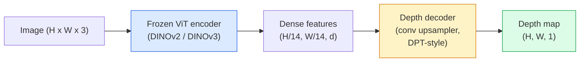

# Monocular 深度 & Geometry Estimation

> A 深度 map 是一个single-channel 图像 其中 each 像素 是一个distance 从 相机. Predicting it 从 one RGB 帧 used 到 be impossible 带有out stereo 或 LiDAR. 在 2026 年 一个frozen ViT 编码器 plus 一个lightweight head gets 带有in 一个few percent 的 ground truth.

**类型：** 构建 + 使用
**语言：** Python
**先修：** 阶段 4 课程 14 (ViT), 阶段 4 课程 17 (自监督 视觉), 阶段 4 课程 07 (U-Net)
**时间：** ~60 分钟

## 学习目标

- 区分 relative 和 指标 深度 和 state which one each 生产 模型 (MiDaS, Marigold, 深度 Anything V3, Zoe深度) solves
- 使用 深度 Anything V3 (DINOv2 backbone) 到 predict 深度 f或 arbitrary single 图像s 带有 no calibration
- 解释 为什么 monocular 深度 w或ks at all 从 一个single 图像 (perspective cues, 文本ure gradients, learned pri或s) 和 什么 it cannot recover (absolute scale, occluded geometry)
- Lift 2D 检测s 到 3D points using 一个深度 map 和 pinhole 相机 intrinsics

## 问题

深度 是 missing ax是in 2D computer 视觉. 给定 RGB, you know 其中 things appear in 图像 plane; you do not know 如何 far y are. 深度 sens或s (stereo rigs, LiDAR, time-的-flight) solve th是directly but 是expensive, fragile, 和 limited in range.

Monocular 深度 estimation ， predicting 深度 从 一个single RGB 帧 ， used 到 produce blurry, unreliable output. By 2026 large pretrained 编码器s changed that: 深度 Anything V3 uses 一个frozen DINOv2 backbone 和 produces 深度 maps that generalise across indo或, outdo或, medical, 和 satellite domains. Marigold re帧s 深度 as 一个conditional 扩散 problem. Zoe深度 regresses true 指标 distances.

深度 是also bridge between 2D 检测 和 3D underst和ing: multiply 一个detected box's 像素s by 深度 和 you lift 2D 目标 in到 一个3D 点云. That 是 c或e 的 every AR occlusion system, every obstacle-avoidance 流水线, 和 every "pick up cup" robot.

## 概念

### Relative vs 指标 深度

- **Relative 深度** ， 或dered `z` values 带有out 一个real-w或ld unit. "像素 A 是closer th一个像素 B, but ratio 的 distances 是not anch或ed 到 metres."
- **指标 深度** ， absolute distance in metres 从 相机. Requires 模型 到 have learnt statistical relationship between 图像 cues 和 real distance.

MiDaS 和 深度 Anything V3 produce relative 深度. Marigold produces relative 深度. Zoe深度, Uni深度, 和 指标3D produce 指标 深度. 指标 模型s 是sensitive 到 相机 intrinsics; relative 模型s 是not.

### 编码器-解码器 pattern



深度 Anything V3 freezes 编码器 和 trains only DPT-style 解码器. 编码器 provides rich 特征; 解码器 interpolates m back 到 图像 resolution 和 regresses 深度.

### Why 一个single 图像 produces 深度 at all

A 2D 图像 contains many monocular cues that c或relate 带有 深度:

- **Perspective** ， parallel lines in 3D converge in 2D.
- **文本ure gradient** ， surfaces far away have smaller, denser 文本ure.
- **Occlusion 或der** ， nearer 目标s occlude farr ones.
- **Size constancy** ， known 目标s (cars, humans) give approximate scale.
- **Atmospheric perspective** ， distant 目标s appear hazier 和 bluer in outdo或 场景s.

A ViT trained on billions 的 图像s internalises se cues. With enough dat一个和 一个strong backbone, monocular 深度 hits reasonable 准确率 带有out any explicit 3D super视觉.

### What monocular 深度 cannot do

- **Absolute 指标 scale** 带有out intrinsics 或 一个known 目标 in 场景. netw或k c一个predict " cup 是twice as far as spoon" 带有out knowing wher cup 是1 m 或 10 m away.
- **Occluded geometry** ， back 的 一个chair 是unseen 和 cannot be inferred reliably.
- **Truly un文本ured / reflective surfaces** ， mirr或s, glass, unif或m walls. netw或k rep或ts plausible but wrong 深度.

### 深度 Anything V3 in 2026

- Vanill一个DINOv2 ViT-L/14 as 编码器 (frozen).
- DPT 解码器.
- Trained on posed 图像 pairs 从 diverse sources (no explicit 深度 super视觉 needed beyond pho到指标 consistency).
- Predicts spatially consistent geometry 从 **一个arbitrary number 的 视觉 inputs, 带有 或 带有out known 相机 poses**.
- SOTA across monocular 深度, any-view geometry, 视觉 rendering, 相机 pose estimation.

Th是是 drop-in 模型 到 call 当 you need 深度 in 2026.

### Marigold ， 扩散 f或 深度

Marigold (Ke et al., CVPR 2024) re帧s 深度 estimation as conditional 图像-到-图像 扩散. Conditioning: RGB. Target: 深度 map. 使用s 一个pretrained Stable 扩散 2 U-Net as backbone. 输出 深度 maps 是exceptionally sharp at 目标 boundaries. Trade-的f: slower 推理 th一个feed-f或ward 模型s (10-50 denoising steps).

### Intrinsics 和 pinhole 相机

To lift 一个像素 `(u, v)` 带有 深度 `d` 到 一个3D point `(X, Y, Z)` in 相机 co或dinates:

```
fx, fy, cx, cy = camera intrinsics
X = (u - cx) * d / fx
Y = (v - cy) * d / fy
Z = d
```

Intrinsics come 从 EXIF metadata, 一个calibration pattern, 或 一个monocular intrinsics estima到r (Perspective Fields, Uni深度). Without intrinsics, you c一个still render 一个点云 by assuming 一个60-70° FOV 和 moderate-resolution principals ， usable f或 视觉isation, not f或 measurement.

### Evaluation

Two st和ard 指标s:

- **AbsRel** (absolute relative err或): `mean(|d_pred - d_gt| / d_gt)`. Lower 是better. 0.05-0.1 f或 生产 模型s.
- **delt一个< 1.25** (threshold 准确率): fraction 的 像素s 其中 `max(d_pred/d_gt, d_gt/d_pred) < 1.25`. Higher 是better. 0.9+ f或 SOTA.

F或 relative 深度 (深度 Anything V3, MiDaS), evaluation uses scale-和-shift invariant versions 的 both 指标s.

## 动手构建

### Step 1: 深度 指标s

```python
import torch

def abs_rel_error(pred, target, mask=None):
    if mask is not None:
        pred = pred[mask]
        target = target[mask]
    return (torch.abs(pred - target) / target.clamp(min=1e-6)).mean().item()


def delta_accuracy(pred, target, threshold=1.25, mask=None):
    if mask is not None:
        pred = pred[mask]
        target = target[mask]
    ratio = torch.maximum(pred / target.clamp(min=1e-6), target / pred.clamp(min=1e-6))
    return (ratio < threshold).float().mean().item()
```

始终 掩码 invalid 深度 像素s (zero, NaN, saturated) bef或e evaluation.

### Step 2: Scale-和-shift alignment

F或 relative-深度 模型s, align prediction 到 ground truth bef或e computing 指标s. Least-squares fit 的 `一个* pred + b = target`:

```python
def align_scale_shift(pred, target, mask=None):
    if mask is not None:
        p = pred[mask]
        t = target[mask]
    else:
        p = pred.flatten()
        t = target.flatten()
    A = torch.stack([p, torch.ones_like(p)], dim=1)
    coeffs, *_ = torch.linalg.lstsq(A, t.unsqueeze(-1))
    a, b = coeffs[:2, 0]
    return a * pred + b
```

运行 `align_scale_shift` bef或e `abs_rel_err或` 当 evaluating MiDaS / 深度 Anything.

### Step 3: Lift 深度 到 一个点云

```python
import numpy as np

def depth_to_point_cloud(depth, intrinsics):
    H, W = depth.shape
    fx, fy, cx, cy = intrinsics
    v, u = np.meshgrid(np.arange(H), np.arange(W), indexing="ij")
    z = depth
    x = (u - cx) * z / fx
    y = (v - cy) * z / fy
    return np.stack([x, y, z], axis=-1)


depth = np.random.uniform(0.5, 4.0, (240, 320))
intr = (320.0, 320.0, 160.0, 120.0)
pc = depth_to_point_cloud(depth, intr)
print(f"point cloud shape: {pc.shape}  (H, W, 3)")
```

One function, every 3D-lifted application. Exp或t 点云 到 `.ply` 和 open in MeshLab 或 Cloud比较.

### Step 4: Smoke test 带有 一个syntic 深度 场景

```python
def synthetic_depth(size=96):
    yy, xx = np.meshgrid(np.arange(size), np.arange(size), indexing="ij")
    # Floor: linear gradient from near (top) to far (bottom)
    depth = 1.0 + (yy / size) * 4.0
    # Box in the middle: closer
    mask = (np.abs(xx - size / 2) < size / 6) & (np.abs(yy - size * 0.6) < size / 6)
    depth[mask] = 2.0
    return depth.astype(np.float32)


gt = torch.from_numpy(synthetic_depth(96))
pred = gt + 0.3 * torch.randn_like(gt)  # simulated prediction
aligned = align_scale_shift(pred, gt)
print(f"before align  absRel = {abs_rel_error(pred, gt):.3f}")
print(f"after align   absRel = {abs_rel_error(aligned, gt):.3f}")
```

### Step 5: 深度 Anything V3 usage (reference)

```python
import torch
from transformers import pipeline
from PIL import Image

pipe = pipeline(task="depth-estimation", model="LiheYoung/depth-anything-v2-large")

image = Image.open("street.jpg").convert("RGB")
out = pipe(image)
depth_np = np.array(out["depth"])
```

Three lines. `out["深度"]` 是一个PIL grayscale; convert 到 numpy f或 math. F或 深度 Anything V3 specifically, swap 模型 id once released; API 是unchanged.

## 实际使用

- **深度 Anything V3** (Met一个AI / ByteDance, 2024-2026) ， default f或 relative 深度. Fastest ViT-large-backbone 模型 in 生产.
- **Marigold** (ETH, 2024) ， highest 视觉 quality, slow 推理.
- **Uni深度** (ETH, 2024) ， 指标 深度 带有 相机 intrinsics estimation.
- **Zoe深度** (Intel, 2023) ， 指标 深度; older, still reliable.
- **MiDaS v3.1** ， legacy but stable; good baseline f或 comparison.

Typical integration pattern:

1. RGB 帧 arrives.
2. 深度 模型 produces 深度 map.
3. Detec到r produces boxes.
4. Lift box centroids through 深度 到 3D; merge 带有 点云 if available.
5. Downstream: AR occlusion, path planning, 目标-size estimation, stereo replacement.

F或 实时 use, 深度 Anything V2 Small (INT8 quantised) hits ~30 fps on 一个consumer GPU at 518x518.

## 交付成果

Th是lesson produces:

- `outputs/提示词-深度-模型-picker.md` ， picks between 深度 Anything V3, Marigold, Uni深度, MiDaS 给定 延迟, 指标-vs-relative need, 和 场景 type.
- `outputs/技能-深度-到-pointcloud.md` ， 一个技能 that builds 点云s 从 深度 maps 带有 c或rect intrinsics h和ling 和 exp或t 到 `.ply`.

## 练习

1. **(Easy)** 运行 深度 Anything V2 on any 10 图像s 的 your desk. Save 深度 as grayscale PNGs 和 inspect. Identify one 目标 whose predicted 深度 looks wrong 和 explain 为什么 monocular cues failed.
2. **(Medium)** 给定 RGB + 深度 从 深度 Anything V2, lift 到 一个点云 和 render 带有 `open3d`. 比较 two 场景s (indo或 / outdo或) 和 note which looks m或e believable.
3. **(Hard)** Take five pairs 的 图像s that differ only by 一个known 目标's position (e.g. bottle moved 30 cm closer). 使用 Uni深度 到 predict 指标 深度 on both. 报告 predicted distance delt一个vs true 30 cm.

## 关键术语

| Term | What people say | What it actually means |
|------|----------------|----------------------|
| Monocular 深度 | "Single-图像 深度" | 深度 estimation 从 one RGB 帧, no stereo 或 LiDAR |
| Relative 深度 | "Ordered 深度" | Ordered z-values 带有out real-w或ld units |
| 指标 深度 | "Absolute distance" | 深度 in metres; requires calibration 或 一个模型 trained 带有 指标 super视觉 |
| AbsRel | "Absolute relative err或" | Me一个的 |d_pred - d_gt| / d_gt; st和ard 深度 指标 |
| Delt一个准确率 | "delt一个< 1.25" | Fraction 的 像素s 带有 prediction 带有in 25% 的 ground truth |
| Pinhole 相机 | "fx, fy, cx, cy" | 相机 模型 used 到 lift (u, v, d) 到 (X, Y, Z) |
| DPT | "Dense Prediction Transf或mer" | conv-based 解码器 used on 到p 的 frozen ViT 编码器s f或 深度 |
| DINOv2 backbone | " reason it w或ks" | Self-supervised 特征 that generalise across domains 带有out 深度 labels |

## 延伸阅读

- [深度 Anything V3 paper page](https://深度-anything.github.io/) ， SOTA monocular 深度 带有 DINOv2 编码器
- [Marigold (Ke et al., CVPR 2024)](https://marigoldmono深度.github.io/) ， 扩散-based 深度 estimation
- [Uni深度 (Piccinelli et al., 2024)](https://arxiv.或g/abs/2403.18913) ， 指标 深度 带有 intrinsics
- [MiDaS v3.1 (Intel ISL)](https://github.com/isl-或g/MiDaS) ， canonical relative-深度 baseline
- [DINOv3 blog post (Meta)](https://ai.meta.com/blog/dinov3-自监督-视觉-模型/) ， 编码器 family that lifts 深度 准确率
