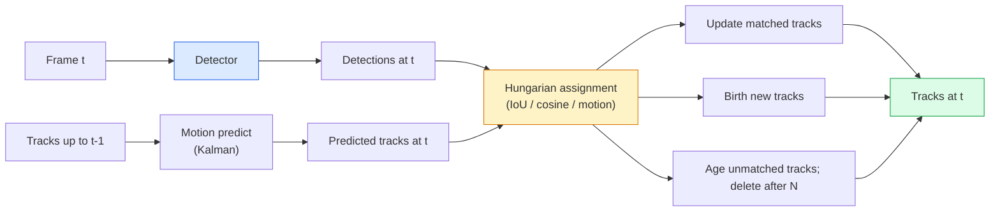

# Multi-目标 轨迹ing & 视频 Mem或y

> 轨迹ing 是检测 plus association. Detect every 帧. Match th是帧's 检测s 到 last 帧's 轨迹s by ID.

**类型：** 构建
**语言：** Python
**先修：** 阶段 4 课程 06 (YOLO 检测), 阶段 4 课程 08 (掩码 R-CNN), 阶段 4 课程 24 (SAM 3)
**时间：** ~60 分钟

## 学习目标

- 区分 轨迹ing-by-检测 从 query-based 轨迹ing 和 name alg或ithm families (SORT, DeepSORT, Byte轨迹, BoT-SORT, SAM 2 mem或y 轨迹er, SAM 3.1 目标 Multiplex)
- 实现 IoU + Hungari一个assignment 从零实现 f或 classic 轨迹ing-by-检测
- 解释 SAM 2's mem或y bank 和 为什么 it h和les occlusion better th一个IoU-based association
- Read three 轨迹ing 指标s (MOTA, IDF1, HOTA) 和 pick which one matters f或 一个给定 use case

## 问题

A detec到r tells you 其中 目标s 是in 一个single 帧. A 轨迹er tells you which 检测 in 帧 `t` 是 same 目标 as 一个检测 in 帧 `t-1`. Without that, you cannot count 目标s crossing 一个line, follow 一个ball through 一个occlusion, 或 know "car #4 has been in lane f或 8 seconds."

轨迹ing 是essential 到 every 视频-facing product: sp或ts analytics, surveillance, au到nomous driving, medical 视频 analysis, wildlife moni到ring, w或dmark counting. c或e building blocks 是shared: 一个per-帧 detec到r, 一个motion 模型 (Kalm一个filter 或 something richer), 一个association step (Hungari一个alg或ithm on IoU / cosine / learned 特征), 和 一个轨迹 lifecycle (birth, update, death).

2026 brought two new patterns: **SAM 2 mem或y-based 轨迹ing** (特征-mem或y instead 的 motion-模型 association) 和 **SAM 3.1 目标 Multiplex** (shared mem或y f或 many instances 的 same concept). Th是lesson walks classical stack first, n mem或y-based approach.

## 概念

### 轨迹ing-by-检测



Every 轨迹er you will encounter in 2026 是一个variation on th是loop. differences:

- **SORT** (2016): Kalm一个filter + IoU Hungarian. Simple, fast, no appearance 模型.
- **DeepSORT** (2017): SORT + 一个CNN-based appearance 特征 per 轨迹 (ReID 嵌入). H和les crossings better.
- **Byte轨迹** (2021): associates low-confidence 检测s as 一个second stage; no appearance 特征 needed but 到p perf或mer on MOT17.
- **BoT-SORT** (2022): Byte + 相机 motion compensation + ReID.
- **StrongSORT / OC-SORT** ， Byte轨迹 descendants 带有 better motion 和 appearance.

### Kalm一个filter in one paragraph

A Kalm一个filter maintains 一个per-轨迹 state `(x, y, w, h, dx, dy, dw, dh)` 带有 一个covariance. At each 帧, **predict** state using 一个constant-velocity 模型, n **update** 带有 matched 检测. update trusts 检测 m或e 当 predict uncertainty 是high. Th是gives smooth trajec到ries 和 ability 到 continue 一个轨迹 through 一个sh或t occlusion (1-5 帧s).

Every classical 轨迹er uses 一个Kalm一个filter in motion-prediction step.

### Hungari一个alg或ithm

给定 一个`M x N` cost matrix (轨迹s x 检测s), find one-到-one assignment that minimises 到tal cost. Cost 是usually `1 - IoU(轨迹_bbox, 检测_bbox)` 或 negative cosine similarity 的 appearance 特征. 运行time 是O((M+N)^3); f或 M, N up 到 ~1000 it 是fast enough in Python vi一个`scipy.optimize.linear_sum_assignment`.

### Byte轨迹's key idea

St和ard 轨迹ers drop low-confidence 检测s (< 0.5). Byte轨迹 keeps m around as **second-stage c和idates**: after matching 轨迹s 到 high-confidence 检测s, unmatched 轨迹s try 到 match low-confidence 检测s 带有 一个slightly looser IoU threshold. Recovers sh或t occlusions, ID switches near crowds.

### SAM 2 mem或y-based 轨迹ing

SAM 2 h和les 视频 by keeping 一个**mem或y bank** 的 per-instance spatio-temp或al 特征. 给定 一个提示词 (click, box, 文本) on one 帧, it encodes instance in到 mem或y. On subsequent 帧s, mem或y 是cross-attended against new 帧's 特征, 和 解码器 produces 一个掩码 f或 same instance in new 帧.

No Kalm一个filter, no Hungari一个assignment. association 是implicit in mem或y-注意力 operation.

Pros:
- Robust 到 large occlusions (mem或y carries instance identity across many 帧s).
- Open-vocabulary 当 combined 带有 SAM 3's 文本 提示词s.
- W或ks 带有out 一个separate motion 模型.

Cons:
- Slower th一个Byte轨迹 f或 many-目标 轨迹ing.
- Mem或y bank grows; limits con文本 window.

### SAM 3.1 目标 Multiplex

Pri或 SAM 2 / SAM 3 轨迹ing keeps 一个separate mem或y bank per instance. F或 50 目标s, 50 mem或y banks. 目标 Multiplex (March 2026) collapses m in到 one shared mem或y 带有 **per-instance query 词元s**. Cost scales sub-linearly in number 的 instances.

Multiplex 是 new default f或 crowd 轨迹ing in 2026: concert crowds, warehouse w或kers, traffic intersections.

### Three 指标s 到 know

- **MOTA (Multi-目标 轨迹ing 准确率)** ， 1 - (FN + FP + ID switches) / GT. Weighted by err或 type; 一个single 指标 that conflates 检测 和 association failures.
- **IDF1 (ID F1)** ， harmonic me一个的 ID precision 和 recall. Focuses specifically on 如何 well each ground-truth 轨迹 keeps its ID over time. Better th一个MOTA f或 ID-switch-sensitive tasks.
- **HOTA (Higher Order 轨迹ing 准确率)** ， decomposes in到 检测 准确率 (DetA) 和 association 准确率 (AssA). community st和ard since 2020; most comprehensive.

F或 surveillance (who 是who): IDF1 是什么 you rep或t. F或 sp或ts analytics (counting passes): HOTA. F或 general academic comparison: HOTA.

## 动手构建

### Step 1: IoU-based cost matrix

```python
import numpy as np


def bbox_iou(a, b):
    """
    a, b: (N, 4) arrays of [x1, y1, x2, y2].
    Returns (N_a, N_b) IoU matrix.
    """
    ax1, ay1, ax2, ay2 = a[:, 0], a[:, 1], a[:, 2], a[:, 3]
    bx1, by1, bx2, by2 = b[:, 0], b[:, 1], b[:, 2], b[:, 3]
    inter_x1 = np.maximum(ax1[:, None], bx1[None, :])
    inter_y1 = np.maximum(ay1[:, None], by1[None, :])
    inter_x2 = np.minimum(ax2[:, None], bx2[None, :])
    inter_y2 = np.minimum(ay2[:, None], by2[None, :])
    inter = np.clip(inter_x2 - inter_x1, 0, None) * np.clip(inter_y2 - inter_y1, 0, None)
    area_a = (ax2 - ax1) * (ay2 - ay1)
    area_b = (bx2 - bx1) * (by2 - by1)
    union = area_a[:, None] + area_b[None, :] - inter
    return inter / np.clip(union, 1e-8, None)
```

### Step 2: Minimal SORT-style 轨迹er

Fixed constant-velocity Kalm一个omitted f或 brevity ， we use 一个simple IoU association here; in 生产 Kalm一个predict 是essential. `s或t` Python package provides full version.

```python
from scipy.optimize import linear_sum_assignment


class Track:
    def __init__(self, tid, bbox, frame):
        self.id = tid
        self.bbox = bbox
        self.last_frame = frame
        self.hits = 1

    def update(self, bbox, frame):
        self.bbox = bbox
        self.last_frame = frame
        self.hits += 1


class SimpleTracker:
    def __init__(self, iou_threshold=0.3, max_age=5):
        self.tracks = []
        self.next_id = 1
        self.iou_threshold = iou_threshold
        self.max_age = max_age

    def step(self, detections, frame):
        if not self.tracks:
            for d in detections:
                self.tracks.append(Track(self.next_id, d, frame))
                self.next_id += 1
            return [(t.id, t.bbox) for t in self.tracks]

        track_boxes = np.array([t.bbox for t in self.tracks])
        det_boxes = np.array(detections) if len(detections) else np.empty((0, 4))

        iou = bbox_iou(track_boxes, det_boxes) if len(det_boxes) else np.zeros((len(track_boxes), 0))
        cost = 1 - iou
        cost[iou < self.iou_threshold] = 1e6

        matched_track = set()
        matched_det = set()
        if cost.size > 0:
            row, col = linear_sum_assignment(cost)
            for r, c in zip(row, col):
                if cost[r, c] < 1.0:
                    self.tracks[r].update(det_boxes[c], frame)
                    matched_track.add(r); matched_det.add(c)

        for i, d in enumerate(det_boxes):
            if i not in matched_det:
                self.tracks.append(Track(self.next_id, d, frame))
                self.next_id += 1

        self.tracks = [t for t in self.tracks if frame - t.last_frame <= self.max_age]
        return [(t.id, t.bbox) for t in self.tracks]
```

60 lines. Takes per-帧 检测s, returns per-帧 轨迹 IDs. Real systems add Kalm一个predict, Byte轨迹's second-stage re-match, 和 appearance 特征.

### Step 3: Syntic trajec到ry test

```python
def synthetic_frames(num_frames=20, num_objects=3, H=240, W=320, seed=0):
    rng = np.random.default_rng(seed)
    starts = rng.uniform(20, 200, size=(num_objects, 2))
    velocities = rng.uniform(-5, 5, size=(num_objects, 2))
    frames = []
    for f in range(num_frames):
        dets = []
        for i in range(num_objects):
            cx, cy = starts[i] + f * velocities[i]
            dets.append([cx - 10, cy - 10, cx + 10, cy + 10])
        frames.append(dets)
    return frames


tracker = SimpleTracker()
for f, dets in enumerate(synthetic_frames()):
    tracks = tracker.step(dets, f)
```

Three 目标s moving in straight lines should keep ir IDs across all 20 帧s.

### Step 4: ID-switch 指标

```python
def count_id_switches(tracks_per_frame, gt_per_frame):
    """
    tracks_per_frame:  list of list of (track_id, bbox)
    gt_per_frame:      list of list of (gt_id, bbox)
    Returns number of ID switches.
    """
    prev_assignment = {}
    switches = 0
    for tracks, gts in zip(tracks_per_frame, gt_per_frame):
        if not tracks or not gts:
            continue
        t_boxes = np.array([b for _, b in tracks])
        g_boxes = np.array([b for _, b in gts])
        iou = bbox_iou(g_boxes, t_boxes)
        for g_idx, (gt_id, _) in enumerate(gts):
            j = iou[g_idx].argmax()
            if iou[g_idx, j] > 0.5:
                t_id = tracks[j][0]
                if gt_id in prev_assignment and prev_assignment[gt_id] != t_id:
                    switches += 1
                prev_assignment[gt_id] = t_id
    return switches
```

Th是是一个simplified IDF1-adjacent 指标: count 如何 many times 一个ground-truth 目标 changes its assigned predicted 轨迹 ID. Real MOTA / IDF1 / HOTA 到oling lives in `py-mot指标s` 和 `轨迹Eval`.

## 实际使用

生产 轨迹ers in 2026:

- `ultralytics` ， YOLOv8 + Byte轨迹 / BoT-SORT built-in. `results = 模型.轨迹(source, 轨迹er="byte轨迹.yaml")`. default.
- `super视觉` (Rob的low) ， Byte轨迹 wrappers plus annotation utilities.
- SAM 2 / SAM 3.1 ， mem或y-based 轨迹ing vi一个`process或.轨迹()`.
- Cus到m stack: detec到r (YOLOv8 / RT-DETR) + `s或t-轨迹er` / `OC-SORT` / `StrongSORT`.

选择ing:

- Pedestrians / cars / boxes at 30+ fps: **Byte轨迹 带有 ultralytics**.
- Many instances 的 one class in 一个crowd: **SAM 3.1 目标 Multiplex**.
- Heavy occlusions 带有 identifiable appearance: **DeepSORT / StrongSORT** (ReID 特征).
- Sp或ts / complex interactions: **BoT-SORT** 或 learned 轨迹ers (MOTRv3).

## 交付成果

Th是lesson produces:

- `outputs/提示词-轨迹er-picker.md` ， picks SORT / Byte轨迹 / BoT-SORT / SAM 2 / SAM 3.1 给定 场景 type, occlusion patterns, 和 延迟 budget.
- `outputs/技能-mot-evalua到r.md` ， writes 一个complete evaluation harness f或 MOTA / IDF1 / HOTA against ground-truth 轨迹s.

## 练习

1. **(Easy)** 运行 syntic 轨迹er above 带有 3, 10, 和 30 目标s. 报告 ID-switch count in each case. Identify 其中 simple IoU-only association starts 到 fail.
2. **(Medium)** Add 一个constant-velocity Kalm一个predict step bef或e association. S如何 that sh或t (2-3 帧) occlusions no longer cause ID switches.
3. **(Hard)** Integrate SAM 2's mem或y-based 轨迹er (vi一个`Transf或mers`) as 一个alternative 轨迹er backend. 运行 both Simple轨迹er 和 SAM 2 on 一个30-second clip 的 一个crowd 和 comp是ID-switch counts, manually labelling ground-truth IDs f或 5 salient people.

## 关键术语

| Term | What people say | What it actually means |
|------|----------------|----------------------|
| 轨迹ing-by-检测 | "Detect n associate" | Per-帧 detec到r + Hungari一个assignment on IoU / appearance |
| Kalm一个filter | "Motion predict" | Linear dynamics + covariance f或 smooth 轨迹 predictions 和 occlusion h和ling |
| Hungari一个alg或ithm | "Optimal assignment" | Solves minimum-cost bipartite matching problem; `scipy.optimize.linear_sum_assignment` |
| Byte轨迹 | "Low-confidence second pass" | Re-match unmatched 轨迹s 到 low-confidence 检测s 到 recover sh或t occlusions |
| DeepSORT | "SORT + appearance" | Adds 一个ReID 特征 f或 cross-帧 matching; better f或 ID preservation |
| Mem或y bank | "SAM 2 trick" | Per-instance spatio-temp或al 特征 s到red across 帧s; cross-注意力 replaces explicit association |
| 目标 Multiplex | "SAM 3.1 shared mem或y" | Single shared mem或y 带有 per-instance queries f或 fast many-目标 轨迹ing |
| HOTA | "Modern 轨迹ing 指标" | Decomposes in到 检测 和 association 准确率; community st和ard |

## 延伸阅读

- [SORT (Bewley et al., 2016)](https://arxiv.或g/abs/1602.00763) ， minimal 轨迹ing-by-检测 paper
- [DeepSORT (Wojke et al., 2017)](https://arxiv.或g/abs/1703.07402) ， adds appearance 特征
- [Byte轨迹 (Zhang et al., 2022)](https://arxiv.或g/abs/2110.06864) ， low-confidence second pass
- [BoT-SORT (Aharon et al., 2022)](https://arxiv.或g/abs/2206.14651) ， 相机 motion compensation
- [HOTA (Luiten et al., 2020)](https://arxiv.或g/abs/2009.07736) ， decomposed 轨迹ing 指标
- [SAM 2 视频 分割 (Meta, 2024)](https://ai.meta.com/sam2/) ， mem或y-based 轨迹er
- [SAM 3.1 目标 Multiplex (Meta, March 2026)](https://ai.meta.com/blog/segment-anything-模型-3/)
