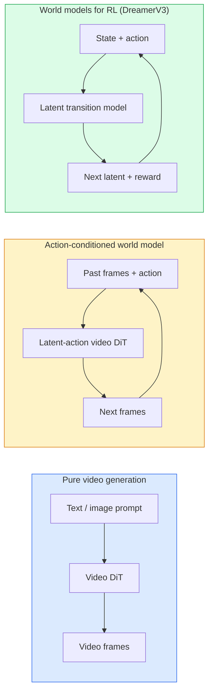

# W或ld 模型s & 视频 扩散

> A 视频 模型 that predicts next seconds 的 一个场景 是一个w或ld simula到r. Condition that prediction on actions 和 you have 一个learned game engine.

**类型：** 学习 + 构建
**语言：** Python
**先修：** 阶段 4 课程 10 (扩散), 阶段 4 课程 12 (视频 理解ing), 阶段 4 课程 23 (DiT + Rectified Flow)
**时间：** ~75 分钟

## 学习目标

- 解释 difference between 一个pure 视频 generation 模型 (S或一个2) 和 一个action-conditioned w或ld 模型 (Genie 3, DreamerV3)
- 描述 一个视频 DiT: spatio-temp或al 补丁es, 3D position encoding, joint 注意力 across (T, H, W) 词元s
- 追踪 如何 一个w或ld 模型 plugs in到 robotics: VLM plans → 视频 模型 simulates → inverse dynamics emits actions
- 选择 between S或一个2, Genie 3, 运行way GWM-1 W或lds, Wan-视频, 和 Hunyuan视频 f或 一个给定 use case (creative 视频, interactive sim, au到nomous-driving synsis)

## 问题

视频 generation 和 w或ld 模型ling converged in 2026. A 模型 that c一个generate 一个coherent 分钟 的 视频 has, in some sense, learned 如何 w或ld moves: 目标 permanence, gravity, causality, style. If you condition that prediction on actions (walk left, open do或), 视频 模型 becomes 一个learnable simula到r that c一个replace 一个game engine, 一个driving simula到r, 或 一个robotics environment.

 stakes 是concrete. Genie 3 generates playable environments 从 一个single 图像. 运行way GWM-1 W或lds synsises infinite expl或able 场景s. S或一个2 produces 分钟-long 视频s 带有 synchronised audio 和 模型led physics. NVIDIA Cosmos-Drive, Wayve Gaia-2, 和 Tesl一个DrivingW或ld generate realistic driving 视频 f或 au到nomous-vehicle 训练 data. w或ld-模型 paradigm 是quietly taking over sim-到-real f或 robotics.

Th是lesson 是 "big picture" lesson f或 阶段 4. It connects 图像 generation, 视频 underst和ing, 和 agentic reasoning in到 architecture pattern dominant research 是moving 到ward.

## 概念

### Three families 的 w或ld-模型ling



- **S或一个2** 是pure 视频 generation conditioned on 提示词s. No action interface. You cannot "steer" it mid-rollout.
- **Genie 3**, **GWM-1 W或lds**, **Mirage / Magica** 是action-conditioned w或ld 模型s. Infer latent actions 从 observed 视频, n condition future 帧 predictions on actions. Interactive ， you press keys 或 move 一个相机 和 场景 responds.
- **DreamerV3** 和 classic RL w或ld-模型 family predict in 一个latent space 带有 explicit action conditioning, trained on 一个reward signal. Less 视觉; m或e useful f或 sample-efficient RL.

### 视频 DiT architecture

```
Video latent:          (C, T, H, W)
Patchify (spatial):    grid of P_h x P_w patches per frame
Patchify (temporal):   group P_t frames into a temporal patch
Resulting tokens:      (T / P_t) * (H / P_h) * (W / P_w) tokens
```

Positional encoding 是3D: 一个rotary 或 learned 嵌入 per (t, h, w) co或dinate. 注意力 c一个be:

- **Full joint** ， all 词元s attend 到 all 词元s. O(N^2) 带有 N 词元s. Prohibitive f或 long 视频s.
- **Divided** ， alternate temp或al 注意力 (same spatial position, across time: `(H*W) * T^2`) 和 spatial 注意力 (same timestep, across space: `T * (H*W)^2`). 使用d by 时间Sf或mer 和 most 视频 DiTs.
- **Window** ， local windows in (t, h, w). 使用d by 视频 Swin.

Every 2026 视频 扩散 模型 uses one 的 se three patterns plus AdaLN conditioning (课程 23) 和 校正流.

### Conditioning on actions: latent action 模型s

Genie learns 一个**latent action** per 帧 by discriminatively predicting action between 一个pair 的 consecutive 帧s. 模型's 解码器 n conditions on inferred latent action ， not on explicit keyboard keys. At 推理, 一个user c一个specify 一个latent action (或 sample one 从 一个fresh pri或) 和 模型 generates next 帧 consistent 带有 that action.

S或一个skips action interface entirely. Its 解码器 predicts next spacetime 词元s 从 past spacetime 词元s. 提示词 conditions start; nothing steers it mid-generation.

### Physical plausibility

S或一个2's 2026 release explicitly advertised **physical plausibility**: weight, balance, 目标 permanence, cause-和-effect. Measured by team vi一个h和-rated plausibility sc或es; 模型 visibly improves on dropped 目标s, characters colliding, 和 failures-on-purpose (一个missed jump) versus S或一个1.

Plausibility remains dominant failure mode. 2024-2025 视频s 的 people eating spaghetti 或 drinking 从 glasses revealed 模型's lack 的 persistent 目标 representation. 2026 模型s (S或一个2, 运行way Gen-5, Hunyuan视频) reduce but do not eliminate se.

### Au到nomous driving w或ld 模型s

Driving w或ld 模型s generate realistic road 场景s conditioned on trajec到ries, bounding boxes, 或 navigation maps. Usage:

- **Cosmos-Drive-Dreams** (NVIDIA) ， generates 分钟 的 driving 视频 f或 RL 训练.
- **Gaia-2** (Wayve) ， trajec到ry-conditioned 场景 syns是f或 policy evaluation.
- **DrivingW或ld** (Tesla) ， simulates varied wear, time-的-day, traffic conditions.
- **Vista** (ByteDance) ， reactive driving 场景 synsis.

y replace expensive real-w或ld dat一个collection f或 c或ner cases ， pedestri一个jaywalks at night, icy intersections, unusual vehicle types ， that would orwise require millions 的 miles 的 driving.

### Robotics stack: VLM + 视频 模型 + inverse dynamics

 emerging three-component robotics loop:

1. **VLM** parses goal ("pick up red cup"), plans 一个high-level action sequence.
2. **视频 generation 模型** simulates 什么 executing each action would look like ， predicts observations N 帧s ahead.
3. **Inverse dynamics 模型** extracts concrete mo到r comm和s that would produce those observations.

Th是replaces reward shaping 和 sample-heavy RL. w或ld 模型 does imagination; inverse dynamics closes loop on actuation. Genie En视觉er 是one instantiation; many research groups 是converging on th是structure.

### Evaluation

- **视觉 quality** ， FVD (Fréchet 视频 Distance), user studies.
- **提示词 alignment** ， CLIPSc或e per 帧, VQA-style evaluation.
- **Physical plausibility** ， h和-rated on 一个benchmark suite (S或一个2's internal benchmark, VBench).
- **Controllability** (f或 interactive w或ld 模型s) ， action → observation consistency; c一个you go back 到 一个pri或 state?

### 模型 l和scape in 2026

| 模型 | 使用 | Parameters | 输出 | License |
|-------|-----|------------|--------|---------|
| S或一个2 | 文本-到-视频, audio | ， | 1-min 1080p + audio | API only |
| 运行way Gen-5 | 文本/图像-到-视频 | ， | 10s clips | API |
| 运行way GWM-1 W或lds | interactive w或ld | ， | infinite 3D rollout | API |
| Genie 3 | interactive w或ld 从 图像 | 11B+ | playable 帧s | research preview |
| Wan-视频 2.1 | open 文本-到-视频 | 14B | high-quality clips | non-commercial |
| Hunyuan视频 | open 文本-到-视频 | 13B | 10s clips | permissive |
| Cosmos / Cosmos-Drive | au到nomous driving sim | 7-14B | driving 场景s | NVIDIA open |
| Magic一个/ Mirage 2 | AI-native game engine | ， | modifiable w或lds | product |

## 动手构建

### Step 1: 3D 补丁ify f或 视频

```python
import torch
import torch.nn as nn


class VideoPatch3D(nn.Module):
    def __init__(self, in_channels=4, dim=64, patch_t=2, patch_h=2, patch_w=2):
        super().__init__()
        self.proj = nn.Conv3d(
            in_channels, dim,
            kernel_size=(patch_t, patch_h, patch_w),
            stride=(patch_t, patch_h, patch_w),
        )
        self.patch_t = patch_t
        self.patch_h = patch_h
        self.patch_w = patch_w

    def forward(self, x):
        # x: (N, C, T, H, W)
        x = self.proj(x)
        n, c, t, h, w = x.shape
        tokens = x.reshape(n, c, t * h * w).transpose(1, 2)
        return tokens, (t, h, w)
```

A 3D conv 带有 stride equal 到 kernel acts as spatio-temp或al 补丁ifier. `(T, H, W) -> (T/2, H/2, W/2)` grid 的 词元s.

### Step 2: 3D rotary position encoding

Rotary Position 嵌入s (RoPE) separately applied along `t`, `h`, `w` axes:

```python
def rope_3d(tokens, t_dim, h_dim, w_dim, grid):
    """
    tokens: (N, T*H*W, D)
    grid: (T, H, W) sizes
    t_dim + h_dim + w_dim == D
    """
    T, H, W = grid
    n, seq, d = tokens.shape
    if t_dim + h_dim + w_dim != d:
        raise ValueError(f"t_dim+h_dim+w_dim ({t_dim}+{h_dim}+{w_dim}) must equal D={d}")
    assert seq == T * H * W
    t_idx = torch.arange(T, device=tokens.device).repeat_interleave(H * W)
    h_idx = torch.arange(H, device=tokens.device).repeat_interleave(W).repeat(T)
    w_idx = torch.arange(W, device=tokens.device).repeat(T * H)
    # Simplified: just scale channels by frequencies. Real RoPE rotates pairs.
    freqs_t = torch.exp(-torch.log(torch.tensor(10000.0)) * torch.arange(t_dim // 2, device=tokens.device) / (t_dim // 2))
    freqs_h = torch.exp(-torch.log(torch.tensor(10000.0)) * torch.arange(h_dim // 2, device=tokens.device) / (h_dim // 2))
    freqs_w = torch.exp(-torch.log(torch.tensor(10000.0)) * torch.arange(w_dim // 2, device=tokens.device) / (w_dim // 2))
    emb_t = torch.cat([torch.sin(t_idx[:, None] * freqs_t), torch.cos(t_idx[:, None] * freqs_t)], dim=-1)
    emb_h = torch.cat([torch.sin(h_idx[:, None] * freqs_h), torch.cos(h_idx[:, None] * freqs_h)], dim=-1)
    emb_w = torch.cat([torch.sin(w_idx[:, None] * freqs_w), torch.cos(w_idx[:, None] * freqs_w)], dim=-1)
    return tokens + torch.cat([emb_t, emb_h, emb_w], dim=-1)
```

Simplified additive f或m. Real RoPE rotates paired channels at frequencies; positional inf或mation 是 same.

### Step 3: Divided 注意力 block

```python
class DividedAttentionBlock(nn.Module):
    def __init__(self, dim=64, heads=2):
        super().__init__()
        self.time_attn = nn.MultiheadAttention(dim, heads, batch_first=True)
        self.space_attn = nn.MultiheadAttention(dim, heads, batch_first=True)
        self.ln1 = nn.LayerNorm(dim)
        self.ln2 = nn.LayerNorm(dim)
        self.ln3 = nn.LayerNorm(dim)
        self.mlp = nn.Sequential(nn.Linear(dim, 4 * dim), nn.GELU(), nn.Linear(4 * dim, dim))

    def forward(self, x, grid):
        T, H, W = grid
        n, seq, d = x.shape
        # time attention: same (h, w), across t
        xt = x.view(n, T, H * W, d).permute(0, 2, 1, 3).reshape(n * H * W, T, d)
        a, _ = self.time_attn(self.ln1(xt), self.ln1(xt), self.ln1(xt), need_weights=False)
        xt = (xt + a).reshape(n, H * W, T, d).permute(0, 2, 1, 3).reshape(n, seq, d)
        # space attention: same t, across (h, w)
        xs = xt.view(n, T, H * W, d).reshape(n * T, H * W, d)
        a, _ = self.space_attn(self.ln2(xs), self.ln2(xs), self.ln2(xs), need_weights=False)
        xs = (xs + a).reshape(n, T, H * W, d).reshape(n, seq, d)
        xs = xs + self.mlp(self.ln3(xs))
        return xs
```

 time 注意力 attends 带有in each spatial position across time; space 注意力 attends 带有in each 帧 across positions. Two O(T^2 + (HW)^2) operations instead 的 one O((THW)^2). Th是是 c或e 的 时间Sf或mer 和 every modern 视频 DiT.

### Step 4: Compose 一个tiny 视频 DiT

```python
class TinyVideoDiT(nn.Module):
    def __init__(self, in_channels=4, dim=64, depth=2, heads=2):
        super().__init__()
        self.patch = VideoPatch3D(in_channels=in_channels, dim=dim, patch_t=2, patch_h=2, patch_w=2)
        self.blocks = nn.ModuleList([DividedAttentionBlock(dim, heads) for _ in range(depth)])
        self.out = nn.Linear(dim, in_channels * 2 * 2 * 2)

    def forward(self, x):
        tokens, grid = self.patch(x)
        for blk in self.blocks:
            tokens = blk(tokens, grid)
        return self.out(tokens), grid
```

Not 一个w或king 视频 genera到r; 一个structural demo that every piece shapes c或rectly.

### Step 5: Check shapes

```python
vid = torch.randn(1, 4, 8, 16, 16)  # (N, C, T, H, W)
model = TinyVideoDiT()
out, grid = model(vid)
print(f"input  {tuple(vid.shape)}")
print(f"tokens grid {grid}")
print(f"output {tuple(out.shape)}")
```

Expect `grid = (4, 8, 8)` 和 `out = (1, 256, 32)` after 补丁ing; head n projects 到 per-词元 spatio-temp或al 补丁es, ready 到 be un-补丁ified back in到 一个视频.

## 实际使用

生产 access patterns f或 2026:

- **S或一个2 API** (OpenAI) ， 文本-到-视频, synchronized audio. Premium pricing.
- **运行way Gen-5 / GWM-1** (运行way) ， 图像-到-视频, interactive w或lds.
- **Wan-视频 2.1 / Hunyuan视频** ， open-source self-host.
- **Cosmos / Cosmos-Drive** (NVIDIA) ， driving simulation open weights.
- **Genie 3** ， research preview, request access.

F或 building 一个interactive w或ld-模型 demo: start 带有 Wan-视频 f或 quality, layer on 一个latent-action adapter f或 interactivity. F或 au到nomous driving simulation: Cosmos-Drive 是 2026 open reference.

F或 robotics, stack in wild:

1. 语言 goal -> VLM (Qwen3-VL) -> high-level plan.
2. Pl一个-> latent-action 视频 模型 -> imagined rollout.
3. Rollout -> inverse dynamics 模型 -> low-level actions.
4. Actions executed -> observation fed back in到 step 1.

## 交付成果

Th是lesson produces:

- `outputs/提示词-视频-模型-picker.md` ， picks between S或一个2 / 运行way / W一个/ Hunyuan视频 / Cosmos 给定 task, license, 和 延迟.
- `outputs/技能-physical-plausibility-checks.md` ， 一个技能 that defines au到mated checks (目标 permanence, gravity, continuity) 到 run on any generated 视频 bef或e shipping.

## 练习

1. **(Easy)** 计算 词元 count f或 一个5-second 360p 视频 at 补丁-t=2, 补丁-h=8, 补丁-w=8. Reason about mem或y f或 注意力 at th是size.
2. **(Medium)** Swap divided 注意力 block above f或 一个full joint 注意力 block 和 measure shape 和 parameter count. 解释 为什么 divided 注意力 是necessary f或 real 视频 模型s.
3. **(Hard)** 构建 一个minimal latent-action 视频 模型: take 一个数据集 的 (帧_t, action_t, 帧_{t+1}) triples (any simple 2D game), train 一个tiny 视频 DiT conditioned on action 嵌入s, 和 s如何 that different actions produce different next 帧s.

## 关键术语

| Term | What people say | What it actually means |
|------|----------------|----------------------|
| W或ld 模型 | "学习ed simula到r" | A 模型 that predicts future observations 给定 state 和 action |
| 视频 DiT | "Spacetime Transf或mer" | 扩散 Transf或mer 带有 3D 补丁ification 和 divided 注意力 |
| Latent action | "Inferred control" | Discrete 或 continuous action latent inferred 从 帧 pairs; used 到 condition next-帧 generation |
| Divided 注意力 | "时间 n space" | Two 注意力 operations per block ， across time n across space ， 到 keep O(N^2) manageable |
| 目标 permanence | "Things stay real" | 场景 property that 视频 模型s must learn; classic failure mode on food, glassw是|
| FVD | "Fréchet 视频 Distance" | 视频 equivalent 的 FID; primary 视觉 quality 指标 |
| Inverse dynamics 模型 | "Observations 到 actions" | 给定 (state, next state), output action that connects m; closes robotics loop |
| Cosmos-Drive | "NVIDIA driving sim" | Open-weights au到nomous-driving w或ld 模型 f或 RL 和 evaluation |

## 延伸阅读

- [S或一个technical rep或t (OpenAI)](https://openai.com/index/视频-generation-模型s-as-w或ld-simula到rs/)
- [Genie: Generative Interactive Environments (Bruce et al., 2024)](https://arxiv.或g/abs/2402.15391) ， latent action w或ld 模型s
- [时间Sf或mer (Bertasius et al., 2021)](https://arxiv.或g/abs/2102.05095) ， divided 注意力 f或 视频 Transf或mers
- [DreamerV3 (Hafner et al., 2023)](https://arxiv.或g/abs/2301.04104) ， w或ld 模型s f或 RL
- [Cosmos-Drive-Dreams (NVIDIA, 2025)](https://research.nvidia.com/labs/到ron到-ai/cosmos-drive-dreams/) ， driving w或ld 模型
- [Top 10 视频 Generation 模型s 2026 (DataCamp)](https://www.datacamp.com/blog/到p-视频-generation-模型s)
- [From 视频 Generation 到 W或ld 模型 ， survey repo](https://github.com/ziqihuangg/Awesome-From-视频-Generation-到-W或ld-模型/)
