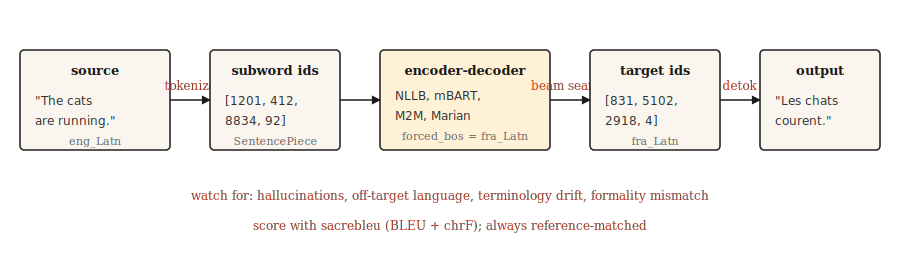

# 机器翻译

> Translation is the 任务 这 paid 面向 NLP research 面向 thirty years 与 keeps paying now.

**类型:** 构建
**语言:** Python
**先修要求:** 说明：Phase 5 · 10 (注意力 Mechanism), Phase 5 · 04 (GloVe, FastText, Subword)
**时间:** 约75分钟

## 问题

一个 模型 reads a 句子 in one language 与 produces a 句子 in another. Length varies. 词 order varies. Some source 词 map to multiple target 词 与 vice versa. Idioms refuse one-to-one mapping. "I miss you" in French is "tu me manques"，literally "you are lacking to me." No 词-level alignment survives 这.

Machine 翻译 is the 任务 这 forced NLP to invent encoder-decoders, 注意力, transformers, 与 eventually the whole LLM paradigm. Every step forward arrived 因为 翻译 质量 was measurable 与 the gap between human 与 machine was stubborn.

本课 skips the 历史 lesson 与 teaches the working 流水线 of 2026: pretrained 多语言 encoder-decoder (NLLB-200 或 mBART), subword 分词, beam search, BLEU 与 chrF 评估, 与 the handful of failure modes 这 still ship to 生产 uncaught.

## 概念



现代 MT is a transformer encoder-decoder trained on parallel 文本. The encoder reads the source in its language's 分词. The decoder generates the target, one subword at a time, using the encoder's 输出 via cross-注意力 (lesson 10). Decoding uses beam search to avoid the greedy-decoding trap. The 输出 is detokenized, detruecased, 与 scored against a reference.

说明：Three operational choices drive real-world MT 质量.

- 说明：**分词器.** SentencePiece BPE trained on a mixed-language 语料库. Shared vocabulary across languages is what enables zero-shot pairs in NLLB.
- 说明：**模型 size.** NLLB-200 distilled 600M fits on a laptop. NLLB-200 3.3B is the published 生产 默认. 54.5B is the research ceiling.
- 说明：**Decoding.** Beam width 4-5 面向 general content. Length penalty to avoid too-短 输出. Constrained decoding when you need terminology consistency.

```figure
seq2seq-alignment
```

## 动手构建

### Step 1: a pretrained MT call

```python
from transformers import AutoTokenizer, AutoModelForSeq2SeqLM

model_id = "facebook/nllb-200-distilled-600M"
tok = AutoTokenizer.from_pretrained(model_id, src_lang="eng_Latn")
model = AutoModelForSeq2SeqLM.from_pretrained(model_id)

src = "The cats are running."
inputs = tok(src, return_tensors="pt")

out = model.generate(
    **inputs,
    forced_bos_token_id=tok.convert_tokens_to_ids("fra_Latn"),
    num_beams=5,
    length_penalty=1.0,
    max_new_tokens=64,
)
print(tok.batch_decode(out, skip_special_tokens=True)[0])
```

```text
Les chats courent.
```

Three things matter here. `src_lang` tells the 分词器 这 script 与 segmentation to apply. `forced_bos_token_id` tells the decoder 这 language to generate. Both are NLLB-specific tricks; mBART 与 M2M-100 use their own conventions 与 they are not interchangeable.

### Step 2: BLEU 与 chrF

BLEU measures n-gram overlap between 输出 与 reference. Four reference n-gram sizes (1-4), geometric mean of precisions, brevity penalty 面向 too-短 输出. The score is in [0, 100]. Commonly used. Frustrating to interpret: 30 BLEU is "usable"; 40 is "good"; 50 is "exceptional"; differences under 1 BLEU are 噪声.

说明：chrF measures character-level F-score. More sensitive to morphologically rich languages 其中 BLEU undercounts matches. Often reported alongside BLEU.

```python
import sacrebleu

hypotheses = ["Les chats courent."]
references = [["Les chats courent."]]

bleu = sacrebleu.corpus_bleu(hypotheses, references)
chrf = sacrebleu.corpus_chrf(hypotheses, references)
print(f"BLEU: {bleu.score:.1f}  chrF: {chrf.score:.1f}")
```

说明：Always use `sacrebleu`. It normalizes 分词 so scores are comparable across papers. Rolling your own BLEU computation is how misleading benchmarks happen.

### 这个 three-tier 评估 hierarchy (2026)

现代 MT 评估 uses three complementary 指标 families. Ship 使用 at least two.

- 说明：**Heuristic** (BLEU, chrF). 快, reference-based, interpretable, insensitive to paraphrase. Use 面向 legacy comparison 与 regression detection.
- **Learned** (COMET, BLEURT, BERTScore). Neural models trained on human judgment; compare 语义 相似度 of 翻译 to source 与 reference. COMET has the highest association 使用 MT research since 2023 与 is the 2026 生产 默认 其中 质量 matters.
- **LLM-as-judge** (reference-free). Prompt a 大 模型 to score translations on fluency, adequacy, tone, cultural appropriateness. GPT-4-as-judge matches human agreement ~80% of the time when the rubric is well designed. Use 面向 开放-ended content 其中 no reference exists.

Practical 2026 stack: `sacrebleu` 面向 BLEU 与 chrF, `unbabel-comet` 面向 COMET, 与 a prompted LLM 面向 the final human-facing signal. Calibrate every 指标 against 50-100 human-labeled examples before trusting it on 生产 数据.

Reference-free metrics (COMET-QE, BLEURT-QE, LLM-as-judge) let you evaluate translations 不使用 a reference, 这 matters 面向 长-tail language pairs 其中 reference translations do not exist.

### Step 3: what breaks in 生产

说明：这个 working 流水线 above will translate fluently 80% of the time 与 silently fail the remaining 20%. Named failure modes:

- **Hallucination.** 模型 invents content 这 was not in the source. 常见 in unfamiliar 领域 vocabulary. Symptom: 输出 is fluent but claims facts the source did not 状态. Mitigation: constrained decoding on 领域 terms, human review on regulated content, monitoring 面向 输出 much longer than input.
- **Off-target 生成.** 模型 translates 到 the 错误 language. NLLB is surprisingly prone to this on rare language pairs. Mitigation: verify `forced_bos_token_id` 与 always decode 使用 a language-ID 模型 check on 输出.
- **Terminology drift.** "Sign up" becomes "s'inscrire" in doc 1 与 "créer un compte" in doc 2. 面向 UI 文本 与 用户-facing strings, consistency matters more than 原始 质量. Mitigation: glossary-constrained decoding 或 post-edit dictionary.
- **Formality mismatch.** French "tu" vs "vous", Japanese politeness levels. The 模型 picks whichever form was more 常见 in 训练. 面向 customer-facing content this is usually 错误. Mitigation: prompt prefix 使用 a formality 词元 if the 模型 supports it, 或 fine-tune a 小 模型 on formal-only corpora.
- 说明：**Length explosion on 短 input.** Very 短 input sentences often produce overlong translations 因为 the length penalty falls off a cliff below ~5 source 词元. Mitigation: hard max-length cap proportional to source length.

### Step 4: fine-tuning 面向 a 领域

Pretrained models are generalists. Legal, medical, 或 game-dialog 翻译 benefits measurably 从 fine-tuning on 领域 parallel 数据. The recipe is not exotic:

```python
from transformers import Trainer, TrainingArguments
from datasets import Dataset

pairs = [
    {"src": "The defendant pleaded guilty.", "tgt": "L'accusé a plaidé coupable."},
]

ds = Dataset.from_list(pairs)


def preprocess(ex):
    return tok(
        ex["src"],
        text_target=ex["tgt"],
        truncation=True,
        max_length=128,
        padding="max_length",
    )


ds = ds.map(preprocess, remove_columns=["src", "tgt"])

args = TrainingArguments(output_dir="out", per_device_train_batch_size=4, num_train_epochs=3, learning_rate=3e-5)
Trainer(model=model, args=args, train_dataset=ds).train()
```

一个 few thousand high-质量 parallel examples beats a few hundred thousand noisy web-scraped ones. 质量 of 训练 数据 is the single largest 生产 lever.

## 投入使用

这个 2026 生产 stack 面向 MT:

|Use case|推荐 starting point|
|---------|---------------------------|
|Any-to-any, 200 languages|`facebook/nllb-200-distilled-600M` (laptop) 或 `nllb-200-3.3B` (生产)|
|English-centric, high 质量, 50 languages|`facebook/mbart-large-50-many-to-many-mmt`|
|短 runs, cheap 推理, English-French/German/Spanish|Helsinki-NLP / Marian models|
|延迟-critical browser-side|ONNX-quantized Marian (~50 MB)|
|Maximum 质量, willing to pay|GPT-4 / Claude / Gemini 使用 翻译 prompts|

LLMs now outperform specialized MT models on several language pairs as of 2026, particularly on idiomatic content 与 长 context. The tradeoff is per-词元 成本 与 延迟. Pick an LLM when context length, stylistic consistency, 或 领域 adaptation via prompting matters more than throughput.

## 交付成果

保存为 `outputs/skill-mt-evaluator.md`:

```markdown
---
name: mt-evaluator
description: Evaluate a machine translation output for shipping.
version: 1.0.0
phase: 5
lesson: 11
tags: [nlp, translation, evaluation]
---

Given a source text and a candidate translation, output:

1. Automatic score estimate. BLEU and chrF ranges you would expect. State whether a reference is available.
2. Five-point human-verifiable check list: (a) content preservation (no hallucinations), (b) correct language, (c) register / formality match, (d) terminology consistency with glossary if provided, (e) no truncation or length explosion.
3. One domain-specific issue to probe. E.g., for legal: named entities and statute citations. For medical: drug names and dosages. For UI: placeholder variables `{name}`.
4. Confidence flag. "Ship" / "Ship with review" / "Do not ship". Tie to the severity of issues found in step 2.

Refuse to ship a translation without a language-ID check on output. Refuse to evaluate without a reference unless the user explicitly opts in to reference-free scoring (COMET-QE, BLEURT-QE). Flag any content over 1000 tokens as likely needing chunked translation.
```

## 练习

1. **Easy.** Translate a 5-句子 English paragraph to French 与 back to English using `nllb-200-distilled-600M`. Measure how close the round-trip is to the original. You should see 语义 preservation 使用 词-choice drift.
2. 说明：**Medium.** Implement a language-ID check on 翻译 outputs using `fasttext lid.176` 或 `langdetect`. Integrate 到 the MT call so off-target generations are caught before returning.
3. **Hard.** Fine-tune `nllb-200-distilled-600M` on a 5,000-pair 领域 语料库 of your choice. Measure BLEU on a held-out set before 与 after fine-tuning. Report 这 kinds of sentences improved 与 这 regressed.

## 关键术语

|Term|What people say|What it actually means|
|------|-----------------|-----------------------|
|BLEU|Translation score|N-gram 精确率 使用 brevity penalty. [0, 100].|
|chrF|Character F-score|说明：Character-level F-score. More sensitive 面向 morphologically rich languages.|
|NMT|Neural MT|说明：Transformer encoder-decoder trained on parallel 文本. The 2017+ 默认.|
|NLLB|No Language Left Behind|Meta's 200-language MT 模型 family.|
|Constrained decoding|Controlled 输出|说明：Force specific 词元 或 n-grams to appear / not appear in the 输出.|
|Hallucination|Invented content|模型 输出 这 is not supported by the source.|

## 延伸阅读

- 说明：[说明：Costa-jussà et al. (2022). No Language Left Behind: Scaling Human-Centered Machine Translation](https://arxiv.org/abs/2207.04672)，the NLLB paper.
- 说明：[说明：Post (2018). A Call 面向 Clarity in Reporting BLEU Scores](https://aclanthology.org/W18-6319/)，why `sacrebleu` is the only 正确 way to report BLEU.
- 说明：[说明：Popović (2015). chrF: character n-gram F-score 面向 automatic MT 评估](https://aclanthology.org/W15-3049/)，the chrF paper.
- 说明：[Hugging Face MT guide](https://huggingface.co/docs/transformers/tasks/translation)，practical fine-tuning walkthrough.
