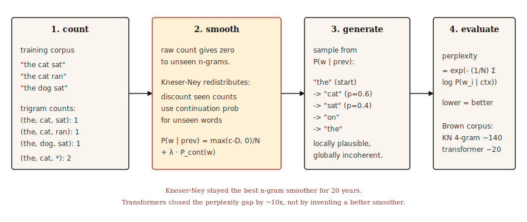

# Transformer 之前的文本生成，N-gram 语言模型

> 说明：如果 a 词 is surprising, the 模型 is bad. Perplexity makes surprise a number. Smoothing keeps it finite.

**类型:** 构建
**语言:** Python
**先修要求:** Phase 5 · 01 (文本 Processing), Phase 2 · 14 (Naive Bayes)
**时间:** 约45分钟

## 问题

Before transformers, before RNNs, before 词 嵌入, a 语言模型 predicted the next 词 by counting how often it followed the previous `n-1` 词. Count "the cat" → "sat" 47 times, "the cat" → "jumped" 12 times, "the cat" → "refrigerator" 0 times. Normalize to get a 概率 分布.

这 is an n-gram 语言模型. It ran every speech recognizer, every spell checker, 与 every phrase-based machine 翻译 系统 从 1980 through 2015. It still runs when you need cheap on-device language modeling.

这个 interesting problem is what to do about unseen n-grams. A 原始 count-based 模型 assigns zero 概率 to anything it has not seen, 这 is catastrophic 因为 sentences are 长 与 almost every 长 句子 contains at least one unseen 序列. Fifty years of smoothing research 固定 这. Kneser-Ney smoothing is the result, 与 现代 deep learning inherited its empirical tradition.

## 概念

说明：

**N-gram 概率:** `P(w_i | w_{i-n+1}, ..., w_{i-1})`. Fix `n` (typically 3 面向 trigrams, 4 面向 4-grams). 计算 从 counts:

```text
P(w | context) = count(context, w) / count(context)
```

**The zero-count problem.** Any n-gram not seen in 训练 gets 概率 zero. A 2007 study on the Brown 语料库 found 这 even a 4-gram 模型 had 30% of held-out 4-grams unseen in 训练. You cannot evaluate on any real 文本 不使用 smoothing.

**说明：Smoothing approaches, in order of sophistication:** 

1. 说明：**Laplace (add-one).** Add 1 to every count. Simple, terrible on rare events.
2. 说明：**Good-Turing.** Reallocate 概率 mass 从 higher-frequency events to unseen ones based on frequency-of-frequencies.
3. 说明：**Interpolation.** Combine n-gram, (n-1)-gram, etc., estimates 使用 tunable weights.
4. 说明：**Backoff.** If n-gram has count zero, fall back to (n-1)-gram. Katz backoff normalizes this.
5. 说明：**Absolute discounting.** Subtract a 固定 discount `D` 从 all counts, redistribute to unseen.
6. **Kneser-Ney.** Absolute discounting plus a clever choice 面向 the lower-order 模型: use *continuation 概率* (how many contexts a 词 appears in) instead of 原始 frequency.

这个 Kneser-Ney insight is deep. "San Francisco" is a 常见 bigram. Unigram "Francisco" appears mostly after "San." Naive absolute discounting gives "Francisco" high unigram 概率 (因为 the count is high). Kneser-Ney notices 这 "Francisco" appears in only one context 与 lowers its continuation 概率 accordingly. Result: a novel bigram ending in "Francisco" gets the appropriate low 概率.

说明：**Evaluation: perplexity.** The exponent of the average negative log-likelihood per 词 on a held-out test set. Lower is better. A perplexity of 100 means the 模型 is as confused as it would be choosing uniformly among 100 词.

```text
perplexity = exp(- (1/N) * Σ log P(w_i | context_i))
```

```figure
ngram-backoff
```

## 动手构建

### Step 1: trigram counts

```python
from collections import Counter, defaultdict


def train_ngram(corpus_tokens, n=3):
    ngrams = Counter()
    contexts = Counter()
    for sentence in corpus_tokens:
        padded = ["<s>"] * (n - 1) + sentence + ["</s>"]
        for i in range(len(padded) - n + 1):
            ctx = tuple(padded[i:i + n - 1])
            word = padded[i + n - 1]
            ngrams[ctx + (word,)] += 1
            contexts[ctx] += 1
    return ngrams, contexts


def raw_probability(ngrams, contexts, context, word):
    ctx = tuple(context)
    if contexts.get(ctx, 0) == 0:
        return 0.0
    return ngrams.get(ctx + (word,), 0) / contexts[ctx]
```

说明：Input is a list of tokenized sentences. 输出 is n-gram counts 与 context counts. `<s>` 与 `</s>` are 句子 boundaries.

### Step 2: Laplace smoothing

```python
def laplace_probability(ngrams, contexts, vocab_size, context, word):
    ctx = tuple(context)
    numerator = ngrams.get(ctx + (word,), 0) + 1
    denominator = contexts.get(ctx, 0) + vocab_size
    return numerator / denominator
```

说明：Add 1 to every count. Smooths but over-allocates mass to unseen events, hurting rare-known events too.

### Step 3: Kneser-Ney (bigram, interpolated)

```python
def kneser_ney_bigram_model(corpus_tokens, discount=0.75):
    unigrams = Counter()
    bigrams = Counter()
    unigram_contexts = defaultdict(set)

    for sentence in corpus_tokens:
        padded = ["<s>"] + sentence + ["</s>"]
        for i, w in enumerate(padded):
            unigrams[w] += 1
            if i > 0:
                prev = padded[i - 1]
                bigrams[(prev, w)] += 1
                unigram_contexts[w].add(prev)

    total_unique_bigrams = sum(len(ctx_set) for ctx_set in unigram_contexts.values())
    continuation_prob = {
        w: len(ctx_set) / total_unique_bigrams for w, ctx_set in unigram_contexts.items()
    }

    context_totals = Counter()
    for (prev, w), count in bigrams.items():
        context_totals[prev] += count

    unique_follow = defaultdict(set)
    for (prev, w) in bigrams:
        unique_follow[prev].add(w)

    def prob(prev, w):
        count = bigrams.get((prev, w), 0)
        denom = context_totals.get(prev, 0)
        if denom == 0:
            return continuation_prob.get(w, 1e-9)
        first_term = max(count - discount, 0) / denom
        lambda_prev = discount * len(unique_follow[prev]) / denom
        return first_term + lambda_prev * continuation_prob.get(w, 1e-9)

    return prob
```

说明：Three moving parts. `continuation_prob` captures "how many different contexts does this 词 appear in?" (the Kneser-Ney innovation). `lambda_prev` is the mass freed by the discount, used to weight the backoff. The final 概率 is the discounted main term plus the weighted continuation term.

### Step 4: generating 文本 使用 sampling

```python
import random


def generate(prob_fn, vocab, prefix, max_len=30, seed=0):
    rng = random.Random(seed)
    tokens = list(prefix)
    for _ in range(max_len):
        candidates = [(w, prob_fn(tokens[-1], w)) for w in vocab]
        total = sum(p for _, p in candidates)
        r = rng.random() * total
        acc = 0.0
        for w, p in candidates:
            acc += p
            if r <= acc:
                tokens.append(w)
                break
        if tokens[-1] == "</s>":
            break
    return tokens
```

Sampling proportional to 概率. Always gives different 输出 per seed. 面向 beam-search-like 输出, pick the argmax at each step (greedy) 与 add a 小 randomness knob (temperature).

### Step 5: perplexity

```python
import math


def perplexity(prob_fn, sentences):
    total_log_prob = 0.0
    total_tokens = 0
    for sentence in sentences:
        padded = ["<s>"] + sentence + ["</s>"]
        for i in range(1, len(padded)):
            p = prob_fn(padded[i - 1], padded[i])
            total_log_prob += math.log(max(p, 1e-12))
            total_tokens += 1
    return math.exp(-total_log_prob / total_tokens)
```

Lower is better. 面向 Brown 语料库, a well-tuned 4-gram KN 模型 hits perplexity around 140. A transformer LM hits 15-30 on the same test set. The gap is about 10x. 这 gap is why the field moved on.

## 投入使用

- 说明：**Classical NLP teaching.** The clearest exposure to smoothing, MLE, 与 perplexity you can get.
- 说明：**KenLM.** Production n-gram 库. Used as a rescorer in speech 与 MT systems 其中 low 延迟 matters.
- 说明：**On-device autocomplete.** Trigram models in keyboards. Still.
- 说明：**Baselines.** Always 计算 an n-gram LM perplexity before declaring your neural LM good. If your transformer does not beat KN by a wide margin, something is 错误.

## 交付成果

保存为 `outputs/prompt-lm-baseline.md`:

```markdown
---
name: lm-baseline
description: Build a reproducible n-gram language model baseline before training a neural LM.
phase: 5
lesson: 16
---

Given a corpus and target use (next-word prediction, rescoring, perplexity baseline), output:

1. N-gram order. Trigram for general English, 4-gram if corpus is large, 5-gram for speech rescoring.
2. Smoothing. Modified Kneser-Ney is the default; Laplace only for teaching.
3. Library. `kenlm` for production, `nltk.lm` for teaching, roll your own only to learn.
4. Evaluation. Held-out perplexity with consistent tokenization between train and test sets.

Refuse to report perplexity computed with different tokenization between systems being compared — perplexity numbers are comparable only under identical tokenization. Flag OOV rate in test set; KN handles OOV poorly unless you reserve a special <UNK> token during training.
```

## 练习

1. 说明：**Easy.** Train a trigram LM on a 1,000-句子 Shakespeare 语料库. Generate 20 sentences. They will be locally plausible but globally incoherent. This is the canonical demo.
2. 说明：**Medium.** Implement perplexity 面向 your KN 模型 on a held-out Shakespeare split. Compare against Laplace. You should see KN lower perplexity by 30-50%.
3. **Hard.** Build a trigram spell corrector: given a misspelled 词 与 its context, generate corrections 与 rank by context 概率 under the LM. Evaluate on the Birkbeck spelling 语料库 (public).

## 关键术语

|Term|What people say|What it actually means|
|------|-----------------|-----------------------|
|N-gram|词 序列|序列 of `n` consecutive 词元.|
|Smoothing|Avoiding zeros|说明：Reallocating 概率 mass so unseen events get non-zero 概率.|
|Perplexity|LM 质量 指标|`exp(-average log-prob)` on held-out 数据. Lower is better.|
|Backoff|Fallback to shorter context|说明：如果 trigram count is zero, use bigram. Katz backoff formalizes this.|
|Kneser-Ney|Best smoothing 面向 n-grams|说明：Absolute discounting + continuation 概率 面向 the lower-order 模型.|
|Continuation 概率|KN-specific|说明：`P(w)` weighted by number of contexts `w` appears in, not by 原始 count.|

## 延伸阅读

- 说明：[说明：Jurafsky 与 Martin，Speech 与 Language Processing, Chapter 3 (2026 draft)](https://web.stanford.edu/~jurafsky/slp3/3.pdf)，the canonical treatment of n-gram LMs 与 smoothing.
- 说明：[说明：Chen 与 Goodman (1998). An Empirical Study of Smoothing Techniques 面向 Language Modeling](https://dash.harvard.edu/handle/1/25104739)，the paper 这 settled Kneser-Ney as the best n-gram smoother.
- 说明：[说明：Kneser 与 Ney (1995). Improved Backing-off 面向 M-gram Language Modeling](https://ieeexplore.ieee.org/document/479394)，the original KN paper.
- 说明：[KenLM](https://kheafield.com/code/kenlm/)，快 生产 n-gram LM, still used in 2026 面向 延迟-sensitive applications.
