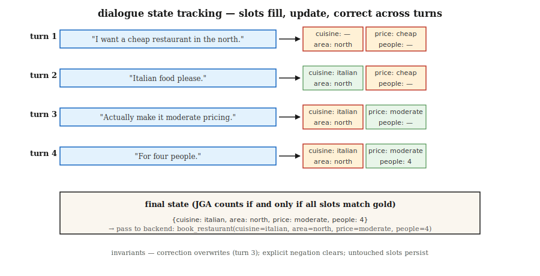

# 对话状态跟踪

> 说明："I want a cheap restaurant in the north... actually make it moderate... 与 add Italian." Three turns, three 状态 updates. DST keeps the 槽位-值 dict in sync so the booking works.

**类型:** 构建
**语言:** Python
**先修要求:** Phase 5 · 17 (Chatbots), Phase 5 · 20 (Structured Outputs)
**时间:** 约75分钟

## 问题

在 a 任务-oriented 对话 系统, the 用户's goal is encoded as a set of 槽位-值 pairs: `{cuisine: italian, area: north, price: moderate}`. Every 用户 turn can add, change, 或 remove a 槽位. The 系统 must read the whole conversation 与 输出 the 当前 状态 correctly.

Get a single 槽位 错误 与 the 系统 books the 错误 restaurant, schedules the 错误 flight, 或 charges the 错误 card. DST is the hinge between what the 用户 said 与 what the backend executes.

为什么 it still matters in 2026 despite LLMs:

- 说明：Compliance-sensitive domains (banking, healthcare, airline booking) require 确定性 槽位 values, not free-form 生成.
- 说明：Tool-use agents still need 槽位 resolution before calling APIs.
- 说明：Multi-turn correction is harder than it looks: "actually no, make it Thursday."

这个 现代 流水线: classical DST concepts + LLM extractors + structured-输出 guardrails.

## 概念



**任务 structure.** A 模式 defines domains (restaurant, hotel, taxi) 与 their 槽位 (cuisine, area, price, people). Each 槽位 can be empty, filled 使用 a 值 从 a 封闭 set (price: {cheap, moderate, expensive}), 或 a free-form 值 (name: "The Copper Kettle").

**Two DST formulations.**

- **Classification.** 面向 each (槽位, candidate_value) pair, predict yes/no. Works 面向 封闭-vocab 槽位. Standard pre-2020.
- **Generation.** 给定 对话, generate 槽位 values as free 文本. Works 面向 开放-vocab 槽位. The 现代 默认.

**Metric.** Joint Goal 准确率 (JGA)，the fraction of turns 其中 *every* 槽位 is 正确. All-或-nothing. MultiWOZ 2.4 leaderboard tops around 83% in 2026.

**Architectures.**

1. 说明：**Rule-based (槽位 regex + keyword).** Strong 基线 面向 narrow domains. Debuggable.
2. 说明：**TripPy / BERT-DST.** Copy-based 生成 使用 BERT encoding. Pre-LLM standard.
3. **LDST (LLaMA + LoRA).** Instruction-tuned LLM 使用 领域-槽位 prompting. Reaches ChatGPT-level 质量 on MultiWOZ 2.4.
4. 说明：**Ontology-free (2024–26).** Skip the 模式; generate 槽位 names 与 values directly. Handles 开放 domains.
5. **Prompt + structured 输出 (2024–26).** LLM 使用 Pydantic 模式 + constrained decoding. 5 lines of code, 生产-ready.

### 经典失败模式

- 说明：**Co-reference across turns.** "Let's stay 使用 the first option." Needs to resolve 这 option.
- 说明：**Over-write vs append.** 用户 says "add Italian." Do you replace cuisine 或 append?
- 说明：**Implicit confirmations.** "OK cool"，did 这 accept the offered booking?
- 说明：**Correction.** "Actually make it 7 pm." Must update time 不使用 clearing other 槽位.
- 说明：**Coreference to previous 系统 utterance.** "Yes, 这 one." 这 "这"?

## 动手构建

### Step 1: rule-based 槽位 extractor

说明：See `code/main.py`. Regex + synonym dictionaries cover 70% of canonical utterances in narrow domains:

```python
CUISINE_SYNONYMS = {
    "italian": ["italian", "pasta", "pizza", "italy"],
    "chinese": ["chinese", "chow mein", "noodles"],
}


def extract_cuisine(utterance):
    for canonical, synonyms in CUISINE_SYNONYMS.items():
        if any(syn in utterance.lower() for syn in synonyms):
            return canonical
    return None
```

说明：Brittle outside the canonical vocabulary. Works 面向 确定性 槽位 confirmations.

### Step 2: 状态 update loop

```python
def update_state(state, utterance):
    new_state = dict(state)
    for slot, extractor in SLOT_EXTRACTORS.items():
        value = extractor(utterance)
        if value is not None:
            new_state[slot] = value
    for slot in NEGATION_CLEARS:
        if is_negated(utterance, slot):
            new_state[slot] = None
    return new_state
```

Three invariants:

- Never reset a 槽位 the 用户 did not touch.
- 说明：Explicit negation ("never mind the cuisine") must clear.
- 说明：用户 correction ("actually...") must overwrite, not append.

### Step 3: LLM-driven DST 使用 structured 输出

```python
from pydantic import BaseModel
from typing import Literal, Optional
import instructor

class RestaurantState(BaseModel):
    cuisine: Optional[Literal["italian", "chinese", "indian", "thai", "any"]] = None
    area: Optional[Literal["north", "south", "east", "west", "center"]] = None
    price: Optional[Literal["cheap", "moderate", "expensive"]] = None
    people: Optional[int] = None
    day: Optional[str] = None


def llm_dst(history, llm):
    prompt = f"""You track the slot values of a restaurant booking across turns.
Dialogue so far:
{render(history)}

Update the state based on the latest user turn. Output only the JSON state."""
    return llm(prompt, response_model=RestaurantState)
```

Instructor + Pydantic guarantees a 有效 状态 object. No regex, no 模式 mismatches, no hallucinated 槽位.

### Step 4: JGA 评估

```python
def joint_goal_accuracy(predicted_states, gold_states):
    correct = sum(1 for p, g in zip(predicted_states, gold_states) if p == g)
    return correct / len(predicted_states)
```

Calibrate: what fraction of turns does the 系统 get ALL 槽位 right? 面向 MultiWOZ 2.4, top 2026 systems: 80-83%. Your in-领域 系统 should exceed 这 on your narrow vocabulary 或 the LLM 基线 beats you.

### Step 5: handling correction

```python
CORRECTION_CUES = {"actually", "no wait", "on second thought", "change that to"}


def is_correction(utterance):
    return any(cue in utterance.lower() for cue in CORRECTION_CUES)
```

On a detected correction, overwrite the last-updated 槽位 rather than appending. Hard to get right 不使用 LLM help. The 现代 pattern: always let the LLM regenerate the whole 状态 从 历史 rather than incrementally updating，this naturally handles corrections.

## 陷阱

- **Full-历史 regeneration 成本.** Letting the LLM regenerate 状态 each turn costs O(n²) total 词元. Cap 历史 或 summarize older turns.
- **Schema drift.** Adding new 槽位 post-hoc breaks old 训练 数据. Version your 模式.
- 说明：**Case sensitivity.** "Italian" vs "italian" vs "ITALIAN"，normalize everywhere.
- **Implicit inheritance.** If the 用户 has previously specified "面向 4 people," a new request 面向 a different time should not clear people. Always pass the full 历史.
- **Free-form vs 封闭-set.** Names, times, 与 addresses need free-form 槽位; cuisines 与 areas are 封闭. Mix both in the 模式.

## 投入使用

这个 2026 stack:

|Situation|Approach|
|-----------|----------|
|Narrow 领域 (one 或 two intents)|Rule-based + regex|
|Broad 领域, labeled 数据 available|LDST (LLaMA + LoRA on MultiWOZ-style 数据)|
|Broad 领域, no labels, prod-ready|LLM + Instructor + Pydantic 模式|
|Spoken / voice|ASR + normalizer + LLM-DST|
|Multi-领域 booking flow|Schema-guided LLM 使用 per-领域 Pydantic models|
|Compliance-sensitive|说明：Rule-based primary, LLM fallback 使用 confirmation flow|

## 交付成果

保存为 `outputs/skill-dst-designer.md`:

```markdown
---
name: dst-designer
description: Design a dialogue state tracker — schema, extractor, update policy, evaluation.
version: 1.0.0
phase: 5
lesson: 29
tags: [nlp, dialogue, task-oriented]
---

Given a use case (domain, languages, vocab openness, compliance needs), output:

1. Schema. Domain list, slots per domain, open vs closed vocabulary per slot.
2. Extractor. Rule-based / seq2seq / LLM-with-Pydantic. Reason.
3. Update policy. Regenerate-whole-state / incremental; correction handling; negation handling.
4. Evaluation. Joint Goal Accuracy on a held-out dialogue set, slot-level precision/recall, confusion on the hardest slot.
5. Confirmation flow. When to explicitly ask the user to confirm (destructive actions, low-confidence extractions).

Refuse LLM-only DST for compliance-sensitive slots without a rule-based secondary check. Refuse any DST that cannot roll back a slot on user correction. Flag schemas without version tags.
```

## 练习

1. 说明：**Easy.** Build the rule-based 状态 tracker in `code/main.py` 面向 3 槽位 (cuisine, area, price). Test on 10 hand-crafted dialogues. Measure JGA.
2. 说明：**Medium.** Same dataset 使用 Instructor + Pydantic + a 小 LLM. Compare JGA. Inspect the hardest turns.
3. **Hard.** Implement both 与 route: rule-based primary, LLM fallback when rule-based emits <2 槽位 使用 confidence. Measure the combined JGA 与 推理 成本 per turn.

## 关键术语

|Term|What people say|What it actually means|
|------|-----------------|-----------------------|
|DST|Dialogue 状态 tracking|Maintain the 槽位-值 dict across 对话 turns.|
|Slot|Unit of 用户 intent|说明：Named parameter the backend needs (cuisine, date).|
|领域|这个 任务 area|Restaurant, hotel, taxi，sets of 槽位.|
|JGA|Joint Goal 准确率|Fraction of turns 其中 every 槽位 is 正确. All-或-nothing.|
|MultiWOZ|这个 基准|Multi-领域 WOZ dataset; standard DST 评估.|
|Ontology-free DST|No 模式|Generate 槽位 names 与 values directly, no 固定 list.|
|Correction|"Actually..."|Turn 这 overwrites a previously-filled 槽位.|

## 延伸阅读

- 说明：[说明：Budzianowski et al. (2018). MultiWOZ，A 大-Scale Multi-领域 Wizard-of-Oz](https://arxiv.org/abs/1810.00278)，the canonical 基准.
- 说明：[说明：Feng et al. (2023). Towards LLM-driven Dialogue State Tracking (LDST)](https://arxiv.org/abs/2310.14970)，LLaMA + LoRA instruction tuning 面向 DST.
- 说明：[说明：Heck et al. (2020). TripPy，A Triple Copy Strategy 面向 值 Independent Neural Dialog State Tracking](https://arxiv.org/abs/2005.02877)，the copy-based DST workhorse.
- 说明：[说明：King, Flanigan (2024). Unsupervised End-to-End 任务-Oriented Dialogue 使用 LLMs](https://arxiv.org/abs/2404.10753)，EM-based unsupervised TOD.
- 说明：[MultiWOZ leaderboard](https://github.com/budzianowski/multiwoz)，canonical DST results.
