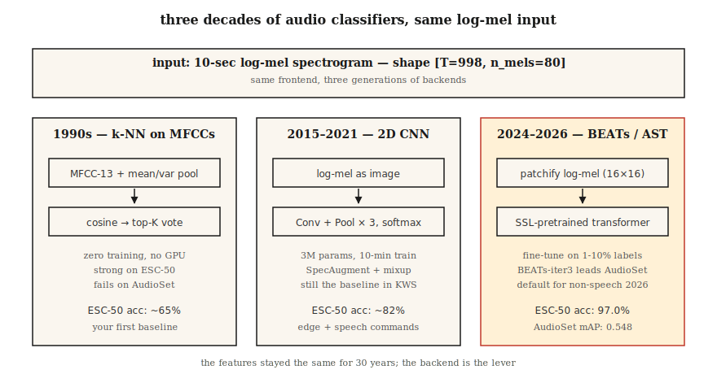

# 音频分类，从 MFCC 上的 k-NN 到 AST 与 BEATs

> 从“狗叫还是警笛”到“这是什么语言”，都是音频分类。特征通常是 Mel，架构每十年变一次，评估仍然离不开 AUC、F1 和逐类召回。

**Type:** Build
**Languages:** Python
**Prerequisites:** Phase 6 · 02（频谱图与 Mel），Phase 3 · 06（CNNs），Phase 5 · 08（文本 CNNs 与 RNNs）
**Time:** ~75 分钟

## 问题

音频分类看起来像普通分类，但数据很少均衡。一个类别可能有几万个片段，另一个只有几十个。背景噪声、录音设备和说话人也会偷走模型注意力。

把任务做好，关键不是从零写一个更大的网络，而是选对特征、预训练 backbone、增强、采样策略和指标。

## 概念



传统路线是 MFCC 统计量加 k-NN、SVM 或随机森林。它容易解释，但上限低。

CNN 路线把 log-mel 当图像处理，适合中等数据量。AST 把频谱图切成 patch，用 Transformer 建模。BEATs、Audio-MAE、Whisper encoder 等自监督 backbone 是 2026 默认起点。

类不平衡是真正难点。多标签任务要用 mAP，互斥多分类可用 top-1，长尾任务要看 macro F1 和逐类召回。

## Build It

### Step 1: 读取与检查

先把音频转换为 log-mel 或 MFCC。

```python
def featurize_mfcc(signal, sr, n_mfcc=13, n_mels=40, frame_len=400, hop=160):
    mag = stft_magnitude(signal, frame_len, hop)
    fb = mel_filterbank(n_mels, frame_len, sr)
    mels = apply_filterbank(mag, fb)
    log = log_transform(mels)
    return [dct_ii(frame, n_mfcc) for frame in log]
```

### Step 2: 构建核心表示

做固定长度摘要，如均值、方差、分位数，构造 k-NN baseline。

```python
def summarize(mfcc_frames):
    n = len(mfcc_frames[0])
    mean = [sum(f[i] for f in mfcc_frames) / len(mfcc_frames) for i in range(n)]
    var = [
        sum((f[i] - mean[i]) ** 2 for f in mfcc_frames) / len(mfcc_frames) for i in range(n)
    ]
    return mean + var
```

### Step 3: 运行 baseline

实现 k-NN，得到一个可解释的最低基线。

```python
def cosine(a, b):
    dot = sum(x * y for x, y in zip(a, b))
    na = math.sqrt(sum(x * x for x in a)) or 1e-12
    nb = math.sqrt(sum(x * x for x in b)) or 1e-12
    return dot / (na * nb)

def knn_classify(q, bank, labels, k=5):
    sims = sorted(range(len(bank)), key=lambda i: -cosine(q, bank[i]))[:k]
    votes = Counter(labels[i] for i in sims)
    return votes.most_common(1)[0][0]
```

### Step 4: 升级生产方案

升级为 log-mel 上的 2D CNN，加入 SpecAugment 和 mixup。

```python
import torch.nn as nn

class AudioCNN(nn.Module):
    def __init__(self, n_mels=80, n_classes=50):
        super().__init__()
        self.body = nn.Sequential(
            nn.Conv2d(1, 32, 3, padding=1), nn.ReLU(), nn.MaxPool2d(2),
            nn.Conv2d(32, 64, 3, padding=1), nn.ReLU(), nn.MaxPool2d(2),
            nn.Conv2d(64, 128, 3, padding=1), nn.ReLU(),
            nn.AdaptiveAvgPool2d(1),
        )
        self.head = nn.Linear(128, n_classes)

    def forward(self, x):  # x: (B, 1, T, n_mels)
        return self.head(self.body(x).flatten(1))
```

### Step 5: 验证边界

真正交付时，从 BEATs 或 AST 预训练模型微调开始。

```python
from transformers import ASTFeatureExtractor, ASTForAudioClassification

ext = ASTFeatureExtractor.from_pretrained("MIT/ast-finetuned-audioset-10-10-0.4593")
model = ASTForAudioClassification.from_pretrained(
    "MIT/ast-finetuned-audioset-10-10-0.4593",
    num_labels=50,
    ignore_mismatched_sizes=True,
)

inputs = ext(audio, sampling_rate=16000, return_tensors="pt")
logits = model(**inputs).logits
```

## Use It

少于 10k 标注片段时，不要从零训练大模型。环境声用 BEATs 或 AST，语音语言识别可用 Whisper encoder，关键词检测可以用轻量 CNN。多标签必须报告 mAP，speaker 相关任务必须做说话人不重叠切分。

## Ship It

保存为 `outputs/skill-classifier-designer.md`。这个 skill 帮你根据音频分类任务选择架构、增强、类别均衡策略和评估指标。

## Exercises

1. 用 MFCC 均值和方差实现 k-NN 音频分类 baseline。
2. 在 log-mel 上训练一个小 CNN，并加入时间 mask 和频率 mask。
3. 把同一任务改为多标签，比较 top-1 和 mAP 为什么给出不同结论。

## Key Terms

| 术语 | 常见说法 | 实际含义 |
|------|----------|----------|
| 音频分类 | 给音频片段打标签 | 可以是单标签或多标签。 |
| mAP | 平均精度均值 | 多标签分类的主指标。 |
| macro F1 | 逐类 F1 的平均 | 比整体 accuracy 更能暴露长尾失败。 |
| SpecAugment | 频谱图增强 | 遮盖时间或频率区域。 |
| BEATs | 音频自监督 backbone | 2026 常用分类起点。 |

## Further Reading

- [Gong, Chung, Glass (2021). AST: Audio Spectrogram Transformer](https://arxiv.org/abs/2104.01778)，the architecture of record from 2021–2024.
- [Chen et al. (2022, rev. 2024). BEATs: Audio Pre-Training with Acoustic Tokenizers](https://arxiv.org/abs/2212.09058)，the 2024+ default.
- [Park et al. (2019). SpecAugment](https://arxiv.org/abs/1904.08779)，the dominant audio augmentation.
- [Piczak (2015). ESC-50 dataset](https://github.com/karolpiczak/ESC-50)，50-class benchmark that lives on.
- [Gemmeke et al. (2017). AudioSet](https://research.google.com/audioset/)，632-class YouTube taxonomy; still the gold standard.
