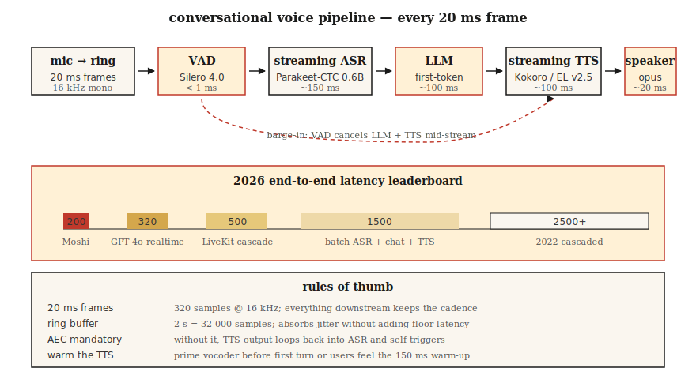

# 实时音频处理

> 批处理流水线处理一个文件。实时流水线必须在下一个 20 毫秒到来前处理完当前 20 毫秒。每个对话式 AI、广播系统和电话 bot 都由这个延迟预算决定生死。

**Type:** Build
**Languages:** Python
**Prerequisites:** Phase 6 · 02（频谱图），Phase 6 · 04（ASR），Phase 6 · 07（TTS）
**Time:** ~75 分钟

## 问题

实时音频是背压、jitter、丢帧、VAD、流式 STT、流式 TTS 和打断处理的系统问题。模型质量只是一部分。

如果任一阶段缓存整句，就不再是实时系统。你需要 per-stage P50/P95/P99，而不是平均延迟。

## 概念



音频通常按 10 到 30 ms chunk 进入。环形缓冲区吸收 jitter，VAD 决定是否送入 ASR，STT 流式输出 token，LLM 流式生成，TTS 尽快吐出首段音频。

常见坑包括阻塞 callback、Python GIL、音频设备 buffer 过大、采样率不匹配、TTS 不流式、打断时没取消旧响应。

```figure
nyquist-aliasing
```

## Build It

### Step 1: 读取与检查

实现 ring buffer，固定容量保存最近音频。

```python
import collections

class RingBuffer:
    def __init__(self, capacity):
        self.buf = collections.deque(maxlen=capacity)
    def write(self, frame):
        self.buf.extend(frame)
    def read(self, n):
        return [self.buf.popleft() for _ in range(min(n, len(self.buf)))]
    def level(self):
        return len(self.buf)
```

### Step 2: 构建核心表示

加入 VAD gate，只在检测到语音时聚合 turn。

```python
def simple_energy_vad(frame, threshold=0.01):
    return sum(x * x for x in frame) / len(frame) > threshold ** 2
```

### Step 3: 运行 baseline

接入流式 ASR，如 Parakeet-CTC 或 Deepgram。

```python
import torch
vad, _ = torch.hub.load("snakers4/silero-vad", "silero_vad")
is_speech = vad(torch.tensor(frame), 16000).item() > 0.5
```

### Step 4: 升级生产方案

实现 interruption handler，用户说话时取消当前 LLM 和 TTS 输出。

```python
# Parakeet-CTC-0.6B streaming via NeMo
from nemo.collections.asr.models import EncDecCTCModelBPE
asr = EncDecCTCModelBPE.from_pretrained("nvidia/parakeet-ctc-0.6b")
# chunk_ms=320 ms, look_ahead_ms=80 ms
for chunk in audio_stream():
    partial_text = asr.transcribe_streaming(chunk)
    print(partial_text, end="\r")
```

## Use It

WebRTC 适合浏览器和低 jitter 对话，WebSocket 适合自控客户端，SIP 适合电话。STT、LLM、TTS 都必须支持 streaming。观测要按阶段打直方图，并记录 false interruption。

## Ship It

保存为 `outputs/skill-realtime-pipeline.md`。这个 skill 帮你选择传输、VAD、流式 STT、LLM、流式 TTS 和编排方案。

## Exercises

1. 实现 1 秒 ring buffer，并测试溢出策略。
2. 把 VAD 输出变成 turn start 和 turn end 事件。
3. 模拟用户打断，确认旧 TTS 播放被取消。

## Key Terms

| 术语 | 常见说法 | 实际含义 |
|------|----------|----------|
| 实时音频 | 按 chunk 处理音频 | 处理速度必须快于输入速度。 |
| jitter | 到达时间抖动 | 网络或设备导致 chunk 不均匀。 |
| ring buffer | 环形缓冲区 | 固定容量保存最近样本。 |
| TTFA | 首段音频延迟 | TTS 流式关键指标。 |
| 打断 | barge-in | 用户说话时取消助手输出。 |

## Further Reading

- [Macháček et al. (2023). Whisper-Streaming](https://arxiv.org/abs/2307.14743)，chunked near-streaming Whisper.
- [Kyutai (2024). Moshi](https://kyutai.org/Moshi.pdf)，full-duplex 200 ms latency.
- [LiveKit Agents framework (2024)](https://docs.livekit.io/agents/)，production audio agent orchestration.
- [Silero VAD repo](https://github.com/snakers4/silero-vad)，sub-1 ms VAD, Apache 2.0.
- [WebRTC AEC3 paper](https://webrtc.googlesource.com/src/+/main/modules/audio_processing/aec3/)，echo cancellation under open source.
