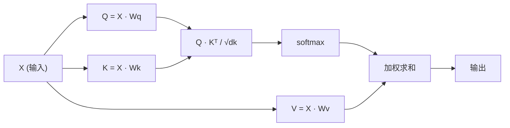

# 从零实现自注意力

> 注意力是一张软查询表，每个词都会问 “谁对我重要？”，并从数据中学会答案。

**Type:** Build
**Languages:** Python
**Prerequisites:** Phase 3 (Deep Learning Core), Phase 5 Lesson 10 (Sequence-to-Sequence)
**Time:** ~90 minutes

## Learning Objectives

- 只用 NumPy 从零实现缩放点积自注意力，包括 query/key/value 投影和 softmax 加权求和
- 构建多头注意力层，完成头拆分、并行注意力计算和结果拼接
- 追踪注意力矩阵如何捕获词元关系，并解释为什么除以 sqrt(d_k) 可以避免 softmax 饱和
- 应用因果掩码，把双向注意力转换为自回归的解码器式注意力

## The Problem

RNN 一次处理一个词元。到第 50 个词元时，第 1 个词元的信息已经被压过 50 次。长距离依赖会被挤进固定大小隐藏状态，这个瓶颈不是 LSTM 门控就能完全解决的。

2014 年 Bahdanau 注意力论文给出修复方式, 让解码器回看每个编码器位置，并决定哪些位置对当前步骤重要。但它仍然接在 RNN 上。2017 年 “Attention Is All You Need” 提出更尖锐的问题, 如果注意力是唯一机制呢？没有循环，没有卷积，只有注意力。

自注意力让序列中每个位置在一个并行步骤里关注其他所有位置。这正是 Transformer 快、可扩展并占据主导地位的原因。

## The Concept

### The Database Lookup Analogy

把注意力想成一次软数据库查询:

```text
Traditional database:
  Query: "capital of France"  -->  exact match  -->  "Paris"

Attention:
  Query: "capital of France"  -->  similarity to ALL keys  -->  weighted blend of ALL values
```

每个词元生成三个向量:

- **Query (Q)**: “我在找什么？”
- **Key (K)**: “我包含什么？”
- **Value (V)**: “如果被选中，我提供什么信息？”

一个 query 与所有 key 的点积产生注意力分数。高分意味着 “这个 key 匹配我的 query”。这些分数为 value 加权。输出是 value 的加权和。

### Q, K, V Computation

每个词元嵌入都会通过三个学习到的权重矩阵投影:

```text
Input embeddings (sequence of n tokens, each d-dimensional):

  X = [x1, x2, x3, ..., xn]       shape: (n, d)

Three weight matrices:

  Wq  shape: (d, dk)
  Wk  shape: (d, dk)
  Wv  shape: (d, dv)

Projections:

  Q = X @ Wq    shape: (n, dk)      each token's query
  K = X @ Wk    shape: (n, dk)      each token's key
  V = X @ Wv    shape: (n, dv)      each token's value
```

对单个词元来说:

```text
             Wq
  x_i ------[*]------> q_i    "What am I looking for?"
       |
       |     Wk
       +----[*]------> k_i    "What do I contain?"
       |
       |     Wv
       +----[*]------> v_i    "What do I offer?"
```

### The Attention Matrix

得到所有词元的 Q、K、V 后，注意力分数形成矩阵:

```text
Scores = Q @ K^T    shape: (n, n)
```

每一行表示一个词元对整个序列的注意力。逐行看，一个 query 扫过所有 key，softmax 把分数变成权重，上下文向量就是 value 的加权混合。

```figure
attention-matrix
```
```

### Why Scale?

点积会随维度 dk 变大。如果 dk = 64，点积可能达到几十，把 softmax 推入梯度消失区域。修复方式是除以 sqrt(dk)。

```text
Scaled scores = (Q @ K^T) / sqrt(dk)
```

这会把值保持在 softmax 能产生有用梯度的范围。

### Softmax Turns Scores into Weights

Softmax 把原始分数转换成每一行上的概率分布:

```text
Raw scores for q1:   [2.1, 0.3, 0.1, 0.8, 0.2]
                            |
                         softmax
                            |
Attention weights:   [0.52, 0.09, 0.07, 0.14, 0.08]   (sums to ~1.0)
```

现在每个词元都有一组权重，表示它应该关注其他每个词元多少。

### Weighted Sum of Values

每个词元的最终输出是所有 value 向量的加权和:

```text
output_i = sum( attention_weight[i][j] * v_j  for all j )

For token 1:
  output_1 = 0.52 * v1 + 0.09 * v2 + 0.07 * v3 + 0.14 * v4 + 0.08 * v5
```

### Full Pipeline



一行公式:

```text
Attention(Q, K, V) = softmax( Q @ K^T / sqrt(dk) ) @ V
```

```figure
softmax-attention-scaling
```
```

## Build It

### Step 1: Softmax from scratch

Softmax 把原始 logits 转成概率。为数值稳定性先减去最大值。

```python
import numpy as np

def softmax(x):
    shifted = x - np.max(x, axis=-1, keepdims=True)
    exp_x = np.exp(shifted)
    return exp_x / np.sum(exp_x, axis=-1, keepdims=True)

logits = np.array([2.0, 1.0, 0.1])
print(f"logits:  {logits}")
print(f"softmax: {softmax(logits)}")
print(f"sum:     {softmax(logits).sum():.4f}")
```

### Step 2: Scaled dot-product attention

核心函数。接收 Q、K、V 矩阵，返回注意力输出和权重矩阵。

```python
def scaled_dot_product_attention(Q, K, V):
    dk = Q.shape[-1]
    scores = Q @ K.T / np.sqrt(dk)
    weights = softmax(scores)
    output = weights @ V
    return output, weights
```

### Step 3: Self-attention class with learned projections

完整自注意力模块包含 Wq、Wk、Wv 权重矩阵，并使用类似 Xavier 的缩放初始化。

```python
class SelfAttention:
    def __init__(self, d_model, dk, dv, seed=42):
        rng = np.random.default_rng(seed)
        scale = np.sqrt(2.0 / (d_model + dk))
        self.Wq = rng.normal(0, scale, (d_model, dk))
        self.Wk = rng.normal(0, scale, (d_model, dk))
        scale_v = np.sqrt(2.0 / (d_model + dv))
        self.Wv = rng.normal(0, scale_v, (d_model, dv))
        self.dk = dk

    def forward(self, X):
        Q = X @ self.Wq
        K = X @ self.Wk
        V = X @ self.Wv
        output, weights = scaled_dot_product_attention(Q, K, V)
        return output, weights
```

### Step 4: Run it on a sentence

为一句话创建假嵌入，观察注意力权重。

```python
sentence = ["The", "cat", "sat", "on", "the", "mat"]
n_tokens = len(sentence)
d_model = 8
dk = 4
dv = 4

rng = np.random.default_rng(42)
X = rng.normal(0, 1, (n_tokens, d_model))

attn = SelfAttention(d_model, dk, dv, seed=42)
output, weights = attn.forward(X)

print("Attention weights (each row: where that token looks):\n")
print(f"{'':>6}", end="")
for token in sentence:
    print(f"{token:>6}", end="")
print()

for i, token in enumerate(sentence):
    print(f"{token:>6}", end="")
    for j in range(n_tokens):
        w = weights[i][j]
        print(f"{w:6.3f}", end="")
    print()
```

### Step 5: Visualize attention with ASCII heatmap

把注意力权重映射为字符，快速查看模式。

```python
def ascii_heatmap(weights, tokens, chars=" ░▒▓█"):
    n = len(tokens)
    print(f"\n{'':>6}", end="")
    for t in tokens:
        print(f"{t:>6}", end="")
    print()

    for i in range(n):
        print(f"{tokens[i]:>6}", end="")
        for j in range(n):
            level = int(weights[i][j] * (len(chars) - 1) / weights.max())
            level = min(level, len(chars) - 1)
            print(f"{'  ' + chars[level] + '   '}", end="")
        print()

ascii_heatmap(weights, sentence)
```

## Use It

PyTorch 的 `nn.MultiheadAttention` 做的正是我们构建的东西，外加多头拆分和输出投影:

```python
import torch
import torch.nn as nn

d_model = 8
n_heads = 2
seq_len = 6

mha = nn.MultiheadAttention(embed_dim=d_model, num_heads=n_heads, batch_first=True)

X_torch = torch.randn(1, seq_len, d_model)

output, attn_weights = mha(X_torch, X_torch, X_torch)

print(f"Input shape:            {X_torch.shape}")
print(f"Output shape:           {output.shape}")
print(f"Attention weight shape: {attn_weights.shape}")
print(f"\nAttn weights (averaged over heads):")
print(attn_weights[0].detach().numpy().round(3))
```

关键差别是多头注意力并行运行多个注意力函数。每个函数有自己的 Q、K、V 投影，大小为 dk = d_model / n_heads，然后把结果拼接。这让模型能同时关注不同类型的关系。

## Ship It

本课产物:

- `outputs/prompt-attention-explainer.md`, 一个用数据库查询类比解释注意力的 prompt

## Exercises

1. 修改 `scaled_dot_product_attention`，接受可选 mask 矩阵，在 softmax 前把某些位置设为负无穷。这就是因果/解码器掩码的工作方式。
2. 从零实现多头注意力, 把 Q、K、V 拆成 `n_heads` 份，对每份运行注意力，拼接后通过最终权重矩阵 Wo 投影。
3. 取两句长度相同但内容不同的句子，用同一个 SelfAttention 实例处理，比较注意力模式。什么变了？什么没变？

## Key Terms

| Term | What people say | What it actually means |
|------|----------------|----------------------|
| Query (Q) | “问题向量” | 输入的学习投影，表示这个词元正在寻找什么信息。 |
| Key (K) | “标签向量” | 表示这个词元包含什么信息的学习投影，用来与 query 匹配。 |
| Value (V) | “内容向量” | 携带实际信息的学习投影，根据注意力分数被聚合。 |
| Scaled dot-product attention | “注意力公式” | softmax(QK^T / sqrt(dk)) @ V，缩放防止高维 softmax 饱和。 |
| Self-attention | “词元看自己和别人” | Q、K、V 都来自同一序列的注意力，让每个位置关注所有其他位置。 |
| Attention weights | “关注多少” | 对位置的概率分布，由缩放点积上的 softmax 产生。 |
| Multi-head attention | “并行注意力” | 使用不同投影运行多个注意力函数，再拼接结果以获得更丰富表示。 |

## Further Reading

- [Attention Is All You Need (Vaswani et al., 2017)](https://arxiv.org/abs/1706.03762), 原始 Transformer 论文。
- [The Illustrated Transformer (Jay Alammar)](https://jalammar.github.io/illustrated-transformer/), 对完整架构最好的可视化讲解之一。
- [The Annotated Transformer (Harvard NLP)](https://nlp.seas.harvard.edu/annotated-transformer/), 逐行 PyTorch 实现和解释。
