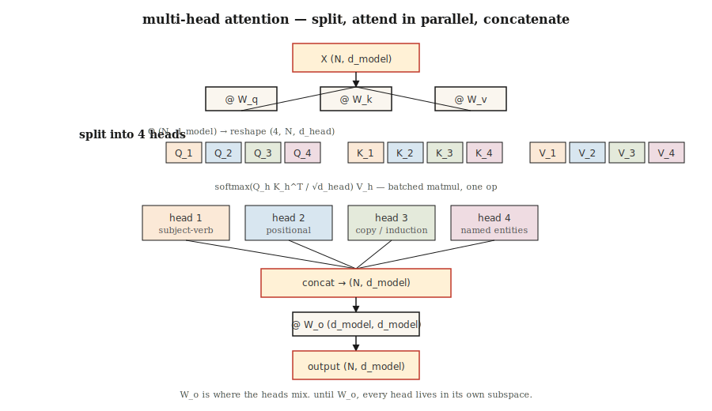

# 多头注意力

> 一个注意力头一次学习一种关系。八个头就能同时学习八种关系。

**Type:** Build
**Languages:** Python
**Prerequisites:** Phase 7 · 02 (Self-Attention from Scratch)
**Time:** ~75 minutes

## The Problem

本节说明原始问题和为什么需要当前架构。核心动机来自英文源文档, 但这里用简体中文重新表述: 传统做法在并行性、长距离依赖、内存或任务适配上有明显瓶颈；本课的 Transformer 组件通过注意力、位置编码、残差、前馈、缓存或稀疏化等机制解决这些瓶颈。

## The Concept



概念上，把输入先表示成词元序列，再让模型在序列位置之间交换信息。注意力负责跨位置混合，前馈网络负责逐位置变换，残差连接保留信息流，归一化保持训练稳定。不同 lesson 只是在这个骨架上改变一个关键部件。

| Variant | Q heads | K/V heads | Used by |
|---------|---------|-----------|---------|
| Multi-head (MHA) | N | N | GPT-2, BERT, T5 |
| Multi-query (MQA) | N | 1 | PaLM, Falcon |
| Grouped-query (GQA) | N | G (e.g. N/8) | Llama 2 70B, Llama 3+, Qwen 2+, Mistral |
| Multi-head latent (MLA) | N | compressed to low-rank | DeepSeek-V2, V3 |

```figure
multihead-split
```
```

```figure

## Build It
```

跟随 `code/main.py`。实现保持小而透明，优先展示机制而不是追求生产性能。保留英文源中的代码片段和命令，确保读者能按同样路径运行。

### Step 1: split heads from the single-head attention we already have

这一小步把概念落到可执行代码中。重点检查张量形状、掩码方向、缓存增长、路由选择或采样输出是否符合预期。

### Step 2: run scaled-dot-product attention per head

这一小步把概念落到可执行代码中。重点检查张量形状、掩码方向、缓存增长、路由选择或采样输出是否符合预期。

### Step 3: Grouped-Query Attention variant

这一小步把概念落到可执行代码中。重点检查张量形状、掩码方向、缓存增长、路由选择或采样输出是否符合预期。

### Step 4: probe what each head learned

这一小步把概念落到可执行代码中。重点检查张量形状、掩码方向、缓存增长、路由选择或采样输出是否符合预期。

```python
def split_heads(X, n_heads):
    n, d = X.shape
    d_head = d // n_heads
    return X.reshape(n, n_heads, d_head).transpose(1, 0, 2)  # (heads, n, d_head)

def combine_heads(H):
    h, n, d_head = H.shape
    return H.transpose(1, 0, 2).reshape(n, h * d_head)
```

```python
def mha_forward(X, W_q, W_k, W_v, W_o, n_heads):
    Q = X @ W_q
    K = X @ W_k
    V = X @ W_v
    Qh = split_heads(Q, n_heads)         # (heads, n, d_head)
    Kh = split_heads(K, n_heads)
    Vh = split_heads(V, n_heads)
    scores = Qh @ Kh.transpose(0, 2, 1) / np.sqrt(Qh.shape[-1])
    weights = softmax(scores, axis=-1)
    out = weights @ Vh                    # (heads, n, d_head)
    concat = combine_heads(out)
    return concat @ W_o, weights
```

```python
def gqa_project(X, W, n_kv_heads, n_heads):
    kv = split_heads(X @ W, n_kv_heads)       # (kv_heads, n, d_head)
    repeat = n_heads // n_kv_heads
    return np.repeat(kv, repeat, axis=0)      # (n_heads, n, d_head)
```


## Use It

在生产代码中通常直接使用 PyTorch、HuggingFace、vLLM、Flash Attention 或对应模型库。保留 API 名称、模型名、命令和文件路径不翻译，方便复制运行。

```python
import torch.nn as nn

mha = nn.MultiheadAttention(embed_dim=512, num_heads=8, batch_first=True)
```

```python
from torch.nn.functional import scaled_dot_product_attention

# scaled_dot_product_attention auto-dispatches Flash Attention on CUDA.
# For GQA, pass Q of shape (B, n_heads, N, d_head) and K,V of shape
# (B, n_kv_heads, N, d_head). PyTorch handles the repeat.
out = scaled_dot_product_attention(q, k, v, is_causal=True, enable_gqa=True)
```

| Model size | d_model | n_heads | d_head |
|------------|---------|---------|--------|
| Small (~125M) | 768 | 12 | 64 |
| Base (~350M) | 1024 | 16 | 64 |
| Large (~1B) | 2048 | 16 | 128 |
| Frontier (~70B) | 8192 | 64 | 128 |


## Ship It

查看 `outputs/skill-mha-configurator.md`。这个产物把本课方法转成可复用的 skill 或 prompt，用于真实项目中的架构选择、配置检查、推理优化或调参。

## Exercises

1. **Easy.** 运行本课代码，确认输出形状、掩码、路由或缓存行为与预期一致。
2. **Medium.** 修改一个关键超参数或组件，比较结果变化，并解释原因。
3. **Hard.** 把本课机制接入一个小型真实任务，测量质量、速度或内存取舍。

## Key Terms

| Term | What people say | What it actually means |
|------|-----------------|-----------------------|
| Head | "A single attention circuit" | One Q/K/V projection of dimension `d_head = d_model / n_heads` with its own attention matrix. |
| d_head | "Head dimension" | Per-head hidden width; almost always 64 or 128 in production. |
| Split / combine | "Reshape tricks" | `(N, d_model) ↔ (n_heads, N, d_head)` reshape+transpose around attention. |
| W_o | "Output projection" | `(d_model, d_model)` matrix applied after concatenating heads; where heads mix. |
| MQA | "One KV head" | Multi-Query Attention: single shared K/V projection. Smallest KV cache, some quality loss. |
| GQA | "The default since Llama 2" | Grouped-Query Attention with `n_kv_heads < n_heads`; repeats to match Q. |
| MLA | "DeepSeek's trick" | Multi-head Latent Attention: K,V compressed to low-rank latent, decompressed at attend time. |
| Induction head | "The circuit behind in-context learning" | A pair of heads that detect previous occurrences and copy what followed them. |

## Further Reading

- [Vaswani et al. (2017). Attention Is All You Need §3.2.2](https://arxiv.org/abs/1706.03762) — the original multi-head spec.
- [Shazeer (2019). Fast Transformer Decoding: One Write-Head is All You Need](https://arxiv.org/abs/1911.02150) — the MQA paper.
- [Ainslie et al. (2023). GQA: Training Generalized Multi-Query Transformer Models from Multi-Head Checkpoints](https://arxiv.org/abs/2305.13245) — how to convert MHA to GQA after training.
- [DeepSeek-AI (2024). DeepSeek-V2 Technical Report](https://arxiv.org/abs/2405.04434) — MLA and why it beats MHA/GQA on cache memory.
- [Olsson et al. (2022). In-context Learning and Induction Heads](https://transformer-circuits.pub/2022/in-context-learning-and-induction-heads/index.html) — mechanistic look at what heads actually do.
```
