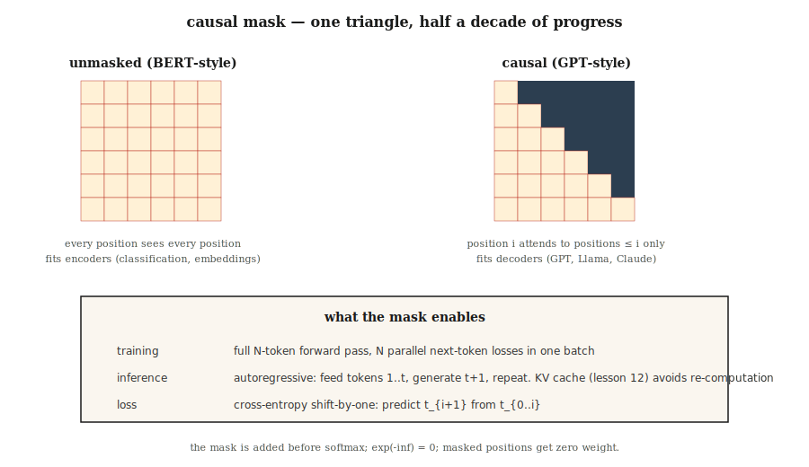

# GPT, 因果语言建模

> BERT 能看两边。GPT 只能看过去。三角掩码是现代 AI 中最重要的一行代码之一。

**Type:** Build
**Languages:** Python
**Prerequisites:** Phase 7 · 02 (Self-Attention), Phase 7 · 05 (Full Transformer), Phase 7 · 06 (BERT)
**Time:** ~75 minutes

## The Problem

本节说明原始问题和为什么需要当前架构。核心动机来自英文源文档, 但这里用简体中文重新表述: 传统做法在并行性、长距离依赖、内存或任务适配上有明显瓶颈；本课的 Transformer 组件通过注意力、位置编码、残差、前馈、缓存或稀疏化等机制解决这些瓶颈。

## The Concept



概念上，把输入先表示成词元序列，再让模型在序列位置之间交换信息。注意力负责跨位置混合，前馈网络负责逐位置变换，残差连接保留信息流，归一化保持训练稳定。不同 lesson 只是在这个骨架上改变一个关键部件。

| Method | What it does | When to use |
|--------|--------------|-------------|
| Greedy | Argmax every step | Deterministic tasks, code completion |
| Temperature | Divide logits by T, sample | Creative tasks, higher T = more diversity |
| Top-k | Sample from top-k tokens only | Kills low-probability tails |
| Top-p (nucleus) | Sample from smallest set with cumulative prob ≥ p | 2020+ default; adapts to distribution shape |
| Min-p | Keep tokens with `p > min_p * max_p` | 2024+; better at rejecting long tails than top-p |
| Speculative decoding | Draft model proposes N tokens, big model verifies | 2–3× latency reduction at same quality |

```
M[i, j] = 0       if j <= i
M[i, j] = -inf    if j > i
```

```figure
causal-mask
```
```

```figure

## Build It
```

跟随 `code/main.py`。实现保持小而透明，优先展示机制而不是追求生产性能。保留英文源中的代码片段和命令，确保读者能按同样路径运行。

### Step 1: the causal mask

这一小步把概念落到可执行代码中。重点检查张量形状、掩码方向、缓存增长、路由选择或采样输出是否符合预期。

### Step 2: a 2-layer GPT-ish model

这一小步把概念落到可执行代码中。重点检查张量形状、掩码方向、缓存增长、路由选择或采样输出是否符合预期。

### Step 3: next-token prediction, end-to-end

这一小步把概念落到可执行代码中。重点检查张量形状、掩码方向、缓存增长、路由选择或采样输出是否符合预期。

### Step 4: sampling

这一小步把概念落到可执行代码中。重点检查张量形状、掩码方向、缓存增长、路由选择或采样输出是否符合预期。

```python
def causal_mask(n):
    return [[0.0 if j <= i else float("-inf") for j in range(n)] for i in range(n)]
```


## Use It

在生产代码中通常直接使用 PyTorch、HuggingFace、vLLM、Flash Attention 或对应模型库。保留 API 名称、模型名、命令和文件路径不翻译，方便复制运行。

```python
from transformers import AutoModelForCausalLM, AutoTokenizer
model = AutoModelForCausalLM.from_pretrained("meta-llama/Llama-3.2-3B-Instruct")
tok = AutoTokenizer.from_pretrained("meta-llama/Llama-3.2-3B-Instruct")

prompt = "Attention is all you need because"
inputs = tok(prompt, return_tensors="pt")
out = model.generate(
    **inputs,
    max_new_tokens=64,
    temperature=0.7,
    top_p=0.9,
    do_sample=True,
)
print(tok.decode(out[0]))
```


## Ship It

查看 `outputs/skill-sampling-tuner.md`。这个产物把本课方法转成可复用的 skill 或 prompt，用于真实项目中的架构选择、配置检查、推理优化或调参。

## Exercises

1. **Easy.** 运行本课代码，确认输出形状、掩码、路由或缓存行为与预期一致。
2. **Medium.** 修改一个关键超参数或组件，比较结果变化，并解释原因。
3. **Hard.** 把本课机制接入一个小型真实任务，测量质量、速度或内存取舍。

## Key Terms

| Term | What people say | What it actually means |
|------|-----------------|-----------------------|
| Causal mask | "The triangle" | Upper-triangular `-inf` matrix added to attention scores so position `i` only sees positions `≤ i`. |
| Next-token prediction | "The loss" | Cross-entropy of the model's distribution against the true next token at every position. |
| Autoregressive | "Generate one at a time" | Feed output back as input; parallelism only during training, not during generation. |
| Logits | "Pre-softmax scores" | Raw output of the LM head before softmax; sampling happens on these. |
| Temperature | "Creativity knob" | Divide logits by T; T→0 = greedy, T→∞ = uniform. |
| Top-p | "Nucleus sampling" | Truncate distribution to smallest set summing to ≥p; sample from what remains. |
| Min-p | "Better than top-p" | Keep tokens where `p ≥ min_p × max_p`; adapts cutoff to sharpness of distribution. |
| Speculative decoding | "Draft + verify" | Cheap model proposes N tokens; big model verifies in parallel. |
| Teacher forcing | "Training trick" | During training, feed the true previous token, not the model's prediction. Standard for every seq2seq LM. |

## Further Reading

- [Radford et al. (2018). Improving Language Understanding by Generative Pre-Training](https://cdn.openai.com/research-covers/language-unsupervised/language_understanding_paper.pdf) — GPT-1.
- [Radford et al. (2019). Language Models are Unsupervised Multitask Learners](https://cdn.openai.com/better-language-models/language_models_are_unsupervised_multitask_learners.pdf) — GPT-2.
- [Brown et al. (2020). Language Models are Few-Shot Learners](https://arxiv.org/abs/2005.14165) — GPT-3 and in-context learning.
- [Leviathan, Kalman, Matias (2023). Fast Inference from Transformers via Speculative Decoding](https://arxiv.org/abs/2211.17192) — spec decoding paper.
- [HuggingFace `modeling_llama.py`](https://github.com/huggingface/transformers/blob/main/src/transformers/models/llama/modeling_llama.py) — canonical causal-LM reference code.
```
