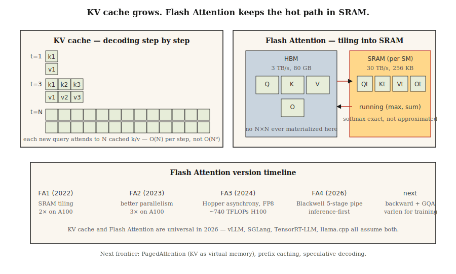

# KV 缓存、Flash Attention 与推理优化

> 训练是并行且受 FLOP 约束。推理是串行且受内存约束。瓶颈不同，技巧也不同。

**Type:** Build
**Languages:** Python
**Prerequisites:** Phase 7 · 02 (Self-Attention), Phase 7 · 05 (Full Transformer), Phase 7 · 07 (GPT)
**Time:** ~75 minutes

## The Problem

本节说明原始问题和为什么需要当前架构。核心动机来自英文源文档, 但这里用简体中文重新表述: 传统做法在并行性、长距离依赖、内存或任务适配上有明显瓶颈；本课的 Transformer 组件通过注意力、位置编码、残差、前馈、缓存或稀疏化等机制解决这些瓶颈。

## The Concept



概念上，把输入先表示成词元序列，再让模型在序列位置之间交换信息。注意力负责跨位置混合，前馈网络负责逐位置变换，残差连接保留信息流，归一化保持训练稳定。不同 lesson 只是在这个骨架上改变一个关键部件。

| Version | Year | Key change | Speedup on reference hardware |
|---------|------|-----------|-------------------------------|
| Flash 1 | 2022 | Tiled SRAM kernel | 2× on A100 |
| Flash 2 | 2023 | Better parallelism, causal-first ordering | 3× on A100 |
| Flash 3 | 2024 | Hopper asynchrony, FP8 | 1.5–2× on H100 (~740 TFLOPs FP16) |
| Flash 4 | 2026 | Blackwell 5-stage pipeline, software exp2 | Inference-first (forward only initially) |

```
bytes_per_token_per_layer = 2 * d_head * dtype_size
                          ^
                          K and V
```

```
per token per layer = 2 * 128 * 2 = 512 bytes
per token (32 layers) = 16 KB
per 32K context = 512 MB
```

```
per token per layer = 2 * 8 * 128 * 2 = 4096 bytes (4 KB)
per 32K context = 10.4 GB
```

```figure
kv-cache-sizer
```
```

```
S = Q @ K^T          (HBM read, N×N, HBM write)
P = softmax(S)       (HBM read, HBM write)
O = P @ V            (HBM read, HBM write)
```

```
for each block of Q (tile size ~128 × 128):
    load Q_tile into SRAM
    for each block of K, V:
        load K_tile, V_tile into SRAM
        compute S_tile = Q_tile @ K_tile^T     (SRAM)
        running softmax aggregation             (SRAM)
        accumulate into O_tile                  (SRAM)
    write O_tile to HBM
```

```figure
flash-attention-memory
```
```

```figure
```figure

## Build It
```

跟随 `code/main.py`。实现保持小而透明，优先展示机制而不是追求生产性能。保留英文源中的代码片段和命令，确保读者能按同样路径运行。

### Step 1: KV cache

这一小步把概念落到可执行代码中。重点检查张量形状、掩码方向、缓存增长、路由选择或采样输出是否符合预期。

### Step 2: tiled softmax

这一小步把概念落到可执行代码中。重点检查张量形状、掩码方向、缓存增长、路由选择或采样输出是否符合预期。

### Step 3: compare naive vs cached decoding on 100-token generation

这一小步把概念落到可执行代码中。重点检查张量形状、掩码方向、缓存增长、路由选择或采样输出是否符合预期。

```python
class KVCache:
    def __init__(self, n_layers, n_heads, d_head):
        self.K = [[[] for _ in range(n_heads)] for _ in range(n_layers)]
        self.V = [[[] for _ in range(n_heads)] for _ in range(n_layers)]

    def append(self, layer, head, k, v):
        self.K[layer][head].append(k)
        self.V[layer][head].append(v)

    def read(self, layer, head):
        return self.K[layer][head], self.V[layer][head]
```

```python
def tiled_softmax_dot(q, K, V, tile=4):
    """Flash-attention-style softmax(qK^T)V with running max/sum."""
    m = float("-inf")
    s = 0.0
    out = [0.0] * len(V[0])
    for start in range(0, len(K), tile):
        k_block = K[start:start + tile]
        v_block = V[start:start + tile]
        scores = [sum(qi * ki for qi, ki in zip(q, k)) for k in k_block]
        new_m = max(m, *scores)
        exp_old = math.exp(m - new_m) if m != float("-inf") else 0.0
        exp_new = [math.exp(sc - new_m) for sc in scores]
        s = s * exp_old + sum(exp_new)
        for j in range(len(out)):
            out[j] = out[j] * exp_old + sum(e * v[j] for e, v in zip(exp_new, v_block))
        m = new_m
    return [o / s for o in out]
```


## Use It

在生产代码中通常直接使用 PyTorch、HuggingFace、vLLM、Flash Attention 或对应模型库。保留 API 名称、模型名、命令和文件路径不翻译，方便复制运行。

```python
# HuggingFace transformers auto-enables KV cache on decoder-only generate().
from transformers import AutoModelForCausalLM
model = AutoModelForCausalLM.from_pretrained(
    "meta-llama/Llama-3.2-3B",
    attn_implementation="flash_attention_2",  # use FA3 if Hopper
    torch_dtype="bfloat16",
)
# generate() uses KV cache automatically
```

```bash
pip install vllm
vllm serve meta-llama/Llama-3.1-70B-Instruct \
    --tensor-parallel-size 4 \
    --max-model-len 32768 \
    --enable-prefix-caching \
    --kv-cache-dtype fp8
```


## Ship It

查看 `outputs/skill-inference-optimizer.md`。这个产物把本课方法转成可复用的 skill 或 prompt，用于真实项目中的架构选择、配置检查、推理优化或调参。

## Exercises

1. **Easy.** 运行本课代码，确认输出形状、掩码、路由或缓存行为与预期一致。
2. **Medium.** 修改一个关键超参数或组件，比较结果变化，并解释原因。
3. **Hard.** 把本课机制接入一个小型真实任务，测量质量、速度或内存取舍。

## Key Terms

| Term | What people say | What it actually means |
|------|-----------------|-----------------------|
| KV cache | "The trick that makes decoding fast" | Stored K and V from every prefix token; new queries attend to them instead of recomputing. |
| HBM | "GPU main memory" | High Bandwidth Memory; 80 GB on H100, 192 GB on B200. ~3 TB/s bandwidth. |
| SRAM | "On-chip memory" | Per-SM fast memory, ~256 KB per SM on H100. ~30 TB/s bandwidth. |
| Flash Attention | "Tiled attention kernel" | Computes attention without materializing N×N in HBM. |
| Continuous batching | "No-wait batching" | Swap finished sequences out, new ones in, without draining the batch. |
| PagedAttention | "vLLM's headline" | KV cache allocated in fixed blocks with a page table; eliminates fragmentation. |
| Prefix caching | "Reuse long prompts" | Cache KV for a shared prefix across requests; major cost cut for agents. |
| Speculative decoding | "Draft + verify" | Cheap draft model proposes tokens; big model verifies k in one pass. |

## Further Reading

- [Dao et al. (2022). FlashAttention: Fast and Memory-Efficient Exact Attention with IO-Awareness](https://arxiv.org/abs/2205.14135) — Flash 1.
- [Dao (2023). FlashAttention-2: Faster Attention with Better Parallelism and Work Partitioning](https://arxiv.org/abs/2307.08691) — Flash 2.
- [Shah et al. (2024). FlashAttention-3: Fast and Accurate Attention with Asynchrony and Low-precision](https://arxiv.org/abs/2407.08608) — Flash 3.
- [FlashAttention-4 release notes (Dao-AILab, 2026)](https://github.com/Dao-AILab/flash-attention) — Blackwell 5-stage pipeline and the software-exp2 trick; read the repo README for the forward-only launch caveats this lesson mentions.
- [Kwon et al. (2023). Efficient Memory Management for Large Language Model Serving with PagedAttention](https://arxiv.org/abs/2309.06180) — vLLM paper.
- [Leviathan et al. (2023). Fast Inference from Transformers via Speculative Decoding](https://arxiv.org/abs/2211.17192) — spec decoding.
- [Li et al. (2024). EAGLE: Speculative Sampling Requires Rethinking Feature Uncertainty](https://arxiv.org/abs/2401.15077) — EAGLE-1/2 paper for the integrated-draft approach the lesson cites.
- [Cai et al. (2024). Medusa: Simple LLM Inference Acceleration Framework with Multiple Decoding Heads](https://arxiv.org/abs/2401.10774) — the Medusa approach referenced alongside EAGLE.
- [vLLM docs — PagedAttention](https://docs.vllm.ai/en/latest/design/kernel/paged_attention.html) — the canonical deep dive on the 16-token block and page-table design.
```
