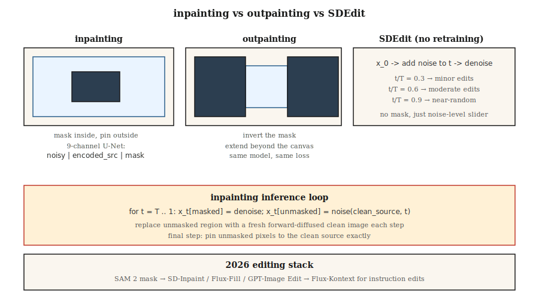

# 修复、修复和图像编辑

> 文本到图像创造新事物。修复旧的。在制作过程中，70% 的收费图像工作是编辑，交换背景、删除徽标、扩展画布、重新生成一只手。修复是扩散得以维持的地方。

**类型：** 建造
**语言：** Python
**先修：** 阶段 8 · 07（潜在 Diffusion），阶段 8 · 08（ControlNet 和 LoRA）
**时间：** 〜75分钟

## 问题

客户发送了一张完美的产品照片，背景中有一个分散注意力的标志。您想要擦除标志并让其他所有内容保持像素相同。您无法从头开始运行文本到图像 - 结果将具有不同的颜色、不同的照明、不同的产品角度。您想要“仅”重新生成遮罩区域，并且希望重新生成尊重周围的环境。

那就是修复。变种：

- **修复。** 在蒙版内重新生成，保留外部像素。
- **Outpainting。** 在蒙版外部（或画布之外）重新生成，保留在内部。
- **图像编辑。** 重新生成整个图像，但保持原始图像的语义或结构保真度（SDEdit、InstructPix2Pix）。

2026 年的每条扩散管道都会附带修复模式。 Flux.1-填充、Stable Diffusion 修复、SDXL-修复、DALL-E 3 编辑。它们的工作原理相同。

## 概念



### 天真的方法（以及为什么它是错误的）

使用蒙版运行标准文本到图像。在每个采样步骤中，用前向扩散的干净图像替换噪声潜伏的未遮蔽区域。它的效果……很糟糕。边界伪影会渗透，因为模型没有有关遮罩区域中内容的信息。

### 正确的修复模型

训练一个修改后的 U-Net，它需要 9 个输入通道而不是 4 个：

```
input = concat([ noisy_latent (4ch), encoded_image (4ch), mask (1ch) ], dim=channel)
```

额外的通道是 VAE 编码源图像的副本加上单通道掩模。在训练时，您随机屏蔽图像的区域并训练模型以仅对屏蔽区域进行去噪，而未屏蔽的区域则作为干净的条件信号给出。推理时，模型可以“看到”屏蔽区域周围的内容并产生连贯的完成结果。

SD-Inpaint、SDXL-Inpaint、Flux-Fill 均使用此 9 通道（或模拟）输入。扩散器 `StableDiffusionInpaintPipeline`、`FluxFillPipeline`。

### SDEdit (Meng et al., 2022) — 免费编辑

向源图像添加噪声，直至某个中间 `t`，然后使用新提示运行从 `t` 到 0 的反向链。无需再培训。选择起始 `t` 用保真度换取创作自由：

- `t/T = 0.3` → 与源几乎相同，风格略有变化
- `t/T = 0.6` → 适度编辑，保留粗糙结构
- `t/T = 0.9` → 由近噪声、最小源保留生成

### InstructPix2Pix（布鲁克斯等人，2023）

微调 `(input_image, instruction, output_image)` 三元组上的扩散模型。在推理时，以输入图像和文本指令为条件（“使其日落”、“添加一条龙”）。两种CFG比例：图像比例和文本比例。

### 重新绘制（Lugmayr 等人，2022）

保持标准的无条件扩散模型。在每个反向步骤中，重新采样，偶尔跳回到噪声较大的状态并重新生成。避免边界伪影。当您没有经过训练的修复模型时使用。

## 构建它

`code/main.py` 在 5 维数据上实现了玩具一维修复方案。我们在 5 维混合数据上训练 DDPM，其中每个样本都是来自两个集群之一的 5 个浮点数。在推理时，我们“屏蔽”5 个维度中的 2 个，在每一步注入未屏蔽的三个维度的噪声前向版本，并仅重新生成屏蔽的维度。

### 第 1 步：5 维 DDPM 数据

```python
def sample_data(rng):
    cluster = rng.choice([0, 1])
    center = [-1.0] * 5 if cluster == 0 else [1.0] * 5
    return [c + rng.gauss(0, 0.2) for c in center], cluster
```

### 第 2 步：在所有 5 个暗度上训练降噪器

标准DDPM。 Net 输出 5-D 噪声输入的 5-D 噪声预测。

### 步骤 3：推理时，掩码感知反向

```python
def inpaint_step(x_t, mask, clean_image, alpha_bars, t, rng):
    # replace unmasked dims with a freshly noised version of the clean source
    a_bar = alpha_bars[t]
    for i in range(len(x_t)):
        if not mask[i]:
            x_t[i] = math.sqrt(a_bar) * clean_image[i] + math.sqrt(1 - a_bar) * rng.gauss(0, 1)
    # ...then run the normal reverse step on x_t
```

这是一种简单的方法，适用于玩具一维数据。真实图像修复使用 9 通道输入，因为纹理一致性更重要。

### 第四步：外画

修复是用反转的蒙版进行修复：遮盖新的（以前不存在的）画布，用原始画布填充其余部分。相同的培训目标。

## 常见陷阱

- **接缝。** 这种幼稚的方法会留下可见的边界，因为渐变信息不会流过遮罩。修复：将蒙版扩大 8-16 像素，或使用适当的修复模型。
- **掩模泄漏。** 如果调节图像的未掩模区域质量低或有噪声，则会污染掩模内的生成物。稍微去噪或模糊。
- **CFG 与掩模尺寸相互作用。** 小掩模上的高 CFG = 饱和斑块。减少小幅编辑的 CFG。
- **SD​​Edit 保真度悬崖。** 从 `t/T = 0.5` 到 `t/T = 0.6` 可能会丢失主体的身份。清扫和检查点。
- **提示不匹配。** 提示应描述*整个*图像，而不仅仅是新内容。 “一只猫坐在椅子上”而不是“一只猫”。

## 使用它

| 任务 | 管道 |
|------|----------|
| 移除物体、小掩模 | SD-Inpaint 或 Flux-Fill，标准提示 |
| 替换天空 | SD-Inpaint +“日落时的蓝天” |
| 扩展画布 | SDXL Outpaint 模式（8px 羽化）或 Flux-使用 Outpaint 蒙版填充 |
| 手/脸再生 | SD-Inpaint 提示重新描述主题 + ControlNet-Openpose |
| 改变一个地区的风格 | SDEdit at `t/T=0.5` 关于遮罩区域 |
| “让它日落” | InstructPix2Pix 或 Flux-Kontext |
| 背景更换 | SAM 掩模 → SD-Inpaint |
| 超高保真 | Flux-Fill 或 GPT-Image（托管）适用于最困难的情况 |

SAM（Meta 的 Segment Anything，2023）+ 扩散修复是 2026 背景去除管道。 SAM 2 (2024) 适用于视频。

## 交付它

保存`outputs/skill-editing-pipeline.md`。 Skill 采用原始图像 + 编辑描述 + 可选掩模（或 SAM 提示）并输出：掩模生成方法、基本模型、CFG 比例（图像 + 文本）、SDEdit-t 或修复模式以及 QA 检查表。

## 练习

1. **简单。** 在 `code/main.py` 中，将屏蔽尺寸的分数从 0.2 更改为 0.8。修复质量（蒙版暗淡中的残留）在多大程度上等于无条件生成？
2. **中。** 实施重新绘制：每第 10 个反向步骤，跳回 5 个步骤（添加噪声）并重新降噪。测量是否减少了掩模边缘处的边界残留。
3. **困难。** 使用 Hugging Face 扩散器进行比较：SD 1.5 Inpaint + ControlNet-Openpose 与 Flux.1-Fill 在 20 个面部再生任务上的比较。分别对姿势依从性和身份保留进行评分。

## 关键术语

| 学期 | 人们怎么说 | 它实际上意味着什么 |
|------|-----------------|-----------------------|
| 修复 | “填坑” | 在面具内再生；保留外部像素。 |
| 外画 | “扩展画布” | 在画布外重新生成；留在里面。 |
| 9通道U-Net | “正确的修复模型” | U-Net 与`吵闹\| 编码源\| mask`作为输入。 |
| SD编辑 | “具有噪声级别的 Img2img” | 噪音时间为`t`，用新的提示去噪。 |
| 指导Pix2Pix | “纯文本编辑” | 对（图像、指令、输出）三元组进行微调扩散。 |
| 重画 | “没有再培训” | 反转期间定期重新噪音以减少接缝。 |
| 萨姆 | “分割任何东西” | 通过点击或框生成掩码；与修补配对。 |
| Flux-Kontext | “根据上下文进行编辑” | Flux 变体接受参考图像+编辑指令。 |

## 制作说明：编辑管道对延迟敏感

编辑图像的用户期望不到 5 秒的往返时间。 1024² 的 30 步 SDXL-Inpaint 在 L4 上需要 3-4 秒，加上 SAM 掩模生成（约 200 毫秒）和 VAE encode/decode（合计约 500 毫秒）。在生产框架中，这是 TTFT 限制而不是吞吐量限制 - 第 1 批，低并发性，最小化每个阶段：

- **SAM-H 速度较慢。** 1024² 的 SAM-H 约为 200 ms； SAM-ViT-B 约为 40 毫秒，质量损失较小。 SAM 2（视频）增加了时间开销；请勿将其用于单图像编辑。
- **尽可能跳过编码。** `pipe.image_processor.preprocess(img)` 编码为潜在变量。如果您有上一代的潜伏（通常在迭代编辑 UI 中），请直接通过 `latents=...` 传递它们以跳过一个 VAE 编码。
- **掩模膨胀对吞吐量也很重要。** 小掩模意味着大部分 U-Net 前向传播被浪费（无论如何，未掩模的像素都会被钳制）。 `diffusers`' `StableDiffusionInpaintPipeline` 运行完整的 U-Net；只有 9 通道正确修复变体利用屏蔽计算。
- **Flux-Kontext 是 2025 年的答案。** `(source_image, instruction)` 上的单前向传递 — 没有单独的掩模，没有 SDEdit 噪声扫描。在 H100 上，它可以在大约 1.5 秒内完成编辑。建筑教训：折叠舞台。

## 延伸阅读

- [Lugmayr 等人。 （2022）。重新绘制：使用去噪 Diffusion 概率模型](https://arxiv.org/abs/2201.09865) 进行修复 — 免训练修复。
- [孟等人。 （2022）。 SDEdit：使用随机微分方程引导图像合成和编辑](https://arxiv.org/abs/2108.01073) — SDEdit。
- [布鲁克斯、霍林斯基、埃夫罗斯 (2023)。 InstructPix2Pix](https://arxiv.org/abs/2211.09800) — 文本指令编辑。
- [基里洛夫等人。 （2023）。 Segment Anything](https://arxiv.org/abs/2304.02643) — SAM，掩模源。
- [拉维等人。 （2024）。 SAM 2：分割图像和视频中的任何内容](https://arxiv.org/abs/2408.00714) — 视频 SAM。
- [赫兹等人。 （2022）。使用交叉注意力控制进行提示到提示图像编辑](https://arxiv.org/abs/2208.01626) — 注意力级别编辑。
- [黑森林实验室（2024）。 Flux.1-Fill 和 Flux.1-Kontext](https://blackforestlabs.ai/flux-1-tools/) — 2024 年工具。
