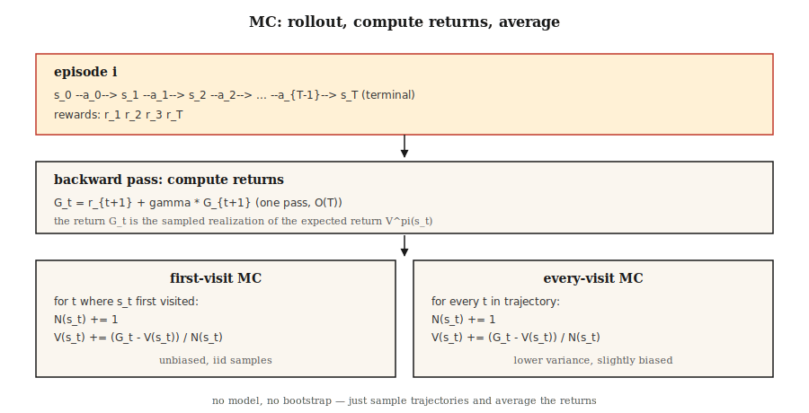

# Monte Carlo Methods — 学习 from Complete Episodes

> Dynamic programming needs a 模型. Monte Carlo needs nothing but episodes. Run the 策略, watch the returns, average them. The simplest idea in RL — and the one that unlocks everything downstream.

**类型：** Build
**语言：** Python
**先修：** Phase 9 · 01 (MDPs), Phase 9 · 02 (Dynamic Programming)
**时间：** 约 75 分钟

## 问题

Dynamic programming is elegant, but it assumes you can 查询 `P(s' | s, a)` for every 状态 and 动作. Almost nothing in the 真实 world works that way. A robot cannot analytically 计算 the 分布 over camera pixels after a joint torque. A pricing algorithm cannot integrate over every possible customer reaction. An LLM cannot enumerate all possible continuations after a 词元.

你need a method that only needs the ability to *样本* from the 环境. Run the 策略. Get a 轨迹 `s_0, a_0, r_1, s_1, a_1, r_2, …, s_T`. Use it to estimate values. That is Monte Carlo.

这个shift from DP to MC is philosophically important: we move from *known 模型 + exact backup* to *sampled rollouts + averaged return*. The 方差 jumps, but the applicability explodes. Every RL algorithm after this lesson — TD, Q-learning, REINFORCE, PPO, GRPO — is a Monte Carlo estimator at heart, sometimes with bootstrapping layered on top.

## 概念



**The core idea, in one line:** `V^π(s) = E_π[G_t | s_t = s] ≈ (1/N) Σ_i G^{(i)}(s)` where `G^{(i)}(s)` are observed returns following visits to `s` under 策略 `π`.

**First-visit vs every-visit MC.** Given an episode that visits 状态 `s` multiple times, first-visit MC only counts the return from the first visit; every-visit MC counts all visits. Both are unbiased in the 限制. First-visit is simpler to analyze (iid 样本). Every-visit uses more 数据 per episode and typically converges faster in practice.

**Incremental mean.** Instead of storing all returns, update the running average:

`V_n(s) = V_{n-1}(s) + (1/n) [G_n - V_{n-1}(s)]`

Reorganize: `V_new = V_old + α · (target - V_old)` with `α = 1/n`. Swap `1/n` for a constant step-size `α ∈ (0, 1)` and you get a non-stationary MC estimator that tracks changes in `π`. That move is the entire jump from MC to TD to every modern RL algorithm.

**Exploration is now a problem.** DP touched every 状态 by enumeration. MC only sees states the 策略 visits. If `π` is deterministic, whole regions of the 状态 space never get sampled, and their value estimates stay at zero forever. Three fixes, in historical order:

1. **Exploring starts.** Start each episode from a random (s, a) pair. Guarantees coverage; unrealistic in practice (you cannot "reset" a robot into an arbitrary 状态).
2. **ε-greedy.** Act greedy w.r.t. current Q, but with 概率 `ε` pick a random 动作. All state-action pairs get sampled asymptotically.
3. **Off-policy MC.** Collect 数据 under a behavior 策略 `μ`, learn about 目标 策略 `π` via importance 采样. High 方差, but it's the bridge to replay-buffer methods like DQN.

**Monte Carlo Control.** Evaluate → improve → evaluate, just like 策略 iteration, but 评估 is sampling-based:

1. 运行`π`, get an episode.
2. Update `Q(s, a)` from observed returns.
3. Make `π` ε-greedy w.r.t. `Q`.
4. Repeat.

Converges to `Q*` and `π*` with 概率 1 under mild conditions (every pair visited infinitely often, `α` satisfies Robbins-Monro).

```figure
epsilon-greedy
```

## 动手构建

### 步骤 1:  rollout → list of (s, a, r)

```python
def rollout(env, policy, max_steps=200):
    trajectory = []
    s = env.reset()
    for _ in range(max_steps):
        a = policy(s)
        s_next, r, done = env.step(s, a)
        trajectory.append((s, a, r))
        s = s_next
        if done:
            break
    return trajectory
```

No 模型, only `env.reset()` and `env.step(s, a)`. Same interface as a gym 环境 but stripped down.

### 步骤 2: 计算 returns (reverse sweep)

```python
def returns_from(trajectory, gamma):
    returns = []
    G = 0.0
    for _, _, r in reversed(trajectory):
        G = r + gamma * G
        returns.append(G)
    return list(reversed(returns))
```

One pass, `O(T)`. The backward recurrence `G_t = r_{t+1} + γ G_{t+1}` avoids re-summing.

### 步骤 3: first-visit MC 评估

```python
def mc_policy_evaluation(env, policy, episodes, gamma=0.99):
    V = defaultdict(float)
    counts = defaultdict(int)
    for _ in range(episodes):
        trajectory = rollout(env, policy)
        returns = returns_from(trajectory, gamma)
        seen = set()
        for t, ((s, _, _), G) in enumerate(zip(trajectory, returns)):
            if s in seen:
                continue
            seen.add(s)
            counts[s] += 1
            V[s] += (G - V[s]) / counts[s]
    return V
```

Three lines do the work: mark 状态 as seen on first visit, increment count, update running mean.

### 步骤 4: ε-greedy MC control (on-policy)

```python
def mc_control(env, episodes, gamma=0.99, epsilon=0.1):
    Q = defaultdict(lambda: {a: 0.0 for a in ACTIONS})
    counts = defaultdict(lambda: {a: 0 for a in ACTIONS})

    def policy(s):
        if random() < epsilon:
            return choice(ACTIONS)
        return max(Q[s], key=Q[s].get)

    for _ in range(episodes):
        trajectory = rollout(env, policy)
        returns = returns_from(trajectory, gamma)
        seen = set()
        for (s, a, _), G in zip(trajectory, returns):
            if (s, a) in seen:
                continue
            seen.add((s, a))
            counts[s][a] += 1
            Q[s][a] += (G - Q[s][a]) / counts[s][a]
    return Q, policy
```

### 步骤 5: compare to DP gold standard

你的MC estimate of `V^π` should agree with the DP result from Lesson 02 as episodes → ∞. In practice: 50,000 episodes on 4×4 GridWorld gets you within `~0.1` of the DP 答案.

## Pitfalls

- **Infinite episodes.** MC requires episodes to *terminate*. If your 策略 can 循环 forever, cap `max_steps` and treat the cap as implicit failure. GridWorld with a random 策略 routinely times out — that is normal, just make sure you count it correctly.
- **方差.** MC uses full returns. On long episodes, 方差 is huge — one unlucky 奖励 at the end shifts `V(s_0)` by the same amount. TD methods (Lesson 04) cut this by bootstrapping.
- **状态 coverage.** Greedy MC on a fresh Q with ties will only ever try one 动作. You *must* explore (ε-greedy, exploring starts, UCB).
- **Non-stationary policies.** If `π` changes (as in MC control), old returns are from a different 策略. Constant-α MC handles this; sample-average MC does not.
- **Off-policy importance 采样.** The 权重 `π(a|s)/μ(a|s)` multiply across a 轨迹. 方差 explodes with horizon. Cap with per-decision weighted IS or switch to TD.

## 实际使用

这个2026 role of Monte Carlo methods:

|Use case|Why MC|
|----------|--------|
|Short-horizon games (blackjack, poker)|Episodes terminate naturally; returns are clean.|
|Offline 评估 of a logged 策略|Average discounted returns over stored trajectories.|
|Monte Carlo Tree Search (AlphaZero)|MC rollouts from tree leaves guide selection.|
|LLM RL 评估|计算 average 奖励 over sampled completions for a given 策略.|
|基线 estimation in PPO|The advantage 目标 `A_t = G_t - V(s_t)` uses an MC `G_t`.|
|Teaching RL|Simplest algorithm that actually works — strip bootstrapping to see the core.|

Modern deep-RL algorithms (PPO, SAC) interpolate between pure MC (full returns) and pure TD (one-step bootstrap) via `n`-步骤 returns or GAE. Both endpoints are instances of the same estimator.

## 交付成果

Save as `outputs/skill-mc-evaluator.md`:

```markdown
---
name: mc-evaluator
description: Evaluate a policy via Monte Carlo rollouts and produce a convergence report with DP-comparison if available.
version: 1.0.0
phase: 9
lesson: 3
tags: [rl, monte-carlo, evaluation]
---

Given an environment (episodic, with reset+step API) and a policy, output:

1. Method. First-visit vs every-visit MC. Reason.
2. Episode budget. Target number, variance diagnostic, expected standard error.
3. Exploration plan. ε schedule (if needed) or exploring starts.
4. Gold-standard comparison. DP-optimal V* if tabular; otherwise a bound from a Q-learning / PPO baseline.
5. Termination check. Max-step cap, timeouts, handling of non-terminating trajectories.

Refuse to run MC on non-episodic tasks without a finite horizon cap. Refuse to report V^π estimates from fewer than 100 episodes per state for tabular tasks. Flag any policy with zero-variance actions as an exploration risk.
```

## 练习

1. **Easy.** Implement first-visit MC 评估 of the uniform-random 策略 on 4×4 GridWorld. Run 10,000 episodes. Plot `V(0,0)` as a 函数 of episode count against the DP 答案.
2. **Medium.** Implement ε-greedy MC control with `ε ∈ {0.01, 0.1, 0.3}`. Compare mean return after 20,000 episodes. What does the 曲线 look like? Where does the bias-variance tradeoff live?
3. **Hard.** Implement *off-policy* MC with importance 采样: collect 数据 under uniform-random 策略 `μ`, estimate `V^π` for the deterministic optimal 策略 `π`. Compare plain IS vs per-decision IS vs weighted IS. Which has lowest 方差?

## Key Terms

|Term|What people say|What it actually means|
|------|-----------------|-----------------------|
|Monte Carlo|"Random 采样"|Estimate expectations by averaging over iid 样本 from the 分布.|
|Return `G_t`|"Future 奖励"|Sum of discounted rewards from 步骤 `t` to episode end: `Σ_{k≥0} γ^k r_{t+k+1}`.|
|First-visit MC|"Count each 状态 once"|Only the first visit in an episode contributes to the value estimate.|
|Every-visit MC|"Use all visits"|Every visit contributes; slightly biased but more sample-efficient.|
|ε-greedy|"Exploration 噪声"|Pick greedy 动作 with prob `1-ε`; random 动作 with prob `ε`.|
|Importance 采样|"Correcting for 采样 from the wrong 分布"|Reweight returns by `π(a\|s)/μ(a\|s)` products to estimate `V^π` from `μ` 数据.|
|On-policy|"Learn from my own 数据"|目标 策略 = behavior 策略. Vanilla MC, PPO, SARSA.|
|Off-policy|"Learn from someone else's 数据"|目标 策略 ≠ behavior 策略. Importance-sampled MC, Q-learning, DQN.|

## 延伸阅读

- [Sutton & Barto (2018). Ch. 5 — Monte Carlo Methods](http://incompleteideas.net/book/RLbook2020.pdf) — the canonical treatment.
- [Singh & Sutton (1996). Reinforcement Learning with Replacing Eligibility Traces](https://link.springer.com/article/10.1007/BF00114726) — first-visit vs every-visit analysis.
- [Precup, Sutton, Singh (2000). Eligibility Traces for Off-Policy Policy Evaluation](http://incompleteideas.net/papers/PSS-00.pdf) — off-policy MC and 方差 control.
- [Mahmood et al. (2014). Weighted Importance Sampling for Off-Policy Learning](https://arxiv.org/abs/1404.6362) — modern low-variance IS estimators.
- [Tesauro (1995). TD-Gammon, A Self-Teaching Backgammon Program](https://dl.acm.org/doi/10.1145/203330.203343) — the first large-scale empirical demonstration of MC/TD self-play converging to superhuman play; conceptual precursor to every lesson in the second half of this phase.
