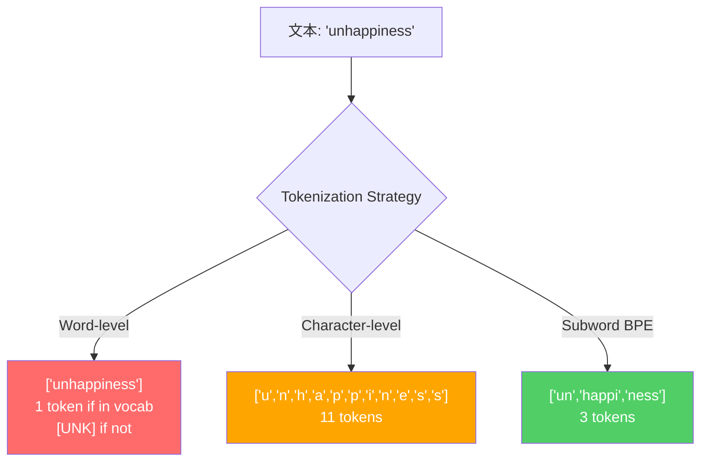
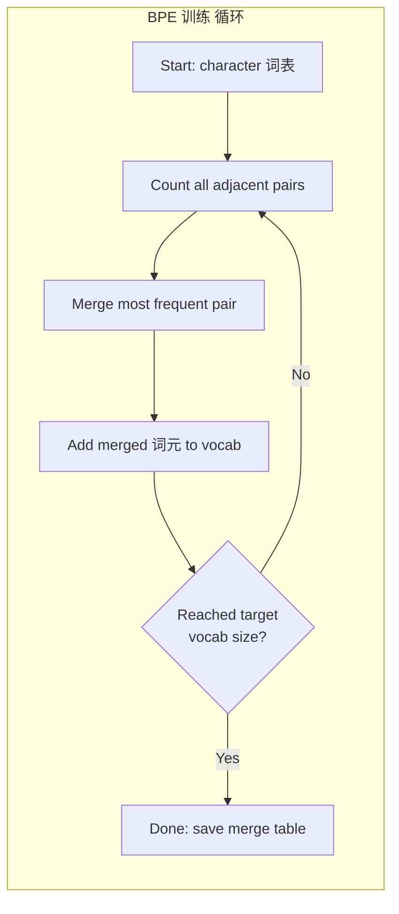
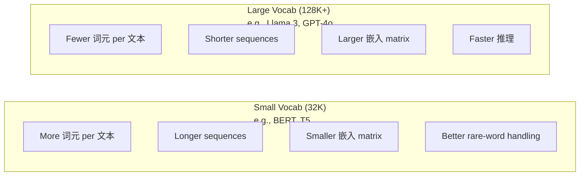

# 分词器s: BPE, WordPiece, SentencePiece

> 你的LLM does not read English. It reads integers. The 分词器 decides whether those integers carry meaning or waste it.

**类型：** Build
**语言：** Python
**先修：** Phase 05 (NLP Foundations)
**时间：** 约 90 分钟

## 学习目标

- Implement BPE, WordPiece, and Unigram tokenization algorithms from scratch and compare their merge strategies
- 解释how 词表 size affects 模型 efficiency: too small creates long sequences, too large wastes 嵌入 参数
- Analyze tokenization 工件 across languages and code, identifying where specific 分词器s break down
- 使用the tiktoken and sentencepiece libraries to tokenize 文本 and inspect the resulting 词元 IDs

## 问题

你的LLM does not read English. It does not read any language. It reads numbers.

这个gap between "Hello, world!" and [15496, 11, 995, 0] is the 分词器. Every word, every space, every punctuation mark must be converted into an integer before a 模型 can process it. This conversion is not neutral. It bakes assumptions into the 模型 that cannot be undone later.

Get this wrong and your 模型 wastes capacity encoding common words with multiple 词元. "unfortunately" becomes four 词元 instead of one. Your 128K 上下文 window just shrank by 75% for 文本 heavy in multi-syllable words. Get it right and the same 上下文 window holds twice as much meaning. The difference between "this 模型 handles code well" and "this 模型 chokes on Python" often comes down to how the 分词器 was 训练后的.

每个API call you make to GPT-4 or Claude is priced per 词元. Every 词元 your 模型 generates 成本 计算. The fewer 词元 required to represent an 输出, the faster the end-to-end 推理. Tokenization is not preprocessing. It is 架构.

## 概念

### Three 方法es That Failed (and One That Won)

There are three obvious ways to convert 文本 to numbers. Two of them do not work at 规模.

**Word-level tokenization** splits on spaces and punctuation. "The cat sat" becomes ["The", "cat", "sat"]. Simple. But what about "tokenization"? Or "GPT-4o"? Or a German compound word like "Geschwindigkeitsbegrenzung"? Word-level requires a massive 词表 to cover every word in every language. Miss a word and you get the dreaded `[UNK]` 词元 -- the 模型's way of saying "I have no idea what this is." English alone has over a million word forms. Add code, URLs, scientific notation, and 100 other languages and you need an infinite 词表.

**Character-level tokenization** goes the other direction. "hello" becomes ["h", "e", "l", "l", "o"]. 词表 is tiny (a few hundred characters). No unknown 词元 ever. But sequences become extremely long. A sentence that would be 10 word-level 词元 becomes 50 character-level 词元. The 模型 must learn that "t", "h", "e" together mean "the" -- burning 注意力 capacity on something a human learns at age three.

**Subword tokenization** finds the sweet spot. Common words stay whole: "the" is one 词元. Rare words decompose into meaningful pieces: "unhappiness" becomes ["un", "happi", "ness"]. 词表 stays manageable (30K to 128K 词元). Sequences stay short. Unknown 词元 essentially disappear because any word can be built from subword pieces.

每个modern LLM uses subword tokenization. GPT-2, GPT-4, BERT, Llama 3, Claude -- all of them. The 问题 is which algorithm.



### BPE: Byte Pair Encoding

BPE is a greedy 压缩 algorithm repurposed for tokenization. The idea is simple enough to fit on an index card.

Start with individual characters. Count every adjacent pair in the 训练 语料库. Merge the most frequent pair into a new 词元. Repeat until you reach your 目标 词表 size.

```figure
tokenizer-bpe
```

Here is BPE running on a tiny 语料库 with the words "lower", "lowest", and "newest":

```text
Corpus (with word frequencies):
  "lower"  x5
  "lowest" x2
  "newest" x6

Step 0 -- Start with characters:
  l o w e r       (x5)
  l o w e s t     (x2)
  n e w e s t     (x6)

Step 1 -- Count adjacent pairs:
  (e,s): 8    (s,t): 8    (l,o): 7    (o,w): 7
  (w,e): 13   (e,r): 5    (n,e): 6    ...

Step 2 -- Merge most frequent pair (w,e) -> "we":
  l o we r        (x5)
  l o we s t      (x2)
  n e we s t      (x6)

Step 3 -- Recount and merge (e,s) -> "es":
  l o we r        (x5)
  l o we s t      (x2)    <- 'es' only forms from 'e'+'s', not 'we'+'s'
  n e we s t      (x6)    <- wait, the 'e' before 'we' and 's' after 'we'

Actually tracking this precisely:
  After "we" merge, remaining pairs:
  (l,o): 7   (o,we): 7   (we,r): 5   (we,s): 8
  (s,t): 8   (n,e): 6    (e,we): 6

Step 3 -- Merge (we,s) -> "wes" or (s,t) -> "st" (tied at 8, pick first):
  Merge (we,s) -> "wes":
  l o we r        (x5)
  l o wes t       (x2)
  n e wes t       (x6)

Step 4 -- Merge (wes,t) -> "west":
  l o we r        (x5)
  l o west        (x2)
  n e west        (x6)

...continue until target vocab size reached.
```

这个merge table is the 分词器. To encode new 文本, apply merges in the order they were learned. The 训练 语料库 determines which merges exist, and that choice permanently shapes what the 模型 sees.



### Byte-Level BPE (GPT-2, GPT-3, GPT-4)

Standard BPE operates on Unicode characters. Byte-level BPE operates on raw bytes (0-255). This gives you a base 词表 of exactly 256, handles any language or encoding, and never produces an unknown 词元.

GPT-2 introduced this approach. The base 词表 covers every possible byte. BPE merges build on top of that. OpenAI's tiktoken library implements byte-level BPE with these 词表 sizes:

- GPT-2: 50,257 词元
- GPT-3.5/GPT-4: ~100,256 词元 (cl100k_base encoding)
- GPT-4o: 200,019 词元 (o200k_base encoding)

### WordPiece (BERT)

WordPiece looks similar to BPE but picks merges differently. Instead of raw frequency, it maximizes the 似然 of the 训练 数据:

```text
BPE merge criterion:      count(A, B)
WordPiece merge criterion: count(AB) / (count(A) * count(B))
```

BPE asks: "Which pair appears most often?" WordPiece asks: "Which pair appears together more often than you would expect by chance?" This subtle difference produces different vocabularies. WordPiece favors merges where co-occurrence is surprising, not just frequent.

WordPiece also uses a "##" prefix for continuation subwords:

```text
"unhappiness" -> ["un", "##happi", "##ness"]
"embedding"   -> ["em", "##bed", "##ding"]
```

这个"##" prefix tells you this piece continues a previous 词元. BERT uses WordPiece with a 词表 of 30,522 词元. Every BERT variant -- DistilBERT, RoBERTa's 分词器 is actually BPE, but BERT itself is WordPiece.

### SentencePiece (Llama, T5)

SentencePiece treats the 输入 as a raw stream of Unicode characters, including whitespace. No pre-tokenization 步骤. No language-specific rules about word boundaries. This makes it genuinely language-agnostic -- it works on Chinese, Japanese, Thai, and other languages where spaces do not separate words.

SentencePiece supports two algorithms:
- **BPE mode**: same merge logic as standard BPE, applied to raw character sequences
- **Unigram mode**: starts with a large 词表 and iteratively removes 词元 that least affect the overall 似然. The reverse of BPE -- prune instead of merge.

Llama 2 uses SentencePiece BPE with a 词表 of 32,000 词元. T5 uses SentencePiece Unigram with 32,000 词元. Note: Llama 3 switched to a tiktoken-based byte-level BPE 分词器 with 128,256 词元.

### 词表 Size 取舍

这is a 真实 engineering decision with measurable consequences.



Concrete numbers. For a 128K 词表 with 4,096-dimensional 嵌入s, the 嵌入 matrix alone is 128,000 x 4,096 = 524 million 参数. For a 32K 词表, it is 131 million 参数. That is a 400M 参数 difference from the 分词器 choice alone.

But larger vocabularies compress 文本 more aggressively. The same English paragraph that takes 100 词元 with a 32K 词表 might take 70 词元 with a 128K 词表. That means 30% fewer forward passes during 生成. For a 模型 serving millions of requests, that is a direct reduction in 计算 成本.

这个trend is clear: 词表 sizes are growing. GPT-2 used 50,257. GPT-4 uses ~100K. Llama 3 uses 128K. GPT-4o uses 200K.

|模型|Vocab Size|分词器 类型|Avg 词元 per English Word|
|-------|-----------|----------------|---------------------------|
|BERT|30,522|WordPiece|~1.4|
|GPT-2|50,257|Byte-level BPE|~1.3|
|Llama 2|32,000|SentencePiece BPE|~1.4|
|GPT-4|~100,256|Byte-level BPE|~1.2|
|Llama 3|128,256|Byte-level BPE (tiktoken)|~1.1|
|GPT-4o|200,019|Byte-level BPE|~1.0|

### The Multilingual Tax

分词器s 训练后的 primarily on English are brutal to other languages. Korean 文本 in GPT-2's 分词器 averages 2-3 词元 per word. Chinese can be worse. This means a Korean 用户 effectively has a 上下文 window that is half the size of an English 用户's -- paying the same price for less information 密度.

这is why Llama 3 quadrupled its 词表 from 32K to 128K. More 词元 dedicated to non-English scripts means fairer 压缩 across languages.

```figure
tokenizer-tradeoff
```

## 动手构建

### 步骤 1: Character-Level 分词器

Start at the foundation. A character-level 分词器 maps each character to its Unicode code point. No 训练 needed. No unknown 词元. Just a direct mapping.

```python
class CharTokenizer:
    def encode(self, text):
        return [ord(c) for c in text]

    def decode(self, tokens):
        return "".join(chr(t) for t in tokens)
```

"hello" becomes [104, 101, 108, 108, 111]. Every character is its own 词元. This is the 基线 we improve on.

### 步骤 2: BPE 分词器 from Scratch

这个真实 implementation. We 训练 on raw bytes (like GPT-2), count pairs, merge the most frequent, and record every merge in order. The merge table is the 分词器.

```python
from collections import Counter

class BPETokenizer:
    def __init__(self):
        self.merges = {}
        self.vocab = {}

    def _get_pairs(self, tokens):
        pairs = Counter()
        for i in range(len(tokens) - 1):
            pairs[(tokens[i], tokens[i + 1])] += 1
        return pairs

    def _merge_pair(self, tokens, pair, new_token):
        merged = []
        i = 0
        while i < len(tokens):
            if i < len(tokens) - 1 and tokens[i] == pair[0] and tokens[i + 1] == pair[1]:
                merged.append(new_token)
                i += 2
            else:
                merged.append(tokens[i])
                i += 1
        return merged

    def train(self, text, num_merges):
        tokens = list(text.encode("utf-8"))
        self.vocab = {i: bytes([i]) for i in range(256)}

        for i in range(num_merges):
            pairs = self._get_pairs(tokens)
            if not pairs:
                break
            best_pair = max(pairs, key=pairs.get)
            new_token = 256 + i
            tokens = self._merge_pair(tokens, best_pair, new_token)
            self.merges[best_pair] = new_token
            self.vocab[new_token] = self.vocab[best_pair[0]] + self.vocab[best_pair[1]]

        return self

    def encode(self, text):
        tokens = list(text.encode("utf-8"))
        for pair, new_token in self.merges.items():
            tokens = self._merge_pair(tokens, pair, new_token)
        return tokens

    def decode(self, tokens):
        byte_sequence = b"".join(self.vocab[t] for t in tokens)
        return byte_sequence.decode("utf-8", errors="replace")
```

这个训练 循环 is the core of BPE: count pairs, merge the winner, repeat. Each merge reduces the total 词元 count. After `num_merges` rounds, the 词表 grows from 256 (base bytes) to 256 + num_merges.

Encoding applies merges in the exact order they were learned. This matters. If merge 1 created "th" and merge 5 created "the", encoding must apply merge 1 first so that "the" can form from "th" + "e" in merge 5.

Decoding is the inverse: look up each 词元 ID in the 词表, concatenate the bytes, decode to UTF-8.

### 步骤 3: Encode and Decode Roundtrip

```python
corpus = (
    "The cat sat on the mat. The cat ate the rat. "
    "The dog sat on the log. The dog ate the frog. "
    "Natural language processing is the study of how computers "
    "understand and generate human language. "
    "Tokenization is the first step in any NLP pipeline."
)

tokenizer = BPETokenizer()
tokenizer.train(corpus, num_merges=40)

test_sentences = [
    "The cat sat on the mat.",
    "Natural language processing",
    "tokenization pipeline",
    "unhappiness",
]

for sentence in test_sentences:
    encoded = tokenizer.encode(sentence)
    decoded = tokenizer.decode(encoded)
    raw_bytes = len(sentence.encode("utf-8"))
    ratio = len(encoded) / raw_bytes
    print(f"'{sentence}'")
    print(f"  Tokens: {len(encoded)} (from {raw_bytes} bytes) -- ratio: {ratio:.2f}")
    print(f"  Roundtrip: {'PASS' if decoded == sentence else 'FAIL'}")
```

这个压缩 比例 tells you how effective the 分词器 is. A 比例 of 0.50 means the 分词器 compressed the 文本 to half as many 词元 as raw bytes. Lower is better. On the 训练 语料库, the 比例 will be good. On out-of-distribution 文本 like "unhappiness" (which does not appear in the 语料库), the 比例 will be worse -- the 分词器 falls back to character-level encoding for unseen patterns.

### 步骤 4: Compare with tiktoken

```python
import tiktoken

enc = tiktoken.get_encoding("cl100k_base")

texts = [
    "The cat sat on the mat.",
    "unhappiness",
    "Hello, world!",
    "def fibonacci(n): return n if n < 2 else fibonacci(n-1) + fibonacci(n-2)",
    "Geschwindigkeitsbegrenzung",
]

for text in texts:
    our_tokens = tokenizer.encode(text)
    tiktoken_tokens = enc.encode(text)
    tiktoken_pieces = [enc.decode([t]) for t in tiktoken_tokens]
    print(f"'{text}'")
    print(f"  Our BPE:   {len(our_tokens)} tokens")
    print(f"  tiktoken:  {len(tiktoken_tokens)} tokens -> {tiktoken_pieces}")
```

tiktoken uses the exact same algorithm but 训练后的 on hundreds of gigabytes of 文本 with 100,000 merges. The algorithm is identical. The difference is the 训练 数据 and the number of merges. Your 分词器 训练后的 on a paragraph with 40 merges cannot compete with tiktoken's 100K merges on a massive 语料库. But the mechanism is the same.

### 步骤 5: 词表 Analysis

```python
def analyze_vocabulary(tokenizer, test_texts):
    total_tokens = 0
    total_chars = 0
    token_usage = Counter()

    for text in test_texts:
        encoded = tokenizer.encode(text)
        total_tokens += len(encoded)
        total_chars += len(text)
        for t in encoded:
            token_usage[t] += 1

    print(f"Vocabulary size: {len(tokenizer.vocab)}")
    print(f"Total tokens across all texts: {total_tokens}")
    print(f"Total characters: {total_chars}")
    print(f"Avg tokens per character: {total_tokens / total_chars:.2f}")

    print(f"\nMost used tokens:")
    for token_id, count in token_usage.most_common(10):
        token_bytes = tokenizer.vocab[token_id]
        display = token_bytes.decode("utf-8", errors="replace")
        print(f"  Token {token_id:4d}: '{display}' (used {count} times)")

    unused = [t for t in tokenizer.vocab if t not in token_usage]
    print(f"\nUnused tokens: {len(unused)} out of {len(tokenizer.vocab)}")
```

这reveals the Zipf 分布 in your 词表. A few 词元 dominate (spaces, "the", "e"). Most 词元 are rarely used. 生产 分词器s 优化 for this 分布 -- common patterns get short 词元 IDs, rare patterns get longer representations.

## 实际使用

你的scratch BPE works. Now see what 生产 工具 look like.

### tiktoken (OpenAI)

```python
import tiktoken

enc = tiktoken.get_encoding("cl100k_base")

text = "Tokenizers convert text to integers"
tokens = enc.encode(text)
print(f"Tokens: {tokens}")
print(f"Pieces: {[enc.decode([t]) for t in tokens]}")
print(f"Roundtrip: {enc.decode(tokens)}")
```

tiktoken is written in Rust with Python bindings. It encodes millions of 词元 per second. Same BPE algorithm, industrial-strength implementation.

### Hugging Face 分词器s

```python
from tokenizers import Tokenizer
from tokenizers.models import BPE
from tokenizers.trainers import BpeTrainer
from tokenizers.pre_tokenizers import ByteLevel

tokenizer = Tokenizer(BPE())
tokenizer.pre_tokenizer = ByteLevel()

trainer = BpeTrainer(vocab_size=1000, special_tokens=["<pad>", "<eos>", "<unk>"])
tokenizer.train(["corpus.txt"], trainer)

output = tokenizer.encode("The cat sat on the mat.")
print(f"Tokens: {output.tokens}")
print(f"IDs: {output.ids}")
```

这个Hugging Face 分词器s library is also Rust under the hood. It trains BPE on gigabyte-scale corpora in seconds. This is what you use when 训练 your own 模型.

### Loading Llama's 分词器

```python
from transformers import AutoTokenizer

tokenizer = AutoTokenizer.from_pretrained("meta-llama/Llama-3.1-8B")

text = "Tokenizers are the unsung heroes of LLMs"
tokens = tokenizer.encode(text)
print(f"Token IDs: {tokens}")
print(f"Tokens: {tokenizer.convert_ids_to_tokens(tokens)}")
print(f"Vocab size: {tokenizer.vocab_size}")

multilingual = ["Hello world", "Hola mundo", "Bonjour le monde"]
for text in multilingual:
    ids = tokenizer.encode(text)
    print(f"'{text}' -> {len(ids)} tokens")
```

Llama 3's 128K 词表 compresses non-English 文本 significantly better than GPT-2's 50K 词表. You can verify this yourself -- encode the same sentence in multiple languages and count the 词元.

## 交付成果

这lesson produces `outputs/prompt-tokenizer-analyzer.md` -- a 可复用 提示词 that analyzes tokenization efficiency for any 文本 and 模型 combination. Feed it a 文本 样本 and it tells you which 模型's 分词器 handles it best.

## 练习

1. Modify the BPE 分词器 to print the 词表 at each merge 步骤. Watch how "t" + "h" becomes "th", then "th" + "e" becomes "the". Track how common English words get assembled piece by piece.

2. Add special 词元 (`<pad>`, `<eos>`, `<unk>`) to the BPE 分词器. Assign them IDs 0, 1, 2 and shift all other 词元 accordingly. Implement a pre-tokenization 步骤 that splits on whitespace before running BPE.

3. Implement the WordPiece merge criterion (似然 比例 instead of frequency). 训练 both BPE and WordPiece on the same 语料库 with the same number of merges. Compare the resulting vocabularies -- which one produces more linguistically meaningful subwords?

4. 构建a multilingual 分词器 efficiency 基准. Take 10 sentences in English, Spanish, Chinese, Korean, and Arabic. Tokenize each with tiktoken (cl100k_base) and measure the average 词元 per character. Quantify the "multilingual tax" for each language.

5. 训练 your BPE 分词器 on a larger 语料库 (download a Wikipedia article). Tune the number of merges to achieve a 压缩 比例 within 10% of tiktoken on that same 文本. This forces you to understand the relationship between 语料库 size, merge count, and 压缩 质量.

## Key Terms

|Term|What people say|What it actually means|
|------|----------------|----------------------|
|词元|"A word"|A unit in the 模型's 词表 -- could be a character, subword, word, or multi-word 分块|
|BPE|"Some 压缩 thing"|Byte Pair Encoding -- iteratively merge the most frequent adjacent pair of 词元 until the 目标 词表 size is reached|
|WordPiece|"BERT's 分词器"|Like BPE but merges maximize the 似然 比例 count(AB)/(count(A)*count(B)) instead of raw frequency|
|SentencePiece|"A 分词器 library"|A language-agnostic 分词器 that operates on raw Unicode without pre-tokenization, supporting BPE and Unigram algorithms|
|词表 size|"How many words it knows"|The total number of unique 词元: GPT-2 has 50,257, BERT has 30,522, Llama 3 has 128,256|
|Fertility|"Not a 分词器 term"|Average number of 词元 per word -- measures 分词器 efficiency across languages (1.0 is perfect, 3.0 means the 模型 works three times harder)|
|Byte-level BPE|"GPT's 分词器"|BPE operating on raw bytes (0-255) instead of Unicode characters, guaranteeing no unknown 词元 for any 输入|
|Merge table|"The 分词器 file"|Ordered list of pair merges learned during 训练 -- this IS the 分词器, and order matters|
|Pre-tokenization|"Splitting on spaces"|Rules applied before subword tokenization: whitespace splitting, digit separation, punctuation handling|
|压缩 比例|"How efficient the 分词器 is"|词元 produced divided by 输入 bytes -- lower means better 压缩 and faster 推理|

## 延伸阅读

- [Sennrich et al., 2016 -- "Neural Machine Translation of Rare Words with Subword Units"](https://arxiv.org/abs/1508.07909) -- the paper that introduced BPE for NLP, turning a 1994 压缩 algorithm into the foundation of modern tokenization
- [Kudo & Richardson, 2018 -- "SentencePiece: A simple and language independent subword tokenizer"](https://arxiv.org/abs/1808.06226) -- language-agnostic tokenization that made multilingual 模型 practical
- [OpenAI tiktoken repository](https://github.com/openai/tiktoken) -- 生产 BPE implementation in Rust with Python bindings, used by GPT-3.5/4/4o
- [Hugging Face Tokenizers documentation](https://huggingface.co/docs/tokenizers) -- production-grade 分词器 训练 with Rust performance
