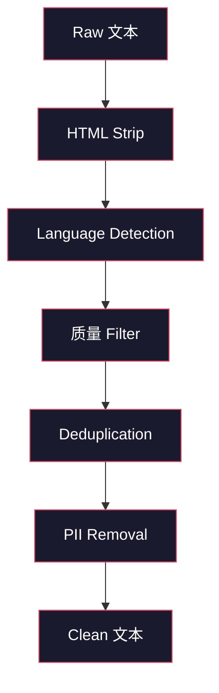
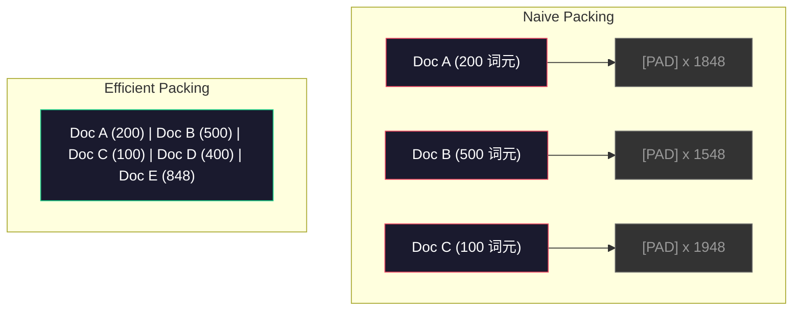

# 数据 Pipelines for 预训练

> 这个模型 is a mirror. It reflects whatever 数据 you feed it. Feed it garbage, it reflects garbage with perfect fluency.

**类型：** Build
**语言：** Python
**先修：** Phase 10, Lessons 01-02 (分词器s, Building a 分词器)
**时间：** 约 90 分钟

## 学习目标

- 构建a streaming 数据 流水线 that tokenizes, chunks, shuffles, and batches terabytes of 文本 without loading it all into 内存
- Implement 数据 质量 filters (deduplication, language detection, content filtering) used in 真实 预训练 pipelines
- Create fixed-length 训练 sequences with proper 注意力 masks and 文档 boundary handling
- Profile 流水线 throughput to ensure the dataloader keeps up with GPU 训练 speed

## 问题

你have a 分词器. Now you need 数据.

Not a 数据集. Not a CSV file. Terabytes of 文本 -- cleaned, deduplicated, filtered for 质量, tokenized into fixed-length sequences, and served in randomized batches fast enough that your 8-GPU cluster never waits for the next 批次.

Most people think 训练 an LLM is about the 模型 架构. It is not. Llama 3 used 15.6 trillion 词元. GPT-3 used 300 billion. DeepSeek-V2 used 8.1 trillion. The 架构 across all three is roughly the same: stacked transformer 块 with 注意力 and feedforward 层. The difference in 输出 质量 comes overwhelmingly from the 数据.

这个Chinchilla paper from DeepMind made this precise. For a given 计算 预算, there is an optimal 比例 of 模型 参数 to 训练 词元. Chinchilla showed that most 模型 in 2022 were dramatically undertrained -- they had too many 参数 for the amount of 数据 they saw. A 70B 参数 模型 训练后的 on 1.4 trillion 词元 (Chinchilla-optimal) outperformed a 280B 模型 训练后的 on 300 billion 词元 (Gopher).

你的数据 流水线 determines whether your 模型 learns language or learns 噪声.

## 概念

### Where the 数据 Comes From

每个large 语言模型 is 训练后的 on a mix of 来源. The exact composition is a closely guarded secret for most labs, but we know enough to understand the categories.

|来源|Size|质量|Used By|
|--------|------|---------|---------|
|Common Crawl|~250 TB raw|Low (needs heavy filtering)|GPT-3, Llama, most 开放 模型|
|Wikipedia|~20 GB|High|Every major LLM|
|GitHub code|~1 TB+|Medium (lots of duplicates, dead code)|StarCoder, CodeLlama, DeepSeek-Coder|
|Books (BookCorpus, Pile)|~100 GB|High|GPT-2, GPT-3, early 模型|
|Academic papers (arXiv, S2ORC)|~100 GB|High for STEM|Llama, Galactica|
|StackOverflow, Reddit|~100 GB|Medium|Llama, Falcon|
|Curated web (C4, RefinedWeb)|~5 TB|Medium-High (pre-filtered)|T5, Falcon|

Llama 3 disclosed its 数据 mix: roughly 50% web 数据, 25% code, 13% books and academic papers, 8% math 数据, and 4% multilingual web 数据. The total was 15.6 trillion 词元 from 来源 exceeding 5 TB of raw 文本.

这个比例 matters as much as the total size. Too much web 数据 and the 模型 becomes a Reddit parrot. Too little code and it cannot program. Too little math and it fails at 推理. Getting this mix right is one of the hardest parts of 训练 an LLM, and there is no formula -- it requires experimentation and 评估.

### 数据 Cleaning

Raw web 数据 is filthy. A typical Common Crawl dump contains:

- HTML tags and JavaScript
- Boilerplate headers, footers, navigation menus
- Duplicate pages (exact and near-duplicate)
- Machine-generated spam
- Personally identifiable information (PII)
- Low-quality 文本 (lists of keywords, SEO spam)
- Non-text content encoded as 文本

Cleaning this is not optional. It is the difference between a 模型 that generates coherent paragraphs and one that outputs HTML tags mixed with product listings.



Each 步骤 eliminates a category of 噪声:

**HTML stripping:** Remove all markup. Keep only the visible 文本 content. Libraries like `trafilatura` or `readability` extract article content while discarding navigation, ads, and boilerplate.

**Language detection:** Use fastText's language identification 模型 (lid.176.bin) to classify each 文档. Filter to your 目标 languages. A 文档 classified as English with less than 0.8 confidence probably is not clean English.

**质量 filtering:** This is where it gets interesting. RefinedWeb (the 数据集 behind Falcon) uses a perplexity-based filter: 训练 a small 语言模型 on Wikipedia, then 分数 each 文档. High perplexity means the 文档 is unlike Wikipedia -- likely spam, keyword lists, or machine-generated content. 文档 with perplexity above a 阈值 get removed.

**Deduplication:** The single most impactful cleaning 步骤. Common Crawl contains enormous numbers of duplicated pages -- legal disclaimers, cookie notices, terms of service. 训练 on duplicates wastes 计算 and can cause the 模型 to memorize and regurgitate specific passages verbatim.

**PII removal:** Names, email addresses, phone numbers, social security numbers. Regex-based detection for 结构化 PII, NER 模型 for names in 上下文.

### Deduplication with MinHash

Exact deduplication is easy: hash each 文档, remove duplicates. But near-duplicates are the 真实 problem. Two copies of the same news article with slightly different ads around it are near-duplicates. The content is 95% identical, but byte-for-byte they differ.

MinHash + Locality-Sensitive Hashing (LSH) solves this efficiently.


这个idea:

1. **Shingling:** Convert each 文档 into a set of n-grams (e.g., 5-grams of words or characters). "the quick brown fox" with 3-word shingles becomes {"the quick brown", "quick brown fox"}.

2. **MinHash:** For each 文档's shingle set, 计算 k hash values. Each hash value is the minimum hash across all shingles under a different hash 函数. This creates a fixed-size "signature" that approximates the Jaccard 相似度 between any two 文档.

3. **LSH:** Group 文档 into buckets based on bands of their MinHash signature. 文档 in the same bucket are candidate near-duplicates. This avoids comparing every pair -- you only compare candidates.

4. **Verify:** For each candidate pair, 计算 exact Jaccard 相似度. Remove one copy if 相似度 exceeds a 阈值 (typically 0.8).

这个Llama team reported removing approximately 38% of their web 数据 through deduplication. That is not a small number. More than a third of Common Crawl is duplicate or near-duplicate content.

### 序列 Packing

你的模型 expects fixed-length 输入 sequences. Your 文档 are variable length. Some are 50 词元. Some are 50,000 词元.

Naive approach: pad every 文档 to the maximum 序列 length. This wastes enormous 计算 on padding 词元 that contribute nothing to 学习.

Better approach: pack multiple 文档 into a single 序列, separated by end-of-sequence 词元. A 2048-词元 序列 might contain three short 文档 concatenated with [EOS] 词元 between them.



这个注意力 掩码 must be set correctly. 词元 from 文档 A should not attend to 词元 from 文档 B within the same packed 序列. This requires a block-diagonal 注意力 掩码.

Long 文档 get truncated or split into chunks at 序列 boundaries. The split point matters: splitting mid-sentence forces the 模型 to see incomplete thoughts. Some pipelines align splits to paragraph or sentence boundaries when possible.

### The Chinchilla 扩展 Law

For a fixed 计算 预算 C (measured in FLOPs), the optimal 模型 size N and 数据集 size D follow:

```text
N_opt ~ C^0.5
D_opt ~ C^0.5
```

In practice, this means you should 规模 模型 size and 数据集 size roughly equally. A 模型 with 10x more 参数 needs roughly 10x more 训练 词元 to reach the same 损失.

|模型|参数|训练 词元|Chinchilla-Optimal?|
|-------|-----------|----------------|-------------------|
|GPT-3|175B|300B|No (undertrained 3-4x)|
|Chinchilla|70B|1.4T|Yes (by design)|
|Llama 2|70B|2T|Overtrained (intentionally)|
|Llama 3|70B|15T|Heavily overtrained|

Llama 3 deliberately violates the Chinchilla law. Meta found that overtraining on more 数据 -- far beyond the compute-optimal 比例 -- produces better 模型 for 推理. The extra 训练 成本 is paid once, but the smaller 模型 is cheaper to serve forever. This is sometimes called the "推理-optimal" 扩展 approach, and it has become the industry standard since 2024.

## 动手构建

### 步骤 1: 文本 Cleaning

Strip HTML, normalize whitespace, remove non-text content. We will use a public 领域 文本 (Project Gutenberg) as our small 语料库.

```python
import re

def clean_text(text):
    text = re.sub(r"<[^>]+>", "", text)
    text = re.sub(r"http\S+", "", text)
    text = re.sub(r"[^\x20-\x7E\n]", "", text)
    text = re.sub(r"\n{3,}", "\n\n", text)
    text = re.sub(r" {2,}", " ", text)
    return text.strip()

def quality_filter(text, min_words=50, max_ratio_caps=0.3, max_ratio_special=0.1):
    words = text.split()
    if len(words) < min_words:
        return False
    caps_ratio = sum(1 for w in words if w.isupper()) / len(words)
    if caps_ratio > max_ratio_caps:
        return False
    special_chars = sum(1 for c in text if not c.isalnum() and not c.isspace())
    if special_chars / max(len(text), 1) > max_ratio_special:
        return False
    return True
```

这个质量 filter catches SEO spam (ALL CAPS), machine-generated 噪声 (high special character 比例), and stub pages (too short). These three checks alone remove a surprising amount of garbage from web crawls.

### 步骤 2: MinHash Deduplication

Implement MinHash from scratch. No external libraries required -- just `hashlib`.

```python
import hashlib
from collections import defaultdict

def get_shingles(text, k=5):
    words = text.lower().split()
    if len(words) < k:
        return set()
    return {" ".join(words[i:i+k]) for i in range(len(words) - k + 1)}

def minhash_signature(shingles, num_hashes=128):
    signature = []
    for i in range(num_hashes):
        min_hash = float("inf")
        for shingle in shingles:
            h = int(hashlib.sha256(f"{i}:{shingle}".encode()).hexdigest(), 16)
            min_hash = min(min_hash, h)
        signature.append(min_hash)
    return signature

def lsh_buckets(signature, bands=16):
    rows_per_band = len(signature) // bands
    buckets = []
    for b in range(bands):
        start = b * rows_per_band
        band_data = tuple(signature[start:start + rows_per_band])
        bucket_hash = hashlib.md5(str(band_data).encode()).hexdigest()
        buckets.append((b, bucket_hash))
    return buckets

def deduplicate(documents, threshold=0.8, num_hashes=128, bands=16):
    signatures = []
    shingle_sets = []
    for doc in documents:
        shingles = get_shingles(doc)
        shingle_sets.append(shingles)
        signatures.append(minhash_signature(shingles, num_hashes))

    bucket_map = defaultdict(list)
    for doc_idx, sig in enumerate(signatures):
        for band_id, bucket_hash in lsh_buckets(sig, bands):
            bucket_map[(band_id, bucket_hash)].append(doc_idx)

    duplicate_pairs = set()
    for bucket_docs in bucket_map.values():
        if len(bucket_docs) < 2:
            continue
        for i in range(len(bucket_docs)):
            for j in range(i + 1, len(bucket_docs)):
                duplicate_pairs.add((bucket_docs[i], bucket_docs[j]))

    removed = set()
    for i, j in duplicate_pairs:
        if i in removed or j in removed:
            continue
        s1, s2 = shingle_sets[i], shingle_sets[j]
        if not s1 or not s2:
            continue
        jaccard = len(s1 & s2) / len(s1 | s2)
        if jaccard >= threshold:
            removed.add(j)

    return [doc for idx, doc in enumerate(documents) if idx not in removed], len(removed)
```

这个`num_hashes=128` and `bands=16` 参数 control the precision-recall tradeoff. More hashes give more accurate 相似度 estimates. More bands increase recall (catch more duplicates) at the 成本 of more false positives. These values work well for typical web 文本.

### 步骤 3: Tokenize and Pack Sequences

Take the clean, deduplicated 文本, tokenize it, and pack into fixed-length sequences for 训练.

```python
def tokenize_corpus(documents, tokenizer):
    all_tokens = []
    for doc in documents:
        tokens = tokenizer.encode(doc)
        all_tokens.extend(tokens)
        all_tokens.append(tokenizer.eos_id)
    return all_tokens

def pack_sequences(token_ids, seq_length, pad_id=0):
    sequences = []
    attention_masks = []
    for i in range(0, len(token_ids), seq_length):
        seq = token_ids[i:i + seq_length]
        mask = [1] * len(seq)
        if len(seq) < seq_length:
            pad_count = seq_length - len(seq)
            seq = seq + [pad_id] * pad_count
            mask = mask + [0] * pad_count
        sequences.append(seq)
        attention_masks.append(mask)
    return sequences, attention_masks
```

### 步骤 4: DataLoader for 训练

Yield randomized batches of packed sequences. This is what the 训练 循环 consumes.

```python
import random

class PreTrainingDataLoader:
    def __init__(self, sequences, attention_masks, batch_size, shuffle=True):
        self.sequences = sequences
        self.attention_masks = attention_masks
        self.batch_size = batch_size
        self.shuffle = shuffle

    def __len__(self):
        return (len(self.sequences) + self.batch_size - 1) // self.batch_size

    def __iter__(self):
        indices = list(range(len(self.sequences)))
        if self.shuffle:
            random.shuffle(indices)
        for start in range(0, len(indices), self.batch_size):
            batch_idx = indices[start:start + self.batch_size]
            batch_seqs = [self.sequences[i] for i in batch_idx]
            batch_masks = [self.attention_masks[i] for i in batch_idx]
            yield batch_seqs, batch_masks
```

### 步骤 5: 数据集 Statistics

计算 the numbers that matter: total 词元, unique 词元, 压缩 比例, 文档 length 分布.

```python
from collections import Counter

def compute_statistics(documents, token_ids, sequences, tokenizer_vocab_size):
    total_chars = sum(len(d) for d in documents)
    total_tokens = len(token_ids)
    unique_tokens = len(set(token_ids))
    compression_ratio = total_chars / total_tokens

    doc_lengths = [len(d.split()) for d in documents]
    avg_doc_length = sum(doc_lengths) / max(len(doc_lengths), 1)
    max_doc_length = max(doc_lengths) if doc_lengths else 0
    min_doc_length = min(doc_lengths) if doc_lengths else 0

    token_counts = Counter(token_ids)
    top_tokens = token_counts.most_common(10)

    non_pad_tokens = sum(sum(1 for t in seq if t != 0) for seq in sequences)
    total_positions = sum(len(seq) for seq in sequences)
    utilization = non_pad_tokens / max(total_positions, 1)

    stats = {
        "total_documents": len(documents),
        "total_characters": total_chars,
        "total_tokens": total_tokens,
        "unique_tokens": unique_tokens,
        "vocab_utilization": unique_tokens / tokenizer_vocab_size,
        "compression_ratio": compression_ratio,
        "avg_doc_length_words": avg_doc_length,
        "max_doc_length_words": max_doc_length,
        "min_doc_length_words": min_doc_length,
        "num_sequences": len(sequences),
        "sequence_utilization": utilization,
        "top_10_tokens": top_tokens,
    }
    return stats
```

压缩 比例 tells you how efficient the 分词器 is on this 语料库. English 文本 typically compresses to about 3-4 characters per 词元. If you see 1.5 characters per 词元, your 分词器 is splitting too aggressively. If you see 8+, it has learned very domain-specific merges.

序列 utilization tells you how much of your packed sequences is 真实 数据 versus padding. Below 90% means your packing is inefficient -- you are wasting 计算 on padding 词元.

## 实际使用

### Compare With HuggingFace Datasets

Load the same 语料库 through HuggingFace's datasets library and compare the 流水线 speed.

```python
from datasets import load_dataset
from transformers import AutoTokenizer

ds = load_dataset("wikitext", "wikitext-2-raw-v1", split="train")
tokenizer = AutoTokenizer.from_pretrained("meta-llama/Meta-Llama-3-8B")

import time

start = time.time()
tokenized = ds.map(
    lambda x: tokenizer(x["text"], truncation=True, max_length=2048),
    batched=True,
    num_proc=4,
)
hf_time = time.time() - start
total_tokens = sum(len(t) for t in tokenized["input_ids"])
print(f"HuggingFace: {total_tokens:,} tokens in {hf_time:.2f}s ({total_tokens/hf_time:,.0f} tokens/sec)")
```

这个HuggingFace 流水线 uses Rust 分词器s under the hood and 并行 processing across 4 cores. Your pure Python 流水线 will be 10-50x slower. That gap is why 生产 teams use compiled 分词器s. The algorithm is the same. The implementation language is the difference.

## 交付成果

这lesson produces a 提示词 for validating and 调试 数据 质量 in LLM 训练 pipelines. See `outputs/prompt-data-quality-checker.md`.

## 练习

1. **Easy:** Add language detection to the cleaning 流水线 using a simple heuristic (character set analysis). Filter to only English 文档 and measure how many 文档 get removed.
2. **Medium:** Implement exact deduplication using SHA-256 hashes alongside the MinHash near-deduplication. Compare the number of duplicates caught by each method on a web-scraped 语料库.
3. **Hard:** Build a perplexity-based 质量 filter. 训练 a small bigram 语言模型 on Wikipedia 文本, 分数 each 文档 by perplexity, and remove the bottom 20%. Compare 模型 输出 质量 when 训练 on filtered vs unfiltered 数据.

## Key Terms

|Term|What people say|What it actually means|
|------|----------------|----------------------|
|Common Crawl|"The internet"|A non-profit that crawls the web monthly -- ~250TB raw, the starting point for most LLM 训练 数据|
|MinHash|"Some hashing trick"|A technique to estimate Jaccard 相似度 between sets using fixed-size signatures -- enables near-duplicate detection at 规模|
|LSH|"Locality-Sensitive Hashing"|A method to group similar items into the same bucket -- reduces pairwise comparisons from O(n^2) to near-linear|
|序列 packing|"Concatenating 文档"|Fitting multiple 文档 into fixed-length sequences with proper 注意力 masks -- eliminates padding waste|
|Chinchilla 扩展|"训练 on more 数据"|For a fixed 计算 预算, optimal performance requires 扩展 模型 size and 训练 词元 roughly equally|
|Fertility|"词元 per word"|Average number of 词元 per word -- 1.3 for English in GPT-4, higher for non-Latin scripts|
|数据 mixing|"Choosing 训练 数据"|The 比例 of code vs 文本 vs math vs multilingual 数据 -- no formula, requires experimentation|
|Perplexity filter|"质量 scoring"|Use a small 语言模型 to 分数 文档 -- high perplexity means the 文本 is unlike clean 参考 数据|
|Deduplication|"Removing copies"|Eliminating exact and near-duplicate 文档 -- typically removes 30-40% of raw web 数据|
|注意力 掩码|"Which 词元 to look at"|A binary 掩码 that prevents 注意力 across 文档 boundaries in packed sequences|

## 延伸阅读

- [Hoffmann et al., 2022 -- Training Compute-Optimal Large Language Models (Chinchilla)](https://arxiv.org/abs/2203.15556) -- the paper that changed how we think about 数据 规模
- [Penedo et al., 2023 -- The RefinedWeb Dataset for Falcon LLM](https://arxiv.org/abs/2306.01116) -- how to filter Common Crawl to high 质量
- [Touvron et al., 2023 -- Llama 2: Open Foundation and Fine-Tuned Chat Models](https://arxiv.org/abs/2307.09288) -- 数据 流水线 details for Llama 2
- [Lee et al., 2022 -- Deduplicating Training Data Makes Language Models Better](https://arxiv.org/abs/2107.06499) -- why deduplication matters more than you think
- [Broder, 1997 -- On the Resemblance and Containment of Documents](https://ieeexplore.ieee.org/document/666900) -- the original MinHash paper
- [Meta, 2024 -- Llama 3 Technical Report](https://arxiv.org/abs/2407.21783) -- 15.6T 词元, 数据 mixing ratios, filtering 流水线
