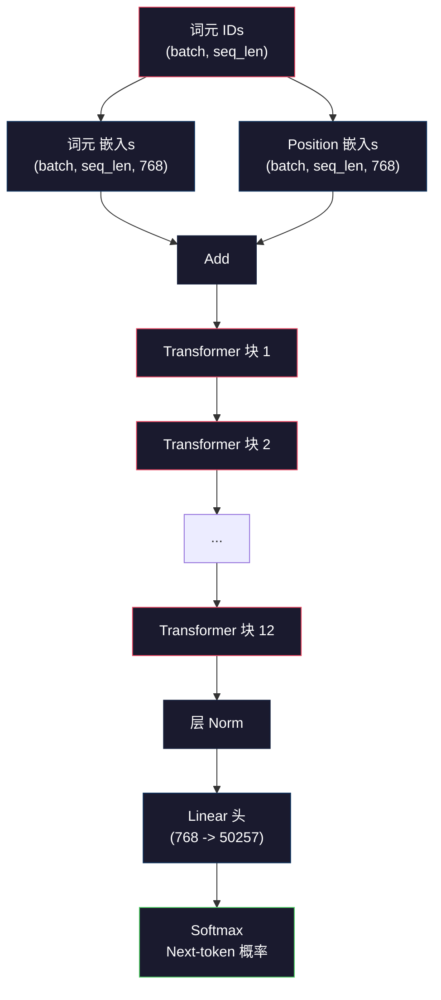
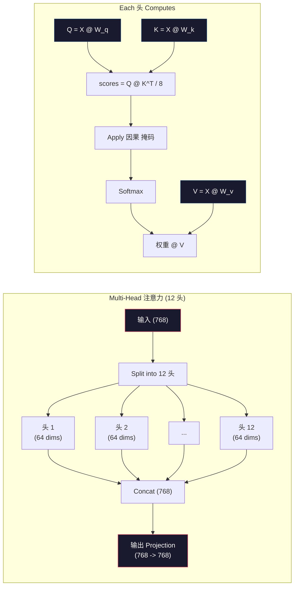
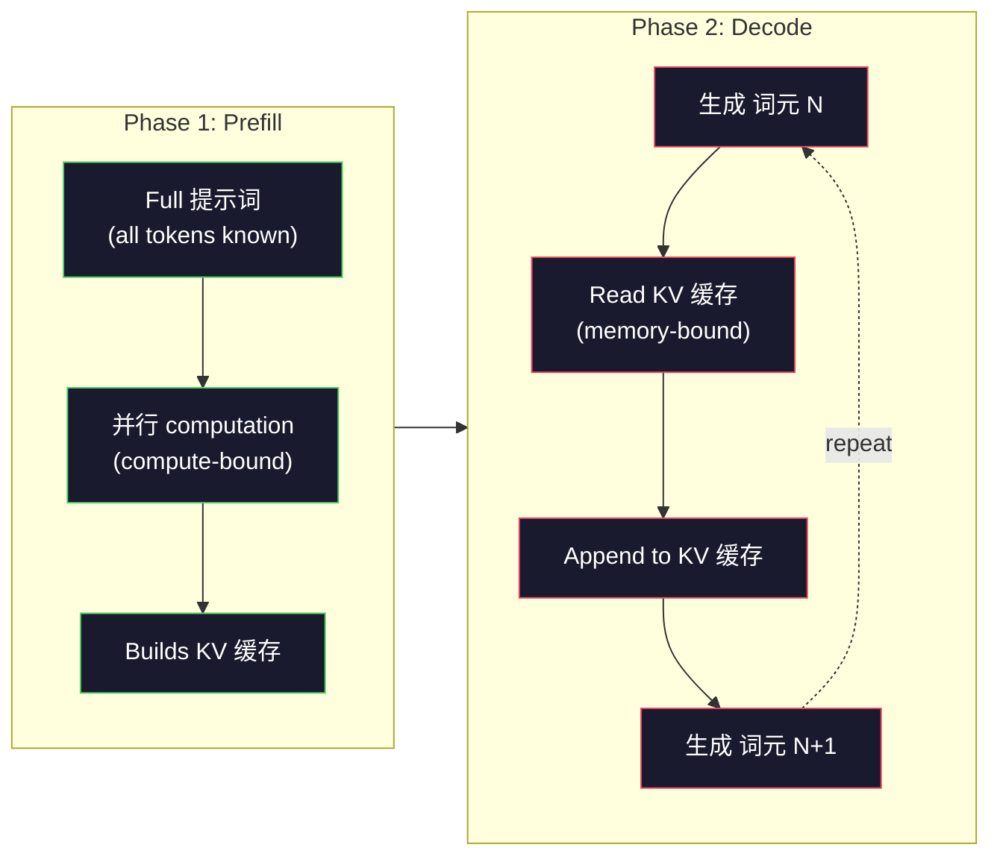

# 预训练 a Mini GPT (124M 参数)

> GPT-2 Small has 124 million 参数. That's 12 transformer 层, 12 注意力 头, and 768-dimensional 嵌入s. You can 训练 it from scratch on a single GPU in a few 小时. Most people never do this. They use pre-trained checkpoints. But if you don't 训练 one yourself, you don't actually understand what's happening inside the 模型 you're building products on.

**类型：** Build
**语言：** Python (with numpy)
**先修：** Phase 10, Lessons 01-03 (分词器s, Building a 分词器, 数据 Pipelines)
**时间：** 约 120 分钟

## 学习目标

- Implement the full GPT-2 架构 (124M 参数) from scratch: 词元 嵌入s, positional 嵌入s, transformer 块, and the 语言模型 头
- 训练 a GPT 模型 on a 文本 语料库 using next-token 预测 with cross-entropy 损失
- Implement autoregressive 文本 生成 with temperature 采样 and top-k/top-p filtering
- Monitor 训练 损失 曲线 and 验证 that the 模型 learns coherent language patterns

## 问题

你know what a transformer is. You have read the diagrams. You can recite "注意力 is all you need" and draw boxes 标签ed "Multi-Head 注意力" on a whiteboard.

None of that means you understand what happens when a 模型 generates 文本.

There are 124,438,272 参数 in GPT-2 Small (with 权重 tying). Every single one of them was set by running a 训练 循环: forward pass, 计算 损失, backward pass, update 权重. Twelve transformer 块. Twelve 注意力 头 per 块. A 768-dimensional 嵌入 space. A 词表 of 50,257 词元. Every time the 模型 generates a 词元, all 124 million 参数 participate in a single matrix multiplication 链 that takes a 序列 of 词元 IDs and produces a 概率 分布 over the next 词元.

如果you have never built this yourself, you are working with a black box. You can use the API. You can fine-tune. But when something goes wrong -- when the 模型 hallucinates, when it repeats itself, when it refuses to follow instructions -- you have no mental 模型 for *why*.

这lesson builds GPT-2 Small from scratch. Not in PyTorch. In numpy. Every matrix multiplication is visible. Every 梯度 is computed by your code. You will see exactly how 124 million numbers conspire to 预测 the next word.

## 概念

### The GPT 架构

GPT is an autoregressive 语言模型. "Autoregressive" means it generates one 词元 at a time, each conditioned on all previous 词元. The 架构 is a stack of transformer 解码器 块.

Here is the full computation 图 from 词元 IDs to next-token 概率:

1. 词元 IDs come in. Shape: (batch_size, seq_len).
2. 词元 嵌入 lookup. Each ID maps to a 768-dimensional vector. Shape: (batch_size, seq_len, 768).
3. Position 嵌入 lookup. Each position (0, 1, 2, ...) maps to a 768-dimensional vector. Same shape.
4. Add 词元 嵌入s + position 嵌入s.
5. Pass through 12 transformer 块.
6. Final 层 归一化.
7. Linear projection to 词表 size. Shape: (batch_size, seq_len, vocab_size).
8. Softmax to get 概率.

那is the entire 模型. No convolutions. No recurrence. Just 嵌入s, 注意力, feedforward networks, and 层 norms stacked 12 times.



### The Transformer 块

Each of the 12 块 follows the same pattern. Pre-norm 架构 (GPT-2 uses pre-norm, not post-norm like the original transformer):

1. LayerNorm
2. Multi-Head Self-Attention
3. Residual connection (add 输入 back)
4. LayerNorm
5. Feed-Forward Network (MLP)
6. Residual connection (add 输入 back)

这个residual connections are critical. Without them, gradients vanish by the time they reach 块 1 during backpropagation. With them, gradients can 流 directly from the 损失 to any 层 through the "skip" path. This is why you can stack 12, 32, or even 96 块 (GPT-4 is rumored to use 120).

### 注意力: The Core Mechanism

Self-attention lets every 词元 look at every previous 词元 and decide how much to attend to each one. Here is the math.

For each 词元 position, 计算 three vectors from the 输入:
- **查询 (Q)**: "What am I looking for?"
- **Key (K)**: "What do I contain?"
- **Value (V)**: "What information do I carry?"

```text
Q = input @ W_q    (768 -> 768)
K = input @ W_k    (768 -> 768)
V = input @ W_v    (768 -> 768)

attention_scores = Q @ K^T / sqrt(d_k)
attention_scores = mask(attention_scores)   # causal mask: -inf for future positions
attention_weights = softmax(attention_scores)
output = attention_weights @ V
```

这个因果 掩码 is what makes GPT autoregressive. Position 5 can attend to positions 0-5 but not 6, 7, 8, and so on. This prevents the 模型 from "cheating" by looking at future 词元 during 训练.

**Multi-head 注意力** splits the 768-dimensional space into 12 头 of 64 维度 each. Each 头 learns a different 注意力 pattern. One 头 might track syntactic relationships (subject-verb agreement). Another might track 语义 相似度 (synonyms). Another might track positional proximity (nearby words). The outputs from all 12 头 are concatenated and projected back to 768 维度.



这个division by sqrt(d_k) -- sqrt(64) = 8 -- is 扩展. Without it, the dot products grow large for high-dimensional vectors, pushing softmax into regions where gradients are nearly zero. This was one of the key insights in the original "注意力 Is All You Need" paper.

### KV 缓存: Why 推理 Is Fast

During 训练, you process the entire 序列 at once. During 推理, you 生成 one 词元 at a time. Without 优化, generating 词元 N requires recomputing 注意力 for all N-1 previous 词元. That is O(N^2) per 生成的 词元, or O(N^3) total for a 序列 of length N.

KV 缓存 solves this. After computing K and V for each 词元, store them. When generating 词元 N+1, you only need to 计算 Q for the new 词元 and look up the cached K and V from all previous 词元. This reduces per-token 成本 from O(N) to O(1) for the K and V computation. The 注意力 分数 calculation is still O(N) because you attend to all previous positions, but you avoid redundant matrix multiplications on the 输入.

For GPT-2 with 12 层 and 12 头, the KV 缓存 stores 2 (K + V) x 12 层 x 12 头 x 64 dims = 18,432 values per 词元. For a 1024-词元 序列, that is about 75MB in FP32. For Llama 3 405B with 128 层, the KV 缓存 for a single 序列 can exceed 10GB. This is why long-context 推理 is memory-bound.

### Prefill vs Decode: Two Phases of 推理

当you send a 提示词 to an LLM, 推理 happens in two distinct phases.

**Prefill** processes your entire 提示词 in 并行. All 词元 are known, so the 模型 can 计算 注意力 for all positions simultaneously. This phase is compute-bound -- the GPU is doing matrix multiplications at full throughput. For a 1000-词元 提示词 on an A100, prefill takes roughly 20-50ms.

**Decode** generates 词元 one at a time. Each new 词元 depends on all previous 词元. This phase is memory-bound -- the bottleneck is reading the 模型 权重 and KV 缓存 from GPU 内存, not the matrix math itself. The GPU's 计算 cores sit mostly idle waiting for 内存 reads. For GPT-2, each decode 步骤 takes about the same time regardless of how many FLOPs the matmuls require, because 内存 bandwidth is the constraint.

这distinction matters for 生产 systems. Prefill throughput scales with GPU 计算 (more FLOPS = faster prefill). Decode throughput scales with 内存 bandwidth (faster 内存 = faster decode). That is why NVIDIA's H100 focused on 内存 bandwidth improvements over the A100 -- it directly speeds up 词元 生成.



### The 训练 循环

训练 an LLM is next-token 预测. Given 词元 [0, 1, 2, ..., N-1], 预测 词元 [1, 2, 3, ..., N]. The 损失函数 is cross-entropy between the 模型's predicted 概率 分布 and the actual next 词元.

One 训练 步骤:

1. **Forward pass**: Run the 批次 through all 12 块. Get logits (pre-softmax scores) for each position.
2. **计算 损失**: Cross-entropy between logits and 目标 词元 (the 输入 shifted by one position).
3. **Backward pass**: 计算 gradients for all 124M 参数 using backpropagation.
4. **优化器 步骤**: Update 权重. GPT-2 uses Adam with 学习 速率 预热 and cosine 衰减.

这个学习 速率 调度 matters more than you might expect. GPT-2 warms up from 0 to the peak 学习 速率 over the first 2,000 步骤, then decays following a cosine 曲线. Starting with a high 学习 速率 causes the 模型 to diverge. Keeping a constant high 速率 causes oscillation in later 训练. The warmup-then-decay pattern is used by every major LLM.

### GPT-2 Small: The Numbers

|Component|Shape|参数|
|-----------|-------|------------|
|词元 嵌入s|(50257, 768)|38,597,376|
|Position 嵌入s|(1024, 768)|786,432|
|Per-block 注意力 (W_q, W_k, W_v, W_out)|4 x (768, 768)|2,359,296|
|Per-block FFN (up + down)|(768, 3072) + (3072, 768)|4,718,592|
|Per-block LayerNorms (2x)|2 x 768 x 2|3,072|
|Final LayerNorm|768 x 2|1,536|
|**Total per 块**||**7,080,960**|
|**Total (12 块)**||**85,054,464 + 39,383,808 = 124,438,272**|

这个输出 projection (logits 头) shares 权重 with the 词元 嵌入 matrix. This is called 权重 tying -- it reduces the 参数 count by 38M and improves performance because it forces the 模型 to use the same representation space for 输入 and 输出.

## 动手构建

### 步骤 1: 嵌入 层

词元 嵌入s map each of the 50,257 possible 词元 to a 768-dimensional vector. Position 嵌入s add information about where each 词元 sits in the 序列. The two are summed.

```python
import numpy as np

class Embedding:
    def __init__(self, vocab_size, embed_dim, max_seq_len):
        self.token_embed = np.random.randn(vocab_size, embed_dim) * 0.02
        self.pos_embed = np.random.randn(max_seq_len, embed_dim) * 0.02

    def forward(self, token_ids):
        seq_len = token_ids.shape[-1]
        tok_emb = self.token_embed[token_ids]
        pos_emb = self.pos_embed[:seq_len]
        return tok_emb + pos_emb
```

这个0.02 standard deviation for initialization comes from the GPT-2 paper. Too large and the initial forward passes produce extreme values that destabilize 训练. Too small and the initial outputs are nearly identical for all inputs, making early 梯度 signals useless.

### 步骤 2: Self-Attention with 因果 掩码

Single-head 注意力 first. The 因果 掩码 sets future positions to negative infinity before softmax, ensuring each position can only attend to itself and earlier positions.

```python
def attention(Q, K, V, mask=None):
    d_k = Q.shape[-1]
    scores = Q @ K.transpose(0, -1, -2 if Q.ndim == 4 else 1) / np.sqrt(d_k)
    if mask is not None:
        scores = scores + mask
    weights = np.exp(scores - scores.max(axis=-1, keepdims=True))
    weights = weights / weights.sum(axis=-1, keepdims=True)
    return weights @ V
```

这个softmax implementation subtracts the maximum before exponentiating. Without this, exp(large_number) overflows to infinity. This is a numerical stability trick that does not change the 输出 because softmax(x - c) = softmax(x) for any constant c.

### 步骤 3: Multi-Head 注意力

Split the 768-dimensional 输入 into 12 头 of 64 维度 each. Each 头 computes 注意力 independently. Concatenate the results and project back to 768 维度.

```python
class MultiHeadAttention:
    def __init__(self, embed_dim, num_heads):
        self.num_heads = num_heads
        self.head_dim = embed_dim // num_heads
        self.W_q = np.random.randn(embed_dim, embed_dim) * 0.02
        self.W_k = np.random.randn(embed_dim, embed_dim) * 0.02
        self.W_v = np.random.randn(embed_dim, embed_dim) * 0.02
        self.W_out = np.random.randn(embed_dim, embed_dim) * 0.02

    def forward(self, x, mask=None):
        batch, seq_len, d = x.shape
        Q = (x @ self.W_q).reshape(batch, seq_len, self.num_heads, self.head_dim).transpose(0, 2, 1, 3)
        K = (x @ self.W_k).reshape(batch, seq_len, self.num_heads, self.head_dim).transpose(0, 2, 1, 3)
        V = (x @ self.W_v).reshape(batch, seq_len, self.num_heads, self.head_dim).transpose(0, 2, 1, 3)

        scores = Q @ K.transpose(0, 1, 3, 2) / np.sqrt(self.head_dim)
        if mask is not None:
            scores = scores + mask
        weights = np.exp(scores - scores.max(axis=-1, keepdims=True))
        weights = weights / weights.sum(axis=-1, keepdims=True)
        attn_out = weights @ V

        attn_out = attn_out.transpose(0, 2, 1, 3).reshape(batch, seq_len, d)
        return attn_out @ self.W_out
```

这个reshape-transpose-reshape dance is the most confusing part of multi-head 注意力. Here is what happens: the (批次, seq_len, 768) tensor becomes (批次, seq_len, 12, 64), then (批次, 12, seq_len, 64). Now each of the 12 头 has its own (seq_len, 64) matrix to run 注意力 on. After 注意力, we reverse the process: (批次, 12, seq_len, 64) becomes (批次, seq_len, 12, 64) becomes (批次, seq_len, 768).

### 步骤 4: Transformer 块

One complete transformer 块: LayerNorm, multi-head 注意力 with residual, LayerNorm, feedforward with residual.

```python
class LayerNorm:
    def __init__(self, dim, eps=1e-5):
        self.gamma = np.ones(dim)
        self.beta = np.zeros(dim)
        self.eps = eps

    def forward(self, x):
        mean = x.mean(axis=-1, keepdims=True)
        var = x.var(axis=-1, keepdims=True)
        return self.gamma * (x - mean) / np.sqrt(var + self.eps) + self.beta


class FeedForward:
    def __init__(self, embed_dim, ff_dim):
        self.W1 = np.random.randn(embed_dim, ff_dim) * 0.02
        self.b1 = np.zeros(ff_dim)
        self.W2 = np.random.randn(ff_dim, embed_dim) * 0.02
        self.b2 = np.zeros(embed_dim)

    def forward(self, x):
        h = x @ self.W1 + self.b1
        h = np.maximum(0, h)  # GELU approximation: ReLU for simplicity
        return h @ self.W2 + self.b2


class TransformerBlock:
    def __init__(self, embed_dim, num_heads, ff_dim):
        self.ln1 = LayerNorm(embed_dim)
        self.attn = MultiHeadAttention(embed_dim, num_heads)
        self.ln2 = LayerNorm(embed_dim)
        self.ffn = FeedForward(embed_dim, ff_dim)

    def forward(self, x, mask=None):
        x = x + self.attn.forward(self.ln1.forward(x), mask)
        x = x + self.ffn.forward(self.ln2.forward(x))
        return x
```

这个feedforward network expands the 768-dimensional 输入 to 3,072 维度 (4x), applies a nonlinearity, then projects back to 768. This expansion-contraction pattern gives the 模型 a "wider" internal representation to work with at each position. GPT-2 uses GELU 激活, but we use ReLU here for simplicity -- the difference is minor for understanding the 架构.

### 步骤 5: Full GPT 模型

Stack 12 transformer 块. Add the 嵌入 层 at the front and the 输出 projection at the back.

```python
class MiniGPT:
    def __init__(self, vocab_size=50257, embed_dim=768, num_heads=12,
                 num_layers=12, max_seq_len=1024, ff_dim=3072):
        self.embedding = Embedding(vocab_size, embed_dim, max_seq_len)
        self.blocks = [
            TransformerBlock(embed_dim, num_heads, ff_dim)
            for _ in range(num_layers)
        ]
        self.ln_f = LayerNorm(embed_dim)
        self.vocab_size = vocab_size
        self.embed_dim = embed_dim

    def forward(self, token_ids):
        seq_len = token_ids.shape[-1]
        mask = np.triu(np.full((seq_len, seq_len), -1e9), k=1)

        x = self.embedding.forward(token_ids)
        for block in self.blocks:
            x = block.forward(x, mask)
        x = self.ln_f.forward(x)

        logits = x @ self.embedding.token_embed.T
        return logits

    def count_parameters(self):
        total = 0
        total += self.embedding.token_embed.size
        total += self.embedding.pos_embed.size
        for block in self.blocks:
            total += block.attn.W_q.size + block.attn.W_k.size
            total += block.attn.W_v.size + block.attn.W_out.size
            total += block.ffn.W1.size + block.ffn.b1.size
            total += block.ffn.W2.size + block.ffn.b2.size
            total += block.ln1.gamma.size + block.ln1.beta.size
            total += block.ln2.gamma.size + block.ln2.beta.size
        total += self.ln_f.gamma.size + self.ln_f.beta.size
        return total
```

Notice the 权重 tying: `logits = x @ self.embedding.token_embed.T`. The 输出 projection reuses the 词元 嵌入 matrix (transposed). This is not just a parameter-saving trick. It means the 模型 uses the same vector space for understanding 词元 (嵌入s) and predicting them (输出).

### 步骤 6: 训练 循环

For a 真实 训练 run on 124M 参数, you would need a GPU and PyTorch. This 训练 循环 demonstrates the mechanics on a small 模型 that runs in pure numpy. We use a tiny 模型 (4 层, 4 头, 128 dims) to make it tractable.

```python
def cross_entropy_loss(logits, targets):
    batch, seq_len, vocab_size = logits.shape
    logits_flat = logits.reshape(-1, vocab_size)
    targets_flat = targets.reshape(-1)

    max_logits = logits_flat.max(axis=-1, keepdims=True)
    log_softmax = logits_flat - max_logits - np.log(
        np.exp(logits_flat - max_logits).sum(axis=-1, keepdims=True)
    )

    loss = -log_softmax[np.arange(len(targets_flat)), targets_flat].mean()
    return loss


def train_mini_gpt(text, vocab_size=256, embed_dim=128, num_heads=4,
                   num_layers=4, seq_len=64, num_steps=200, lr=3e-4):
    tokens = np.array(list(text.encode("utf-8")[:2048]))
    model = MiniGPT(
        vocab_size=vocab_size, embed_dim=embed_dim, num_heads=num_heads,
        num_layers=num_layers, max_seq_len=seq_len, ff_dim=embed_dim * 4
    )

    print(f"Model parameters: {model.count_parameters():,}")
    print(f"Training tokens: {len(tokens):,}")
    print(f"Config: {num_layers} layers, {num_heads} heads, {embed_dim} dims")
    print()

    for step in range(num_steps):
        start_idx = np.random.randint(0, max(1, len(tokens) - seq_len - 1))
        batch_tokens = tokens[start_idx:start_idx + seq_len + 1]

        input_ids = batch_tokens[:-1].reshape(1, -1)
        target_ids = batch_tokens[1:].reshape(1, -1)

        logits = model.forward(input_ids)
        loss = cross_entropy_loss(logits, target_ids)

        if step % 20 == 0:
            print(f"Step {step:4d} | Loss: {loss:.4f}")

    return model
```

这个损失 starts near ln(vocab_size) -- for a 256-词元 byte-level 词表, that is ln(256) = 5.55. A random 模型 assigns equal 概率 to every 词元. As 训练 progresses, the 损失 drops because the 模型 learns to 预测 common patterns: "th" after "t", space after a period, and so on.

In 生产, you would use Adam 优化器 with 梯度 accumulation, 学习 速率 预热, and 梯度 clipping. The forward-pass-loss-backward-update 循环 is identical. The 优化器 is more sophisticated.

### 步骤 7: 文本 生成

生成 uses the 训练后的 模型 to 预测 one 词元 at a time. Each 预测 is sampled from the 输出 分布 (or taken greedily as the argmax).

```python
def generate(model, prompt_tokens, max_new_tokens=100, temperature=0.8):
    tokens = list(prompt_tokens)
    seq_len = model.embedding.pos_embed.shape[0]

    for _ in range(max_new_tokens):
        context = np.array(tokens[-seq_len:]).reshape(1, -1)
        logits = model.forward(context)
        next_logits = logits[0, -1, :]

        next_logits = next_logits / temperature
        probs = np.exp(next_logits - next_logits.max())
        probs = probs / probs.sum()

        next_token = np.random.choice(len(probs), p=probs)
        tokens.append(next_token)

    return tokens
```

Temperature controls randomness. Temperature 1.0 uses the raw 分布. Temperature 0.5 sharpens it (more deterministic -- the 模型 picks its top choices more often). Temperature 1.5 flattens it (more random -- low-probability 词元 get a bigger chance). Temperature 0.0 is greedy decoding (always pick the highest 概率 词元).

这个`tokens[-seq_len:]` window is necessary because the 模型 has a maximum 上下文 length (1024 for GPT-2). Once you exceed it, you must drop the oldest 词元. This is the "上下文 window" that everyone talks about.

```figure
sampling-decoder
```

## 实际使用

### Full 训练 and 生成 Demo

```python
corpus = """The transformer architecture has revolutionized natural language processing.
Attention mechanisms allow the model to focus on relevant parts of the input.
Self-attention computes relationships between all pairs of positions in a sequence.
Multi-head attention splits the representation into multiple subspaces.
Each attention head can learn different types of relationships.
The feedforward network provides nonlinear transformations at each position.
Residual connections enable gradient flow through deep networks.
Layer normalization stabilizes training by normalizing activations.
Position embeddings give the model information about token ordering.
The causal mask ensures autoregressive generation during training.
Pre-training on large text corpora teaches the model general language understanding.
Fine-tuning adapts the pre-trained model to specific downstream tasks."""

model = train_mini_gpt(corpus, num_steps=200)

prompt = list("The transformer".encode("utf-8"))
output_tokens = generate(model, prompt, max_new_tokens=100, temperature=0.8)
generated_text = bytes(output_tokens).decode("utf-8", errors="replace")
print(f"\nGenerated: {generated_text}")
```

On a small 语料库 with a small 模型, the 生成的 文本 will be semi-coherent at best. It will learn some byte-level patterns from the 训练 文本 but cannot generalize the way GPT-2 does with 40GB of 训练 数据 and the full 124M 参数 架构. The point is not the 输出 质量. The point is that you can trace every 步骤: 嵌入 lookup, 注意力 computation, feedforward transformation, logit projection, softmax, and 采样. Every operation is visible.

## 交付成果

这lesson produces `outputs/prompt-gpt-architecture-analyzer.md` -- a 提示词 that analyzes the 架构 choices in any GPT-style 模型. Feed it a 模型 card or technical report and it breaks down the 参数 allocation, 注意力 design, and 扩展 decisions.

## 练习

1. Modify the 模型 to use 24 层 and 16 头 instead of 12/12. Count the 参数. How does doubling the 深度 compare to doubling the 宽度 (嵌入 维度)?

2. Implement the GELU 激活 函数 (GELU(x) = x * 0.5 * (1 + erf(x / sqrt(2)))) and replace the ReLU in the feedforward network. Run 训练 for 500 步骤 with each 激活 and compare the final 损失.

3. Add a KV 缓存 to the 生成 函数. Store K and V tensors for each 层 after the first forward pass, and reuse them for subsequent 词元. Measure the speedup: 生成 200 词元 with and without the 缓存 and compare wall-clock time.

4. Implement top-k 采样 (only consider the k highest-probability 词元) and top-p 采样 (nucleus 采样: consider the smallest set of 词元 whose cumulative 概率 exceeds p). Compare the 输出 质量 at temperature 0.8 with top-k=50 vs top-p=0.95.

5. 构建a 训练 损失 曲线 plotter. 训练 the 模型 for 1000 步骤 and plot 损失 vs 步骤. Identify the three phases: rapid initial descent (学习 common bytes), slower middle phase (学习 byte patterns), and plateau (过拟合 on the small 语料库). The shape of this 曲线 is the same whether you are 训练 a 128-dim 模型 or GPT-4.

## Key Terms

|Term|What people say|What it actually means|
|------|----------------|----------------------|
|Autoregressive|"It generates one word at a time"|Each 输出 词元 is conditioned on all previous 词元 -- the 模型 predicts P(token_n \|token_0, ..., token_{n-1})|
|因果 掩码|"It can't see the future"|An upper-triangular matrix of -infinity values that prevents 注意力 to future positions during 训练|
|Multi-head 注意力|"Multiple 注意力 patterns"|Splitting Q, K, V into 并行 头 (e.g., 12 头 of 64 dims each for GPT-2) so each 头 can learn different relationship types|
|KV 缓存|"缓存 for speed"|Storing computed Key and Value tensors from previous 词元 to avoid redundant computation during autoregressive 生成|
|Prefill|"Processing the 提示词"|The first 推理 phase where all 提示词 词元 are processed in 并行 -- compute-bound on GPU FLOPS|
|Decode|"Generating 词元"|The second 推理 phase where 词元 are 生成的 one at a time -- memory-bound on GPU bandwidth|
|权重 tying|"Sharing 嵌入s"|Using the same matrix for 输入 词元 嵌入s and the 输出 projection 头 -- saves 38M params in GPT-2|
|Residual connection|"Skip connection"|Adding the 输入 directly to the 输出 of a sublayer (x + sublayer(x)) -- enables 梯度 流 in deep networks|
|层 归一化|"Normalizing activations"|Normalizing across the 特征 维度 to mean 0 and 方差 1, with learnable 规模 and 偏差 参数|
|Cross-entropy 损失|"How wrong the predictions are"|-log(probability assigned to the correct next token), averaged over all positions -- the standard LLM 训练 目标|

## 延伸阅读

- [Radford et al., 2019 -- "Language Models are Unsupervised Multitask Learners" (GPT-2)](https://cdn.openai.com/better-language-models/language_models_are_unsupervised_multitask_learners.pdf) -- the GPT-2 paper that introduced the 124M to 1.5B 参数 family
- [Vaswani et al., 2017 -- "Attention Is All You Need"](https://arxiv.org/abs/1706.03762) -- the original transformer paper with scaled dot-product 注意力 and multi-head 注意力
- [Llama 3 Technical Report](https://arxiv.org/abs/2407.21783) -- how Meta scaled the GPT 架构 to 405B 参数 with 16K GPUs
- [Pope et al., 2022 -- "Efficiently Scaling Transformer Inference"](https://arxiv.org/abs/2211.05102) -- the paper that formalized prefill vs decode and KV 缓存 analysis
