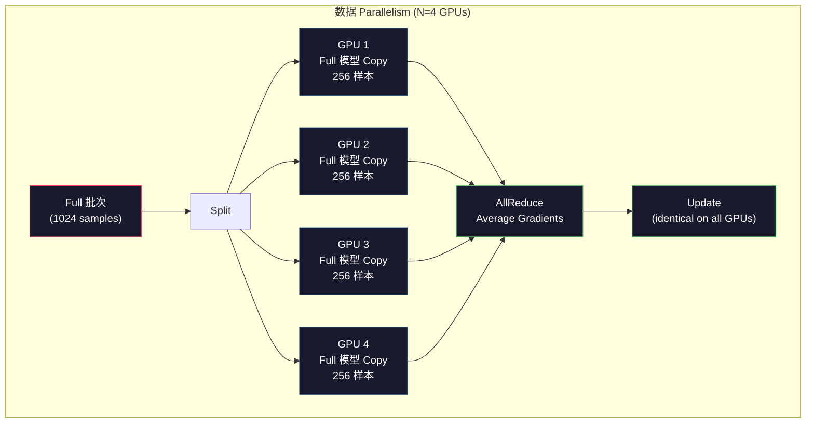
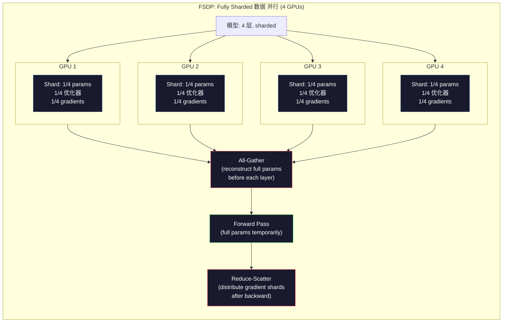
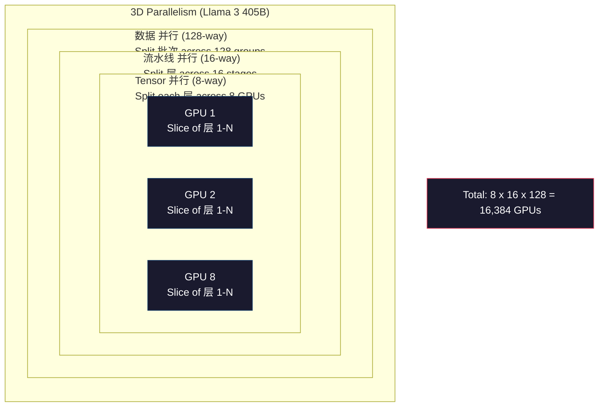

# 扩展: 分布式 训练, FSDP, DeepSpeed

> 你的124M 模型 训练后的 on one GPU. Now try 7 billion 参数. The 模型 doesn't fit in 内存. The 数据 takes weeks on a single machine. 分布式 训练 isn't optional at 规模. It's the only path forward.

**类型：** Build
**语言：** Python
**先修：** Phase 10, Lesson 04 (预训练 a Mini GPT)
**时间：** 约 120 分钟

## 学习目标

- 解释the three types of parallelism (数据, tensor, 流水线) and when each is necessary based on 模型 and cluster size
- Implement data-parallel 训练 using PyTorch DDP with 梯度 synchronization across multiple GPUs
- Calculate the 内存 预算 for a given 模型 size (权重 + 优化器 states + gradients + activations) to determine the minimum hardware
- Configure FSDP or DeepSpeed ZeRO stages to shard 模型 states across GPUs and fit 模型 that exceed single-GPU 内存

## 问题

一个7B 参数 模型 in FP16 needs 14GB just for the 权重. Adam 优化器 stores two additional copies of every 参数 (first and second moment estimates). That is another 28GB. Gradients during backpropagation add 14GB more. You are at 56GB before a single 激活 is stored.

一个NVIDIA A100 has 80GB of 内存.

56GB out of 80GB consumed. That leaves 24GB for activations -- the intermediate values computed during the forward pass that must be kept alive for backpropagation. For a 2048-词元 序列 with a 4096-dimensional 模型, a single 层's activations use about 64MB. With 32 层, you need 2GB per 样本. A 批次 size of 8 requires 16GB. You have 24GB. A 批次 size of 12 blows up.

Now try 70B 参数. 权重 alone: 140GB in FP16. Does not fit on one GPU. You need at least 2 A100s (2 x 80GB = 160GB) just to hold the 权重. Add 优化器 states and gradients and you need far more: 3+ GPUs minimum, and realistically 8-16 depending on sharding strategy.

Llama 3 405B was 训练后的 on 16,384 NVIDIA H100 GPUs. The 训练 run 成本 an estimated $100 million in 计算. DeepSeek V3 训练后的 a comparable 模型 for roughly $5.6 million by being clever about 架构 (Mixture of Experts means only a fraction of 参数 activate per 词元) and 训练 efficiency.

这lesson covers the four strategies that make large-scale 训练 possible: 数据 parallelism, tensor parallelism, 流水线 parallelism, and fully sharded 数据 parallelism. You will simulate each one in pure Python to understand the mechanics before ever touching a 分布式 训练 framework.

## 概念

### Why 分布 is Required

Here is the 内存 math for 真实 模型. Every number is calculated, not estimated.

|模型|Params|权重 (FP16)|Adam States|Gradients (FP16)|Total (no activations)|
|-------|--------|----------------|-------------|------------------|----------------------|
|GPT-2 Small|124M|248 MB|992 MB|248 MB|1.5 GB|
|Llama 3 8B|8B|16 GB|64 GB|16 GB|96 GB|
|Llama 3 70B|70B|140 GB|560 GB|140 GB|840 GB|
|Llama 3 405B|405B|810 GB|3,240 GB|810 GB|4,860 GB|

这个"Adam States" column is the killer. Adam stores a running mean (m) and a running 方差 (v) for every 参数, both in FP32. For a 70B 模型, that is 70B x 4 bytes x 2 = 560GB. The 优化器 alone needs seven A100s.

一个single H100 has 80GB. Llama 3 405B needs at least 61 H100s to hold the 权重, 优化器, and gradients. Add activations and the number grows further. Meta used 16,384 GPUs not because they wanted to -- because they had to.

### 数据 Parallelism

这个simplest 分布式 strategy. Copy the entire 模型 to N GPUs. Split each 训练 批次 into N equal parts. Each GPU runs a forward and backward pass on its shard of the 数据. After the backward pass, average the gradients across all GPUs. Every GPU updates its copy of the 权重 with the same averaged gradients, keeping all copies in sync.

**The good:** Linear throughput 扩展. N GPUs process N times more 数据 per 步骤. Communication is limited to 梯度 averaging, which overlaps with computation.

**The bad:** Every GPU holds a complete copy of the 模型, 优化器 states, and gradients. For a 70B 模型, each GPU needs 840GB. 数据 parallelism does nothing to reduce per-GPU 内存. It only reduces 训练 time.

**The math:** Effective 批次 size = per_gpu_batch_size x N. For N=64 GPUs with per-GPU 批次 of 16, the effective 批次 is 1,024. Llama 3 used an effective 批次 size of 16 million 词元 per 步骤.



### Tensor Parallelism

Split individual 层 across GPUs. A single matrix multiplication is divided among GPUs, each computing part of the result.

Consider a 权重 matrix of shape (8192, 8192) in a feedforward 层. With 4-way tensor parallelism, each GPU holds a (8192, 2048) shard. Each GPU multiplies the 输入 by its shard, producing a partial result. The partial results are combined (via all-reduce or all-gather) to produce the full 输出.

**The good:** Reduces per-GPU 内存 for 模型 权重. A 70B 模型 split across 8 GPUs means each GPU holds ~8.75B 参数 worth of 权重.

**The bad:** Requires fast inter-GPU communication after every 层. The all-reduce after each matmul adds 延迟. This works well with NVLink (900 GB/s between GPUs on the same 节点) but poorly across nodes connected by InfiniBand (400 Gb/s, about 50 GB/s). Tensor parallelism is almost always limited to within a single 节点 (8 GPUs).

**真实 usage:** Megatron-LM pioneered tensor parallelism. Llama 3 405B uses 8-way tensor parallelism within each 节点.

### 流水线 Parallelism

Split the 模型 by 层. GPU 1 runs 层 1-8. GPU 2 runs 层 9-16. GPU 3 runs 层 17-24. GPU 4 runs 层 25-32. 数据 flows through the 流水线: GPU 1 computes its 层 and sends activations to GPU 2, which computes its 层 and sends to GPU 3, and so on.

**The good:** Minimal communication between GPUs -- just the activations at 层 boundaries, which are small compared to gradients or 权重. Works across nodes because bandwidth requirements are low.

**The bad:** 流水线 bubbles. When GPU 4 is computing the forward pass on micro-batch 1, GPUs 1, 2, and 3 are idle (they have already forwarded their portion). During backward pass, the pattern reverses. With naive pipelining, GPU utilization is only 1/N for N 流水线 stages.

**GPipe and PipeDream** solve the bubble problem by splitting the 批次 into micro-batches. GPU 1 starts on micro-batch 2 as soon as it finishes forwarding micro-batch 1. This overlaps computation across 流水线 stages. With M micro-batches and N stages, the bubble fraction drops to (N-1)/M. Use M=16 micro-batches with N=4 stages and the bubble is 3/16 = 18.75% idle time.

### FSDP: Fully Sharded 数据 并行

FSDP combines the scalability of 数据 parallelism with the 内存 efficiency of sharding. Instead of each GPU holding a complete copy of the 模型, each GPU holds only 1/N of the 参数, gradients, and 优化器 states.

Before a 层's forward pass, FSDP runs an **all-gather** to collect the full 参数 from all GPUs into each GPU's 内存. After the forward pass, each GPU discards the non-local 参数. During backward, the all-gather runs again to reconstruct 参数 for 梯度 computation. After the backward pass, a **reduce-scatter** distributes 梯度 shards so each GPU only stores 1/N of the gradients.

**The math for a 70B 模型 on 8 GPUs:**

|Component|Without FSDP|With FSDP|
|-----------|-------------|-----------|
|权重 (FP16)|140 GB per GPU|17.5 GB per GPU|
|Adam States (FP32)|560 GB per GPU|70 GB per GPU|
|Gradients (FP16)|140 GB per GPU|17.5 GB per GPU|
|**Total**|**840 GB per GPU**|**105 GB per GPU**|

Without FSDP, you cannot fit a 70B 模型 on a single 80GB GPU. With FSDP on 8 GPUs, each GPU uses 105GB -- wait, that still does not fit. You need at least 16 GPUs to get under 80GB per GPU, or you combine FSDP with 激活 checkpointing (recompute activations during backward instead of storing them).

这个communication 成本 is higher than vanilla 数据 parallelism because of the all-gather before each 层. But the 内存 savings make previously impossible 训练 runs possible.



### DeepSpeed ZeRO

DeepSpeed's ZeRO (Zero Redundancy 优化器) is conceptually identical to FSDP but was developed independently by Microsoft. It defines three stages, each sharding more aggressively:

|Stage|Shards|内存 Savings|Communication|
|-------|--------|---------------|---------------|
|ZeRO-1|优化器 states only|~4x reduction|Same as 数据 并行|
|ZeRO-2|+ Gradients|~8x reduction|Slightly more|
|ZeRO-3|+ 参数|~Nx reduction (N GPUs)|All-gather per 层|

ZeRO-3 is equivalent to FSDP. The naming is different, the mechanism is the same. PyTorch added FSDP as a native implementation after DeepSpeed proved the concept.

DeepSpeed also introduced ZeRO-Offload (offload 优化器 states to CPU RAM, which is cheaper and larger) and ZeRO-Infinity (offload to NVMe SSDs). These trade 计算 speed for 内存 capacity -- the offloaded operations are slower but free up GPU 内存.

### Mixed Precision 训练

Modern 训练 uses multiple floating-point formats simultaneously:

- **Forward pass**: FP16 or BF16 (16-bit). Half the 内存 of FP32. Matmuls run 2x faster on tensor cores.
- **Master 权重**: FP32 (32-bit). Maintained by the 优化器 for numerical precision during 权重 updates.
- **损失 扩展**: Multiply the 损失 by a large constant before backward pass to prevent FP16 gradients from underflowing to zero. Divide by the same constant before the 优化器 步骤.

BF16 (Brain Float 16) has the same exponent range as FP32 (8 exponent bits) but reduced precision (7 mantissa bits vs FP32's 23). It rarely needs 损失 扩展 because it can represent the same range of values. FP16 has 5 exponent bits and 10 mantissa bits -- it can represent fine-grained values but overflows/underflows at extreme magnitudes.

Google's TPUs use BF16 natively. NVIDIA's A100 and H100 support both FP16 and BF16. The industry has largely moved to BF16 because it eliminates 损失 扩展 headaches.

**内存 comparison for a 7B 模型:**

|Precision|权重|优化器|Gradients|Total|
|-----------|---------|-----------|-----------|-------|
|FP32 everywhere|28 GB|56 GB|28 GB|112 GB|
|Mixed (BF16 + FP32 master)|14 GB|56 GB|14 GB|84 GB|

Mixed precision saves 28GB on this 模型. The 优化器 states stay in FP32 regardless -- this is where most of the 内存 goes.

### Megatron-LM and 3D Parallelism

真实 large-scale 训练 combines all three parallelisms:

- **数据 parallelism** across groups of nodes (规模 批次 size)
- **Tensor parallelism** within a 节点 (split 层 across 8 GPUs)
- **流水线 parallelism** across nodes (split 层 groups across machines)

Llama 3 405B on 16,384 H100s:
- 8-way tensor parallelism within each 节点 (8 GPUs per 节点)
- 16-way 流水线 parallelism across nodes (16 流水线 stages)
- 128-way 数据 parallelism across the remaining 维度 (16,384 / 8 / 16 = 128)

这3D decomposition (8 x 16 x 128 = 16,384) is how you 规模 to thousands of GPUs. Each GPU sees a different 数据 shard (数据 并行), holds one slice of each 层 (tensor 并行), and computes a different set of 层 (流水线 并行).

DeepSeek V3 took a different approach. Their Mixture of Experts 架构 activates only 37B out of 671B 参数 per 词元. This means each GPU only needs to 计算 (and store activations for) the active 参数. They 训练后的 on 2,048 H800 GPUs -- less than 1/8 of Meta's GPU count -- for $5.6M vs Meta's estimated $100M.



```figure
paged-kv-cache
```

## 动手构建

### 步骤 1: Simulate 数据 Parallelism

Split a 批次 across simulated GPUs. Each GPU computes a forward pass on its shard. Average the "gradients" (we simulate them as the 损失 values).

```python
import numpy as np

def simulate_data_parallelism(data, num_gpus, model_fn):
    batch_size = len(data)
    shard_size = batch_size // num_gpus
    remainder = batch_size % num_gpus

    gpu_losses = []
    gpu_gradients = []

    offset = 0
    for gpu_id in range(num_gpus):
        extra = 1 if gpu_id < remainder else 0
        shard = data[offset:offset + shard_size + extra]
        offset += shard_size + extra

        loss, grad = model_fn(shard)
        gpu_losses.append(loss)
        gpu_gradients.append(grad)

    avg_loss = np.mean(gpu_losses)
    avg_gradient = np.mean(gpu_gradients, axis=0)

    return avg_loss, avg_gradient
```

这个all-reduce operation (averaging gradients) is the only communication in 数据 parallelism. In practice, this uses the NCCL library on NVIDIA GPUs, which implements ring all-reduce: each GPU sends 1/N of its gradients to its neighbor, receives 1/N from the other neighbor, and after N-1 步骤 every GPU has the complete average. Total communication volume: 2 x gradient_size x (N-1)/N, approaching 2x the 梯度 size for large N.

### 步骤 2: Simulate Tensor Parallelism

Split a 权重 matrix across GPUs. Each GPU computes a partial matrix multiplication. Combine the results.

```python
def simulate_tensor_parallelism(input_data, weight_matrix, num_gpus):
    d_in, d_out = weight_matrix.shape
    assert d_out % num_gpus == 0, f"d_out {d_out} not divisible by num_gpus {num_gpus}"
    shard_size = d_out // num_gpus

    partial_results = []
    for gpu_id in range(num_gpus):
        start = gpu_id * shard_size
        end = start + shard_size
        weight_shard = weight_matrix[:, start:end]

        partial = input_data @ weight_shard
        partial_results.append(partial)

    full_output = np.concatenate(partial_results, axis=-1)

    direct_output = input_data @ weight_matrix
    error = np.abs(full_output - direct_output).max()

    return full_output, error
```

这个错误 should be exactly zero (or machine epsilon). Tensor parallelism is mathematically exact -- it produces the same result as computing the full matmul on one GPU. The split is along the 输出 维度, so each GPU produces a different 分块 of columns, and concatenation reconstructs the full result.

For column-parallel linear 层 (splitting the 输出 维度), you concatenate. For row-parallel (splitting the 输入 维度), you sum. In a transformer FFN, the first linear (expand) uses column-parallel and the second linear (contract) uses row-parallel. This avoids an all-reduce between the two 层.

### 步骤 3: Simulate 流水线 Parallelism

Split a 模型's 层 across virtual GPUs. Show the bubble problem where early stages sit idle while later stages 计算.

```python
def simulate_pipeline_parallelism(num_layers, num_stages, num_microbatches):
    layers_per_stage = num_layers // num_stages

    timeline = {}
    clock = 0

    for mb in range(num_microbatches):
        for stage in range(num_stages):
            start_time = max(
                timeline.get((stage, mb - 1, "fwd"), (0, 0))[1] if mb > 0 else 0,
                timeline.get((stage - 1, mb, "fwd"), (0, 0))[1] if stage > 0 else 0,
            )
            end_time = start_time + layers_per_stage
            timeline[(stage, mb, "fwd")] = (start_time, end_time)

    last_fwd_end = max(v[1] for v in timeline.values())

    for mb in range(num_microbatches - 1, -1, -1):
        for stage in range(num_stages - 1, -1, -1):
            deps = [last_fwd_end]
            if mb < num_microbatches - 1 and (stage, mb + 1, "bwd") in timeline:
                deps.append(timeline[(stage, mb + 1, "bwd")][1])
            if stage < num_stages - 1 and (stage + 1, mb, "bwd") in timeline:
                deps.append(timeline[(stage + 1, mb, "bwd")][1])
            start_time = max(deps)
            end_time = start_time + layers_per_stage
            timeline[(stage, mb, "bwd")] = (start_time, end_time)

    total_time = max(v[1] for v in timeline.values())
    compute_time = num_microbatches * num_stages * layers_per_stage * 2
    bubble_fraction = 1.0 - compute_time / (total_time * num_stages)

    return timeline, total_time, bubble_fraction
```

With 4 stages and 1 micro-batch, the bubble fraction is 75% -- three out of four GPUs idle at any time. With 16 micro-batches, it drops to about 19%. The 成本 of eliminating bubbles is 内存: you must store activations for all in-flight micro-batches simultaneously.

### 步骤 4: 内存 Calculator

计算 the exact 内存 requirements for 训练 any 模型 size.

```python
def memory_calculator(
    params_billions,
    precision_bytes=2,
    optimizer="adam",
    num_gpus=1,
    sharding="none",
    sequence_length=2048,
    batch_size_per_gpu=1,
    hidden_dim=None,
    num_layers=None,
):
    params = params_billions * 1e9

    weight_memory = params * precision_bytes

    if optimizer == "adam":
        optimizer_memory = params * 4 * 2
    elif optimizer == "sgd":
        optimizer_memory = params * 4
    else:
        optimizer_memory = 0

    gradient_memory = params * precision_bytes

    total_no_activation = weight_memory + optimizer_memory + gradient_memory

    if hidden_dim and num_layers:
        activation_per_layer = (
            sequence_length * batch_size_per_gpu * hidden_dim * precision_bytes * 4
        )
        activation_memory = activation_per_layer * num_layers
    else:
        activation_memory = params * precision_bytes * 0.5

    if sharding == "fsdp" or sharding == "zero3":
        weight_memory /= num_gpus
        optimizer_memory /= num_gpus
        gradient_memory /= num_gpus
    elif sharding == "zero2":
        optimizer_memory /= num_gpus
        gradient_memory /= num_gpus
    elif sharding == "zero1":
        optimizer_memory /= num_gpus

    per_gpu_total = weight_memory + optimizer_memory + gradient_memory + activation_memory

    return {
        "params_billions": params_billions,
        "weights_gb": weight_memory / 1e9,
        "optimizer_gb": optimizer_memory / 1e9,
        "gradients_gb": gradient_memory / 1e9,
        "activations_gb": activation_memory / 1e9,
        "per_gpu_total_gb": per_gpu_total / 1e9,
        "total_across_gpus_gb": per_gpu_total * num_gpus / 1e9,
        "fits_on_80gb": per_gpu_total / 1e9 <= 80,
        "num_gpus": num_gpus,
        "sharding": sharding,
    }
```

这calculator answers the 问题 every ML engineer asks: "How many GPUs do I need?" Feed it the 模型 size and see whether it fits. Adjust sharding strategy until the per-GPU total drops below 80GB.

### 步骤 5: Mixed Precision Simulation

比较内存 usage between FP32, FP16, and mixed precision 训练.

```python
def mixed_precision_comparison(params_billions):
    params = params_billions * 1e9

    fp32_weights = params * 4
    fp32_optimizer = params * 4 * 2
    fp32_gradients = params * 4
    fp32_total = fp32_weights + fp32_optimizer + fp32_gradients

    fp16_weights = params * 2
    fp16_master = params * 4
    fp16_optimizer = params * 4 * 2
    fp16_gradients = params * 2
    fp16_total = fp16_weights + fp16_master + fp16_optimizer + fp16_gradients

    mixed_weights = params * 2
    mixed_optimizer = params * 4 * 2
    mixed_gradients = params * 2
    mixed_total = mixed_weights + mixed_optimizer + mixed_gradients

    return {
        "fp32_total_gb": fp32_total / 1e9,
        "fp16_with_master_gb": fp16_total / 1e9,
        "mixed_bf16_gb": mixed_total / 1e9,
        "savings_vs_fp32": 1 - mixed_total / fp32_total,
    }
```

这个biggest surprise for most people: mixed precision does not halve the 内存. The 优化器 states (Adam's m and v) stay in FP32 regardless of precision. For a 7B 模型, FP32 训练 uses 112GB. Mixed precision uses 84GB. That is a 25% reduction, not 50%. The 优化器 dominates.

## 实际使用

### Run All Simulations

```python
def run_all_demos():
    print("=" * 70)
    print("DATA PARALLELISM SIMULATION")
    print("=" * 70)

    np.random.seed(42)
    data = np.random.randn(64, 32)
    weight = np.random.randn(32, 16)

    def model_fn(batch):
        output = batch @ weight
        loss = np.mean(output ** 2)
        grad = 2 * batch.T @ (batch @ weight) / len(batch)
        return loss, grad

    for n_gpus in [1, 2, 4, 8]:
        loss, grad = simulate_data_parallelism(data, n_gpus, model_fn)
        print(f"  {n_gpus} GPUs: loss={loss:.4f}, grad_norm={np.linalg.norm(grad):.4f}")

    print()
    print("=" * 70)
    print("TENSOR PARALLELISM SIMULATION")
    print("=" * 70)

    x = np.random.randn(4, 8192)
    W = np.random.randn(8192, 8192)

    for n_gpus in [1, 2, 4, 8]:
        output, error = simulate_tensor_parallelism(x, W, n_gpus)
        print(f"  {n_gpus} GPUs: output_shape={output.shape}, max_error={error:.2e}")

    print()
    print("=" * 70)
    print("PIPELINE PARALLELISM SIMULATION")
    print("=" * 70)

    for n_mb in [1, 4, 8, 16, 32]:
        _, total_t, bubble = simulate_pipeline_parallelism(32, 4, n_mb)
        print(f"  {n_mb:2d} micro-batches: total_time={total_t:4d}, bubble={bubble:.1%}")

    print()
    print("=" * 70)
    print("MEMORY CALCULATOR")
    print("=" * 70)

    configs = [
        (7, "none", 1),
        (7, "fsdp", 8),
        (70, "none", 1),
        (70, "fsdp", 8),
        (70, "fsdp", 16),
        (405, "fsdp", 64),
        (405, "fsdp", 128),
    ]

    print(f"  {'Model':>8} {'Sharding':>8} {'GPUs':>5} {'Per-GPU':>10} {'Fits 80GB':>10}")
    print("  " + "-" * 50)
    for params, shard, gpus in configs:
        result = memory_calculator(params, num_gpus=gpus, sharding=shard)
        fits = "Yes" if result["fits_on_80gb"] else "No"
        print(f"  {params:>6}B {shard:>8} {gpus:>5} {result['per_gpu_total_gb']:>8.1f}GB {fits:>10}")

    print()
    print("=" * 70)
    print("MIXED PRECISION COMPARISON")
    print("=" * 70)

    for params_b in [7, 13, 70, 405]:
        result = mixed_precision_comparison(params_b)
        print(f"  {params_b}B: FP32={result['fp32_total_gb']:.0f}GB, "
              f"Mixed BF16={result['mixed_bf16_gb']:.0f}GB, "
              f"Savings={result['savings_vs_fp32']:.0%}")
```

## 交付成果

这lesson produces `outputs/prompt-distributed-training-planner.md` -- a 提示词 that takes a 模型 size and available hardware, then produces a complete 分布式 训练 plan: parallelism strategy, 内存 预算, communication overhead, and expected throughput.

## 练习

1. Modify the 内存 calculator to include 激活 checkpointing. With checkpointing, only store activations at every K-th 层 (typical K=1, meaning recompute all). Show the memory-compute tradeoff: how much 内存 does checkpointing save, and how much does it slow down 训练 (roughly 33% more 计算 for full checkpointing)?

2. Extend the 流水线 parallelism simulation to implement the 1F1B (one forward, one backward) 调度 used by PipeDream. Compare the bubble fraction against the naive 调度 for 4 stages and 8 micro-batches. The 1F1B 调度 should have a smaller peak 内存 because it starts backward passes earlier.

3. Implement a 梯度 accumulation simulator. Instead of all-reducing after every micro-batch, accumulate gradients locally for K 步骤, then all-reduce. Show how this reduces communication by K times but produces identical final gradients (and thus identical 训练).

4. 构建a 成本 estimator. Given a 模型 size, 目标 词元 count, GPU type (A100 at $2/hr, H100 at $3.50/hr), and parallelism strategy, estimate the total 训练 成本 in dollars. 验证 against known 成本: Llama 3 405B reportedly 成本 ~$100M, DeepSeek V3 成本 ~$5.6M.

5. Add ZeRO-Offload to the 内存 calculator. Assume CPU RAM is 512GB per 节点 and NVMe is 2TB. Show how offloading 优化器 states to CPU allows a 70B 模型 to 训练 on 4 GPUs instead of 16, at the 成本 of 30-50% slower 优化器 步骤.

## Key Terms

|Term|What people say|What it actually means|
|------|----------------|----------------------|
|数据 parallelism|"Copy the 模型 to every GPU"|Each GPU processes a different 数据 shard; gradients are averaged via all-reduce after each 步骤|
|Tensor parallelism|"Split a 层 across GPUs"|Partition 权重 matrices so each GPU computes part of the matmul; requires fast NVLink interconnect|
|流水线 parallelism|"Split 层 across GPUs"|Each GPU runs a different group of 层; 数据 flows through the 流水线 with micro-batches to reduce bubbles|
|FSDP|"Shard everything"|Fully Sharded 数据 并行 -- each GPU holds 1/N of 权重, gradients, and 优化器 states; all-gather before 计算|
|ZeRO|"DeepSpeed's version of FSDP"|Zero Redundancy 优化器 with 3 stages: shard 优化器 (Stage 1), + gradients (Stage 2), + 参数 (Stage 3)|
|All-reduce|"Average across GPUs"|Collective operation where every GPU ends with the sum (or average) of all GPUs' inputs -- typically implemented as ring all-reduce|
|All-gather|"Collect from all GPUs"|Collective operation where every GPU ends with the concatenation of all GPUs' 数据 -- used in FSDP to reconstruct full 参数|
|Reduce-scatter|"Sum and distribute"|Collective operation that reduces (sums) 数据 and scatters different chunks to different GPUs -- used in FSDP for 梯度 sharding|
|Mixed precision|"训练 in half precision"|Use FP16/BF16 for forward/backward and FP32 for 优化器 states -- saves ~25% 内存, not 50%, because the 优化器 dominates|
|流水线 bubble|"Idle time in the 流水线"|Fraction of time GPUs sit idle waiting for 数据 from the previous stage -- reduced by using more micro-batches|

## 延伸阅读

- [Rajbhandari et al., 2020 -- "ZeRO: Memory Optimizations Toward Training Trillion Parameter Models"](https://arxiv.org/abs/1910.02054) -- the DeepSpeed ZeRO paper that defined the three sharding stages
- [Shoeybi et al., 2020 -- "Megatron-LM: Training Multi-Billion Parameter Language Models Using Model Parallelism"](https://arxiv.org/abs/1909.08053) -- NVIDIA's tensor parallelism for transformers
- [Narayanan et al., 2021 -- "Efficient Large-Scale Language Model Training on GPU Clusters Using Megatron-LM"](https://arxiv.org/abs/2104.04473) -- 3D parallelism combining 数据, tensor, and 流水线
- [Zhao et al., 2023 -- "PyTorch FSDP: Experiences on Scaling Fully Sharded Data Parallel"](https://arxiv.org/abs/2304.11277) -- PyTorch's native FSDP implementation
- [Llama 3 Technical Report](https://arxiv.org/abs/2407.21783) -- 16,384 GPU 训练 with 3D parallelism details
- [DeepSeek-V3 Technical Report](https://arxiv.org/abs/2412.19437) -- how MoE 架构 reduces 训练 成本 by an order of magnitude
