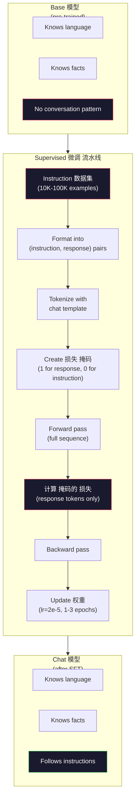

# 指令调优 (SFT)

> 一个base 模型 predicts the next 词元. That's it. It doesn't follow instructions, 答案 问题, or refuse harmful requests. SFT is the bridge between a 词元 predictor and a useful 助手. Every 模型 you've ever talked to -- Claude, GPT, Llama Chat -- went through this 步骤.

**类型：** Build
**语言：** Python (with numpy)
**先修：** Phase 10, Lesson 04 (预训练 a Mini GPT)
**时间：** 约 90 分钟

## 学习目标

- Implement supervised 微调 (SFT) that converts a base 语言模型 into an instruction-following 助手
- Format 训练 数据 using chat templates with 系统, 用户, and 助手 roles, and 掩码 损失 on non-assistant 词元
- 解释why SFT is necessary: base 模型 continue 文本 rather than 答案 问题
- Evaluate SFT 质量 by comparing base 模型 vs fine-tuned 模型 响应 on a held-out instruction set

## 问题

你训练后的 a 模型 in Lesson 04. It can 预测 the next 词元 given a 序列. Feed it "The transformer 架构" and it might continue with "has revolutionized natural language processing." That's impressive for a next-token predictor.

Now try this: feed it "What is the capital of France?" A base 模型 doesn't 答案 "Paris." It continues the pattern. It might produce "What is the capital of Germany? What is the capital of Spain?" because it learned from 文档 that contain lists of 问题. Or it might produce "is a 问题 that many people ask" because that's a plausible next-token continuation. The 模型 has no concept of *回答*. It only knows *continuing*.

这is the gap between GPT-3 (base 模型, released June 2020) and ChatGPT (instruction-tuned, released November 2022). Same 架构. Same 预训练. The difference is 20,000 to 100,000 carefully crafted (instruction, 响应) pairs that taught the 模型 to follow the conversation pattern.

Stanford Alpaca proved you don't need millions of examples. In March 2023, they fine-tuned Llama 7B on just 52,000 instruction-response pairs 生成的 by GPT-3.5. Total 成本: $600. The result was a chatbot that could follow instructions, 答案 问题, and hold conversations. Not as good as ChatGPT, but shockingly close for $600 and a few 小时 of 训练.

Meta's Llama 2 Chat used only ~27,000 high-quality examples for its initial SFT stage. The key insight: 质量 matters more than quantity. 27,000 examples written by skilled annotators beat 1 million noisy examples scraped from the internet.

## 概念

### What SFT Actually Does

Supervised 微调 continues the same 训练 循环 from 预训练 -- forward pass, 计算 损失, backward pass, update 权重 -- but on a different kind of 数据. Instead of raw 文本, you 训练 on 结构化 conversations:

```json
{
  "system": "You are a helpful assistant.",
  "user": "What is the capital of France?",
  "assistant": "The capital of France is Paris."
}
```

这个模型 already knows that Paris is the capital of France. It learned this during 预训练 on Wikipedia, textbooks, and web pages. SFT doesn't teach the 模型 new facts. It teaches the 模型 a new *behavior*: when you see a 问题, produce an 答案. When you see an instruction, produce a completion. When you see a harmful request, produce a refusal.

Think of it this way. Pre-training gives the 模型 knowledge. SFT gives the 模型 manners.

### 数据 Formats

Three formats dominate the industry. Each encodes the same information -- who said what -- with different delimiters.

**Alpaca Format** (Stanford, March 2023):

```json
{
  "instruction": "Summarize the following article in 3 sentences.",
  "input": "The European Central Bank raised interest rates...",
  "output": "The ECB increased rates by 25 basis points..."
}
```

Simple and widely used. The `input` field is optional -- many instructions don't need additional 上下文. Stanford released 52,000 examples in this format, 生成的 by GPT-3.5 for $600. This kicked off the open-source 指令调优 movement.

**ShareGPT Format** (community, 2023):

```json
{
  "conversations": [
    {"from": "system", "value": "You are a helpful assistant."},
    {"from": "human", "value": "What causes tides?"},
    {"from": "gpt", "value": "Tides are caused by the gravitational pull of the Moon..."},
    {"from": "human", "value": "How often do they occur?"},
    {"from": "gpt", "value": "Most coastal areas experience two high tides and two low tides per day..."}
  ]
}
```

Supports multi-turn conversations. The "from" field uses "human" and "gpt" by convention, regardless of the actual 模型. Vicuna was 训练后的 on 70,000 ShareGPT conversations scraped from user-shared ChatGPT transcripts.

**ChatML Format** (OpenAI, used by many open-source 模型):

```text
<|im_start|>system
You are a helpful assistant.<|im_end|>
<|im_start|>user
What is the capital of France?<|im_end|>
<|im_start|>assistant
The capital of France is Paris.<|im_end|>
```

Uses special 词元 (`<|im_start|>`, `<|im_end|>`) to delimit roles. These 词元 are added to the 分词器's 词表 during 微调. Qwen, Yi, and many other 模型 use ChatML.

All three formats accomplish the same thing: they tell the 模型 "this is the instruction, this is the 响应, learn this pattern."

### Why It Works

这个模型 already knows language from 预训练. It has seen billions of examples of 问题 followed by answers, instructions followed by completions, and conversations between people. The patterns are already encoded in the 权重.

SFT concentrates this 潜变量 ability. Instead of the 模型 needing to figure out from 上下文 whether it should 答案 a 问题 or continue a 文档, SFT explicitly trains on the conversation pattern. After a few thousand examples, the 模型 learns: when you see the 助手 role marker, produce a helpful 响应.

这is why 27,000 examples is enough. You're not teaching the 模型 English. You're not teaching it facts about the world. You're teaching it one simple behavior: respond to instructions. The knowledge was already there.

### The 掩码的 损失

这is the most important technical detail in SFT, and most tutorials skip it.

During 预训练, you 计算 损失 on every 词元. The 模型 learns to 预测 every next 词元 in the 序列. During SFT, you only 计算 损失 on the *响应* 词元. The instruction 词元 are there for 上下文, but the 模型 is not penalized for "predicting" them incorrectly.

Why? Because you don't want the 模型 to learn to *生成* instructions. You want it to learn to *respond to* instructions. If you 计算 损失 on the instruction 词元, you're 训练 the 模型 to 预测 "What is the capital of France?" as if it's the one asking the 问题. That wastes 梯度 信号 and can confuse the 模型 about its role.

In practice, you create a 损失 掩码: 1 for 响应 词元, 0 for instruction 词元. Multiply the per-token 损失 by this 掩码 before averaging.

```text
Tokens:    [SYS] You are helpful [USER] What is the capital? [ASST] Paris is the capital [EOS]
Loss mask:   0    0    0     0      0     0   0  0     0       1     1    1   1     1      1
```

Only the 词元 after `[ASST]` contribute to the 损失. The 模型 sees the full conversation during the forward pass (it needs the instruction to produce the right 响应) but only updates its 权重 based on how well it predicted the 响应.

### 训练 Hyperparameters

SFT uses dramatically different hyperparameters than 预训练. You're not 训练 from scratch. You're adjusting a 模型 that already works.

|参数|预训练 (Llama 2 7B)|SFT (Llama 2 Chat)|
|-----------|---------------------------|---------------------|
|学习 速率|3e-4 (peak)|2e-5|
|Epochs|1 (single pass over 数据)|2|
|批次 size|4M 词元|64 examples|
|预热 步骤|2,000|0-100|
|权重 衰减|0.1|0.0-0.1|
|数据 size|2T 词元|27,000 examples|

这个学习 速率 is 15x lower for SFT. This is critical. A high 学习 速率 during 微调 destroys the pre-trained knowledge. The 模型 "forgets" what it learned and overfits to the small 微调 数据集. This is catastrophic forgetting.

Two epochs means the 模型 sees each 训练 example twice. More than 3 epochs on a small 数据集 leads to memorization -- the 模型 starts reproducing 训练 examples verbatim instead of generalizing.

### Catastrophic Forgetting

Fine-tuning can destroy general capabilities. 训练 too long on instruction-following 数据 and the 模型 loses its ability to write code, do math, or produce creative 文本. It becomes very good at the specific format of its 训练 数据 and terrible at everything else.

Three mitigations:

1. **Low 学习 速率.** 1e-5 to 5e-5. Smaller updates mean less destruction of pre-trained 特征s.

2. **Short 训练.** 1-3 epochs. Stop before the 模型 overfits.

3. **Mix in 预训练 数据.** Llama 2 Chat mixed a small percentage (2-5%) of raw 预训练 数据 into the SFT 数据集. This "reminds" the 模型 of its general capabilities while 学习 the new instruction-following behavior.

### 真实 Numbers

Fine-tuning a 7B 模型 on 10,000 high-quality instruction pairs takes approximately 1 hour on a single NVIDIA A100 80GB GPU. Here's the math:

- 10,000 examples x 512 词元 average = 5.12M 词元
- 2 epochs = 10.24M 词元 total
- A100 throughput for 7B 模型 微调: ~3,000 词元/second
- 10.24M / 3,000 = ~3,400 seconds = ~57 分钟

For our mini GPT (4 层, 128 dims), 训练 is nearly instant. The point is understanding the mechanics, not the 规模.



## 动手构建

### 步骤 1: Instruction 数据集

Create a synthetic instruction 数据集. In 生产, companies like 规模 AI and Anthropic employ human annotators to write these. We'll create them programmatically to demonstrate the format.

```python
import numpy as np

INSTRUCTION_DATA = [
    {
        "instruction": "What is the capital of France?",
        "response": "The capital of France is Paris."
    },
    {
        "instruction": "Explain gravity in one sentence.",
        "response": "Gravity is the force that attracts objects with mass toward each other."
    },
    {
        "instruction": "Write a haiku about the ocean.",
        "response": "Waves crash on the shore, salt and foam beneath the sun, endless blue expanse."
    },
    {
        "instruction": "What is 15 multiplied by 7?",
        "response": "15 multiplied by 7 is 105."
    },
    {
        "instruction": "Name three programming languages.",
        "response": "Three programming languages are Python, Rust, and TypeScript."
    },
    {
        "instruction": "Summarize photosynthesis.",
        "response": "Photosynthesis converts sunlight, water, and carbon dioxide into glucose and oxygen."
    },
    {
        "instruction": "What year did World War II end?",
        "response": "World War II ended in 1945."
    },
    {
        "instruction": "Define machine learning.",
        "response": "Machine learning is a field where algorithms learn patterns from data to make predictions."
    },
]
```

Eight examples is tiny. Stanford Alpaca used 52,000. But the mechanics are identical whether you have 8 or 52,000: tokenize, 掩码, 计算 损失 on 响应 only.

### 步骤 2: Tokenize with Chat Template

Convert instruction-response pairs into 词元 sequences with special role markers. The markers tell the 模型 where the instruction ends and where the 响应 begins.

```python
SPECIAL_TOKENS = {
    "INST_START": 253,
    "INST_END": 254,
    "RESP_START": 255,
}


def tokenize_instruction_pair(instruction, response, vocab_size=256):
    inst_tokens = list(instruction.encode("utf-8"))
    resp_tokens = list(response.encode("utf-8"))

    inst_tokens = [min(t, vocab_size - 4) for t in inst_tokens]
    resp_tokens = [min(t, vocab_size - 4) for t in resp_tokens]

    tokens = (
        [SPECIAL_TOKENS["INST_START"]]
        + inst_tokens
        + [SPECIAL_TOKENS["INST_END"]]
        + [SPECIAL_TOKENS["RESP_START"]]
        + resp_tokens
    )

    return tokens


def create_loss_mask(tokens):
    mask = np.zeros(len(tokens), dtype=np.float32)
    in_response = False

    for i, token in enumerate(tokens):
        if token == SPECIAL_TOKENS["RESP_START"]:
            in_response = True
            continue
        if in_response:
            mask[i] = 1.0

    return mask
```

这个损失 掩码 is all zeros for instruction 词元 and all ones for 响应 词元. The `RESP_START` 词元 itself gets a 掩码 of 0 because it's a delimiter, not part of the 响应 content.

### 步骤 3: 掩码的 Cross-Entropy 损失

Standard cross-entropy, but multiplied by the 损失 掩码. Only 响应 词元 contribute to the 梯度.

```python
def masked_cross_entropy_loss(logits, targets, loss_mask):
    batch, seq_len, vocab_size = logits.shape
    logits_flat = logits.reshape(-1, vocab_size)
    targets_flat = targets.reshape(-1)
    mask_flat = loss_mask.reshape(-1)

    max_logits = logits_flat.max(axis=-1, keepdims=True)
    log_softmax = logits_flat - max_logits - np.log(
        np.exp(logits_flat - max_logits).sum(axis=-1, keepdims=True)
    )

    per_token_loss = -log_softmax[np.arange(len(targets_flat)), targets_flat]

    masked_loss = per_token_loss * mask_flat
    num_response_tokens = mask_flat.sum()
    if num_response_tokens == 0:
        return 0.0
    loss = masked_loss.sum() / num_response_tokens

    return loss
```

这个denominator is `num_response_tokens`, not `seq_len`. If you divide by the total 序列 length, longer instructions dilute the 梯度 信号. Dividing by 响应 词元 count ensures equal 权重 per 响应 词元 regardless of instruction length.

### 步骤 4: SFT 训练 循环

Reuse the MiniGPT from Lesson 04. The 训练 循环 looks almost identical to 预训练, but with instruction formatting and 掩码的 损失.

```python
import sys
import os
sys.path.insert(0, os.path.join(os.path.dirname(__file__), "..", "..", "04-pre-training-mini-gpt", "code"))
from main import MiniGPT, LayerNorm, FeedForward, MultiHeadAttention, TransformerBlock, Embedding


def sft_train(model, dataset, num_epochs=2, lr=2e-5, seq_len=64):
    formatted_data = []
    for example in dataset:
        tokens = tokenize_instruction_pair(example["instruction"], example["response"])
        mask = create_loss_mask(tokens)
        formatted_data.append((tokens, mask))

    print(f"SFT Training: {len(formatted_data)} examples, {num_epochs} epochs, lr={lr}")
    print(f"Total tokens: {sum(len(t) for t, _ in formatted_data):,}")
    print()

    losses = []

    for epoch in range(num_epochs):
        epoch_loss = 0.0
        num_batches = 0

        indices = np.random.permutation(len(formatted_data))

        for idx in indices:
            tokens, mask = formatted_data[idx]

            if len(tokens) < 3:
                continue
            if len(tokens) > seq_len:
                tokens = tokens[:seq_len]
                mask = mask[:seq_len]

            input_ids = np.array(tokens[:-1]).reshape(1, -1)
            target_ids = np.array(tokens[1:]).reshape(1, -1)
            loss_mask = np.array(mask[1:]).reshape(1, -1)

            logits = model.forward(input_ids)
            loss = masked_cross_entropy_loss(logits, target_ids, loss_mask)

            batch_size, s_len, v_size = logits.shape
            probs = np.exp(logits - logits.max(axis=-1, keepdims=True))
            probs = probs / probs.sum(axis=-1, keepdims=True)
            dlogits = probs.copy()
            dlogits[np.arange(batch_size)[:, None], np.arange(s_len), target_ids] -= 1.0

            mask_expanded = loss_mask[:, :, np.newaxis]
            num_resp = loss_mask.sum()
            if num_resp > 0:
                dlogits = dlogits * mask_expanded / num_resp

            for block in model.blocks:
                block.ffn.W1 -= lr * np.random.randn(*block.ffn.W1.shape) * 0.01
                block.ffn.W2 -= lr * np.random.randn(*block.ffn.W2.shape) * 0.01
                block.ffn.b1 -= lr * np.random.randn(*block.ffn.b1.shape) * 0.01
                block.ffn.b2 -= lr * np.random.randn(*block.ffn.b2.shape) * 0.01

            epoch_loss += loss
            num_batches += 1
            losses.append(loss)

        avg_loss = epoch_loss / max(num_batches, 1)
        print(f"Epoch {epoch + 1}/{num_epochs} | Avg Loss: {avg_loss:.4f}")

    return model, losses
```

这个学习 速率 is 2e-5, 匹配 Llama 2 Chat. Compare this to the 3e-4 used in 预训练 -- 15x smaller. The 梯度 is 掩码的: instruction 词元 produce zero 梯度. Only 响应 词元 push the 权重.

### 步骤 5: Compare Base vs SFT 模型

这个whole point of SFT is behavioral change. Let's measure it by checking how the 模型 responds to instruction-formatted inputs versus raw 文本 continuations.

```python
def generate_response(model, prompt_tokens, max_new_tokens=50, temperature=0.8):
    tokens = list(prompt_tokens)
    seq_len = model.embedding.pos_embed.shape[0]

    for _ in range(max_new_tokens):
        context = np.array(tokens[-seq_len:]).reshape(1, -1)
        logits = model.forward(context)
        next_logits = logits[0, -1, :]

        next_logits = next_logits / max(temperature, 1e-8)
        probs = np.exp(next_logits - next_logits.max())
        probs = probs / probs.sum()
        probs = np.clip(probs, 1e-10, 1.0)
        probs = probs / probs.sum()

        next_token = np.random.choice(len(probs), p=probs)
        tokens.append(int(next_token))

    return tokens


def evaluate_instruction_following(model, instructions):
    print("Evaluating instruction following:")
    print("-" * 50)

    for instruction in instructions:
        tokens = (
            [SPECIAL_TOKENS["INST_START"]]
            + [min(t, 252) for t in list(instruction.encode("utf-8"))]
            + [SPECIAL_TOKENS["INST_END"]]
            + [SPECIAL_TOKENS["RESP_START"]]
        )

        output = generate_response(model, tokens, max_new_tokens=30, temperature=0.6)
        response_start = len(tokens)
        response_tokens = output[response_start:]
        response_bytes = bytes([t for t in response_tokens if t < 128])
        response_text = response_bytes.decode("utf-8", errors="replace")

        print(f"  Q: {instruction}")
        print(f"  A: {response_text[:80]}")
        print()
```

On a tiny 模型 with 8 examples, the 响应 won't be meaningful. That's expected. The important thing is the *structure*: the 模型 learns to produce 输出 after the 响应 marker instead of continuing to 生成 more instructions.

### 步骤 6: Measure Catastrophic Forgetting

比较the 模型's next-token 预测 ability before and after SFT. If SFT damages general capabilities, the 损失 on raw 文本 will increase.

```python
def measure_forgetting(model, test_text, seq_len=64):
    tokens = np.array(list(test_text.encode("utf-8")[:512]))

    total_loss = 0.0
    num_windows = 0

    for start in range(0, len(tokens) - seq_len - 1, seq_len):
        input_ids = tokens[start:start + seq_len].reshape(1, -1)
        target_ids = tokens[start + 1:start + seq_len + 1].reshape(1, -1)

        logits = model.forward(input_ids)

        batch, s_len, vocab_size = logits.shape
        logits_flat = logits.reshape(-1, vocab_size)
        targets_flat = target_ids.reshape(-1)

        max_logits = logits_flat.max(axis=-1, keepdims=True)
        log_softmax = logits_flat - max_logits - np.log(
            np.exp(logits_flat - max_logits).sum(axis=-1, keepdims=True)
        )

        loss = -log_softmax[np.arange(len(targets_flat)), targets_flat].mean()
        total_loss += loss
        num_windows += 1

    return total_loss / max(num_windows, 1)
```

In 真实 微调, you would track this 指标 throughout 训练. If the raw 文本 损失 increases by more than 10-15%, your SFT is too aggressive. Lower the 学习 速率 or reduce the number of epochs.

## 实际使用

### Full SFT 流水线 Demo

```python
if __name__ == "__main__":
    np.random.seed(42)

    test_text = """The transformer architecture processes sequences through self-attention.
Each layer applies multi-head attention followed by a feedforward network.
Residual connections and layer normalization stabilize deep networks.
The model learns to predict the next token given all previous tokens."""

    print("=" * 70)
    print("INSTRUCTION TUNING (SFT) DEMO")
    print("=" * 70)
    print()

    model = MiniGPT(
        vocab_size=256, embed_dim=128, num_heads=4,
        num_layers=4, max_seq_len=128, ff_dim=512
    )
    print(f"Model: {model.count_parameters():,} parameters")
    print(f"Config: 4 layers, 4 heads, 128 dims (mini GPT from Lesson 04)")
    print()

    print("PRE-SFT: Measuring base model loss on raw text")
    base_loss = measure_forgetting(model, test_text)
    print(f"  Base model loss: {base_loss:.4f}")
    print()

    print("=" * 70)
    print("SFT TRAINING")
    print("=" * 70)

    model, losses = sft_train(
        model, INSTRUCTION_DATA, num_epochs=3, lr=2e-5, seq_len=128
    )

    print()
    print("POST-SFT: Measuring fine-tuned model loss on raw text")
    sft_loss = measure_forgetting(model, test_text)
    print(f"  SFT model loss: {sft_loss:.4f}")
    print(f"  Change: {((sft_loss - base_loss) / base_loss * 100):+.1f}%")
    if abs(sft_loss - base_loss) / base_loss < 0.15:
        print("  Minimal forgetting (< 15% change)")
    else:
        print("  Significant forgetting detected")
    print()

    print("=" * 70)
    print("INSTRUCTION FOLLOWING EVALUATION")
    print("=" * 70)
    print()

    test_instructions = [
        "What is the capital of France?",
        "Name a programming language.",
        "Define gravity.",
    ]
    evaluate_instruction_following(model, test_instructions)

    print("=" * 70)
    print("DATA FORMAT EXAMPLES")
    print("=" * 70)
    print()

    for i, example in enumerate(INSTRUCTION_DATA[:3]):
        tokens = tokenize_instruction_pair(example["instruction"], example["response"])
        mask = create_loss_mask(tokens)
        resp_count = int(mask.sum())
        total_count = len(tokens)
        print(f"  Example {i + 1}: {total_count} tokens, {resp_count} response tokens ({resp_count/total_count:.0%} of sequence)")
        print(f"    Instruction: {example['instruction']}")
        print(f"    Response: {example['response']}")
        print()

    print("=" * 70)
    print("TRAINING LOSS CURVE")
    print("=" * 70)
    print()

    if losses:
        window = max(1, len(losses) // 5)
        for i in range(0, len(losses), window):
            chunk = losses[i:i + window]
            avg = sum(chunk) / len(chunk)
            print(f"  Steps {i:3d}-{i + len(chunk) - 1:3d}: avg loss = {avg:.4f}")
```

## 交付成果

这lesson produces `outputs/prompt-sft-data-curator.md` -- a 提示词 that helps you design and curate instruction datasets for SFT. Given a 目标 capability (code 生成, math, conversation), it produces a 数据 collection plan with format specifications, 质量 criteria, and diversity requirements.

## 练习

1. Add 系统 提示词 support. Modify `tokenize_instruction_pair` to accept a 系统 消息 and prepend it before the instruction. Create 5 examples with different 系统 prompts ("You are a poet", "You are a math tutor") and verify the 模型 sees different 系统 prompts during 训练.

2. Implement 数据 mixing. Create a 函数 that takes an SFT 数据集 and a raw 文本 语料库, then produces 训练 batches where 5% of examples are raw 文本 (no masking) and 95% are instruction pairs (掩码的). Run 3 epochs and compare forgetting 指标 against pure SFT 训练.

3. 构建a 数据 质量 scorer. For each instruction-response pair, 计算: (a) 响应 length in 词元, (b) instruction-to-response 比例, (c) 词表 diversity (unique 词元 / total 词元). Filter out examples with 响应 length < 10 词元 or diversity < 0.3. Show how filtering affects the final 损失.

4. Implement multi-turn conversation 训练. Extend the tokenization to handle 3-turn conversations (user-assistant-user-assistant-user-assistant). The 损失 掩码 should cover all three 助手 turns. Verify the 掩码 is correct by printing the token-mask 对齐 for one example.

5. 比较学习 rates. 训练 the same 模型 three times with lr=1e-4, lr=2e-5, and lr=1e-6. Plot the 损失 曲线. The 1e-4 run should show rapid initial descent but higher final 损失 (过拟合). The 1e-6 run should barely move. The 2e-5 run should be the sweet spot.

## Key Terms

|Term|What people say|What it actually means|
|------|----------------|----------------------|
|SFT|"Fine-tuning on conversations"|Supervised 微调: continuing 训练 on (instruction, 响应) pairs with 损失 computed only on 响应 词元|
|Instruction tuning|"Teaching the 模型 to follow instructions"|训练 on explicit instruction-response pairs so the base 模型 learns the conversation pattern, not new knowledge|
|损失 masking|"Ignoring the 提示词"|Setting 损失 to zero for instruction 词元 so gradients only 流 from 响应 词元 predictions|
|ChatML|"Chat Markup Language"|A 词元 format using `<\|im_start\|>` and `<\|im_end\|>` delimiters to mark speaker roles in conversation 数据|
|Alpaca format|"Stanford's format"|A JSON format with instruction/输入/输出 fields, used for 52K GPT-3.5-生成的 examples that 成本 $600|
|Catastrophic forgetting|"The 模型 gets dumber"|Fine-tuning destroys pre-trained capabilities because 梯度 updates overwrite general knowledge with task-specific patterns|
|权重 tying|"Shared 嵌入s"|Using the same matrix for 输入 词元 嵌入s and 输出 预测 头, saving 参数 and improving coherence|
|Chat template|"How you format the 提示词"|The specific 词元 序列 (role markers, delimiters) that structures a conversation for the 模型|

## 延伸阅读

- [Ouyang et al., 2022 -- "Training language models to follow instructions with human feedback" (InstructGPT)](https://arxiv.org/abs/2203.02155) -- the paper that introduced 指令调优 + RLHF at OpenAI
- [Taori et al., 2023 -- "Stanford Alpaca: An Instruction-following LLaMA Model"](https://github.com/tatsu-lab/stanford_alpaca) -- 52K instruction examples for $600, proving SFT works on small datasets
- [Touvron et al., 2023 -- "Llama 2: Open Foundation and Fine-Tuned Chat Models"](https://arxiv.org/abs/2307.09288) -- Meta's SFT + RLHF 流水线 with 27K high-quality examples
- [Chiang et al., 2023 -- "Vicuna: An Open-Source Chatbot Impressing GPT-4"](https://lmsys.org/blog/2023-03-30-vicuna/) -- 训练 on 70K ShareGPT conversations
- [Zhou et al., 2023 -- "LIMA: Less Is More for Alignment"](https://arxiv.org/abs/2305.11206) -- proving that 1,000 carefully curated examples can match SFT on much larger datasets
