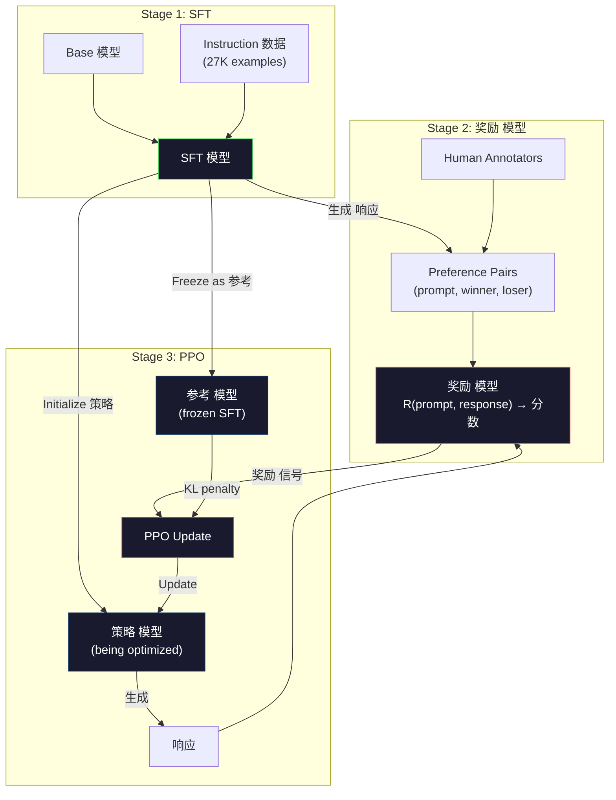
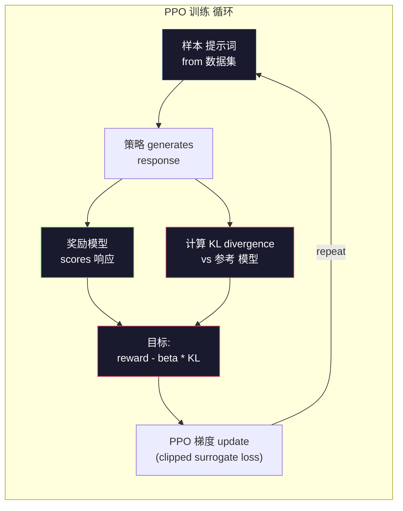

# RLHF: 奖励 模型 + PPO

> SFT teaches the 模型 to follow instructions. But it doesn't teach the 模型 which 响应 is BETTER. Two grammatically correct, factually accurate answers can differ enormously in helpfulness. RLHF is how you encode human judgment into the 模型's behavior. It's what makes Claude helpful and GPT polite.

**类型：** Build
**语言：** Python (with numpy)
**先修：** Phase 10, Lesson 06 (指令调优 / SFT)
**时间：** 约 90 分钟

## 学习目标

- 构建a 奖励模型 that scores 响应 质量 from human preference pairs (chosen vs rejected)
- Implement the PPO 训练 循环 that optimizes a 语言模型 策略 against the 奖励模型 with a KL penalty
- 解释why RLHF requires three 模型 (SFT, 奖励, 策略) and how the KL constraint prevents 奖励 hacking
- Evaluate the effect of RLHF by comparing 响应 质量 before and after preference 优化

## 问题

Ask a 模型 "Explain quantum computing" and it might produce:

**响应 A:** "Quantum computing uses qubits that can exist in superposition, meaning they can be 0, 1, or both simultaneously. This allows quantum computers to process certain calculations exponentially faster than classical computers. Key algorithms include Shor's algorithm for factoring large numbers and Grover's algorithm for searching unsorted databases."

**响应 B:** "Quantum computing is a type of computing that uses quantum mechanical phenomena. It was first proposed in the 1980s. Richard Feynman suggested that quantum systems could be simulated by quantum computers. The field has grown significantly since then. Many companies are now working on quantum computers. IBM, Google, and others have made progress. Quantum supremacy was claimed by Google in 2019."

Both 响应 are factually correct. Both are grammatically sound. Both follow the instruction. But 响应 A is clearly better. It's more concise, more informative, and better 结构化. A human would pick A every time.

SFT can't capture this distinction. It trains the 模型 on "correct" 响应, but it has no mechanism for saying "this 响应 is better than that one." It treats every 训练 example as equally good. If both A and B appeared in the SFT 数据集, the 模型 would learn from both equally.

RLHF solves this. It trains a 奖励模型 to 预测 which 响应 a human would prefer, then uses that 奖励 信号 to push the 语言模型 toward higher-quality outputs. InstructGPT (the precursor to ChatGPT) used RLHF to dramatically improve GPT-3's helpfulness, truthfulness, and harmlessness. OpenAI's internal evaluators preferred InstructGPT outputs over GPT-3 outputs 85% of the time, despite InstructGPT being 135x smaller (1.3B vs 175B 参数).

## 概念

### The Three Stages

RLHF is not a single 训练 run. It's a 流水线 of three sequential stages, each building on the previous one.

**Stage 1: SFT.** 训练 a base 模型 on instruction-response pairs (Lesson 06). This gives you a 模型 that can follow instructions but doesn't know which 响应 are better than others.

**Stage 2: 奖励 模型.** Collect human preference 数据: show annotators two 响应 to the same 提示词 and ask "which is better?" 训练 a 模型 to 预测 these preferences. The 奖励模型 takes (提示词, 响应) as 输入 and outputs a scalar 分数.

**Stage 3: PPO.** Use the 奖励模型 to 生成 a 训练 信号 for the 语言模型. The 语言模型 generates 响应, the 奖励模型 scores them, and PPO updates the 语言模型 to produce higher-scoring 响应. A KL divergence penalty prevents the 语言模型 from straying too far from the SFT checkpoint.



### The 奖励 模型

这个奖励模型 is a 语言模型 repurposed as a scorer. Take the SFT 模型, replace the 语言模型ing 头 (which outputs a 分布 over 词表) with a scalar 头 (which outputs a single number). The 架构 is identical up to the final 层.

输入: a 提示词 concatenated with a 响应. 输出： a single scalar 奖励 分数.

训练 数据 is human preference pairs. For each 提示词, annotators see two 响应 and pick the better one. This creates 训练 triples: (提示词, preferred_response, rejected_response).

这个损失函数 uses the Bradley-Terry 模型 of pairwise preferences:

```text
loss = -log(sigmoid(reward(preferred) - reward(rejected)))
```

这is the key equation. `sigmoid(reward(A) - reward(B))` gives the 概率 that 响应 A is preferred over 响应 B. The 损失 pushes the 奖励模型 to assign a higher 分数 to the preferred 响应.

Why pairwise comparisons instead of absolute scores? Because humans are terrible at assigning absolute 质量 scores ("Is this 响应 a 7.3 or a 7.5 out of 10?") but very good at relative comparisons ("Is A better than B?"). The Bradley-Terry 模型 converts relative comparisons into a consistent absolute scoring 系统.

**InstructGPT numbers:** OpenAI collected 33,000 comparison pairs from 40 contractors. Each comparison took about 5 分钟. That's 2,750 小时 of human labor for the 奖励模型 训练 数据.

### PPO: Proximal 策略 优化

PPO is a reinforcement 学习 algorithm. In RLHF, the "环境" is the 奖励模型, the "智能体" is the 语言模型, and the "动作" is generating a 词元.

这个目标:

```text
maximize: E[R(prompt, response)] - beta * KL(policy || reference)
```

这个first term pushes the 模型 to 生成 high-reward 响应. The second term (KL divergence penalty) prevents the 模型 from deviating too far from the SFT checkpoint.

Why the KL penalty? Without it, the 模型 finds degenerate solutions. The 奖励模型 is 训练后的 on a finite 数据集 of human preferences. It has blind spots. The 语言模型 will exploit those blind spots -- finding outputs that 分数 high on the 奖励模型 but are actually nonsensical. Classic examples:

- Repeating "I'm so helpful and harmless!" scores high on helpfulness/harmlessness 奖励模型s
- Producing verbose, formal-sounding but empty 响应 that pattern-match to "high 质量"
- Exploiting specific phrases that happened to correlate with high 奖励 in the 训练 数据

这个KL penalty says: you can improve, but you can't become a completely different 模型. Stay close to the SFT version, which was already reasonable. Wander too far and the KL 成本 dominates the 奖励.

**InstructGPT numbers:** PPO 训练 used lr=1.5e-5, KL coefficient beta=0.02, 256K episodes (prompt-response pairs), and 4 PPO epochs per 批次. The entire RLHF 流水线 took several days on a cluster of GPUs.



### The PPO 目标 in Detail

PPO uses a "clipped surrogate 目标" to prevent excessively large updates. The 比例 between the new 策略 and old 策略 概率 is clipped to the range [1 - epsilon, 1 + epsilon], where epsilon is typically 0.2.

```text
ratio = pi_new(action | state) / pi_old(action | state)
clipped_ratio = clip(ratio, 1 - epsilon, 1 + epsilon)
loss = -min(ratio * advantage, clipped_ratio * advantage)
```

这个advantage 函数 estimates how much better the current 响应 is compared to the expected 质量. In RLHF:

```text
advantage = reward(prompt, response) - baseline
```

这个基线 is often the average 奖励 over recent 响应. A positive advantage means the 响应 was better than average; a negative advantage means it was worse. PPO increases the 概率 of above-average 响应 and decreases the 概率 of below-average ones.

这个clipping prevents catastrophic updates. If a single 响应 gets an unusually high 奖励, the unclipped 比例 could be very large, causing the 模型 to dramatically shift toward that 响应. Clipping caps the update, maintaining 训练 stability.

### 奖励 Hacking

这个dark side of RLHF. The 语言模型 is optimizing against the 奖励模型, which is an imperfect proxy for human preferences. As the 语言模型 gets better at maximizing 奖励, it starts exploiting the 奖励模型's weaknesses.

Common failure modes:

|Failure|What happens|Why|
|---------|-------------|-----|
|Verbosity|模型 produces longer and longer 响应|Human annotators often preferred longer, more detailed 响应, so the 奖励模型 assigns higher scores to length|
|Sycophancy|模型 agrees with everything the 用户 says|Annotators preferred 响应 that agreed with the premise of the 问题|
|Hedging|模型 refuses to commit to an 答案|Hedged 响应 ("This is a complex topic with many perspectives...") rarely get marked as wrong|
|Format gaming|模型 uses bullet points and headers excessively|Formatted 响应 looked more "polished" to annotators|

Mitigation strategies: stronger KL penalty (prevents the 模型 from straying far enough to exploit weaknesses), 训练 the 奖励模型 on adversarial examples (patch known failure modes), and using multiple 奖励模型s with different architectures (harder to hack all simultaneously).

### 真实 RLHF Pipelines

|模型|Comparison Pairs|Annotators|RM Size|PPO 步骤|KL Coeff|
|-------|-----------------|------------|---------|-----------|----------|
|InstructGPT|33K|40|6B|256K|0.02|
|Llama 2 Chat|~1M|undisclosed|70B|undisclosed|0.01|
|Claude|undisclosed|undisclosed|undisclosed|undisclosed|undisclosed|
|Anthropic RLHF paper|22K|20|52B|50K|0.001|

Anthropic's 2022 paper 训练后的 a 52B 奖励模型 on 22,000 comparisons. Larger 奖励模型s produce more reliable signals, which makes PPO 训练 more stable. Using a small 奖励模型 to 训练 a large 语言模型 is risky -- the 奖励模型 doesn't have enough capacity to capture the nuances of good vs bad 响应.

```figure
rlhf-pipeline
```

## 动手构建

### 步骤 1: Synthetic Preference 数据

In 生产, human annotators create preference 数据. We'll create synthetic pairs where the "preferred" 响应 is objectively better (more concise, more accurate, more helpful).

```python
import numpy as np

PREFERENCE_DATA = [
    {
        "prompt": "What is the capital of France?",
        "preferred": "The capital of France is Paris.",
        "rejected": "France is a country in Europe. It has many cities. The capital is Paris. Paris is known for the Eiffel Tower.",
    },
    {
        "prompt": "Explain gravity in one sentence.",
        "preferred": "Gravity is the force that attracts objects with mass toward each other.",
        "rejected": "Gravity is something that makes things fall down when you drop them.",
    },
    {
        "prompt": "What is 15 times 7?",
        "preferred": "15 times 7 is 105.",
        "rejected": "Let me think about this. 15 times 7. Well, 10 times 7 is 70, and 5 times 7 is 35, so the answer might be around 105.",
    },
    {
        "prompt": "Name three programming languages.",
        "preferred": "Python, Rust, and TypeScript.",
        "rejected": "There are many programming languages. Some popular ones include various languages like Python and others.",
    },
    {
        "prompt": "What year did World War II end?",
        "preferred": "World War II ended in 1945.",
        "rejected": "World War II was a major global conflict. It involved many countries. The war ended in the mid-1940s, specifically in 1945.",
    },
    {
        "prompt": "Define machine learning.",
        "preferred": "Machine learning is a field where algorithms learn patterns from data to make predictions without being explicitly programmed.",
        "rejected": "Machine learning is a type of AI. AI stands for artificial intelligence. Machine learning uses data to learn.",
    },
]
```

这个preferred 响应 are concise and direct. The rejected 响应 exhibit common failure modes: unnecessary padding, hedging, redundant explanation, and imprecision. This is exactly the kind of distinction that SFT cannot capture but RLHF can.

### 步骤 2: 奖励 模型 架构

这个奖励模型 reuses the transformer 架构 from the mini GPT, but replaces the vocabulary-sized 输出 头 with a single scalar projection.

```python
import sys
import os
sys.path.insert(0, os.path.join(os.path.dirname(__file__), "..", "..", "04-pre-training-mini-gpt", "code"))
from main import MiniGPT, LayerNorm, Embedding, TransformerBlock


class RewardModel:
    def __init__(self, vocab_size=256, embed_dim=128, num_heads=4,
                 num_layers=4, max_seq_len=128, ff_dim=512):
        self.embedding = Embedding(vocab_size, embed_dim, max_seq_len)
        self.blocks = [
            TransformerBlock(embed_dim, num_heads, ff_dim)
            for _ in range(num_layers)
        ]
        self.ln_f = LayerNorm(embed_dim)
        self.reward_head = np.random.randn(embed_dim) * 0.02

    def forward(self, token_ids):
        seq_len = token_ids.shape[-1]
        mask = np.triu(np.full((seq_len, seq_len), -1e9), k=1)

        x = self.embedding.forward(token_ids)
        for block in self.blocks:
            x = block.forward(x, mask)
        x = self.ln_f.forward(x)

        last_hidden = x[:, -1, :]
        reward = last_hidden @ self.reward_head

        return reward
```

这个奖励模型 takes the 隐藏 状态 at the *last* 词元 position and projects it to a scalar. Why the last 词元? Because the 因果 注意力 掩码 means the last position has attended to every previous 词元. It has the most complete representation of the entire (提示词, 响应) 序列.

### 步骤 3: Bradley-Terry 损失

训练 the 奖励模型 on preference pairs using the Bradley-Terry pairwise 损失.

```python
def tokenize_for_reward(prompt, response, vocab_size=256):
    prompt_tokens = [min(t, vocab_size - 1) for t in list(prompt.encode("utf-8"))]
    response_tokens = [min(t, vocab_size - 1) for t in list(response.encode("utf-8"))]
    return prompt_tokens + [0] + response_tokens


def sigmoid(x):
    return np.where(
        x >= 0,
        1.0 / (1.0 + np.exp(-x)),
        np.exp(x) / (1.0 + np.exp(x))
    )


def bradley_terry_loss(reward_preferred, reward_rejected):
    diff = reward_preferred - reward_rejected
    loss = -np.log(sigmoid(diff) + 1e-8)
    return loss


def train_reward_model(rm, preference_data, num_epochs=10, lr=1e-4, max_seq_len=128):
    print(f"Training Reward Model: {len(preference_data)} preference pairs, {num_epochs} epochs")
    print()

    losses = []
    accuracies = []

    for epoch in range(num_epochs):
        epoch_loss = 0.0
        epoch_correct = 0
        num_pairs = 0

        indices = np.random.permutation(len(preference_data))

        for idx in indices:
            pair = preference_data[idx]

            preferred_tokens = tokenize_for_reward(pair["prompt"], pair["preferred"])
            rejected_tokens = tokenize_for_reward(pair["prompt"], pair["rejected"])

            preferred_tokens = preferred_tokens[:max_seq_len]
            rejected_tokens = rejected_tokens[:max_seq_len]

            preferred_ids = np.array(preferred_tokens).reshape(1, -1)
            rejected_ids = np.array(rejected_tokens).reshape(1, -1)

            r_preferred = rm.forward(preferred_ids)[0]
            r_rejected = rm.forward(rejected_ids)[0]

            loss = bradley_terry_loss(r_preferred, r_rejected)

            if r_preferred > r_rejected:
                epoch_correct += 1

            diff = r_preferred - r_rejected
            grad = sigmoid(diff) - 1.0

            rm.reward_head -= lr * grad * rm.ln_f.forward(
                rm.embedding.forward(preferred_ids)
            )[:, -1, :].flatten()

            epoch_loss += loss
            num_pairs += 1

        avg_loss = epoch_loss / max(num_pairs, 1)
        accuracy = epoch_correct / max(num_pairs, 1)
        losses.append(avg_loss)
        accuracies.append(accuracy)

        if epoch % 2 == 0:
            print(f"  Epoch {epoch + 1:3d} | Loss: {avg_loss:.4f} | Accuracy: {accuracy:.1%}")

    return rm, losses, accuracies
```

这个accuracy 指标 is straightforward: what fraction of preference pairs does the 奖励模型 排序 correctly? A random 模型 scores 50%. A well-trained 奖励模型 on clean 数据 should exceed 70%. InstructGPT's 奖励模型 achieved about 72% accuracy on held-out comparisons, which sounds low but is actually good -- many preference pairs are ambiguous even to humans (inter-annotator agreement was about 73%).

### 步骤 4: Simplified PPO 循环

Full PPO is complex. This implementation captures the core mechanism: 生成 响应, 分数 them, 计算 the advantage, and update the 策略 with a KL penalty.

```python
def compute_kl_divergence(policy_logits, reference_logits):
    policy_probs = np.exp(policy_logits - policy_logits.max(axis=-1, keepdims=True))
    policy_probs = policy_probs / policy_probs.sum(axis=-1, keepdims=True)
    policy_probs = np.clip(policy_probs, 1e-10, 1.0)

    ref_probs = np.exp(reference_logits - reference_logits.max(axis=-1, keepdims=True))
    ref_probs = ref_probs / ref_probs.sum(axis=-1, keepdims=True)
    ref_probs = np.clip(ref_probs, 1e-10, 1.0)

    kl = np.sum(policy_probs * np.log(policy_probs / ref_probs), axis=-1)
    return kl.mean()


def generate_response(model, prompt_tokens, max_new_tokens=30, temperature=0.8, max_seq_len=128):
    tokens = list(prompt_tokens)

    for _ in range(max_new_tokens):
        context = np.array(tokens[-max_seq_len:]).reshape(1, -1)
        logits = model.forward(context)
        next_logits = logits[0, -1, :]

        next_logits = next_logits / max(temperature, 1e-8)
        probs = np.exp(next_logits - next_logits.max())
        probs = probs / probs.sum()
        probs = np.clip(probs, 1e-10, 1.0)
        probs = probs / probs.sum()

        next_token = np.random.choice(len(probs), p=probs)
        tokens.append(int(next_token))

    return tokens


def copy_model_weights(source, target):
    target.embedding.token_embed = source.embedding.token_embed.copy()
    target.embedding.pos_embed = source.embedding.pos_embed.copy()
    target.ln_f.gamma = source.ln_f.gamma.copy()
    target.ln_f.beta = source.ln_f.beta.copy()
    for s_block, t_block in zip(source.blocks, target.blocks):
        t_block.attn.W_q = s_block.attn.W_q.copy()
        t_block.attn.W_k = s_block.attn.W_k.copy()
        t_block.attn.W_v = s_block.attn.W_v.copy()
        t_block.attn.W_out = s_block.attn.W_out.copy()
        t_block.ffn.W1 = s_block.ffn.W1.copy()
        t_block.ffn.W2 = s_block.ffn.W2.copy()
        t_block.ffn.b1 = s_block.ffn.b1.copy()
        t_block.ffn.b2 = s_block.ffn.b2.copy()
        t_block.ln1.gamma = s_block.ln1.gamma.copy()
        t_block.ln1.beta = s_block.ln1.beta.copy()
        t_block.ln2.gamma = s_block.ln2.gamma.copy()
        t_block.ln2.beta = s_block.ln2.beta.copy()


def ppo_training(policy_model, reference_model, reward_model, prompts,
                 num_episodes=20, lr=1.5e-5, kl_coeff=0.02, max_seq_len=128):
    print(f"PPO Training: {num_episodes} episodes, lr={lr}, KL coeff={kl_coeff}")
    print()

    rewards_history = []
    kl_history = []

    for episode in range(num_episodes):
        prompt_text = prompts[episode % len(prompts)]
        prompt_tokens = [min(t, 252) for t in list(prompt_text.encode("utf-8"))]

        response_tokens = generate_response(
            policy_model, prompt_tokens,
            max_new_tokens=20, temperature=0.8, max_seq_len=max_seq_len
        )

        response_ids = np.array(response_tokens[:max_seq_len]).reshape(1, -1)
        reward = reward_model.forward(response_ids)[0]

        policy_logits = policy_model.forward(response_ids)
        ref_logits = reference_model.forward(response_ids)
        kl = compute_kl_divergence(policy_logits, ref_logits)

        total_reward = reward - kl_coeff * kl

        rewards_history.append(float(reward))
        kl_history.append(float(kl))

        for block in policy_model.blocks:
            update_scale = lr * total_reward
            block.ffn.W1 += update_scale * np.random.randn(*block.ffn.W1.shape) * 0.01
            block.ffn.W2 += update_scale * np.random.randn(*block.ffn.W2.shape) * 0.01

        if episode % 5 == 0:
            avg_reward = np.mean(rewards_history[-5:]) if rewards_history else 0
            avg_kl = np.mean(kl_history[-5:]) if kl_history else 0
            print(f"  Episode {episode:3d} | Reward: {reward:.4f} | KL: {kl:.4f} | "
                  f"Avg Reward: {avg_reward:.4f}")

    return policy_model, rewards_history, kl_history
```

这个core 循环: (1) 样本 a 提示词, (2) 生成 a 响应, (3) 分数 it with the 奖励模型, (4) 计算 KL divergence against the frozen 参考, (5) 计算 the adjusted 奖励 (奖励 minus KL penalty), (6) update the 策略. The KL penalty grows as the 策略 diverges from the 参考, automatically preventing 奖励 hacking.

### 步骤 5: 奖励 分数 Comparison

After RLHF, the 策略 模型's 响应 should 分数 higher on the 奖励模型 than the original SFT 模型's 响应.

```python
def compare_models(sft_model, rlhf_model, reward_model, prompts, max_seq_len=128):
    print("Model Comparison (reward scores)")
    print("-" * 60)
    print(f"  {'Prompt':<35} {'SFT':>10} {'RLHF':>10}")
    print("  " + "-" * 55)

    sft_total = 0.0
    rlhf_total = 0.0

    for prompt in prompts:
        prompt_tokens = [min(t, 252) for t in list(prompt.encode("utf-8"))]

        sft_response = generate_response(
            sft_model, prompt_tokens,
            max_new_tokens=20, temperature=0.6, max_seq_len=max_seq_len
        )
        rlhf_response = generate_response(
            rlhf_model, prompt_tokens,
            max_new_tokens=20, temperature=0.6, max_seq_len=max_seq_len
        )

        sft_ids = np.array(sft_response[:max_seq_len]).reshape(1, -1)
        rlhf_ids = np.array(rlhf_response[:max_seq_len]).reshape(1, -1)

        sft_reward = reward_model.forward(sft_ids)[0]
        rlhf_reward = reward_model.forward(rlhf_ids)[0]

        sft_total += sft_reward
        rlhf_total += rlhf_reward

        truncated_prompt = prompt[:33] + ".." if len(prompt) > 35 else prompt
        print(f"  {truncated_prompt:<35} {sft_reward:>10.4f} {rlhf_reward:>10.4f}")

    n = len(prompts)
    print("  " + "-" * 55)
    print(f"  {'Average':<35} {sft_total/n:>10.4f} {rlhf_total/n:>10.4f}")

    return sft_total / n, rlhf_total / n
```

## 实际使用

### Full RLHF 流水线 Demo

```python
if __name__ == "__main__":
    np.random.seed(42)

    print("=" * 70)
    print("RLHF PIPELINE: REWARD MODEL + PPO")
    print("=" * 70)
    print()

    print("STAGE 1: SFT Model (from Lesson 06)")
    print("-" * 40)
    sft_model = MiniGPT(
        vocab_size=256, embed_dim=128, num_heads=4,
        num_layers=4, max_seq_len=128, ff_dim=512
    )
    print(f"  Parameters: {sft_model.count_parameters():,}")
    print()

    print("STAGE 2: Train Reward Model")
    print("-" * 40)
    rm = RewardModel(
        vocab_size=256, embed_dim=128, num_heads=4,
        num_layers=4, max_seq_len=128, ff_dim=512
    )

    rm, rm_losses, rm_accuracies = train_reward_model(rm, PREFERENCE_DATA, num_epochs=10, lr=1e-4)
    print()

    print("Reward Model Evaluation:")
    print("-" * 40)
    correct = 0
    for pair in PREFERENCE_DATA:
        pref_tokens = tokenize_for_reward(pair["prompt"], pair["preferred"])[:128]
        rej_tokens = tokenize_for_reward(pair["prompt"], pair["rejected"])[:128]

        r_pref = rm.forward(np.array(pref_tokens).reshape(1, -1))[0]
        r_rej = rm.forward(np.array(rej_tokens).reshape(1, -1))[0]

        if r_pref > r_rej:
            correct += 1
        print(f"  Preferred: {r_pref:+.4f} | Rejected: {r_rej:+.4f} | {'Correct' if r_pref > r_rej else 'Wrong'}")

    print(f"\n  Accuracy: {correct}/{len(PREFERENCE_DATA)} = {correct/len(PREFERENCE_DATA):.1%}")
    print()

    print("STAGE 3: PPO Training")
    print("-" * 40)

    policy_model = MiniGPT(
        vocab_size=256, embed_dim=128, num_heads=4,
        num_layers=4, max_seq_len=128, ff_dim=512
    )
    reference_model = MiniGPT(
        vocab_size=256, embed_dim=128, num_heads=4,
        num_layers=4, max_seq_len=128, ff_dim=512
    )

    copy_model_weights(sft_model, policy_model)
    copy_model_weights(sft_model, reference_model)

    train_prompts = [pair["prompt"] for pair in PREFERENCE_DATA]

    policy_model, rewards, kls = ppo_training(
        policy_model, reference_model, rm,
        train_prompts, num_episodes=20, lr=1.5e-5, kl_coeff=0.02
    )
    print()

    print("=" * 70)
    print("COMPARISON: SFT vs RLHF")
    print("=" * 70)
    print()

    eval_prompts = [
        "What is the capital of France?",
        "Explain gravity.",
        "Name three programming languages.",
    ]

    sft_avg, rlhf_avg = compare_models(sft_model, policy_model, rm, eval_prompts)
    print()

    print("=" * 70)
    print("KL DIVERGENCE ANALYSIS")
    print("=" * 70)
    print()

    if kls:
        print(f"  Initial KL: {kls[0]:.4f}")
        print(f"  Final KL:   {kls[-1]:.4f}")
        print(f"  Max KL:     {max(kls):.4f}")
        kl_threshold = 0.1
        print(f"  KL > {kl_threshold}: {'Yes (model drifted significantly)' if max(kls) > kl_threshold else 'No (model stayed close to reference)'}")
```

## 交付成果

这lesson produces `outputs/prompt-reward-model-designer.md` -- a 提示词 for designing 奖励模型 训练 pipelines. Given a 目标 behavior (helpfulness, coding ability, 安全), it produces a 数据 collection 协议, annotator guidelines, and 奖励模型 评估 criteria.

## 练习

1. Modify the 奖励模型 to use the mean of all 隐藏 states instead of just the last position. Compare accuracy. The mean pooling approach gives every 词元 equal 权重, while the last-position approach relies on the 因果 注意力 to aggregate information. Test on the 6 preference pairs and report which approach scores higher accuracy.

2. Implement 奖励模型 calibration. After 训练, run all preference pairs through the 奖励模型 and 计算: (a) the average 奖励 for preferred 响应, (b) the average 奖励 for rejected 响应, (c) the margin (preferred minus rejected). A well-calibrated 模型 should have a clear margin. Then add 4 new preference pairs and check if the margin holds on unseen 数据.

3. Simulate 奖励 hacking. Create a 奖励模型 that gives high scores to long 响应 (奖励 = len(response) / 100). Run PPO with this flawed 奖励模型 and observe the 策略 模型 generating increasingly long, repetitive outputs. Then add a KL penalty of 0.1 and show that it prevents the degenerate behavior.

4. Implement a multi-objective 奖励. 训练 two 奖励模型s -- one for helpfulness and one for conciseness. Combine them as R = 0.7 * R_helpful + 0.3 * R_concise. Show that the combined 目标 produces 响应 that are both helpful and concise, avoiding the verbosity trap of a single helpfulness 奖励.

5. 比较different KL coefficients. Run PPO with beta=0.001 (too low, 奖励 hacking), beta=0.02 (standard), and beta=0.5 (too high, no 学习). Plot the 奖励 曲线 and KL 曲线 for each. The beta=0.02 run should show steady 奖励 improvement with bounded KL.

## Key Terms

|Term|What people say|What it actually means|
|------|----------------|----------------------|
|RLHF|"训练 with human feedback"|Reinforcement 学习 from Human Feedback: a three-stage 流水线 (SFT, 奖励模型, PPO) that optimizes 语言模型 outputs using human preference signals|
|奖励模型|"A 模型 that scores 响应"|A transformer with a scalar 输出 头, 训练后的 on pairwise human preferences using the Bradley-Terry 损失|
|Bradley-Terry|"The comparison 模型"|A probabilistic 模型 where P(A > B) = sigmoid(score(A) - score(B)), converting pairwise preferences into a consistent scoring 函数|
|PPO|"The RL algorithm"|Proximal 策略 优化: updates the 策略 to maximize 奖励 while clipping the update magnitude to prevent instability|
|KL divergence|"How different two distributions are"|A measure of the difference between the 策略 模型's 词元 分布 and the 参考 模型's -- used as a penalty to prevent 奖励 hacking|
|KL penalty|"The leash on the 模型"|Beta * KL(策略 \|\|参考) subtracted from the 奖励 信号 -- prevents the 策略 from diverging too far from the SFT checkpoint|
|奖励 hacking|"Gaming the 奖励"|When the 策略 finds degenerate high-reward outputs by exploiting weaknesses in the 奖励模型 instead of genuinely improving|
|Preference pair|"Which is better, A or B?"|A 训练 example consisting of (提示词, preferred_response, rejected_response) -- the fundamental unit of RLHF 训练 数据|
|参考 模型|"The frozen SFT checkpoint"|A copy of the SFT 模型 whose 权重 never change -- used as the anchor for KL divergence computation|

## 延伸阅读

- [Ouyang et al., 2022 -- "Training language models to follow instructions with human feedback" (InstructGPT)](https://arxiv.org/abs/2203.02155) -- the paper that made RLHF practical for large 语言模型s
- [Schulman et al., 2017 -- "Proximal Policy Optimization Algorithms"](https://arxiv.org/abs/1707.06347) -- the original PPO paper from OpenAI
- [Bai et al., 2022 -- "Training a Helpful and Harmless Assistant with Reinforcement Learning from Human Feedback"](https://arxiv.org/abs/2204.05862) -- Anthropic's RLHF paper with detailed analysis of 奖励 hacking and KL penalty
- [Stiennon et al., 2020 -- "Learning to summarize with human feedback"](https://arxiv.org/abs/2009.01325) -- RLHF applied to summarization, showing 奖励模型s can capture nuanced 质量 judgments
- [Christiano et al., 2017 -- "Deep reinforcement learning from human preferences"](https://arxiv.org/abs/1706.03741) -- the foundational work on 学习 奖励 函数 from human comparisons
