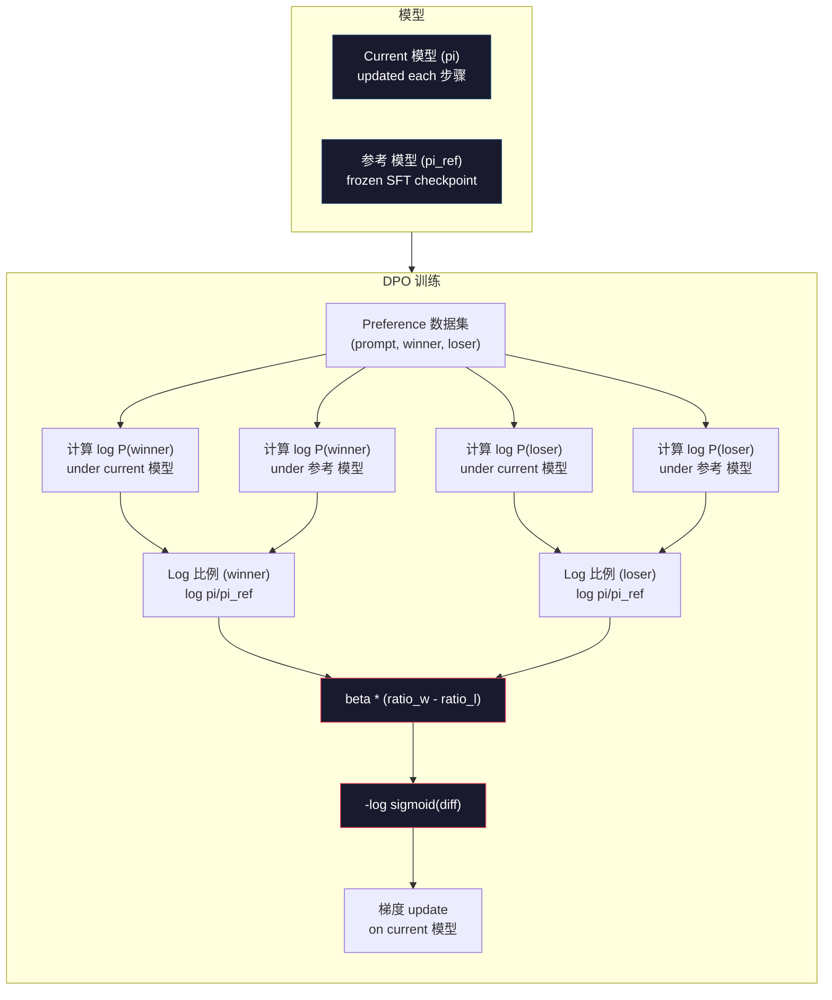

# DPO: 直接偏好优化

> RLHF works. It also requires 训练 three 模型 (SFT, 奖励模型, 策略), managing PPO's instability, and tuning a KL penalty. DPO asks: what if you could skip all of that? DPO directly optimizes the 语言模型 on preference pairs. No 奖励模型. No PPO. One 训练 循环. Same results.

**类型：** Build
**语言：** Python (with numpy)
**先修：** Phase 10, Lesson 07 (RLHF)
**时间：** 约 90 分钟

## 学习目标

- Implement DPO 训练 that directly optimizes a 语言模型 on preference pairs without a separate 奖励模型
- Derive the DPO 损失函数 and explain how it implicitly represents a 奖励模型 through the 策略's log 概率
- 比较DPO vs RLHF in terms of 训练 stability, 计算 成本, and number of 模型 required
- Tune the beta 参数 to control how far the 训练后的 策略 diverges from the 参考 模型

## 问题

你built an RLHF 流水线 in Lesson 07. Three stages. Three 模型. The SFT 模型, the 奖励模型, and the 策略 模型 optimized with PPO. The 奖励模型 alone required thousands of human preference pairs and a separate 训练 循环. PPO required careful tuning of the KL coefficient, 学习 速率, clip 比例, and number of epochs.

In practice, PPO 训练 is notoriously unstable. Small hyperparameter changes cause the 训练 to diverge. The 奖励模型 is an imperfect proxy for human preferences, and the 策略 finds ways to exploit its weaknesses. The KL penalty helps but requires its own tuning -- too low and you get 奖励 hacking, too high and the 模型 barely learns.

这complexity is why most open-source 模型 struggled with RLHF for years after InstructGPT was published. The three-stage 流水线 is fragile. Each stage has its own failure modes, and 错误 compound.

In May 2023, Rafael Rafailov, Archit Sharma, and colleagues at Stanford published "直接偏好优化: Your Language 模型 is Secretly a 奖励 模型." The key insight: you don't need a separate 奖励模型. The optimal 奖励 函数 is mathematically determined by the 语言模型's own 词元 概率. You can skip the 奖励模型 entirely and 优化 the 语言模型 directly on preference pairs.

DPO reduces RLHF to a single supervised 学习 步骤. One 模型. One 损失函数. One 训练 循环. No reinforcement 学习. Zephyr-7B, one of the first 模型 to use DPO at 规模, matched or beat 模型 训练后的 with full RLHF on several benchmarks. Meta used DPO as part of Llama 3's 对齐 流水线. Anthropic has cited DPO-style methods in their 对齐 research.

## 概念

### The Key Insight

RLHF optimizes this 目标:

```text
maximize: E[R(x, y)] - beta * KL(pi || pi_ref)
```

where R is the 奖励模型, pi is the 策略, pi_ref is the 参考 模型, and beta is the KL coefficient.

这个DPO paper showed that this 目标 has a closed-form optimal solution. For any 奖励 函数 R, the optimal 策略 is:

```text
pi*(y | x) = pi_ref(y | x) * exp(R(x, y) / beta) / Z(x)
```

where Z(x) is a normalizing constant. Rearranging:

```text
R(x, y) = beta * log(pi*(y | x) / pi_ref(y | x)) + beta * log Z(x)
```

这is the breakthrough. The 奖励 is expressed entirely in terms of the 策略 模型's 概率 and the 参考 模型's 概率. You don't need to 训练 a separate 奖励模型. The 奖励 is *implicit* in the 概率 比例.

Substituting this into the Bradley-Terry preference 模型:

```text
P(y_w > y_l | x) = sigmoid(R(x, y_w) - R(x, y_l))
                  = sigmoid(beta * (log pi(y_w|x)/pi_ref(y_w|x) - log pi(y_l|x)/pi_ref(y_l|x)))
```

这个Z(x) terms cancel because both 响应 条件 on the same 提示词 x. What's left is a 函数 of only the 策略 模型's log-probabilities and the 参考 模型's log-probabilities on the preferred and rejected 响应.

### The DPO 损失

```text
L_DPO = -log(sigmoid(beta * (log pi(y_w|x)/pi_ref(y_w|x) - log pi(y_l|x)/pi_ref(y_l|x))))
```

Let's unpack each piece:

- **y_w** = preferred (winning) 响应
- **y_l** = rejected (losing) 响应
- **x** = 提示词
- **pi** = current 模型 (being 训练后的)
- **pi_ref** = 参考 模型 (frozen SFT checkpoint)
- **beta** = temperature 参数 controlling deviation from 参考 (typically 0.1 to 0.5)

这个比例 `log pi(y|x) / pi_ref(y|x)` is the log-probability 比例. When this 比例 is positive, the current 模型 assigns higher 概率 to 响应 y than the 参考 does. When negative, the current 模型 assigns lower 概率.

这个DPO 损失 pushes the 模型 to increase the log-probability 比例 for preferred 响应 and decrease it for rejected 响应. The beta 参数 controls how aggressively the 模型 can deviate from the 参考 -- small beta means large deviations are allowed, large beta keeps the 模型 close to the 参考.



### Why DPO is Simpler

|Aspect|RLHF (PPO)|DPO|
|--------|-----------|-----|
|模型 to 训练|3 (SFT + 奖励 + 策略)|1 (策略 only)|
|训练 loops|3 (SFT, RM 训练, PPO)|2 (SFT, DPO)|
|Hyperparameters|lr, KL coeff, clip 比例, RM lr, epochs x3|lr, beta, epochs|
|奖励模型|Required (separate 训练)|Implicit in 模型 概率|
|RL algorithm|PPO (complex, unstable)|Supervised 学习 (stable)|
|GPU 内存|3-4 模型 in 内存 during PPO|2 模型 (current + 参考)|
|训练 stability|Sensitive to hyperparameters|Robust, similar to SFT|

DPO needs two 模型 in 内存 during 训练 -- the current 模型 and the frozen 参考. RLHF needs three or four: the 策略, the 参考, the 奖励模型, and optionally a value 函数 基线. For a 70B 模型, each copy takes 140GB in FP16. The 内存 savings from eliminating the 奖励模型 are substantial.

### When DPO Beats RLHF

**Small datasets.** With 5,000-20,000 preference pairs, DPO often matches or exceeds RLHF. The 奖励模型 in RLHF needs enough 数据 to generalize -- with limited 数据, it overfits and produces unreliable 奖励 signals. DPO bypasses this problem by not needing a 奖励模型 at all.

**Limited 计算.** DPO requires roughly one-third the 计算 of full RLHF (one 训练 循环 instead of three). For teams without large GPU clusters, this is the practical choice.

**Rapid iteration.** Want to try 10 different preference datasets to see which produces the best 模型? DPO lets you run each experiment in 小时. RLHF requires retraining the 奖励模型 for each 数据集.

### When RLHF Beats DPO

**Large-scale 训练.** At the 规模 of GPT-4 or Claude, RLHF's separate 奖励模型 can capture more nuanced preference signals. The 奖励模型 acts as a learned 损失函数 that adapts to complex 质量 criteria.

**Complex 奖励 signals.** When "better" involves multiple 维度 (helpfulness, harmlessness, honesty), a 奖励模型 can learn this multi-objective tradeoff. DPO treats each preference pair as a binary 信号 -- one is better, one is worse -- without modeling why.

**Iterative 对齐.** RLHF pipelines can 生成 new 响应 with the current 策略, have humans 速率 them, and retrain the 奖励模型 in an online 循环. DPO works on a fixed 数据集 of preference pairs. 宪法 AI (Anthropic's approach) uses this iterative property of RLHF extensively.

### Beyond DPO: KTO, ORPO, SimPO

DPO inspired a family of simplified 对齐 methods.

**KTO (Kahneman-Tversky 优化, 2024):** You don't even need pairs. KTO works with 非成对 feedback -- just 标签 each 响应 as "good" or "bad" without comparing it to an 替代方案. This dramatically simplifies 数据 collection. Instead of showing annotators two 响应 and asking "which is better?", you show one 响应 and ask "is this good?" The 损失函数 applies 损失 aversion from prospect theory: bad 响应 are penalized more than good 响应 are rewarded.

**ORPO (Odds 比例 Preference 优化, 2024):** Combines SFT and 对齐 in a single 训练 步骤. Instead of first doing SFT then DPO, ORPO modifies the SFT 损失 to include a preference 信号. The 损失 has two terms: a standard next-token 预测 损失 on preferred 响应, plus an odds 比例 term that increases the gap between preferred and rejected 响应 概率. One 训练 循环 instead of two.

**SimPO (Simple Preference 优化, 2024):** Eliminates the 参考 模型 entirely. Instead of computing log-probability ratios against a frozen 参考, SimPO uses the average log-probability of the 响应 (normalized by length) as the implicit 奖励. This saves 内存 (no 参考 模型 needed) and simplifies 训练. The length 归一化 prevents the 模型 from favoring shorter 响应.

|Method|Year|模型 in 内存|Needs Pairs?|Needs 参考?|训练 Loops|
|--------|------|-----------------|-------------|-----------------|----------------|
|RLHF|2022|3-4|Yes (for RM)|Yes|3|
|DPO|2023|2|Yes|Yes|2|
|KTO|2024|2|No (非成对)|Yes|2|
|ORPO|2024|1|Yes|No|1|
|SimPO|2024|1|Yes|No|1|

这个trend is clear: each method eliminates one more piece of complexity. RLHF needed a 奖励模型 and PPO. DPO eliminated both. KTO eliminated 成对 数据. ORPO eliminated the separate SFT stage. SimPO eliminated the 参考 模型. The 对齐 tax -- the 计算 and complexity 成本 of going from a base 模型 to an aligned 模型 -- keeps dropping.

### 真实 DPO Deployments

**Zephyr-7B (HuggingFace, October 2023):** Mistral 7B base, SFT on UltraChat (200K examples), then DPO on UltraFeedback (60K preference pairs). Scored 6.47 on MT-Bench -- the highest 7B 模型 at the time. For comparison, Llama 2 Chat 70B scored 6.86, meaning Zephyr got within 6% of a 模型 10x its size using only DPO 对齐.

**Llama 3 (Meta, April 2024):** Used DPO after initial RLHF stages. The combination suggests that DPO and RLHF can be complementary -- RLHF for broad 对齐, DPO for targeted refinement.

**Neural Magic / nm-chat (2024):** Applied DPO to multiple open-source 模型, consistently showing 5-15% improvement on 对齐 benchmarks over SFT-only baselines.

```figure
dpo-loss
```

## 动手构建

### 步骤 1: Preference 数据集

Same format as RLHF -- (提示词, preferred, rejected) triples. DPO consumes this 数据 directly without an intermediate 奖励模型.

```python
import numpy as np
import sys
import os
sys.path.insert(0, os.path.join(os.path.dirname(__file__), "..", "..", "04-pre-training-mini-gpt", "code"))
from main import MiniGPT, LayerNorm, Embedding, TransformerBlock

PREFERENCE_DATA = [
    {
        "prompt": "What is the capital of France?",
        "preferred": "The capital of France is Paris.",
        "rejected": "France is a country in Europe. It has many cities. The capital is Paris. Paris is known for the Eiffel Tower.",
    },
    {
        "prompt": "Explain gravity in one sentence.",
        "preferred": "Gravity is the force that attracts objects with mass toward each other.",
        "rejected": "Gravity is something that makes things fall down when you drop them.",
    },
    {
        "prompt": "What is 15 times 7?",
        "preferred": "15 times 7 is 105.",
        "rejected": "Let me think about this. 15 times 7. Well, 10 times 7 is 70, and 5 times 7 is 35, so the answer might be around 105.",
    },
    {
        "prompt": "Name three programming languages.",
        "preferred": "Python, Rust, and TypeScript.",
        "rejected": "There are many programming languages. Some popular ones include various languages like Python and others.",
    },
    {
        "prompt": "What year did World War II end?",
        "preferred": "World War II ended in 1945.",
        "rejected": "World War II was a major global conflict. It involved many countries. The war ended in the mid-1940s, specifically in 1945.",
    },
    {
        "prompt": "Define machine learning.",
        "preferred": "Machine learning is a field where algorithms learn patterns from data to make predictions without being explicitly programmed.",
        "rejected": "Machine learning is a type of AI. AI stands for artificial intelligence. Machine learning uses data to learn.",
    },
]
```

### 步骤 2: 序列 Log-Probability

这个DPO 损失 requires computing the total log-probability of a 响应 given a 提示词. This means running the 模型 on the full (提示词 + 响应) 序列 and summing the log-probabilities of each 响应 词元.

```python
def tokenize_sequence(text, vocab_size=256):
    return [min(t, vocab_size - 1) for t in list(text.encode("utf-8"))]


def compute_sequence_log_prob(model, prompt_tokens, response_tokens, max_seq_len=128):
    full_sequence = prompt_tokens + response_tokens
    if len(full_sequence) > max_seq_len:
        full_sequence = full_sequence[:max_seq_len]

    if len(full_sequence) < 2:
        return 0.0

    input_ids = np.array(full_sequence[:-1]).reshape(1, -1)
    target_ids = np.array(full_sequence[1:])

    logits = model.forward(input_ids)
    logits = logits[0]

    max_logits = logits.max(axis=-1, keepdims=True)
    log_probs = logits - max_logits - np.log(
        np.exp(logits - max_logits).sum(axis=-1, keepdims=True)
    )

    prompt_len = len(prompt_tokens)
    response_start = max(0, prompt_len - 1)
    response_end = len(target_ids)

    if response_start >= response_end:
        return 0.0

    response_log_probs = log_probs[response_start:response_end, :]
    response_targets = target_ids[response_start:response_end]

    total_log_prob = 0.0
    for i, target in enumerate(response_targets):
        total_log_prob += response_log_probs[i, target]

    return total_log_prob
```

这函数 is the workhorse of DPO. For each preference pair, it runs four times: 模型 on preferred 响应, 模型 on rejected 响应, 参考 on preferred 响应, 参考 on rejected 响应. That's 4 forward passes per 训练 example versus RLHF's 生成 + 奖励 scoring + value estimation + PPO update. Simpler, faster, more stable.

### 步骤 3: The DPO 损失

这个core of the paper in code. One 函数. One 损失. No 奖励模型.

```python
def sigmoid(x):
    return np.where(
        x >= 0,
        1.0 / (1.0 + np.exp(-x)),
        np.exp(x) / (1.0 + np.exp(x))
    )


def dpo_loss(policy_logprob_preferred, policy_logprob_rejected,
             ref_logprob_preferred, ref_logprob_rejected, beta=0.1):
    preferred_ratio = policy_logprob_preferred - ref_logprob_preferred
    rejected_ratio = policy_logprob_rejected - ref_logprob_rejected

    logit = beta * (preferred_ratio - rejected_ratio)

    loss = -np.log(sigmoid(logit) + 1e-8)

    preferred_reward = beta * preferred_ratio
    rejected_reward = beta * rejected_ratio

    return loss, {
        "preferred_ratio": float(preferred_ratio),
        "rejected_ratio": float(rejected_ratio),
        "logit": float(logit),
        "implicit_preferred_reward": float(preferred_reward),
        "implicit_rejected_reward": float(rejected_reward),
        "reward_margin": float(preferred_reward - rejected_reward),
    }
```

这个`preferred_ratio` and `rejected_ratio` are the log-probability ratios from the DPO derivation. When the current 模型 assigns higher 概率 to the preferred 响应 (relative to the 参考) and lower 概率 to the rejected 响应, the logit is positive and the 损失 is low. The 训练 信号 pushes the 模型 in exactly this direction.

这个`implicit_preferred_reward` and `implicit_rejected_reward` are the rewards that the DPO 损失 implicitly assigns. You can extract them to verify that 训练 is working -- the margin between preferred and rejected rewards should increase over 训练.

### 步骤 4: DPO 训练 循环

一个standard supervised 训练 循环. No PPO. No 奖励模型. Just forward passes and 梯度 updates.

```python
def copy_model_weights(source, target):
    target.embedding.token_embed = source.embedding.token_embed.copy()
    target.embedding.pos_embed = source.embedding.pos_embed.copy()
    target.ln_f.gamma = source.ln_f.gamma.copy()
    target.ln_f.beta = source.ln_f.beta.copy()
    for s_block, t_block in zip(source.blocks, target.blocks):
        t_block.attn.W_q = s_block.attn.W_q.copy()
        t_block.attn.W_k = s_block.attn.W_k.copy()
        t_block.attn.W_v = s_block.attn.W_v.copy()
        t_block.attn.W_out = s_block.attn.W_out.copy()
        t_block.ffn.W1 = s_block.ffn.W1.copy()
        t_block.ffn.W2 = s_block.ffn.W2.copy()
        t_block.ffn.b1 = s_block.ffn.b1.copy()
        t_block.ffn.b2 = s_block.ffn.b2.copy()
        t_block.ln1.gamma = s_block.ln1.gamma.copy()
        t_block.ln1.beta = s_block.ln1.beta.copy()
        t_block.ln2.gamma = s_block.ln2.gamma.copy()
        t_block.ln2.beta = s_block.ln2.beta.copy()


def dpo_train(policy_model, reference_model, preference_data,
              num_epochs=5, lr=5e-6, beta=0.1, max_seq_len=128):
    print(f"DPO Training: {len(preference_data)} pairs, {num_epochs} epochs, "
          f"lr={lr}, beta={beta}")
    print()

    losses = []
    margins = []

    for epoch in range(num_epochs):
        epoch_loss = 0.0
        epoch_margin = 0.0
        num_examples = 0

        indices = np.random.permutation(len(preference_data))

        for idx in indices:
            pair = preference_data[idx]

            prompt_tokens = tokenize_sequence(pair["prompt"])
            preferred_tokens = tokenize_sequence(pair["preferred"])
            rejected_tokens = tokenize_sequence(pair["rejected"])

            pi_logprob_w = compute_sequence_log_prob(
                policy_model, prompt_tokens, preferred_tokens, max_seq_len
            )
            pi_logprob_l = compute_sequence_log_prob(
                policy_model, prompt_tokens, rejected_tokens, max_seq_len
            )
            ref_logprob_w = compute_sequence_log_prob(
                reference_model, prompt_tokens, preferred_tokens, max_seq_len
            )
            ref_logprob_l = compute_sequence_log_prob(
                reference_model, prompt_tokens, rejected_tokens, max_seq_len
            )

            loss, metrics = dpo_loss(
                pi_logprob_w, pi_logprob_l,
                ref_logprob_w, ref_logprob_l, beta
            )

            update_direction = 1.0 if metrics["logit"] < 0 else -0.1
            for block in policy_model.blocks:
                block.ffn.W1 += lr * update_direction * np.random.randn(*block.ffn.W1.shape) * 0.01
                block.ffn.W2 += lr * update_direction * np.random.randn(*block.ffn.W2.shape) * 0.01

            epoch_loss += loss
            epoch_margin += metrics["reward_margin"]
            num_examples += 1
            losses.append(float(loss))
            margins.append(metrics["reward_margin"])

        avg_loss = epoch_loss / max(num_examples, 1)
        avg_margin = epoch_margin / max(num_examples, 1)

        print(f"  Epoch {epoch + 1}/{num_epochs} | Loss: {avg_loss:.4f} | "
              f"Avg Margin: {avg_margin:.4f}")

    return policy_model, losses, margins
```

这个训练 循环 is refreshingly simple compared to RLHF. For each preference pair: 计算 four log-probabilities (two 模型, two 响应), plug them into the DPO 损失, 计算 the 梯度, update the 策略. No 生成 步骤. No 奖励模型 推理. No advantage estimation. No clipping.

### 步骤 5: Compare DPO vs RLHF

Measure the implicit 奖励 margins and log-probability shifts to compare DPO against the RLHF 模型 from Lesson 07.

```python
def evaluate_preference_accuracy(model, reference_model, preference_data, beta=0.1, max_seq_len=128):
    correct = 0
    total = 0

    for pair in preference_data:
        prompt_tokens = tokenize_sequence(pair["prompt"])
        preferred_tokens = tokenize_sequence(pair["preferred"])
        rejected_tokens = tokenize_sequence(pair["rejected"])

        pi_w = compute_sequence_log_prob(model, prompt_tokens, preferred_tokens, max_seq_len)
        pi_l = compute_sequence_log_prob(model, prompt_tokens, rejected_tokens, max_seq_len)
        ref_w = compute_sequence_log_prob(reference_model, prompt_tokens, preferred_tokens, max_seq_len)
        ref_l = compute_sequence_log_prob(reference_model, prompt_tokens, rejected_tokens, max_seq_len)

        preferred_reward = beta * (pi_w - ref_w)
        rejected_reward = beta * (pi_l - ref_l)

        if preferred_reward > rejected_reward:
            correct += 1
        total += 1

    return correct / max(total, 1)


def analyze_implicit_rewards(model, reference_model, preference_data, beta=0.1, max_seq_len=128):
    print("Implicit Reward Analysis:")
    print("-" * 65)
    print(f"  {'Prompt':<30} {'Pref Reward':>12} {'Rej Reward':>12} {'Margin':>10}")
    print("  " + "-" * 60)

    for pair in preference_data:
        prompt_tokens = tokenize_sequence(pair["prompt"])
        preferred_tokens = tokenize_sequence(pair["preferred"])
        rejected_tokens = tokenize_sequence(pair["rejected"])

        pi_w = compute_sequence_log_prob(model, prompt_tokens, preferred_tokens, max_seq_len)
        pi_l = compute_sequence_log_prob(model, prompt_tokens, rejected_tokens, max_seq_len)
        ref_w = compute_sequence_log_prob(reference_model, prompt_tokens, preferred_tokens, max_seq_len)
        ref_l = compute_sequence_log_prob(reference_model, prompt_tokens, rejected_tokens, max_seq_len)

        pref_reward = beta * (pi_w - ref_w)
        rej_reward = beta * (pi_l - ref_l)
        margin = pref_reward - rej_reward

        truncated = pair["prompt"][:28] + ".." if len(pair["prompt"]) > 30 else pair["prompt"]
        print(f"  {truncated:<30} {pref_reward:>12.4f} {rej_reward:>12.4f} {margin:>10.4f}")

    print()
```

### 步骤 6: Beta Sensitivity Analysis

这个beta 参数 is DPO's equivalent of the KL coefficient in RLHF. It controls how much the 模型 can deviate from the 参考. This experiment shows its effect.

```python
def beta_sensitivity_analysis(sft_model, preference_data, betas, max_seq_len=128):
    print("Beta Sensitivity Analysis")
    print("-" * 60)
    print(f"  {'Beta':>8} {'Final Loss':>12} {'Final Margin':>14} {'Accuracy':>10}")
    print("  " + "-" * 55)

    results = []

    for beta in betas:
        policy = MiniGPT(
            vocab_size=256, embed_dim=128, num_heads=4,
            num_layers=4, max_seq_len=max_seq_len, ff_dim=512
        )
        reference = MiniGPT(
            vocab_size=256, embed_dim=128, num_heads=4,
            num_layers=4, max_seq_len=max_seq_len, ff_dim=512
        )
        copy_model_weights(sft_model, policy)
        copy_model_weights(sft_model, reference)

        policy, losses, margins_list = dpo_train(
            policy, reference, preference_data,
            num_epochs=3, lr=5e-6, beta=beta, max_seq_len=max_seq_len
        )

        accuracy = evaluate_preference_accuracy(
            policy, reference, preference_data, beta, max_seq_len
        )

        final_loss = losses[-1] if losses else 0
        final_margin = margins_list[-1] if margins_list else 0

        print(f"  {beta:>8.3f} {final_loss:>12.4f} {final_margin:>14.4f} {accuracy:>10.1%}")
        results.append({
            "beta": beta,
            "final_loss": final_loss,
            "final_margin": final_margin,
            "accuracy": accuracy,
        })

        print()

    return results
```

Small beta (0.01) lets the 模型 deviate freely from the 参考 -- fast 学习 but 风险 of degenerate solutions. Large beta (1.0) keeps the 模型 close to the 参考 -- stable but slow 学习. The sweet spot for most applications is 0.1 to 0.3.

## 实际使用

### Full DPO 流水线 Demo

```python
if __name__ == "__main__":
    np.random.seed(42)

    print("=" * 70)
    print("DPO: DIRECT PREFERENCE OPTIMIZATION")
    print("=" * 70)
    print()

    print("STEP 1: Initialize SFT Model (from Lesson 06)")
    print("-" * 50)
    sft_model = MiniGPT(
        vocab_size=256, embed_dim=128, num_heads=4,
        num_layers=4, max_seq_len=128, ff_dim=512
    )
    print(f"  Parameters: {sft_model.count_parameters():,}")
    print()

    print("STEP 2: DPO Training")
    print("-" * 50)

    policy_model = MiniGPT(
        vocab_size=256, embed_dim=128, num_heads=4,
        num_layers=4, max_seq_len=128, ff_dim=512
    )
    reference_model = MiniGPT(
        vocab_size=256, embed_dim=128, num_heads=4,
        num_layers=4, max_seq_len=128, ff_dim=512
    )
    copy_model_weights(sft_model, policy_model)
    copy_model_weights(sft_model, reference_model)

    policy_model, losses, margins = dpo_train(
        policy_model, reference_model, PREFERENCE_DATA,
        num_epochs=5, lr=5e-6, beta=0.1
    )
    print()

    print("=" * 70)
    print("STEP 3: Evaluate")
    print("=" * 70)
    print()

    pre_accuracy = evaluate_preference_accuracy(
        sft_model, reference_model, PREFERENCE_DATA, beta=0.1
    )
    post_accuracy = evaluate_preference_accuracy(
        policy_model, reference_model, PREFERENCE_DATA, beta=0.1
    )

    print(f"  Preference accuracy (pre-DPO):  {pre_accuracy:.1%}")
    print(f"  Preference accuracy (post-DPO): {post_accuracy:.1%}")
    print()

    analyze_implicit_rewards(policy_model, reference_model, PREFERENCE_DATA, beta=0.1)

    print("=" * 70)
    print("STEP 4: Training Dynamics")
    print("=" * 70)
    print()

    if losses:
        print("  Loss curve:")
        window = max(1, len(losses) // 5)
        for i in range(0, len(losses), window):
            chunk = losses[i:i + window]
            avg = sum(chunk) / len(chunk)
            print(f"    Steps {i:3d}-{i + len(chunk) - 1:3d}: loss = {avg:.4f}")
        print()

    if margins:
        print("  Reward margin curve:")
        window = max(1, len(margins) // 5)
        for i in range(0, len(margins), window):
            chunk = margins[i:i + window]
            avg = sum(chunk) / len(chunk)
            print(f"    Steps {i:3d}-{i + len(chunk) - 1:3d}: margin = {avg:.4f}")
        print()

    print("=" * 70)
    print("STEP 5: Beta Sensitivity")
    print("=" * 70)
    print()

    beta_results = beta_sensitivity_analysis(
        sft_model, PREFERENCE_DATA, betas=[0.01, 0.1, 0.3, 1.0]
    )

    print("=" * 70)
    print("DPO vs RLHF COMPARISON")
    print("=" * 70)
    print()
    print("  DPO advantages:")
    print("    - 1 training loop (vs 3 for RLHF)")
    print("    - 2 models in memory (vs 3-4 for RLHF)")
    print("    - Supervised learning (vs RL, more stable)")
    print("    - No reward model to train or maintain")
    print()
    print("  RLHF advantages:")
    print("    - Separate reward model captures complex preferences")
    print("    - Online learning: generate, rate, retrain")
    print("    - Better for multi-objective alignment")
    print("    - Proven at largest scales (GPT-4, Claude)")
    print()
    print("  Practical guidance:")
    print("    - Start with DPO. It's simpler and often sufficient.")
    print("    - Switch to RLHF if DPO plateaus on your eval metrics.")
    print("    - Many production systems use both: RLHF first, DPO to refine.")
```

## 交付成果

这lesson produces `outputs/prompt-alignment-method-selector.md` -- a 提示词 that helps you choose the right 对齐 method (SFT, RLHF, DPO, KTO, ORPO, SimPO) for your use case. Given your 数据 availability, 计算 预算, and 对齐 goals, it recommends a method and 训练 plan.

## 练习

1. Implement KTO (Kahneman-Tversky 优化). KTO doesn't need pairs -- just 标签 each 响应 as "good" or "bad." The 损失 for a good 响应 is `-log(sigmoid(beta * log_ratio))` and for a bad 响应 is `-log(1 - sigmoid(beta * log_ratio))` with a 损失 aversion multiplier (typically 1.5x) on the bad 响应 损失. 训练 on the same 数据 (treat preferred as "good" and rejected as "bad" independently) and compare accuracy against DPO.

2. Implement length-normalized DPO. Instead of raw log-probabilities, divide by the number of 响应 词元: `normalized_logprob = total_logprob / num_tokens`. This prevents the 模型 from favoring shorter 响应 (which have higher total log-prob). Compare the implicit 奖励 margins with and without 归一化.

3. 构建an ORPO-style combined 损失. Add a standard next-token 预测 损失 on the preferred 响应 to the DPO 损失: `L = L_sft(preferred) + alpha * L_dpo`. Try alpha values of 0.1, 0.5, and 1.0. The combined 损失 should produce a 模型 that both follows instructions (from the SFT term) and prefers better 响应 (from the DPO term), eliminating the need for a separate SFT stage.

4. Implement iterative DPO. Run DPO for 3 epochs, then 生成 new 响应 from the 训练后的 模型, pair them with the original preferred 响应 as new preference pairs, and run DPO again. Two rounds of this "self-play" process. Compare preference accuracy after round 1 and round 2 to see if iterative refinement helps.

5. 比较DPO with different 参考 模型. Instead of using the SFT checkpoint as the 参考, try: (a) the base 模型 (pre-SFT), (b) a checkpoint from 轮次 1 of DPO, (c) an exponential moving average of the 策略 模型. Report which 参考 produces the highest preference accuracy and the most stable 训练 曲线.

## Key Terms

|Term|What people say|What it actually means|
|------|----------------|----------------------|
|DPO|"RLHF without RL"|直接偏好优化: a supervised 学习 algorithm that optimizes the 语言模型 directly on preference pairs, bypassing the 奖励模型 and PPO|
|Implicit 奖励|"The 奖励 is in the 模型"|The 奖励 函数 is determined by the log-probability 比例 between the 策略 and 参考 模型 -- no separate 奖励模型 needed|
|Beta (DPO)|"The temperature"|Controls how far the 策略 can deviate from the 参考 模型 -- small beta allows large deviations, large beta keeps the 模型 close|
|Log-probability 比例|"How much the 模型 changed"|log pi(y\|x) - log pi_ref(y\|x) -- positive means the current 模型 assigns higher 概率 than the 参考|
|参考 模型|"The frozen checkpoint"|A copy of the SFT 模型 whose 权重 never change -- serves as the anchor for computing 概率 ratios|
|KTO|"DPO without pairs"|Kahneman-Tversky 优化: works with 非成对 "good" or "bad" 标签s instead of requiring preference pairs|
|ORPO|"One-step 对齐"|Odds 比例 Preference 优化: combines SFT and 对齐 into a single 训练 循环 by adding a preference term to the SFT 损失|
|SimPO|"No 参考 needed"|Simple Preference 优化: eliminates the 参考 模型 by using length-normalized average log-probability as the implicit 奖励|
|对齐 tax|"The 成本 of making 模型 safe"|The additional 计算, 数据, and complexity required to go from a base 模型 to an aligned 模型 -- DPO reduces this significantly|

## 延伸阅读

- [Rafailov et al., 2023 -- "Direct Preference Optimization: Your Language Model is Secretly a Reward Model"](https://arxiv.org/abs/2305.18290) -- the DPO paper that simplified 对齐 from RLHF to supervised 学习
- [Tunstall et al., 2023 -- "Zephyr: Direct Distillation of LM Alignment"](https://arxiv.org/abs/2310.16944) -- Zephyr-7B, showing DPO on UltraFeedback matches RLHF on benchmarks
- [Ethayarajh et al., 2024 -- "KTO: Model Alignment as Prospect Theoretic Optimization"](https://arxiv.org/abs/2402.01306) -- eliminating the need for 成对 preferences
- [Hong et al., 2024 -- "ORPO: Monolithic Preference Optimization without Reference Model"](https://arxiv.org/abs/2403.07691) -- combining SFT and 对齐 in one 步骤
- [Meng et al., 2024 -- "SimPO: Simple Preference Optimization with a Reference-Free Reward"](https://arxiv.org/abs/2405.14734) -- eliminating the 参考 模型 entirely
- [Llama 3 Technical Report](https://arxiv.org/abs/2407.21783) -- Meta's 对齐 流水线 combining RLHF and DPO
