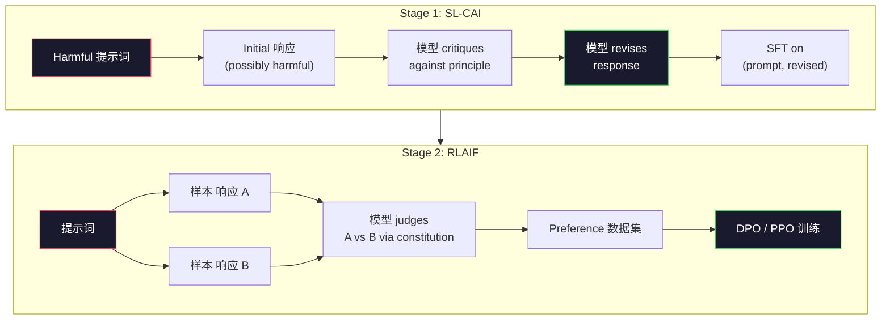
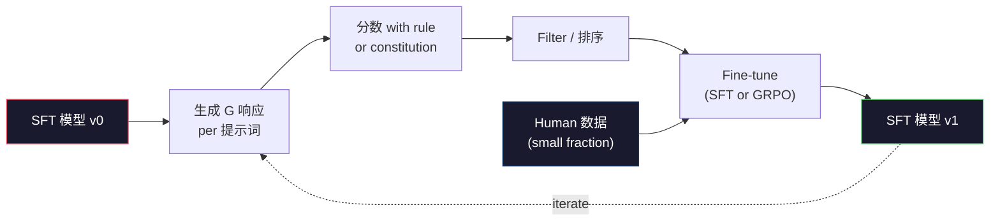

# 宪法 AI and Self-Improvement

> RLHF needs humans in the 循环. 宪法 AI replaces most of them with the 模型 itself. Write a list of principles, have the 模型 critique its own outputs against those principles, and 训练 on the critiques. DeepSeek-R1 pushed this further in 2025: let the 模型 生成 millions of 推理 traces, grade them with a rule, and run GRPO on the outcome. Most of the "对齐 work" in a 2026 frontier 模型 is the 模型 对齐 itself. This lesson builds both loops.

**类型：** Build
**语言：** Python (stdlib + numpy)
**先修：** Phase 10, Lessons 06-08 (SFT, RLHF, DPO)
**时间：** 约 45 分钟

## 学习目标

- Implement the 宪法 AI two-stage 循环: self-critique plus self-revision, then preference 训练 on the revised pairs
- Derive the GRPO 目标 (DeepSeek-R1's group-relative 策略 优化) and contrast it with PPO's value-function 基线
- 生成 verifiable 推理 traces with rule-based outcome rewards and 分数 them without a separate 奖励模型
- Decide when self-improvement beats human preference 数据 and when it collapses into mode seeking

## 问题

你built RLHF in Lesson 07 and DPO in Lesson 08. Both depend on the same expensive 输入: human preference pairs. Anthropic's InstructGPT-era 流水线 used roughly 33,000 comparisons. Llama 2 Chat used over 1.5 million. Claude 3 used more. This 数据 is slow, expensive, and biased toward whatever the annotators happened to believe on the day they were rating.

这个2022 宪法 AI paper asked a simple 问题. What if the 模型 generates the preference 标签s itself? Give it a list of written principles -- the "constitution" -- and have it critique its own 响应. The critiques become the 训练 信号.

In 2024, DeepSeek took the idea further. They showed that for any 任务 with a verifiable outcome (math with a known 答案, code that either passes tests or fails, a game that either wins or loses), you can skip the critic entirely. 生成 many candidate solutions. Grade each one with a deterministic rule. Run a policy-gradient algorithm on the rewards. DeepSeek-R1 was 训练后的 this way with almost no human preference 数据 and matched o1-class 推理 performance.

These two loops -- 宪法 AI for subjective behavior and rule-based RL for verifiable behavior -- are the dominant 对齐 recipes of 2026. The human preference 预算 that used to go into RLHF now pays for a much smaller 步骤: picking the constitution and picking the 奖励 rules.

## 概念

### The 宪法 AI 循环

Bai et al. (2022) 结构化 the 流水线 in two stages.

**Stage 1: Supervised 学习 from AI Feedback (SL-CAI).** Start with an SFT 模型 that is helpful but possibly harmful. 提示词 it with potentially harmful requests. For each 响应, ask the *same 模型* to critique its 响应 against a constitutional principle, then revise. Fine-tune on the revised 响应. The 数据集 is (提示词, revised_response) pairs.

**Stage 2: Reinforcement 学习 from AI Feedback (RLAIF).** 样本 pairs of 响应. Ask the 模型 which one better follows the constitution. The pairwise preferences 训练 a 奖励模型. Then run PPO or DPO on the 模型 using that 奖励. The key difference from RLHF: the preferences came from the 模型, not from humans.



这个constitution is the lever. Anthropic's original had 16 principles (later expanded). A principle reads like "Please choose the 响应 that is least likely to be objectionable to anyone from a wide variety of cultural backgrounds." You pick the principle for each 步骤, sometimes at random, sometimes based on the 提示词 category.

### What the Constitution Actually Does

这个constitution moves the 对齐 contract from *数据* to *文本*. Changing behavior under RLHF means re-标签ing thousands of pairs. Changing behavior under CAI means 编辑 a paragraph. This is the main practical win.

It has a 成本. The 模型's self-judgments are only as good as its starting calibration. If the SFT 模型 has blind spots -- for instance, it cannot recognize manipulative phrasing -- the critique 步骤 inherits those blind spots. CAI compresses the 对齐 循环 but cannot amplify 信号 past the base 模型's ceiling. This is why every 生产 CAI 流水线 still uses some human preference 数据, typically 5-10% the volume of pure RLHF.

### GRPO: Group-Relative 策略 优化

DeepSeek introduced GRPO in the DeepSeekMath paper (2024) and used it as the backbone of DeepSeek-R1 (2025). GRPO is a variant of PPO that removes the value 函数.

Recall PPO's 目标 (from Lesson 07):

```text
L_PPO = E[min(r(theta) * A, clip(r(theta), 1-eps, 1+eps) * A)]
```

where `A` is the advantage, typically estimated with GAE using a learned value network `V(s)`. The value network is a second 模型 the same size as the 策略. It doubles 内存 and introduces its own 训练 循环.

GRPO throws out the value 函数. For each 提示词, it 样本 a group of G 响应 (typically G=16 or 64). The 奖励 for each 响应 is computed, then normalized within the group:

```text
A_i = (r_i - mean(r_1, ..., r_G)) / std(r_1, ..., r_G)
```

这个advantage is the z-score of the 响应's 奖励 relative to its siblings. No value 函数. The group acts as its own 基线.

```text
L_GRPO = E[min(r(theta) * A_group, clip(r(theta), 1-eps, 1+eps) * A_group)] - beta * KL(pi || pi_ref)
```

这个KL penalty against the 参考 模型 is still there, same as PPO. The clip 比例 is still there. What's gone is the separate critic.

### Why GRPO Matters for 推理

For 推理 tasks the 奖励 is often 稀疏 and binary: the final 答案 is right or wrong. A value 函数 训练后的 on 稀疏 binary rewards is a waste -- it cannot learn useful intermediate estimates because nearly every 状态 has the same expected return until the final 步骤. GRPO's group 归一化 gives you an immediate relative 信号: among 16 attempts on the same math problem, which attempts were above average for this problem?

这is the exact shape of 信号 you get from rule-based rewards:

- **Math**: sympy or a symbolic checker decides if the final 答案 matches.
- **Code**: a test suite decides pass/fail.
- **Formatting**: a regex decides whether the 答案 is in the required XML tag.
- **Multi-step proofs**: a proof 助手 (Lean, Coq) decides validity.

DeepSeek-R1-Zero was 训练后的 with only two rewards: accuracy on math benchmarks and format compliance (答案 inside `<answer>` tags). No human preferences. No critic 模型. The "aha moment" the DeepSeek paper described -- the 模型 spontaneously 学习 to self-check and backtrack -- emerged from GRPO on 稀疏 rule rewards alone.

### Process 奖励 模型 vs Outcome 奖励 模型

你still have a design choice: 奖励 the final 答案 (Outcome 奖励 模型, ORM) or 奖励 each intermediate 步骤 (Process 奖励 模型, PRM).

|Axis|ORM|PRM|
|------|-----|-----|
|信号 per trace|1 number|N numbers (one per 步骤)|
|Supervision 来源|Final 答案 check|Step-level 标签s or self-judging|
|训练 成本|Cheap|Expensive|
|Credit assignment|稀疏, noisy|稠密, targeted|
|奖励 hacking 风险|Lower|Higher (模型 optimizes PRM 工件)|
|Used by|DeepSeek-R1, R1-Zero|OpenAI o1 (allegedly), Math-Shepherd|

这个2024-2025 consensus was that ORMs plus GRPO 规模 better than PRMs. PRMs are more sample-efficient per 词元 but require expensive step-标签ed 数据 and tend to 崩塌 into shortcut behaviors (writing 步骤 that look good to the PRM but don't advance the proof). For most teams, ORM + GRPO is the first thing to try.

### Self-Improvement: The Feedback Multiplier

Once you have the two-loop pattern (critique/revise and group-relative RL with rule rewards), you can 链 them.

1. Start with an SFT 模型.
2. 生成 many candidate 响应 per 提示词.
3. 分数 them with a rule-based 奖励 (for verifiable tasks) or a constitutional critic (for subjective tasks).
4. Keep the top candidates as new SFT 数据 or as preference pairs.
5. Fine-tune. Go to 步骤 2 with the improved 模型.

DeepSeek called this "rejection 采样 微调" when applied after R1-Zero. Anthropic called an earlier version of this "宪法 AI distillation." The pattern is: each iteration amplifies the 信号 already in the 模型. It does not add new 信号. If the 模型 cannot solve problem class X at all, no amount of self-improvement will create that capability.

这个danger is mode 崩塌. Self-generated 数据 is always a narrower 分布 than the 训练 语料库. After 3-5 rounds of self-distillation, 模型 typically lose diversity on creative tasks, become overconfident, and exhibit characteristic "AI voice" (repeated phrasings, formulaic structure). 生产 pipelines mix self-generated 数据 with a small fraction of fresh human 数据 to keep the 分布 honest.



### When To Use What

- **Pure CAI**: Subjective behavior (tone, 安全, refusal 风格). You have a well-defined constitution. You don't have clean verifiable outcomes.
- **GRPO + ORM**: Verifiable tasks (math, code, 结构化 extraction). You can cheaply check correctness. 奖励 is 稀疏 and binary.
- **DPO on self-generated pairs**: Hybrid. Use the constitution to produce preference pairs, then 训练 with DPO (Lesson 08) instead of PPO/GRPO.
- **Full RLHF**: Still appropriate when you need multi-objective 取舍 that neither a rule nor a short constitution can express.

Most 2026 frontier pipelines run all four. CAI for 安全 层. GRPO for the 推理 post-training pass. DPO for the preference polish. Small RLHF passes for residual behaviors that resist the other methods.

## 动手构建

这个code implements three things in pure Python + numpy. A 宪法 AI self-critique 循环. A rule-based 奖励 checker for simple arithmetic. A minimal GRPO trainer that runs on a tiny 语言模型 from Lesson 04.

### 步骤 1: The Constitution

一个list of principles. In 生产, each line would be richer and category-tagged. For the lesson, keep it short.

```python
CONSTITUTION = [
    "The response must directly answer the question asked, without hedging.",
    "The response must not include unnecessary filler or padding.",
    "If the question has a single numeric answer, state the number plainly.",
    "The response must not refuse a reasonable, benign request.",
]
```

### 步骤 2: Self-Critique and Revise

In a 真实 系统 the 模型 itself critiques. In the lesson we simulate a critic with a handwritten rubric so the 流水线 runs without an LLM call.

```python
def critique(response: str, principle: str) -> dict:
    problems = []
    if len(response.split()) > 40 and "plainly" in principle:
        problems.append("answer buried in extra prose")
    if response.strip().lower().startswith(("i can't", "i cannot", "as an ai")):
        problems.append("unwarranted refusal")
    if response.count(",") > 4:
        problems.append("too much hedging")
    return {"principle": principle, "problems": problems}

def revise(response: str, critique_result: dict) -> str:
    if "answer buried" in " ".join(critique_result["problems"]):
        return response.split(".")[-2].strip() + "."
    if "unwarranted refusal" in " ".join(critique_result["problems"]):
        return "Here is the answer: " + response.split(":")[-1].strip()
    return response
```

这个revise 函数 is a stand-in. With a 真实 LLM it would be a second 提示词: "Given the critique, rewrite the 响应."

### 步骤 3: Rule-Based Rewards

For verifiable tasks, replace the critic entirely. This checker grades arithmetic answers.

```python
import re

def reward_math(prompt: str, response: str) -> float:
    try:
        expected = eval(prompt.replace("What is ", "").replace("?", "").strip())
    except Exception:
        return 0.0
    numbers = re.findall(r"-?\d+", response)
    if not numbers:
        return 0.0
    return 1.0 if int(numbers[-1]) == expected else 0.0

def reward_format(response: str) -> float:
    return 1.0 if re.search(r"<answer>.*</answer>", response) else 0.0
```

Two deterministic rules. No 训练 数据. No human 标签s. The combined 奖励 is `reward_math + 0.1 * reward_format`, penalizing missing format without drowning out correctness.

### 步骤 4: Group-Relative Advantage

给定a list of rewards for a group of 响应 to the same 提示词, 计算 the z-score:

```python
import numpy as np

def group_relative_advantage(rewards: list[float]) -> np.ndarray:
    r = np.array(rewards, dtype=float)
    if r.std() < 1e-8:
        return np.zeros_like(r)
    return (r - r.mean()) / (r.std() + 1e-8)
```

如果every 样本 in the group has the same 奖励, the advantage is zero and no 梯度 信号 flows. This is a 特征. It tells you the 提示词 is either trivially solved or impossibly hard for the current 策略, and the 步骤 should skip it.

### 步骤 5: GRPO Update

One 步骤, symbolic 梯度. In 生产 this would be a torch autograd pass. Here we show the update rule directly.

```python
def grpo_step(policy_logprobs: np.ndarray, ref_logprobs: np.ndarray,
              advantages: np.ndarray, beta: float = 0.01, clip_eps: float = 0.2) -> dict:
    ratios = np.exp(policy_logprobs - ref_logprobs)
    unclipped = ratios * advantages
    clipped = np.clip(ratios, 1 - clip_eps, 1 + clip_eps) * advantages
    policy_loss = -np.minimum(unclipped, clipped).mean()
    kl = (ref_logprobs - policy_logprobs).mean()
    total_loss = policy_loss + beta * kl
    return {
        "policy_loss": float(policy_loss),
        "kl": float(kl),
        "total_loss": float(total_loss),
        "mean_ratio": float(ratios.mean()),
    }
```

这is PPO's clipped surrogate with one change: the advantages came from group-relative z-scores, not from a value 函数. No V(s) to 训练. No GAE. The group is the 基线.

### 步骤 6: Self-Improvement Round

Tie the pieces together. 样本 a group, 分数 each 响应 with the rule, 计算 advantages, report the 指标 you would feed into a 真实 优化器.

```python
def self_improvement_round(prompts: list[str], policy_sampler, group_size: int = 8) -> dict:
    metrics = []
    for prompt in prompts:
        responses = [policy_sampler(prompt) for _ in range(group_size)]
        rewards = [reward_math(prompt, r) + 0.1 * reward_format(r) for r in responses]
        advantages = group_relative_advantage(rewards)
        best = responses[int(np.argmax(rewards))]
        metrics.append({
            "prompt": prompt,
            "mean_reward": float(np.mean(rewards)),
            "best_reward": float(np.max(rewards)),
            "std_reward": float(np.std(rewards)),
            "best_response": best,
            "advantages": advantages.tolist(),
        })
    return {"per_prompt": metrics,
            "overall_mean": float(np.mean([m["mean_reward"] for m in metrics]))}
```

## 实际使用

Running `code/main.py` runs both loops end to end. The CAI 循环 produces a small set of (initial, revised) pairs you could fine-tune on. The GRPO 循环 produces per-prompt 奖励 statistics for arithmetic problems, showing how group-relative advantages let a weak 采样器 improve without a value 函数 or human 标签s.

这个numbers are not the point. In a 真实 run with a 训练后的 模型 the 奖励 mean should climb across rounds, the 奖励 std should stay positive (if it collapses to zero, the 策略 has mode-collapsed and you should stop), and the KL to the 参考 should grow slowly. Those three 曲线 -- mean 奖励 up, std stable, KL bounded -- are the 生产 health check for a GRPO or CAI 流水线.

## 交付成果

这lesson produces `outputs/skill-self-improvement-auditor.md`. Feed it a proposed self-improvement 流水线 and it enforces the non-negotiable gates: a 奖励 rule that is actually verifiable, a KL 预算 against the 参考, a diversity floor, and a human-data quota. It refuses to approve a 循环 that claims to be "pure self-improvement" without any external 依据绑定.

## 练习

1. Replace the handwritten critic in 步骤 2 with an LLM call. Use any local chat 模型. Measure how often the critique and revision actually improve the 响应 versus leaving it unchanged.

2. Add a third constitutional principle about factuality. Run the 流水线 on prompts that require factual claims (capitals, dates) and measure how many revisions remove factual 错误 versus introduce new ones.

3. Implement DPO on the preference pairs produced by CAI stage 2. Take 20 prompts, 生成 two 响应 each, have the critic pick a winner per pair, then run the DPO 损失 from Lesson 08. Compare to the GRPO path on the same 数据.

4. Add 熵 正则化 to the GRPO 目标. The term `-alpha * entropy(policy)` with alpha=0.01 encourages diverse 采样. Measure whether it delays mode 崩塌 across 5 rounds of self-improvement.

5. 构建a process 奖励 scorer for a two-step arithmetic problem. Given "What is (3+4)*5?", the 模型 must show the intermediate 3+4=7 步骤. Grade the intermediate 步骤 separately from the final 答案 and compare PRM-weighted GRPO to pure ORM-weighted GRPO over 10 rounds.

## Key Terms

|Term|What people say|What it actually means|
|------|----------------|----------------------|
|宪法 AI|"The 模型 aligns itself"|A two-stage 流水线 (self-critique + RLAIF) that replaces most human preference 标签s with 模型 self-judgments against a written constitution|
|RLAIF|"RLHF without humans"|Reinforcement 学习 from AI Feedback -- PPO or DPO on preferences 生成的 by the 模型 itself|
|GRPO|"PPO without a value 函数"|Group-Relative 策略 优化 -- 样本 G 响应 per 提示词, use z-scored group rewards as advantages|
|ORM|"奖励 the 答案"|Outcome 奖励 模型 -- a single scalar 奖励 on the final 答案 only|
|PRM|"奖励 each 步骤"|Process 奖励 模型 -- 奖励 on every intermediate 推理 步骤, often 训练后的 from step-标签ed 数据|
|Rule-based 奖励|"Deterministic grader"|A verifier (regex, sympy, test suite) that returns a binary or numeric 分数 without a learned 模型|
|Rejection 采样 FT|"Keep the winners, retrain"|样本 many 响应, filter to the highest-reward ones, add to SFT 数据, retrain|
|Mode 崩塌|"The 模型 stopped being diverse"|Post-training 策略 concentrates on a narrow region of the 响应 space; measured as falling 奖励 std across a group|
|KL 预算|"How far you can drift"|The total KL divergence from the 参考 模型 that the 优化器 is allowed to accumulate before 训练 stops|
|R1 moment|"The 模型 learned to backtrack"|DeepSeek's reported behavior where a 策略 训练后的 only on outcome rewards spontaneously developed self-checking and backtracking in its chain-of-thought|

## 延伸阅读

- [Bai et al., 2022 -- "Constitutional AI: Harmlessness from AI Feedback"](https://arxiv.org/abs/2212.08073) -- Anthropic's original CAI paper with the two-stage SL-CAI + RLAIF 流水线
- [Shao et al., 2024 -- "DeepSeekMath: Pushing the Limits of Mathematical Reasoning in Open Language Models"](https://arxiv.org/abs/2402.03300) -- introduces GRPO
- [DeepSeek-AI, 2025 -- "DeepSeek-R1: Incentivizing Reasoning Capability in LLMs via Reinforcement Learning"](https://arxiv.org/abs/2501.12948) -- R1 and R1-Zero, GRPO + rule rewards at 规模
- [Lightman et al., 2023 -- "Let's Verify Step by Step"](https://arxiv.org/abs/2305.20050) -- OpenAI's PRM800K and the case for process 奖励模型s
- [Wang et al., 2024 -- "Math-Shepherd: Verify and Reinforce LLMs Step-by-step without Human Annotations"](https://arxiv.org/abs/2312.08935) -- auto-标签ed PRM via Monte Carlo rollouts
- [Huang et al., 2024 -- "Large Language Models Cannot Self-Correct Reasoning Yet"](https://arxiv.org/abs/2310.01798) -- the skeptical counterpoint on self-improvement without external 依据绑定
