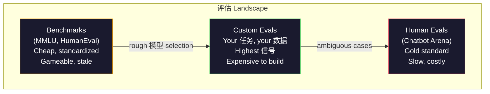
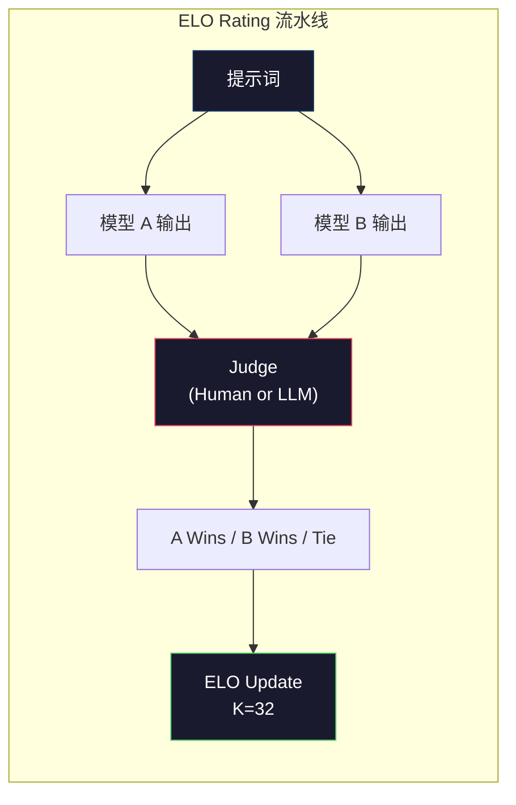

# 评估: Benchmarks, Evals, LM Harness

> Goodhart's Law: when a measure becomes a 目标, it ceases to be a good measure. Every frontier lab games benchmarks. MMLU scores go up while 模型 still can't reliably count the number of R's in "strawberry." The only 评估 that matters is YOUR 评估 -- on YOUR 任务, with YOUR 数据.

**类型：** Build
**语言：** Python
**先修：** Phase 10, Lessons 01-05 (LLMs from Scratch)
**时间：** 约 90 分钟

## 学习目标

- 构建a custom 评估 harness that runs multiple-choice and open-ended benchmarks against a 语言模型
- 解释why standard benchmarks (MMLU, HumanEval) saturate and fail to differentiate frontier 模型
- Implement task-specific evals with proper 指标: exact match, F1, BLEU, and LLM-as-judge scoring
- Design a custom 评估 suite targeting your specific use case rather than relying solely on public leaderboards

## 问题

MMLU was published in 2020 with 15,908 问题 across 57 subjects. Within three years, frontier 模型 saturated it. GPT-4 scored 86.4%. Claude 3 Opus scored 86.8%. Llama 3 405B scored 88.6%. The leaderboard compressed into a 3-point range where differences are statistical 噪声, not 真实 capability gaps.

Meanwhile, those same 模型 fail at tasks that a 10-year-old handles without thinking. Claude 3.5 Sonnet, scoring 88.7% on MMLU, initially could not count the letters in "strawberry" -- a 任务 that requires zero world knowledge and zero 推理, just character-level iteration. HumanEval tests code 生成 with 164 problems. 模型 分数 90%+ on it while still producing code that crashes on 边 cases any junior developer would catch.

这个gap between 基准 performance and real-world reliability is the central problem of LLM 评估. Benchmarks tell you how a 模型 performs on the 基准. They tell you almost nothing about how that 模型 will perform on your specific 任务, with your specific 数据, under your specific failure modes. If you are building a customer support bot, MMLU is irrelevant. If you are building a code 助手, HumanEval only covers function-level 生成 -- it says nothing about 调试, refactoring, or explaining code across files.

你need custom evals. Not because benchmarks are useless -- they are useful for rough 模型 selection -- but because the final 评估 must match your deployment conditions exactly.

## 概念

### The 评估 Landscape

There are three categories of 评估, each with different 成本 and 信号 质量.

**Benchmarks** are standardized test suites. MMLU, HumanEval, SWE-bench, MATH, ARC, HellaSwag. You run a 模型 against the 基准 and get a 分数. The advantage: everyone uses the same test, so you can compare 模型. The disadvantage: 模型 and 训练 数据 increasingly contaminate these benchmarks. Labs 训练 on 数据 that includes 基准 问题. Scores go up. Capability may not.

**Custom evals** are test suites you build for your specific use case. You define the inputs, the expected outputs, and the scoring 函数. A legal 文档 summarizer gets evaluated on legal 文档. A SQL 生成器 gets evaluated on your database 模式. These are expensive to create but they are the only 评估 that predicts 生产 performance.

**Human evals** use paid annotators to judge 模型 outputs on criteria like helpfulness, correctness, fluency, and 安全. The gold standard for open-ended tasks where automated scoring fails. Chatbot Arena has collected over 2 million human preference votes across 100+ 模型. The downside: 成本 ($0.10-$2.00 per judgment) and speed (小时 to days).



### Why Benchmarks Break

Three mechanisms cause 基准 scores to stop reflecting 真实 capability.

**数据 contamination.** 训练 corpora scrape the internet. 基准 问题 live on the internet. 模型 see the answers during 训练. This is not cheating in the traditional sense -- labs do not intentionally include 基准 数据. But web-scale scraping makes it nearly impossible to exclude.

**Teaching to the test.** Labs 优化 训练 mixtures for 基准 performance. If 5% of the 训练 mix is MMLU-style multiple choice, the 模型 learns the format and the 答案 分布. MMLU is 4-way multiple choice. 模型 learn that the 答案 分布 is approximately uniform across A/B/C/D, which helps even when the 模型 does not know the 答案.

**Saturation.** When every frontier 模型 scores 85-90% on a 基准, the 基准 stops discriminating. The remaining 10-15% of 问题 may be ambiguous, mis标签ed, or require obscure 领域 knowledge. Improving from 87% to 89% on MMLU may mean the 模型 memorized two more obscure 问题, not that it got smarter.

### Perplexity: A Quick Health Check

Perplexity measures how surprised a 模型 is by a 序列 of 词元. Formally, it is the exponentiated average negative log-likelihood:

```text
PPL = exp(-1/N * sum(log P(token_i | context)))
```

一个perplexity of 10 means the 模型 is, on average, as uncertain as choosing uniformly among 10 options at each 词元 position. Lower is better. GPT-2 gets a perplexity of ~30 on WikiText-103. GPT-3 gets ~20. Llama 3 8B gets ~7.

Perplexity is useful for comparing 模型 on the same 测试集, but it has blind spots. A 模型 can have low perplexity by being good at predicting common patterns while being terrible at rare but important patterns. It also says nothing about instruction following, 推理, or factual accuracy. Use it as a sanity check, not a final verdict.

### LLM-as-Judge

使用a strong 模型 to evaluate a weaker 模型's 输出. The idea is simple: ask GPT-4o or Claude Sonnet to 速率 a 响应 on a 1-5 规模 for correctness, helpfulness, and 安全. This 成本 about $0.01 per judgment with GPT-4o-mini and correlates surprisingly well with human judgments -- around 80% agreement on most tasks.

这个scoring 提示词 matters more than the 模型. A vague 提示词 ("速率 this 响应") produces noisy scores. A 结构化 提示词 with a rubric ("分数 5 if the 答案 is factually correct and cites a 来源, 4 if correct but unsourced, 3 if partially correct...") produces consistent, reproducible scores.

失败模式s: judge 模型 exhibit position 偏差 (prefer the first 响应 in pairwise comparisons), verbosity 偏差 (prefer longer 响应), and self-preference (GPT-4 rates GPT-4 outputs higher than equivalent Claude outputs). Mitigations: randomize order, normalize for length, use a different judge than the 模型 being evaluated.

### ELO Ratings from Pairwise Comparisons

Chatbot Arena's approach. Show two 响应 to the same 提示词 from different 模型. A human (or LLM judge) picks the better one. From thousands of these comparisons, 计算 an ELO rating for each 模型 -- the same 系统 used in chess.

ELO advantages: relative 排序 is more reliable than absolute scoring, handles ties gracefully, and converges with fewer comparisons than scoring every 输出 independently. As of early 2026, Chatbot Arena ranks show GPT-4o, Claude 3.5 Sonnet, and Gemini 1.5 Pro within 20 ELO points of each other at the top.



### 评估 Frameworks

**lm-evaluation-harness** (EleutherAI): the standard open-source 评估 framework. Supports 200+ benchmarks. Run any Hugging Face 模型 against MMLU, HellaSwag, ARC, etc. with one command. Used by the 开放 LLM Leaderboard.

**RAGAS**: 评估 framework specifically for RAG pipelines. Measures faithfulness (does the 答案 match the 检索到的 上下文?), relevance (is the 检索到的 上下文 relevant to the 问题?), and 答案 correctness.

**promptfoo**: config-driven 评估 for 提示词工程. Define test cases in YAML, run against multiple 模型, get a pass/fail report. Useful for 回归 测试 prompts -- make sure a 提示词 change does not break existing test cases.

### Building Custom Evals

这个only 评估 that matters for 生产. The process:

1. **Define the 任务.** What exactly should the 模型 do? Be precise. "答案 问题" is too vague. "Given a customer complaint email, extract the product name, issue category, and sentiment" is a 任务 you can evaluate.

2. **Create test cases.** Minimum 50 for a prototype 评估, 200+ for 生产. Each test case is an (输入, expected_output) pair. Include 边 cases: empty inputs, adversarial inputs, ambiguous inputs, inputs in other languages.

3. **Define scoring.** Exact match for 结构化输出. BLEU/ROUGE for 文本 相似度. LLM-as-judge for open-ended 质量. F1 for extraction tasks. Combine multiple 指标 with 权重.

4. **Automate.** Every 评估 runs with one command. No manual 步骤. Store results in a format that enables comparison over time.

5. **Track over time.** An 评估 分数 is meaningless in isolation. You need the trendline. Did the 分数 improve after the last 提示词 change? Did it regress after switching 模型? Version your 评估 alongside your prompts.

|评估 类型|成本 per judgment|Agreement with humans|Best for|
|-----------|------------------|----------------------|----------|
|Exact match|~$0|100% (when applicable)|结构化 输出, 分类|
|BLEU/ROUGE|~$0|~60%|Translation, summarization|
|LLM-as-judge|~$0.01|~80%|Open-ended 生成|
|Human 评估|$0.10-$2.00|N/A (is the ground truth)|Ambiguous, high-stakes tasks|

```figure
perplexity-loss
```

## 动手构建

### 步骤 1: A Minimal 评估 Framework

Define the core abstractions. An 评估 case has an 输入, an expected 输出, and an optional metadata dict. A scorer takes a 预测 and a 参考 and returns a 分数 between 0 and 1.

```python
import json
from collections import Counter

class EvalCase:
    def __init__(self, input_text, expected, metadata=None):
        self.input_text = input_text
        self.expected = expected
        self.metadata = metadata or {}

class EvalSuite:
    def __init__(self, name, cases, scorers):
        self.name = name
        self.cases = cases
        self.scorers = scorers

    def run(self, model_fn):
        results = []
        for case in self.cases:
            prediction = model_fn(case.input_text)
            scores = {}
            for scorer_name, scorer_fn in self.scorers.items():
                scores[scorer_name] = scorer_fn(prediction, case.expected)
            results.append({
                "input": case.input_text,
                "expected": case.expected,
                "prediction": prediction,
                "scores": scores,
            })
        return results
```

### 步骤 2: Scoring 函数

构建exact match, 词元 F1, and a simulated LLM-as-judge scorer.

```python
def exact_match(prediction, expected):
    return 1.0 if prediction.strip().lower() == expected.strip().lower() else 0.0

def token_f1(prediction, expected):
    pred_tokens = set(prediction.lower().split())
    exp_tokens = set(expected.lower().split())
    if not pred_tokens or not exp_tokens:
        return 0.0
    common = pred_tokens & exp_tokens
    precision = len(common) / len(pred_tokens)
    recall = len(common) / len(exp_tokens)
    if precision + recall == 0:
        return 0.0
    return 2 * (precision * recall) / (precision + recall)

def llm_judge_simulated(prediction, expected):
    pred_words = set(prediction.lower().split())
    exp_words = set(expected.lower().split())
    if not exp_words:
        return 0.0
    overlap = len(pred_words & exp_words) / len(exp_words)
    length_penalty = min(1.0, len(prediction) / max(len(expected), 1))
    return round(overlap * 0.7 + length_penalty * 0.3, 3)
```

### 步骤 3: ELO Rating 系统

Implement pairwise comparisons with ELO updates. This is exactly the 系统 Chatbot Arena uses to 排序 模型.

```python
class ELOTracker:
    def __init__(self, k=32, initial_rating=1500):
        self.ratings = {}
        self.k = k
        self.initial_rating = initial_rating
        self.history = []

    def _ensure_player(self, name):
        if name not in self.ratings:
            self.ratings[name] = self.initial_rating

    def expected_score(self, rating_a, rating_b):
        return 1 / (1 + 10 ** ((rating_b - rating_a) / 400))

    def record_match(self, player_a, player_b, outcome):
        self._ensure_player(player_a)
        self._ensure_player(player_b)

        ea = self.expected_score(self.ratings[player_a], self.ratings[player_b])
        eb = 1 - ea

        if outcome == "a":
            sa, sb = 1.0, 0.0
        elif outcome == "b":
            sa, sb = 0.0, 1.0
        else:
            sa, sb = 0.5, 0.5

        self.ratings[player_a] += self.k * (sa - ea)
        self.ratings[player_b] += self.k * (sb - eb)

        self.history.append({
            "a": player_a, "b": player_b,
            "outcome": outcome,
            "rating_a": round(self.ratings[player_a], 1),
            "rating_b": round(self.ratings[player_b], 1),
        })

    def leaderboard(self):
        return sorted(self.ratings.items(), key=lambda x: -x[1])
```

### 步骤 4: Perplexity Calculation

计算 perplexity using 词元 概率. In practice you would get these from the 模型's logits. Here we simulate with a 概率 分布.

```python
import numpy as np

def perplexity(log_probs):
    if not log_probs:
        return float("inf")
    avg_neg_log_prob = -np.mean(log_probs)
    return float(np.exp(avg_neg_log_prob))

def token_log_probs_simulated(text, model_quality=0.8):
    np.random.seed(hash(text) % 2**31)
    tokens = text.split()
    log_probs = []
    for i, token in enumerate(tokens):
        base_prob = model_quality
        if len(token) > 8:
            base_prob *= 0.6
        if i == 0:
            base_prob *= 0.7
        prob = np.clip(base_prob + np.random.normal(0, 0.1), 0.01, 0.99)
        log_probs.append(float(np.log(prob)))
    return log_probs
```

### 步骤 5: Aggregate Results

计算 summary statistics across an 评估 run: mean, median, pass 速率 at a 阈值, and per-metric breakdowns.

```python
def summarize_results(results, threshold=0.8):
    all_scores = {}
    for r in results:
        for metric, score in r["scores"].items():
            all_scores.setdefault(metric, []).append(score)

    summary = {}
    for metric, scores in all_scores.items():
        arr = np.array(scores)
        summary[metric] = {
            "mean": round(float(np.mean(arr)), 3),
            "median": round(float(np.median(arr)), 3),
            "std": round(float(np.std(arr)), 3),
            "min": round(float(np.min(arr)), 3),
            "max": round(float(np.max(arr)), 3),
            "pass_rate": round(float(np.mean(arr >= threshold)), 3),
            "n": len(scores),
        }
    return summary

def print_summary(summary, suite_name="Eval"):
    print(f"\n{'=' * 60}")
    print(f"  {suite_name} Summary")
    print(f"{'=' * 60}")
    for metric, stats in summary.items():
        print(f"\n  {metric}:")
        print(f"    Mean:      {stats['mean']:.3f}")
        print(f"    Median:    {stats['median']:.3f}")
        print(f"    Std:       {stats['std']:.3f}")
        print(f"    Range:     [{stats['min']:.3f}, {stats['max']:.3f}]")
        print(f"    Pass rate: {stats['pass_rate']:.1%} (threshold >= 0.8)")
        print(f"    N:         {stats['n']}")
```

### 步骤 6: Run the Full 流水线

Wire everything together. Define a 任务, create test cases, simulate two 模型, run evals, 计算 ELO from pairwise comparisons, and print the leaderboard.

```python
def demo_model_good(prompt):
    responses = {
        "What is the capital of France?": "Paris",
        "What is 2 + 2?": "4",
        "Who wrote Hamlet?": "William Shakespeare",
        "What language is PyTorch written in?": "Python and C++",
        "What is the boiling point of water?": "100 degrees Celsius",
    }
    return responses.get(prompt, "I don't know")

def demo_model_bad(prompt):
    responses = {
        "What is the capital of France?": "Paris is the capital city of France",
        "What is 2 + 2?": "The answer is four",
        "Who wrote Hamlet?": "Shakespeare",
        "What language is PyTorch written in?": "Python",
        "What is the boiling point of water?": "212 Fahrenheit",
    }
    return responses.get(prompt, "Unknown")

cases = [
    EvalCase("What is the capital of France?", "Paris"),
    EvalCase("What is 2 + 2?", "4"),
    EvalCase("Who wrote Hamlet?", "William Shakespeare"),
    EvalCase("What language is PyTorch written in?", "Python and C++"),
    EvalCase("What is the boiling point of water?", "100 degrees Celsius"),
]

suite = EvalSuite(
    name="General Knowledge",
    cases=cases,
    scorers={
        "exact_match": exact_match,
        "token_f1": token_f1,
        "llm_judge": llm_judge_simulated,
    },
)

results_good = suite.run(demo_model_good)
results_bad = suite.run(demo_model_bad)

print_summary(summarize_results(results_good), "Model A (concise)")
print_summary(summarize_results(results_bad), "Model B (verbose)")
```

这个"good" 模型 gives exact answers. The "bad" 模型 gives verbose paraphrases. Exact match punishes the verbose 模型 severely. 词元 F1 and LLM-as-judge are more forgiving. This illustrates why 指标 choice matters: the same 模型 looks great or terrible depending on how you 分数 it.

### 步骤 7: ELO Tournament

运行pairwise comparisons between 模型 across multiple rounds.

```python
elo = ELOTracker(k=32)

for case in cases:
    pred_a = demo_model_good(case.input_text)
    pred_b = demo_model_bad(case.input_text)

    score_a = token_f1(pred_a, case.expected)
    score_b = token_f1(pred_b, case.expected)

    if score_a > score_b:
        outcome = "a"
    elif score_b > score_a:
        outcome = "b"
    else:
        outcome = "tie"

    elo.record_match("model_a_concise", "model_b_verbose", outcome)

print("\nELO Leaderboard:")
for name, rating in elo.leaderboard():
    print(f"  {name}: {rating:.0f}")
```

### 步骤 8: Perplexity Comparison

比较perplexity across "模型" of different 质量 levels.

```python
test_text = "The quick brown fox jumps over the lazy dog in the garden"

for quality, label in [(0.9, "Strong model"), (0.7, "Medium model"), (0.4, "Weak model")]:
    log_probs = token_log_probs_simulated(test_text, model_quality=quality)
    ppl = perplexity(log_probs)
    print(f"  {label} (quality={quality}): perplexity = {ppl:.2f}")
```

## 实际使用

### lm-evaluation-harness (EleutherAI)

这个standard 工具 for running benchmarks on any 模型.

```python
# pip install lm-eval
# Command line:
# lm_eval --model hf --model_args pretrained=meta-llama/Llama-3.1-8B --tasks mmlu --batch_size 8

# Python API:
# import lm_eval
# results = lm_eval.simple_evaluate(
#     model="hf",
#     model_args="pretrained=meta-llama/Llama-3.1-8B",
#     tasks=["mmlu", "hellaswag", "arc_easy"],
#     batch_size=8,
# )
# print(results["results"])
```

### promptfoo

Config-driven 评估 for 提示词工程. Define tests in YAML and run against multiple providers.

```yaml
# promptfoo.yaml
providers:
  - openai:gpt-4o-mini
  - anthropic:claude-3-haiku

prompts:
  - "Answer in one word: {{question}}"

tests:
  - vars:
      question: "What is the capital of France?"
    assert:
      - type: contains
        value: "Paris"
  - vars:
      question: "What is 2 + 2?"
    assert:
      - type: equals
        value: "4"
```

### RAGAS for RAG 评估

```python
# pip install ragas
# from ragas import evaluate
# from ragas.metrics import faithfulness, answer_relevancy, context_precision
#
# result = evaluate(
#     dataset,
#     metrics=[faithfulness, answer_relevancy, context_precision],
# )
# print(result)
```

RAGAS measures what generic evals miss: whether the 模型's 答案 is 有依据的 in the 检索到的 上下文, not just whether the 答案 is "correct" in the abstract.

## 交付成果

这lesson produces `outputs/prompt-eval-designer.md` -- a 可复用 提示词 that designs custom 评估 suites for any 任务. Give it a 任务 描述 and it generates test cases, scoring 函数, and a pass/fail 阈值 recommendation.

It also produces `outputs/skill-llm-evaluation.md` -- a decision framework for choosing the right 评估 strategy based on your 任务 type, 预算, and 延迟 requirements.

## 练习

1. Add a "consistency" scorer that runs the same 输入 through the 模型 5 times and measures how often the outputs match. Inconsistent answers on deterministic inputs reveal fragile prompts or high temperature settings.

2. Extend the ELO tracker to support multiple judge 函数 (exact match, F1, LLM-as-judge) and 权重 them. Compare how the leaderboard changes when you 权重 exact match heavily versus F1 heavily.

3. 构建an 评估 suite for a specific 任务: email 分类 into 5 categories. Create 100 test cases with diverse examples including 边 cases (emails that could belong to multiple categories, empty emails, emails in other languages). Measure how different "模型" (rule-based, keyword 匹配, simulated LLM) perform.

4. Implement contamination detection: given a set of 评估 问题 and a 训练 语料库, check what percentage of 评估 问题 (or close paraphrases) appear in the 训练 数据. This is how researchers audit 基准 validity.

5. 构建a "模型 diff" 工具. Given 评估 results from two 模型 versions, highlight which specific test cases improved, which regressed, and which stayed the same. This is the 评估 equivalent of a code diff -- essential for understanding whether a change helped or hurt.

## Key Terms

|Term|What people say|What it actually means|
|------|----------------|----------------------|
|MMLU|"The 基准"|Massive Multitask Language Understanding -- 15,908 multiple choice 问题 across 57 subjects, saturated above 88% by 2025|
|HumanEval|"Code 评估"|164 Python function-completion problems from OpenAI, tests only isolated 函数 生成|
|SWE-bench|"真实 coding 评估"|2,294 GitHub issues from 12 Python repos, measures end-to-end bug fixing including test 生成|
|Perplexity|"How confused the 模型 is"|exp(-avg(log P(token_i given context))) -- lower means the 模型 assigns higher 概率 to the actual 词元|
|ELO rating|"Chess 排序 for 模型"|A relative skill rating computed from pairwise win/损失 records, used by Chatbot Arena to 排序 100+ 模型|
|LLM-as-judge|"Using AI to grade AI"|A strong 模型 scores a weaker 模型's outputs against a rubric, ~80% agreement with human judges at ~$0.01/judgment|
|数据 contamination|"The 模型 saw the test"|训练 数据 includes 基准 问题, inflating scores without improving 真实 capability|
|评估 suite|"A bunch of tests"|A versioned collection of (输入, expected_output, scorer) triples that measure a specific capability|
|Pass 速率|"What percentage it gets right"|Fraction of 评估 cases scoring above a 阈值 -- more actionable than mean 分数 because it measures reliability|
|Chatbot Arena|"模型 排序 website"|LMSYS platform with 2M+ human preference votes, producing the most trusted LLM leaderboard via ELO ratings|

## 延伸阅读

- [Hendrycks et al., 2021 -- "Measuring Massive Multitask Language Understanding"](https://arxiv.org/abs/2009.03300) -- the MMLU paper, still the most cited LLM 基准 despite its saturation
- [Chen et al., 2021 -- "Evaluating Large Language Models Trained on Code"](https://arxiv.org/abs/2107.03374) -- the HumanEval paper from OpenAI, established code 生成 评估 methodology
- [Zheng et al., 2023 -- "Judging LLM-as-a-Judge"](https://arxiv.org/abs/2306.05685) -- systematic analysis of using LLMs to evaluate LLMs, including position 偏差 and verbosity 偏差 findings
- [LMSYS Chatbot Arena](https://chat.lmsys.org/) -- crowdsourced 模型 comparison platform with 2M+ votes, the most trusted real-world LLM 排序
